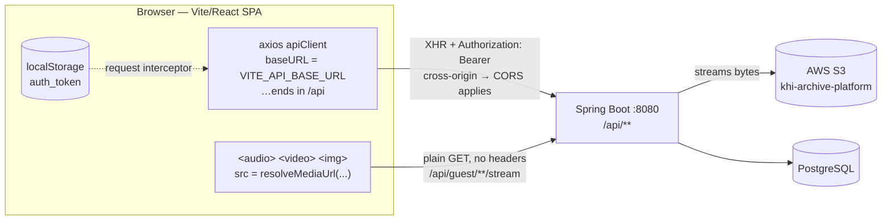
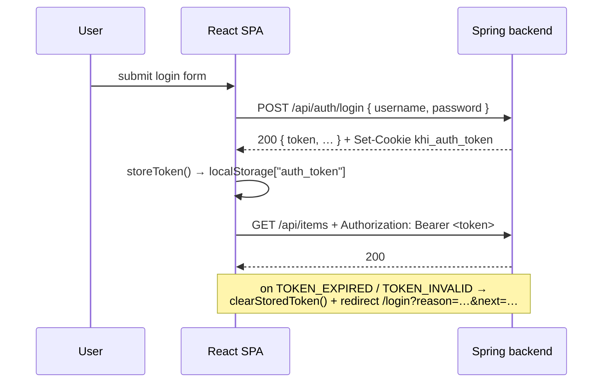
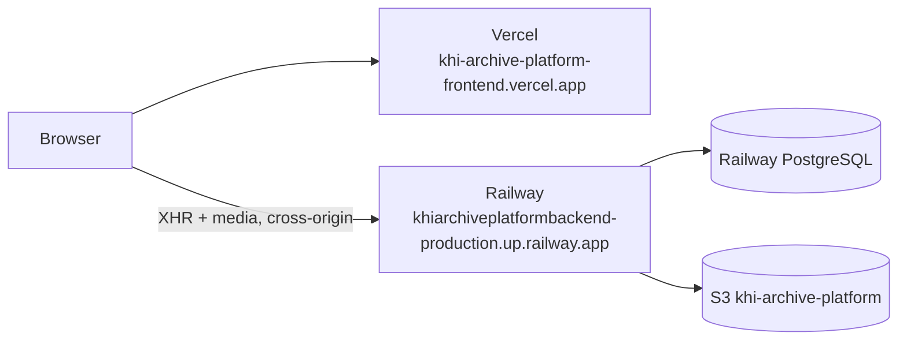

# Backend ↔ Frontend Integration

> **Audience:** anyone who has to run, change or debug the Archive Platform as a whole ·
> **Scope:** how `khi_archive_platform_backend` connects to `khi_archive_platform_frontend`, on this
> Mac and in production ·
> **Sources read:** `src/main/resources/application.yaml`, `pom.xml`,
> `user/configs/SecurityConfig.java`, `user/configs/AppCorsProperties.java`,
> `platform/config/WebConfig.java`, `user/api/UserAPI.java`,
> `platform/seed/SeedDataLoader.java`, and, in the frontend repo, `src/lib/api-client.js`,
> `src/lib/auth-storage.js`, `src/lib/media-url.js`, `src/lib/multipart-upload.js`,
> `src/services/*.js`, `vite.config.js`, `.env.development`, `.env.production`, `vercel.json` ·
> **Verified:** 2026-09-01

The rest of `docs/` describes the backend from the inside — endpoints, permissions, schema. This
document describes the **seam**: the single HTTP boundary between the Spring application and the
React SPA that consumes it. Unlike the sister project (the KHI website), this frontend is a plain
browser application talking straight to the API, so CORS, token storage and byte streaming are all
live concerns rather than things a server-side layer hides.

---

## 1. The two repositories on this Mac

| Repository | Path on this machine | Stack | Git remote | Branch |
|---|---|---|---|---|
| **Backend (this repo)** | `~/Desktop/khi_archive_platform_backend` | Spring Boot 4 · Java 21 · PostgreSQL · Caffeine cache · AWS S3 · Apache POI | `github.com/akararkan/khi_archive_platform_backend` | `main` |
| **Frontend** | `~/Desktop/khi_archive_platform_frontend` | Vite 8 · React 19 · react-router-dom 7 · axios · Tailwind 4 · OpenSeadragon · pdf.js · hls.js | `github.com/akararkan/khi_archive_platform_frontend` | `main` |

The backend exposes **36 `*API` controller classes** (~232 request mappings) under a single `/api`
prefix. There is **no Swagger UI here** — `springdoc-openapi` is not a dependency, unlike the KHI
website backend. `docs/external/` and `docs/internal/` are the API reference.

The frontend is a single-page application serving four audiences from one bundle:
`src/pages/public/` (anonymous visitors), `src/pages/employee/`, `src/pages/teacher/` and
`src/pages/admin/`, gated client-side by `RoleRoute` / `ProtectedRoute` / `GuestRoute` in
`src/router/index.jsx`. Client-side gating is convenience only — the real check is `@PreAuthorize`
on every controller method.

---

## 2. The wiring



One sentence: **every call is a real cross-origin browser request.** There is no server-side
rendering layer and no same-origin proxy, so the browser enforces CORS on all of it, the token has to
live somewhere the browser can reach, and media cannot be fetched with an `Authorization` header.
Those three facts explain almost every design decision below.

### The axios client

`src/lib/api-client.js`:

```js
baseURL: import.meta.env.VITE_API_BASE_URL ?? 'http://localhost:8080/api'
timeout: 15000
withCredentials: (import.meta.env.VITE_API_WITH_CREDENTIALS ?? 'false') === 'true'
headers: { 'Content-Type': 'application/json' }
```

- **`baseURL` already ends in `/api`.** Service modules therefore call `/guest/search`,
  `/audio/{code}`, `/auth/login` — never `/api/...`. Prefixing again produces `/api/api/...` and a 404.
- **`timeout: 15000` is a trap for uploads.** `src/lib/multipart-upload.js` exists to override it:
  `timeout: 0`, `maxBodyLength: Infinity`, `maxContentLength: Infinity`,
  `Content-Type: multipart/form-data`. Always route a create/update that carries a file through
  `multipartUploadConfig()`.
- **`withCredentials: true`** is set in both env files, so cookies ride along. That is what makes the
  backend's `allowCredentials(true)` necessary — and what makes a `*` origin illegal.

### Authentication



The backend does two things at once in `withAuthCookie(...)` (`UserAPI`): it returns the JWT in the
response body **and** sets it as the `khi_auth_token` cookie (`JwtCookieProperties`, configured from
`JWT_COOKIE_*` env with defaults `khi_auth_token` / secure / httpOnly / `SameSite=None` / path `/`).

The frontend uses the **body token only**. `src/services/auth.js` reads `token` or `accessToken`
from the response and hands it to `storeToken()`, which writes `localStorage["auth_token"]`
(`src/lib/auth-storage.js`). The request interceptor attaches it as `Authorization: Bearer …` on
every call. The cookie is still set and still travels (because `withCredentials` is on), so either
credential can satisfy the filter — but the header is the path the SPA relies on.

The response interceptor reacts **only** to codes in `TOKEN_REJECTED_CODES` (expired, revoked,
tampered) *and* only when a token was actually sent. It deliberately ignores:

- `BAD_CREDENTIALS` — the login form must keep the user in place;
- `TOKEN_MISSING` — nothing to clear; route guards handle anonymous access.

On a match it clears storage and navigates to `/login?reason=expired|invalid&next=<current path>`.
The original promise still rejects, so per-call toasts and form errors still run.

**Logout is client-side only** in `services/auth.js` (`clearStoredToken()`). The backend has
`POST /api/auth/logout` and `/logout-all`, which blacklist the token and revoke sessions — see
[`external/03-authentication.md`](./external/03-authentication.md). If a "sign out everywhere"
button is required, the server endpoints are what makes an already-signed stateless JWT stop working.

### Media — why no S3 URL ever reaches the browser

`src/lib/media-url.js` documents the contract from the client side, and the backend honours it: media
fields hold **application-relative paths** such as `/api/guest/audio/AUD-001/stream` or
`/api/audio/AUD-001/stream`, not S3 URLs. `resolveMediaUrl()` joins them against the API **origin**
— `new URL(baseURL).origin`, deliberately not `baseURL`, which already ends in `/api` and would
double the segment. Absolute `http(s):`, `blob:` and `data:` values pass through untouched, so the
helper is safe to call on legacy fields that still carry a raw S3 link.

This is the reason `/api/guest/**` is `permitAll()` in `SecurityConfig`. A browser cannot attach an
`Authorization` header to ``, `<audio src>` or `<video src>`; if the byte proxies required a
token, no media would ever render for an anonymous visitor. The five controllers under that prefix —
`GuestSearchAPI`, `AudioStreamAPI`, `VideoStreamAPI`, `ImageStreamAPI`, `TextStreamAPI` — are
permitted for *every* method, so preflights and anonymous GETs both pass, and access control moves
into the handlers (`removedAt IS NULL`, public-visibility checks). Authenticated staff use the
non-guest twins (`/api/audio/{code}/stream`), which do require a token and are therefore fetched as
blobs rather than assigned to a `src`.

Range requests matter here: hls.js and the native players seek by sending `Range:`, and the proxies
answer `206 Partial Content`. See [`external/07-streaming.md`](./external/07-streaming.md).

### Query-parameter conventions worth knowing on the client

`src/services/guest.js` disables axios bracket indexes (`paramsSerializer: { indexes: null }`)
because Spring binds repeated arrays as `?types=image&types=audio`, not `?types[0]=image`. Any new
service that sends an array filter must do the same.

Building the search page is the place this bites first: `tag`, `keyword`, `subject` and `genre` all
repeat. See [`external/11-search-frontend-guide.md`](./external/11-search-frontend-guide.md) for the
full search UI — service module, URL-as-state, fetch hook, components — against the API documented
in [`external/10-website-search.md`](./external/10-website-search.md).

---

## 3. CORS — read this before changing an origin

CORS is configured in **two layers**, both fed by `AppCorsProperties`
(`@ConfigurationProperties("app.cors")`):

1. **`WebConfig.corsFilter()`** — a standalone `CorsFilter` bean at
   `Ordered.HIGHEST_PRECEDENCE`, so it runs **before Spring Security**. This is what guarantees that
   a 401, 403 or 500 still carries `Access-Control-Allow-Origin`, and therefore that the browser
   shows the real error instead of a generic "CORS error".
2. **`WebConfig.addCorsMappings()`** — the MVC-level fallback for non-security paths.
   `SecurityConfig` uses `.cors(Customizer.withDefaults())`, which picks this up.

The allowlist is a **merge**, computed in `AppCorsProperties.getAllowedOriginsList()`:

```
ALWAYS_ALLOWED_ORIGINS (hardcoded, cannot be switched off)
  http://localhost:5173
  http://localhost:3000
  https://khi-archive-platform-frontend.vercel.app
  https://khi-archive-platform.s3.us-east-1.amazonaws.com
+ CORS_ALLOWED_ORIGINS   (comma-separated env var, empty by default)
```

Two consequences that bite in practice:

- **Exact origins, not patterns.** `WebConfig` calls `config.setAllowedOrigins(...)`, not
  `setAllowedOriginPatterns(...)`. A wildcard like `https://khi-archive-*.vercel.app` will **not**
  match. Every Vercel preview deployment gets its own hostname, so preview URLs must be added to
  `CORS_ALLOWED_ORIGINS` one by one — or you accept that only the production alias works.
- **`allowCredentials(true)` forbids `*`.** With credentials enabled the spec bans a wildcard origin,
  which is why the list is explicit.

`OPTIONS /**` is `permitAll()` in `SecurityConfig`, so preflights never hit an authorization rule.

---

## 4. The authorization model, from the client's side

`SecurityConfig` is short because almost all the work is delegated:

| Matcher | Rule |
|---|---|
| `OPTIONS /**` | `permitAll()` |
| `/api/auth/register`, `/register-with-image`, `/login` | `permitAll()` |
| `/api/guest/**` | `permitAll()` — every method |
| `/api/**` | `authenticated()` |
| anything else | `authenticated()` |

Fine-grained checks live on the controller methods as `@PreAuthorize`, against four roles — `GUEST`,
`EMPLOYEE`, `TEACHER`, `ADMIN` — and 66 `<resource>:<action>` permissions. `EMPLOYEE` carries no
baseline authorities; a seed set is copied into the user's `extraPermissions` when the role is first
assigned, and the admin edits it per user from there. `ADMIN`'s set is locked.

Because the session policy is `STATELESS`, a grant takes effect on the **next token**, not the next
request — the authority set is baked into the JWT. `SecurityContextPersistenceFilter` caching is the
bug that comment in `SecurityConfig` is guarding against. If a permission you just granted seems
ignored, have the user log in again, and read
[`internal/02-authorization.md`](./internal/02-authorization.md).

Errors come back through `JwtAuthenticationEntryPoint` (401) and `JwtAccessDeniedHandler` (403) as a
JSON envelope whose `error` field is a stable code — that is what the frontend's
`TOKEN_REJECTED_CODES` set and `src/lib/error-i18n.js` branch on. Branch on `error`, never on the
HTTP status alone.

---

## 5. Environment variables — the complete matrix

### Backend

There is no `.env` in this repo and none is committed. `spring-dotenv` is on the classpath, and the
IntelliJ run configuration defines no environment block, so a `.env` file at the repository root is
the supported way to run locally — template in §6.

| Variable | Default | Notes |
|---|---|---|
| `PGHOST`, `PGPORT`, `PGDATABASE`, `PGUSER`, `PGPASSWORD` | none | startup fails without them |
| `JWT_SECRET` | none | rotating it invalidates every issued token |
| `JWT_EXPIRATION_MS` | `259200000` (3 days) | |
| `JWT_COOKIE_NAME` | `khi_auth_token` | |
| `JWT_COOKIE_SECURE` | `true` | **set `false` locally** — a `Secure` cookie is dropped on plain `http://localhost` |
| `JWT_COOKIE_HTTP_ONLY` | `true` | |
| `JWT_COOKIE_SAME_SITE` | `None` | required for cross-site XHR with credentials; `None` also implies `Secure` in modern browsers |
| `JWT_COOKIE_PATH` | `/` | |
| `CORS_ALLOWED_ORIGINS` | empty | merged on top of the hardcoded list (§3) |
| `AWS_ACCESS_KEY_ID`, `AWS_SECRET_ACCESS_KEY` | none | read explicitly under `aws.credentials.*` |
| `AWS_REGION` | `us-east-1` | |
| `AWS_S3_BUCKET` | `khi-archive-platform` | |
| `AWS_S3_BASE_FOLDER` | `khi-archive-platform-folders` | |
| `AWS_S3_PERSON_FOLDER` | `persons` | |
| `APP_SEED_LOAD` | **`true`** | see the warning below |
| `APP_SEED_DIR` | `./seed-data` | |
| `PORT` | `8080` | Railway injects this |

> **`APP_SEED_LOAD` defaults to `true`.** The Javadoc on `SeedDataLoader` says the loader is "off by
> default so it never runs in production", but `application.yaml` resolves
> `app.seed.load: ${APP_SEED_LOAD:true}` — so with the env var unset it **does** run, on every start,
> in every environment, reading `./seed-data/*.json`. It is idempotent (records whose business code
> already exists are skipped) and loads in FK order — categories → persons → projects →
> audios/videos/texts/images — so it is not destructive. Still: set `APP_SEED_LOAD=false` anywhere
> you do not want demo rows appearing.

Unlike the KHI website backend, the S3 bucket here **is** env-driven, and credentials are read
explicitly from `aws.credentials.*` rather than through the AWS SDK's default provider chain.

### Frontend

Vite only exposes variables prefixed `VITE_`, and inlines them at **build** time.

| File | Used by | Contents |
|---|---|---|
| `.env.development` | `npm run dev` | `VITE_API_BASE_URL=http://localhost:8080/api`<br/>`VITE_API_WITH_CREDENTIALS=true` |
| `.env.production` | `npm run build` | `VITE_API_BASE_URL=https://khiarchiveplatformbackend-production.up.railway.app/api`<br/>`VITE_API_WITH_CREDENTIALS=true` |
| `.env.example` | template | same as development |

Both are committed and hold no secrets — they are public URLs, and everything in a Vite bundle is
public by definition. Never put a key in a `VITE_` variable.

Note that the dev file points at **localhost**, the opposite of the KHI website repo, whose local
`.env` points at Railway. Running `npm run dev` here therefore requires a local backend.

---

## 6. Running the whole stack locally on this Mac

### What is already installed here

| Tool | Status on this machine |
|---|---|
| JDK | OpenJDK **25.0.2** — the only JDK installed |
| Maven | 3.9.14 (Homebrew), plus `./mvnw` |
| Node | v24.13.0 · npm 11.6.2 · pnpm 10.33.0 |
| PostgreSQL | `postgresql@18` (Homebrew), **running** on `127.0.0.1:5432` |
| Database | **`khi_archive_platform_db`** — already created, owner `khi` |
| Redis | not needed — this backend caches with **Caffeine**, in-process |
| Port 5173 | currently in use by a Vite dev server |

`pom.xml` targets Java 21 while the installed runtime is 25; the Spring Boot parent compiles with
`--release 21`, so builds are fine. Install a JDK 21 only if a library misbehaves on 25.

### Step 1 — PostgreSQL

```bash
brew services list                       # postgresql@18 → started
/opt/homebrew/opt/postgresql@18/bin/psql -l | grep khi_archive_platform_db
```

`ddl-auto: update` — Hibernate applies the schema at startup and there is no migration tool.
The comment in `application.yaml` is worth repeating: **never switch to `create` or `create-drop`**,
because the `sessions` table backs token revocation and dropping it signs out every active login.

### Step 2 — backend `.env`

Create `~/Desktop/khi_archive_platform_backend/.env` (gitignored):

```dotenv
# PostgreSQL — local Homebrew postgresql@18
PGHOST=localhost
PGPORT=5432
PGDATABASE=khi_archive_platform_db
PGUSER=khi
PGPASSWORD=

# JWT
JWT_SECRET=<at least 32 random characters>
JWT_EXPIRATION_MS=259200000
JWT_COOKIE_NAME=khi_auth_token
JWT_COOKIE_SECURE=false        # http://localhost drops a Secure cookie
JWT_COOKIE_SAME_SITE=Lax       # None requires Secure, which localhost cannot provide
JWT_COOKIE_HTTP_ONLY=true
JWT_COOKIE_PATH=/

# CORS — localhost:5173 is already hardcoded; add anything else here
CORS_ALLOWED_ORIGINS=

# AWS — required for uploads and for the byte proxies to have anything to stream
AWS_ACCESS_KEY_ID=<key>
AWS_SECRET_ACCESS_KEY=<secret>
AWS_REGION=us-east-1
AWS_S3_BUCKET=khi-archive-platform

# Seed data — set false once the database has real content
APP_SEED_LOAD=true
APP_SEED_DIR=./seed-data
```

### Step 3 — run the backend

```bash
cd ~/Desktop/khi_archive_platform_backend
./mvnw spring-boot:run
```

`show-sql: true`, `format_sql: true` and `org.hibernate.orm.jdbc.bind: TRACE` are on in this project,
so the console is loud by design — every statement and every bound parameter. Log lines carry a
`traceId` (`%X{traceId}`) that also appears in error responses; quote it when reporting a failure.

There is no Swagger UI, so verify with curl:

```bash
curl -s "localhost:8080/api/guest/search?q=test&perSection=3" | head -40
curl -s -X POST localhost:8080/api/auth/login \
  -H 'Content-Type: application/json' \
  -d '{"username":"<user>","password":"<pass>"}'
```

### Step 4 — run the frontend

```bash
cd ~/Desktop/khi_archive_platform_frontend
npm install          # a pnpm-lock.yaml and pnpm-workspace.yaml are also present —
                     # pick one package manager and stay with it
npm run dev          # http://localhost:5173
```

`.env.development` already points at `http://localhost:8080/api` and `localhost:5173` is already in
the backend's hardcoded CORS list, so no configuration is needed on either side. Port 5173 is
currently occupied — if Vite grabs 5174 instead, add it to `CORS_ALLOWED_ORIGINS`, because the
allowlist is exact-match.

### Port map

| Port | Process |
|---|---|
| 5432 | PostgreSQL 18 (Homebrew) |
| 8080 | this backend (`PORT` env, default 8080) |
| 5173 | Vite dev server |

---

## 7. Production topology



- The SPA is static: `vercel.json` sets `framework: vite`, `outputDirectory: dist`, and rewrites
  `/(.*)` → `/index.html` so react-router's client-side routes survive a hard refresh. Without that
  rewrite, `/admin/items` 404s on reload.
- `server.forward-headers-strategy: framework` makes Spring trust Railway's `X-Forwarded-*`.
- `JWT_COOKIE_SAME_SITE=None` + `Secure` is the correct production pairing: Vercel and Railway are
  different sites, so a `Lax` cookie would not be sent on the SPA's XHR.
- Upload ceiling: Spring allows a 5 GB file inside a 6 GB request; Tomcat's own connector limits are
  disabled (`-1`) because they are 32-bit byte counts that overflow above 2 GB. Whatever sits in
  front of Spring is usually the real ceiling.

---

## 8. Adding an endpoint end to end

1. **Backend** — DTO → service → `*API` controller. Put the authority check on the method with
   `@PreAuthorize`; the only path-level rules in `SecurityConfig` are the auth endpoints and
   `/api/guest/**`.
2. **Public or staff?** If a browser must load it as a bare `src` (media bytes), it has to live under
   `/api/guest/**` and enforce visibility inside the handler. Otherwise leave it authenticated.
3. **Schema** — `ddl-auto: update` adds columns at startup; renames and type changes need hand-written
   SQL.
4. **Frontend service** — a function in `src/services/<domain>.js` calling `apiClient` with a path
   **without** the `/api` prefix. Array filters need `paramsSerializer: { indexes: null }`; file
   payloads need `multipartUploadConfig()`; media paths need `resolveMediaUrl()`.
5. **Frontend UI** — page under `src/pages/{public,employee,teacher,admin}/`, route in
   `src/router/index.jsx` wrapped in the matching guard, field metadata in the relevant
   `src/lib/*-fields-metadata.js` if it feeds a table or form.
6. **Docs** — one page in `docs/external/` or `docs/internal/`, never both.

---

## 9. Troubleshooting

| Symptom | Most likely cause |
|---|---|
| Browser reports a CORS error on **every** call including successful-looking ones | The origin is not in the merged allowlist. It is exact-match — check scheme, host **and** port (5174 ≠ 5173). |
| CORS error only on failures (401/403/500) | The high-precedence `CorsFilter` in `WebConfig` is not running. It must stay at `Ordered.HIGHEST_PRECEDENCE`. |
| 404 on a path that exists | Doubled prefix — `baseURL` already ends in `/api`, so services must call `/guest/search`, not `/api/guest/search`. |
| Login succeeds, next call is 401 | Token not stored: the response field was neither `token` nor `accessToken` (`getTokenFromResponse`). |
| Logged out at random | `JWT_EXPIRATION_MS` elapsed, or the session was revoked — the interceptor redirects with `?reason=expired`. |
| Cookie never appears in DevTools locally | `JWT_COOKIE_SECURE=true` or `SAME_SITE=None` over plain `http://localhost`. |
| Upload dies at ~15 s | Default axios `timeout: 15000` — use `multipartUploadConfig()`. |
| Audio/video will not seek | `Range` handling broken end to end — see `external/07-streaming.md`. |
| Media 404s for an anonymous visitor | Using the authenticated twin instead of the `/api/guest/**` proxy, or the record is not public / is soft-removed. |
| A newly granted permission is ignored | Authorities are baked into the JWT; the user must log in again. |
| Unexpected demo rows in the database | `APP_SEED_LOAD` defaults to `true` — set it `false`. |
| Array filter ignored | axios sent `types[0]=…`; Spring wants repeated `types=…`. Set `paramsSerializer: { indexes: null }`. |
| Hard refresh on `/admin/...` 404s in production | The `vercel.json` SPA rewrite is missing or was overridden. |

---

## See also

- [`README.md`](./README.md) — the documentation index
- [`external/00-overview.md`](./external/00-overview.md) — the exact anonymous surface
- [`external/01-conventions.md`](./external/01-conventions.md) — paging, sorting, CORS, multipart
- [`external/03-authentication.md`](./external/03-authentication.md) — the full cookie/JWT contract
- [`external/07-streaming.md`](./external/07-streaming.md) — byte proxies, `Range`, ETags
- [`internal/02-authorization.md`](./internal/02-authorization.md) — roles, the 66 permissions, the matrix
- `../CHANGELOG.md` — release history
