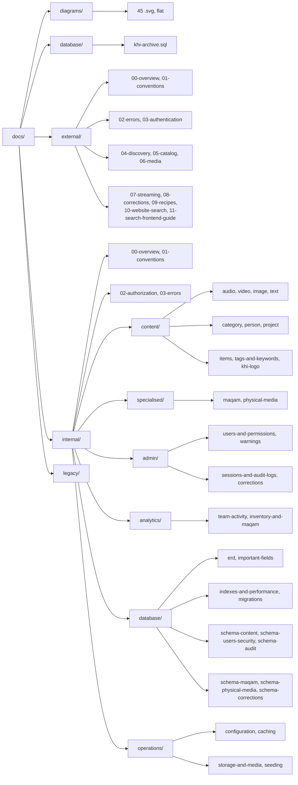

# KHI Archive Platform Documentation

> **Audience:** everyone who calls, operates or extends the backend ·
> **Scope:** `docs/` — the whole documentation set ·
> **Source:** the Java source under `src/main/java/ak/dev/khi_archive_platform/`,
> plus `src/main/resources/application.yaml` and `pom.xml`

This folder is the complete, source-verified reference for the KHI Archive Platform backend
(Spring Boot 4.0.5, Java 21, PostgreSQL, AWS S3). It is split in two by **audience**, not by
feature: [`external/`](./external/README.md) documents everything a public website or third-party
client can call without a staff permission, and [`internal/`](./internal/README.md) documents the
staff back office together with the database and operations layer beneath it. It deliberately does
**not** hold two things. It is not a history — what changed and when lives in
[`../CHANGELOG.md`](../CHANGELOG.md). And it is not the pile of earlier, hand-written feature
write-ups that used to sit at the repository root; those are kept, unedited and clearly marked as
superseded, in [`legacy/`](./legacy/README.md). Above all it is not a substitute for the code: every
page here was written by reading the Java source, and the source stays the final authority.

## Contents

Besides this index, `docs/` holds two documents of its own —
[`TECHNOLOGY_STACK.md`](./TECHNOLOGY_STACK.md) and
[`FRONTEND_INTEGRATION.md`](./FRONTEND_INTEGRATION.md), described just below. Every other page lives
in [`external/`](./external/README.md), [`internal/`](./internal/README.md),
[`diagrams/`](./diagrams/README.md) or [`database/`](./database/README.md). The full set is listed
below in reading order so you can find the right page without opening three indexes.

### `TECHNOLOGY_STACK.md` — what this backend is built from

| File | What it covers | Read it when |
|---|---|---|
| [`TECHNOLOGY_STACK.md`](./TECHNOLOGY_STACK.md) | Every technology in the backend and why it was chosen: Spring Boot 4 and JPA, PostgreSQL doubling as the search engine through `pg_trgm` GIN indexes, the 15 tuned Caffeine caches that replace Redis, the S3 byte-proxy model, the pure-Java media extractors, Apache POI, the async logging pool — plus the frontend's stack and an honest list of dependencies that are declared but never used | You are new to the project, evaluating it, weighing a new dependency, or wondering why something was built the way it was |

### `FRONTEND_INTEGRATION.md` — the backend ↔ frontend seam

| File | What it covers | Read it when |
|---|---|---|
| [`FRONTEND_INTEGRATION.md`](./FRONTEND_INTEGRATION.md) | How this backend and `khi_archive_platform_frontend` fit together: the axios client contract, where the token lives, why media paths are never S3 URLs, the two-layer CORS setup and its exact-match allowlist, every environment variable on both sides, and a step-by-step local run on the development Mac | You are setting the stack up on a new machine, adding an origin, chasing a CORS or 401 error, or wiring a new endpoint all the way through to a page |

### `external/` — public and signed-in-visitor API

| File | What it covers | Read it when |
|---|---|---|
| [`external/00-overview.md`](./external/00-overview.md) | The public surface, the exact list of routes reachable with no token, base URL, content types, and why media bytes never come back as an S3 URL | You are starting a public site and need to know which calls work before anyone logs in |
| [`external/01-conventions.md`](./external/01-conventions.md) | The Spring `Page` envelope, paging and sorting parameters, date and time formats, omitted `null` fields, multipart, CORS, byte-range requests | Your "page 2" request keeps returning page 1, a `sort` value is silently ignored, or the browser blocks the call with a CORS error |
| [`external/02-errors.md`](./external/02-errors.md) | The `ApiErrorResponse` envelope, the complete `ErrorCode` reference grouped by status, categories, and client-side handling | A call failed and you need the exact `error` string to branch on instead of guessing from the HTTP status |
| [`external/03-authentication.md`](./external/03-authentication.md) | Register, register-with-image, login, logout, logout-all, own device sessions, own profile, and the `khi_auth_token` cookie contract | Login returns `200` but the next request comes back `401`, or you need to know what logout does to an already-signed stateless JWT |
| [`external/04-discovery.md`](./external/04-discovery.md) | `GET /api/guest/search`, `/suggest`, `/facets`, `/trending`, and the grouped `/feed` | You are building the home page, a type-ahead search box, or a faceted filter rail |
| [`external/05-catalog.md`](./external/05-catalog.md) | Public projects, categories and persons, their detail views, and the media held inside a project | A record you can see in the back office is missing from the public list and you need the visibility gate spelled out |
| [`external/06-media.md`](./external/06-media.md) | The four public media catalogs — audios, videos, texts, images — with every filter and sort key and the `Guest…DTO` field names | You need the real query-parameter names and response fields for a public media grid |
| [`external/07-streaming.md`](./external/07-streaming.md) | The byte proxies `/stream`, `/view`, `/read`, `/cover`, `Range` handling, ETags and cache headers | An `<audio>` or `<video>` element will not seek, or an image URL returns `404` for an anonymous visitor |
| [`external/08-corrections.md`](./external/08-corrections.md) | `POST /api/corrections`, the submitter's own list and detail, the media-type catalog, and the status lifecycle | You are building the "Help Us" form, or a submitter asks why their suggestion never changed the record |
| [`external/09-recipes.md`](./external/09-recipes.md) | Eight end-to-end `curl` walkthroughs chaining the endpoints above, from home page to correction polling | You would rather copy a working call sequence than assemble one from reference pages |
| [`external/10-website-search.md`](./external/10-website-search.md) | `GET /api/guest/media/search` and `GET /api/guest/media/{type}/{code}` — one keyword across audio, video, image and text, merged and ranked on one scale, with per-kind tab counts, refine facets and a kind-agnostic detail lookup, plus the website integration guide | You are building the public website's search page and want the media the archive holds for a keyword, whichever kind it is |
| [`external/11-search-frontend-guide.md`](./external/11-search-frontend-guide.md) | The frontend implementation guide for the search page: service module, URL-as-state, fetch hook, tab bar, one card for four kinds, refine panel, detail page, RTL, and a QA matrix | You are writing the search UI and want the files in order with the code that goes in them |

### `internal/` — staff back office, database and operations

| File | What it covers | Read it when |
|---|---|---|
| [`internal/00-overview.md`](./internal/00-overview.md) | What the staff surface is for, who uses it, how a request is authorized end to end, and the full controller inventory | You are new to the back-office API and need the lay of the land before picking a page |
| [`internal/01-conventions.md`](./internal/01-conventions.md) | Paged responses, Style-B `@ModelAttribute` filter parameters, adding a sort key, multipart create and update, the trash model, the visibility toggle, caching, auditing, bulk create | A list endpoint ignores the filter you passed, or a multipart create rejects the `data` part |
| [`internal/02-authorization.md`](./internal/02-authorization.md) | The four roles, all 66 `<resource>:<action>` permissions, the complete matrix, `@PreAuthorize` styles, and how an authority set is assembled | A call returns `403` and you need to know which authority it wanted, or a permission you just granted has not taken effect yet |
| [`internal/03-errors.md`](./internal/03-errors.md) | The two `@RestControllerAdvice` classes and where they diverge, the custom-exception inventory, every `details` payload shape, and `traceId` | Two endpoints answer the same kind of failure with different envelopes, or you need the exact `details` shape for a validation error |

### `internal/content/` — the content types

| File | What it covers | Read it when |
|---|---|---|
| [`internal/content/audio.md`](./internal/content/audio.md) | Audio lifecycle: filtered list, fuzzy search, multipart create and update, bulk create, visibility, trash/restore/purge, authenticated range stream | You are building the audio editor, or `audioFileUrl` is not the S3 URL you expected |
| [`internal/content/category.md`](./internal/content/category.md) | The shared classification vocabulary: CRUD, bulk create, per-category keywords, and the `CATEGORY_IN_USE` rule | Deleting a category fails and you need to know what still references it |
| [`internal/content/image.md`](./internal/content/image.md) | Image records: list and search, multipart create, whole-document update, bulk create, visibility, trash lifecycle, byte proxy | You are building the image editor or need its filter and sort catalog |
| [`internal/content/items.md`](./internal/content/items.md) | `GET /api/items` — the four media read-caches merged into one paged, searchable, sortable grid carrying both a flat summary and the full per-type DTO | You need one back-office grid across audio, video, image and text without four parallel calls |
| [`internal/content/khi-logo.md`](./internal/content/khi-logo.md) | The site-branding logo row: upload, replace, fetch, hard delete — no trash, no visibility flag, no audit trail | You are wiring the site logo and wondering why it has no trash or restore |
| [`internal/content/person.md`](./internal/content/person.md) | The person authority list: names, classification enums, fuzzy birth and death dates, portrait upload, and the trash cascade to projects | You are building the person register, or trashing a person removed more than you expected |
| [`internal/content/project.md`](./internal/content/project.md) | Projects (collections): create single and bulk, update, public visibility with optional cascade to child media, trash lifecycle | You flipped a project to public and the media inside it stayed hidden |
| [`internal/content/tags-and-keywords.md`](./internal/content/tags-and-keywords.md) | How tags and keywords are canonicalized on save, the two autocompletes, and the admin rename/merge/delete vocabulary tools | A tag you typed comes back changed, or an autocomplete keeps returning a value you already renamed |
| [`internal/content/text.md`](./internal/content/text.md) | Text and book records — PDF, EPUB, DOCX, TXT, HTML — with the trash lifecycle and the two byte proxies for the file and its cover | You are building the book editor, or the cover image is not rendering |
| [`internal/content/video.md`](./internal/content/video.md) | Video records: list and search, multipart create, partial update, bulk create, visibility, trash lifecycle, range-streaming proxy | You are building the video editor or need its filter and sort catalog |

### `internal/specialised/` — domain modules

| File | What it covers | Read it when |
|---|---|---|
| [`internal/specialised/maqam.md`](./internal/specialised/maqam.md) | List-of-Maqam records, the 1–3 teacher panel, voting, the listen-tracked audio stream, trash, and `MAQAM_PANEL_ACCESS_DENIED` | You are building the teacher voting panel, or a TEACHER gets `403` on a record they were assigned |
| [`internal/specialised/physical-media.md`](./internal/specialised/physical-media.md) | The physical artefact inventory, its type catalog, the Apache POI `.xlsx` import with header-name resolution and dedupe, and admin trash | You are importing the archive spreadsheet, or an import run reports rows it skipped |

### `internal/admin/` — administration

| File | What it covers | Read it when |
|---|---|---|
| [`internal/admin/corrections.md`](./internal/admin/corrections.md) | The correction review queue: search, forward to the record's author as a warning, apply, reject, and the audit trail | A visitor's suggestion is sitting in `PENDING` and you need to know what each disposition actually writes |
| [`internal/admin/sessions-and-audit-logs.md`](./internal/admin/sessions-and-audit-logs.md) | Device sessions and how they are revoked, plus the read side of `user_audit_logs` | You must force a still-unexpired token to stop working, or answer "who changed this account, and when" |
| [`internal/admin/users-and-permissions.md`](./internal/admin/users-and-permissions.md) | The account register: create, edit, change role, grant and revoke individual authorities, deactivate or lock, hard delete — all audited | You are building the admin console, or a grant was accepted but the user still cannot call the endpoint |
| [`internal/admin/warnings.md`](./internal/admin/warnings.md) | In-app warnings from admin to staff: severity levels, the acknowledgement lifecycle, the admin surface and the recipient's inbox | You are building the notification bell, or a revoked warning is still showing up |

### `internal/analytics/` — reporting

| File | What it covers | Read it when |
|---|---|---|
| [`internal/analytics/inventory-and-maqam.md`](./internal/analytics/inventory-and-maqam.md) | State snapshots rather than activity: how many items exist right now, how many are trashed, what is public, and maqam panel and vote standings | A dashboard tile needs a current count instead of a trend over a date window |
| [`internal/analytics/team-activity.md`](./internal/analytics/team-activity.md) | Twelve read-only "who did what, when" reports built from a `UNION ALL` over the audit tables, with the shared filter semantics | You are composing the admin activity dashboard, or two reports disagree and you need the filter rules |

### `internal/database/` — schema and performance

| File | What it covers | Read it when |
|---|---|---|
| [`internal/database/erd.md`](./internal/database/erd.md) | Mermaid ER diagrams of all 59 tables, grouped by area, plus the relationship inventory and table index | You need to see how a table connects to the rest before writing a join |
| [`internal/database/important-fields.md`](./internal/database/important-fields.md) | The nine conventions that repeat across almost every table — business codes, soft delete, visibility, timestamps, enums, tag collections, media URLs, `version` — with a query cookbook | You are about to write your first SQL against this database and do not want to count trashed rows |
| [`internal/database/indexes-and-performance.md`](./internal/database/indexes-and-performance.md) | How indexes are created at boot, the `pg_trgm` extension, two-phase fuzzy search, the full index inventory, Hibernate tuning, and how to diagnose a slow endpoint | A list or search endpoint got slow and you need to know which index should have caught it |
| [`internal/database/migrations.md`](./internal/database/migrations.md) | How schema change actually works here — Hibernate `ddl-auto: update` plus hand-written initializer beans — what that does not do, recipes, and safety | You need to add a column, an index or a CHECK constraint and there is no Flyway to put it in |
| [`internal/database/schema-audit.md`](./internal/database/schema-audit.md) | Every `*_audit_logs` table, column by column, and the common audit-log shape they share | You are querying the audit trail directly or adding a new audited domain |
| [`internal/database/schema-content.md`](./internal/database/schema-content.md) | The content core: `audios`, `videos`, `images`, `texts`, `projects`, `categories`, `persons` and their `@ElementCollection` side tables | You need the real column names and types behind a content endpoint |
| [`internal/database/schema-corrections.md`](./internal/database/schema-corrections.md) | `guest_corrections` and `guest_correction_audit_logs`, including which records a suggestion may target | You are reporting on corrections, or checking whether a suggestion can target a non-public record |
| [`internal/database/schema-maqam.md`](./internal/database/schema-maqam.md) | `list_of_maqam`, `maqam_teacher_votes` and the per-play `maqam_audio_listen_sessions` log | You are analysing votes or listening data outside the API |
| [`internal/database/schema-physical-media.md`](./internal/database/schema-physical-media.md) | `physical_media` as a 1:1 mirror of the 29-column source sheet, `physical_media_types`, the seeded catalog, and the natural key that is not enforced | Duplicate inventory rows appeared, or an import column is not landing where you expect |
| [`internal/database/schema-users-security.md`](./internal/database/schema-users-security.md) | `users_tbl`, `user_permissions`, `sessions`, `token_blacklist`, `user_warnings`, and the columns that must never reach an API response | You are working on auth data, or need to see how JWT revocation is represented in rows |

### `internal/operations/` — running the service

| File | What it covers | Read it when |
|---|---|---|
| [`internal/operations/caching.md`](./internal/operations/caching.md) | The Caffeine cache — not Redis — the per-entity `ReadCache` pattern, the eviction wiring, endpoints that bypass it, and stale-data troubleshooting | An update succeeded but the list endpoint still shows the old value |
| [`internal/operations/configuration.md`](./internal/operations/configuration.md) | Every environment variable, the `.env` file, an `application.yaml` walkthrough, the settings that break a running deployment, and local setup | You are standing up an environment, or a setting change took the service down |
| [`internal/operations/seeding.md`](./internal/operations/seeding.md) | The two ways to fill an empty database, what lives in `seed-data/`, the root `test-*-1000.json` fixtures, and how to turn seeding off | You need realistic data in a fresh database — or you need to make certain seeding never touches production |
| [`internal/operations/storage-and-media.md`](./internal/operations/storage-and-media.md) | S3 configuration, the object-key layout, the upload path, metadata extraction, the serve path, deletion semantics and operational concerns | You are changing how files are stored or served, or an upload landed under an unexpected key |

### `diagrams/` — the visual reference

| File | What it covers | Read it when |
|---|---|---|
| [`diagrams/README.md`](./diagrams/README.md) | The index for all 45 diagrams — starting with `er-00-full-schema.svg`, all 59 tables on one sheet — plus a "which diagram answers which question" table and the shape and color conventions | You would rather see the shape of something than read about it |

45 diagrams across three families — 14 entity-relationship, 19 UML (8 class, 8 sequence, 3 state)
and 12 process flowcharts. One flat folder, no subfolders: 45 `.svg` files and the index above.
[`diagrams/er-00-full-schema.svg`](./diagrams/er-00-full-schema.svg) is the whole database — all
59 tables and every relationship between them — on a single sheet.

### `database/` — the runnable SQL

| File | What it covers | Read it when |
|---|---|---|
| [`database/README.md`](./database/README.md) | The section map for [`database/khi-archive.sql`](./database/khi-archive.sql) — one file, twelve sections: search and audit-log index DDL, the enum `CHECK` re-sync, the idempotent backfills, schema and integrity diagnostics, and six query cookbooks | You have a `psql` prompt open and want the statement, not the prose around it |

## Subfolders

| Folder | What it covers |
|---|---|
| [`external/`](./external/README.md) | The public / anonymous and signed-in-visitor surface: the read-only `/api/guest/**` catalog, search and byte proxies, register and login, a visitor's own profile and sessions, and correction submission. **No staff permission is ever required here.** |
| [`internal/`](./internal/README.md) | The staff back office plus the database and operations layer: content CRUD, trash and visibility, bulk create, vocabularies, maqam voting, physical-media inventory and import, user and permission administration, warnings, audit logs, analytics, schema, indexes, caching, configuration, S3 and seeding. **Never for public consumption.** |
| [`diagrams/`](./diagrams/README.md) | 45 rendered diagrams of the schema, the object model and the runtime processes, flat in one folder as `.svg` files with an index beside them. Includes the full 59-table ER wall chart. |
| [`database/`](./database/README.md) | One runnable file, `khi-archive.sql`, holding every statement the docs refer to in twelve numbered sections: index DDL, enum `CHECK` constraint re-sync, idempotent backfills, schema and integrity diagnostics, and query cookbooks per domain. The prose that explains it stays in [`internal/database/`](./internal/README.md). |
| [`legacy/`](./legacy/README.md) | The earlier hand-written feature notes that this set replaces, kept verbatim for provenance and clearly marked superseded. Read only to see what an older document claimed; trust `external/` and `internal/` for current behavior. |

## Start here

1. Decide which half you are in. If your client never sends a staff permission, read
   [`external/00-overview.md`](./external/00-overview.md); if it does, read
   [`internal/00-overview.md`](./internal/00-overview.md).
2. Read that half's conventions page before any endpoint page —
   [`external/01-conventions.md`](./external/01-conventions.md) or
   [`internal/01-conventions.md`](./internal/01-conventions.md). Paging, sorting, dates and
   multipart are documented once there and never repeated.
3. Read how failure is reported: [`external/02-errors.md`](./external/02-errors.md), and for staff
   clients also [`internal/02-authorization.md`](./internal/02-authorization.md), which explains
   every `403` you will meet.
4. Go to the endpoint page you actually need — the folder tables above, or
   [`external/09-recipes.md`](./external/09-recipes.md) if you want a working call sequence first.
5. If you are touching the database or the deployment rather than the API, start at
   [`internal/database/important-fields.md`](./internal/database/important-fields.md) and
   [`internal/operations/configuration.md`](./internal/operations/configuration.md).

## Conventions

Know these before reading anything else. Each is documented once and referenced everywhere.

- **Auth model** — JWT, accepted two ways: `Authorization: Bearer <token>` is read first and the
  HttpOnly `khi_auth_token` cookie is the fallback. See
  [`external/03-authentication.md`](./external/03-authentication.md#the-auth-cookie-contract).
- **Roles and authorities** — `GUEST`, `EMPLOYEE`, `TEACHER`, `ADMIN`, plus per-user
  `<resource>:<action>` grants. See
  [`internal/02-authorization.md`](./internal/02-authorization.md#the-four-roles) and the
  [permission matrix](./internal/02-authorization.md#permission-matrix).
- **Error envelope** — every failure under `/api/**` returns an `ApiErrorResponse`; branch on the
  `error` code, not the HTTP status. See [`external/02-errors.md`](./external/02-errors.md) and
  [`internal/03-errors.md`](./internal/03-errors.md).
- **Pagination** — list endpoints return the standard Spring `Page` envelope with a zero-based
  `page`. See [`external/01-conventions.md`](./external/01-conventions.md#pagination) and
  [`internal/01-conventions.md`](./internal/01-conventions.md#paged-responses).
- **Sorting and filtering** — staff list endpoints take Style-B `@ModelAttribute` filter objects;
  unknown keys are ignored rather than rejected. See
  [`internal/01-conventions.md`](./internal/01-conventions.md) and
  [`external/01-conventions.md`](./external/01-conventions.md#sorting).
- **`{{BASE_URL}}`** — every example uses this placeholder for the API origin, for example
  `http://localhost:8080`. No production hostname appears anywhere in these docs. See
  [`external/00-overview.md`](./external/00-overview.md#base-url).
- **Timestamps** — serialized in `Asia/Baghdad`, dates as `yyyy-MM-dd` and date-times as
  `yyyy-MM-dd HH:mm:ss`. See
  [`external/01-conventions.md`](./external/01-conventions.md#dates-and-times).
- **Omitted `null` fields** — responses drop null properties, so an absent key means "no value",
  not "field removed". See
  [`external/01-conventions.md`](./external/01-conventions.md#omitted-null-fields).
- **Trash, not delete** — `DELETE` soft-trashes; restore and purge are admin operations, and list
  endpoints show active rows only. See
  [`internal/01-conventions.md`](./internal/01-conventions.md#the-trash-model).
- **Media is proxied, never linked** — the API returns its own stream path, never an S3 URL. See
  [`external/00-overview.md`](./external/00-overview.md#media-never-leaves-through-an-s3-url) and
  [`internal/operations/storage-and-media.md`](./internal/operations/storage-and-media.md).

## How this set was built

Every page in `external/` and `internal/` was written by reading the Java source directly —
controllers for paths, methods and `@PreAuthorize` strings; DTOs and entities for field names and
types; services for behavior and side effects; the exception handlers for the error envelope and
codes; and `application.yaml`, `pom.xml` and the `platform/config/` and `user/configs/` initializer
beans for configuration, schema and startup work. Nothing was carried over from the older feature
write-ups now in [`legacy/`](./legacy/README.md), and nothing was inferred from an endpoint's name.

Each page was then re-checked against the same source in a separate adversarial pass whose job was
to falsify it: confirm that every documented route exists with that exact method and prefix, that
every authority string matches the annotation verbatim, that every JSON field is really produced by
the response type, and that every error code is really reachable. Claims that could not be
confirmed were removed or written as `_Not documented in source._` rather than guessed. That pass
is also why several pages call out discrepancies in the code instead of smoothing them over.

**These docs describe `main` at commit `2bb4e82`** (the tree as of 2026-08-26; last code commit
2026-07-30). They carry no version number of their own because the project has never cut a release
— see the note at the top of [`../CHANGELOG.md`](../CHANGELOG.md).

To keep them current:

1. **Change the code and the doc in the same commit.** A new endpoint, a renamed field, a changed
   `@PreAuthorize` or a new `ErrorCode` is a documentation change too.
2. **Use the `Source:` line.** Every page's front-matter blockquote names the exact files it was
   built from. If your diff touches one of those files, that page needs a look.
3. **Re-read, do not recall.** Verify against the annotation and the DTO, not against what the doc
   already says — a stale doc is more convincing than no doc.
4. **Update the folder index too.** Adding or removing a page means a new row in that folder's
   `README.md` `## Contents` table, and in the tables above.
5. **Record the change in [`../CHANGELOG.md`](../CHANGELOG.md)** so the history stays outside the
   reference pages.
6. **Follow the file anatomy.** Endpoint pages use one fixed shape — summary, `## Access` table,
   `## Endpoints` table, then per-endpoint sections with parameters, response, errors and a
   `{{BASE_URL}}` curl example. Match the neighbours rather than inventing a layout.

## Documentation map

## Related

- [`external/README.md`](./external/README.md) — index of the public and visitor-facing surface
- [`internal/README.md`](./internal/README.md) — index of the staff, database and operations surface
- [`diagrams/README.md`](./diagrams/README.md) — the index for all 45 diagrams, including the
  full 59-table ER wall chart
- [`database/README.md`](./database/README.md) — the runnable SQL: index DDL, constraint re-sync,
  backfills, diagnostics and query cookbooks
- [`legacy/README.md`](./legacy/README.md) — the superseded hand-written notes and what replaced each
- [`../CHANGELOG.md`](../CHANGELOG.md) — retroactively reconstructed history of every commit on `main`
