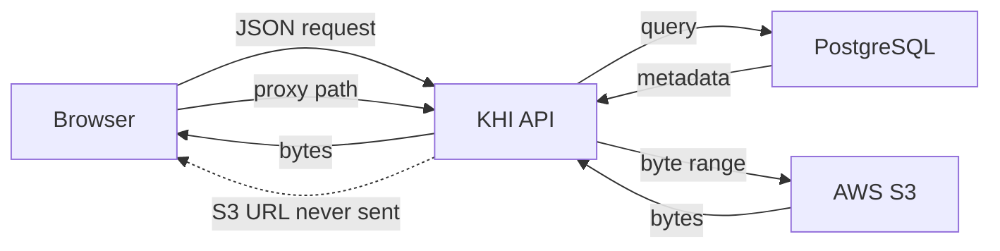

# Overview

> **Audience:** public website, anonymous visitors, third-party clients ·
> **Base path:** `/api` ·
> **Source:** `src/main/java/ak/dev/khi_archive_platform/user/configs/SecurityConfig.java`,
> `src/main/java/ak/dev/khi_archive_platform/platform/api/guest/GuestSearchAPI.java`,
> `src/main/java/ak/dev/khi_archive_platform/platform/api/guest/GuestMediaSearchAPI.java`,
> `src/main/resources/application.yaml`

The KHI Archive Platform backend is a Spring Boot 4.0.5 / Java 21 application that serves a
cultural-heritage archive of audio recordings, videos, texts, images, the projects that group
them, the persons they are about, and the categories they are filed under. This folder documents
the **external** surface only: everything a public website or an anonymous visitor can call.
The staff back-office surface is documented separately in [`../internal/`](../internal/).

## What the external surface exposes

| Capability | Where it lives | Token required |
|---|---|---|
| Public catalog browsing — projects, categories, persons | `GET /api/guest/projects`, `/categories`, `/persons` | No |
| Public media listings and detail — audios, videos, texts, images | `GET /api/guest/audios`, `/videos`, `/texts`, `/images` | No |
| Search, autocomplete, facets, trending, grouped feed | `GET /api/guest/search`, `/suggest`, `/facets`, `/trending`, `/feed` | No |
| Website search — one keyword, all four media kinds merged and ranked, plus a kind-agnostic detail lookup | `GET /api/guest/media/search`, `/api/guest/media/{type}/{code}` | No |
| Media playback and reading — byte-streaming proxies | `GET /api/guest/{kind}/{code}/stream`, `/view`, `/read`, `/cover` | No |
| Registration and login | `POST /api/auth/register`, `/register-with-image`, `/login` | No |
| Logout, own sessions, own profile | `POST /api/auth/logout`, `/logout-all`; `/api/auth/sessions/**`; `/api/user/**` | Yes |
| Correction submission — the "Help Us" form | `POST /api/corrections`; `GET /api/corrections/me`, `/me/{id}`, `/catalog/media-types` | Yes, `isAuthenticated()` only |

No staff permission (`<resource>:<action>`) is ever needed for anything in this folder. The
corrections group is the only external one behind a token that writes anything outside the
caller's own account, and it is gated by a class-level `@PreAuthorize("isAuthenticated()")` on
`GuestCorrectionAPI` — no role or permission beyond being signed in. Every other token-gated
endpoint here acts on the caller's own account.

## Endpoints reachable without a token

`SecurityConfig.securityFilterChain` declares five authorization rules, evaluated top to
bottom. The first three are the only `permitAll()` rules in the application; the last two make
everything else require a valid token.

| Rule in `SecurityConfig` | Effect |
|---|---|
| `.requestMatchers(HttpMethod.OPTIONS, "/**").permitAll()` | Every CORS preflight passes |
| `.requestMatchers("/api/auth/register", "/api/auth/register-with-image", "/api/auth/login").permitAll()` | The three token-issuing endpoints |
| `.requestMatchers("/api/guest/**").permitAll()` | The entire public read-only API, all methods |
| `.requestMatchers("/api/**").authenticated()` | Everything else needs a valid token |
| `.anyRequest().authenticated()` | Non-`/api` paths need a valid token |

The `/api/guest/**` matcher permits every HTTP method, not just `GET`. The source comment
explains why: the guest controllers only define `GET` handlers, so permitting all methods
costs nothing and guarantees anonymous browsers and CORS preflights are never blocked there.

`JWTAuthenticationFilter.shouldNotFilter` additionally skips the JWT filter entirely for URIs
starting with `/api/guest/`, and for exactly `/api/auth/login`, `/api/auth/register` and
`/api/auth/register-with-image`. A stale or malformed cookie therefore cannot break public
browsing.

The concrete public endpoints behind those matchers:

| Method | Path | Source |
|---|---|---|
| `GET` | `/api/guest/trending` | `GuestSearchAPI` |
| `GET` | `/api/guest/search` | `GuestSearchAPI` |
| `GET` | `/api/guest/suggest` | `GuestSearchAPI` |
| `GET` | `/api/guest/facets` | `GuestSearchAPI` |
| `GET` | `/api/guest/feed` | `GuestSearchAPI` |
| `GET` | `/api/guest/media/search` | `GuestMediaSearchAPI` |
| `GET` | `/api/guest/media/{type}/{code}` | `GuestMediaSearchAPI` |
| `GET` | `/api/guest/projects` | `GuestSearchAPI` |
| `GET` | `/api/guest/projects/{projectCode}` | `GuestSearchAPI` |
| `GET` | `/api/guest/projects/{projectCode}/media` | `GuestSearchAPI` |
| `GET` | `/api/guest/categories` | `GuestSearchAPI` |
| `GET` | `/api/guest/categories/{categoryCode}` | `GuestSearchAPI` |
| `GET` | `/api/guest/categories/{categoryCode}/projects` | `GuestSearchAPI` |
| `GET` | `/api/guest/persons` | `GuestSearchAPI` |
| `GET` | `/api/guest/persons/{personCode}` | `GuestSearchAPI` |
| `GET` | `/api/guest/persons/{personCode}/projects` | `GuestSearchAPI` |
| `GET` | `/api/guest/audios` | `GuestSearchAPI` |
| `GET` | `/api/guest/audios/{audioCode}` | `GuestSearchAPI` |
| `GET` | `/api/guest/videos` | `GuestSearchAPI` |
| `GET` | `/api/guest/videos/{videoCode}` | `GuestSearchAPI` |
| `GET` | `/api/guest/texts` | `GuestSearchAPI` |
| `GET` | `/api/guest/texts/{textCode}` | `GuestSearchAPI` |
| `GET` | `/api/guest/images` | `GuestSearchAPI` |
| `GET` | `/api/guest/images/{imageCode}` | `GuestSearchAPI` |
| `GET` | `/api/guest/audio/{audioCode}/stream` | `AudioStreamAPI` |
| `GET` | `/api/guest/video/{videoCode}/stream` | `VideoStreamAPI` |
| `GET` | `/api/guest/image/{imageCode}/view` | `ImageStreamAPI` |
| `GET` | `/api/guest/text/{textCode}/read` | `TextStreamAPI` |
| `GET` | `/api/guest/text/{textCode}/cover` | `TextStreamAPI` |
| `POST` | `/api/auth/register` | `UserAPI` |
| `POST` | `/api/auth/register-with-image` | `UserAPI` |
| `POST` | `/api/auth/login` | `UserAPI` |
| `OPTIONS` | `/**` | `SecurityConfig` preflight rule |

Note the singular/plural split, which is easy to get wrong: catalog listings use the plural
segment (`/api/guest/audios/{audioCode}`), while the byte proxies use the singular segment
(`/api/guest/audio/{audioCode}/stream`).

## Base URL

All examples in this folder use the placeholder `{{BASE_URL}}`. Substitute the host the API is
deployed on. The server binds `${PORT:8080}`, so a local run is reached at
`http://localhost:8080`.

```bash
curl -s "{{BASE_URL}}/api/guest/suggest?q=tehsin&limit=5"
```

```json
[
  { "value": "Tehsîn Taha", "kind": "person", "code": "TAHSINTAHA_V3" }
]
```

Fields that are `null` never appear on the wire — `spring.jackson.default-property-inclusion`
is `non_null`. In the example above, a suggestion without a `code` would be serialized as
`{ "value": "...", "kind": "..." }` with `code` simply absent.

## Content types

| Direction | Type | Where |
|---|---|---|
| Response | `application/json` | Every `/api/guest/**` catalog and search endpoint, the three token-issuing endpoints, `GET /api/auth/sessions/getAllSessions`, the `/api/user/**` endpoints that return a body, and every `/api/corrections` endpoint |
| Response | `text/plain` | The handlers whose return type is a bare `String`: `POST /api/auth/logout`, `POST /api/auth/logout-all`, `DELETE /api/auth/sessions/{sessionId}`, `DELETE /api/auth/sessions/revokeAll` |
| Response | No body | `DELETE /api/user/account`, which answers `204 No Content` |
| Request | `application/json` | `POST /api/auth/login`, `POST /api/auth/register`, `POST /api/corrections`, `PUT /api/user/profile`, `PUT /api/user/password` |
| Request | `multipart/form-data` | `POST /api/auth/register-with-image` — `consumes = MediaType.MULTIPART_FORM_DATA_VALUE`, parts `data` and optional `image`; `POST /api/user/profile-image` — part `file` |
| Response | Binary, type inferred from the stored file extension | The five `/api/guest/**` byte proxies |

JSON is pretty-printed (`spring.jackson.serialization.indent-output: true`). The Jackson time
zone is `spring.jackson.time-zone: Asia/Baghdad`; request-side formats are
`spring.mvc.format.date: yyyy-MM-dd` and `spring.mvc.format.date-time: yyyy-MM-dd HH:mm:ss`.
See [`./01-conventions.md`](./01-conventions.md).

Errors raised by the `@RestControllerAdvice` handlers and by `JWTAuthenticationFilter` use one
envelope, `ApiErrorResponse`, whose fields are `timestamp`, `status`, `error`, `category`,
`message`, `hint`, `path`, `traceId` and `details` — again with nulls omitted. Machine-readable
`error` values come from the closed set in `ErrorCode` (for example `AUDIO_NOT_FOUND`,
`BAD_CREDENTIALS`, `VALIDATION_ERROR`). Full list in [`./02-errors.md`](./02-errors.md).

A few handlers short-circuit before that advice and answer with a bare `String` body instead of
the envelope: `POST /api/auth/logout` when no token is present, `POST /api/auth/logout-all` when
there is no principal, and the principal and ownership guards inside `SessionAPI`. Treat a
non-JSON error body as possible on those paths.

## Authentication: the `khi_auth_token` cookie

`POST /api/auth/login`, `POST /api/auth/register` and `POST /api/auth/register-with-image`
return a `Token` body — fields `token` and `response` — and set the same JWT in a cookie. The
cookie is configured in `application.yaml`:

| Property | Default |
|---|---|
| `jwt.cookie-name` | `khi_auth_token` |
| `jwt.cookie-http-only` | `true` |
| `jwt.cookie-secure` | `true` |
| `jwt.cookie-same-site` | `None` |
| `jwt.cookie-path` | `/` |
| `jwt.expiration-ms` | `259200000` — three days |

Sessions are stateless (`SessionCreationPolicy.STATELESS`); there is no server-side HTTP
session. Because the cookie is `HttpOnly` by default, browser JavaScript cannot read it — send
requests with credentials enabled and let the browser attach it. CORS is configured for this:
`app.cors.allow-credentials` is `true`, allowed methods are `GET,POST,PUT,DELETE,OPTIONS,PATCH`,
allowed headers `*`, and `max-age` is `3600`. Allowed origins come from the
`CORS_ALLOWED_ORIGINS` environment variable and default to empty.

The cookie is not the only accepted carrier. `JWTAuthenticationFilter.resolveToken` reads
`Authorization: Bearer <token>` first and falls back to the cookie, so a non-browser client can
send the `token` value from the login response as a bearer header instead. Browsers should stay
on the cookie, and every example in this folder uses the cookie form.

In curl, authenticate protected calls with the cookie:

```bash
curl -s "{{BASE_URL}}/api/user/me" \
  -H "Cookie: khi_auth_token=$TOKEN"
```

Cookie-jar form (`-c` / `-b`) is used only in [`./03-authentication.md`](./03-authentication.md).

## Media never leaves through an S3 URL

Media bytes live in AWS S3, but no S3 URL is ever handed to the browser. `GuestMapper` rewrites
every file field in a guest DTO to a proxy path on this API before the DTO is serialized —
`audioFileUrl` becomes `/api/guest/audio/{audioCode}/stream`, `videoFileUrl` becomes
`/api/guest/video/{videoCode}/stream`, `textFileUrl` becomes `/api/guest/text/{textCode}/read`,
`imageFileUrl` becomes `/api/guest/image/{imageCode}/view`, and `coverImageUrl` on a text
becomes `/api/guest/text/{textCode}/cover`. The cover field is the one exception to the rewrite:
when the record has no stored cover, `GuestMapper` sets it to `null` so it drops out of the JSON
entirely, rather than advertising a proxy path that would 404. The client puts the rewritten
path straight into an `<audio>`, `<video>` or `` element, and the API fetches the bytes
from S3 on its behalf.



Two consequences worth planning for:

- The audio `/stream`, video `/stream` and text `/read` proxies honor `Range: bytes=start-end`
  and always advertise `Accept-Ranges: bytes`. Audio and text return `206 Partial Content` with
  a `Content-Range` header for a range request, and `200 OK` without one otherwise. Video always
  returns `206` with `Content-Range`, because video players expect partial content in order to
  seek. The image `/view` and text `/cover` proxies ignore `Range` and always send the whole
  object.
- Image and text-cover responses carry an `ETag` and answer `304 Not Modified` to a matching
  `If-None-Match`, with no S3 round-trip at all.

Public responses are cacheable — `Cache-Control: public, max-age=300` for audio and video,
`public, max-age=3600` for images, text files and text covers. Details in
[`./07-streaming.md`](./07-streaming.md).

Visibility is not enforced identically in the two layers, which matters when you decide what to
link to:

- The catalog and search endpoints hide a record unless `removedAt IS NULL`, `isPublic` is not
  `false`, and the owning project is itself present, not removed, and not
  `isVisibleToPublic = false` — see `GuestSearchService.isPubliclyVisible`.
- The byte proxies look the record up by code with `removedAt IS NULL` only. They do not
  re-check `isPublic` or the project's visibility, so a record withdrawn from the listings is
  still streamable by anyone who already holds its code.

## Map of this folder

| File | What it covers |
|---|---|
| [`00-overview.md`](./00-overview.md) | This page — the external surface, the no-token endpoint list, base URL, content types, and how media is proxied |
| [`01-conventions.md`](./01-conventions.md) | Base URL, the Spring `Page` envelope, paging and sorting parameters, date and time formats, null-omission, CORS |
| [`02-errors.md`](./02-errors.md) | The `ApiErrorResponse` envelope and the full `ErrorCode` set, grouped by HTTP status |
| [`03-authentication.md`](./03-authentication.md) | Register, register-with-image, login, logout, logout-all, own sessions, own profile, and the `khi_auth_token` cookie |
| [`04-discovery.md`](./04-discovery.md) | `GET /api/guest/search`, `/suggest`, `/facets`, `/trending` and the grouped `/feed` |
| [`05-catalog.md`](./05-catalog.md) | `GET /api/guest/projects`, `/categories`, `/persons` and their detail and child listings |
| [`06-media.md`](./06-media.md) | `GET /api/guest/audios`, `/videos`, `/texts`, `/images` — filters, sorting, and the guest DTO shapes |
| [`07-streaming.md`](./07-streaming.md) | The byte proxies: `/stream`, `/view`, `/read`, `/cover`, Range requests, ETags and caching |
| [`08-corrections.md`](./08-corrections.md) | `POST /api/corrections`, `GET /api/corrections/me`, `/me/{id}`, `/catalog/media-types` |
| [`09-recipes.md`](./09-recipes.md) | End-to-end curl walkthroughs that chain the endpoints above |

## Where to start

| If you are building | Read next |
|---|---|
| A public browse or search page | [`./01-conventions.md`](./01-conventions.md), then [`./04-discovery.md`](./04-discovery.md) |
| A media detail page with a player | [`./06-media.md`](./06-media.md), then [`./07-streaming.md`](./07-streaming.md) |
| A sign-in flow | [`./03-authentication.md`](./03-authentication.md) |
| Robust error handling | [`./02-errors.md`](./02-errors.md) |

## Related

- [`./README.md`](./README.md) — index of the external documentation set
- [`./01-conventions.md`](./01-conventions.md) — request and response conventions shared by every endpoint here
- [`./02-errors.md`](./02-errors.md) — the error envelope and codes
- [`./03-authentication.md`](./03-authentication.md) — how the `khi_auth_token` cookie is obtained and cleared
- [`./07-streaming.md`](./07-streaming.md) — the byte-proxy endpoints in full
- [`../internal/`](../internal/) — the staff and operational documentation set
