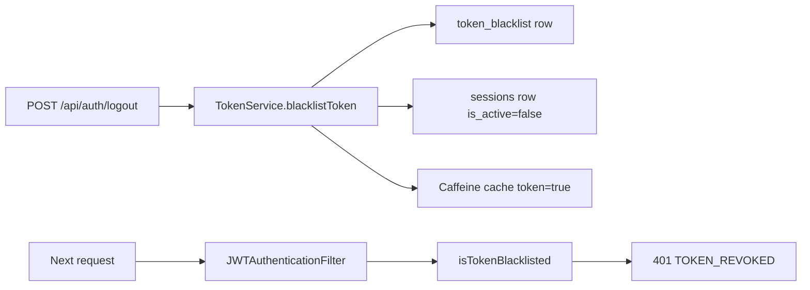

# Authentication and Account

> **Audience:** public website / third-party client · **Base paths:** `/api/auth`,
> `/api/auth/sessions`, `/api/user` · **Source:** `user/api/UserAPI.java`,
> `user/api/SessionAPI.java`, `user/api/UserProfileAPI.java`

Self-service account surface: register, log in, log out, inspect and revoke your own device
sessions, and manage your own profile. A successful register or login signs a JWT and returns it
both in the response body and in an HttpOnly cookie. Every protected endpoint on the platform
accepts either transport — an `Authorization: Bearer <jwt>` header, which is checked first, or the
`khi_auth_token` cookie as the fallback. Self-registration always produces a `GUEST` account with
zero resource permissions —
promotion to `EMPLOYEE`, `TEACHER` or `ADMIN` is an admin-only operation and is not part of this
API group.

## Access

| Requirement | Value |
|---|---|
| Authentication (register / login) | not required — `SecurityConfig` permits `/api/auth/register`, `/api/auth/register-with-image`, `/api/auth/login` |
| Authentication (everything else here) | required — matched by `.requestMatchers("/api/**").authenticated()` |
| Authority | none — no `@PreAuthorize` annotation exists on `UserAPI`, `SessionAPI` or `UserProfileAPI`, at class or method level |
| Roles that hold it by default | every role, including `GUEST` |

Because there is no `@PreAuthorize` anywhere in this group, any authenticated user — whatever
their role or permission grants — may call every endpoint below. Ownership is enforced in code
instead: the profile endpoints resolve the target user from `Authentication#getName()`, and
`DELETE /api/auth/sessions/{sessionId}` compares `session.user.userId` against the caller's own
`userId` before revoking.

## Endpoints

| Method | Path | Authentication | Purpose |
|---|---|---|---|
| `POST` | `/api/auth/register` | not required | Create a `GUEST` account from JSON and sign in |
| `POST` | `/api/auth/register-with-image` | not required | Same, as multipart, with an optional avatar |
| `POST` | `/api/auth/login` | not required | Sign in with username **or** email |
| `POST` | `/api/auth/logout` | required | Revoke the current token and session |
| `POST` | `/api/auth/logout-all` | required | Deactivate every session row for the caller |
| `GET` | `/api/auth/sessions/getAllSessions` | required | List the caller's active sessions |
| `DELETE` | `/api/auth/sessions/{sessionId}` | required | Revoke one of the caller's own sessions |
| `DELETE` | `/api/auth/sessions/revokeAll` | required | Revoke all of the caller's active sessions |
| `GET` | `/api/user/me` | required | The caller's own profile |
| `PUT` | `/api/user/profile` | required | Partially update name / username / email |
| `PUT` | `/api/user/password` | required | Change own password |
| `POST` | `/api/user/profile-image` | required | Upload own profile image to S3 |
| `DELETE` | `/api/user/profile-image` | required | Remove own profile image |
| `DELETE` | `/api/user/account` | required | Permanently delete own account |

---

## The auth cookie contract

The cookie is built by `JwtCookieService#buildCookie` from `JwtCookieProperties`
(`@ConfigurationProperties(prefix = "jwt")`), which is bound from `application.yaml`.

| Attribute | Source key | Env override | Effective value |
|---|---|---|---|
| Name | `jwt.cookie-name` | `JWT_COOKIE_NAME` | `khi_auth_token` |
| `HttpOnly` | `jwt.cookie-http-only` | `JWT_COOKIE_HTTP_ONLY` | `true` |
| `Secure` | `jwt.cookie-secure` | `JWT_COOKIE_SECURE` | `true` |
| `SameSite` | `jwt.cookie-same-site` | `JWT_COOKIE_SAME_SITE` | `None` |
| `Path` | `jwt.cookie-path` | `JWT_COOKIE_PATH` | `/` |
| `Max-Age` | derived from `jwt.expiration-ms` | `JWT_EXPIRATION_MS` | `259200` seconds |
| Domain | — | — | never set; the cookie is host-only |

`jwt.expiration-ms` defaults to `259200000` ms. That is 259 200 seconds = 72 hours = **3 days**,
and it is the lifetime of both the signed JWT (`exp` claim, set in `JwtTokenProvider`) and the
browser cookie: `JwtCookieService#tokenLifetimeSeconds` divides the same value by 1000 so the two
clocks can never drift apart. The `sessions.expires_at` column is written from the same instant.

A successful register or login therefore emits a header shaped like this (the `Expires` mirror of
`Max-Age` is added by Spring's `ResponseCookie`):

```http
Set-Cookie: khi_auth_token=eyJhbGciOiJIUzI1NiJ9...; Max-Age=259200;
  Expires=Sat, 29 Aug 2026 09:14:22 GMT; Path=/; Secure; HttpOnly; SameSite=None
```

Logout, and every token-rejection path in `JWTAuthenticationFilter`, call
`JwtCookieService#clearAuthCookie`, which re-sends the same cookie with an empty value and
`Max-Age=0`:

```http
Set-Cookie: khi_auth_token=; Max-Age=0; Expires=Thu, 01 Jan 1970 00:00:00 GMT;
  Path=/; Secure; HttpOnly; SameSite=None
```

**JWT claims.** `JwtTokenProvider#generateToken` signs with `HMAC256` over `jwt.secret` and sets:
`iss` = `Akar Dev`, `aud` = `User Management By Akar Arkan Rasul`, `iat`, `exp`,
`sub` = username, `id` = numeric user id, `ROLE` = role name, `authorities` = string array of
granted authorities, and `sessionId` = the UUID of the `sessions` row created at login. The
verifier (`JwtTokenProvider#createJWTVerifier`) checks the HMAC signature first and then requires
the issuer and audience to match. A token signed by another deployment with a different
`jwt.secret` therefore fails with `TOKEN_INVALID_SIGNATURE`, while a correctly signed token whose
`iss` or `aud` does not match fails with `TOKEN_INVALID`.

**Local development over plain HTTP.** With `Secure` on, a browser (and `curl`'s cookie engine)
will not send the cookie back over `http://`. For a local `{{BASE_URL}}=http://localhost:8080`
run, start the server with `JWT_COOKIE_SECURE=false` and `JWT_COOKIE_SAME_SITE=Lax`, otherwise
every request after login looks unauthenticated.

## Two token transports: the bearer header wins

`JWTAuthenticationFilter#resolveToken` accepts **both** forms, and the order is not incidental:

1. `Authorization: Bearer <jwt>` — read first. The prefix must be exactly `Bearer `.
2. The `khi_auth_token` cookie, via `JwtCookieService#resolveToken` — consulted only when the
   header is absent or does not carry the `Bearer ` prefix.

So the header **takes precedence**: if a request carries both, the cookie is never looked at. The
same two-step resolution is repeated in `UserAPI#extractToken` for logout. Server-side, either
transport works on every protected endpoint; there is no cookie-only route.

Which one to use is a client-side decision:

- **Browsers should use the cookie.** It is `HttpOnly`, so page JavaScript cannot read its value
  and therefore cannot construct the header. The register and login responses do include the raw
  JWT in the `token` field of the body, but a browser client that copies it into `localStorage` to
  build an `Authorization` header gives up exactly the XSS protection `HttpOnly` provides.
- **Scripts, CLI tooling and server-to-server callers typically use the header.** Take `token` from
  the login response and send `Authorization: Bearer $TOKEN`. No cookie jar, no `SameSite` or
  `Secure` constraints to work around — which is why this is the easier path for a non-browser
  client, especially over plain HTTP in development.

The curl examples in this document use a cookie jar because it exercises the browser-shaped path;
every one of them works with `-H "Authorization: Bearer $TOKEN"` substituted for `-b "$JAR"`.

**What allow-credentials implies.** `WebConfig#corsFilter` registers a `CorsFilter` at
`Ordered.HIGHEST_PRECEDENCE` — ahead of Spring Security, so 401/403 bodies also carry CORS
headers — with `setAllowCredentials(true)`, `addAllowedHeader("*")`, methods from
`app.cors.allowed-methods` (`GET,POST,PUT,DELETE,OPTIONS,PATCH`) and `max-age` `3600`. Consequences
for a cross-origin caller:

- The origin list is explicit, never `*` — the CORS spec forbids the wildcard together with
  credentials. `AppCorsProperties#getAllowedOriginsList` merges four always-allowed origins —
  `http://localhost:5173`, `http://localhost:3000`,
  `https://khi-archive-platform-frontend.vercel.app`,
  `https://khi-archive-platform.s3.us-east-1.amazonaws.com` — with the comma-separated
  `CORS_ALLOWED_ORIGINS` environment variable. An origin outside that merged set gets no
  `Access-Control-Allow-Origin` header and the browser blocks the response.
- The client must opt in per request: `fetch(url, { credentials: "include" })`, or
  `withCredentials: true` on `XMLHttpRequest` / axios. Without it the browser omits the cookie
  and the API answers `401 TOKEN_MISSING`.
- `SameSite=None` is what allows the cookie to travel on a cross-site request at all, and
  `SameSite=None` is only honored together with `Secure` — so a cross-origin production frontend
  must talk to the API over HTTPS.
- `OPTIONS /**` is `permitAll()` in `SecurityConfig`, and `JWTAuthenticationFilter` sets `200` on an
  `OPTIONS` request and passes it straight down the chain without resolving a token, so preflights
  never require one.

## What logout does to a stateless JWT

Sessions are `SessionCreationPolicy.STATELESS`: there is no server-side HTTP session, and a signed
JWT stays cryptographically valid until its `exp`. Revocation is therefore explicit, and it is
backed by two tables plus one in-memory cache.



`TokenService#blacklistToken`:

1. marks the raw JWT string as invalid in a local Caffeine cache
   (`maximumSize` 10 000, `expireAfterWrite` 2 minutes) so the very next request sees it;
2. inserts a `TokenBlacklist` row holding the token, `blacklistedAt`, and the token's own `exp` as
   `expiresAt`;
3. reads the `sessionId` claim and, if the row exists, sets `sessions.is_active = false` and
   `sessions.logout_timestamp = now`.

On every subsequent request `TokenService#isTokenBlacklisted` treats a token as revoked when **any**
of these hold: it appears in `token_blacklist`; it carries no `sessionId` claim; no `sessions` row
matches that `sessionId` (deleted account, wiped table); the matching session has
`is_active = false`; or the session's `expires_at` is null or already past. The filter then clears
the auth cookie and returns `401` with `error: TOKEN_REVOKED`.

Two consequences worth planning for:

- Revoking a session through `DELETE /api/auth/sessions/{sessionId}` or `revokeAll` does **not**
  write a `token_blacklist` row, but it does flip `is_active`, which is enough to invalidate the
  token by rule four above.
- The validity cache is written with a 2-minute TTL, and a *valid* answer is cached too. A token
  revoked from another device can therefore keep working on an already-active client for up to
  2 minutes before the database becomes authoritative again. Logout on the same instance is
  immediate because it writes `true` into the cache directly.

## Validation rules

### Registration — `RegisterRequestDTO`

Bean-validation annotations, checked before the controller body runs; a failure yields
`400` / `VALIDATION_ERROR` with one `details` entry per rejected field.

| Field | Constraint | Message |
|---|---|---|
| `name` | `@NotBlank` | `Name is required` |
| `name` | `@Size(max = 120)` | `Name must not exceed 120 characters` |
| `username` | `@NotBlank` | `Username is required` |
| `username` | `@Size(min = 3, max = 80)` | `Username must be between 3 and 80 characters` |
| `username` | `@Pattern("^[A-Za-z0-9_]+$")` | `Username can contain only letters, numbers, and underscores` |
| `email` | `@NotBlank` | `Email is required` |
| `email` | `@Email("^[a-zA-Z0-9._%+\\-]+@[a-zA-Z0-9.\\-]+\\.[a-zA-Z]{2,10}$")` | `Email must be a valid address with a domain (e.g. user@example.com)` |
| `email` | `@Size(max = 160)` | `Email must not exceed 160 characters` |
| `password` | `@NotBlank` | `Password is required` |
| `password` | `@Size(min = 6, max = 128)` | `Password must be at least 6 characters` |

`UserService#register` then applies a second, service-layer pass through `UserValidator`:

- `validateAndNormalizeEmail(email, Role.GUEST)` — trims and lower-cases the address, re-checks
  the regex and the 160-character cap, rejects 27 disposable-mail domains (`mailinator.com`,
  `yopmail.com`, `10minutemail.com`, `guerrillamail.com`, … ), and — because self-registration
  always targets `GUEST` — performs a DNS lookup requiring an `MX` or fallback `A`/`AAAA` record
  on the domain. The lookup uses a 3-second timeout with one retry and fails **open** on resolver
  errors; only a definitive `NameNotFound` rejects the address. The check can be disabled with
  `app.email.verify-mx=false`.
- `validatePassword(...)` — enforces non-blank, `length >= 6` and `length <= 128`. Despite the
  method taking `username`, `email` and `name` arguments, the source marks them unused: there is
  **no** complexity, personal-information or blocklist rule.
- Uniqueness — `Username is already taken.` when `username` exists, `Email is already registered.`
  when the normalized email exists.

The account is created with `role = GUEST`, `provider = "local"`, `isActivated = true`,
`failedAttempts = 0`, `isLocked = false` and `passwordExpiryDate = now + 90 days`.

### Password change — `ChangePasswordRequestDTO`

| Field | Constraint | Message |
|---|---|---|
| `currentPassword` | `@NotBlank` | `Current password is required` |
| `currentPassword` | `@Size(min = 6, max = 128)` | `Current password must be at least 6 characters` |
| `newPassword` | `@NotBlank` | `New password is required` |
| `newPassword` | `@Size(min = 6, max = 128)` | `New password must be at least 6 characters` |
| `confirmPassword` | `@NotBlank` | `Confirm password is required` |
| `confirmPassword` | `@Size(min = 6, max = 128)` | `Confirm password must be at least 6 characters` |

`UserProfileService#changePassword` adds, in order: `currentPassword` must match the stored BCrypt
hash (else `401` / `BAD_CREDENTIALS`); `newPassword` must equal `confirmPassword`; the same
`UserValidator#validatePassword` length rules; and `validatePasswordNotReused`, which rejects a new
password that BCrypt-matches the current one. On success `passwordExpiryDate` is pushed to
`now + 90 days`.

### Profile update — `UpdateProfileRequestDTO`

Every field is optional; an empty body is a valid no-op.

| Field | Constraint | Message |
|---|---|---|
| `username` | `@Size(min = 3, max = 80)` | `Username must be between 3 and 80 characters` |
| `username` | `@Pattern("^$\|^[A-Za-z0-9_]+$")` | `Username can contain only letters, numbers, and underscores` |
| `name` | `@Size(max = 120)` | `Name must not exceed 120 characters` |
| `email` | `@Email(...)` (same regex as registration) | `Email must be a valid address with a domain (e.g. user@example.com)` |
| `email` | `@Size(max = 160)` | `Email must not exceed 160 characters` |

### Login — `LoginRequestDTO`

| Field | Constraint | Message |
|---|---|---|
| `username` | `@NotBlank` | `Username or email is required` |
| `username` | `@Size(max = 160)` | `Username or email is too long` |
| `password` | `@NotBlank` | `Password is required` |
| `password` | `@Size(min = 6, max = 128)` | `Password must be at least 6 characters` |

## Two response envelopes

Most of the platform answers errors with the shared `ApiErrorResponse` record — fields
`timestamp`, `status`, `error`, `category`, `message`, `hint`, `path`, `traceId`, `details`, with
nulls omitted:

```json
{
  "timestamp": "2026-08-26T09:14:22.481Z",
  "status": 400,
  "error": "VALIDATION_ERROR",
  "category": "VALIDATION",
  "message": "One or more fields failed validation. See 'details' for the per-field reason.",
  "hint": "Fix the highlighted fields and resubmit the request.",
  "path": "/api/auth/register",
  "details": { "username": "Username must be between 3 and 80 characters" }
}
```

`POST /api/auth/register`, `/api/auth/register-with-image` and `/api/auth/login` are the exception.
`UserService` catches its own failures and answers with the same `Token` object it uses for
success — a two-field Lombok class, not a record, serialized as
`{ "token": "...", "response": "..." }`, with `token` omitted on failure because it is null. The
tables below label these rows `Token body` in the `error` column; there is no machine code to
switch on, only the human-readable `response` string.

## Shared authentication errors

Three components produce these bodies. `JWTAuthenticationFilter` classifies a *presented* token
that fails verification and clears the auth cookie before writing the body — that covers
`TOKEN_EXPIRED`, `TOKEN_INVALID_SIGNATURE`, `TOKEN_MALFORMED`, `TOKEN_INVALID` and
`TOKEN_REVOKED`. `JwtAuthenticationEntryPoint` handles the no-usable-credentials case and
`JwtAccessDeniedHandler` the denial case; neither touches the cookie, and neither does the filter's
outer `catch` that yields the `500`. All of them apply to every authenticated endpoint in this
document.

| Status | `error` code | `category` | When |
|---|---|---|---|
| `401` | `TOKEN_MISSING` | `AUTHENTICATION` | `JwtAuthenticationEntryPoint` reached with an `InsufficientAuthenticationException`, or with no `Authorization` header and no cookies at all — the ordinary no-token case on a protected route |
| `401` | `AUTHENTICATION_FAILED` | `AUTHENTICATION` | Entry point reached with some credential present that the chain still refused, or any `AuthenticationException` surfacing from a handler |
| `401` | `TOKEN_EXPIRED` | `AUTHENTICATION` | `exp` has passed; `details.reason` = `expired` |
| `401` | `TOKEN_REVOKED` | `AUTHENTICATION` | Blacklisted token, or its session is inactive / missing / expired; `details.reason` = `revoked` |
| `401` | `TOKEN_INVALID_SIGNATURE` | `AUTHENTICATION` | Wrong signing key or algorithm; `details.reason` = `signature_mismatch` or `algorithm_mismatch` |
| `401` | `TOKEN_MALFORMED` | `AUTHENTICATION` | Value is not a decodable JWT; `details.reason` = `malformed` |
| `401` | `TOKEN_INVALID` | `AUTHENTICATION` | Invalid claim (issuer/audience); `details.reason` = `invalid_claim`. Also the catch-all for any other verification failure, which carries no `details` |
| `403` | `ACCESS_DENIED` | `AUTHORIZATION` | Denied by the filter chain; `details` carries `actor`, `actorAuthorities`, `requestMethod` |
| `500` | `INTERNAL_SERVER_ERROR` | `SERVER_ERROR` | The filter reloaded the user and `UserDetailsService` refused |

That last row is not hypothetical. `UserService#loadUserByUsername` runs on **every** authenticated
request — through a `users:details` Caffeine cache keyed by username with a 1-minute TTL, so role
and permission changes take effect within a minute without re-login — and throws `LockedException` when
the account is locked or the password has expired, and `UsernameNotFoundException` when the row is
gone. Those escape into the filter's outer `catch (Exception)`, which reports
`500 INTERNAL_SERVER_ERROR` rather than a 4xx. A client holding a token for an account that was
locked, deleted, or whose 90-day password window elapsed mid-session should treat a `500` on a
previously working route as a signal to re-authenticate.

---

## Endpoint reference

### `POST /api/auth/register`

Create a `GUEST` account from a JSON body and sign in immediately.

**Authentication:** not required.

**Request body** — `RegisterRequestDTO`

```json
{
  "name": "Rawa Ahmed",
  "username": "rawa_a",
  "email": "rawa@example.com",
  "password": "s3cret-pass"
}
```

**Response** `201 Created` — `Token`, plus the `Set-Cookie` header described above.

```json
{
  "token": "eyJhbGciOiJIUzI1NiJ9.eyJpc3MiOiJBa2FyIERldiIsInN1YiI6InJhd2FfYSJ9...",
  "response": "Registration successful. You can now login."
}
```

The message reads "You can now login", but the account is already signed in: the token is live and
the cookie is set. No second call to `/api/auth/login` is needed.

**Errors**

| Status | `error` code | When |
|---|---|---|
| `400` | `VALIDATION_ERROR` | A bean-validation constraint failed; `details` maps field to message |
| `400` | `JSON_PARSE_ERROR` | Body is not parseable JSON |
| `400` | Token body | `Username is already taken.` or `Email is already registered.` |
| `400` | Token body | `Invalid image: <reason>` — see the note below |
| `415` | `UNSUPPORTED_MEDIA_TYPE` | `Content-Type` is not `application/json` |
| `500` | Token body | `An unexpected error occurred. Please try again later.` |

**Example**

```bash
curl -s -c cookies.txt -X POST "{{BASE_URL}}/api/auth/register" \
  -H "Content-Type: application/json" \
  -d '{"name":"Rawa Ahmed","username":"rawa_a","email":"rawa@example.com","password":"s3cret-pass"}'
```

**Notes** — the service catches `IllegalArgumentException` in a single block and prefixes the
message with `Invalid image: `. Because `UserValidator` also signals email and password problems
with `IllegalArgumentException`, a rejected email surfaces as, for example,
`"Invalid image: Disposable or temporary email addresses are not allowed. Please use a permanent
email."`. Read past the prefix; it does not mean the request contained an image.

---

### `POST /api/auth/register-with-image`

Same registration flow as above, submitted as `multipart/form-data` with an optional avatar.

**Authentication:** not required.

**Request parts**

| Part | Required | Content type | Description |
|---|---|---|---|
| `data` | yes | `application/json` | A `RegisterRequestDTO`, validated exactly as above |
| `image` | no | `image/jpeg`, `image/png`, `image/gif`, `image/webp` | Profile picture, max 5 MB |

**Response** `201 Created` — identical `Token` body and `Set-Cookie` header as
`POST /api/auth/register`.

**Errors**

| Status | `error` code | When |
|---|---|---|
| `400` | `VALIDATION_ERROR` | A bean-validation constraint on the `data` part failed |
| `400` | `MISSING_REQUEST_PART` | The `data` part is absent; `details.part` names it |
| `400` | Token body | `Invalid image: File size exceeds maximum limit of 5MB` |
| `400` | Token body | `Invalid image: Invalid file type. Only JPEG, PNG, GIF and WebP are allowed` |
| `400` | Token body | `Username is already taken.` / `Email is already registered.` |
| `413` | `UPLOAD_TOO_LARGE` | Request exceeded the servlet multipart cap; `details.maxBytes` |
| `415` | `UNSUPPORTED_MEDIA_TYPE` | Request is not `multipart/form-data` |
| `500` | Token body | `An unexpected error occurred. Please try again later.` |

**Example**

```bash
curl -s -c cookies.txt -X POST "{{BASE_URL}}/api/auth/register-with-image" \
  -F 'data={"name":"Rawa Ahmed","username":"rawa_a","email":"rawa@example.com","password":"s3cret-pass"};type=application/json' \
  -F "image=@./avatar.png;type=image/png"
```

**Notes** — this route stores the avatar on the **application filesystem**, not S3:
`UserService#storeProfileImage` writes it under `app.upload.dir` (default
`uploads/profile-images`) as `<uuid><ext>` and persists that relative path in
`users_tbl.profile_image`. `POST /api/user/profile-image` is the S3-backed path and stores a full
`https://` URL instead. To end up with a servable image, prefer registering without an image and
uploading afterwards through `/api/user/profile-image`.

---

### `POST /api/auth/login`

Exchange credentials for a token and cookie. The `username` field accepts a username **or** an
email address.

**Authentication:** not required.

**Request body** — `LoginRequestDTO`

```json
{
  "username": "rawa@example.com",
  "password": "s3cret-pass"
}
```

**Response** `200 OK` — `Token`, plus the `Set-Cookie` header.

```json
{
  "token": "eyJhbGciOiJIUzI1NiJ9...",
  "response": "Login successfully done."
}
```

**Errors**

| Status | `error` code | When |
|---|---|---|
| `400` | `VALIDATION_ERROR` | A bean-validation constraint failed |
| `401` | Token body | `Invalid credentials` — no user matched the identifier |
| `401` | Token body | `Invalid credentials. You have N attempt(s) remaining before your account is temporarily locked.` |
| `403` | Token body | `Account is locked due to 5 failed attempts. Please try again after 1 minute(s).` |
| `403` | Token body | `Account locked after 5 failed attempts. Please try again in 1 minute(s).` |
| `403` | Token body | `Your password has expired. Please contact an administrator to update it.` |
| `500` | Token body | `An unexpected error occurred. Please try again later.` |

**Example**

```bash
curl -s -c cookies.txt -X POST "{{BASE_URL}}/api/auth/login" \
  -H "Content-Type: application/json" \
  -d '{"username":"rawa@example.com","password":"s3cret-pass"}'
```

**Notes**

- Lookup is two-phase: an exact indexed match on `username` or `email`, then a case-insensitive
  fallback. So `RAWA@EXAMPLE.COM` resolves to the stored `rawa@example.com`.
- Lockout constants come from `SecurityConstants`: `MAX_FAILED_ATTEMPTS = 5`,
  `LOCK_DURATION_MINUTES = 1`. The counter resets to zero on the first successful password match,
  and an expired lock is lifted automatically at the next login attempt.
- A cookie is only attached when the response is 2xx **and** carries a non-blank token
  (`UserAPI#withAuthCookie`), so failed attempts never overwrite an existing session cookie.
- Each successful login inserts a new `sessions` row. Logging in from five devices leaves five
  active sessions; the previous ones are not disturbed.
- The password-expiry check here says "contact an administrator", but `PUT /api/user/password` is
  self-service — it is only reachable while you still hold a valid token, since an expired
  password makes `loadUserByUsername` throw.

---

### `POST /api/auth/logout`

Revoke the current token and deactivate its session row.

**Authentication:** required.

**Request headers**

| Name | Required | Description |
|---|---|---|
| `Authorization` | no | `Bearer <jwt>`; when absent the `khi_auth_token` cookie is used instead |

**Response** `200 OK` — `text/plain`, and a `Set-Cookie` header that expires the auth cookie.

```text
Successfully logged out
```

**Errors**

| Status | `error` code | When |
|---|---|---|
| `400` | plain text | `Authentication token is missing` — defensive branch; in practice the security chain answers `401` before the handler runs |
| `401` | see [Shared authentication errors](#shared-authentication-errors) | Missing, expired, revoked or malformed token |

**Example**

```bash
curl -s -b cookies.txt -c cookies.txt -X POST "{{BASE_URL}}/api/auth/logout"
```

**Notes** — writes a `token_blacklist` row, flips `sessions.is_active` to `false`, sets
`logout_timestamp`, and clears the cookie. Only the token used on this request is affected; other
devices keep their sessions.

---

### `POST /api/auth/logout-all`

Deactivate every session row belonging to the caller and blacklist the current token.

**Authentication:** required.

**Request headers**

| Name | Required | Description |
|---|---|---|
| `Authorization` | no | `Bearer <jwt>`; falls back to the cookie |

**Response** `200 OK` — `text/plain`, plus the cookie-clearing header.

```text
Logged out from all devices successfully
```

**Errors**

| Status | `error` code | When |
|---|---|---|
| `401` | plain text | `Not authenticated` — the resolved principal was null |
| `401` | see [Shared authentication errors](#shared-authentication-errors) | Missing, expired, revoked or malformed token |

**Example**

```bash
curl -s -b cookies.txt -c cookies.txt -X POST "{{BASE_URL}}/api/auth/logout-all"
```

**Notes** — the handler loads `sessionRepository.findByUser(user)`, i.e. *all* rows for the user
including already-inactive ones, and sets `isActive = false` with a fresh `logoutTimestamp` on each.
Only the current token gets a `token_blacklist` row; the other devices' tokens are invalidated
through the inactive-session rule instead, which the validity cache may delay by up to 2 minutes.

---

### `GET /api/auth/sessions/getAllSessions`

List the caller's currently active sessions — one row per successful login.

**Authentication:** required.

**Response** `200 OK` — a bare JSON array of `SessionDTO` (not a `Page` envelope).

```json
[
  {
    "sessionId": "1f0b7a2e-6c44-4f0e-9f0b-2c8f2a1d5e77",
    "deviceInfo": "Mozilla/5.0 (Macintosh; Intel Mac OS X 10_15_7) AppleWebKit/537.36",
    "ipAddress": "192.168.1.24",
    "loginTimestamp": "2026-08-26T09:14:22.481Z",
    "expiresAt": "2026-08-29T09:14:22.481Z",
    "isActive": true
  }
]
```

`logoutTimestamp` is present only on rows that were revoked, and this endpoint filters to
`isActive = true`, so it is normally omitted.

**Errors**

| Status | `error` code | When |
|---|---|---|
| `401` | plain text | `Not authenticated` — the resolved principal was null |
| `401` | see [Shared authentication errors](#shared-authentication-errors) | Missing, expired, revoked or malformed token |

**Example**

```bash
curl -s -b cookies.txt "{{BASE_URL}}/api/auth/sessions/getAllSessions"
```

**Notes** — `deviceInfo` is the raw `User-Agent` header captured at login and `ipAddress` is
`HttpServletRequest#getRemoteAddr()`. With `server.forward-headers-strategy=framework` behind a
proxy this is the client address forwarded by the framework. The response has no field identifying
which row is *this* session; match it yourself against the `sessionId` claim if you decode the JWT
server-side.

---

### `DELETE /api/auth/sessions/{sessionId}`

Revoke one session by its UUID. Only your own sessions can be revoked.

**Authentication:** required.

**Path parameters**

| Name | Type | Description |
|---|---|---|
| `sessionId` | string | The `sessionId` UUID from `getAllSessions` |

**Response** `200 OK` — `text/plain`.

```text
Session revoked successfully
```

**Errors**

| Status | `error` code | When |
|---|---|---|
| `401` | plain text | `Not authenticated` — the resolved principal was null |
| `401` | see [Shared authentication errors](#shared-authentication-errors) | Missing, expired, revoked or malformed token |
| `404` | plain text | `Session not found` — no row with that `sessionId`; checked before ownership |
| `403` | plain text | `You can only revoke your own sessions` — the row belongs to another user |

**Example**

```bash
curl -s -b cookies.txt -X DELETE \
  "{{BASE_URL}}/api/auth/sessions/1f0b7a2e-6c44-4f0e-9f0b-2c8f2a1d5e77"
```

**Notes** — sets `isActive = false` and `logoutTimestamp = now`. No `token_blacklist` row is
written, so the revoked device's token is rejected via the inactive-session rule, which its local
validity cache can delay by up to 2 minutes. Revoking your own current session logs you out but
does **not** clear your cookie — the browser keeps sending a token that now fails.

---

### `DELETE /api/auth/sessions/revokeAll`

Revoke every currently active session for the caller.

**Authentication:** required.

**Response** `200 OK` — `text/plain`.

```text
All sessions revoked successfully
```

**Errors**

| Status | `error` code | When |
|---|---|---|
| `401` | plain text | `Not authenticated` |
| `401` | see [Shared authentication errors](#shared-authentication-errors) | Missing, expired, revoked or malformed token |

**Example**

```bash
curl -s -b cookies.txt -X DELETE "{{BASE_URL}}/api/auth/sessions/revokeAll"
```

**Notes** — this is the sessions-table half of `POST /api/auth/logout-all`. It differs in three
ways: it only touches rows already `isActive = true`, it writes no `token_blacklist` row, and it
does not clear the auth cookie. It also revokes the calling session. For a user-facing "sign out
everywhere" button prefer `POST /api/auth/logout-all`, which additionally blacklists the current
token and expires the cookie.

---

### `GET /api/user/me`

The authenticated caller's own profile.

**Authentication:** required. The user is resolved from `Authentication#getName()`, so the
response always describes the token holder — there is no way to request someone else's record here.

**Response** `200 OK` — `UserResponseDTO`

```json
{
  "userId": 42,
  "name": "Rawa Ahmed",
  "username": "rawa_a",
  "email": "rawa@example.com",
  "role": "GUEST",
  "isActivated": true,
  "profileImage": "https://khi-archive-platform.s3.us-east-1.amazonaws.com/khi-archive-platform-folders/user_profile_images/8f2c1b40-6d31-4c19-9f7a-3a5c1d2b0e44-avatar.png",
  "provider": "local",
  "createdAt": "2026-08-20T07:14:02.113Z",
  "updatedAt": "2026-08-26T09:02:41.880Z",
  "passwordExpiryDate": "2026-11-18T07:14:02.113Z"
}
```

**Fields returned** — this is the complete list; `UserResponseDTO` declares exactly these twelve
properties and nothing else.

| Field | Type | Description |
|---|---|---|
| `userId` | number | Primary key of the account |
| `name` | string | Full display name |
| `username` | string | Unique login name |
| `email` | string | Unique, normalized to lower case |
| `role` | enum | One of `GUEST`, `EMPLOYEE`, `TEACHER`, `ADMIN` |
| `isActivated` | boolean | Whether the account may sign in |
| `profileImage` | string | Full S3 URL after `/api/user/profile-image`, or a relative `uploads/profile-images/...` path for avatars supplied at registration |
| `imageUrl` | string | Avatar URL from an external account source |
| `provider` | string | Account source label; `local` for self-registration |
| `createdAt` | instant | Row creation time |
| `updatedAt` | instant | Last modification time |
| `passwordExpiryDate` | instant | When the current password stops working (90 days after it was set) |

**No password material is exposed.** `UserResponseDTO` has no password field at all, so the BCrypt
hash cannot reach this response; `UserProfileService#toResponse` builds the DTO field by field and
never touches `User#password`. As defense in depth the entity itself marks `password` and
`lockTime` `@JsonIgnore`. Also absent from the DTO: `extraPermissions`, `failedAttempts`,
`isLocked`, `providerId`. Effective authorities are carried in the JWT's `authorities` claim, not
in this response.

Null fields are omitted (`spring.jackson.default-property-inclusion: non_null`). A locally
registered account with no avatar and no external source returns neither `imageUrl` nor
`profileImage`.

**Errors**

| Status | `error` code | When |
|---|---|---|
| `404` | `USER_NOT_FOUND` | The token's subject no longer resolves to a row |
| `401` | see [Shared authentication errors](#shared-authentication-errors) | Missing, expired, revoked or malformed token |

**Example**

```bash
curl -s -b cookies.txt "{{BASE_URL}}/api/user/me"
```

---

### `PUT /api/user/profile`

Partially update your own display name, username and email.

**Authentication:** required.

**Request body** — `UpdateProfileRequestDTO`; every field optional, and only non-null, non-blank
values that actually differ from the stored value are applied.

```json
{
  "name": "Rawa A. Ahmed",
  "email": "rawa.ahmed@example.com"
}
```

**Response** `200 OK` — the updated `UserResponseDTO`, same shape as `GET /api/user/me`.

**Errors**

| Status | `error` code | When |
|---|---|---|
| `400` | `VALIDATION_ERROR` | A bean-validation constraint failed; `details` maps field to message |
| `400` | `BAD_REQUEST` | Email rejected by `UserValidator` — bad format, over 160 characters, disposable domain, or (for a `GUEST`) a domain with no MX/A record |
| `404` | `USER_NOT_FOUND` | The token's subject no longer resolves to a row |
| `409` | `USER_ALREADY_EXISTS` | The requested username or email is taken |

**Example**

```bash
curl -s -b cookies.txt -X PUT "{{BASE_URL}}/api/user/profile" \
  -H "Content-Type: application/json" \
  -d '{"name":"Rawa A. Ahmed","email":"rawa.ahmed@example.com"}'
```

**Notes**

- The two `409` messages are localized Kurdish strings, surfaced verbatim in `message`:
  `ناوی بەکارهێنەر پێشتر بەکارهاتووە` (username already used) and
  `ئەم ئیمەیڵە پێشتر بەکارهاتووە` (email already used). Switch on `error`, not on `message`.
- Email comparison is case-insensitive and the stored value is trimmed and lower-cased; the MX
  probe only runs when the account's current role is `GUEST`.
- Changing your username does **not** invalidate existing tokens, and this endpoint does not evict
  the `users:details` cache — so requests keep succeeding against the cached old username for up to
  a minute. Once that entry expires, the JWT's `sub` claim no longer resolves to any row and every
  subsequent request returns `500`. Log in again right after a username change.
- This endpoint cannot change `role`, `isActivated` or `password`. Role and activation are
  admin-only; use `PUT /api/user/password` for the password.

---

### `PUT /api/user/password`

Change your own password.

**Authentication:** required.

**Request body** — `ChangePasswordRequestDTO`

```json
{
  "currentPassword": "s3cret-pass",
  "newPassword": "n3w-secret",
  "confirmPassword": "n3w-secret"
}
```

**Response** `200 OK`

```json
{ "message": "Password updated successfully" }
```

**Errors**

| Status | `error` code | When |
|---|---|---|
| `400` | `VALIDATION_ERROR` | A bean-validation constraint failed |
| `400` | `BAD_REQUEST` | `New password and confirm password do not match.` |
| `400` | `BAD_REQUEST` | `Password must be at least 6 characters.` / `Password must not exceed 128 characters.` |
| `400` | `BAD_REQUEST` | `New password must be different from your current password.` |
| `401` | `BAD_CREDENTIALS` | `currentPassword` does not match the stored hash |
| `404` | `USER_NOT_FOUND` | The token's subject no longer resolves to a row |

**Example**

```bash
curl -s -b cookies.txt -X PUT "{{BASE_URL}}/api/user/password" \
  -H "Content-Type: application/json" \
  -d '{"currentPassword":"s3cret-pass","newPassword":"n3w-secret","confirmPassword":"n3w-secret"}'
```

**Notes** — the service raises `BadCredentialsException` with the Kurdish message
`وشەی نهێنیی ئێستا هەڵەیە`, but `GlobalExceptionHandler` replaces it with the fixed English
`Username or password is incorrect.` before the response is written. Changing the password pushes
`passwordExpiryDate` 90 days out. It does **not** revoke existing tokens or sessions — pair it with
`POST /api/auth/logout-all` if you want other devices signed out.

---

### `POST /api/user/profile-image`

Upload a profile image. The bytes go to S3 and the resulting public URL is stored on the account.

**Authentication:** required.

**Request parts**

| Part | Required | Content type | Description |
|---|---|---|---|
| `file` | yes | `image/jpeg`, `image/png`, `image/gif`, `image/webp` | Image, max 5 MB |

**Response** `200 OK` — the updated `UserResponseDTO`, with `profileImage` set to the new
`https://` S3 URL.

**Errors**

| Status | `error` code | When |
|---|---|---|
| `400` | `MISSING_REQUEST_PART` | The `file` part is absent; `details.part` = `file` |
| `400` | `BAD_REQUEST` | `فایلەکە بەتاڵە` — the uploaded file is empty |
| `400` | `BAD_REQUEST` | `قەبارەی وێنە دەبێت لە ٥ مێگابایت کەمتر بێت` — larger than 5 MB |
| `400` | `BAD_REQUEST` | `تەنها JPEG, PNG, GIF, WebP قبوڵ دەکرێت` — unsupported content type |
| `404` | `USER_NOT_FOUND` | The token's subject no longer resolves to a row |
| `413` | `UPLOAD_TOO_LARGE` | Request exceeded the servlet multipart cap; `details.maxBytes` |
| `415` | `UNSUPPORTED_MEDIA_TYPE` | Request is not `multipart/form-data` |
| `500` | `STORAGE_ERROR` | Profile-image storage failure |

**Example**

```bash
curl -s -b cookies.txt -X POST "{{BASE_URL}}/api/user/profile-image" \
  -F "file=@./avatar.png;type=image/png"
```

**Notes** — the S3 key is `<aws.s3.base-folder>/user_profile_images/<uuid>-<sanitized filename>`,
so with the default base folder `khi-archive-platform-folders` an object lands at
`khi-archive-platform-folders/user_profile_images/…` and the stored URL is
`https://<bucket>.s3.<region>.amazonaws.com/<that key>`. The previous image is deleted
after the new URL is persisted, and only when it is a URL inside this deployment's own bucket;
legacy local filesystem paths are left alone. Unlike media bytes elsewhere in the platform, the
profile image URL is a direct S3 link returned to the browser, not an API proxy route. The three
validation messages above are localized Kurdish strings — switch on `error`, not `message`.

---

### `DELETE /api/user/profile-image`

Remove your profile image.

**Authentication:** required.

**Response** `200 OK` — the updated `UserResponseDTO`. `profileImage` is now null and therefore
omitted from the JSON.

**Errors**

| Status | `error` code | When |
|---|---|---|
| `404` | `USER_NOT_FOUND` | The token's subject no longer resolves to a row |
| `401` | see [Shared authentication errors](#shared-authentication-errors) | Missing, expired, revoked or malformed token |

**Example**

```bash
curl -s -b cookies.txt -X DELETE "{{BASE_URL}}/api/user/profile-image"
```

**Notes** — the S3 object is deleted when the stored value is a URL in this deployment's bucket;
`users_tbl.profile_image` is set to null either way. Idempotent: calling it with no image already
set simply returns the unchanged profile.

---

### `DELETE /api/user/account`

Permanently delete your own account.

**Authentication:** required.

**Response** `204 No Content` — empty body.

**Errors**

| Status | `error` code | When |
|---|---|---|
| `404` | `USER_NOT_FOUND` | The token's subject no longer resolves to a row |
| `401` | see [Shared authentication errors](#shared-authentication-errors) | Missing, expired, revoked or malformed token |

**Example**

```bash
curl -s -b cookies.txt -X DELETE "{{BASE_URL}}/api/user/account"
```

**Notes**

- This is a hard delete, not the soft-trash model used for archive content: the S3 profile image is
  removed, every `sessions` row for the user is deleted, and the `users_tbl` row is deleted. There
  is no restore endpoint.
- No `token_blacklist` row is written and the auth cookie is **not** cleared. The token eventually
  stops working because its session row is gone, but the 2-minute token-validity cache and the
  1-minute `users:details` cache mean the next few requests may return `401 TOKEN_REVOKED` or `500`
  instead of a clean rejection. Call `POST /api/auth/logout` first, or discard the cookie yourself.
- Content authored by the account is not touched by this call.

---

## Complete curl walkthrough

A full session using a cookie jar. Run it against a server started with `JWT_COOKIE_SECURE=false`
if `{{BASE_URL}}` is plain HTTP — otherwise curl stores the `Secure` cookie but refuses to send it
back.

```bash
BASE={{BASE_URL}}
JAR=./khi-cookies.txt
rm -f "$JAR"

# 1 ── Register. -c writes the Set-Cookie response into the jar.
curl -s -c "$JAR" -X POST "$BASE/api/auth/register" \
  -H "Content-Type: application/json" \
  -d '{"name":"Rawa Ahmed","username":"rawa_a","email":"rawa@example.com","password":"s3cret-pass"}'

# 2 ── Confirm the cookie landed. Expect one khi_auth_token line.
grep khi_auth_token "$JAR"

# 3 ── Read your own profile. -b sends the jar; note no Authorization header.
curl -s -b "$JAR" "$BASE/api/user/me"

# 4 ── Update the display name (partial: other fields left untouched).
curl -s -b "$JAR" -X PUT "$BASE/api/user/profile" \
  -H "Content-Type: application/json" \
  -d '{"name":"Rawa A. Ahmed"}'

# 5 ── Upload a profile image (S3-backed route, part name is "file").
curl -s -b "$JAR" -X POST "$BASE/api/user/profile-image" \
  -F "file=@./avatar.png;type=image/png"

# 6 ── Change the password. Pushes passwordExpiryDate 90 days out.
curl -s -b "$JAR" -X PUT "$BASE/api/user/password" \
  -H "Content-Type: application/json" \
  -d '{"currentPassword":"s3cret-pass","newPassword":"n3w-secret","confirmPassword":"n3w-secret"}'

# 7 ── Log in from a "second device" into its own jar, to create a second session.
curl -s -c ./khi-cookies-2.txt -X POST "$BASE/api/auth/login" \
  -H "Content-Type: application/json" \
  -d '{"username":"rawa@example.com","password":"n3w-secret"}'

# 8 ── List active sessions. Two rows now.
curl -s -b "$JAR" "$BASE/api/auth/sessions/getAllSessions"

# 9 ── Revoke the second device by its sessionId (copy it from step 8).
curl -s -b "$JAR" -X DELETE "$BASE/api/auth/sessions/<SESSION_ID_FROM_STEP_8>"

# 10 ── Log out everywhere. Blacklists this token and expires the cookie;
#        -c rewrites the jar with the cleared cookie.
curl -s -b "$JAR" -c "$JAR" -X POST "$BASE/api/auth/logout-all"

# 11 ── Prove the token is dead: expect 401 with error TOKEN_REVOKED.
curl -s -o /dev/null -w '%{http_code}\n' -b "$JAR" "$BASE/api/user/me"
```

Add `-i` to any step to inspect the `Set-Cookie` header directly, and `-v` to see the CORS response
headers a browser would evaluate.

## Related

- [`./README.md`](./README.md) — index of the external (public-facing) API documentation
- [`./00-overview.md`](./00-overview.md) — the whole external surface and the no-token endpoint list
- [`./01-conventions.md`](./01-conventions.md) — shared conventions: the `ApiErrorResponse` envelope,
  the `Page` envelope, date and time-zone formats, and `non_null` serialization
- [`./02-errors.md`](./02-errors.md) — the full `ErrorCode` catalog behind the tables above
