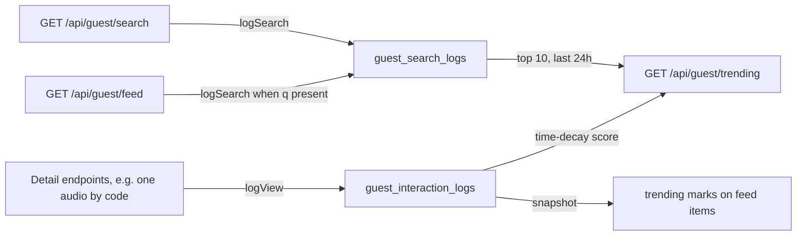

# Public Discovery — Trending, Search, Suggest, Facets, Feed

> **Audience:** public website, anonymous visitors, third-party clients ·
> **Base path:** `/api/guest` ·
> **Source:** `src/main/java/ak/dev/khi_archive_platform/platform/api/guest/GuestSearchAPI.java`,
> `src/main/java/ak/dev/khi_archive_platform/platform/service/guest/GuestSearchService.java`,
> `src/main/java/ak/dev/khi_archive_platform/platform/service/guest/GuestTrendingService.java`

Five endpoints power the discovery surface of the public site: a cached trending snapshot, a
one-call cross-entity search, an autocomplete, the sidebar facet counts, and the grouped media
feed that the browse page is built on. All five are read-only, need no token, and return
`Guest…DTO` shapes only — technical fields (S3 paths, bit rate, sample rate, file size, LCC
classification, version internals, audit and trash bookkeeping) never leave the API.

Two of them also feed the trending pipeline: `/search` and `/feed` write a row to
`guest_search_logs` whenever they are called with a non-blank `q`. See
[What gets recorded](#what-gets-recorded-in-guest_search_logs-and-guest_interaction_logs).

## Access

| Requirement | Value |
|---|---|
| Authentication | not required |
| Authority | none — `SecurityConfig` matches `/api/guest/**` with `permitAll()` |
| Roles that hold it by default | everyone, including anonymous callers |

There is no `@PreAuthorize` annotation on `GuestSearchAPI`, on its class declaration or on any
of its methods. `JWTAuthenticationFilter.shouldNotFilter` also skips the JWT filter for every
URI starting with `/api/guest/`, so a stale or malformed `khi_auth_token` cookie cannot break
these calls. Sending a valid cookie changes nothing about the response.

## Endpoints

| Method | Path | Authority | Purpose |
|---|---|---|---|
| `GET` | `/api/guest/trending` | none | Cached trending snapshot plus the top searches of the last 24 h |
| `GET` | `/api/guest/search` | none | One call, seven result sections, top-N each |
| `GET` | `/api/guest/suggest` | none | Autocomplete rows across projects, categories, persons and the four media kinds |
| `GET` | `/api/guest/facets` | none | Sidebar filter counts |
| `GET` | `/api/guest/feed` | none | Media-only browse feed, grouped into four kind sections |

> **Building the website's search results page?** These five endpoints predate it and each answers
> only part of the question. `GET /api/guest/media/search` answers all of it in one call — every
> media kind merged and ranked on a single scale, with per-kind tab counts and refine facets over
> the matched set. See [`10-website-search.md`](./10-website-search.md). `/suggest` below is still
> the right endpoint for the autocomplete dropdown, and `/feed` for a keyword-less browse.

## How discovery feeds trending



`/suggest`, `/facets` and `/trending` itself write nothing.

---

### `GET /api/guest/trending`

Current trending items, per-type trending rows, and the most frequent recent searches.

**Authority:** none

**Query parameters** — none. The handler signature is `trending()` with no arguments; any query
string sent is ignored.

**Response** `200 OK` — `GuestTrendingDTO`

| Field | Type | Notes |
|---|---|---|
| `generatedAt` | instant | Server clock at the moment the snapshot was computed, not at request time — a cached response repeats the original value for up to 5 minutes |
| `trendingItems` | `TrendingItem[]` | At most 20 (`TRENDING_TOP`), highest score first, mixed kinds |
| `topSearches` | `TopSearch[]` | At most 10 (`TOP_SEARCHES`), most frequent first |
| `trendingByType` | `ByType` | Per-kind slices for the "Trending Audios" style rows |

`TrendingItem`:

| Field | Type | Notes |
|---|---|---|
| `rank` | int | 1-based position in the raw database ranking. Ranks can skip numbers — see the note below |
| `score` | double | Time-decay score; higher is hotter |
| `kind` | string | `audio`, `video`, `text`, `image`, `project` or `person` |
| `code` | string | The entity code — the unique identifier to key on |
| `title` | string | For the four media kinds, the first non-blank title candidate, falling back to the code. For `project`, the project name with no code fallback. For `person`, the display name (`fullName` → `romanizedName` → `nickname` → `personCode`) |
| `thumbnail` | string | Set only for `kind: "person"`, from the person's `mediaPortrait`. Always null — and therefore omitted — for every other kind |
| `projectCode` | string | Owning project code. Media items only — absent for `project` and `person` items, and for media whose project is null |
| `projectName` | string | Owning project name; same absence rules |
| `personCode` | string | Code of the person behind the owning project; absent for `person` items |
| `personName` | string | Display name of that person; also absent for `person` items — the name is in `title` there |
| `audio` | `GuestAudioDTO` | Present only when `kind` is `audio` |
| `video` | `GuestVideoDTO` | Present only when `kind` is `video` |
| `text` | `GuestTextDTO` | Present only when `kind` is `text` |
| `image` | `GuestImageDTO` | Present only when `kind` is `image` |
| `project` | `GuestProjectDTO` | Present only when `kind` is `project` |
| `person` | `GuestPersonDTO` | Present only when `kind` is `person` |

Exactly one of the six entity objects is non-null on any item; the other five are omitted from
the JSON. The nested object is the complete guest DTO for that entity — the same shape the
per-kind endpoints return, documented in [`./05-catalog.md`](./05-catalog.md) and
[`./06-media.md`](./06-media.md).

`TopSearch`:

| Field | Type | Notes |
|---|---|---|
| `query` | string | The normalized query as stored — trimmed and lower-cased |
| `count` | long | Number of `guest_search_logs` rows with that exact query in the last 24 hours |

`ByType`:

| Field | Type | Notes |
|---|---|---|
| `audio` | `TrendingItem[]` | First 5 audio items from `trendingItems`' source list (`TRENDING_PER_TYPE`) |
| `video` | `TrendingItem[]` | First 5 video items |
| `text` | `TrendingItem[]` | First 5 text items |
| `image` | `TrendingItem[]` | First 5 image items |

The slices are cut from the full resolved list — up to `TRENDING_POOL` (100) rows — not from the
already-truncated `trendingItems`, so a slice can carry an item whose `rank` is above 20 and which
therefore never appears in `trendingItems`.

There is no `project` or `person` slice in `trendingByType`, and no `category` slice anywhere —
category views are logged, but `GuestTrendingService.resolveItem` has no `category` branch, so
categories can never appear in a trending response.

**Response** `200 OK`

In the payload below the nested entity DTOs are abbreviated — on the wire each carries the
complete guest DTO, including every collection field, which is always present and serializes as
`[]` when empty. The `trendingByType` slices are serialized again in full; here they repeat item
objects that also appear in `trendingItems`.

```json
{
  "generatedAt": "2026-08-26T09:15:32.412Z",
  "trendingItems": [
    {
      "rank": 1,
      "score": 148.0,
      "kind": "audio",
      "code": "TAHSINTAHA_V3_PROJ_000001_AUD_RAW_V1_000001",
      "title": "نامەکانی هەڵەبجە",
      "projectCode": "TAHSINTAHA_V3_PROJ_000001",
      "projectName": "کۆکراوەی Tehsîn Taha — مۆسیقا (بەشی 6)",
      "personCode": "TAHSINTAHA_V3",
      "personName": "Tehsîn Taha",
      "audio": {
        "id": 1,
        "audioCode": "TAHSINTAHA_V3_PROJ_000001_AUD_RAW_V1_000001",
        "projectCode": "TAHSINTAHA_V3_PROJ_000001",
        "projectName": "کۆکراوەی Tehsîn Taha — مۆسیقا (بەشی 6)",
        "person": {
          "id": 124,
          "personCode": "TAHSINTAHA_V3",
          "fullName": "Tehsîn Taha",
          "nickname": "Tahsin Taha",
          "romanizedName": "Tahsin Taha"
        },
        "categories": [
          { "id": 151, "categoryCode": "MUS_006", "name": "مۆسیقا (بەشی 6)" }
        ],
        "originTitle": "نامەکانی هەڵەبجە",
        "typeOfMaqam": "مەقامی شور",
        "language": "کوردی",
        "dialect": "کەڵهوڕی",
        "region": "گەرمیان",
        "tags": ["لە ڕیلەوە", "کوالیتی بەرز"],
        "keywords": ["دەنگی", "مۆسیقای کوردی"],
        "dateCreated": "2023-12-06T22:58:16Z",
        "audioFileUrl": "/api/guest/audio/TAHSINTAHA_V3_PROJ_000001_AUD_RAW_V1_000001/stream",
        "trending": false
      }
    },
    {
      "rank": 4,
      "score": 61.0,
      "kind": "person",
      "code": "HASSANZIRAK",
      "title": "Hesen Zîrek",
      "thumbnail": "https://upload.wikimedia.org/wikipedia/commons/c/ca/Hassanzirak-kurdish_singer_%282%29.png",
      "person": {
        "id": 1,
        "personCode": "HASSANZIRAK",
        "fullName": "Hesen Zîrek",
        "nickname": "Hassan Zirak",
        "romanizedName": "Hassan Zirak",
        "gender": "MALE",
        "personType": ["MUSICIAN"],
        "region": "موکریان",
        "projectCount": 1,
        "trending": false
      }
    }
  ],
  "topSearches": [
    { "query": "hesen zîrek", "count": 214 },
    { "query": "مەقامی شور", "count": 97 }
  ],
  "trendingByType": {
    "audio": [
      {
        "rank": 1,
        "score": 148.0,
        "kind": "audio",
        "code": "TAHSINTAHA_V3_PROJ_000001_AUD_RAW_V1_000001",
        "title": "نامەکانی هەڵەبجە",
        "projectCode": "TAHSINTAHA_V3_PROJ_000001",
        "projectName": "کۆکراوەی Tehsîn Taha — مۆسیقا (بەشی 6)",
        "personCode": "TAHSINTAHA_V3",
        "personName": "Tehsîn Taha",
        "audio": {
          "id": 1,
          "audioCode": "TAHSINTAHA_V3_PROJ_000001_AUD_RAW_V1_000001",
          "originTitle": "نامەکانی هەڵەبجە",
          "audioFileUrl": "/api/guest/audio/TAHSINTAHA_V3_PROJ_000001_AUD_RAW_V1_000001/stream",
          "trending": false
        }
      }
    ],
    "video": [],
    "text": [],
    "image": []
  }
}
```

The `person` item at rank 4 appears in `trendingItems` only: `trendingByType` has slices for the
four media kinds and nothing else.

The `trending` field inside the nested DTOs is a primitive `boolean`, so it is always present
and is `false` here: `GuestTrendingService` maps entities with `GuestMapper` directly and does
not stamp trending marks onto them. Only the paged listing endpoints — including the four
`/api/guest/feed` sections — carry `trending: true` with `trendingRank` and `trendingScore`.

**Errors**

| Status | `error` code | When |
|---|---|---|
| `500` | `DATABASE_ERROR` | The trending or top-search query fails (`DataAccessException`) |
| `500` | `INTERNAL_SERVER_ERROR` | Any other unhandled failure |

**Example**

```bash
curl -s "{{BASE_URL}}/api/guest/trending"
```

**Notes**

- **Scoring.** `GuestInteractionLogRepository.findTrendingRaw` groups `guest_interaction_logs`
  by `(entity_type, entity_code)` over the last 7 days and sums a time-decayed weight per row:
  3 points if `interacted_at` is within the last hour, 2 points if within the last 24 hours,
  1 point otherwise. Rows older than 7 days are excluded from the window entirely.
- **Pool size.** The query returns the top 100 rows (`TRENDING_POOL`); those are resolved to
  entities and the first 20 survivors are returned as `trendingItems`.
- **Rank gaps.** `rank` is assigned while walking the raw database rows, *before* the entity is
  resolved. A row whose entity has since been trashed or unpublished resolves to null and is
  dropped, but the rank counter has already advanced — so a response may legitimately start at
  rank 1 and then jump to rank 4.
- **Visibility.** Audio, video, text and image items are kept only when the record is untrashed
  (`removedAt IS NULL`) *and* `isPublic` is exactly `true`; a null `isPublic` drops the item here,
  which is stricter than the listing endpoints. In one respect it is looser: the trending
  resolvers never look at the owning project, so a public record inside a project with
  `isVisibleToPublic: false` — or with no project at all — can still surface here. Project and
  person items are kept whenever the record is untrashed; `resolveProject` and `resolvePerson`
  apply no visibility filter.
- **Caching.** `getTrending()` is `@Cacheable("trending:results")`; `CacheConfig` builds that
  Caffeine cache with `maximumSize(1)` and `expireAfterWrite(5, MINUTES)`. The nightly purge job
  also evicts it.
- **Snapshot.** A second cache, `trending:snapshot` (also 5 minutes, one entry), holds a
  `"type:code" → {rank, score}` map built from the top 20 raw rows. That is what stamps
  `trending` / `trendingRank` / `trendingScore` onto paged listing DTOs at zero extra DB cost.

---

### `GET /api/guest/search`

Cross-entity search: one request, seven independently capped result sections.

**Authority:** none

**Query parameters**

| Name | Type | Default | Description |
|---|---|---|---|
| `q` | string | — | **Required.** Free text. Trimmed; a blank or whitespace-only value is treated as absent (see below) |
| `perSection` | int | `10` | Max items per section. `null`, `0` or negative fall back to `10` (`GLOBAL_SECTION_LIMIT`); larger values are capped at `500` (`MAX_LIMIT`) |

**Response** `200 OK` — `GuestGlobalSearchDTO`

| Field | Type | Notes |
|---|---|---|
| `query` | string | The trimmed query that was actually executed. Empty string `""` when `q` was blank |
| `projects` | `Section<GuestProjectDTO>` | Publicly visible projects only |
| `categories` | `Section<GuestCategoryDTO>` | No visibility filter beyond the repository's own trash filter (`removed_at IS NULL`) — categories have no public/private flag |
| `persons` | `Section<GuestPersonDTO>` | No visibility filter beyond the repository's own trash filter |
| `audios` | `Section<GuestAudioDTO>` | Publicly visible audios only |
| `videos` | `Section<GuestVideoDTO>` | Publicly visible videos only |
| `texts` | `Section<GuestTextDTO>` | Publicly visible texts only |
| `images` | `Section<GuestImageDTO>` | Publicly visible images only |

`Section<T>`:

| Field | Type | Notes |
|---|---|---|
| `total` | long | **Equals `items.length`.** `GuestSearchService.section` sets `total` to the size of the mapped list, not to a full match count. It is a "how many are in this payload" number, not a pagination total |
| `items` | `T[]` | The mapped guest DTOs |

The DTO also declares a Java method `total()` summing the seven section totals. It is not a
`getX()`/`isX()` accessor, so Jackson does not serialize it — there is no top-level `total`
field on the wire.

When `q` is blank the whole method short-circuits to `{"query": ""}`: every section is null and
therefore omitted, and nothing is written to `guest_search_logs`.

**Response** `200 OK`

The entity objects below are abbreviated. On the wire each item is the complete guest DTO for its
kind — documented in [`./05-catalog.md`](./05-catalog.md) and [`./06-media.md`](./06-media.md) —
and every collection field is present, serialized as `[]` when empty.

```json
{
  "query": "hesen zîrek",
  "projects": {
    "total": 1,
    "items": [
      {
        "id": 1,
        "projectCode": "ARAMTIGRAN_V4_PROJ_000001",
        "projectName": "کۆکراوەی Aram Dîkran — ڕێوڕەسم (بەشی 17)",
        "tags": ["موکریانی", "ئەرشیف"],
        "keywords": ["میراتی کوردی"],
        "person": {
          "id": 179,
          "personCode": "ARAMTIGRAN_V4",
          "fullName": "Aram Dîkran",
          "nickname": "Aram Tigran",
          "romanizedName": "Aram Tigran"
        },
        "categories": [
          { "id": 494, "categoryCode": "CER_017", "name": "ڕێوڕەسم (بەشی 17)" }
        ],
        "mediaCounts": { "audios": 25, "videos": 8, "texts": 8, "images": 34 },
        "createdAt": "2021-08-28T19:53:19Z",
        "updatedAt": "2022-07-04T19:53:19Z",
        "trending": false
      }
    ]
  },
  "categories": { "total": 0, "items": [] },
  "persons": {
    "total": 1,
    "items": [
      {
        "id": 1,
        "personCode": "HASSANZIRAK",
        "mediaPortrait": "https://upload.wikimedia.org/wikipedia/commons/c/ca/Hassanzirak-kurdish_singer_%282%29.png",
        "fullName": "Hesen Zîrek",
        "nickname": "Hassan Zirak",
        "romanizedName": "Hassan Zirak",
        "gender": "MALE",
        "personType": ["MUSICIAN"],
        "region": "موکریان",
        "dateOfBirth": "1921-05-01",
        "dateOfBirthPrecision": "MONTH_ONLY",
        "placeOfBirth": "بۆکان",
        "projectCount": 1,
        "trending": false
      }
    ]
  },
  "audios": {
    "total": 1,
    "items": [
      {
        "id": 1,
        "audioCode": "TAHSINTAHA_V3_PROJ_000001_AUD_RAW_V1_000001",
        "projectCode": "TAHSINTAHA_V3_PROJ_000001",
        "projectName": "کۆکراوەی Tehsîn Taha — مۆسیقا (بەشی 6)",
        "originTitle": "نامەکانی هەڵەبجە",
        "language": "کوردی",
        "dialect": "کەڵهوڕی",
        "audioFileUrl": "/api/guest/audio/TAHSINTAHA_V3_PROJ_000001_AUD_RAW_V1_000001/stream",
        "trending": false
      }
    ]
  },
  "videos": { "total": 0, "items": [] },
  "texts": { "total": 0, "items": [] },
  "images": { "total": 0, "items": [] }
}
```

**Errors**

| Status | `error` code | When |
|---|---|---|
| `400` | `MISSING_PARAMETER` | `q` is not present in the query string. `details` carries `parameter` and `expectedType` |
| `400` | `TYPE_MISMATCH` | `perSection` is present but not parseable as an integer. `details` carries `parameter`, `rejectedValue`, `expectedType` |
| `500` | `DATABASE_ERROR` | A search query fails |
| `500` | `INTERNAL_SERVER_ERROR` | Any other unhandled failure |

**Example**

```bash
curl -s --get "{{BASE_URL}}/api/guest/search" \
  --data-urlencode "q=hesen zîrek" \
  --data-urlencode "perSection=5"
```

**Notes**

- **Search logs.** A non-blank `q` writes one row to `guest_search_logs` on every call. This is
  the endpoint that populates `topSearches` on `/api/guest/trending`.
- **Matching.** Each entity repository exposes a native `searchByText` query combining
  prefix `LIKE`, substring `LIKE` and pg_trgm similarity across that entity's descriptive columns
  and child collections. The project, category and person queries take the threshold as a
  parameter and test `similarity(...) > 0.2` (`SIMILARITY_THRESHOLD`). The four media queries take
  no threshold: they use the pg_trgm `%` operator, which is governed by PostgreSQL's own
  `pg_trgm.similarity_threshold` setting (`0.3` unless the database changes it), and they
  prefilter to 5 000 candidate rows (`PREFILTER_LIMIT`) before ranking.
- **Person and project widening.** Before the media searches run, `resolveProjectScope(q)`
  collects every project whose own text matched `q` plus every project owned by a person whose
  name matched `q`. All media belonging to those projects are unioned into the media hit lists,
  then truncated back to `perSection`. This is what makes a search for a singer's name return
  their recordings even when the recording titles never mention them.
- **Cap before filter.** The media sections are truncated to `perSection` *before* the visibility
  filter runs, so a section can come back with fewer items than `perSection` even when more
  matches exist. A media record whose project is null, or whose project is hidden, is dropped at
  that step.
- **No trending stamp.** Unlike the feed and the listing endpoints, `globalSearch` does not call
  `stampPage`, so items here always serialize `trending: false` with no rank or score.
- **Not cached.** There is no `@Cacheable` on `globalSearch`; every call hits the database.

---

### `GET /api/guest/suggest`

Autocomplete rows for the search box.

**Authority:** none

**Query parameters**

| Name | Type | Default | Description |
|---|---|---|---|
| `q` | string | — | **Required.** Free text. Trimmed; blank returns `[]` |
| `limit` | int | `10` | Max rows returned. `null`, `0` or negative fall back to `10` (`SUGGEST_DEFAULT_LIMIT`); larger values are capped at `50` (`SUGGEST_MAX_LIMIT`) |

**Response** `200 OK` — a bare JSON array of `GuestSuggestionDTO`, not a `Page` and not an
object wrapper.

| Field | Type | Notes |
|---|---|---|
| `value` | string | Display label: project name, category name, person display name, or the first non-blank title of the media record falling back to its code. Omitted when null |
| `kind` | string | One of `project`, `category`, `person`, `audio`, `video`, `text`, `image` |
| `code` | string | Entity code, so the UI can deep-link straight to the detail page. Omitted when null |

The DTO's Javadoc also lists `tag` and `keyword` as possible `kind` values, but no code path in
`GuestSearchService.suggest` emits them — the seven values above are the complete set this
endpoint can return. Tag and keyword autocompletes are separate, authenticated endpoints and are
not part of the external surface.

**Response** `200 OK`

```json
[
  { "value": "Tehsîn Taha", "kind": "person", "code": "TAHSINTAHA_V3" },
  { "value": "مۆسیقا (بەشی 6)", "kind": "category", "code": "MUS_006" },
  {
    "value": "کۆکراوەی Tehsîn Taha — مۆسیقا (بەشی 6)",
    "kind": "project",
    "code": "TAHSINTAHA_V3_PROJ_000001"
  },
  {
    "value": "نامەکانی هەڵەبجە",
    "kind": "audio",
    "code": "TAHSINTAHA_V3_PROJ_000001_AUD_RAW_V1_000001"
  }
]
```

**Errors**

| Status | `error` code | When |
|---|---|---|
| `400` | `MISSING_PARAMETER` | `q` is not present in the query string |
| `400` | `TYPE_MISMATCH` | `limit` is present but not parseable as an integer |
| `500` | `DATABASE_ERROR` | A lookup query fails |
| `500` | `INTERNAL_SERVER_ERROR` | Any other unhandled failure |

**Example**

```bash
curl -s "{{BASE_URL}}/api/guest/suggest?q=tehsin&limit=8"
```

**Notes**

- **Fill order.** Projects, then categories, then persons are appended first, each capped at
  `limit`. If that already reaches `limit`, the list is truncated and the media lookups are
  skipped entirely — so on a query that matches many projects you may get zero media rows.
- **Media budget.** Otherwise `remaining = limit - out.size()` and each of audio, video, text and
  image contributes at most `max(1, remaining / 4)` rows, in that order. The final list is
  truncated to `limit`.
- **No visibility filter.** `suggest` calls the repositories' `searchByText` directly and does
  not apply the `isPubliclyVisible` / `isProjectPubliclyVisible` checks that `/search` and
  `/feed` apply. The repository queries themselves exclude trashed rows (`removed_at IS NULL`).
- **No logging.** `suggest` does not call `logSearch`; keystroke-level autocomplete traffic never
  reaches `guest_search_logs` and never influences `topSearches`.
- **Not cached.** There is no `@Cacheable` on `suggest`.

---

### `GET /api/guest/facets`

Aggregate counts for the sidebar filter checkboxes.

**Authority:** none

**Query parameters** — none. `facets()` takes no arguments; the counts are always computed over
the entire public catalog and are never scoped to a query.

**Response** `200 OK` — `GuestFacetsDTO`

| Field | Type | Notes |
|---|---|---|
| `mediaTypes` | `MediaTypeBucket` | Total counts per kind |
| `categories` | `Bucket[]` | One bucket per category that owns at least one publicly visible project |
| `persons` | `Bucket[]` | One bucket per person who owns at least one publicly visible project |
| `languages` | `Bucket[]` | From audio, video and text `language` values |
| `dialects` | `Bucket[]` | From audio, video and text `dialect` values |
| `regions` | `Bucket[]` | From audio `region` values plus every untrashed person's `region` |
| `genres` | `Bucket[]` | From audio, video, text and image `genre` collections |
| `tags` | `Bucket[]` | From audio, video, text, image and project `tags` collections |
| `keywords` | `Bucket[]` | From audio, video, text, image and project `keywords` collections |

`MediaTypeBucket`:

| Field | Type | Notes |
|---|---|---|
| `audios` | long | Publicly visible, untrashed audios |
| `videos` | long | Publicly visible, untrashed videos |
| `texts` | long | Publicly visible, untrashed texts |
| `images` | long | Publicly visible, untrashed images |
| `projects` | long | Publicly visible, untrashed projects |

`Bucket`:

| Field | Type | Notes |
|---|---|---|
| `code` | string | Present only on `categories` and `persons` (category code / person code). Omitted on the label-only facets |
| `label` | string | Display label — the trimmed raw value for label facets, the category name or person display name otherwise |
| `count` | long | Number of contributing records. On `categories` and `persons` that is publicly visible projects, not media; on the label facets it is the media and project records carrying the value |

Three details the counts do not follow intuitively, all verifiable in
`GuestSearchService.facets`:

- Image records contribute to `genres`, `tags` and `keywords` only — not to `languages`,
  `dialects` or `regions`.
- Video and text records contribute to `languages` and `dialects` but **not** to `regions`; the
  only media source for `regions` is audio.
- Every untrashed person contributes their `region`, whether or not they own a visible project —
  so `regions` can list values that no visible media carries.

**Response** `200 OK`

```json
{
  "mediaTypes": {
    "audios": 500,
    "videos": 500,
    "texts": 500,
    "images": 500,
    "projects": 500
  },
  "categories": [
    { "code": "MUS_006", "label": "مۆسیقا (بەشی 6)", "count": 17 },
    { "code": "CER_017", "label": "ڕێوڕەسم (بەشی 17)", "count": 11 }
  ],
  "persons": [
    { "code": "TAHSINTAHA_V3", "label": "Tehsîn Taha", "count": 4 },
    { "code": "HASSANZIRAK", "label": "Hesen Zîrek", "count": 1 }
  ],
  "languages": [
    { "label": "کوردی", "count": 1284 },
    { "label": "عەرەبی", "count": 96 }
  ],
  "dialects": [
    { "label": "کەڵهوڕی", "count": 402 },
    { "label": "سۆرانی", "count": 388 }
  ],
  "regions": [
    { "label": "گەرمیان", "count": 143 },
    { "label": "موکریان", "count": 121 }
  ],
  "genres": [
    { "label": "سەما", "count": 231 }
  ],
  "tags": [
    { "label": "ئەرشیف", "count": 640 },
    { "label": "کوالیتی بەرز", "count": 318 }
  ],
  "keywords": [
    { "label": "میراتی کوردی", "count": 902 }
  ]
}
```

**Errors**

| Status | `error` code | When |
|---|---|---|
| `500` | `DATABASE_ERROR` | One of the underlying reads fails |
| `500` | `INTERNAL_SERVER_ERROR` | Any other unhandled failure |

**Example**

```bash
curl -s "{{BASE_URL}}/api/guest/facets"
```

**Notes**

- **Bucket cap and ordering.** Every `Bucket[]` is truncated to 50 entries
  (`FACET_BUCKET_LIMIT`) after sorting by `count` descending, then `label` ascending
  case-insensitively. A rare value can therefore be missing from a facet list even though rows
  carrying it exist.
- **Labels are raw values.** Label facets are grouped on the trimmed string exactly as stored.
  There is no case folding and no canonicalization at this layer, so two spellings of the same
  language produce two buckets.
- **Not cached.** `facets()` has no `@Cacheable`. It reads the full active set of six entity
  tables — audios, videos, texts, images, projects and persons — and groups in memory on every
  call, which makes it the most expensive endpoint in this document. Cache it on the client if you
  render it on every page.
- **`code` for filter binding.** Feed `categoryCode` / `personCode` filters expect exactly the
  `code` values returned here. Label facets have no code, so bind `languages`, `dialects`,
  `regions`, `genres`, `tags` and `keywords` to the feed's `language`, `dialect`, `region`,
  `genre`, `tag` and `keyword` parameters using `label`.

---

### `GET /api/guest/feed`

The recommended browse-and-search endpoint for the public site: a **media-only** feed —
images, audios, videos and texts — grouped into four kind sections.

**Authority:** none

**Query parameters**

| Name | Type | Default | Description |
|---|---|---|---|
| `q` | string | — | Free text, matched per kind by the same `searchByText` queries `/search` uses, plus the project/person widening described below |
| `types` | string, repeatable | all four kinds | Which media kinds to include. Accepted values per entry: `image`, `images`, `photo`, `photos` → image; `audio`, `audios`, `sound`, `sounds` → audio; `video`, `videos` → video; `text`, `texts` → text. Comma-separated values inside one entry are split. Case-insensitive. Unrecognized values — including `project` and `person` — are silently ignored; if nothing is recognized, all four kinds are used |
| `projectCode` | string | — | Exact match on the owning project's code, case-insensitive |
| `categoryCode` | string | — | Matches when any category of the owning project has this code, case-insensitive |
| `personCode` | string | — | Exact match on the owning project's person code, case-insensitive |
| `language` | string | — | Exact match on the record's `language`, case-insensitive |
| `dialect` | string | — | Exact match on `dialect`, case-insensitive |
| `region` | string | — | Exact match on `region`, case-insensitive |
| `subject` | string, repeatable | — | Any-match against the record's `subject` collection; an element matches on exact, case-insensitive equality |
| `genre` | string, repeatable | — | Any-match against `genre` |
| `tag` | string, repeatable | — | Any-match against `tags` |
| `keyword` | string, repeatable | — | Any-match against `keywords` |
| `dateFrom` | string | — | Inclusive lower bound on `dateCreated` |
| `dateTo` | string | — | Inclusive upper bound on `dateCreated` |
| `sortBy` | string | `relevance` when `q` is present, `date` otherwise | See sorting below |
| `sortDirection` | string | derived — see sorting below | `asc` or `desc`; compared case-insensitively, and only the exact word `desc` reverses the order |
| `page` | int | `0` | Zero-based page index, bound from the `Pageable` argument |
| `size` | int | `50` | Page size per section, from `@PageableDefault(size = 50)` |
| `sort` | string | — | Accepted by Spring's `Pageable` binder but **ignored** — the service reads only offset and page size. Use `sortBy` / `sortDirection` |

`dateFrom` and `dateTo` accept three formats, tried in order: an ISO instant
(`2020-01-01T00:00:00Z`), an ISO local date-time (`2020-01-01T00:00:00`, read as UTC), or a plain
ISO date (`2020-01-01`). A plain `dateFrom` snaps to start-of-day UTC; a plain `dateTo` snaps to
the last nanosecond of that day UTC, so the named day is included. **A value that parses as none
of the three is silently treated as absent** — a malformed date never produces a `400`.

Media-specific filters (`singer`, `isbn`, `documentType`, `event`, `color`, `imageStatus`,
`publishedFrom`, and so on) are **not** available on the feed; the service passes null for every
one of them. Use the per-kind endpoints in [`./06-media.md`](./06-media.md) when you need those.

**Response** `200 OK` — `GuestMediaFeedDTO`

| Field | Type | Notes |
|---|---|---|
| `order` | string[] | Always the constant `["image", "audio", "video", "text"]` |
| `images` | `Section<GuestImageDTO>` | Always present |
| `audios` | `Section<GuestAudioDTO>` | Always present |
| `videos` | `Section<GuestVideoDTO>` | Always present |
| `texts` | `Section<GuestTextDTO>` | Always present |
| `totalElements` | long | Sum of the four sections' `totalElements` — the size of the whole matching result set, not of this response |
| `page` | int | Echo of the requested page index |
| `size` | int | Echo of the requested page size |
| `hasNext` | boolean | True when at least one section has a further page. A section excluded by `types` is empty and never contributes |
| `hasPrevious` | boolean | True whenever any section reports a previous page. Excluded sections are empty pages that still carry the requested page index, so on any `page` above 0 this is `true` |

`Section<T>` — a flattened page, deliberately **not** the standard Spring `Page` envelope
described in [`./01-conventions.md`](./01-conventions.md). There is no `pageable`, `sort` or
`number` field here:

| Field | Type | Notes |
|---|---|---|
| `kind` | string | `image`, `audio`, `video` or `text` |
| `content` | `T[]` | The guest DTOs for this page of this kind |
| `page` | int | Page index for this section — the shared request value |
| `size` | int | Page size for this section — the shared request value |
| `totalElements` | long | Matching records of this kind across all pages |
| `totalPages` | int | Pages of this kind at the current `size` |
| `numberOfElements` | int | Items in `content` |
| `first` | boolean | |
| `last` | boolean | |
| `empty` | boolean | |

**Grouping and paging guarantee**

1. All four sections are always present in the response, in the DTO's declared order, whatever
   `types` requests. A kind that `types` excludes is serialized as an empty page —
   `content: []`, `totalElements: 0`, `numberOfElements: 0`, `empty: true` — with `size` and
   `page` still echoing the request.
2. `order` is the constant `FEED_KIND_ORDER` and is always all four kinds. It never shrinks to
   match `types`, and it never reorders. Render sections in the sequence `order` gives:
   photos → sounds → videos → texts.
3. The shared `page`/`size` is applied **independently to each selected kind**, not to a merged
   list. `size=12` returns up to 12 images *and* up to 12 audios *and* up to 12 videos *and* up
   to 12 texts — up to 48 records in one response. This is the mechanism that guarantees a
   populous kind can never crowd the other three off page 0.
4. There is consequently no cross-kind ranking and no interleaving. `sortBy` orders records
   *within* a section only; two records in different sections are never compared.
5. Paging is per section, so the sections run out at different times: `hasNext` stays true while
   *any* selected section has more, and a section that is exhausted simply returns an empty
   `content` on later pages while the others keep filling.

**Sorting**

`sortBy` is resolved before the per-kind searches run:

| `sortBy` sent | `q` sent? | Effective ordering | Effective direction when `sortDirection` is omitted |
|---|---|---|---|
| omitted or `relevance` | yes | Repository relevance ranking, left untouched | none — the ranking order is preserved as-is |
| omitted or `relevance` | no | `date` (the record's `dateCreated`) | `desc` |
| `date` / `dateCreated` | either | `dateCreated` | `desc` |
| `datePublished` / `published` | either | `datePublished` | `desc` |
| `title` / `name` / `alpha` / `alphabet` | either | The kind's primary title (`originTitle` for audio, `originalTitle` for image, video and text), case-insensitive, nulls last | `asc` |
| `code` (or `audioCode`, `videoCode`, `textCode`, `imageCode`) | either | The entity code, case-insensitive, nulls last | `asc` |
| `createdAt` / `created` / `added` | either | The row's `createdAt` audit timestamp | `desc` |
| anything else | either | Unrecognized — no comparator is applied, leaving relevance order (with `q`) or the repository's natural order (without `q`) | — |

`sortBy` is matched case-insensitively and resolved separately inside every section, so each kind
also accepts its own field name as an alias: `originTitle` (audio) and `originalTitle` (image,
video, text) are title aliases; `audioCode` / `videoCode` / `textCode` / `imageCode` are code
aliases. A kind-specific alias is understood by that one section only — the other three
see an unrecognized `sortBy` and keep their default order, which is how a single request can come
back sorted in one section and unsorted in the rest.

An explicit `sortDirection` always wins over the derived default. Only the literal value `desc`
(case-insensitive) reverses the comparator; any other string leaves it ascending. Relevance
ranking is the exception: with `q` present and `sortBy` omitted or `relevance`, no comparator is
built at all, so `sortDirection` has nothing to reverse and is ignored.

**Response** `200 OK`

The items inside `content` are abbreviated here — on the wire each is the complete guest DTO for
its kind, documented in [`./06-media.md`](./06-media.md), with every collection field present and
serialized as `[]` when empty.

```json
{
  "order": ["image", "audio", "video", "text"],
  "images": {
    "kind": "image",
    "content": [
      {
        "id": 1,
        "imageCode": "FERHATTUNÇ_V3_PROJ_000002_IMG_RAW_V1_000001",
        "projectCode": "FERHATTUNÇ_V3_PROJ_000002",
        "projectName": "کۆکراوەی Ferhat Tunç — دەقە ئاینییەکان (بەشی 9)",
        "personMediaPortrait": "https://upload.wikimedia.org/wikipedia/commons/0/01/Ferhat_Tunc2.jpg",
        "person": {
          "id": 133,
          "personCode": "FERHATTUNÇ_V3",
          "fullName": "Ferhat Tunç",
          "romanizedName": "Ferhat Tunç",
          "mediaPortrait": "https://upload.wikimedia.org/wikipedia/commons/0/01/Ferhat_Tunc2.jpg"
        },
        "categories": [
          { "id": 248, "categoryCode": "REL_009", "name": "دەقە ئاینییەکان (بەشی 9)" }
        ],
        "originalTitle": "نامەکانی هەڵەبجە",
        "subject": ["ئامێر"],
        "form": "وێنە",
        "genre": ["شوێنی ئاینی", "زەماوەند"],
        "location": "بیجار",
        "colorOfImage": ["سێپیا"],
        "tags": ["ئەرشیف"],
        "keywords": ["میراتی کوردی"],
        "dateCreated": "2020-04-11T08:22:00Z",
        "imageFileUrl": "/api/guest/image/FERHATTUNÇ_V3_PROJ_000002_IMG_RAW_V1_000001/view",
        "trending": true,
        "trendingRank": 7,
        "trendingScore": 42.0
      }
    ],
    "page": 0,
    "size": 12,
    "totalElements": 34,
    "totalPages": 3,
    "numberOfElements": 1,
    "first": true,
    "last": false,
    "empty": false
  },
  "audios": {
    "kind": "audio",
    "content": [
      {
        "id": 1,
        "audioCode": "TAHSINTAHA_V3_PROJ_000001_AUD_RAW_V1_000001",
        "projectCode": "TAHSINTAHA_V3_PROJ_000001",
        "projectName": "کۆکراوەی Tehsîn Taha — مۆسیقا (بەشی 6)",
        "originTitle": "نامەکانی هەڵەبجە",
        "typeOfMaqam": "مەقامی شور",
        "language": "کوردی",
        "dialect": "کەڵهوڕی",
        "region": "گەرمیان",
        "dateCreated": "2023-12-06T22:58:16Z",
        "audioFileUrl": "/api/guest/audio/TAHSINTAHA_V3_PROJ_000001_AUD_RAW_V1_000001/stream",
        "trending": false
      }
    ],
    "page": 0,
    "size": 12,
    "totalElements": 25,
    "totalPages": 3,
    "numberOfElements": 1,
    "first": true,
    "last": false,
    "empty": false
  },
  "videos": {
    "kind": "video",
    "content": [],
    "page": 0,
    "size": 12,
    "totalElements": 0,
    "totalPages": 0,
    "numberOfElements": 0,
    "first": true,
    "last": true,
    "empty": true
  },
  "texts": {
    "kind": "text",
    "content": [],
    "page": 0,
    "size": 12,
    "totalElements": 0,
    "totalPages": 0,
    "numberOfElements": 0,
    "first": true,
    "last": true,
    "empty": true
  },
  "totalElements": 59,
  "page": 0,
  "size": 12,
  "hasNext": true,
  "hasPrevious": false
}
```

The response above was produced with `types=photo&types=sound`, which is why the `videos` and
`texts` sections are present but empty while `order` still lists all four kinds.

**Errors**

| Status | `error` code | When |
|---|---|---|
| `500` | `DATABASE_ERROR` | One of the four per-kind searches fails |
| `500` | `INTERNAL_SERVER_ERROR` | Any other unhandled failure |

Every parameter on this endpoint is optional and every parameter is parsed leniently, so `4xx`
responses are not reachable here. `MISSING_PARAMETER` cannot occur; a malformed `dateFrom` /
`dateTo` / `types` / `sortBy` / `sortDirection` value is ignored rather than rejected; and a
non-numeric `page` or `size` is swallowed by Spring's `Pageable` binder, which falls back to
page 0 and the default size instead of raising `TYPE_MISMATCH`.

**Example**

```bash
curl -s --get "{{BASE_URL}}/api/guest/feed" \
  --data-urlencode "q=hesen zîrek" \
  --data-urlencode "types=photo" \
  --data-urlencode "types=sound" \
  --data-urlencode "language=کوردی" \
  --data-urlencode "tag=ئەرشیف" \
  --data-urlencode "dateFrom=2019-01-01" \
  --data-urlencode "dateTo=2024-12-31" \
  --data-urlencode "sortBy=date" \
  --data-urlencode "sortDirection=desc" \
  --data-urlencode "page=0" \
  --data-urlencode "size=12"
```

**Notes**

- **Search logs.** A non-blank `q` writes one row to `guest_search_logs`, exactly as `/search`
  does. Filter-only browsing with no `q` writes nothing.
- **Visibility.** Every section drops records that are trashed (`removedAt` set), that have
  `isPublic` explicitly `false`, that have no owning project at all, or whose owning project is
  trashed or has `isVisibleToPublic` explicitly `false`. A null flag is treated as visible here —
  the opposite of the stricter rule the trending resolver applies to `isPublic`.
- **Candidate pool.** With `q`, each kind's keyword search prefilters 5 000 rows and keeps the
  top 500 (`MAX_LIMIT`), then unions in every record belonging to a project or person that
  matched `q`. Without `q`, the candidate pool is that kind's full untrashed set. All structured
  filters, sorting and paging are then applied in memory over that pool, so each section's
  `totalElements` is the exact number of matches inside it.
- **Trending marks.** Feed items are stamped from the `trending:snapshot` cache, so a record in
  the current top 20 carries `trending: true`, `trendingRank` and `trendingScore`. Records
  outside it carry `trending: false` and omit the other two.
- **Not cached at the endpoint.** `feedAll` has no `@Cacheable`; only the trending snapshot it
  consults is cached.

---

## What gets recorded in `guest_search_logs` and `guest_interaction_logs`

Two tables back the trending pipeline. Both are written fire-and-forget: the write methods are
annotated `@Async("trendingLogExecutor")` and swallow every exception into a debug-level log
line, so a logging failure can never fail or slow a discovery response.

### `guest_search_logs`

| Column | Type | Notes |
|---|---|---|
| `id` | identity | |
| `query` | varchar(500), not null | Stored `query.trim().toLowerCase()` — this is why `topSearches` entries are lower-case |
| `searched_at` | timestamp, not null | `Instant.now()` at write time |

Indexes: `idx_guest_search_time` on `searched_at`, `idx_guest_search_query` on `query`.

| Written by | Condition |
|---|---|
| `GET /api/guest/search` | Always, when `q` is non-blank. A blank `q` short-circuits before the write |
| `GET /api/guest/feed` | Only when `q` is present and non-blank |

`GET /api/guest/suggest`, `/facets` and `/trending` never write here — nor do any of the catalog
or per-kind listing endpoints.

Read back by `findTopSearches(since, lim)`: rows with `searched_at >= now - 24h`, grouped by
`query`, ordered by count descending, limited to 10. That is exactly the `topSearches` array.

### `guest_interaction_logs`

| Column | Type | Notes |
|---|---|---|
| `id` | identity | |
| `entity_type` | varchar(20), not null | `audio`, `video`, `text`, `image`, `project`, `person` or `category` |
| `entity_code` | varchar(100), not null | The entity's code |
| `interacted_at` | timestamp, not null | `Instant.now()` at write time |

Indexes: `idx_guest_interaction_entity` on `(entity_type, entity_code, interacted_at)` — this is
the one the trending `GROUP BY` uses — and `idx_guest_interaction_time` on `interacted_at` for
the purge job.

**None of the five discovery endpoints in this document writes to this table.** Views are
recorded only by the single-entity detail lookups:

| Endpoint | `entity_type` logged | Logged only when |
|---|---|---|
| `GET /api/guest/audios/{audioCode}` | `audio` | The record is untrashed and publicly visible |
| `GET /api/guest/videos/{videoCode}` | `video` | Same |
| `GET /api/guest/texts/{textCode}` | `text` | Same |
| `GET /api/guest/images/{imageCode}` | `image` | Same |
| `GET /api/guest/projects/{projectCode}` | `project` | The project is untrashed and visible to the public |
| `GET /api/guest/categories/{categoryCode}` | `category` | The category exists and is untrashed |
| `GET /api/guest/persons/{personCode}` | `person` | The person exists and is untrashed |

A `404` never logs a view, because the write sits inside the `.map(...)` that only runs on a
found-and-visible record. Category rows are recorded but can never surface in a trending
response, since the resolver has no `category` branch.

Read back by `findTrendingRaw(sevenDaysAgo, oneDayAgo, oneHourAgo, lim)`:

```sql
SELECT entity_type  AS entityType,
       entity_code  AS entityCode,
       SUM(CASE WHEN interacted_at >= :oneHourAgo THEN 3
                WHEN interacted_at >= :oneDayAgo  THEN 2
                ELSE                                   1 END) AS score
FROM   guest_interaction_logs
WHERE  interacted_at >= :sevenDaysAgo
GROUP  BY entity_type, entity_code
ORDER  BY score DESC
LIMIT  :lim
```

`lim` is 100 for the full `/trending` response and 20 for the `trending:snapshot` map used to
stamp feed and listing items.

### Retention

`GuestTrendingService.purgeOldLogs` runs on the cron expression `0 0 3 * * *` — 03:00 server
time, every day. It deletes rows older than 30 days from both tables and evicts the
`trending:results` and `trending:snapshot` caches. Anything older than 30 days is therefore
permanently gone, and the 7-day trending window is always fully covered by retained data.

Neither table stores an IP address, user agent, session identifier, user id or any other
per-visitor field. The only recorded facts are *what* was searched or viewed and *when*.

## Related

- [`./README.md`](./README.md) — index of the external documentation set
- [`./00-overview.md`](./00-overview.md) — the whole external surface and the no-token endpoint list
- [`./01-conventions.md`](./01-conventions.md) — the standard `Page` envelope, paging, sorting and date formats
- [`./02-errors.md`](./02-errors.md) — the `ApiErrorResponse` envelope and the full `ErrorCode` set
- [`./05-catalog.md`](./05-catalog.md) — project, category and person DTOs, and the detail endpoints that log views
- [`./06-media.md`](./06-media.md) — the four media DTOs in full, plus the per-kind filters the feed omits
- [`./07-streaming.md`](./07-streaming.md) — the byte proxies behind `audioFileUrl`, `imageFileUrl` and friends
- [`./09-recipes.md`](./09-recipes.md) — end-to-end walkthroughs chaining suggest, search and feed
