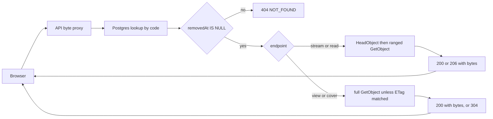

# Public Media Streaming and Viewing

> **Audience:** Anonymous visitors / public website · **Base path:** `/api/guest` ·
> **Source:** `platform/api/audio/AudioStreamAPI.java`, `platform/api/video/VideoStreamAPI.java`,
> `platform/api/image/ImageStreamAPI.java`, `platform/api/text/TextStreamAPI.java`

Every archived media file — audio, video, image, book/document, book cover — is served to the
browser by the API itself, never by S3. The endpoints below are byte proxies: they look the record
up in PostgreSQL, check that it has not been trashed, fetch the bytes from S3, and write them back
with the headers a browser needs to play, seek, render or cache them. Across these five endpoints
no presigned URL, bucket name or object key is ever sent to the client.

## Access

| Requirement | Value |
|---|---|
| Authentication | Not required |
| Authority | None — `SecurityConfig` declares `.requestMatchers("/api/guest/**").permitAll()`; no handler in the four stream controllers carries `@PreAuthorize` |
| Roles that hold it by default | Anonymous callers, and every signed-in role (GUEST, EMPLOYEE, TEACHER, ADMIN) |

## Endpoints

| Method | Path | Authority | Purpose |
|---|---|---|---|
| `GET` | `/api/guest/audio/{audioCode}/stream` | none (public) | Stream audio bytes, `Range`-aware |
| `GET` | `/api/guest/video/{videoCode}/stream` | none (public) | Stream video bytes, always partial |
| `GET` | `/api/guest/image/{imageCode}/view` | none (public) | Serve a full image, `ETag`-revalidated |
| `GET` | `/api/guest/text/{textCode}/read` | none (public) | Serve a book/document file, `Range`-aware |
| `GET` | `/api/guest/text/{textCode}/cover` | none (public) | Serve the book cover image, `ETag`-revalidated |

None of these controllers declare a class-level `@RequestMapping`; each path above is written in
full inside the method's `@GetMapping`.

## Where the URLs come from

You do not build these paths by hand. The guest catalog DTOs already carry the proxy path — as a
host-relative string — in the field where a raw file URL would otherwise sit:

| Guest DTO | Field | Value |
|---|---|---|
| `GuestAudioDTO` | `audioFileUrl` | `/api/guest/audio/{audioCode}/stream` |
| `GuestVideoDTO` | `videoFileUrl` | `/api/guest/video/{videoCode}/stream` |
| `GuestImageDTO` | `imageFileUrl` | `/api/guest/image/{imageCode}/view` |
| `GuestTextDTO` | `textFileUrl` | `/api/guest/text/{textCode}/read` |
| `GuestTextDTO` | `coverImageUrl` | `/api/guest/text/{textCode}/cover` |

`coverImageUrl` is set only when the record actually stores a cover; otherwise the mapper leaves it
`null` and `spring.jackson.default-property-inclusion=non_null` drops the field from the JSON
entirely. Treat an absent `coverImageUrl` as "this book has no cover" and do not render an ``
for it.

Media codes are generated in the format `PARENT_AUD_VERSION_VN_Copy(CN)_SEQUENCE` (and the `VID` /
`IMG` / `TXT` equivalents), for example `DENG_AUD_RAW_V1_Copy(1)_000001`. Use the code exactly as
the catalog returned it.

These five fields are the only file URLs on the public surface that are proxy paths. The one
public field that still carries the stored URL itself is `person.mediaPortrait` — see
[`./05-catalog.md`](./05-catalog.md).

## The visibility gate

Before a single byte is read from S3, each public handler resolves the record through a
repository method that filters on the trash column:

| Endpoint | Repository lookup |
|---|---|
| `/api/guest/audio/{audioCode}/stream` | `AudioRepository.findByAudioCodeAndRemovedAtIsNull` |
| `/api/guest/video/{videoCode}/stream` | `VideoRepository.findByVideoCodeAndRemovedAtIsNull` |
| `/api/guest/image/{imageCode}/view` | `ImageRepository.findByImageCodeAndRemovedAtIsNull` |
| `/api/guest/text/{textCode}/read` | `TextRepository.findByTextCodeAndRemovedAtIsNull` |
| `/api/guest/text/{textCode}/cover` | `TextRepository.findByTextCodeAndRemovedAtIsNull` |

If the row does not exist, or `removed_at` is set, the lookup returns empty and the handler throws
`404` immediately — no S3 call is made. Because the check runs per request, trashing a record takes
effect for every subsequent request, including requests from a browser that already knows the URL.

That is the only gate these five handlers apply. The catalog and search layer
(`GuestSearchService.isPubliclyVisible`) applies a wider test before a record is listed — it also
requires `isPublic` not to be `false`, and the owning project to be present, untrashed, and not
have `isVisibleToPublic` set to `false` — but the byte proxies themselves check `removedAt` alone.

> **Consequence worth understanding before you rely on `isPublic`.** Because the byte proxies
> check only `removedAt`, a record that is deliberately marked non-public — `isPublic = false`, or
> owned by a project that is trashed or has `isVisibleToPublic = false` — is **hidden from every
> guest listing, search result and detail endpoint, but its bytes are still served to anonymous
> callers who know the code**. The four extra checks that the catalog applies are never
> re-evaluated at the byte layer. In practice these records are *unlisted*, not *private*.
>
> Two things sharpen this. First, the successful response carries
> `Cache-Control: public, max-age=300` (`max-age=3600` for images and text covers), so an
> intermediary CDN or proxy may retain those bytes. Second, a note in the source names the
> `removedAt IS NULL` filter as the gate, which reads as though it were the whole visibility
> check rather than one fifth of it.
>
> If `isPublic` is meant to withhold content rather than merely unlist it, the five public
> handlers need the same predicate the catalog uses. Documented here as observed behavior; no
> code was changed.




## Error envelope

All five endpoints signal failure by throwing `ResponseStatusException`, which
`ApiExceptionHandler.handleResponseStatus` converts into the standard `ApiErrorResponse` body. A
`404` always carries `error` = `NOT_FOUND` and `category` = `NOT_FOUND`; a `500` always carries
`error` = `INTERNAL_SERVER_ERROR` and `category` = `SERVER_ERROR`. The specific cause is in
`message`.

```json
{
  "timestamp": "2026-08-26T09:14:03.812Z",
  "status": 404,
  "error": "NOT_FOUND",
  "category": "NOT_FOUND",
  "message": "Audio not found",
  "hint": "Check the identifier and try again.",
  "path": "/api/guest/audio/DENG_AUD_RAW_V1_Copy(1)_000001/stream"
}
```

`traceId` appears only when a trace id is present in the logging MDC, and `details` is never
populated by these handlers — both are omitted from the JSON when absent.

Note that the entity-specific codes `AUDIO_NOT_FOUND`, `VIDEO_NOT_FOUND`, `IMAGE_NOT_FOUND` and
`TEXT_NOT_FOUND` exist in `ErrorCode` but are **not** produced by the stream proxies; switch on
`NOT_FOUND` here.

### How a client should react

The status separates permanent failures from transient ones, and the two deserve different handling:

| Status | Meaning | Client behavior |
|---|---|---|
| `404` | The record is gone or trashed, has no stored file URL, or the S3 object behind it is missing. Retrying cannot change the answer | Render a placeholder or broken-media state and stop. Do not treat it as a network blip |
| `500` | Infrastructure — S3 unreachable, throttled, or an I/O error mid-read. The record and the object may both be fine | Retry with backoff, and surface an error only after the retries fail |

A missing S3 object is reported as `404` rather than `500` deliberately, so that this split is
possible at all: `mapStorageError` in each stream controller checks whether the
`UserStorageException` wraps an `S3Exception` carrying status `404` and maps that one case to `404`,
sending every other storage failure to `500`. The record is intact but the bytes are not — a
permanent condition a client should render rather than retry.

One `500` shape is the exception to the retry advice. When the `message` is the same wording as the
matching `404` — `Audio file not available`, `Video file not available`, `Image file not available`,
`Book file not available`, `Cover image not available` — the stored URL could not be parsed into an
S3 key, which is a data problem that no amount of retrying fixes. The `Failed to ...` messages are
the genuinely transient ones.

For an ``, `<audio>` or `<video>` element there is nothing to implement: the element fires its
`error` event on a `404` exactly as on any other failure, so an existing broken-media handler keeps
working unchanged.

---

### `GET /api/guest/audio/{audioCode}/stream`

Streams the stored audio file. Honors `Range` so `<audio>` elements can seek.

**Authority:** none — public.

**Path parameters**

| Name | Type | Description |
|---|---|---|
| `audioCode` | string | Business code of the audio record |

**Request headers**

| Name | Required | Effect |
|---|---|---|
| `Range` | no | `bytes=start-end`. When present and non-blank the response is `206`. |

Range parsing is deliberately forgiving. A header that is missing, blank, does not start with
`bytes=`, contains no `-`, or has non-numeric bounds falls back to the whole object
(`0` – `total-1`). `start` below `0` is clamped to `0`, `end` at or beyond the object size is
clamped to `total-1`, and an `end` below `start` is raised to `start`. An open-ended
`bytes=1024-` runs to the last byte.

**Response** `200 OK` — no `Range` header sent

```http
HTTP/1.1 200 OK
Content-Type: audio/mpeg
Content-Length: 5242880
Accept-Ranges: bytes
Content-Disposition: inline; filename="reel-12-side-a.mp3"; filename*=UTF-8''reel-12-side-a.mp3
Cache-Control: public, max-age=300
X-Content-Type-Options: nosniff
```

**Response** `206 Partial Content` — a `Range` header was sent

```http
HTTP/1.1 206 Partial Content
Content-Type: audio/mpeg
Content-Length: 1024
Content-Range: bytes 0-1023/5242880
Accept-Ranges: bytes
Content-Disposition: inline; filename="reel-12-side-a.mp3"; filename*=UTF-8''reel-12-side-a.mp3
Cache-Control: public, max-age=300
X-Content-Type-Options: nosniff
```

The body is the raw audio bytes. `Content-Range` is set **only** on a `206`; because the status is
driven by the presence of the header rather than by successful parsing, an unparseable `Range` still
yields `206` with `Content-Range: bytes 0-<total-1>/<total>` and the complete file.

**Content-Type resolution** — matched against the stored file URL, lowercased, first match wins:

| Substring in URL | `Content-Type` |
|---|---|
| `.mp3` | `audio/mpeg` |
| `.ogg` | `audio/ogg` |
| `.wav` | `audio/wav` |
| `.flac` | `audio/flac` |
| `.aac` | `audio/aac` |
| `.m4a` | `audio/mp4` |
| anything else | `application/octet-stream` |

**Errors**

| Status | `error` code | `message` | When |
|---|---|---|---|
| `404` | `NOT_FOUND` | `Audio not found` | No record with that code, or the record is trashed |
| `404` | `NOT_FOUND` | `Audio file not available` | Record exists but `audioFileUrl` is null or blank |
| `404` | `NOT_FOUND` | `Audio not available for <audioCode>` | S3 answered `404` for the stored key |
| `500` | `INTERNAL_SERVER_ERROR` | `Audio file not available` | The stored URL could not be parsed into an S3 key |
| `500` | `INTERNAL_SERVER_ERROR` | `Failed to stream audio` | Any other S3 failure, or an I/O error reading the range |

**Example**

```bash
curl -s "{{BASE_URL}}/api/guest/audio/DENG_AUD_RAW_V1_Copy(1)_000001/stream" \
  --output track.mp3
```

**Notes** — with no `Range` header the requested window is the entire object, so the whole file is
read into memory for that one request. Browsers avoid this on their own by sending `Range`; a
non-browser client fetching large audio should send `Range` too.

---

### `GET /api/guest/video/{videoCode}/stream`

Streams the stored video file. Always answers with partial content.

**Authority:** none — public.

**Path parameters**

| Name | Type | Description |
|---|---|---|
| `videoCode` | string | Business code of the video record |

**Request headers**

| Name | Required | Effect |
|---|---|---|
| `Range` | no | `bytes=start-end`. When absent, the handler serves the first 2 MB (`2 * 1024 * 1024` bytes) instead of the whole file. |

Clamping rules are the same as for audio. The difference is the fallback: a missing, blank or
unparseable `Range` yields `0` – `min(2097151, total-1)` rather than the whole object.

**Response** `206 Partial Content` — every successful response, with or without `Range`

```http
HTTP/1.1 206 Partial Content
Content-Type: video/mp4
Content-Length: 2097152
Content-Range: bytes 0-2097151/734003200
Accept-Ranges: bytes
Content-Disposition: inline; filename="interview-1998.mp4"; filename*=UTF-8''interview-1998.mp4
Cache-Control: public, max-age=300
X-Content-Type-Options: nosniff
```

This endpoint never returns `200`. `Content-Range` is always present. Video players expect partial
content in order to enable seeking, and the fixed initial window keeps the first request cheap no
matter how large the file is.

**Content-Type resolution**

| Substring in URL | `Content-Type` |
|---|---|
| `.mp4` | `video/mp4` |
| `.webm` | `video/webm` |
| `.ogg` | `video/ogg` |
| `.mov` | `video/quicktime` |
| `.avi` | `video/x-msvideo` |
| `.mkv` | `video/x-matroska` |
| anything else | `application/octet-stream` |

**Errors**

| Status | `error` code | `message` | When |
|---|---|---|---|
| `404` | `NOT_FOUND` | `Video not found` | No record with that code, or the record is trashed |
| `404` | `NOT_FOUND` | `Video file not available` | Record exists but `videoFileUrl` is null or blank |
| `404` | `NOT_FOUND` | `Video not available for <videoCode>` | S3 answered `404` for the stored key |
| `500` | `INTERNAL_SERVER_ERROR` | `Video file not available` | The stored URL could not be parsed into an S3 key |
| `500` | `INTERNAL_SERVER_ERROR` | `Failed to stream video` | Any other S3 failure, or an I/O error reading the range |

**Example**

```bash
curl -s -D - -o /dev/null \
  -H "Range: bytes=2097152-4194303" \
  "{{BASE_URL}}/api/guest/video/DENG_VID_MASTER_V1_Copy(1)_000001/stream"
```

**Notes** — a client that reads the whole response body in one shot
(`fetch(...).then(r => r.blob())`, or `curl` with no `Range`) receives **only the first 2 MB**, not
the file. The response is a well-formed `206` and nothing about it signals truncation; the symptom
appears later as a video that plays for a few seconds and stops. Read the total object size from the
third number in `Content-Range`, then either issue successive `Range` requests, or point a `<video>`
element at the URL and let the browser fetch the windows it needs.

---

### `GET /api/guest/image/{imageCode}/view`

Serves the full image. There is no `Range` handling here — the handler downloads the whole object
and returns `200`.

**Authority:** none — public.

**Path parameters**

| Name | Type | Description |
|---|---|---|
| `imageCode` | string | Business code of the image record |

**Request headers**

| Name | Required | Effect |
|---|---|---|
| `If-None-Match` | no | Compared against the computed `ETag`. On an exact match the handler returns `304` before touching S3. |

A `Range` header is not bound by this handler and has no effect.

**Response** `200 OK`

```http
HTTP/1.1 200 OK
Content-Type: image/jpeg
Content-Length: 482113
Content-Disposition: inline; filename="portrait-1972.jpg"; filename*=UTF-8''portrait-1972.jpg
ETag: "9f86d081884c"
Cache-Control: public, max-age=3600
X-Content-Type-Options: nosniff
```

**Response** `304 Not Modified` — `If-None-Match` matched

```http
HTTP/1.1 304 Not Modified
ETag: "9f86d081884c"
```

The `304` branch sets the `ETag` and nothing else — no `Content-Type`, no `Cache-Control`, no body.

The `ETag` value is the first 6 bytes of the SHA-1 of the `imageCode`, rendered as 12 lowercase hex
characters and wrapped in double quotes. It is derived from the code alone, so it stays constant for
the life of the record and does not change if the stored file behind it is replaced.

**Content-Type resolution**

| Substring in URL | `Content-Type` |
|---|---|
| `.jpg` or `.jpeg` | `image/jpeg` |
| `.png` | `image/png` |
| `.gif` | `image/gif` |
| `.webp` | `image/webp` |
| `.tif` or `.tiff` | `image/tiff` |
| `.bmp` | `image/bmp` |
| `.svg` | `image/svg+xml` |
| anything else | `application/octet-stream` |

**Errors**

| Status | `error` code | `message` | When |
|---|---|---|---|
| `404` | `NOT_FOUND` | `Image not found` | No record with that code, or the record is trashed |
| `404` | `NOT_FOUND` | `Image file not available` | Record exists but `imageFileUrl` is null or blank |
| `404` | `NOT_FOUND` | `Image not available for <imageCode>` | S3 answered `404` for the stored key |
| `500` | `INTERNAL_SERVER_ERROR` | `Image file not available` | The stored URL could not be parsed into an S3 key |
| `500` | `INTERNAL_SERVER_ERROR` | `Failed to serve image` | Any other S3 failure, or an I/O error reading the object |

**Example**

```bash
curl -s -D - -o /dev/null \
  -H 'If-None-Match: "9f86d081884c"' \
  "{{BASE_URL}}/api/guest/image/DENG_IMG_MASTER_V1_Copy(1)_000001/view"
```

---

### `GET /api/guest/text/{textCode}/read`

Serves the book or document file itself — PDF, EPUB, DOCX and friends. Honors `Range` so PDF.js and
built-in browser PDF viewers can fetch individual pages without downloading the whole file.

**Authority:** none — public.

**Path parameters**

| Name | Type | Description |
|---|---|---|
| `textCode` | string | Business code of the text record |

**Request headers**

| Name | Required | Effect |
|---|---|---|
| `Range` | no | `bytes=start-end`. When present and non-blank the response is `206`. |

Parsing and clamping are identical to the audio endpoint, including the fallback to the whole
object when the header is missing or unparseable.

**Response** `200 OK` — no `Range` header sent

```http
HTTP/1.1 200 OK
Content-Type: application/pdf
Content-Length: 18874368
Accept-Ranges: bytes
Content-Disposition: inline; filename="diwan-1965.pdf"; filename*=UTF-8''diwan-1965.pdf
Cache-Control: public, max-age=3600
X-Content-Type-Options: nosniff
```

**Response** `206 Partial Content` — a `Range` header was sent

```http
HTTP/1.1 206 Partial Content
Content-Type: application/pdf
Content-Length: 65536
Content-Range: bytes 0-65535/18874368
Accept-Ranges: bytes
Content-Disposition: inline; filename="diwan-1965.pdf"; filename*=UTF-8''diwan-1965.pdf
Cache-Control: public, max-age=3600
X-Content-Type-Options: nosniff
```

`Content-Range` is set only on a `206`.

**Content-Type resolution**

| Substring in URL | `Content-Type` |
|---|---|
| `.pdf` | `application/pdf` |
| `.epub` | `application/epub+zip` |
| `.docx` | `application/vnd.openxmlformats-officedocument.wordprocessingml.document` |
| `.doc` | `application/msword` |
| `.txt` | `text/plain` |
| `.html` or `.htm` | `text/html` |
| anything else | `application/octet-stream` |

**Errors**

| Status | `error` code | `message` | When |
|---|---|---|---|
| `404` | `NOT_FOUND` | `Text not found` | No record with that code, or the record is trashed |
| `404` | `NOT_FOUND` | `Book file not available` | Record exists but `textFileUrl` is null or blank |
| `404` | `NOT_FOUND` | `Book file not available for <textCode>` | S3 answered `404` for the stored key |
| `500` | `INTERNAL_SERVER_ERROR` | `Book file not available` | The stored URL could not be parsed into an S3 key |
| `500` | `INTERNAL_SERVER_ERROR` | `Failed to stream book file` | Any other S3 failure, or an I/O error reading the range |

**Example**

```bash
curl -s "{{BASE_URL}}/api/guest/text/DENG_TXT_MASTER_V1_Copy(1)_000001/read" \
  --output book.pdf
```

---

### `GET /api/guest/text/{textCode}/cover`

Serves the cover image of a text record, separately from the book file.

**Authority:** none — public.

**Path parameters**

| Name | Type | Description |
|---|---|---|
| `textCode` | string | Business code of the text record |

**Request headers**

| Name | Required | Effect |
|---|---|---|
| `If-None-Match` | no | Compared against the computed `ETag`. On an exact match the handler returns `304` before touching S3. |

**Response** `200 OK`

```http
HTTP/1.1 200 OK
Content-Type: image/jpeg
Content-Length: 96214
Content-Disposition: inline
ETag: "3b1f5c0a7de2"
Cache-Control: public, max-age=3600
X-Content-Type-Options: nosniff
```

**Response** `304 Not Modified` — `If-None-Match` matched

```http
HTTP/1.1 304 Not Modified
ETag: "3b1f5c0a7de2"
```

Two details differ from `/view`. The `Content-Disposition` here is the bare value `inline` with no
`filename` part. And the `ETag` is computed over `textCode + "-cover"`, not over the code alone, so
a book's cover and any other resource keyed on the same code get distinct tags.

**Content-Type resolution**

| Substring in URL | `Content-Type` |
|---|---|
| `.jpg` or `.jpeg` | `image/jpeg` |
| `.png` | `image/png` |
| `.webp` | `image/webp` |
| anything else | `image/jpeg` |

Unlike the other four endpoints, an unrecognized extension defaults to `image/jpeg` rather than
`application/octet-stream`.

**Errors**

| Status | `error` code | `message` | When |
|---|---|---|---|
| `404` | `NOT_FOUND` | `Text not found` | No record with that code, or the record is trashed |
| `404` | `NOT_FOUND` | `Cover image not available` | Record exists but `coverImageUrl` is null or blank |
| `404` | `NOT_FOUND` | `Cover image not available for <textCode>` | S3 answered `404` for the stored key |
| `500` | `INTERNAL_SERVER_ERROR` | `Cover image not available` | The stored URL could not be parsed into an S3 key |
| `500` | `INTERNAL_SERVER_ERROR` | `Failed to serve cover image` | Any other S3 failure, or an I/O error reading the object |

**Example**

```bash
curl -s "{{BASE_URL}}/api/guest/text/DENG_TXT_MASTER_V1_Copy(1)_000001/cover" \
  --output cover.jpg
```

---

## Response header reference

| Header | audio `/stream` | video `/stream` | image `/view` | text `/read` | text `/cover` |
|---|---|---|---|---|---|
| `Content-Type` | yes | yes | yes | yes | yes |
| `Content-Length` | yes | yes | yes | yes | yes |
| `Accept-Ranges: bytes` | yes | yes | — | yes | — |
| `Content-Range` | on `206` only | always | — | on `206` only | — |
| `Content-Disposition` | `inline` + filename | `inline` + filename | `inline` + filename | `inline` + filename | `inline` (bare) |
| `Cache-Control` | `public, max-age=300` | `public, max-age=300` | `public, max-age=3600` | `public, max-age=3600` | `public, max-age=3600` |
| `ETag` | — | — | yes | — | yes |
| `X-Content-Type-Options: nosniff` | yes | yes | yes | yes | yes |
| Success status | `200` or `206` | `206` always | `200` or `304` | `200` or `206` | `200` or `304` |

The rows describe the `200` / `206` responses. A `304` from `/view` or `/cover` carries the `ETag`
and nothing else — no `Content-Type`, no `Content-Length`, no `Cache-Control`, no body.

On the four endpoints that name a file, `Content-Disposition` is built as an RFC 5987 pair:
`inline; filename="<ascii>"; filename*=UTF-8''<percent-encoded>`. The UTF-8 half carries the
record's stored `fileName` verbatim, which preserves Kurdish and Arabic titles. The ASCII half is
the same name with every character outside `a-zA-Z0-9._-()` and space replaced by `_`; if that
leaves nothing but underscores and spaces, it is replaced by a generated name such as
`audio-<audioCode>.mp3`, `video-<videoCode>.mp4`, `image-<imageCode>.jpeg` or `book-<textCode>.pdf`.
When the record stores no `fileName` at all, the generated name is used for both halves. The
`/cover` handler is the exception: it sets the bare value `inline` and never names a file.

---

## Why the bytes are proxied

Every one of these endpoints could have been a redirect to a presigned S3 URL. It is not, and the
choice is deliberate.

**What proxying buys**

- **No S3 identity leaks to the client.** The bucket name, the base folder layout and the object key
  never appear in a response. A visitor inspecting the network tab sees only
  `/api/guest/...`. The stored S3 URL lives only in the database and inside `S3Service`.
- **The trash gate is re-evaluated on every request.** A presigned URL keeps working until it
  expires, no matter what happens to the record behind it. Here, the `removedAt IS NULL` lookup runs
  before each response, so trashing a record stops delivery at once — including for a browser that
  already has the URL in its history.
- **One origin, one credential story.** The browser talks only to the API. An earlier version of the
  frontend sent the JWT `Authorization` header straight at S3, which S3 rejects with `400 Bad
  Request`; proxying removes that class of problem entirely, and removes the need to configure CORS
  on the bucket.
- **The API owns the response headers.** `Content-Type` is derived from the file extension rather
  than trusted from whatever was stamped on the object at upload, `X-Content-Type-Options: nosniff`
  is always sent, and `Content-Disposition` is always `inline` so files render in the page instead of
  triggering a download prompt.
- **Cache policy is set per audience.** Public responses carry `public, max-age=300` for
  audio/video and `public, max-age=3600` for images, covers and book files, so a browser or any CDN
  placed in front of the API can absorb repeat traffic. Image and cover responses add an `ETag`, so
  a revalidation after expiry costs a `304` with no S3 round-trip and no bytes on the wire.

**What proxying costs**

- **Every byte transits the application.** Bandwidth, sockets and request time land on the API
  process rather than on S3. This is the central trade: security and revocability in exchange for
  origin load.
- **Responses are materialized in the JVM heap.** Each handler reads its byte window fully into a
  `byte[]` before writing it out. The window size is what bounds the cost: video without a `Range`
  is capped at 2 MB, but audio and book files without a `Range` header, and images and covers
  always, load the entire object into memory for that request. Large images and large non-ranged
  requests are therefore the expensive shapes.
- **Two S3 calls per request on the streaming endpoints.** Audio, video and book-file requests issue
  a `HeadObject` for the total size and then a ranged `GetObject`, whether or not the caller sent a
  `Range`. Images and covers issue a single full `GetObject` — or none at all when `If-None-Match`
  matches.
- **Caching has to be re-implemented in headers.** Without S3 or CloudFront in the request path, the
  `Cache-Control` and `ETag` values above are the only caching the client gets.
- **`ETag`s are derived from the code, not the content.** Replacing the file behind an existing
  `imageCode` or cover does not change its `ETag`, so a client that already cached it will keep
  revalidating to `304` and keep showing the old bytes.

---

## Using the endpoints in a page

Because the responses are ordinary HTTP with no auth requirement, the URLs drop straight into the
native elements. Take the URL from the catalog DTO field and prefix your API origin — see
[Building the absolute URL](#building-the-absolute-url) for the neighboring fields that must not be
prefixed.

```html
<!-- Audio: preload="metadata" lets the browser fetch a small ranged window
     for duration/seek data instead of the whole file. -->
<audio
  controls
  preload="metadata"
  src="{{BASE_URL}}/api/guest/audio/DENG_AUD_RAW_V1_Copy(1)_000001/stream">
</audio>
```

```html
<!-- Video: the first request returns 206 with the leading 2 MB; the browser
     then issues its own Range requests as the viewer scrubs. -->
<video
  controls
  playsinline
  width="720"
  src="{{BASE_URL}}/api/guest/video/DENG_VID_MASTER_V1_Copy(1)_000001/stream">
</video>
```

```html
<!-- Image: a plain . The ETag makes the second load a 304. -->

```

```html
<!-- Book cover: render this only when coverImageUrl was present in the DTO. -->

```

```html
<!-- Book file: Accept-Ranges lets a PDF viewer load page by page. -->
<iframe
  title="Book"
  width="100%"
  height="800"
  src="{{BASE_URL}}/api/guest/text/DENG_TXT_MASTER_V1_Copy(1)_000001/read">
</iframe>
```

### Building the absolute URL

The five proxy fields are host-relative — `/api/guest/audio/…`, not `https://…/api/guest/audio/…` —
so each needs your API origin prepended before it can go into a `src`. Neighboring fields on the
same DTO are not: `personMediaPortrait` on `GuestAudioDTO`, `GuestVideoDTO`, `GuestImageDTO` and
`GuestTextDTO`, and `mediaPortrait` on the person DTOs, carry the URL as stored, which is normally
an absolute `https://` link to S3 or an external source. A media card that renders a thumbnail
beside a portrait touches both shapes in one component, so guard the prefix instead of
concatenating unconditionally:

```js
const API_BASE = import.meta.env.VITE_API_BASE_URL;   // e.g. '{{BASE_URL}}'

export const mediaUrl = (path) => {
  if (!path) return null;
  if (path.startsWith('http')) return path;   // portrait URLs are already absolute
  return `${API_BASE}${path}`;
};
```

`mediaUrl(image.imageFileUrl)` yields `{{BASE_URL}}/api/guest/image/…/view`, while
`mediaUrl(image.personMediaPortrait)` passes the stored absolute URL through untouched.

Returning `null` for a missing value matters as much as the prefixing. Because responses are
serialized with `non_null`, an absent `coverImageUrl` is simply not in the JSON, and feeding
`undefined` to a `src` attribute makes the browser request the current page URL and render a broken
image rather than nothing at all.

### Discouraging downloads

`Content-Disposition: inline` is chosen so files render in the page instead of triggering a save
dialog, but it is only half of the arrangement — the other half lives in your markup. The native
media elements expose a download affordance of their own, and nothing the server sends removes it:

| Element | Attributes to add | Effect |
|---|---|---|
| `<audio>` | `controlsList="nodownload"` | Drops the download item from the built-in control bar |
| `<video>` | `controlsList="nodownload nofullscreen"`, `oncontextmenu="return false"` | The same, plus suppresses the "Save video as…" context menu |
| `` | `draggable="false"`, `oncontextmenu="return false"` | Blocks drag-to-desktop and "Save image as…" |

Be precise about what this achieves. It removes the one-click path for an ordinary visitor, which is
what the archive's licensing statement asks for. It does **not** protect the bytes: these endpoints
are public, unauthenticated and unthrottled, so anyone holding a media code can fetch the complete
file with one `curl`. `controlsList` is also Chromium-only — Firefox and Safari ignore it. Treat
these attributes as a courtesy, never as access control. The gate that actually matters is the trash
check described above, plus keeping the codes of non-public records out of catalog responses.

### Gallery and list pages

There are no thumbnails. `/view` and `/cover` serve the stored object at its original size, and each
response is a full `GetObject` that the API buffers before writing it out — a page rendering forty
archive scans asks the origin for forty full-size files. Neither endpoint binds `Range`, so there is
no way to ask for less.

What keeps that affordable is entirely on the client side:

- `loading="lazy"` on every off-screen ``, so only what the visitor scrolls to is fetched.
- Fixed `width`/`height` (or an aspect-ratio box) on the placeholder, so lazy loading does not reflow
  the grid as images land.
- For the heaviest material — book scans, high-resolution photographs — render a click-to-open
  placeholder and request the image only when the visitor opens that item.

The `ETag` makes the *second* visit cheap: a `304` with no body and no S3 round trip. It does nothing
for the first one. Order the grid so the first screenful is the small material.

### Verifying a range with curl

Fetch the first kilobyte of an audio file and print only the response headers:

```bash
curl -s -D - -o /dev/null \
  -H "Range: bytes=0-1023" \
  "{{BASE_URL}}/api/guest/audio/DENG_AUD_RAW_V1_Copy(1)_000001/stream"
```

Expected:

```http
HTTP/1.1 206 Partial Content
Content-Type: audio/mpeg
Content-Length: 1024
Content-Range: bytes 0-1023/5242880
Accept-Ranges: bytes
Content-Disposition: inline; filename="reel-12-side-a.mp3"; filename*=UTF-8''reel-12-side-a.mp3
Cache-Control: public, max-age=300
X-Content-Type-Options: nosniff
```

The third number in `Content-Range` is the total object size — read it from a cheap one-byte probe
(`Range: bytes=0-0`) when you need the size without transferring the file.

---

## The authenticated twins

Each of these five proxies has a sibling handler in the same controller, mounted without the
`/guest` segment, which requires a valid JWT:

- `GET /api/audio/{audioCode}/stream`
- `GET /api/video/{videoCode}/stream`
- `GET /api/image/{imageCode}/view`
- `GET /api/text/{textCode}/read`
- `GET /api/text/{textCode}/cover`

They share the streaming logic documented above but resolve the record without the trash filter and
send `Cache-Control: no-store, private`, so staff can preview soft-deleted records before restoring
them. They are part of the back-office surface and are documented in the internal docs — see
[`../internal/00-overview.md`](../internal/00-overview.md) and the per-entity pages under
[`../internal/content/`](../internal/content/). Do not call them from a public page: they are not
covered by the `permitAll()` rule and will reject an anonymous request.

### Diagnosing a `401` on a public page

A public page should never see a `401` from these endpoints — `SecurityConfig` declares
`/api/guest/**` as `permitAll()`, and `JWTAuthenticationFilter.shouldNotFilter` skips the filter
entirely for any URI starting `/api/guest/`. When a `401` does appear, the request went to an
authenticated twin rather than to the guest path, and `JwtAuthenticationEntryPoint` names the cause:

```json
{
  "timestamp": "2026-08-26T09:14:03.812Z",
  "status": 401,
  "error": "TOKEN_MISSING",
  "category": "AUTHENTICATION",
  "message": "Authentication is required to access this resource.",
  "hint": "Sign in and retry the request — include the Bearer token in the 'Authorization' header or auth cookie.",
  "path": "/api/image/DENG_IMG_MASTER_V1_Copy(1)_000001/view"
}
```

The missing `/guest` segment in `path` is the whole diagnosis. (`error` is `AUTHENTICATION_FAILED`
instead when credentials were supplied but rejected.) There are two usual causes:

- **The path was assembled by hand in the client.** Take `audioFileUrl`, `videoFileUrl`,
  `imageFileUrl`, `textFileUrl` and `coverImageUrl` exactly as `/api/guest/**` returned them, prefix
  your API origin, and change nothing else.
- **The record came from a staff endpoint.** The back-office mappers set those same five fields to
  the authenticated paths for *every* row, including rows that are fully public, so their URLs
  cannot be reused on the anonymous surface. Re-read the record from
  `/api/guest/{audios,videos,texts,images}/{code}` and use the path that guest DTO carries.

A record being public does not make the authenticated twin public, and holding a valid session does
not change how the guest path behaves. The prefix is chosen by the page, not by the record.

## Related

- [Documentation index for the public API](./README.md)
- [Shared conventions — error envelope, paging, timestamps](./01-conventions.md)
- [Error envelope and the full `ErrorCode` set](./02-errors.md)
- [Guest media listings — the DTOs that carry these proxy paths](./06-media.md)
- [Internal (staff) documentation index](../internal/00-overview.md)
