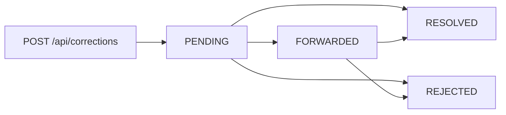

# Submitting Corrections

> **Audience:** signed-in visitors · **Base path:** `/api/corrections` · **Source:** `src/main/java/ak/dev/khi_archive_platform/platform/api/correction/GuestCorrectionAPI.java`

The correction API is the "Help Us" channel: a signed-in visitor who spots a wrong or missing
value on a public media record proposes a better one, and an administrator reviews it. Nothing is
written to the media record by this API — a submission only creates a suggestion that staff can
forward, apply, or reject. Two further endpoints let a submitter track their own suggestions
afterwards, and a fourth lists the media types the submission form accepts.

## Access

| Requirement | Value |
|---|---|
| Authentication | required |
| Authority | `isAuthenticated()` — declared on the **class**, so it applies to all four methods |
| Roles that hold it by default | GUEST, EMPLOYEE, TEACHER, ADMIN (every signed-in account) |

No `<resource>:<action>` permission is involved. A plain GUEST account created through
`POST /api/auth/register` can submit corrections immediately. Requests carry the JWT in the
HttpOnly cookie (default name `khi_auth_token`); the authentication filter also accepts an
`Authorization: Bearer …` header, which it checks before the cookie.

## Endpoints

| Method | Path | Authority | Purpose |
|---|---|---|---|
| `POST` | `/api/corrections` | `isAuthenticated()` | Submit one correction suggestion |
| `GET` | `/api/corrections/me` | `isAuthenticated()` | Paged list of your own submissions, newest first |
| `GET` | `/api/corrections/me/{id}` | `isAuthenticated()` | Read one of your own submissions |
| `GET` | `/api/corrections/catalog/media-types` | `isAuthenticated()` | Valid `mediaType` values for the form |

All four inherit the class-level `@PreAuthorize("isAuthenticated()")`; none of them carries a
method-level `@PreAuthorize`.

---

## The correction object

Every endpoint that returns a correction returns the same shape
(`GuestCorrectionResponseDTO`). Null fields are omitted from the JSON, so a fresh submission
carries far fewer keys than a resolved one.

| Field | Type | Set by | Description |
|---|---|---|---|
| `id` | number | server | Correction id — the `{id}` used by `GET /api/corrections/me/{id}` |
| `mediaType` | string | you | `AUDIO`, `VIDEO`, `IMAGE` or `TEXT` |
| `mediaCode` | string | you | The public code of the record you are correcting |
| `mediaTitle` | string | server | Title read off the record at submission time |
| `targetField` | string | you | Name of the field you want changed |
| `currentValue` | string | you | Snapshot of what the field showed when you submitted |
| `suggestedValue` | string | you | The value you believe is correct |
| `note` | string | you | Your explanation / source |
| `guestUserId` | number | server | Your user id, taken from the authenticated principal |
| `guestUsername` | string | server | Your username |
| `guestDisplayName` | string | server | Your display name |
| `status` | string | server | `PENDING`, `FORWARDED`, `RESOLVED` or `REJECTED` |
| `recordCreatedBy` | string | server | Username of the staff member who created the media record |
| `forwardedBy` | string | admin | Admin who forwarded the suggestion to that staff member |
| `forwardedAt` | string | admin | When it was forwarded (ISO-8601) |
| `forwardNote` | string | admin | Optional note the admin attached when forwarding |
| `resolvedBy` | string | admin | Admin who resolved or rejected it |
| `resolvedAt` | string | admin | When it was resolved or rejected (ISO-8601) |
| `resolveNote` | string | admin | Optional note explaining the outcome |
| `createdAt` | string | server | Submission time (ISO-8601) |
| `updatedAt` | string | server | Last status change (ISO-8601) |
| `removedAt` | string | admin | Soft-delete timestamp — see the note below |

`removedAt` is part of the DTO but is never populated on these endpoints: both `/me` reads are
restricted to rows where `removed_at IS NULL`, so a soft-deleted correction disappears from your
list rather than appearing with a `removedAt` value.

Every timestamp on this DTO is an `Instant` and serializes as an ISO-8601 **UTC** string with a
trailing `Z` — never an epoch number, and never an offset such as `+03:00`. Convert to the
reader's zone in the client; see [`./01-conventions.md`](./01-conventions.md).

---

### `POST /api/corrections`

Submit one correction suggestion for one field of one media record.

**Authority:** `isAuthenticated()` (class-level)

**Request body**

| Field | Type | Required | Constraint | Description |
|---|---|---|---|---|
| `mediaType` | string (enum) | yes | `@NotNull` — "mediaType is required (AUDIO, VIDEO, IMAGE, TEXT)" | Which media table the record lives in |
| `mediaCode` | string | yes | `@NotBlank`, `@Size(max = 255)` | Public code of the record; must match an untrashed record |
| `targetField` | string | yes | `@NotBlank`, `@Size(max = 100)` | Field name you want corrected |
| `currentValue` | string | no | `@Size(max = 5000)` | What the field showed when you submitted |
| `suggestedValue` | string | yes | `@NotBlank`, `@Size(max = 5000)` | The value you propose |
| `note` | string | no | `@Size(max = 2000)` | Why you believe the change is right |

No other fields are read from the body. `guestUserId`, `guestUsername`, `guestDisplayName`,
`mediaTitle`, `recordCreatedBy`, `status` and the timestamps are all filled in server-side and
cannot be spoofed by the client.

```json
{
  "mediaType": "AUDIO",
  "mediaCode": "AUD-2019-0031",
  "targetField": "poet",
  "currentValue": "Unknown",
  "suggestedValue": "Nali",
  "note": "The cassette sleeve credits Nali as the poet."
}
```

**Response** `201 Created`

```json
{
  "id": 412,
  "mediaType": "AUDIO",
  "mediaCode": "AUD-2019-0031",
  "mediaTitle": "Maqam Rast — evening recording",
  "targetField": "poet",
  "currentValue": "Unknown",
  "suggestedValue": "Nali",
  "note": "The cassette sleeve credits Nali as the poet.",
  "guestUserId": 87,
  "guestUsername": "rezan",
  "guestDisplayName": "Rezan Ahmed",
  "status": "PENDING",
  "recordCreatedBy": "hiwa",
  "createdAt": "2026-08-26T11:12:07.481Z",
  "updatedAt": "2026-08-26T11:12:07.481Z"
}
```

**Errors**

| Status | `error` code | When |
|---|---|---|
| `400` | `VALIDATION_ERROR` | A `@NotNull` / `@NotBlank` / `@Size` constraint failed; `details` maps each field to its message |
| `400` | `JSON_PARSE_ERROR` | Body is not valid JSON, or `mediaType` is not one of the four enum names |
| `401` | `TOKEN_MISSING` | No credentials at all — no cookie and no `Authorization` header |
| `401` | `TOKEN_EXPIRED` / `TOKEN_REVOKED` / `TOKEN_MALFORMED` / `TOKEN_INVALID_SIGNATURE` / `TOKEN_INVALID` | A token was supplied and the JWT filter rejected it; the code names the reason — see [`./02-errors.md`](./02-errors.md) |
| `404` | `CORRECTION_NOT_FOUND` | No untrashed record exists for that `mediaType` + `mediaCode` |

The `404` on an unknown media code is worth calling out: the service looks the record up to copy
its title and creator, and that lookup failure is reported with the correction error code
`CORRECTION_NOT_FOUND` — not `AUDIO_NOT_FOUND` / `VIDEO_NOT_FOUND` / `IMAGE_NOT_FOUND` /
`TEXT_NOT_FOUND`. The `message` still names the media type, e.g.
`"Audio record not found: code=AUD-2019-0031"`.

**Example**

```bash
curl -s -X POST "{{BASE_URL}}/api/corrections" \
  -H "Content-Type: application/json" \
  -H "Cookie: khi_auth_token=$TOKEN" \
  -d '{
        "mediaType": "AUDIO",
        "mediaCode": "AUD-2019-0031",
        "targetField": "poet",
        "currentValue": "Unknown",
        "suggestedValue": "Nali",
        "note": "The cassette sleeve credits Nali as the poet."
      }'
```

**Notes**

- `targetField`, `currentValue`, `suggestedValue` and `note` are trimmed and HTML-escaped before
  they are stored, so characters such as `<`, `>`, `&` and `"` come back as character entities in
  every later read. `mediaCode` is stored as sent.
- The record must be untrashed (`removed_at IS NULL`). Public visibility is not checked here.
- There is no duplicate detection — submitting the same field twice creates two independent
  corrections.
- Each submission writes a `SUBMIT` row to `guest_correction_audit_logs` capturing your username,
  session, IP address and User-Agent.

---

### `GET /api/corrections/me`

List your own submissions, newest first.

**Authority:** `isAuthenticated()` (class-level)

**Query parameters**

| Name | Type | Default | Description |
|---|---|---|---|
| `page` | int | `0` | Zero-based page index; `null` or negative is clamped to `0` |
| `size` | int | `25` | `null` or `<= 0` falls back to `25`; values above `200` are capped at `200` |

Sorting is fixed to `createdAt` descending and cannot be changed by the client. There are no
status or media-type filters on this endpoint — filter client-side, or use
`GET /api/corrections/me/{id}` for a single row.

**Response** `200 OK` — the standard Spring `Page` envelope described in
[`./01-conventions.md`](./01-conventions.md). Each `content[]` element is a
[correction object](#the-correction-object).

```json
{
  "content": [
    {
      "id": 412,
      "mediaType": "AUDIO",
      "mediaCode": "AUD-2019-0031",
      "mediaTitle": "Maqam Rast — evening recording",
      "targetField": "poet",
      "currentValue": "Unknown",
      "suggestedValue": "Nali",
      "note": "The cassette sleeve credits Nali as the poet.",
      "guestUserId": 87,
      "guestUsername": "rezan",
      "guestDisplayName": "Rezan Ahmed",
      "status": "FORWARDED",
      "recordCreatedBy": "hiwa",
      "forwardedBy": "admin",
      "forwardedAt": "2026-08-26T13:03:55.220Z",
      "forwardNote": "Please compare with the sleeve scan.",
      "createdAt": "2026-08-26T11:12:07.481Z",
      "updatedAt": "2026-08-26T13:03:55.220Z"
    }
  ],
  "pageable": {
    "pageNumber": 0,
    "pageSize": 25,
    "offset": 0,
    "paged": true,
    "unpaged": false
  },
  "totalElements": 1,
  "totalPages": 1,
  "number": 0,
  "size": 25,
  "first": true,
  "last": true,
  "numberOfElements": 1,
  "empty": false
}
```

**Errors**

| Status | `error` code | When |
|---|---|---|
| `400` | `TYPE_MISMATCH` | `page` or `size` is not an integer |
| `401` | `TOKEN_MISSING` | No credentials at all — no cookie and no `Authorization` header |
| `401` | `TOKEN_EXPIRED` / `TOKEN_REVOKED` / `TOKEN_MALFORMED` / `TOKEN_INVALID_SIGNATURE` / `TOKEN_INVALID` | A token was supplied and the JWT filter rejected it |

**Example**

```bash
curl -s "{{BASE_URL}}/api/corrections/me?page=0&size=20" \
  -H "Cookie: khi_auth_token=$TOKEN"
```

**Notes**

- The query is scoped by your own `guestUserId`; there is no parameter that widens it.
- Listing your corrections is not audited. Reading a single one is — see below.

---

### `GET /api/corrections/me/{id}`

Read one of your own submissions.

**Authority:** `isAuthenticated()` (class-level)

**Path parameters**

| Name | Type | Description |
|---|---|---|
| `id` | long | Correction id returned by `POST /api/corrections` |

**Response** `200 OK` — a single [correction object](#the-correction-object).

```json
{
  "id": 412,
  "mediaType": "AUDIO",
  "mediaCode": "AUD-2019-0031",
  "mediaTitle": "Maqam Rast — evening recording",
  "targetField": "poet",
  "currentValue": "Unknown",
  "suggestedValue": "Nali",
  "note": "The cassette sleeve credits Nali as the poet.",
  "guestUserId": 87,
  "guestUsername": "rezan",
  "guestDisplayName": "Rezan Ahmed",
  "status": "RESOLVED",
  "recordCreatedBy": "hiwa",
  "forwardedBy": "admin",
  "forwardedAt": "2026-08-26T13:03:55.220Z",
  "forwardNote": "Please compare with the sleeve scan.",
  "resolvedBy": "admin",
  "resolvedAt": "2026-08-27T06:41:12.907Z",
  "resolveNote": "Admin applied correction directly to the record.",
  "createdAt": "2026-08-26T11:12:07.481Z",
  "updatedAt": "2026-08-27T06:41:12.907Z"
}
```

**Errors**

| Status | `error` code | When |
|---|---|---|
| `400` | `TYPE_MISMATCH` | `{id}` is not a number |
| `401` | `TOKEN_MISSING` | No credentials at all — no cookie and no `Authorization` header |
| `401` | `TOKEN_EXPIRED` / `TOKEN_REVOKED` / `TOKEN_MALFORMED` / `TOKEN_INVALID_SIGNATURE` / `TOKEN_INVALID` | A token was supplied and the JWT filter rejected it |
| `404` | `CORRECTION_NOT_FOUND` | No correction with that id, or an admin soft-deleted it |
| `500` | `INTERNAL_SERVER_ERROR` | The id exists but belongs to another user — see the note below |

The ownership check raises an exception carrying the code `CORRECTION_NOT_YOURS` with the message
"You can only view your own correction submissions." That exception type is only mapped to a `409`
by the advice scoped to the `user` package; this controller lives in the `platform` package, whose
advice has no handler for it, so the catch-all turns it into a generic
`500 INTERNAL_SERVER_ERROR` with the message "An unexpected error occurred." Do not rely on the
`CORRECTION_NOT_YOURS` string reaching the client from this endpoint. Practically, treat any id
that is not in your `GET /api/corrections/me` list as unreadable.

**Example**

```bash
curl -s "{{BASE_URL}}/api/corrections/me/412" \
  -H "Cookie: khi_auth_token=$TOKEN"
```

**Notes**

- Every successful read writes a `VIEW` row to `guest_correction_audit_logs`.
- Soft-deleted corrections return `404`; there is no tombstone response.

---

### `GET /api/corrections/catalog/media-types`

The list of values accepted by the `mediaType` field, for populating the "Help Us" form.

**Authority:** `isAuthenticated()` (class-level)

**Response** `200 OK` — a plain JSON array of enum names, in declaration order.

```json
["AUDIO", "VIDEO", "IMAGE", "TEXT"]
```

**Errors**

| Status | `error` code | When |
|---|---|---|
| `401` | `TOKEN_MISSING` | No credentials at all — no cookie and no `Authorization` header |
| `401` | `TOKEN_EXPIRED` / `TOKEN_REVOKED` / `TOKEN_MALFORMED` / `TOKEN_INVALID_SIGNATURE` / `TOKEN_INVALID` | A token was supplied and the JWT filter rejected it |

**Example**

```bash
curl -s "{{BASE_URL}}/api/corrections/catalog/media-types" \
  -H "Cookie: khi_auth_token=$TOKEN"
```

**Notes**

- The status catalog (`PENDING`, `FORWARDED`, `RESOLVED`, `REJECTED`) is **not** exposed on this
  base path — the only status catalog endpoint is `GET /api/admin/corrections/catalog/statuses`,
  which is behind `hasRole('ADMIN')`. Hard-code the four status names on the client, or read them
  from the values documented below.

---

## `CorrectionMediaType` values

| Value | Media record it points at | Field used as `mediaCode` |
|---|---|---|
| `AUDIO` | Audio recording | `audioCode` |
| `VIDEO` | Video recording | `videoCode` |
| `IMAGE` | Photograph / scan | `imageCode` |
| `TEXT` | Text document | `textCode` |

Persons, projects, categories, maqam entries and physical-media inventory rows are **not**
correctable through this API — the enum has exactly these four values.

## Choosing `targetField`

`targetField` is free text at submission time: any non-blank string up to 100 characters is
accepted, and the API does not check it against the media type you picked. The field name only
matters later, when an administrator chooses to apply the suggestion directly to the record. These
are the names the direct-apply path understands:

| Media type | Field names an admin can apply directly |
|---|---|
| `AUDIO` | `originTitle`, `alterTitle`, `form`, `abstractText`, `description`, `speaker`, `producer`, `composer`, `poet`, `language`, `dialect`, `typeOfComposition`, `typeOfPerformance`, `lyrics`, `recordingVenue`, `city`, `region`, `audience`, `copyright`, `rightOwner`, `licenseType`, `availability`, `owner`, `publisher` |
| `VIDEO` | `originalTitle`, `alternativeTitle`, `description`, `language`, `dialect`, `event`, `location`, `creatorArtistDirector`, `producer`, `contributor`, `personShownInVideo`, `subtitle`, `audience`, `provenance`, `publisher`, `copyright`, `licenseType` |
| `IMAGE` | `originalTitle`, `alternativeTitle`, `description`, `event`, `location`, `creatorArtistPhotographer`, `contributor`, `personShownInImage`, `audience`, `provenance`, `photostory`, `imageStatus`, `copyright`, `licenseType` |
| `TEXT` | `originalTitle`, `alternativeTitle`, `description`, `language`, `dialect`, `documentType`, `author`, `contributors`, `script`, `series`, `edition`, `volume`, `printingHouse`, `audience`, `provenance`, `publisher`, `copyright`, `licenseType` |

Using a name outside this table is still a valid submission — staff can read it and edit the record
by hand. List-shaped data (tags, keywords, genres, contributor lists) cannot be applied directly at
all and always needs a manual edit.

## Status lifecycle

From the submitter's point of view every correction starts at `PENDING` and moves only when an
administrator acts on it. There is no submitter-driven transition: you cannot edit, withdraw or
re-open a correction through this API.



| Status | Meaning for you |
|---|---|
| `PENDING` | Submitted and waiting for an administrator to look at it |
| `FORWARDED` | An admin passed it to the staff member who created the record; `forwardedBy`, `forwardedAt` and any `forwardNote` become visible |
| `RESOLVED` | An admin accepted it — either by editing the record directly or by marking the staff fix as done; `resolvedBy`, `resolvedAt` and any `resolveNote` become visible |
| `REJECTED` | An admin declined the suggestion; `resolvedBy`, `resolvedAt` and any `resolveNote` carry the reason |

`RESOLVED` and `REJECTED` are terminal statuses: no admin action moves a correction out of either.
The attempts that would change the status are refused by the guard described next; the remaining
admin actions leave the status where it is.

## `CORRECTION_ALREADY_PROCESSED`

| Property | Value |
|---|---|
| HTTP status | `409 Conflict` |
| `error` | `CORRECTION_ALREADY_PROCESSED` |
| `category` | `CONFLICT` |
| `hint` | "This correction was already accepted or rejected — refresh the list to see its current state." |

This is the guard that makes `RESOLVED` and `REJECTED` terminal. It is raised when an admin tries
to forward a correction that is already `RESOLVED` or `REJECTED`, to resolve or apply one that is
already `REJECTED`, or to reject one that is already `RESOLVED`. Rejecting an already-`REJECTED`
correction is not an error — it returns the row unchanged.

None of the four endpoints in this document can return it — a submitter never triggers a status
transition. It is documented here because it explains what you observe: once `status` reaches
`RESOLVED` or `REJECTED`, it never changes again. A `REJECTED` row is frozen. A `RESOLVED` row can
still be resolved or applied a second time by an admin, which refreshes `resolvedBy`, `resolvedAt`,
`resolveNote` and `updatedAt` while leaving `status` at `RESOLVED`. The review side is documented in
[`../internal/admin/corrections.md`](../internal/admin/corrections.md).

## What you can and cannot see

**Visible to you**

- The full stored form of your own submission, including the server-resolved `mediaTitle` and
  `recordCreatedBy` (the username of the staff member who created the record).
- The current `status`.
- Who forwarded it and when (`forwardedBy`, `forwardedAt`) plus the admin's `forwardNote`.
- Who resolved or rejected it and when (`resolvedBy`, `resolvedAt`) plus the `resolveNote`.

**Not visible to you**

- Anyone else's corrections. `GET /api/corrections/me` filters on your own user id, and
  `GET /api/corrections/me/{id}` refuses ids that are not yours.
- The admin queue with its filters (`GET /api/admin/corrections`) and the correction statistics
  (`GET /api/admin/corrections/stats`): both sit under the admin base path and require `ROLE_ADMIN`
  plus `correction:read`.
- The correction audit trail in `guest_correction_audit_logs`. Your own actions write to it — a
  `SUBMIT` row per submission, a `VIEW` row per single read — and admin actions add `LIST`,
  `FORWARD`, `RESOLVE`, `REJECT` and `REMOVE` rows, but no API endpoint reads the table back.
- Whether the media record was actually edited. `RESOLVED` means an administrator marked it
  resolved; that happens both when the admin applies the value directly and when the admin simply
  records that a staff member handled it. Compare the record itself through the public catalog if
  you need to confirm.
- Corrections an admin soft-deleted. They vanish from your list and return `404` afterwards.

**No notification reaches you.** When an admin forwards a correction, the in-app warning is sent to
the staff member who created the record — or to whichever employee the admin names instead — never
to the submitter. Poll `GET /api/corrections/me` to see status changes.

## Related

- [`./README.md`](./README.md) — index of the external (public-facing) API documentation
- [`./01-conventions.md`](./01-conventions.md) — error envelope, `Page` envelope, timestamp and
  authentication-cookie conventions referenced throughout this file
- [`../internal/admin/corrections.md`](../internal/admin/corrections.md) — the review side:
  the admin queue, forwarding, applying, rejecting and removing corrections
