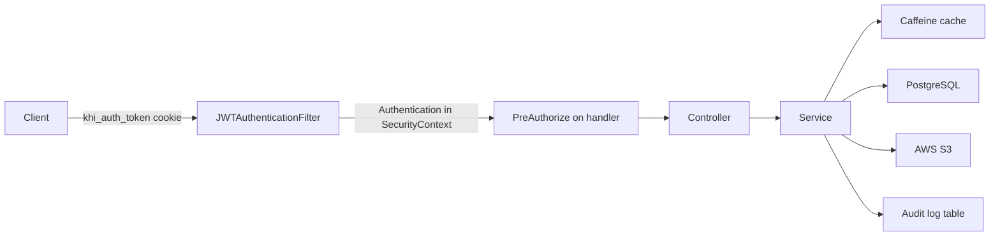

# Internal API Overview

> **Audience:** Staff clients — ADMIN, EMPLOYEE, TEACHER ·
> **Base path:** `/api` ·
> **Source:** `user/configs/SecurityConfig.java`, `user/jwt/JWTAuthenticationFilter.java`,
> `user/exceptions/JwtAccessDeniedHandler.java`, `user/enums/Role.java`,
> `user/enums/Permission.java`, `common/exceptions/ErrorCode.java`,
> `common/exceptions/ErrorCategory.java`, `common/exceptions/ApiErrorResponse.java`,
> `common/exceptions/ApiErrorResponses.java`, `platform/exceptions/ApiExceptionHandler.java`,
> `platform/config/CacheConfig.java`, `src/main/resources/application.yaml`

This folder documents the **internal** (back-office) surface of the KHI Archive Platform
backend: everything a signed-in staff member calls to build, curate, moderate and measure the
archive. The public read-only surface — `/api/guest/**`, registration and login, the visitor's
own profile, and guest correction submission — is documented separately in
[`../external/`](../external/).

Nothing here is reachable without a token. `SecurityConfig` sends every request that is not
`OPTIONS /**`, not one of the three token-issuing auth endpoints, and not under `/api/guest/**`
through `.requestMatchers("/api/**").authenticated()`. Beyond that, each handler carries its own
`@PreAuthorize` expression naming the exact authority required.

## What the internal surface is for

| Capability | Where it lives | Covered in |
|---|---|---|
| Media CRUD, trash lifecycle, visibility, authenticated byte proxies | `/api/audio`, `/api/video`, `/api/image`, `/api/text` | [`content/`](./content/) |
| Classification and grouping — categories, persons, projects | `/api/category`, `/api/person`, `/api/project` | [`content/`](./content/) |
| One merged grid across all four media types | `/api/items` | [`content/items.md`](./content/items.md) |
| Tag and keyword autocomplete plus vocabulary admin | `/api/tags`, `/api/keywords`, `/api/admin/tags`, `/api/admin/keywords` | [`content/tags-and-keywords.md`](./content/tags-and-keywords.md) |
| Site branding image | `/api/khi-logo` | [`content/khi-logo.md`](./content/khi-logo.md) |
| List-of-Maqam records, teacher panels, votes, listen tracking | `/api/maqam`, `/api/admin/maqam` | [`specialised/maqam.md`](./specialised/maqam.md) |
| Physical-media inventory, type catalog, `.xlsx` import | `/api/physical-media`, `/api/physical-media/types`, `/api/admin/physical-media` | [`specialised/physical-media.md`](./specialised/physical-media.md) |
| User accounts, roles, per-user permission grants, account state | `/api/admin/users` | [`admin/users-and-permissions.md`](./admin/users-and-permissions.md) |
| Sessions and the user audit trail | `/api/auth/sessions`, `/api/admin/users/audit-logs` | [`admin/sessions-and-audit-logs.md`](./admin/sessions-and-audit-logs.md) |
| In-app warnings — issue, acknowledge, revoke | `/api/admin/warnings`, `/api/warnings` | [`admin/warnings.md`](./admin/warnings.md) |
| Triage of guest-submitted corrections | `/api/admin/corrections` | [`admin/corrections.md`](./admin/corrections.md) |
| Team activity reporting | `/api/analytics` | [`analytics/team-activity.md`](./analytics/team-activity.md) |
| Inventory, visibility and maqam reporting | `/api/analytics/inventory`, `/api/analytics/visibility`, `/api/analytics/maqam` | [`analytics/inventory-and-maqam.md`](./analytics/inventory-and-maqam.md) |

## Who uses it

Four roles are declared in `Role.java`. Three of them use this surface.

| Role | Authorities from the role itself | Seeded per-user grants | Typical use of this folder |
|---|---|---|---|
| `ADMIN` | `EnumSet.allOf(Permission.class)` plus `ROLE_ADMIN` | none — the role already carries everything | Every page here, including the admin-only ones |
| `EMPLOYEE` | `Set.of()` — empty baseline, plus `ROLE_EMPLOYEE` | `EMPLOYEE_DEFAULT_PERMISSIONS` copied into `extraPermissions` on first promotion | Content CRUD, maqam record preparation, physical-media inventory |
| `TEACHER` | `Set.of()` — empty baseline, plus `ROLE_TEACHER` | `TEACHER_DEFAULT_PERMISSIONS` copied into `extraPermissions` on first promotion | The maqam voting panel only |
| `GUEST` | `Set.of()` — empty baseline, plus `ROLE_GUEST` | none | Nothing in this folder; see [`../external/`](../external/) |

`Role.getAuthorities()` returns the role's permission strings plus a `ROLE_<NAME>` authority, so
`hasRole('ADMIN')` matches `ROLE_ADMIN` and `hasAuthority('audio:read')` matches the
`<resource>:<action>` strings. Seeded grants are ordinary per-user rows after seeding — an admin
can revoke or extend any of them through `/api/admin/users/{userId}/permissions`. The ADMIN
permission set is not editable that way; it comes from the role definition.

**`EMPLOYEE_DEFAULT_PERMISSIONS`** (verbatim from `Role.java`):

`audio:read`, `audio:create`, `audio:update`,
`video:read`, `video:create`, `video:update`,
`image:read`, `image:create`, `image:update`,
`text:read`, `text:create`, `text:update`,
`category:read`, `category:create`, `category:update`,
`person:read`, `person:create`, `person:update`,
`project:read`, `project:create`, `project:update`,
`maqam:read`, `maqam:create`, `maqam:update`, `maqam:teacher_manage`,
`physical_media:read`, `physical_media:create`, `physical_media:update`,
`physical_media:import`

**`TEACHER_DEFAULT_PERMISSIONS`**: `maqam:read`, `maqam:vote`.

Everything else in `Permission.java` is held by ADMIN through the role and is seeded to nobody:
every `*:remove` and `*:delete`, the whole `user:*` and `warning:*` families,
`correction:read` / `correction:update` / `correction:remove`, `physical_media:type_manage`, and
the four `khi_logo:*` permissions. An admin can still grant any of them individually.

## How a request is authorized



Step by step:

1. **`JWTAuthenticationFilter`** runs before `UsernamePasswordAuthenticationFilter`. `resolveToken`
   reads `Authorization: Bearer <token>` **first** and falls back to the `khi_auth_token` cookie
   only when that header is absent or lacks the `Bearer ` prefix — so the header wins whenever both
   are present. Both transports are fully supported: browsers use the HttpOnly cookie, scripts and
   server-to-server callers typically use the header. On failure the filter returns
   the uniform error envelope with a specific code — `TOKEN_EXPIRED`, `TOKEN_REVOKED`,
   `TOKEN_INVALID_SIGNATURE`, `TOKEN_MALFORMED` or `TOKEN_INVALID` — clearing the cookie as it
   goes. `shouldNotFilter` skips the filter entirely for `/api/guest/`, `/api/auth/login`,
   `/api/auth/register` and `/api/auth/register-with-image`, so no internal path is ever skipped.
2. **`SecurityConfig`** decides whether the path needs a token at all. For everything in this
   folder the answer is yes, via `.requestMatchers("/api/**").authenticated()`.
3. **`@PreAuthorize`**, enabled by `@EnableMethodSecurity`, decides whether *this* caller may run
   *this* handler. Most handlers use `hasAuthority('<resource>:<action>')`. The admin controllers
   add a class-level `hasRole('ADMIN')`; the `AdminUserAPI` javadoc states the intent verbatim —
   "Class-level `hasRole('ADMIN')` ensures only admins reach these handlers (defence-in-depth even
   if a permission is misgranted)" while "Per-method `hasAuthority('user:...')` aligns with the
   existing `Permission` catalog so granular permission grants work".
4. **Controller → service.** Reads may be served from the Caffeine caches configured in
   `platform/config/CacheConfig.java`. That file registers exactly fifteen caches:
   `categories:all`, `audios:all`, `images:all`, `videos:all`, `texts:all`, `projects:all`,
   `persons:all`, `tags:suggest`, `keywords:suggest`, `analytics:user.v2`,
   `analytics:overview.v2`, `analytics:users.v2`, `users:details`, `trending:results` and
   `trending:snapshot`. Metadata lives in PostgreSQL; media bytes live in S3 and are proxied,
   never handed out as an S3 URL.
5. **Audit.** Mutations are written to per-entity audit tables: `audio_audit_logs`,
   `video_audit_logs`, `image_audit_logs`, `text_audit_logs`, `category_audit_logs`,
   `person_audit_logs`, `project_audit_logs`, `maqam_audit_logs`,
   `physical_media_audit_logs`, `guest_correction_audit_logs`, `analytics_audit_logs` and
   `user_audit_logs`. Which specific calls are audited is stated per endpoint in the
   individual docs.

Sessions are stateless (`SessionCreationPolicy.STATELESS`), and the `SecurityConfig` source
explains why that matters here: without it the security context would be cached for the life of
the HTTP session, so a role or permission change would only take effect after logout and login.

A `@PreAuthorize` denial surfaces during request processing, so it is answered by the matching
`@RestControllerAdvice` — `ApiExceptionHandler` for `platform` controllers,
`GlobalExceptionHandler` for `user` ones. Both build the identical envelope. `requiredAuthority`
appears only when the handler's (or its class's) `@PreAuthorize` matches `hasAuthority('…')` or
`hasRole('…')`; `actor` and `actorAuthorities` only when an `Authentication` is in scope; and
`traceId` only when one of the MDC keys `traceId`, `trace_id`, `X-Trace-Id` or `requestId` is set.
`actorAuthorities` is the caller's full, deduplicated, sorted authority list — the example below is
short only because this employee's seeded grants were narrowed by an admin:

```json
{
  "timestamp": "2026-08-26T09:14:02.311Z",
  "status": 403,
  "error": "ACCESS_DENIED",
  "category": "AUTHORIZATION",
  "message": "You don't have permission to perform this action. Required authority: 'audio:delete'.",
  "hint": "Ask an administrator to grant 'audio:delete' or to assign a role that includes it.",
  "path": "/api/audio/HASAZIRA_AUD_RAW_V1_Copy(1)_000001/purge",
  "details": {
    "requiredAuthority": "audio:delete",
    "actor": "hemin",
    "actorAuthorities": ["ROLE_EMPLOYEE", "audio:create", "audio:read", "audio:update"],
    "requestMethod": "DELETE"
  }
}
```

`JwtAccessDeniedHandler` covers the other case — a denial raised at the filter layer, before a
handler method is resolved. It emits the same `status`, `error` and `category` and the same
`actor` / `actorAuthorities` / `requestMethod` details, but never a `requiredAuthority`, and it
always uses the generic pair `"You don't have permission to perform this action."` and
`"Ask an administrator to grant the missing permission for this endpoint."`.

Absent fields — `traceId` above — are omitted rather than serialized as `null`:
`ApiErrorResponse` is annotated `@JsonInclude(JsonInclude.Include.NON_NULL)`, and
`spring.jackson.default-property-inclusion` is `non_null` for response bodies generally. The full
code list lives in `ErrorCode.java` and the broad families in `ErrorCategory.java`; both are
listed in full, together with the two `@RestControllerAdvice` classes and every `details` payload
shape, in [`./03-errors.md`](./03-errors.md). The role and permission model summarized above is
covered in full — including the complete permission matrix — in
[`./02-authorization.md`](./02-authorization.md).

## Calling the API

The server binds `${PORT:8080}`. All examples in this folder use `{{BASE_URL}}` and authenticate
with the JWT cookie, whose name defaults to `khi_auth_token` (`jwt.cookie-name`):

```bash
curl -s "{{BASE_URL}}/api/audio?page=0&size=20" \
  -H "Cookie: khi_auth_token=$TOKEN"
```

The bearer header is equally valid on every internal endpoint, and `resolveToken` checks it
**before** the cookie — so it wins when both are present. Substitute it into any example on any
page in this folder:

```bash
curl -s "{{BASE_URL}}/api/audio?page=0&size=20" \
  -H "Authorization: Bearer $TOKEN"
```

Relevant defaults from `application.yaml`:

| Property | Default | Effect on internal calls |
|---|---|---|
| `jwt.cookie-name` | `khi_auth_token` | Cookie the filter reads when no `Authorization` header is sent |
| `jwt.cookie-http-only` | `true` | Browser JavaScript cannot read the token; send requests with credentials |
| `jwt.expiration-ms` | `259200000` | Three days |
| `spring.jackson.default-property-inclusion` | `non_null` | Null fields never appear in responses |
| `spring.jackson.time-zone` | `Asia/Baghdad` | Timestamp serialization zone |
| `spring.mvc.format.date` / `date-time` | `yyyy-MM-dd` / `yyyy-MM-dd HH:mm:ss` | Request-side date parsing |
| `spring.servlet.multipart.max-file-size` | `5GB` | Upload ceiling for multipart create/update |
| `spring.servlet.multipart.max-request-size` | `6GB` | Whole multipart request ceiling |
| `spring.cache.type` | `caffeine` | In-process cache; no Redis |
| `app.cors.allow-credentials` | `true` | Cookie-bearing cross-origin calls are allowed from `CORS_ALLOWED_ORIGINS` |

Shared request/response conventions — the Spring `Page` envelope, paging and sorting parameters,
timestamp handling — are in [`./01-conventions.md`](./01-conventions.md) and are not repeated in
each endpoint doc.

## Controller inventory

Every controller under `platform/api/**` and `user/api/**` that serves the internal surface.
Source paths are relative to `src/main/java/ak/dev/khi_archive_platform/`. "Class gate" is the
class-level `@PreAuthorize` copied verbatim; `—` means there is none and authorization is decided
per method (or, for the authenticated byte proxies, by the `/api/**` matcher alone). The four
stream controllers — `AudioStreamAPI`, `VideoStreamAPI`, `ImageStreamAPI`, `TextStreamAPI` —
declare no class-level `@RequestMapping` at all: each handler carries its full path, which is why
the same class appears in both this table and the public one below.

| Base path | Controller | Source | Class gate | Documented in |
|---|---|---|---|---|
| `/api/audio` | `AudioAPI` | `platform/api/audio/AudioAPI.java` | — | [`content/audio.md`](./content/audio.md) |
| `/api/audio/{audioCode}/stream` | `AudioStreamAPI` | `platform/api/audio/AudioStreamAPI.java` | — | [`content/audio.md`](./content/audio.md) |
| `/api/video` | `VideoAPI` | `platform/api/video/VideoAPI.java` | — | [`content/video.md`](./content/video.md) |
| `/api/video/{videoCode}/stream` | `VideoStreamAPI` | `platform/api/video/VideoStreamAPI.java` | — | [`content/video.md`](./content/video.md) |
| `/api/image` | `ImageAPI` | `platform/api/image/ImageAPI.java` | — | [`content/image.md`](./content/image.md) |
| `/api/image/{imageCode}/view` | `ImageStreamAPI` | `platform/api/image/ImageStreamAPI.java` | — | [`content/image.md`](./content/image.md) |
| `/api/text` | `TextAPI` | `platform/api/text/TextAPI.java` | — | [`content/text.md`](./content/text.md) |
| `/api/text/{textCode}/read`, `/api/text/{textCode}/cover` | `TextStreamAPI` | `platform/api/text/TextStreamAPI.java` | — | [`content/text.md`](./content/text.md) |
| `/api/category` | `CategoryAPI` | `platform/api/category/CategoryAPI.java` | — | [`content/category.md`](./content/category.md) |
| `/api/person` | `PersonAPI` | `platform/api/person/PersonAPI.java` | — | [`content/person.md`](./content/person.md) |
| `/api/project` | `ProjectAPI` | `platform/api/project/ProjectAPI.java` | — | [`content/project.md`](./content/project.md) |
| `/api/items` | `ItemsAPI` | `platform/api/items/ItemsAPI.java` | — | [`content/items.md`](./content/items.md) |
| `/api/tags` | `TagAPI` | `platform/api/tag/TagAPI.java` | — | [`content/tags-and-keywords.md`](./content/tags-and-keywords.md) |
| `/api/admin/tags` | `AdminTagAPI` | `platform/api/tag/AdminTagAPI.java` | `hasRole('ADMIN')` | [`content/tags-and-keywords.md`](./content/tags-and-keywords.md) |
| `/api/keywords` | `KeywordAPI` | `platform/api/keyword/KeywordAPI.java` | — | [`content/tags-and-keywords.md`](./content/tags-and-keywords.md) |
| `/api/admin/keywords` | `AdminKeywordAPI` | `platform/api/keyword/AdminKeywordAPI.java` | `hasRole('ADMIN')` | [`content/tags-and-keywords.md`](./content/tags-and-keywords.md) |
| `/api/khi-logo` | `KhiLogoAPI` | `platform/api/khilogo/KhiLogoAPI.java` | — | [`content/khi-logo.md`](./content/khi-logo.md) |
| `/api/maqam` | `MaqamAPI` | `platform/api/maqam/MaqamAPI.java` | — | [`specialised/maqam.md`](./specialised/maqam.md) |
| `/api/maqam` (the `/{maqamCode}/stream` handler) | `MaqamStreamAPI` | `platform/api/maqam/MaqamStreamAPI.java` | — | [`specialised/maqam.md`](./specialised/maqam.md) |
| `/api/admin/maqam` | `AdminMaqamAPI` | `platform/api/maqam/AdminMaqamAPI.java` | — | [`specialised/maqam.md`](./specialised/maqam.md) |
| `/api/physical-media` | `PhysicalMediaAPI` | `platform/api/physicalmedia/PhysicalMediaAPI.java` | — | [`specialised/physical-media.md`](./specialised/physical-media.md) |
| `/api/physical-media/types` | `PhysicalMediaTypeAPI` | `platform/api/physicalmedia/PhysicalMediaTypeAPI.java` | — | [`specialised/physical-media.md`](./specialised/physical-media.md) |
| `/api/admin/physical-media` | `AdminPhysicalMediaAPI` | `platform/api/physicalmedia/AdminPhysicalMediaAPI.java` | — | [`specialised/physical-media.md`](./specialised/physical-media.md) |
| `/api/admin/users` | `AdminUserAPI` | `user/api/AdminUserAPI.java` | `hasRole('ADMIN')` | [`admin/users-and-permissions.md`](./admin/users-and-permissions.md) |
| `/api/admin/users/audit-logs` | `UserAuditLogAPI` | `user/api/UserAuditLogAPI.java` | `hasRole('ADMIN')` | [`admin/sessions-and-audit-logs.md`](./admin/sessions-and-audit-logs.md) |
| `/api/auth/sessions` | `SessionAPI` | `user/api/SessionAPI.java` | — | [`admin/sessions-and-audit-logs.md`](./admin/sessions-and-audit-logs.md) |
| `/api/admin/warnings` | `AdminUserWarningAPI` | `user/api/AdminUserWarningAPI.java` | `hasRole('ADMIN')` | [`admin/warnings.md`](./admin/warnings.md) |
| `/api/warnings` | `UserWarningAPI` | `user/api/UserWarningAPI.java` | `isAuthenticated()` | [`admin/warnings.md`](./admin/warnings.md) |
| `/api/admin/corrections` | `AdminGuestCorrectionAPI` | `platform/api/correction/AdminGuestCorrectionAPI.java` | `hasRole('ADMIN')` | [`admin/corrections.md`](./admin/corrections.md) |
| `/api/analytics` | `AnalyticsAPI` | `platform/api/analytics/AnalyticsAPI.java` | `hasRole('ADMIN')` | [`analytics/team-activity.md`](./analytics/team-activity.md) |
| `/api/analytics` (the `/inventory` and `/visibility` handlers) | `InventoryAnalyticsAPI` | `platform/api/analytics/InventoryAnalyticsAPI.java` | `hasRole('ADMIN')` | [`analytics/inventory-and-maqam.md`](./analytics/inventory-and-maqam.md) |
| `/api/analytics/maqam` | `MaqamAnalyticsAPI` | `platform/api/analytics/MaqamAnalyticsAPI.java` | `hasRole('ADMIN')` | [`analytics/inventory-and-maqam.md`](./analytics/inventory-and-maqam.md) |

Three inventory notes worth carrying into client code:

- **Two controllers declare the exact base path `/api/analytics`.** `AnalyticsAPI` owns `/me`,
  `/users`, `/users/{username}`, `/overview`, `/feed`, `/actions`, `/actions/catalog`,
  `/entities`, `/daily`, `/weekly`, `/monthly`, `/yearly`; `InventoryAnalyticsAPI` owns
  `/inventory` and `/visibility` under the same prefix. `MaqamAnalyticsAPI` is a third analytics
  controller but nests one level deeper on `/api/analytics/maqam`, so its `/overview` does not
  collide with `AnalyticsAPI`'s.
- **`/api/maqam` is served by two controllers.** `MaqamAPI` owns the CRUD, vote and listen-tracking
  handlers; `MaqamStreamAPI` owns `/{maqamCode}/stream`, gated on `hasAuthority('maqam:read')`.
- **The authenticated byte proxies carry no `@PreAuthorize`.** All five —
  `GET /api/audio/{audioCode}/stream`, `GET /api/video/{videoCode}/stream`,
  `GET /api/image/{imageCode}/view`, `GET /api/text/{textCode}/read` and
  `GET /api/text/{textCode}/cover`, spread across four controllers — are protected only by
  `.requestMatchers("/api/**").authenticated()`, so any signed-in user may fetch the bytes. The
  same is true of `GET /api/tags/suggest` and `GET /api/keywords/suggest`. The maqam stream is the
  exception: `GET /api/maqam/{maqamCode}/stream` does carry `hasAuthority('maqam:read')`.

### Controllers that are not part of this set

These live in the same `**/api/` packages but serve the public surface. They are documented in
[`../external/`](../external/).

| Base path | Controller | Source | Class gate |
|---|---|---|---|
| `/api/guest` | `GuestSearchAPI` | `platform/api/guest/GuestSearchAPI.java` | — |
| `/api/guest/audio/{audioCode}/stream` | `AudioStreamAPI` (public handler) | `platform/api/audio/AudioStreamAPI.java` | — |
| `/api/guest/video/{videoCode}/stream` | `VideoStreamAPI` (public handler) | `platform/api/video/VideoStreamAPI.java` | — |
| `/api/guest/image/{imageCode}/view` | `ImageStreamAPI` (public handler) | `platform/api/image/ImageStreamAPI.java` | — |
| `/api/guest/text/{textCode}/read`, `/api/guest/text/{textCode}/cover` | `TextStreamAPI` (public handlers) | `platform/api/text/TextStreamAPI.java` | — |
| `/api/auth` | `UserAPI` | `user/api/UserAPI.java` | — |
| `/api/user` | `UserProfileAPI` | `user/api/UserProfileAPI.java` | — |
| `/api/corrections` | `GuestCorrectionAPI` | `platform/api/correction/GuestCorrectionAPI.java` | `isAuthenticated()` |

## Map of this folder

| Path | What it holds |
|---|---|
| [`./README.md`](./README.md) | Index of the internal documentation set |
| [`./00-overview.md`](./00-overview.md) | This page — roles, authorization path, and the controller inventory |
| [`./01-conventions.md`](./01-conventions.md) | Shared request/response conventions: the `Page` envelope, paging and sorting, date and time formats, null omission |
| [`./02-authorization.md`](./02-authorization.md) | The definitive authorization reference: the four roles, all 66 permissions, the complete permission matrix, and how a request's authority set is assembled |
| [`./03-errors.md`](./03-errors.md) | The staff-side error reference: which `@RestControllerAdvice` answers a request, the custom exception inventory, every `details` payload shape, and `traceId` behavior |
| [`./content/`](./content/) | The seven content types, the merged grid, the shared vocabularies and the site logo: [`audio.md`](./content/audio.md), [`video.md`](./content/video.md), [`image.md`](./content/image.md), [`text.md`](./content/text.md), [`category.md`](./content/category.md), [`person.md`](./content/person.md), [`project.md`](./content/project.md), [`items.md`](./content/items.md), [`tags-and-keywords.md`](./content/tags-and-keywords.md), [`khi-logo.md`](./content/khi-logo.md) |
| [`./specialised/`](./specialised/) | The two domain-specific modules: [`maqam.md`](./specialised/maqam.md) — List-of-Maqam records, teacher panels, votes and listen tracking; [`physical-media.md`](./specialised/physical-media.md) — the physical inventory, its type catalog and the `.xlsx` import |
| [`./admin/`](./admin/) | Administration: [`users-and-permissions.md`](./admin/users-and-permissions.md), [`sessions-and-audit-logs.md`](./admin/sessions-and-audit-logs.md), [`warnings.md`](./admin/warnings.md), [`corrections.md`](./admin/corrections.md) |
| [`./analytics/`](./analytics/) | Reporting: [`team-activity.md`](./analytics/team-activity.md) — per-user and per-period activity from the audit tables; [`inventory-and-maqam.md`](./analytics/inventory-and-maqam.md) — inventory, visibility and maqam reports |
| [`./database/`](./database/) | The tables behind these endpoints: [`schema-content.md`](./database/schema-content.md), [`schema-users-security.md`](./database/schema-users-security.md), [`schema-audit.md`](./database/schema-audit.md), [`schema-maqam.md`](./database/schema-maqam.md), [`schema-physical-media.md`](./database/schema-physical-media.md), [`schema-corrections.md`](./database/schema-corrections.md), plus [`important-fields.md`](./database/important-fields.md), [`indexes-and-performance.md`](./database/indexes-and-performance.md) and [`migrations.md`](./database/migrations.md) — schema evolution and the initializer beans |
| [`./operations/`](./operations/) | Operations: [`configuration.md`](./operations/configuration.md), [`caching.md`](./operations/caching.md), [`storage-and-media.md`](./operations/storage-and-media.md) — S3 and the byte proxies, and [`seeding.md`](./operations/seeding.md) |

## Where to start

| If you are building | Read next |
|---|---|
| A permission-aware UI shell | [`./02-authorization.md`](./02-authorization.md), then [`./03-errors.md`](./03-errors.md) |
| A content editing screen | [`./01-conventions.md`](./01-conventions.md), then the matching file in [`./content/`](./content/) |
| A cross-type back-office grid | [`./content/items.md`](./content/items.md) |
| The maqam voting panel | [`./specialised/maqam.md`](./specialised/maqam.md) |
| An admin console | [`./admin/users-and-permissions.md`](./admin/users-and-permissions.md) |
| A dashboard | [`./analytics/team-activity.md`](./analytics/team-activity.md) |

## Related

- [`./README.md`](./README.md) — index of the internal documentation set
- [`./01-conventions.md`](./01-conventions.md) — the shared page envelope, paging, sorting and timestamp rules referenced by every endpoint doc
- [`./02-authorization.md`](./02-authorization.md) — the full role and permission reference, including the complete 66-entry permission matrix
- [`./03-errors.md`](./03-errors.md) — the complete `ErrorCode` and exception catalog behind the envelope shown above
- [`./admin/users-and-permissions.md`](./admin/users-and-permissions.md) — how roles are assigned and how the per-user grants described above are edited
- [`./admin/sessions-and-audit-logs.md`](./admin/sessions-and-audit-logs.md) — the sessions and audit trail behind the last step of the request diagram
- [`./content/items.md`](./content/items.md) — the merged view over the four media types
- [`./operations/`](./operations/) — configuration, caching and storage behavior referenced throughout this page
- [`../external/00-overview.md`](../external/00-overview.md) — the public surface this folder deliberately excludes
