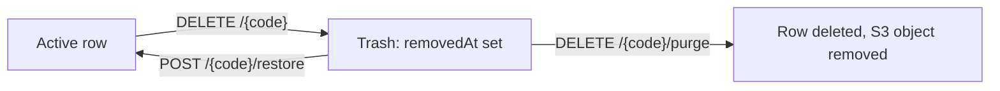

# Internal API Conventions

> **Audience:** staff / back-office clients · **Base path:** `/api/**` (staff surface) ·
> **Source:** `user/configs/SecurityConfig.java`, `user/configs/AppCorsProperties.java`,
> `platform/config/CacheConfig.java`, `platform/config/WebConfig.java`,
> `platform/config/JacksonConfig.java`, `platform/config/AsyncConfig.java`,
> `platform/config/MultipartJsonConfig.java`, `common/exceptions/*`,
> `platform/exceptions/ApiExceptionHandler.java`, `user/exceptions/JwtAccessDeniedHandler.java`,
> `platform/api/audio/AudioAPI.java`, `platform/dto/audio/AudioFilterParams.java`,
> `platform/dto/items/VisibilityUpdateRequest.java`,
> `platform/dto/project/ProjectVisibilityUpdateRequest.java`,
> `src/main/resources/application.yaml`

Every internal endpoint in this application is built from the same small set of patterns:
one pagination envelope, one filter-binding style, one multipart create/update shape, one
trash lifecycle, one visibility toggle, one cache layer, one audit trail. This file documents
those patterns once. The per-domain docs under `./content/`, `./admin/`, `./analytics/` and
`./specialised/` describe only what is specific to their entity and link back here.

---

## Authentication

| Requirement | Value |
|---|---|
| Authentication | Required for every path in this folder |
| Transport | JWT, two accepted carriers — `Authorization: Bearer <token>` (checked first) or the HttpOnly cookie, default name `khi_auth_token` (fallback) |
| Session policy | `SessionCreationPolicy.STATELESS` — no server-side HTTP session |
| Coarse rule | `.requestMatchers("/api/**").authenticated()` in `SecurityConfig` |
| Fine-grained rule | `@PreAuthorize` on the controller method (or, rarely, the class) |

`JWTAuthenticationFilter.resolveToken` reads `Authorization: Bearer <token>` first and falls back
to `JwtCookieService.resolveToken` only when that header is absent or lacks the `Bearer ` prefix.
**The header therefore wins whenever both are present** — a request carrying a stale bearer token
and a valid cookie is rejected, because the cookie is never consulted. Both carriers are
first-class on every endpoint in this folder: browsers use the HttpOnly cookie (page JavaScript
cannot read it to build a header), while scripts, CLI tooling and server-to-server callers
normally send the header. Curl examples throughout `docs/internal/` use the cookie form and work
unchanged with `-H "Authorization: Bearer $TOKEN"` substituted. The full resolution order is in
[`./02-authorization.md#where-the-token-comes-from`](./02-authorization.md#where-the-token-comes-from).

`SecurityConfig` permits exactly three groups without a token: `OPTIONS /**` (preflight); the
three auth paths `/api/auth/register`, `/api/auth/register-with-image` and `/api/auth/login`
(matched by path only, so every method on them is open, not just `POST`); and everything under
`/api/guest/**`. Nothing in `docs/internal/` falls in those groups.

Authorities are `<resource>:<action>` strings from `user/enums/Permission.java`. ADMIN holds
every permission through the `ADMIN` role itself. EMPLOYEE and TEACHER hold a seeded, per-user
grant set (`Role.EMPLOYEE_DEFAULT_PERMISSIONS`, `Role.TEACHER_DEFAULT_PERMISSIONS`) that an
admin can edit. The action vocabulary is fixed by the `Permission` javadoc:

| Action | Meaning |
|---|---|
| `read` | list / get / search |
| `create` | add (single or bulk) |
| `update` | partial or full update |
| `remove` | soft remove (row stays in the DB, flagged removed) |
| `delete` | hard delete (row physically removed) — ADMIN only |

---

## Paged responses

Every list endpoint returns the standard Spring Data `Page` envelope. Nothing in this project
customizes the Spring Data web resolvers, so the query parameters are the framework defaults.
The `/search` endpoints are the exception to the envelope: they are not paged at all and answer
with a bare JSON array, capped by their own `limit` query parameter.

**Query parameters**

| Name | Type | Default | Description |
|---|---|---|---|
| `page` | int | `0` | Zero-based page index |
| `size` | int | see below | Page size |
| `sort` | string | none | Spring Data sort expression. **Ignored** — every list endpoint sorts from `sortBy` / `sortDirection` instead; see the note below |

### The `@PageableDefault(size = 100)` convention

List handlers declare `@PageableDefault(size = 100) Pageable pageable`. That is the house
default; four endpoints declare `size = 50` instead. The table below is the complete set of
`@PageableDefault` declarations on the staff surface.

| Endpoint | Default size | Extra defaults |
|---|---|---|
| `GET /api/audio`, `GET /api/audio/trash` | `100` | — |
| `GET /api/video`, `GET /api/video/trash` | `100` | — |
| `GET /api/image`, `GET /api/image/trash` | `100` | — |
| `GET /api/text`, `GET /api/text/trash` | `100` | — |
| `GET /api/category`, `GET /api/category/trash` | `100` | — |
| `GET /api/person`, `GET /api/person/trash` | `100` | — |
| `GET /api/project`, `GET /api/project/trash` | `100` | — |
| `GET /api/maqam/{maqamCode}/sessions` | `100` | — |
| `GET /api/admin/maqam/trash` | `100` | — |
| `GET /api/admin/maqam/teachers/{teacherUserId}/sessions` | `100` | — |
| `GET /api/admin/physical-media/trash` | `100` | `sort = "id"`, `direction = ASC` |
| `GET /api/items` | `50` | — |
| `GET /api/maqam` | `50` | — |
| `GET /api/maqam/teacher/my-recent` | `50` | — |
| `GET /api/physical-media` | `50` | `sort = "id"`, `direction = ASC` |

### Envelope shape

```json
{
  "content": [],
  "pageable": {
    "pageNumber": 0,
    "pageSize": 100,
    "sort": { "empty": true, "sorted": false, "unsorted": true },
    "offset": 0,
    "paged": true,
    "unpaged": false
  },
  "totalElements": 0,
  "totalPages": 0,
  "number": 0,
  "size": 100,
  "sort": { "empty": true, "sorted": false, "unsorted": true },
  "first": true,
  "last": true,
  "numberOfElements": 0,
  "empty": true
}
```

The `content[]` element shape is entity-specific and is documented in full in each per-domain
file. Remember `spring.jackson.default-property-inclusion: non_null` — a DTO field that is
`null` is omitted from the JSON entirely, so `content[]` rows are ragged between records.

### Out-of-range pages

Endpoints that page an in-memory list go through `PaginationSupport.sliceList`, which matches
Spring Data repository semantics: a page index past the end returns an empty `content` array
with the correct `totalElements`, not a 404.

### The `sort` parameter versus `sortBy` / `sortDirection`

No list endpoint in this application orders by Spring's `sort` parameter. Most serve rows from
an in-memory list (the read cache, or a full fetch) and sort with their own
`sortBy` / `sortDirection` pair before slicing. **Use `sortBy` and `sortDirection`.**

Maqam and physical media can push an order to the database, but they build it from `sortBy` /
`sortDirection` too: `effectivePageable(...)` rebuilds the incoming `Pageable` with the
`sortBy`-resolved `Sort`, or with `id ASC` when no `sortBy` was supplied — either way the
`sort` the client sent is discarded. They fall back to an in-memory sort only when the
requested filter or sort cannot be expressed in SQL.

**The two paths are built to agree.** Because those two entities can serve the same `sortBy` from
either SQL or a JVM comparator, the two orderings are deliberately constructed to be
interchangeable. `platform/service/common/SortSupport` is the single place a DB order is built, and
each rule mirrors the in-memory comparator it stands in for:

| Key type | DB fast path (`SortSupport`) | In memory (`<Entity>FilterSupport`) |
|---|---|---|
| Text | `ci(col, dir)` → `ORDER BY LOWER(col)` | `String.CASE_INSENSITIVE_ORDER` |
| Number / date / instant | `plain(col, dir)` → DB-native null handling; on PostgreSQL `NULLS LAST` on `ASC`, `NULLS FIRST` on `DESC` | `Comparator.nullsLast(...)`, reversed wholesale for `desc` |
| Every key | `, id ASC` appended | `.thenComparing(getId())` |

A row therefore lands in the same position whichever path ran, which is what makes a filtered
request comparable to an unfiltered one: adding a filter to a sorted request re-slices the list, it
does not re-order it.

The `, id ASC` tiebreaker is not cosmetic. `ORDER BY <key>` alone is not a total order — PostgreSQL
may return equal-keyed rows in a different sequence per query, so paging a sorted list could show
one row twice and skip another. Pinning `id ASC` makes the order total, and both entities apply it
even when no `sortBy` was sent, so an unsorted list pages stably too. The seven read-cache entities
append no tiebreaker: they sort the one cached list, which does not change between pages until the
cache is evicted.

When `<Entity>FilterSupport.resolveDbSort(...)` cannot express a key as a real column it returns
`Sort.unsorted()` and the service routes the whole request through the in-memory engine, so
correctness never depends on the database being able to sort the key. Physical media's derived
`digitization` / `digitizationCode` key is the one live case.

---

## Style-B filter parameters (`@ModelAttribute`)

"Style-B" is the in-house name for the filter-binding shape used by the media list endpoints:
a single `@ModelAttribute <Entity>FilterParams filter` argument next to the `Pageable`. Spring
binds every matching query-string key onto the DTO's setters. There is no `@RequestBody`, no
nested syntax, and no wrapper prefix — `?form=song&city=Sulaimani` binds straight to
`filter.form` and `filter.city`.

```java
@GetMapping
@PreAuthorize("hasAuthority('audio:read')")
public ResponseEntity<Page<AudioResponseDTO>> getAll(
        @PageableDefault(size = 100) Pageable pageable,
        @ModelAttribute AudioFilterParams filter,
        Authentication auth,
        HttpServletRequest request
) { ... }
```

Because binding is by name, an unknown query parameter is silently ignored rather than
rejected. A parameter whose value cannot be converted to the declared type (for example
`audioQualityMin=high`) fails binding, and since no `BindingResult` argument follows the
params object Spring raises the binding exception: the advice answers
`400 VALIDATION_ERROR` with the rejected field in `details`. `TYPE_MISMATCH` is the code for
the *other* binding style — a bad `@RequestParam` / `@PathVariable` on the endpoints that
declare their filters explicitly (category, person, items).

### Parameter families

`AudioFilterParams` is the worked example. Every Style-B params class draws from the same
families; only the field lists differ.

| Family | Java type | Query form | Semantics |
|---|---|---|---|
| Sort | `String sortBy`, `String sortDirection` | `?sortBy=originTitle&sortDirection=desc` | `sortDirection` is `asc` (default) or `desc`; comparison is `desc` only on an exact case-insensitive match of `"desc"` |
| Categorical equals | `String` | `?form=song` | Case-insensitive **exact** match after Kurdish text normalization |
| Long-text contains | `String` | `?speaker=ali` | Case-insensitive **substring** match after normalization |
| Boolean | `Boolean` | `?physicalAvailability=true` | Exact match; omit the parameter to not filter |
| Numeric range | `Integer` `...Min` / `...Max` | `?audioQualityMin=7&audioQualityMax=10` | Inclusive on both ends. A row whose value is `null` is excluded once either bound is present |
| Date range | `LocalDate` `...From` / `...To` | `?createdFrom=1980-01-01&createdTo=2000-12-31` | `YYYY-MM-DD` (`@DateTimeFormat(iso = ISO.DATE)`), inclusive. Resolved to day bounds in the archive zone |
| Collection membership | `List<String>` + `String ...Match` | `?tags=folk&tags=ballad&tagMatch=all` | `any` (default) or `all`; see below |

**Why string filters are normalized at all.** Arabic script has no upper/lower case, so
`String.toLowerCase()` and SQL `LOWER()` are no-ops over Sorani Kurdish text — a "case-insensitive"
equals would silently degrade into a byte-for-byte match, and a trailing space, a Zero-Width
Non-Joiner, or an Arabic Yeh where a Kurdish Yeh was typed would make visually identical text
compare unequal. `platform/service/common/KurdishText.normalize` is therefore applied to **both**
the stored value and the filter value on every string equals and contains comparison in the
`<Entity>FilterSupport` engines. It is a comparison-time canonical form only — nothing normalized is
ever persisted. In order: Unicode NFC; fold Arabic Yeh `U+064A` and Alef-Maksura `U+0649` to Kurdish
Yeh `U+06CC`, and Arabic Kaf `U+0643` to Keheh `U+06A9`; drop tatweel `U+0640`, ZWSP / ZWNJ / ZWJ /
BOM, the tashkeel range `U+064B..U+0652` and superscript alef `U+0670`; collapse whitespace runs and
trim; lower-case any Latin characters mixed in.

It fixes codepoint and whitespace variants, **not** spelling drift — two words that differ by a real
letter stay distinct. Where that matters, drive the filter from a controlled vocabulary rather than
a free-text box; `GET /api/maqam/maqam-types` exists for exactly that reason.

**Date ranges and the archive zone.** `from` / `to` are bare calendar dates. The backend turns
them into instants through `ArchiveTime`, which pins the archive to `Asia/Baghdad` (UTC+3, no
DST since 2007). "From the 29th" becomes `2026-07-29T00:00:00+03:00`; "to the 29th" is
inclusive through `2026-07-29T23:59:59.999999999+03:00`. Clients never send a UTC offset.

That zone math applies to the timestamp columns, which is most of them but not all. The wire format
is the same either way; what differs is what the backend does with the bound:

| Backing column | Parameters | Handling |
|---|---|---|
| `Instant` / timestamp | `createdFrom`/`To` and `updatedFrom`/`To` everywhere, `removedFrom`/`To` on maqam and physical media, and the entity dates `dateCreatedFrom`/`To`, `datePublishedFrom`/`To`, `dateModifiedFrom`/`To`, `dateCopyrightedFrom`/`To`, `printDateFrom`/`To` | Resolved to day bounds in `Asia/Baghdad` by `ArchiveTime` |
| True `DATE` | Person's `dobFrom`/`To` and `dodFrom`/`To`, physical media's `digitizeDateFrom`/`To` | Compared as `LocalDate` as-is; no zone is invented for a value that never had one |

Both kinds are inclusive on both ends, and both exclude a row whose value is `null` once either
bound is present. `createdFrom=2026-07-29&createdTo=2026-07-29` means the same calendar day on every
entity and from every client.

**Collection membership and the `match` switch.** Repeat the parameter (`?tags=a&tags=b`) or
comma-separate it. Matching is case-insensitive on trimmed values. `match=all` requires every
requested value to be present on the row; anything else — including omitting the parameter —
means `any`. The check is literally `"all".equalsIgnoreCase(params.getTagMatch())`, so
`tagMatch=ALL` works and `tagMatch=every` silently degrades to `any`.

**Collection filters are the exception to the normalization above.** `matchList` compares with a
plain `trim().toLowerCase(Locale.ROOT)` on both sides — `KurdishText.normalize` is **not** applied
to `tags`, `keywords`, `genre`, `contributors` or `personType`, so a collection filter matches the
stored token literally rather than a codepoint variant of it. For `tags` and `keywords` the stored
token is already the canonical form `Tags.canonical` / `Keywords.canonical` wrote on save (NFKC,
whitespace collapsed, lower-cased — but no Yeh/Kaf folding); `genre`, `contributors` and
`personType` are stored exactly as they were typed. Populate those inputs from the autocompletes
(`GET /api/tags/suggest`, `GET /api/keywords/suggest`) rather than from free text.

### `AudioFilterParams` in full

The class javadoc is the authoritative catalog. Reproduced here as the reference example:

| Family | Fields |
|---|---|
| Sort | `sortBy`, `sortDirection` |
| Categorical equals | `form`, `typeOfBasta`, `typeOfMaqam`, `language`, `dialect`, `typeOfComposition`, `typeOfPerformance`, `city`, `region`, `audience`, `audioChannel`, `fileExtension`, `duration`, `bitRate`, `bitDepth`, `sampleRate`, `lccClassification`, `accrualMethod`, `availability`, `licenseType` |
| Long-text contains | `speaker`, `producer`, `composer`, `poet`, `lyrics`, `recordingVenue`, `locationArchive`, `degitizedBy`, `degitizationEquipment`, `provenance`, `copyright`, `rightOwner`, `usageRights`, `owner`, `publisher` |
| Boolean | `physicalAvailability` |
| Numeric ranges | `audioQualityMin`/`Max`, `versionNumberMin`/`Max`, `copyNumberMin`/`Max` |
| Date ranges | `dateCreatedFrom`/`To`, `datePublishedFrom`/`To`, `dateModifiedFrom`/`To`, `dateCopyrightedFrom`/`To`, `createdFrom`/`To`, `updatedFrom`/`To` |
| Collections | `genre` + `genreMatch`, `contributors` + `contributorMatch`, `tags` + `tagMatch`, `keywords` + `keywordMatch` |

Accepted `sortBy` values for audio, with the synonyms the comparator recognizes:

| Canonical | Synonyms also accepted |
|---|---|
| `audioCode` | `code` |
| `originTitle` | `title`, `name`, `alpha`, `alphabet`, `alphabetical` |
| `createdAt` | `created`, `added`, `dateAdded`, `date_added` |
| `updatedAt` | `updated`, `modified`, `dateModified`, `date_modified` |
| `dateCreated` | `date_created` |
| `datePublished` | `date_published`, `published` |
| `dateModifiedField` | `dateMod` |
| `dateCopyrighted` | `copyrighted` |
| `audioQuality` | `audioQualityOutOf10`, `quality` |
| `versionNumber` | `version` |
| `copyNumber` | `copy` |

The comparator lowercases `sortBy` before matching, so the case you send does not matter. An
unrecognized `sortBy` yields no comparator at all — the list keeps its source order rather than
erroring. Every comparator is built with `Comparator.nullsLast(...)`, so rows with a null in the
sort column land at the end on `asc` — and, because `desc` reverses the whole comparator rather
than just the value order, at the front on `desc`.

### The empty-filter fast path

Each params class exposes `isEmpty()` (media entities) or `isEmpty()` + `hasActiveFilters()`
(maqam, physical media). When nothing is set, the filter engine returns the source list
unchanged — `AudioFilterSupport.applyFiltersAndSort` short-circuits to identity — and the
endpoint serves straight from the entity's Caffeine read cache with a single slice. No SQL, no
copying, no comparator. With filters present, the same cached list is walked once, in cost
order (boolean equals → numeric range → date range → string equals → string contains →
collection match), and only the surviving rows are sorted and sliced.

Four endpoints invert this: `GET /api/physical-media`, `GET /api/admin/physical-media/trash`,
`GET /api/maqam` and `GET /api/admin/maqam/trash` run a **DB-paged** query on the unfiltered
path and fall back to loading + filtering in memory only when the requested filter or sort
needs it. `GET /api/maqam` additionally forces the in-memory path for a teacher who supplies a
sort, because the teacher-scoped `DISTINCT` join cannot be ordered by a lowercased expression
in PostgreSQL.

### Which entities follow the shape

| Entity | Params class | Binding | Source of rows |
|---|---|---|---|
| Audio | `AudioFilterParams` | `@ModelAttribute` | Caffeine read cache `audios:all` |
| Video | `VideoFilterParams` | `@ModelAttribute` | Caffeine read cache `videos:all` |
| Image | `ImageFilterParams` | `@ModelAttribute` | Caffeine read cache `images:all` |
| Text | `TextFilterParams` | `@ModelAttribute` | Caffeine read cache `texts:all` |
| Maqam | `MaqamFilterParams` | `@ModelAttribute` (list **and** admin trash) | Fresh DB fetch; DB-paged when possible |
| Physical media | `PhysicalMediaFilterParams` | `@ModelAttribute` (list **and** admin trash) | Fresh DB fetch; DB-paged when possible |
| Category | `CategoryFilterParams` | Explicit `@RequestParam` list, assembled in the controller | Caffeine read cache `categories:all` |
| Person | `PersonFilterParams` | Explicit `@RequestParam` list, assembled in the controller | Caffeine read cache `persons:all` |
| Items | `ItemFilterParams` | Explicit `@RequestParam` list, assembled in the controller | The four media read caches, merged |
| Project | — | No filter parameters | Caffeine read cache `projects:all` |

Category and person speak the same `sortBy` / `sortDirection` / `match=any|all` vocabulary over
the wire, but each exposes only the families its entity actually has, and the controller lists
every parameter by hand:

| Endpoint | Filter parameters |
|---|---|
| `GET /api/category` | `sortBy`, `sortDirection`, `createdFrom`/`To`, `updatedFrom`/`To`, `tags` + `tagMatch` |
| `GET /api/person` | `sortBy`, `sortDirection`, `gender`, `personType` + `personTypeMatch`, `region`, `dobFrom`/`To`, `dodFrom`/`To`, `placeOfBirth`, `placeOfDeath`, `tags` + `tagMatch`, `keywords` + `keywordMatch`, `createdFrom`/`To`, `updatedFrom`/`To` |

`GET /api/items` shares the `sortBy` / `sortDirection` and `from` / `to` families but has
**no** `match` switch — its repeatable parameters (`types`, `projectCodes`, `personCodes`,
`categoryCodes`, `languages`) are always "any of these". `GET /api/project` takes pagination
only.

**Example**

```bash
# Empty filter — served straight from the read cache
curl -s "{{BASE_URL}}/api/audio?page=0&size=20" \
  -H "Cookie: khi_auth_token=$TOKEN"

# Collection membership with the all-switch, plus a numeric floor and a sort
curl -s "{{BASE_URL}}/api/audio?tags=folk&tags=ballad&tagMatch=all&audioQualityMin=7&sortBy=originTitle&sortDirection=asc" \
  -H "Cookie: khi_auth_token=$TOKEN"

# Date range in the archive zone
curl -s "{{BASE_URL}}/api/audio?city=Sulaimani&dateCreatedFrom=1980-01-01&dateCreatedTo=2000-12-31" \
  -H "Cookie: khi_auth_token=$TOKEN"
```

---

## Adding a sort or filter key

Filtering and sorting live in the same small set of files for every entity:

| Piece | Location |
|---|---|
| `Sort` builder for the DB fast path (shared) | `platform/service/common/SortSupport.java` |
| In-memory pager (shared) | `platform/service/common/PaginationSupport.java` |
| Script-aware string canonicalizer (shared) | `platform/service/common/KurdishText.java` |
| Archive-zone day bounds (shared) | `platform/service/common/ArchiveTime.java` |
| Filter parameters, per entity | `platform/dto/<entity>/<Entity>FilterParams.java` |
| Filter + sort engine, per entity | `platform/service/<entity>/<Entity>FilterSupport.java` |
| Fast-path routing (DB-paged entities only) | `MaqamService.listActive` / `listTrash`, `PhysicalMediaService.listActive` / `listTrash` |

**A new sort key.** Add the `case` — and every synonym it should answer to — to that entity's
`<Entity>FilterSupport.comparatorFor(...)`. That alone makes the key work on every endpoint, because
every entity can sort in memory. Then, if the key maps to a real column and you want it on the DB
fast path, mirror the same `case` in `resolveDbSort(...)` using `SortSupport.ci(...)` for text or
`SortSupport.plain(...)` for numbers, dates and instants — never a hand-built `Sort`, or the two
paths stop agreeing. Leaving the key out of `resolveDbSort` (so `default -> Sort.unsorted()` catches
it) deliberately forces the request onto the in-memory path; that is how physical media's derived
`digitization` key is handled.

**A new filter field.** Add the property to `<Entity>FilterParams`, document it in that class's
javadoc catalog — the javadoc is the authoritative field list these docs are written from — and add
the predicate to the linear scan in `<Entity>FilterSupport.applyFiltersAndSort`. Place it in cost
order: boolean and enum equals, then numeric range, date range, string equals, string contains, and
collection match last. Finally, register it in the params class's emptiness check: `isEmpty()` on
the media entities, `hasActiveFilters()` on maqam and physical media (whose `isEmpty()` is derived
from it). Forgetting the latter is the classic bug — the field binds and the predicate runs, but the
service still believes the request is unfiltered and serves it from the DB fast path, so the filter
appears to be ignored.

---

## Multipart create and update

Any endpoint that carries a binary payload uses `multipart/form-data` with a JSON `data` part
plus one or more file parts. `MultipartJsonConfig` registers no beans — Spring Boot handles
multipart JSON out of the box; the class exists only to carry that note.

### Part names

| Endpoint | `data` | File parts | Notes |
|---|---|---|---|
| `POST /api/audio` | required | `file` (required) | |
| `PATCH /api/audio/{audioCode}` | required | `file` (optional) | Omit `file` to edit metadata only |
| `POST /api/video` | required | `file` (required) | |
| `PATCH /api/video/{videoCode}` | required | `file` (optional) | |
| `POST /api/image` | required | `file` (required) | |
| `PATCH /api/image/{imageCode}` | required | `file` (optional) | |
| `POST /api/text` | required | `file` (required), `coverImage` (optional) | |
| `PATCH /api/text/{textCode}` | required | `file` (optional), `coverImage` (optional) | |
| `POST /api/person` | required | `mediaPortrait` (required) | |
| `PATCH /api/person/{personCode}` | required | `mediaPortrait` (optional) | |
| `POST /api/maqam` | required | `file` (required) | |
| `PATCH /api/maqam/{maqamCode}` | required | `file` (optional) | |
| `POST /api/khi-logo` | — | `file` (required) | No `data` part |
| `PATCH /api/khi-logo/{id}` | — | `file` (required) | No `data` part |
| `POST /api/physical-media/import` | — | `file` (required) | `.xlsx`; optional `sheet` query parameter |
| `POST /api/physical-media/import/sheets` | — | `file` (required) | Peek only, no writes |

`POST /api/physical-media` and `PATCH /api/physical-media/{pmCode}` are plain
`application/json` — the inventory has no attached file.

### How the `data` part is handled

The controller declares the part as a raw `String`, not as a typed DTO:

```java
@RequestPart("data") String dataJson,
@RequestPart("file") MultipartFile audioFile
```

and then runs its own `parseAndValidate` helper, which does three things in order:

1. Rejects a `data` part that is present but blank.
2. Deserializes it with the injected `ObjectMapper` — the **Jackson 2** bean from `JacksonConfig`
   (`com.fasterxml.jackson.databind.ObjectMapper`, `JavaTimeModule` registered,
   `SerializationFeature.WRITE_DATES_AS_TIMESTAMPS` disabled). This is a different mapper from the
   one that writes responses, and it honors none of the `spring.jackson.*` keys — see
   [Two Jackson mappers](#two-jackson-mappers).
3. Runs the Jakarta `Validator` over the resulting DTO and collects every violation into a
   `propertyPath -> message` map.

All three failure modes throw the **entity's own validation exception**, which the
`@RestControllerAdvice` renders as `400` with the entity-specific error code; only the third
carries the `propertyPath -> message` map in `details` (the blank-part and parse failures put
their reason in `message` and omit `details` entirely). Bean validation is therefore manual
here — there is no `@Valid` on the part, so `VALIDATION_ERROR` is not what you get.

| Entity | Exception | `error` code |
|---|---|---|
| Audio | `AudioValidationException` | `AUDIO_VALIDATION_ERROR` |
| Video | `VideoValidationException` | `VIDEO_VALIDATION_ERROR` |
| Image | `ImageValidationException` | `IMAGE_VALIDATION_ERROR` |
| Text | `TextValidationException` | `TEXT_VALIDATION_ERROR` |
| Person | `PersonValidationException` | `PERSON_VALIDATION_ERROR` |
| Maqam | `MaqamValidationException` | `MAQAM_VALIDATION_ERROR` |

A `data` part that is **absent entirely** never reaches the helper: `@RequestPart` is required
by default, so Spring raises `MissingServletRequestPartException` first and the response is
`400 MISSING_REQUEST_PART` with `details.part` naming the missing part.

**Errors**

| Status | `error` code | When |
|---|---|---|
| `400` | `MISSING_REQUEST_PART` | A required part (`data`, `file`, `mediaPortrait`) is not in the request at all |
| `400` | `<ENTITY>_VALIDATION_ERROR` | `data` present but blank, unparseable JSON, or a bean-validation violation |
| `413` | `UPLOAD_TOO_LARGE` | File over `spring.servlet.multipart.max-file-size` (`5GB`); `details.maxBytes` carries the cap |
| `415` | `UNSUPPORTED_MEDIA_TYPE` | Request sent as something other than `multipart/form-data` |

Upload limits from `application.yaml`: `max-file-size: 5GB`, `max-request-size: 6GB`,
`file-size-threshold: 2MB`. Tomcat's own connector caps are disabled
(`max-swallow-size: -1`, `max-http-form-post-size: -1`) because they are 32-bit byte counts
that overflow above 2 GB; Spring's multipart limits are what actually enforce the ceiling.

**Example**

```bash
curl -s -X POST "{{BASE_URL}}/api/audio" \
  -H "Cookie: khi_auth_token=$TOKEN" \
  -F 'data={"projectCode":"PER001-PROJ-000001","audioVersion":"MASTER","versionNumber":1,"copyNumber":1};type=application/json' \
  -F "file=@/path/to/recording.wav"
```

The four fields above are the ones `AudioCreateRequestDTO` asserts on create: `projectCode`
must be present, `audioVersion` must be `RAW` or `MASTER`, and `versionNumber` / `copyNumber`
must be at least 1. Project codes are minted as `<PREFIX>-PROJ-<000000>`, and the audio code
the server generates from them looks like `PER001_AUD_MASTER_V1_Copy(1)_000007`.

```bash
# Metadata-only edit: send 'data', omit 'file'
curl -s -X PATCH "{{BASE_URL}}/api/audio/PER001_AUD_MASTER_V1_Copy(1)_000007" \
  -H "Cookie: khi_auth_token=$TOKEN" \
  -F 'data={"originTitle":"Corrected title"};type=application/json'
```

---

## The trash model

`DELETE` never destroys anything. It sets `removedAt` (and `removedBy`) on the row and leaves
the S3 object untouched, so the record can come back intact. Hard deletion is a separate,
explicitly named `purge` call.



Every read path filters on `removedAt IS NULL`, so a trashed record disappears from lists,
lookups, search, the guest catalog and the read caches immediately. Write paths behave the
same way: `PATCH` and the visibility toggle resolve through
`findBy<Code>AndRemovedAtIsNull(...)` and return `404` for a trashed record rather than
silently resurrecting it.

### Endpoints

| Operation | Method + path | Authority |
|---|---|---|
| Soft-trash | `DELETE /api/audio/{audioCode}` | `audio:delete` |
| Restore | `POST /api/audio/{audioCode}/restore` | `audio:delete` |
| Trash listing | `GET /api/audio/trash` | `audio:delete` |
| Purge | `DELETE /api/audio/{audioCode}/purge` | `audio:delete` |

The same four shapes exist for video, image, text, category, person and project with the
matching code path variable and the matching `<entity>:delete` authority:

| Entity | Base path | Path variable | Authority on all four |
|---|---|---|---|
| Audio | `/api/audio` | `{audioCode}` | `audio:delete` |
| Video | `/api/video` | `{videoCode}` | `video:delete` |
| Image | `/api/image` | `{imageCode}` | `image:delete` |
| Text | `/api/text` | `{textCode}` | `text:delete` |
| Category | `/api/category` | `{categoryCode}` | `category:delete` |
| Person | `/api/person` | `{personCode}` | `person:delete` |
| Project | `/api/project` | `{projectCode}` | `project:delete` |

Two entities split the lifecycle across a public controller and an admin controller:

| Operation | Method + path | Authority |
|---|---|---|
| Maqam soft-trash | `DELETE /api/maqam/{maqamCode}` | `maqam:delete` |
| Maqam trash listing | `GET /api/admin/maqam/trash` | `maqam:delete` |
| Maqam restore | `POST /api/admin/maqam/{maqamCode}/restore` | `maqam:delete` |
| Maqam purge | `DELETE /api/admin/maqam/{maqamCode}/purge` | `maqam:delete` |
| Physical-media soft-trash | `DELETE /api/physical-media/{pmCode}` | `physical_media:remove` |
| Physical-media trash listing | `GET /api/admin/physical-media/trash` | `physical_media:delete` |
| Physical-media restore | `POST /api/admin/physical-media/{pmCode}/restore` | `physical_media:delete` |
| Physical-media purge | `DELETE /api/admin/physical-media/{pmCode}/purge` | `physical_media:delete` |

Of the nine entities in this trash model, physical media is the only one whose soft-trash uses
`:remove` rather than `:delete`, so an employee can trash an inventory row they own while
inspection, restore and purge stay with ADMIN. `physical_media:remove` is **not** in
`EMPLOYEE_DEFAULT_PERMISSIONS`, so an admin must grant it per user.

`POST /api/khi-logo` and friends have no trash: `DELETE /api/khi-logo/{id}` (`khi_logo:delete`)
is the only removal path there.

### Which authority each needs, in practice

`<entity>:delete` is not in `EMPLOYEE_DEFAULT_PERMISSIONS` or `TEACHER_DEFAULT_PERMISSIONS` —
only ADMIN holds it out of the box, which is why the trash surface is described as admin-only.
On top of the declarative `@PreAuthorize`, the seven content services re-check the same
authority inside `restore`, `purge` and `getTrash` (`requireAdminRole`, which asserts
`<entity>:delete` on the `Authentication`) and throw `AccessDeniedException` if it is missing.
The declarative and imperative checks are deliberately identical; the second one guards the
service if it is ever called from a non-annotated path.

### Response codes and rules

| Operation | Success | Notes |
|---|---|---|
| Soft-trash | `204 No Content` | Empty body. S3 object preserved |
| Restore | `200 OK` + the restored DTO | Fails if the row is not in trash, or — media only — if its parent project is still in trash. `POST /api/project/{projectCode}/restore` answers with `RestoreResult` instead: the project DTO plus the cascade counts |
| Trash listing | `200 OK` + `Page` envelope | Lists only rows with `removedAt IS NOT NULL` |
| Purge | `204 No Content` | Row must already be in trash; deletes the DB row **and** the S3 object |

Trying to purge a row that was never trashed is a `400` with the entity's validation code and
the message "`<Entity>` must be in trash before permanent deletion. Trash it first." Restoring a
row that is not in trash fails with the same code and the message "`<Entity>` is not in trash:
`<code>`". Purge writes its audit row *before* deleting, so the trail survives the row.

**Project cascade.** Trashing a project cascades to its active media (audio, video, image,
text) through bulk `softTrashByProject` updates; restoring the project brings back every media
row that was trashed with it, and the restore response reports the counts (`restoredAudios`,
`restoredVideos`, `restoredImages`, `restoredTexts`). Purging a project purges its media rows
**and their S3 objects**. Categories and the linked person are never touched — they are shared
resources. Each cascaded row gets its own audit entry, and each affected media read cache is
evicted alongside `projects:all`. A media record cannot be restored on its own while its
project is still in trash — restore the project first.

**Example**

```bash
# Trash, inspect, restore  (CODE = PER001_AUD_MASTER_V1_Copy(1)_000007)
curl -s -X DELETE "{{BASE_URL}}/api/audio/$CODE" -H "Cookie: khi_auth_token=$TOKEN"
curl -s "{{BASE_URL}}/api/audio/trash?page=0&size=50" -H "Cookie: khi_auth_token=$TOKEN"
curl -s -X POST "{{BASE_URL}}/api/audio/$CODE/restore" -H "Cookie: khi_auth_token=$TOKEN"

# Point of no return
curl -s -X DELETE "{{BASE_URL}}/api/audio/$CODE/purge" -H "Cookie: khi_auth_token=$TOKEN"
```

---

## The visibility toggle

Flipping a row's public flag from a list view should not require re-sending its fifty-field
edit payload. Each media entity therefore exposes a dedicated one-field `PATCH`.

**Path:** `PATCH /api/<entity>/{code}/visibility`
**Consumes / produces:** `application/json` — declared explicitly on the four media endpoints;
the `/api/items` and `/api/project` variants take the framework default, which accepts the same
JSON body.
**Authority:** the entity's `:update` — the same permission that allows editing the record.

| Method | Path | Authority | Body record |
|---|---|---|---|
| `PATCH` | `/api/audio/{audioCode}/visibility` | `audio:update` | `VisibilityUpdateRequest` |
| `PATCH` | `/api/video/{videoCode}/visibility` | `video:update` | `VisibilityUpdateRequest` |
| `PATCH` | `/api/image/{imageCode}/visibility` | `image:update` | `VisibilityUpdateRequest` |
| `PATCH` | `/api/text/{textCode}/visibility` | `text:update` | `VisibilityUpdateRequest` |
| `PATCH` | `/api/items/{type}/{code}/visibility` | `{type}:update`, checked in the service | `VisibilityUpdateRequest` |
| `PATCH` | `/api/project/{projectCode}/visibility` | `project:update` | `ProjectVisibilityUpdateRequest` |

**Request body**

```json
{ "isPublic": true }
```

`isPublic` is a boxed `Boolean` annotated `@NotNull(message = "isPublic is required")`, so an
absent or null field fails validation instead of quietly defaulting to `false`.

**Response** `200 OK` — the full updated entity DTO, same shape the `GET` by code returns.

```json
{
  "id": 412,
  "audioCode": "PER001_AUD_MASTER_V1_Copy(1)_000007",
  "projectCode": "PER001-PROJ-000001",
  "originTitle": "Bastay Kurdi",
  "isPublic": true,
  "createdAt": "2026-02-11T08:31:44Z",
  "createdBy": "sara.k",
  "updatedAt": "2026-08-26T09:02:17Z",
  "updatedBy": "sara.k"
}
```

Null fields are omitted, so a real response carries only the columns that are populated.

**Idempotency.** Setting the flag to the value it already has is a genuine no-op: the service
compares first and returns the current DTO without saving, without bumping `updatedAt` /
`updatedBy`, and **without writing an audit row**. Only a real transition writes.

**Trashed rows.** The lookup goes through `findBy<Code>AndRemovedAtIsNull`, so toggling a
trashed record returns `404 <ENTITY>_NOT_FOUND` rather than resurrecting it.

**The `/api/items` variant.** `PATCH /api/items/{type}/{code}/visibility` carries no
`@PreAuthorize`, because the required authority depends on the `{type}` path variable and
cannot be written declaratively. `ItemVisibilityService` parses `{type}` (case-insensitive:
`AUDIO`, `VIDEO`, `IMAGE`, `TEXT` — the four `ItemType` constants), derives `<type>:update`,
asserts it on the `Authentication`, then delegates to the matching media service — so the
behavior, the audit row and the cache eviction are identical to hitting the per-entity
endpoint. An unknown `{type}` produces `400 AUDIO_VALIDATION_ERROR` (the dispatcher throws
`AudioValidationException` whatever the type was) with the message
"Unknown item type: `<value>`". A missing authority produces `403 ACCESS_DENIED` — but without
`details.requiredAuthority`, because the handler carries no `@PreAuthorize` for the advice to
read it from.

**The project variant is different.** A project's flag is named `isVisibleToPublic`, and the
body takes an optional cascade switch:

```json
{ "isVisibleToPublic": false, "visibilityCascade": "CASCADE" }
```

`isVisibleToPublic` carries the `@NotNull` here; `visibilityCascade` is an unvalidated `String`
whose documented values are `CASCADE` and `NONE`. The service tests it with
`"CASCADE".equalsIgnoreCase(...)`, so every other value — `NONE`, an unrecognized word, or the
field omitted — behaves as `NONE` and leaves the per-media flags alone. That default is enough
to hide a collection from guests, since a guest must see both the project flag and the
per-media `isPublic` as true. The endpoint delegates to the full project update path, so
cascade, audit and cache eviction match the long-form `PATCH`.

**Example**

```bash
# CODE = PER001_AUD_MASTER_V1_Copy(1)_000007
curl -s -X PATCH "{{BASE_URL}}/api/audio/$CODE/visibility" \
  -H "Cookie: khi_auth_token=$TOKEN" \
  -H "Content-Type: application/json" \
  -d '{"isPublic": true}'

# Same effect, from a mixed items grid
curl -s -X PATCH "{{BASE_URL}}/api/items/audio/$CODE/visibility" \
  -H "Cookie: khi_auth_token=$TOKEN" \
  -H "Content-Type: application/json" \
  -d '{"isPublic": true}'
```

---

## Caching

**The cache is Caffeine, in-process, on the JVM heap. It is NOT Redis.** `spring.cache.type` is
`caffeine` and there is no Redis dependency, connection or configuration anywhere in the
project. Older code comments that say "served from Redis" are stale wording for the Caffeine
read cache; the `CacheConfig` javadoc is explicit that Caffeine replaced Redis. Practical
consequences: the cache is per-instance and is lost on restart, entries are Java objects with
no serialization cost, and there is no cross-instance invalidation.

### Named caches

Every cache is declared explicitly in `platform/config/CacheConfig.java` as a `CaffeineCache`
with `maximumSize` and `expireAfterWrite`. A `@Cacheable` naming a cache that is not in this
list will fail at runtime — add it here first.

| Cache name | Max size | TTL (write) | Holds |
|---|---|---|---|
| `categories:all` | 1 | 10 min | Full active category list |
| `audios:all` | 1 | 10 min | Full active audio list |
| `images:all` | 1 | 10 min | Full active image list |
| `videos:all` | 1 | 10 min | Full active video list |
| `texts:all` | 1 | 10 min | Full active text list |
| `projects:all` | 1 | 10 min | Full active project list |
| `persons:all` | 1 | 10 min | Full active person list |
| `tags:suggest` | 1 000 | 10 min | One entry per `(query, limit)` pair |
| `keywords:suggest` | 1 000 | 10 min | One entry per `(query, limit)` pair |
| `analytics:user.v2` | 200 | 5 min | Per-user analytics results |
| `analytics:overview.v2` | 50 | 5 min | Overview dashboard results |
| `analytics:users.v2` | 50 | 5 min | Users dashboard results |
| `users:details` | 500 | 1 min | `UserDetails` lookups, to avoid a DB hit per request |
| `trending:results` | 1 | 5 min | Recomputed trending list |
| `trending:snapshot` | 1 | 5 min | Trending snapshot |

The `*:all` caches hold exactly **one** entry — the whole active list — so `maximumSize=1` is
correct and size-based eviction never fires in practice. TTL is what keeps them fresh if an
eviction is ever missed. `users:details` deliberately runs a 1-minute TTL so a permission grant
takes effect quickly without a logout.

### The read-cache-per-entity pattern

Seven entities each have a small `<Entity>ReadCache` component sitting between the service and
the repository:

| Component | Cache name |
|---|---|
| `AudioReadCache` | `audios:all` |
| `VideoReadCache` | `videos:all` |
| `ImageReadCache` | `images:all` |
| `TextReadCache` | `texts:all` |
| `CategoryReadCache` | `categories:all` |
| `PersonReadCache` | `persons:all` |
| `ProjectReadCache` | `projects:all` |

Each exposes the same two methods:

- `@Cacheable(ACTIVE_CACHE) getAllActive()` — loads the active rows and maps every one of them
  to its **response DTO** before caching. DTOs, not entities, so a cache hit never touches a
  Hibernate session. The four media caches read `findAllByRemovedAtIsNull()`; the other three
  use a purpose-built query (`CategoryReadCache` → `findAllActiveWithKeywords()`,
  `PersonReadCache` → `findAllActiveWithPersonType()`, `ProjectReadCache` →
  `findAllActive()`). Remaining lazy associations were meant to load via
  `hibernate.default_batch_fetch_size=1000` — one main query plus a few batched fetches — but that
  key is written at an inert property path and never reaches Hibernate, so the miss path is
  currently N+1: one secondary `SELECT` per parent row per association. Verified; see
  [Indexes and performance](./database/indexes-and-performance.md#eight-hibernate-keys-are-inert-verified).
- `evictAll()` — called after every mutation. `@Caching(evict = …)` everywhere except
  `PersonReadCache`, which needs a single `@CacheEvict`.

The four media caches map through their own service, injected as an
`ObjectProvider<...Service>` to break the cache to service to cache construction cycle.
Category, person and project map through a static mapper instead and inject no service.

Maqam and physical media have **no** read cache: their list endpoints fetch from the database
on every call.

### Eviction rules on write

`evictAll()` is called at the end of every mutating service method — create, bulk create,
update, visibility toggle, soft-delete, restore and purge — after the row is saved and before
the audit row is written. Purge is the one inversion: it audits first (so the trail outlives the
row), then deletes, then evicts. Eviction is `allEntries = true`: there is only one entry, so
there is nothing finer to evict.

Because tags and keywords are canonicalized across several tables, a media mutation also
invalidates the cross-entity autocomplete caches:

| Read cache | Evicts |
|---|---|
| `AudioReadCache` | `audios:all`, `tags:suggest`, `keywords:suggest` |
| `VideoReadCache` | `videos:all`, `tags:suggest`, `keywords:suggest` |
| `ImageReadCache` | `images:all`, `tags:suggest`, `keywords:suggest` |
| `TextReadCache` | `texts:all`, `tags:suggest`, `keywords:suggest` |
| `ProjectReadCache` | `projects:all`, `tags:suggest`, `keywords:suggest` |
| `CategoryReadCache` | `categories:all`, `keywords:suggest` |
| `PersonReadCache` | `persons:all` |

`CategoryReadCache` does not touch `tags:suggest` (categories contribute keywords, not tags),
and `PersonReadCache` evicts only its own list.

**Adding a cache.** Any new `@Cacheable(...)` name must be added to the `CacheConfig` list with
its own size and TTL, or the endpoint must stay uncached.

---

## Auditing

Every mutating call on a content entity writes one row to that entity's `*_audit_logs` table
through a dedicated `<Entity>AuditService`, in a `Propagation.REQUIRES_NEW` transaction so the
trail survives even if the surrounding business transaction rolls back. Reads are audited too:
`LIST`, `READ` and `SEARCH` produce rows alongside the write actions.

### Tables

| Table | Written by |
|---|---|
| `audio_audit_logs` | Audio |
| `video_audit_logs` | Video |
| `image_audit_logs` | Image |
| `text_audit_logs` | Text |
| `category_audit_logs` | Category |
| `person_audit_logs` | Person |
| `project_audit_logs` | Project |
| `maqam_audit_logs` | Maqam |
| `physical_media_audit_logs` | Physical media |
| `guest_correction_audit_logs` | Guest corrections |
| `user_audit_logs` | Admin user management, warnings |
| `analytics_audit_logs` | Analytics endpoints |

### Actions

Six of the seven content entities share one nine-value action vocabulary (`AudioAuditAction`
and its video / image / text / category / person siblings):

`CREATE`, `READ`, `LIST`, `SEARCH`, `UPDATE`, `REMOVE`, `DELETE`, `RESTORE`, `PURGE`.

`ProjectAuditAction` has eight of the nine — there is no `SEARCH`, because there is no
`GET /api/project/search`. `MaqamAuditAction` and `PhysicalMediaAuditAction` start from the
same nine and add their own (`TEACHER_ASSIGNED`, `VOTE_CAST`, `LISTEN_STARTED`, … and
`IMPORT`, `TYPE_CREATE`, …); the user, analytics and correction logs use unrelated
vocabularies of their own.

Soft-trash records `DELETE`; hard delete records `PURGE`. A bulk create writes **one** summary
`CREATE` row for the whole batch, with no entity id attached.

### Common columns

The audit-log entities share a column set. Using `audio_audit_logs` as the reference:

| Column | Source |
|---|---|
| `id` | Identity |
| `<entity>_id`, `<entity>_code`, `<entity>_title` | The affected row; all null on list/search/bulk rows |
| `project_id`, `project_code`, `project_name` | Denormalized from the row's project, when it has one |
| `person_id`, `person_code`, `person_name` | Denormalized from the project's person, when set |
| `category_code` | Comma-joined category codes of the project |
| `action` | The action enum, stored as `VARCHAR(20)` |
| `actor_user_id`, `actor_username`, `actor_display_name` | The authenticated principal; falls back to `"anonymous"` |
| `actor_authorities` | Comma-joined authorities held at the time of the call, `ROLE_*` included |
| `actor_permissions` | Same list with the `ROLE_*` entries filtered out |
| `device_info`, `ip_address` | From the matched `sessions` row, else the `User-Agent` header and `request.getRemoteAddr()` |
| `session_id`, `session_login_timestamp`, `session_expires_at`, `session_is_active` | From the matched `sessions` row |
| `request_method`, `request_path` | `HttpServletRequest.getMethod()` / `getRequestURI()` |
| `details` | Free-text summary of what changed, HTML-escaped before it is stored |
| `occurred_at` | `Instant.now()` at write time |

The actor's authority snapshot is stored per row on purpose: revoking a permission later does
not rewrite history.

Reporting over these tables — the `UNION ALL` feed, per-user and per-day rollups, the action
catalog — is documented in [analytics/team-activity.md](./analytics/team-activity.md).

---

## Bulk create

Six entities accept a JSON array to create many rows in one transaction. Bulk create is
metadata-only: there is no multipart, so each element carries a pre-uploaded file URL of its
own where the entity needs one.

| Method | Path | Authority | Element DTO |
|---|---|---|---|
| `POST` | `/api/audio/bulk` | `audio:create` | `AudioBulkCreateRequestDTO` |
| `POST` | `/api/video/bulk` | `video:create` | `VideoBulkCreateRequestDTO` |
| `POST` | `/api/image/bulk` | `image:create` | `ImageBulkCreateRequestDTO` |
| `POST` | `/api/text/bulk` | `text:create` | `TextBulkCreateRequestDTO` |
| `POST` | `/api/project/bulk` | `project:create` | `ProjectCreateRequestDTO` (`@Valid`) |
| `POST` | `/api/category/bulk` | `category:create` | `CategoryCreateRequestDTO` (`@Valid`) |

The four media endpoints take the array without `@Valid`: no bean validation runs at the
controller, and the service absorbs element-level problems as skips. `/api/project/bulk` and
`/api/category/bulk` declare the body `@Valid`, so anything the binder rejects comes back as
`400 VALIDATION_ERROR` from the advice before the service runs, rather than as a skip.

### `BulkCreateResult`

Each service declares its own nested record — three counts and a duration, in the same order:

```java
public record BulkCreateResult(int requested, int inserted, int skipped, long elapsedMs) {}
```

**Response** `200 OK`

```json
{
  "requested": 250,
  "inserted": 243,
  "skipped": 7,
  "elapsedMs": 1841
}
```

| Field | Type | Meaning |
|---|---|---|
| `requested` | int | Elements in the submitted array |
| `inserted` | int | Rows actually persisted |
| `skipped` | int | Elements dropped — failed validation, unresolvable parent code, or a generated code that already exists |
| `elapsedMs` | long | Wall-clock duration of the batch |

`CategoryService.BulkCreateResult` names its third component **`skippedDuplicates`** instead of
`skipped`, and it counts one thing only: an element whose category code already exists on an
active row. The other five use `skipped`. An empty or null array returns
`{"requested":0,"inserted":0,"skipped":0,"elapsedMs":0}` without touching the database (with
`skippedDuplicates` in place of `skipped` on the category endpoint).

### Semantics

- **Partial success is the normal outcome.** A bad element is skipped, not fatal; the endpoint
  still returns `200`. There is no per-element error list — inspect `skipped` and reconcile.
- **One transaction, one `saveAll`,** then a single `readCache.evictAll()`.
- **Media codes are auto-generated** from an in-memory per-project counter, so the batch takes
  the per-project code lock once per project rather than once per row. Project does the same
  per code prefix, but honors a `projectCode` supplied on the element. Category is the
  exception: each element must supply its own `categoryCode`, and an element whose code already
  exists on an active row is skipped.
- **One audit row per batch**, action `CREATE`, with `details` carrying
  `requested=… inserted=… skipped=… elapsedMs=…` (`skippedDuplicates=…` for category)
  and no entity id.

**Example**

```bash
curl -s -X POST "{{BASE_URL}}/api/audio/bulk" \
  -H "Cookie: khi_auth_token=$TOKEN" \
  -H "Content-Type: application/json" \
  -d '[{"projectCode":"PER001-PROJ-000001","audioVersion":"MASTER","versionNumber":1,
        "copyNumber":1,
        "audioFileUrl":"https://khi-archive-platform.s3.us-east-1.amazonaws.com/khi-archive-platform-folders/audios/<uuid>-a.wav"}]'
```

---

## Error envelope

Every advice, security filter and entry point returns the same `ApiErrorResponse` record.
`@JsonInclude(NON_NULL)` applies, so absent fields are omitted rather than serialized as null.

| Field | Type | Notes |
|---|---|---|
| `timestamp` | instant | Server clock when the error was produced |
| `status` | int | HTTP status code |
| `error` | string | Machine code from `ErrorCode`, SCREAMING_SNAKE |
| `category` | string | Broad family from `ErrorCategory` |
| `message` | string | User-facing, safe to display |
| `hint` | string | Optional recovery hint |
| `path` | string | Request URI that produced the error |
| `traceId` | string | Pulled from MDC keys `traceId` / `trace_id` / `X-Trace-Id` / `requestId` when present |
| `details` | object | Error-specific payload: field errors, `requiredAuthority`, `part`, `maxBytes`, … |

```json
{
  "timestamp": "2026-08-26T09:02:17.431Z",
  "status": 403,
  "error": "ACCESS_DENIED",
  "category": "AUTHORIZATION",
  "message": "You don't have permission to perform this action. Required authority: 'audio:delete'.",
  "hint": "Ask an administrator to grant 'audio:delete' or to assign a role that includes it.",
  "path": "/api/audio/PER001_AUD_MASTER_V1_Copy(1)_000007",
  "details": {
    "requiredAuthority": "audio:delete",
    "actor": "sara.k",
    "actorAuthorities": ["ROLE_EMPLOYEE", "audio:create", "audio:read", "audio:update"],
    "requestMethod": "DELETE"
  }
}
```

The `403` advice reads the required authority out of the resolved handler's `@PreAuthorize`
(falling back to a class-level one), matching `has(Authority|Role)('…')` and returning the
first quoted argument — which is what makes the "you have X, you need Y" UI possible. Three
consequences: on a compound expression such as the one on `GET /api/items` only the first
authority is reported; for `hasRole('ADMIN')` the value is `ADMIN`, without the `ROLE_` prefix
the authority actually carries; and when there is no annotation to read, or the denial happens
at the filter layer before routing, the field is absent altogether.

The codes most likely to surface on the conventions described above:

| Status | `error` code | When |
|---|---|---|
| `400` | `MISSING_REQUEST_PART` | Required multipart part absent |
| `400` | `<ENTITY>_VALIDATION_ERROR` | Bad `data` part or a domain rule rejected the payload |
| `400` | `VALIDATION_ERROR` | `@Valid` body failed bean validation (the visibility toggle, for example), or a Style-B `@ModelAttribute` filter object failed to bind |
| `400` | `TYPE_MISMATCH` | A `@RequestParam` / `@PathVariable` could not be converted to its declared type — the explicitly bound filters on category, person and items |
| `403` | `ACCESS_DENIED` | Missing authority, declarative or in-service |
| `404` | `<ENTITY>_NOT_FOUND` | No **active** row with that code — includes trashed rows on write paths |
| `413` | `UPLOAD_TOO_LARGE` | Over the multipart cap |
| `415` | `UNSUPPORTED_MEDIA_TYPE` | Wrong `Content-Type` for a multipart or JSON endpoint |

The complete code list lives in `common/exceptions/ErrorCode.java` and is cataloged in
[03-errors.md](./03-errors.md).

---

## Serialization and formats

| Concern | Setting | Source |
|---|---|---|
| Null fields | Omitted from every response | `spring.jackson.default-property-inclusion: non_null` |
| Display time zone | `Asia/Baghdad` — but `Instant` columns still serialize in UTC with a trailing `Z`, as the examples on this page show | `spring.jackson.time-zone` |
| Date binding | `yyyy-MM-dd` | `spring.mvc.format.date` |
| Date-time binding | `yyyy-MM-dd HH:mm:ss` | `spring.mvc.format.date-time` |
| `Instant` fields | ISO-8601 strings, not epoch numbers | The auto-configured Jackson 3 response mapper. (`JacksonConfig`'s Jackson 2 bean also disables `WRITE_DATES_AS_TIMESTAMPS`, but it parses the multipart `data` part and never serializes a response) |
| Output formatting | Pretty-printed | `spring.jackson.serialization.indent-output: true` |
| Filter date parameters | `YYYY-MM-DD`, resolved to `Asia/Baghdad` day bounds | `@DateTimeFormat(iso = ISO.DATE)` + `ArchiveTime` |

### Two Jackson mappers

The application resolves **two Jackson majors**, and it matters which one you are looking at.
`./mvnw -o dependency:tree`:

```
org.springframework.boot:spring-boot-starter-jackson:4.0.5
  └── tools.jackson.core:jackson-databind:3.1.0        (Jackson 3)
com.fasterxml.jackson.core:jackson-databind:2.21.2      (Jackson 2, declared directly in pom.xml)
```

- **Jackson 3 serializes responses.** Spring Boot 4 auto-configures the `tools.jackson` mapper for
  HTTP message conversion, and that mapper is what reads `spring.jackson.*`. Every row in the table
  above — `indent-output`, `default-property-inclusion: non_null`, `time-zone: Asia/Baghdad` — holds
  because of it.
- **`JacksonConfig`'s bean is Jackson 2 and is not the response mapper.** It declares a
  `com.fasterxml.jackson.databind.ObjectMapper` built with a bare `new ObjectMapper()`. Nothing a
  controller returns passes through it. Two things use it: the multipart controllers (`AudioAPI`,
  `VideoAPI`, `ImageAPI`, `TextAPI`, `PersonAPI`, `MaqamAPI`) `readValue` the `data` JSON part
  through it; and `JWTAuthenticationFilter`, `JwtAuthenticationEntryPoint` and
  `JwtAccessDeniedHandler` `writeValue` their `401`/`403` bodies through it, bypassing the message
  converters. Because it is constructed directly rather than through Spring's builder, it honors
  **none** of the `spring.jackson.*` settings: no `non_null` inclusion, no pretty-printing, no
  `Asia/Baghdad` context zone.

Two practical consequences:

- Reason about response shape from `spring.jackson.*`, and about `data`-part parsing from
  `JacksonConfig`. Do not use `JacksonConfig`'s mapper to write JSON on any new path — it will not
  match the conventions on this page.
- The security-filter error bodies are the one exception to those conventions already in the
  codebase: they are compact rather than pretty-printed and carry no Baghdad context zone. Their
  nulls are still omitted, but only because `ApiErrorResponse` is annotated
  `@JsonInclude(JsonInclude.Include.NON_NULL)` in its own right.

CORS is configured twice on purpose: a `CorsFilter` at `Ordered.HIGHEST_PRECEDENCE` that runs
before Spring Security (so `401` and `403` bodies are readable in the browser), plus an
MVC-level mapping as a fallback. Both read `AppCorsProperties`, so the allowed origins are a
built-in always-allowed list (`http://localhost:5173`, `http://localhost:3000`, the Vercel
frontend and the S3 bucket origin) **merged with** the comma-separated
`app.cors.allowed-origins` — clearing the environment variable does not close the built-ins.
Allowed methods default to `GET,POST,PUT,DELETE,OPTIONS,PATCH`, headers to `*`, `max-age` to
`3600`, and credentials are allowed, which is what lets the `khi_auth_token` cookie ride along.

Fire-and-forget interaction and search logging runs on the bounded `trendingLogExecutor`
(`AsyncConfig`: core 2, max 4, queue 1 000, `DiscardPolicy`). Under a burst, log events are
dropped rather than delaying the HTTP response — so trending counters are best-effort, while
audit rows, which are written synchronously, are not.

---

## Related

- [Internal API index](./README.md)
- [Internal API overview](./00-overview.md) — roles, the request path, the controller inventory
- [Roles, permissions and authorization](./02-authorization.md) — the full permission catalog
- [Audio](./content/audio.md) — the worked example for every pattern on this page
- [Video](./content/video.md) · [Image](./content/image.md) · [Text](./content/text.md)
- [Items](./content/items.md) — the merged media list and the unified visibility dispatcher
- [Project](./content/project.md) — the cascade variant of the trash model and visibility toggle
- [Person](./content/person.md) · [Category](./content/category.md)
- [Tags and keywords](./content/tags-and-keywords.md) — the autocomplete caches evicted on write
- [Team activity and audit reporting](./analytics/team-activity.md)
- [Internal error reference](./03-errors.md) — the full `ErrorCode` catalog and every envelope
