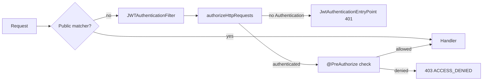

# Roles, Permissions and Authorization

> **Audience:** back-office / staff clients and anyone integrating with `/api/**` ·
> **Base path:** `/api/**` (every route) · **Source:** `user/configs/SecurityConfig.java`,
> `user/enums/Role.java`, `user/enums/Permission.java`, `user/model/User.java`,
> `user/jwt/JWTAuthenticationFilter.java`, `user/jwt/JwtTokenProvider.java`,
> `user/service/AdminUserService.java`, `user/exceptions/GlobalExceptionHandler.java`,
> `platform/exceptions/ApiExceptionHandler.java`, `platform/config/CacheConfig.java`,
> `user/configs/*Initializer.java`

This is the definitive authorization reference for the platform. It describes the four roles,
the 66 permissions they can hold, how a request's authority set is assembled on every call,
which `@PreAuthorize` expression styles the controllers use, and why a permission change made
by an admin is live on the caller's **next** request rather than after a re-login.

---

## Access

| Requirement | Value |
|---|---|
| Authentication | Required for every route except `OPTIONS /**`, `POST /api/auth/register`, `POST /api/auth/register-with-image`, `POST /api/auth/login` and `GET /api/guest/**` |
| Authority | Per-endpoint, declared as `@PreAuthorize` on the controller method — falling back to the class annotation only when the method declares none |
| Roles that hold it by default | See the [permission matrix](#permission-matrix) below |

---

## The two authorization layers

Authorization is decided twice: coarsely in the filter chain, then precisely on the handler.



`JWTAuthenticationFilter.shouldNotFilter` skips the filter entirely for `/api/guest/**` and the
three public auth paths, which is why the public branch bypasses it.

### Where the token comes from

Before either layer can decide anything, `JWTAuthenticationFilter.resolveTokenCandidates` has to
find a token. It collects **every** token the client sent, in priority order, and the filter
verifies them one by one until one passes:

```java
private List<TokenCandidate> resolveTokenCandidates(HttpServletRequest request) {
    List<TokenCandidate> candidates = new ArrayList<>();

    String authorizationHeader = request.getHeader(AUTHORIZATION);
    if (hasText(authorizationHeader) && authorizationHeader.startsWith(TOKEN_PREFIX)) {
        String headerToken = authorizationHeader.substring(TOKEN_PREFIX.length()).trim();
        if (hasText(headerToken)) {
            candidates.add(new TokenCandidate("header", headerToken));
        }
    }

    for (String cookieToken : jwtCookieService.resolveTokens(request)) {
        if (candidates.stream().noneMatch(candidate -> candidate.token().equals(cookieToken))) {
            candidates.add(new TokenCandidate("cookie", cookieToken));
        }
    }
    return candidates;
}
```

1. `Authorization: Bearer <token>` — tried first. The prefix must be exactly `Bearer `
   (`SecurityConstants.TOKEN_PREFIX`).
2. Every `khi_auth_token` cookie (`jwt.cookie-name`) the browser sent, in the order received, via
   `JwtCookieService.resolveTokens`. Duplicates of the header token are skipped.

Both are first-class; neither is a legacy path. In practice browsers use the cookie — it is
`HttpOnly`, so page JavaScript cannot read it to build a header — while scripts, CLI tooling and
server-to-server callers use the header. `UserAPI#extractToken` still does a simpler two-step
resolution for logout, where only the token being blacklisted matters.

A browser can hold **several** cookies under one name when they were set for different paths or
hosts, and it sends all of them on the same request. Trying each candidate means one stale
duplicate no longer shadows a valid token — which used to fail every request with
`TOKEN_INVALID_SIGNATURE` and could not be cleared by logging out, since `clearAuthCookie` only
deletes the cookie at the configured `jwt.cookie-path`. The 401 is raised from the **first**
candidate that failed, and its `details.source` names the transport it arrived on.

### Layer 1 — the filter chain

`SecurityConfig.securityFilterChain` declares five rules, in this order:

```java
.requestMatchers(HttpMethod.OPTIONS, "/**").permitAll()
.requestMatchers(
        "/api/auth/register",
        "/api/auth/register-with-image",
        "/api/auth/login"
).permitAll()
.requestMatchers("/api/guest/**").permitAll()
.requestMatchers("/api/**").authenticated()
.anyRequest().authenticated()
```

There is **no path-based role mapping** in the chain. Everything under `/api/**` that is not in
the public list needs a valid token and nothing more; the real check lives on the handler.

Note that the auth and guest matchers carry no HTTP method (only the preflight rule does), so
they permit *every* method on those paths — the source comment says why: "Permit every method so
anonymous browsers (and CORS preflights) never get blocked here." The effective public surface is
still `POST` on the three auth paths and `GET` under `/api/guest/**`, because those are the only
handlers the controllers define; anything else 405s.

### Layer 2 — method security

`SecurityConfig` is annotated `@EnableWebSecurity` **and** `@EnableMethodSecurity`, which is what
makes `@PreAuthorize` on the controllers effective. A controller under `/api/**` that carries no
`@PreAuthorize` at all is therefore gated on authentication alone — `UserAPI` (`/api/auth`),
`UserProfileAPI` (`/api/user`), `SessionAPI` (`/api/auth/sessions`), `TagAPI` (`/api/tags`),
`KeywordAPI` (`/api/keywords`) and the signed-in halves of the four media stream controllers
(`GET /api/audio/{audioCode}/stream`, `GET /api/video/{videoCode}/stream`,
`GET /api/image/{imageCode}/view`, `GET /api/text/{textCode}/read` and
`GET /api/text/{textCode}/cover`) are all in that category.
`MaqamStreamAPI` is the exception among the stream controllers:
`GET /api/maqam/{maqamCode}/stream` does carry `@PreAuthorize("hasAuthority('maqam:read')")`.

**The closest annotation wins.** Spring Security resolves exactly *one* `@PreAuthorize` per
handler: it scans the method first and only falls back to the declaring class when the method
carries none (`UniqueSecurityAnnotationScanner`, used by
`PreAuthorizeExpressionAttributeRegistry`). A method-level annotation therefore **replaces** the
class-level one rather than stacking on top of it. See the `hasRole(...)` style below for what
that means on the admin controllers.

---

## The four roles

`Role` is the enum stored in `users_tbl.role`. Its javadoc defines the intent of each value:

| Role | Purpose (quoted from `Role.java`) |
|---|---|
| `GUEST` | "placeholder. No authorities. Reserved for future read-only public-facing endpoints." |
| `EMPLOYEE` | "day-to-day archivist. The role itself carries no baseline authorities; instead, when a user is first made an EMPLOYEE the `EMPLOYEE_DEFAULT_PERMISSIONS` set is seeded into their `extraPermissions`. The admin can then grant or revoke any of those per user — the permission set is fully editable. Note: REMOVE is intentionally excluded (only ADMIN may soft-remove)." |
| `TEACHER` | "Maqam-team specialist. Sees the List-of-Maqam records prepared by employees/admins, streams the audio, and submits a maqam-type vote + note on each record they are assigned to. Cannot edit the upstream song metadata (song name / producer / audio file / archive note) and cannot modify another teacher's vote. Seeded with `TEACHER_DEFAULT_PERMISSIONS` into extraPermissions on first promotion so admins can curate further." |
| `ADMIN` | "full control: every resource permission and every user-account permission, including hard delete. The permission set is locked (cannot be edited via the per-user grants endpoint)." |

Every role also contributes a `ROLE_<NAME>` authority — `ROLE_GUEST`, `ROLE_EMPLOYEE`,
`ROLE_TEACHER`, `ROLE_ADMIN` — which is what `hasRole('ADMIN')` matches.

---

## How the authority set is assembled

Two methods, run on every authenticated request.

**`Role.getAuthorities()`** turns the role's own permission set into authorities and appends the
role tag:

```java
public List<SimpleGrantedAuthority> getAuthorities() {
    List<SimpleGrantedAuthority> authorities = new ArrayList<>();
    permissions.forEach(p -> authorities.add(new SimpleGrantedAuthority(p.getPermission())));
    authorities.add(new SimpleGrantedAuthority("ROLE_" + this.name()));
    return authorities;
}
```

**`User.getAuthorities()`** unions that with the per-user grants stored in the
`user_permissions` collection table (`Set<String> extraPermissions`):

```java
public Collection<? extends GrantedAuthority> getAuthorities() {
    List<GrantedAuthority> authorities = new ArrayList<>(role.getAuthorities());
    if (extraPermissions != null) {
        for (String permission : extraPermissions) {
            if (permission != null && !permission.isBlank()) {
                authorities.add(new SimpleGrantedAuthority(permission));
            }
        }
    }
    return authorities;
}
```

### The baselines

| Role | Declared as | Role-baseline authorities | Seed written into `extraPermissions` |
|---|---|---|---|
| `GUEST` | `GUEST(Set.of())` | `ROLE_GUEST` only | none |
| `EMPLOYEE` | `EMPLOYEE(Set.of())` | `ROLE_EMPLOYEE` only | `EMPLOYEE_DEFAULT_PERMISSIONS` (29 entries) |
| `TEACHER` | `TEACHER(Set.of())` | `ROLE_TEACHER` only | `TEACHER_DEFAULT_PERMISSIONS` (2 entries) |
| `ADMIN` | `ADMIN(EnumSet.allOf(Permission.class))` | `ROLE_ADMIN` + all 66 permissions | none — `defaultExtraPermissions(ADMIN)` returns `Set.of()` |

ADMIN is the only role whose *permission* authorities come from the role object; every role
contributes its `ROLE_<NAME>` tag that way. EMPLOYEE and TEACHER start from an **empty** role
baseline, so everything they can do arrives as ordinary per-user grants — which is precisely what
makes those grants editable one at a time.

### `EMPLOYEE_DEFAULT_PERMISSIONS` — the 29 seeded strings

Read + create + update for the seven content types and for maqam, plus the maqam teacher-panel
authority and four physical-media authorities:

```text
audio:read           audio:create           audio:update
video:read           video:create           video:update
image:read           image:create           image:update
text:read            text:create            text:update
category:read        category:create        category:update
person:read          person:create          person:update
project:read         project:create         project:update
maqam:read           maqam:create           maqam:update
maqam:teacher_manage
physical_media:read  physical_media:create  physical_media:update  physical_media:import
```

No `*:remove` and no `*:delete` is seeded. The `Role` javadoc states the reason for the
physical-media pair explicitly: "REMOVE/DELETE stay admin-only — soft-trash + purge of an
inventory row is a destructive action that touches records other teammates may own."

### `TEACHER_DEFAULT_PERMISSIONS` — the 2 seeded strings

```text
maqam:read
maqam:vote
```

Described in source as "Intentionally narrow — teachers see only what they need to vote on."

### When the seed is written

`User.applyRoleDefaults()` copies the set in — **only if `extraPermissions` is currently empty**:

```java
public void applyRoleDefaults() {
    if (role == null) return;
    Set<String> defaults = Role.defaultExtraPermissions(role);
    if (defaults.isEmpty()) return;
    if (extraPermissions == null) extraPermissions = new HashSet<>();
    if (extraPermissions.isEmpty()) extraPermissions.addAll(defaults);
}
```

Consequences worth knowing:

- A user who already has one curated grant is never re-seeded on a later role change. The
  source comment: "so an admin who has already curated this user's perms is never overwritten."
- Seeding fires only on creation and on role transitions. Users provisioned before a permission
  was added to a seed set do not pick it up — that is what the
  [backfill initializers](#boot-time-initializers) exist to fix.
- Granting any permission to a `GUEST` auto-promotes them to `EMPLOYEE`
  (`AdminUserService.grantPermissions`), because a GUEST has no baseline for the grant to sit on.

---

## Permission matrix

Every constant in `user/enums/Permission.java`, all 66. `✓` = held by default; `—` = not held
by default (an admin can still grant any single permission to a non-ADMIN user).

| Constant | Wire string | ADMIN | EMPLOYEE seed | TEACHER seed | GUEST |
|---|---|:--:|:--:|:--:|:--:|
| `AUDIO_READ` | `audio:read` | ✓ | ✓ | — | — |
| `AUDIO_CREATE` | `audio:create` | ✓ | ✓ | — | — |
| `AUDIO_UPDATE` | `audio:update` | ✓ | ✓ | — | — |
| `AUDIO_REMOVE` | `audio:remove` | ✓ | — | — | — |
| `AUDIO_DELETE` | `audio:delete` | ✓ | — | — | — |
| `VIDEO_READ` | `video:read` | ✓ | ✓ | — | — |
| `VIDEO_CREATE` | `video:create` | ✓ | ✓ | — | — |
| `VIDEO_UPDATE` | `video:update` | ✓ | ✓ | — | — |
| `VIDEO_REMOVE` | `video:remove` | ✓ | — | — | — |
| `VIDEO_DELETE` | `video:delete` | ✓ | — | — | — |
| `IMAGE_READ` | `image:read` | ✓ | ✓ | — | — |
| `IMAGE_CREATE` | `image:create` | ✓ | ✓ | — | — |
| `IMAGE_UPDATE` | `image:update` | ✓ | ✓ | — | — |
| `IMAGE_REMOVE` | `image:remove` | ✓ | — | — | — |
| `IMAGE_DELETE` | `image:delete` | ✓ | — | — | — |
| `TEXT_READ` | `text:read` | ✓ | ✓ | — | — |
| `TEXT_CREATE` | `text:create` | ✓ | ✓ | — | — |
| `TEXT_UPDATE` | `text:update` | ✓ | ✓ | — | — |
| `TEXT_REMOVE` | `text:remove` | ✓ | — | — | — |
| `TEXT_DELETE` | `text:delete` | ✓ | — | — | — |
| `CATEGORY_READ` | `category:read` | ✓ | ✓ | — | — |
| `CATEGORY_CREATE` | `category:create` | ✓ | ✓ | — | — |
| `CATEGORY_UPDATE` | `category:update` | ✓ | ✓ | — | — |
| `CATEGORY_REMOVE` | `category:remove` | ✓ | — | — | — |
| `CATEGORY_DELETE` | `category:delete` | ✓ | — | — | — |
| `PERSON_READ` | `person:read` | ✓ | ✓ | — | — |
| `PERSON_CREATE` | `person:create` | ✓ | ✓ | — | — |
| `PERSON_UPDATE` | `person:update` | ✓ | ✓ | — | — |
| `PERSON_REMOVE` | `person:remove` | ✓ | — | — | — |
| `PERSON_DELETE` | `person:delete` | ✓ | — | — | — |
| `PROJECT_READ` | `project:read` | ✓ | ✓ | — | — |
| `PROJECT_CREATE` | `project:create` | ✓ | ✓ | — | — |
| `PROJECT_UPDATE` | `project:update` | ✓ | ✓ | — | — |
| `PROJECT_REMOVE` | `project:remove` | ✓ | — | — | — |
| `PROJECT_DELETE` | `project:delete` | ✓ | — | — | — |
| `USER_READ` | `user:read` | ✓ | — | — | — |
| `USER_CREATE` | `user:create` | ✓ | — | — | — |
| `USER_UPDATE` | `user:update` | ✓ | — | — | — |
| `USER_REMOVE` | `user:remove` | ✓ | — | — | — |
| `USER_DELETE` | `user:delete` | ✓ | — | — | — |
| `WARNING_READ` | `warning:read` | ✓ | — | — | — |
| `WARNING_CREATE` | `warning:create` | ✓ | — | — | — |
| `WARNING_UPDATE` | `warning:update` | ✓ | — | — | — |
| `WARNING_REMOVE` | `warning:remove` | ✓ | — | — | — |
| `WARNING_DELETE` | `warning:delete` | ✓ | — | — | — |
| `CORRECTION_READ` | `correction:read` | ✓ | — | — | — |
| `CORRECTION_UPDATE` | `correction:update` | ✓ | — | — | — |
| `CORRECTION_REMOVE` | `correction:remove` | ✓ | — | — | — |
| `MAQAM_READ` | `maqam:read` | ✓ | ✓ | ✓ | — |
| `MAQAM_CREATE` | `maqam:create` | ✓ | ✓ | — | — |
| `MAQAM_UPDATE` | `maqam:update` | ✓ | ✓ | — | — |
| `MAQAM_REMOVE` | `maqam:remove` | ✓ | — | — | — |
| `MAQAM_DELETE` | `maqam:delete` | ✓ | — | — | — |
| `MAQAM_VOTE` | `maqam:vote` | ✓ [^vote] | — | ✓ | — |
| `MAQAM_TEACHER_MANAGE` | `maqam:teacher_manage` | ✓ | ✓ | — | — |
| `PHYSICAL_MEDIA_READ` | `physical_media:read` | ✓ | ✓ | — | — |
| `PHYSICAL_MEDIA_CREATE` | `physical_media:create` | ✓ | ✓ | — | — |
| `PHYSICAL_MEDIA_UPDATE` | `physical_media:update` | ✓ | ✓ | — | — |
| `PHYSICAL_MEDIA_REMOVE` | `physical_media:remove` | ✓ | — | — | — |
| `PHYSICAL_MEDIA_DELETE` | `physical_media:delete` | ✓ | — | — | — |
| `PHYSICAL_MEDIA_IMPORT` | `physical_media:import` | ✓ | ✓ | — | — |
| `PHYSICAL_MEDIA_TYPE_MANAGE` | `physical_media:type_manage` | ✓ | — | — | — |
| `KHI_LOGO_READ` | `khi_logo:read` | ✓ | — | — | — |
| `KHI_LOGO_CREATE` | `khi_logo:create` | ✓ | — | — | — |
| `KHI_LOGO_UPDATE` | `khi_logo:update` | ✓ | — | — | — |
| `KHI_LOGO_DELETE` | `khi_logo:delete` | ✓ | — | — | — |

[^vote]: ADMIN *holds* `maqam:vote` because `Role.ADMIN` is declared
`EnumSet.allOf(Permission.class)`, so the `@PreAuthorize("hasAuthority('maqam:vote')")` check
passes. The service layer then rejects the call: `MaqamService.upsertVote` throws
`MaqamAccessDeniedException` ("Only teachers may cast votes") unless
`actor.getRole() == Role.TEACHER`. The `Permission` javadoc describes `maqam:vote` and
`maqam:read` as belonging to "the TEACHER role baseline"; mechanically they arrive through
`TEACHER_DEFAULT_PERMISSIONS`, since `Role.TEACHER` itself is declared `TEACHER(Set.of())`.

### Action vocabulary

Quoted from the `Permission` javadoc:

| Action | Meaning |
|---|---|
| `read` | "list / get / search" |
| `create` | "add (single or bulk)" |
| `update` | "partial or full update" |
| `remove` | "soft remove (record stays in DB, flagged removed)" |
| `delete` | "hard delete (row physically removed) — ADMIN only" |

### Permissions no endpoint currently checks

Ten constants exist in the catalog and are grantable, but no `@PreAuthorize` in the codebase
references them. Granting one has no effect today:

`audio:remove`, `video:remove`, `image:remove`, `text:remove`, `category:remove`,
`person:remove`, `project:remove`, `maqam:remove`, `user:remove`, `warning:remove`

For the content types, the whole trash lifecycle is gated on `*:delete` instead. On `AudioAPI`,
`DELETE /api/audio/{audioCode}` (soft-trash), `POST /api/audio/{audioCode}/restore`,
`GET /api/audio/trash` and `DELETE /api/audio/{audioCode}/purge` all carry
`@PreAuthorize("hasAuthority('audio:delete')")`. The two `remove` permissions that *are*
enforced are `physical_media:remove` (on `DELETE /api/physical-media/{pmCode}`) and
`correction:remove` (on `DELETE /api/admin/corrections/{id}`).

---

## `@PreAuthorize` expression styles

Four styles appear in this codebase. All examples below are copied verbatim from source,
with the class-level `@RequestMapping` prefix shown so the effective path is unambiguous.

### 1. `hasAuthority(...)` — the default

Matches one permission string exactly. Used on 146 handler methods (of the 159 `@PreAuthorize`
annotations in the codebase); it never appears at class level.

```java
@RequestMapping("/api/audio")                       // class level
public class AudioAPI {

    @GetMapping
    @PreAuthorize("hasAuthority('audio:read')")
    public ResponseEntity<Page<AudioResponseDTO>> getAll(...)
```

Effective route: `GET /api/audio`, authority `audio:read`.

### 2. `hasRole(...)` — role tag, admin surfaces

`hasRole('ADMIN')` matches the `ROLE_ADMIN` authority contributed by `Role.getAuthorities()`.
It appears at **class** level on nine controllers and at **method** level exactly once —
`AdminMaqamAPI.sessionsForTeacher` (`GET /api/admin/maqam/teachers/{teacherUserId}/sessions`),
whose javadoc explains why: "PII columns visible only because this endpoint is gated on
ROLE_ADMIN."

```java
@RestController
@RequiredArgsConstructor
@RequestMapping("/api/admin/users")
@PreAuthorize("hasRole('ADMIN')")
public class AdminUserAPI {

    @GetMapping
    @PreAuthorize("hasAuthority('user:read')")
    public ResponseEntity<List<UserAdminDTO>> list(Authentication auth, HttpServletRequest request) {
```

**Only one of the two runs.** `AdminUserAPI`'s javadoc describes the pair as "defence-in-depth
even if a permission is misgranted", but Spring Security evaluates the closest annotation only:
because `list` declares its own `@PreAuthorize`, the effective check on `GET /api/admin/users` is
`hasAuthority('user:read')` alone and the class-level `hasRole('ADMIN')` is never evaluated for
that method. That is what makes the other half of the javadoc true in practice — an admin really
can "give one trusted user `user:read` without making them full ADMIN", and that user reaches
every `AdminUserAPI` method whose own authority they hold. The class-level gate is the effective
check only on the methods that declare no annotation of their own — on `AdminUserAPI` that is
just the two `/catalog/**` endpoints.

Controllers carrying a class-level `@PreAuthorize("hasRole('ADMIN')")`, and where that gate is
actually the effective check:

| Base path | Class | Where `hasRole('ADMIN')` is the effective check |
|---|---|---|
| `/api/admin/users` | `AdminUserAPI` | `GET /catalog/roles`, `GET /catalog/permissions` only |
| `/api/admin/users/audit-logs` | `UserAuditLogAPI` | Nowhere — all four handlers declare `user:read` |
| `/api/admin/warnings` | `AdminUserWarningAPI` | `GET /catalog/severities` only |
| `/api/admin/corrections` | `AdminGuestCorrectionAPI` | `GET /catalog/statuses`, `GET /catalog/media-types` only |
| `/api/admin/tags` | `AdminTagAPI` | Every handler — no method declares its own |
| `/api/admin/keywords` | `AdminKeywordAPI` | Every handler — no method declares its own |
| `/api/analytics` | `AnalyticsAPI` | Every handler — no method declares its own |
| `/api/analytics` | `InventoryAnalyticsAPI` | Every handler — no method declares its own |
| `/api/analytics/maqam` | `MaqamAnalyticsAPI` | Every handler — no method declares its own |

### 3. `isAuthenticated()` — "any signed-in user"

Used where the resource is scoped to the caller themselves, so no permission is meaningful.
Both occurrences are class level, and neither controller declares a method-level `@PreAuthorize`,
so the class gate is the effective check on every handler in both:

```java
@RestController
@RequiredArgsConstructor
@RequestMapping("/api/warnings")
@PreAuthorize("isAuthenticated()")
public class UserWarningAPI {
```

```java
@RequestMapping("/api/corrections")
@PreAuthorize("isAuthenticated()")
public class GuestCorrectionAPI {
```

`UserWarningAPI`'s javadoc states the rule: "Any authenticated user can list their own warnings
and acknowledge them — no `warning:*` authority is required here."

### 4. Compound expression — `ItemsAPI`

The merged-grid endpoint reads from all four media types at once, so it demands all four read
authorities:

```java
@RequestMapping("/api/items")                       // class level
public class ItemsAPI {

    @GetMapping
    @PreAuthorize("hasAuthority('audio:read') and hasAuthority('video:read') "
            + "and hasAuthority('image:read') and hasAuthority('text:read')")
    public ResponseEntity<Page<ItemDTO>> list(
```

Effective route: `GET /api/items`. A caller holding three of the four gets `403`. This is the
only compound expression in the codebase.

### Checks that cannot be declarative

`PATCH /api/items/{type}/{code}/visibility` picks its authority from the `{type}` path variable,
which a static expression cannot express. `ItemVisibilityService` performs the check in Java and
throws `AccessDeniedException` — landing on the same `403 ACCESS_DENIED` envelope:

```java
ItemType type = parseType(rawType);
String required = type.name().toLowerCase(Locale.ROOT) + ":update";
requireAuthority(authentication, required);
```

Its javadoc: "it's data-dependent, so it can't be expressed as a declarative `@PreAuthorize`."

---

## Stateless sessions and permission propagation

### The decision

```java
// STATELESS for JWT — no HTTP session, no SecurityContext caching.
// Without this the SecurityContextPersistenceFilter caches the
// first-request Authentication for the life of the session, so
// role/permission grants only take effect after logout+login.
.sessionManagement(sm -> sm
        .sessionCreationPolicy(SessionCreationPolicy.STATELESS)
)
```

That comment is the whole rationale. With any session-creating policy, Spring Security's
`SecurityContextPersistenceFilter` restores the `Authentication` object stored in the HTTP
session on each request. That object carries the authority list captured at login time, so an
admin's grant would not reach the user until they logged out and back in.

### The matching filter behavior

`SessionCreationPolicy.STATELESS` alone is not sufficient — the filter also has to rebuild the
authorities rather than short-circuit when a context already exists. `JWTAuthenticationFilter`
reloads the user on every request:

```java
// Reload the user fresh from DB on EVERY request so role and
// extra-permission grants take effect immediately. Skipping this
// when SecurityContext already has an Authentication (the prior
// behaviour) only worked for stateless flows; if a session ever
// persisted the context, granted permissions would be stuck at
// login-time values until the user re-authenticated.
UserDetails userDetails = userDetailsService.loadUserByUsername(username);
List<GrantedAuthority> authorities = new ArrayList<>(userDetails.getAuthorities());
Authentication authentication = jwtTokenProvider.getAuthentication(userDetails, authorities, request);
SecurityContextHolder.getContext().setAuthentication(authentication);
```

### The JWT `authorities` claim is not the authorization source

`JwtTokenProvider.generateToken` writes the user's authorities into the token as an array claim
(`.withArrayClaim(AUTHORITIES, claims)`), but the filter builds the `Authentication` from
`userDetails.getAuthorities()` — a fresh `UserDetailsService` load, cached for at most a minute
(see below) — not from that claim. The claim is a snapshot for clients that want to render a
menu; it is **stale** the moment an admin edits the user's grants, and it is never consulted when
a request is authorized.

### The one delay: the `users:details` cache

`UserService.loadUserByUsername` is `@Cacheable(value = "users:details", key = "#username")`,
and `CacheConfig` builds that Caffeine cache as `build("users:details", 500, 1)` — max 500
entries, `expireAfterWrite` **1 minute**, with the source comment "UserDetails: cached 1 min so
permission grants take effect quickly."

Every `AdminUserService` method that writes to `users_tbl` — `changeRole`,
`grantPermissions`, `revokePermissions`, `setActivated`, `lock`, `unlock`,
`resetFailedAttempts`, `createUserAsAdmin`, `updateUserAsAdmin`, `deleteUser` — is annotated
`@CacheEvict(value = "users:details", allEntries = true)`, so an admin-driven change flushes the
cache immediately. `forceLogoutAll` is the exception: it only deactivates `sessions` rows, which
`TokenService` reads directly, so it needs no eviction.

**Net effect:** a permission change made through `/api/admin/users` is visible on the target
user's very next request. A change written directly to the `user_permissions` table by other
means (SQL, a startup backfill) is visible within at most one minute, when the cache entry
expires.

---

## Editing a user's permissions

All under `AdminUserAPI` (`@RequestMapping("/api/admin/users")`,
class-level `@PreAuthorize("hasRole('ADMIN')")`). The three mutating routes declare their own
`hasAuthority('user:update')`, which — per the closest-annotation rule — replaces the
class-level gate; the two catalog routes declare nothing, so `hasRole('ADMIN')` is what they
are checked on.

| Method | Path | Authority | Purpose |
|---|---|---|---|
| `GET` | `/api/admin/users/catalog/roles` | class-level `hasRole('ADMIN')` only | Every role with the authorities it grants |
| `GET` | `/api/admin/users/catalog/permissions` | class-level `hasRole('ADMIN')` only | Every permission string the system understands |
| `PUT` | `/api/admin/users/{userId}/role` | `user:update` | Change the role (re-seeds defaults if the grant set is empty) |
| `POST` | `/api/admin/users/{userId}/permissions` | `user:update` | Add permissions to `extraPermissions` |
| `DELETE` | `/api/admin/users/{userId}/permissions` | `user:update` | Remove permissions from `extraPermissions` |

**Request body** for both grant and revoke — `PermissionsChangeRequestDTO`:

```json
{
  "permissions": ["audio:delete", "video:delete"]
}
```

`permissions` is `@NotEmpty`. Each entry is trimmed and lower-cased before it is matched against
the catalog; anything not in the `Permission` enum aborts the whole call with
`400 UNKNOWN_PERMISSION`.

**Response** `200 OK` — `UserAdminDTO`. Null fields are omitted
(`spring.jackson.default-property-inclusion: non_null`), so `lockTime`, `profileImage` and
similar disappear when unset:

```json
{
  "userId": 42,
  "username": "sara",
  "name": "Sara Ahmad",
  "email": "sara@example.org",
  "role": "EMPLOYEE",
  "isActivated": true,
  "isLocked": false,
  "failedAttempts": 0,
  "extraPermissions": ["audio:create", "audio:delete", "audio:read", "audio:update"],
  "effectiveAuthorities": ["ROLE_EMPLOYEE", "audio:create", "audio:delete", "audio:read", "audio:update"],
  "createdAt": "2026-03-04T08:12:44.001Z",
  "updatedAt": "2026-08-26T09:41:12.483Z",
  "id": 42
}
```

`id` is a JSON-only alias for `userId`, added by `@JsonProperty("id")` on the DTO's `getId()`.
`extraPermissions` holds the direct grants; `effectiveAuthorities` is documented in the DTO as
"role authorities ∪ extraPermissions" — the exact set Spring Security evaluates.

**Example**

```bash
curl -s -X POST "{{BASE_URL}}/api/admin/users/42/permissions" \
  -H "Cookie: khi_auth_token=$TOKEN" \
  -H "Content-Type: application/json" \
  -d '{"permissions":["audio:delete","video:delete"]}'
```

**ADMIN targets are locked.** Both grant and revoke reject an ADMIN target with
`409 ADMIN_PERMISSIONS_LOCKED`: "Cannot grant extra permissions to an ADMIN — admins already
hold every permission… Demote the user to EMPLOYEE first if you want a smaller permission set."

**Errors**

| Status | `error` code | When |
|---|---|---|
| `400` | `UNKNOWN_PERMISSION` | A string in `permissions` is not in the `Permission` enum. `details.unknown` lists the offenders and `details.catalog` points at `/api/admin/users/catalog/permissions` |
| `400` | `VALIDATION_ERROR` | `permissions` is empty (`@NotEmpty`) |
| `403` | `ACCESS_DENIED` | Caller lacks `user:update` (or, on the two `/catalog/**` routes, is not ADMIN) |
| `404` | `USER_NOT_FOUND` | No user with that `userId` |
| `409` | `ADMIN_PERMISSIONS_LOCKED` | The target user's role is `ADMIN` |
| `409` | `SELF_USER_MGMT_REVOKE` | Revoke targeted the calling admin's own `user:*` grants |
| `409` | `SELF_DEMOTION` | `PUT /{userId}/role` would demote the calling admin's own ADMIN account |

Both `409` self-protection codes are raised as `IllegalAdminOperationException`, whose handler
maps the exception's own code into `error` with `category: CONFLICT`.

**Notes** — every mutation writes a row to `user_audit_logs` via `UserAuditService`
(`GRANT_PERMISSIONS`, `REVOKE_PERMISSIONS`, `ROLE_CHANGE`). A GUEST auto-promoted by a grant
writes both a `GRANT_PERMISSIONS` and a `ROLE_CHANGE` row.

---

## Boot-time initializers

The project has no Flyway or Liquibase. Schema and grant fixes ride on `@EventListener`
(`ApplicationReadyEvent`) beans in `user/configs/` that issue raw SQL through `JdbcTemplate`.
There are four; the three below exist purely for authorization. (The fourth,
`UserAuditActionConstraintInitializer`, applies the same CHECK-constraint re-sync trick to
`user_audit_logs.action` and belongs with the audit-log docs.)

| Bean | Runs | What it does | Idempotent because |
|---|---|---|---|
| `UserRoleConstraintInitializer` | `ApplicationReadyEvent` | Drops every CHECK constraint on `users_tbl.role` and recreates `users_tbl_role_check` from the live `Role` enum | It rebuilds the constraint from scratch every boot |
| `EmployeeMaqamTeacherManageBackfillInitializer` | `ApplicationReadyEvent` | Inserts `maqam:teacher_manage` into `user_permissions` for every row where `users_tbl.role = 'EMPLOYEE'` | `ON CONFLICT ON CONSTRAINT uk_user_permissions_user_perm DO NOTHING` |
| `EmployeePhysicalMediaPermissionBackfillInitializer` | `ApplicationReadyEvent` | Same, for `physical_media:read`, `physical_media:create`, `physical_media:update`, `physical_media:import` | Same `ON CONFLICT` clause |

All three wrap their SQL in `try/catch` and downgrade failure to a `log.warn` — a broken backfill
never blocks startup. The physical-media one loops over its four permissions with the `try/catch`
*inside* the loop, so one failing permission does not abandon the other three.

### Why the role CHECK constraint needs re-syncing

Hibernate emits a `CHECK (role IN ('A','B',…))` clause the first time it creates the `role`
column, listing the enum values known at that moment. With `spring.jpa.hibernate.ddl-auto=update`
Hibernate only ever *adds* missing tables, columns and constraints — it does not diff or rewrite
an existing CHECK. So when `TEACHER` was added to the enum, the database still carried a
constraint that permitted only the older values, and the Java side accepting the write did not
help. The initializer's javadoc states the failure exactly: "an admin trying to set a newer value
(e.g. `GUEST`) fails with `violates check constraint "users_tbl_role_check"` even though the Java
side accepts it."

The fix runs on every boot:

```java
List<String> existing = jdbcTemplate.queryForList(
        "SELECT con.conname FROM pg_constraint con "
      + "JOIN pg_class c ON c.oid = con.conrelid "
      + "JOIN pg_attribute a ON a.attrelid = c.oid AND a.attnum = ANY(con.conkey) "
      + "WHERE c.relname = 'users_tbl' AND con.contype = 'c' AND a.attname = 'role'",
        String.class);

for (String name : existing) {
    jdbcTemplate.execute("ALTER TABLE users_tbl DROP CONSTRAINT IF EXISTS \"" + name + "\"");
}

String values = Stream.of(Role.values()).map(r -> "'" + r.name() + "'").collect(joining(","));
jdbcTemplate.execute("ALTER TABLE users_tbl ADD CONSTRAINT users_tbl_role_check "
        + "CHECK (role IN (" + values + "))");
```

It queries `pg_constraint` for the constraint's *actual* name rather than assuming
`users_tbl_role_check`, because Hibernate's generated name varies. Success logs
`users_tbl_role_check re-synced with Role enum: {values}`.

### Why the permission backfills are needed

`applyRoleDefaults()` only seeds on creation or role transition, and only when the grant set is
empty. When `maqam:teacher_manage` and the four physical-media permissions were added to
`EMPLOYEE_DEFAULT_PERMISSIONS`, every already-provisioned employee kept their old set. The
initializer javadoc: "Role-default seeding only runs on creation / role-transition, so already-
provisioned employees would otherwise need an admin to grant each permission by hand."

```java
int inserted = jdbcTemplate.update(
        "INSERT INTO user_permissions (user_id, permission) "
      + "SELECT u.user_id, ? FROM users_tbl u "
      + "WHERE u.role = ? "
      + "ON CONFLICT ON CONSTRAINT uk_user_permissions_user_perm DO NOTHING",
        perm.getPermission(),
        Role.EMPLOYEE.name());
```

`uk_user_permissions_user_perm` is the unique constraint on `(user_id, permission)` declared on
`User.extraPermissions`, which is what makes the `ON CONFLICT` clause resolvable. Rows inserted
this way bypass the `users:details` cache eviction, so affected users pick the new authority up
within the cache's one-minute TTL.

---

## What a denial looks like on the wire

Every rejection uses the shared `ApiErrorResponse` envelope — `timestamp`, `status`, `error`,
`category`, `message`, `hint`, `path`, `traceId`, `details` — with null and empty fields omitted.

### 401 — not authenticated

Produced by `JwtAuthenticationEntryPoint` when the chain wanted an `Authentication` and there
was none. `details` is empty, so it is omitted entirely:

```json
{
  "timestamp": "2026-08-26T09:44:02.117Z",
  "status": 401,
  "error": "TOKEN_MISSING",
  "category": "AUTHENTICATION",
  "message": "Authentication is required to access this resource.",
  "hint": "Sign in and retry the request — include the Bearer token in the 'Authorization' header or auth cookie.",
  "path": "/api/audio"
}
```

The entry point emits `TOKEN_MISSING` when no credentials at all were supplied and
`AUTHENTICATION_FAILED` otherwise. `JWTAuthenticationFilter` produces more specific 401 codes
when a token was present but unusable, and clears the auth cookie in each case:

| `error` | `details.reason` | Cause |
|---|---|---|
| `TOKEN_EXPIRED` | `expired` | `jwt.expiration-ms` elapsed |
| `TOKEN_INVALID_SIGNATURE` | `signature_mismatch` | Wrong `JWT_SECRET` |
| `TOKEN_INVALID_SIGNATURE` | `algorithm_mismatch` | Token signed with an unexpected algorithm |
| `TOKEN_INVALID` | `invalid_claim` | Issuer/audience claim mismatch |
| `TOKEN_MALFORMED` | `malformed` | Not a decodable JWT |
| `TOKEN_REVOKED` | `revoked` | Token is blacklisted (logout or forced session kill) |
| `TOKEN_INVALID` | *(omitted)* | Any other verification failure |

Every one of those payloads except `TOKEN_REVOKED` also carries `details.source` — `header` or
`cookie` — identifying where the rejected token came from. Clearing the auth cookie cannot help a
client that keeps replaying a dead token from `localStorage`, so a frontend seeing
`"source": "header"` must drop its stored token rather than retry.

### 403 — authenticated but not permitted

Produced by `handleAccessDenied` when the denial surfaces during request processing, which is the
normal `@PreAuthorize` path. Two `@RestControllerAdvice` classes carry a byte-identical copy of
that handler, split by package: `ApiExceptionHandler` (`basePackages = "…platform"`) answers the
content, maqam, physical-media, items and analytics controllers, `GlobalExceptionHandler`
(`basePackages = "…user"`) answers `/api/auth`, `/api/user`, `/api/admin/users` and
`/api/warnings`. The envelope is the same either way:

```json
{
  "timestamp": "2026-08-26T09:47:55.902Z",
  "status": 403,
  "error": "ACCESS_DENIED",
  "category": "AUTHORIZATION",
  "message": "You don't have permission to perform this action. Required authority: 'audio:create'.",
  "hint": "Ask an administrator to grant 'audio:create' or to assign a role that includes it.",
  "path": "/api/audio",
  "details": {
    "requiredAuthority": "audio:create",
    "actor": "sara",
    "actorAuthorities": ["audio:read", "image:read", "video:read"],
    "requestMethod": "POST"
  }
}
```

`requiredAuthority` is extracted by regex from the handler's `@PreAuthorize`
(`has(?:Authority|Role)\s*\(\s*'([^']+)'\s*\)`), falling back to the class-level annotation —
the same method-first precedence Spring Security itself applies. Consequences:

- On a method that carries no annotation but sits in a class-gated controller, the value is the
  **role** name: `GET /api/admin/users/catalog/roles` reports `"requiredAuthority": "ADMIN"`.
- The compound `ItemsAPI` expression *does* match; `find()` returns only the **first** capture,
  so `GET /api/items` always names `audio:read` even when the missing one was `text:read`.
- The field is **absent** only when neither the method nor its class is annotated
  (`PATCH /api/items/{type}/{code}/visibility`) or when the handler could not be resolved.

`JwtAccessDeniedHandler` covers denials raised at the filter layer instead. It emits the same
`403 ACCESS_DENIED` / `AUTHORIZATION` pair with `actor`, `actorAuthorities` and `requestMethod`
in `details`, but never a `requiredAuthority` — there is no resolved handler to read it from.

`ErrorCode.INSUFFICIENT_AUTHORITY` is declared in the catalog but no handler in the codebase
emits it. Clients should switch on `ACCESS_DENIED`.

### Domain-specific 403

`MAQAM_PANEL_ACCESS_DENIED` (category `AUTHORIZATION`) is raised by `MaqamService` when a
TEACHER touches a record they are not on the panel for, or when a non-TEACHER tries to vote or
to track a listening session. Its hint is "Only TEACHER or ADMIN accounts may access the maqam
voting panel."

### Account state

These are about the account, not the permission set. They are handled **only** in
`GlobalExceptionHandler`, so they surface on the `user`-package routes — in practice
`POST /api/auth/login`, where `DaoAuthenticationProvider` runs the `UserDetails` status checks:

| Status | `error` code | `category` | Raised by | Predicate |
|---|---|---|---|---|
| `403` | `ACCOUNT_DISABLED` | `ACCOUNT_STATE` | `DisabledException` | `User.isEnabled()` → `isActivated` |
| `423` | `ACCOUNT_LOCKED` | `ACCOUNT_STATE` | `LockedException` | `User.isAccountNonLocked()` → `isLocked` + `lockTime` window; also thrown explicitly by `UserService.loadUserByUsername` |
| `401` | `CREDENTIALS_EXPIRED` | `ACCOUNT_STATE` | `CredentialsExpiredException` | `User.isCredentialsNonExpired()` → `passwordExpiryDate` (90 days from the last password write) |
| `403` | `ACCOUNT_DISABLED` | `ACCOUNT_STATE` | `AccountExpiredException` | Unreachable today — `User.isAccountNonExpired()` is hard-coded `true` |

---

## Troubleshooting

| Symptom | Likely cause | Fix |
|---|---|---|
| `401 TOKEN_MISSING` on every call | Cookie never sent — cross-site request without `credentials: 'include'`, or the origin is missing from `CORS_ALLOWED_ORIGINS` so the browser drops the response | Send credentials; add the origin to `app.cors.allowed-origins`. The `Authorization: Bearer …` header works too — `resolveToken` checks it first, then the cookie |
| `401 TOKEN_EXPIRED` | `jwt.expiration-ms` elapsed (default 259200000 ms = 3 days) | Sign in again. The auth cookie's `Max-Age` is derived from the same value, so cookie and token expire together |
| `401 TOKEN_INVALID_SIGNATURE` after a deploy | `JWT_SECRET` changed between deployments | Compare the `JWT signing key loaded (fingerprint …)` line each boot logs: a changed fingerprint confirms the secret moved. Restore the previous secret, or accept that every issued token is invalidated and have users sign in again |
| `401 TOKEN_INVALID_SIGNATURE` that logging out never clears | A duplicate `khi_auth_token` cookie set for another path or host, or a dead token replayed in the `Authorization` header | Read `details.source`. `cookie` — the filter already tries every duplicate, so this means all of them are stale; delete them for the exact path in devtools. `header` — the client must drop its stored token, since `clearAuthCookie` cannot reach it |
| App refuses to start with `jwt.secret is empty` | `JWT_SECRET` is set but blank. Spring resolves the placeholder, so this used to boot and then reject every request | Export a real secret — at least 32 bytes, or the boot log warns |
| `401 TOKEN_REVOKED` | `TokenService.isTokenBlacklisted` returned true: the token is in `token_blacklist` (logout), or its `sessions` row is inactive or past `expiresAt` — which is what `POST /api/admin/users/{userId}/force-logout` sets | Sign in again. Note `TokenService` caches token validity in-process for 2 minutes, so a force-logout can take up to that long to bite on an already-warm token |
| `403 ACCESS_DENIED`, `details.requiredAuthority` present | The caller genuinely lacks that authority. Compare it with `details.actorAuthorities` in the same payload | Grant it: `POST /api/admin/users/{userId}/permissions` |
| `403 ACCESS_DENIED`, no `requiredAuthority` | Neither the handler nor its class is annotated (`PATCH /api/items/{type}/{code}/visibility`, denied inside `ItemVisibilityService`), or the denial happened at the filter layer where no handler was resolved (`JwtAccessDeniedHandler`) | Read `details.actorAuthorities`; for the visibility toggle the required string is `{type}:update` built from the path variable |
| `403 ACCESS_DENIED` with `"requiredAuthority": "ADMIN"` | The handler declares no `@PreAuthorize` of its own, so the class-level `hasRole('ADMIN')` is the effective check — e.g. the `/api/admin/users/catalog/**` routes | Only `ROLE_ADMIN` passes; a `user:*` grant cannot substitute for the role on those routes |
| `403 ACCESS_DENIED` on `/api/items` naming `audio:read` although `audio:read` is held | The regex reports only the first authority of the compound expression | Confirm the caller holds all four of `audio:read`, `video:read`, `image:read`, `text:read` |
| `403 ACCESS_DENIED` right after a grant | Stale `users:details` entry — only possible when the grant bypassed `AdminUserService` (direct SQL, a boot backfill) | Wait up to 1 minute for the Caffeine `expireAfterWrite` TTL, or restart. Grants made through `/api/admin/users` evict the cache immediately |
| `403 MAQAM_PANEL_ACCESS_DENIED` | A TEACHER hit a record they are not assigned to, or a non-TEACHER tried to vote | Assign the teacher via `PUT /api/admin/maqam/{maqamCode}/teachers` (`maqam:teacher_manage`); voting is TEACHER-only regardless of authorities |
| `403 ACCOUNT_DISABLED` / `423 ACCOUNT_LOCKED` | The account state blocks the caller, not the permission set | `POST /api/admin/users/{userId}/activate`, `/unlock`, or `/reset-failed-attempts` |
| `409 ADMIN_PERMISSIONS_LOCKED` | Grant or revoke targeted a user whose role is `ADMIN` | Change the role to `EMPLOYEE` first, then curate the grant set |
| `409 SELF_DEMOTION` / `409 SELF_USER_MGMT_REVOKE` | The calling admin tried to demote their own ADMIN account or revoke their own `user:*` grants | Have a second admin perform the change |
| `400 UNKNOWN_PERMISSION` | A string in `permissions` is not in the `Permission` enum — usually a typo or a `:` / `_` mix-up such as `physical-media:read` | Read `details.unknown`, then check `GET /api/admin/users/catalog/permissions` |
| `200 OK` but `content` is empty for a TEACHER on `GET /api/maqam` | Teachers read through `findAssignedToTeacher` — "teachers only ever see records they are assigned to". An unassigned teacher legitimately sees an empty page | Add them to a record's panel with `PUT /api/admin/maqam/{maqamCode}/teachers` |
| `200 OK` but `content` is empty on a `/trash` listing | Nothing is soft-trashed. Trash listings read `removedAt IS NOT NULL`, active listings read `removedAt IS NULL` | Expected — confirm against the active listing |
| `200 OK` but a granted permission still seems inert | The permission is one of the ten that no endpoint checks (`audio:remove`, `user:remove`, …) | Grant the `*:delete` counterpart instead — that is what the trash/restore/purge handlers require |
| Role change to `TEACHER` fails with `violates check constraint "users_tbl_role_check"` | The database CHECK constraint predates the enum value and `ddl-auto=update` never refreshed it | Restart the app so `UserRoleConstraintInitializer` re-syncs the constraint; check the boot log for `users_tbl_role_check re-synced with Role enum` |
| `500 INTERNAL_SERVER_ERROR` on every request from one user | `UserService.loadUserByUsername` throws `LockedException` for a locked account or an expired password, and it is called inside `JWTAuthenticationFilter`'s outer `try` — whose `catch (Exception ex)` returns `500 INTERNAL_SERVER_ERROR` / `SERVER_ERROR` rather than a 401/423 | Unlock the account (`POST /api/admin/users/{userId}/unlock`) or have the user reset their password |
| A client's cached role/permission list is wrong | The client read the JWT's `authorities` claim, which is a login-time snapshot and is never used to authorize a request | Read `effectiveAuthorities` from the user DTO instead of decoding the token |

---

## Related

- [Internal API index](./README.md)
- [Internal overview — controller inventory and the request path](./00-overview.md)
- [Shared conventions — page envelope, timestamps, null omission](./01-conventions.md)
- [Internal error reference](./03-errors.md) — which `@RestControllerAdvice` answers a given
  request and the full inventory of custom exception classes
- [Users and permissions API](./admin/users-and-permissions.md) — the admin console endpoints that
  edit the grant sets described here
- [Sessions and audit logs](./admin/sessions-and-audit-logs.md) — token revocation, force-logout,
  and the `user_audit_logs` rows every grant writes
- [Items API](./content/items.md) — the compound `@PreAuthorize` and the data-dependent
  visibility check
- [Maqam API](./specialised/maqam.md) — `maqam:vote`, `maqam:teacher_manage`, and the
  teacher-scoped visibility that produces empty pages
- [Operations documentation](./operations/) — configuration, schema evolution and the full
  inventory of boot-time initializers
- [Authentication (external)](../external/03-authentication.md) — how the token in these checks
  is obtained and cleared
- [Error reference (external)](../external/02-errors.md) — the full `ApiErrorResponse` envelope
  and every error code
