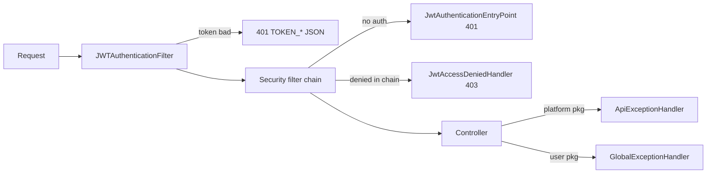

# Internal Error Reference

> **Audience:** Staff (ADMIN / EMPLOYEE / TEACHER) and operators · **Applies to:** every staff
> endpoint under `/api/**` · **Source:** `platform/exceptions/ApiExceptionHandler.java`,
> `user/exceptions/GlobalExceptionHandler.java`, `common/exceptions/ApiErrorResponse.java`,
> `common/exceptions/ApiErrorResponses.java`, `common/exceptions/ErrorCode.java`,
> `common/exceptions/ErrorCategory.java`, `platform/exceptions/*`, `user/exceptions/*`,
> `user/jwt/JWTAuthenticationFilter.java`, `user/configs/SecurityConfig.java`,
> `src/main/resources/application.yaml`

The public error contract — envelope fields, the full `ErrorCode` catalog, the token codes and what
a client should do about them — lives in [the external error reference](../external/02-errors.md).
This file is the staff-side companion: which of the two `@RestControllerAdvice` classes answers a
given request, the complete inventory of custom exception classes and what throws them, the exact
shape of each `details` payload, and how `traceId` behaves when you go looking for a failure in the
logs.

---

## 1. The two `@RestControllerAdvice` classes

Both advices exist, both are package-scoped, and **both emit the identical envelope**: every handler
in both classes returns `ResponseEntity<ApiErrorResponse>` built through
`ApiErrorResponses.build(...)`. There is no second wire format. The difference between them is
**coverage**, not shape — and the coverage gaps are the part that bites in production (section 2).

| | `ApiExceptionHandler` | `GlobalExceptionHandler` |
|---|---|---|
| File | `platform/exceptions/ApiExceptionHandler.java` | `user/exceptions/GlobalExceptionHandler.java` |
| Annotation (verbatim) | `@RestControllerAdvice(basePackages = "ak.dev.khi_archive_platform.platform")` | `@RestControllerAdvice(basePackages = "ak.dev.khi_archive_platform.user")` |
| Controllers it covers | every `@RestController` under `…platform` — content CRUD, guest catalog, items, tags/keywords, maqam, physical media, corrections, khi-logo, analytics | every `@RestController` under `…user` — auth, sessions, profile, admin users, audit logs, warnings |
| Handler methods | 54 | 29 |
| Response body | `ApiErrorResponse` | `ApiErrorResponse` |
| Emits `category` | always (`ApiErrorResponses.of` writes `category.name()`) | always |

`user/exceptions/UserApiErrorResponse.java` declares an older six-field record with no `category`,
`hint` or `traceId`. **Nothing references it** outside its own declaration — it is dead code, not a
second envelope. Do not add handlers that return it.

The advice is selected by the **package of the controller class**, never by the URL. A `platform`
controller that throws a `user`-package exception gets the `platform` advice's answer, which may be
no answer at all — see the next section.

### Where an error can be produced



`JwtAccessDeniedHandler`'s javadoc states the split explicitly: the advice-level
`AccessDeniedException` handler "catches denials that surface during request processing — this
handler covers denials at the filter layer." Only the advice-level handler can name the missing
authority, because only it receives the resolved `HandlerMethod`.

---

## 2. Divergences between the two advices

Same exception, different answer depending on which package threw it. Every row below is a real
gap in the current code, not a hypothetical.

| Exception reaching the advice | `platform` result | `user` result |
|---|---|---|
| `UsernameNotFoundException` | `401` `AUTHENTICATION_FAILED` / `AUTHENTICATION` (caught by the `AuthenticationException` handler) | `404` `USER_NOT_FOUND` / `NOT_FOUND` (explicitly mapped) |
| `MultipartException` (not a size overflow) | `400` `BAD_REQUEST` / `MEDIA`, message "Multipart request could not be parsed." | `413` `UPLOAD_TOO_LARGE` / `MEDIA` — the user advice maps `MultipartException` and `MaxUploadSizeExceededException` together |
| `ObjectOptimisticLockingFailureException` | `409` `STALE_VERSION` / `CONFLICT`, `details.entity` | no handler; it is a `DataAccessException`, so it falls to that handler → `500` `DATABASE_ERROR` / `DATABASE` |
| `QueryTimeoutException` | `504` `TIMEOUT` / `DATABASE` | no handler; falls to `DataAccessException` → `500` `DATABASE_ERROR` |
| `HttpMediaTypeNotAcceptableException` | `406` `NOT_ACCEPTABLE` / `MEDIA` | no handler → `Exception` catch-all → `500` `INTERNAL_SERVER_ERROR` |
| `ResponseStatusException` | status preserved; `404`→`NOT_FOUND`, other `4xx`→`BAD_REQUEST`, `5xx`→`INTERNAL_SERVER_ERROR` (logged) | no handler → catch-all `500`. No `user` controller throws it today. |
| `DisabledException`, `LockedException`, `CredentialsExpiredException`, `AccountExpiredException` | all are `AuthenticationException` subtypes → `401` `AUTHENTICATION_FAILED` | mapped individually → `403` `ACCOUNT_DISABLED`, `423` `ACCOUNT_LOCKED`, `401` `CREDENTIALS_EXPIRED`, `403` `ACCOUNT_DISABLED` |
| `IllegalAdminOperationException` | **no handler** → catch-all `500` `INTERNAL_SERVER_ERROR` | `409` with the exception's own `errorCode`, category `CONFLICT` |
| `UserStorageException` | **no handler** → catch-all `500` `INTERNAL_SERVER_ERROR` | `500` `STORAGE_ERROR` / `STORAGE` |

Two of these are worth internalizing:

- **Neither correction path can return `409` from `IllegalAdminOperationException`.**
  `platform/service/correction/GuestCorrectionService.java` throws it with the codes
  `CORRECTION_NOT_YOURS` (line 111, from `GET /api/corrections/me/{id}`), `EMPLOYEE_NOT_FOUND`
  (line 181, from `POST /api/admin/corrections/{id}/forward`) and `UNAUTHENTICATED` (line 588,
  `requireActor`), but both correction controllers live in `platform/api/correction/`, so the
  platform advice — which has no handler for that type — hands the request to
  `@ExceptionHandler(Exception.class)`. Staff see a generic `500` with the message "An unexpected
  error occurred." and the real cause only in the server log (`Unhandled error on
  /api/corrections/...` or `Unhandled error on /api/admin/corrections/...`). Treat any `500` on a
  correction action, guest-facing or admin, as a candidate for this.
- **`UserStorageException` is an S3 exception living in the `user` package.**
  `S3Service` (root package `ak.dev.khi_archive_platform`) throws it for an empty file, a blank
  file URL or S3 key, a URL it cannot turn into a key, a failed upload, and a failed
  download / stream / range-read / object-size call. Four of the five stream proxies
  (`AudioStreamAPI`, `VideoStreamAPI`, `ImageStreamAPI`, `TextStreamAPI`) catch it in a
  `mapStorageError(...)` helper and convert it to a `ResponseStatusException`, so streaming stays
  correct — a missing S3 object becomes `404`, everything else `500`. `MaqamStreamAPI` does
  **not**: `GET /api/maqam/{maqamCode}/stream` calls `s3Service.downloadByUrl(...)` bare, so a
  broken S3 object there surfaces as `500` `INTERNAL_SERVER_ERROR` from the catch-all. Every other
  platform code path that lets it escape behaves the same way — never `STORAGE_ERROR`.

---

## 3. Complete custom-exception inventory

Every class under `platform/exceptions/` and `user/exceptions/`. Enumerated from the directories;
nothing is omitted. Handler classes and DTO records are listed separately at the end.

### 3.1 `platform/exceptions/` — 30 exception classes

| Exception | Status | `error` | `category` | What triggers it |
|---|---|---|---|---|
| `AudioValidationException` | `400` | `AUDIO_VALIDATION_ERROR` | `VALIDATION` | `AudioAPI.parseAndValidate`: missing or unparseable `data` part, or bean-validation on the parsed DTO. `AudioService`: version not `RAW`/`MASTER`, `versionNumber` < 1, `copyNumber` < 1, missing payload / file / `projectCode`, changing the project after creation, and the trash-state rules (restore of a record not in trash, restore while its project is still trashed, purge before trash). Also `ItemVisibilityService.parseType` — an unknown `{type}` on `PATCH /api/items/{type}/{code}/visibility` raises this **audio**-specific code whatever the target entity is. |
| `VideoValidationException` | `400` | `VIDEO_VALIDATION_ERROR` | `VALIDATION` | The same `VideoAPI` / `VideoService` rule set as audio (minus the items-visibility path); version must be one of `RAW, MASTER, RESTORED, ARCHIVE, ORIGINAL, 4K_MASTER, PROFESSIONAL`. |
| `ImageValidationException` | `400` | `IMAGE_VALIDATION_ERROR` | `VALIDATION` | The same rule set in `ImageAPI` / `ImageService`; version must be one of `RAW, MASTER, RESTORED, ARCHIVE, ORIGINAL, HIGH_RES, PROFESSIONAL`. |
| `TextValidationException` | `400` | `TEXT_VALIDATION_ERROR` | `VALIDATION` | The same rule set in `TextAPI` / `TextService`; version must be one of `RAW, MASTER, RESTORED, ARCHIVE, ORIGINAL, DIGITIZED, PROFESSIONAL`. |
| `PersonValidationException` | `400` | `PERSON_VALIDATION_ERROR` | `VALIDATION` | `PersonAPI.parseAndValidate`: missing / unparseable `data` part, or bean-validation failures on the person DTO. |
| `ProjectValidationException` | `400` | `PROJECT_VALIDATION_ERROR` | `VALIDATION` | `ProjectService`: null payload, empty `categoryCodes` (create and update), blank `projectCode`, malformed person code, restore of a project that is not in trash, and purge of a project that is not in trash. |
| `MaqamValidationException` | `400` | `MAQAM_VALIDATION_ERROR` | `VALIDATION` | `MaqamAPI.parseAndValidate` (`data` part missing / unparseable / invalid) and `MaqamService` rules — teacher panel outside 1–3 distinct teachers, unknown teacher user id, a listed user whose role is not `TEACHER`, a deactivated teacher, missing audio file, a file whose MIME type is not `audio/*`, blank `songName` / `producer`, no open listen session for the supplied key, restore of a record not in trash, purge of a record not trashed. |
| `PhysicalMediaValidationException` | `400` | `PHYSICAL_MEDIA_VALIDATION_ERROR` | `VALIDATION` | `PhysicalMediaService`: blank `physicalMediaType`, neither `title` nor `physicalLabel`, a type outside the catalog on manual create, missing `type` query parameter, restore/purge state rules. `PhysicalMediaTypeService`: blank or duplicate type name. `PhysicalMediaExcelImportService`: missing file, a non-`.xlsx` upload, an unknown sheet name, an empty header row, a header with no recognisable columns, or a workbook that cannot be read. |
| `VideoNotFoundException` | `404` | `VIDEO_NOT_FOUND` | `NOT_FOUND` | `VideoService` lookup by `videoCode` returns nothing (or the row is trashed on an active-only lookup). |
| `AudioNotFoundException` | `404` | `AUDIO_NOT_FOUND` | `NOT_FOUND` | Same for `AudioService` / `audioCode`. |
| `ImageNotFoundException` | `404` | `IMAGE_NOT_FOUND` | `NOT_FOUND` | Same for `ImageService` / `imageCode`. |
| `TextNotFoundException` | `404` | `TEXT_NOT_FOUND` | `NOT_FOUND` | Same for `TextService` / `textCode`. |
| `CategoryNotFoundException` | `404` | `CATEGORY_NOT_FOUND` | `NOT_FOUND` | `CategoryService`: unknown `categoryCode`; also "Category is not in trash" on restore and "Category must be in trash before permanent deletion" on purge. Also `ProjectService` when a project payload names a `categoryCode` that does not exist. |
| `ProjectNotFoundException` | `404` | `PROJECT_NOT_FOUND` | `NOT_FOUND` | `ProjectService` lookup by `projectCode`; also raised by all four media services (`AudioService`, `VideoService`, `ImageService`, `TextService`) when a media payload names a project that does not exist. |
| `PersonNotFoundException` | `404` | `PERSON_NOT_FOUND` | `NOT_FOUND` | `PersonService`: unknown `personCode`, or restore of a person that is not in trash. Also `ProjectService.resolvePerson` when a project payload names a person that does not exist. |
| `MaqamNotFoundException` | `404` | `MAQAM_NOT_FOUND` | `NOT_FOUND` | `MaqamService` lookup by `maqamCode` (active, trash and listen-tracking paths), and the admin vote-clearing path when the named teacher has no vote row on that record. |
| `PhysicalMediaNotFoundException` | `404` | `PHYSICAL_MEDIA_NOT_FOUND` | `NOT_FOUND` | `PhysicalMediaService` lookup by `pmCode`, and `PhysicalMediaTypeService` lookup of a media type. |
| `GuestCorrectionNotFoundException` | `404` | `CORRECTION_NOT_FOUND` | `NOT_FOUND` | `GuestCorrectionService`: no correction row with that id, or it is soft-removed (`removedAt` set). **Also** when the *media record* the correction points at cannot be resolved — `resolveMediaInfo` (forward) and `applyFieldToMedia` (apply) both report a missing or trashed audio/video/image/text row as `CORRECTION_NOT_FOUND` with a message like "Audio record not found: code=…". |
| `KhiLogoNotFoundException` | `404` | `KHI_LOGO_NOT_FOUND` | `NOT_FOUND` | `KhiLogoService` lookup by id. |
| `MaqamAccessDeniedException` | `403` | `MAQAM_PANEL_ACCESS_DENIED` | `AUTHORIZATION` | `MaqamService`: a non-TEACHER casting a vote, tracking a listen session or opening `GET /api/maqam/teacher/my-recent`; a TEACHER who is not on that record's vote panel (voting, listen tracking, or simply reading the record via `ensureCallerMaySeeRecord`); or no resolvable `User` principal at all. Distinct from `ACCESS_DENIED` so the UI can say "you're not on this record's panel". |
| `AudioAlreadyExistsException` | `409` | `AUDIO_ALREADY_EXISTS` | `CONFLICT` | `AudioService.create`: the generated `audioCode` already exists. |
| `VideoAlreadyExistsException` | `409` | `VIDEO_ALREADY_EXISTS` | `CONFLICT` | `VideoService.create`: generated `videoCode` collision. |
| `ImageAlreadyExistsException` | `409` | `IMAGE_ALREADY_EXISTS` | `CONFLICT` | `ImageService.create`: generated `imageCode` collision. |
| `TextAlreadyExistsException` | `409` | `TEXT_ALREADY_EXISTS` | `CONFLICT` | `TextService.create`: generated `textCode` collision. |
| `CategoryAlreadyExistsException` | `409` | `CATEGORY_ALREADY_EXISTS` | `CONFLICT` | `CategoryService.create` with an active duplicate code, **or** restore when an active category already holds the code. |
| `ProjectAlreadyExistsException` | `409` | `PROJECT_ALREADY_EXISTS` | `CONFLICT` | `ProjectService.create` with an active duplicate code, or restore blocked by an active holder of the code. |
| `PersonAlreadyExistsException` | `409` | `PERSON_ALREADY_EXISTS` | `CONFLICT` | `PersonService.create` with an active duplicate code, or restore blocked by an active holder of the code. |
| `CategoryInUseException` | `409` | `CATEGORY_IN_USE` | `CONFLICT` | Trash: the category is referenced by **active** projects. Purge: it is referenced by projects at all, active or trashed. |
| `ProjectInUseException` | `409` | `PROJECT_IN_USE` | `CONFLICT` | **Never thrown.** The handler exists, the class exists, and no `throw new ProjectInUseException(...)` appears anywhere in `src/main`. Project delete cascades to media instead. |
| `CorrectionAlreadyProcessedException` | `409` | `CORRECTION_ALREADY_PROCESSED` | `CONFLICT` | `GuestCorrectionService`: forwarding a `RESOLVED`/`REJECTED` correction, resolving or applying a `REJECTED` one, rejecting a `RESOLVED` one. |

All eight `*ValidationException` types carry a `Map<String, String> fieldErrors`.
`AudioValidationException`, `VideoValidationException`, `ImageValidationException`,
`TextValidationException`, `PersonValidationException` and `ProjectValidationException` leave it
`null` on the single-argument constructor; `MaqamValidationException` and
`PhysicalMediaValidationException` default it to an empty `LinkedHashMap`. Either way the advice's
`toDetails(...)` turns null/empty into no `details` key at all.

### 3.2 `user/exceptions/` — 6 exception classes

| Exception | Status | `error` | `category` | What triggers it |
|---|---|---|---|---|
| `UserAlreadyExistsException` | `409` | `USER_ALREADY_EXISTS` | `CONFLICT` | `UserService` (`register`, `createUser`, `updateUser`) and `AdminUserService` (admin create/update): "Username is already taken." or "Email is already registered." `UserProfileService` throws the same type from the profile self-update path with **Kurdish (Sorani)** messages, so switch on `error`, never on the text. |
| `IllegalAdminOperationException` | `409` | its own `errorCode` field (see [section 7.2](#72-illegaladminoperationexception-codes)) | `CONFLICT` | A structurally forbidden admin action — self-demotion, last-admin delete, granting extras to an ADMIN, acknowledging someone else's warning. It can carry a `details` map, but no throw site in `src/main` passes one, so `details` is always absent today. |
| `UnknownPermissionException` | `400` | `UNKNOWN_PERMISSION` | `VALIDATION` | `AdminUserService.sanitiseAndValidate`: a grant/revoke body named a string that is not in the `Permission` catalog. Carries the offending strings as a sorted `TreeSet`. |
| `UserNotFoundException` | `404` | `USER_NOT_FOUND` | `NOT_FOUND` | `UserService`, `AdminUserService`, `UserProfileService` and `UserWarningService` lookups by id or username. Also `UserAuditLogService.getById` — a missing audit-log row reports `USER_NOT_FOUND` with the message "Audit log not found: id=…". |
| `UserWarningNotFoundException` | `404` | `WARNING_NOT_FOUND` | `NOT_FOUND` | `UserWarningService`: the warning id does not exist or the row is revoked (`removedAt` set). |
| `UserStorageException` | `500` | `STORAGE_ERROR` | `STORAGE` | Thrown by `S3Service` (empty file, blank key or URL, upload failure, unreadable upload, failed download / stream / range read / size lookup). Logged at `ERROR` as `User storage error on {}` with the request URI before the envelope is written; the client sees the fixed message "Profile-image storage failure." |

`UserNotFoundException` shares its handler with Spring Security's `UsernameNotFoundException`:
`@ExceptionHandler({UserNotFoundException.class, UsernameNotFoundException.class})`.

### 3.3 Non-exception files in those two directories

| File | Role |
|---|---|
| `platform/exceptions/ApiExceptionHandler.java` | the platform advice |
| `user/exceptions/GlobalExceptionHandler.java` | the user advice |
| `user/exceptions/JwtAuthenticationEntryPoint.java` | `@Component` `AuthenticationEntryPoint`; writes `401` `TOKEN_MISSING` when no credentials were supplied at all, `AUTHENTICATION_FAILED` otherwise |
| `user/exceptions/JwtAccessDeniedHandler.java` | `@Component` `AccessDeniedHandler`; writes `403` `ACCESS_DENIED` for filter-layer denials, **never** with `requiredAuthority` |
| `user/exceptions/UserApiErrorResponse.java` | dead record, referenced nowhere |

Both components are wired in `SecurityConfig`:

```java
.exceptionHandling(ex -> ex
        .authenticationEntryPoint(jwtAuthenticationEntryPoint)
        .accessDeniedHandler(jwtAccessDeniedHandler)
)
```

---

## 4. Framework exceptions, side by side

Everything each advice maps that is not one of our own classes. `—` means the advice has no handler
for it, so it falls through to the closest superclass handler or the `Exception` catch-all.

| Framework exception | `ApiExceptionHandler` (platform) | `GlobalExceptionHandler` (user) |
|---|---|---|
| `MethodArgumentNotValidException` | `400` `VALIDATION_ERROR` / `VALIDATION` | same |
| `BindException` | `400` `VALIDATION_ERROR` / `VALIDATION` | same |
| `ConstraintViolationException` | `400` `CONSTRAINT_VIOLATION` / `VALIDATION` | same |
| `HttpMessageNotReadableException` | `400` `JSON_PARSE_ERROR` / `BAD_REQUEST` | same |
| `MissingServletRequestParameterException` | `400` `MISSING_PARAMETER` / `BAD_REQUEST` | same |
| `MissingServletRequestPartException` | `400` `MISSING_REQUEST_PART` / `BAD_REQUEST` | same |
| `MethodArgumentTypeMismatchException` | `400` `TYPE_MISMATCH` / `BAD_REQUEST` | same |
| `IllegalArgumentException` | `400` `BAD_REQUEST` / `BAD_REQUEST`, no `hint` | same |
| `NoHandlerFoundException`, `NoResourceFoundException` | `404` `NOT_FOUND` / `NOT_FOUND` | same |
| `HttpRequestMethodNotSupportedException` | `405` `METHOD_NOT_ALLOWED` / `BAD_REQUEST` | same |
| `HttpMediaTypeNotSupportedException` | `415` `UNSUPPORTED_MEDIA_TYPE` / `MEDIA` | same |
| `HttpMediaTypeNotAcceptableException` | `406` `NOT_ACCEPTABLE` / `MEDIA` | — |
| `MaxUploadSizeExceededException` | `413` `UPLOAD_TOO_LARGE` / `MEDIA` | `413` `UPLOAD_TOO_LARGE` / `MEDIA` (shared with `MultipartException`) |
| `MultipartException` | `400` `BAD_REQUEST` / `MEDIA` | `413` `UPLOAD_TOO_LARGE` / `MEDIA` |
| `DataIntegrityViolationException` | `409` `CONFLICT` / `CONFLICT`, message = `ApiErrorResponses.rootMessage(ex)` | same |
| `ObjectOptimisticLockingFailureException` | `409` `STALE_VERSION` / `CONFLICT` | — |
| `BadCredentialsException` | `401` `BAD_CREDENTIALS` / `AUTHENTICATION` | same |
| `AuthenticationException` | `401` `AUTHENTICATION_FAILED` / `AUTHENTICATION` | same |
| `DisabledException` | — | `403` `ACCOUNT_DISABLED` / `ACCOUNT_STATE` |
| `LockedException` | — | `423` `ACCOUNT_LOCKED` / `ACCOUNT_STATE` |
| `CredentialsExpiredException` | — | `401` `CREDENTIALS_EXPIRED` / `ACCOUNT_STATE` |
| `AccountExpiredException` | — | `403` `ACCOUNT_DISABLED` / `ACCOUNT_STATE` |
| `AccessDeniedException` | `403` `ACCESS_DENIED` / `AUTHORIZATION` | same |
| `QueryTimeoutException` | `504` `TIMEOUT` / `DATABASE` (logged `WARN`) | — |
| `DataAccessException` | `500` `DATABASE_ERROR` / `DATABASE` (logged `ERROR`) | same |
| `IOException` | `500` `STORAGE_ERROR` / `STORAGE` (logged `ERROR`) | same |
| `ResponseStatusException` | status preserved, code by class (see section 2) | — |
| `Exception` | `500` `INTERNAL_SERVER_ERROR` / `SERVER_ERROR` (logged `ERROR`) | same |

`DataIntegrityViolationException` is the only handler that puts a raw database message on the wire:
`rootMessage(ex)` walks the cause chain to the deepest message, which on PostgreSQL is the
constraint text. Expect strings like `duplicate key value violates unique constraint …` to reach
staff screens.

---

## 5. The `details` map, shape by shape

`ApiErrorResponses.of(...)` nulls out an empty map, and `@JsonInclude(NON_NULL)` then drops the key
entirely — so **`details` is absent, never `{}` and never `null`**.

| Shape | Codes that use it | Keys |
|---|---|---|
| Field errors | `VALIDATION_ERROR` | one key per rejected field → its message (`FieldError.getField()` → `getDefaultMessage()`) |
| Field errors | `CONSTRAINT_VIOLATION` | one key per violated property path → its message |
| Field errors | the eight `*_VALIDATION_ERROR` codes | the exception's own `fieldErrors` map, copied into a `LinkedHashMap` |
| Parse position | `JSON_PARSE_ERROR` | `field` (dotted path, only when Jackson resolved one), `location` |
| Parameter | `MISSING_PARAMETER` | `parameter`, `expectedType` |
| Parameter | `TYPE_MISMATCH` | `parameter`, `rejectedValue`, `expectedType` (omitted when the required type is unknown) |
| Part | `MISSING_REQUEST_PART` | `part` |
| Routing | `METHOD_NOT_ALLOWED` | `method`, `supportedMethods` (array) |
| Media | `UNSUPPORTED_MEDIA_TYPE` | `received`, `supported` (array, only when non-empty) |
| Media | `NOT_ACCEPTABLE` | `supported` (array, only when non-empty) |
| Media | `UPLOAD_TOO_LARGE` | `maxBytes` (platform always; user only for `MaxUploadSizeExceededException`) |
| Authorization | `ACCESS_DENIED` | `requiredAuthority` (advice only, when resolvable), `actor`, `actorAuthorities`, `requestMethod` |
| Permission catalog | `UNKNOWN_PERMISSION` | `unknown`, `catalog` |
| Concurrency | `STALE_VERSION` | `entity` |
| Token | `TOKEN_EXPIRED`, `TOKEN_INVALID_SIGNATURE`, `TOKEN_MALFORMED`, `TOKEN_REVOKED`, and the `TOKEN_INVALID` raised for an invalid claim | `reason` — one of `expired`, `signature_mismatch`, `algorithm_mismatch`, `malformed`, `invalid_claim`, `revoked` |
| Everything else | — | no `details` key |

The JWT filter's *generic* fallback (`TOKEN_INVALID`, message "Token verification failed.") passes
`null` details, and `JwtAuthenticationEntryPoint` passes an empty map for `TOKEN_MISSING` /
`AUTHENTICATION_FAILED` — so those three carry no `reason`. Do not assume every `TOKEN_*` response
has one.

There is **no conflicting-id payload anywhere**. The `*_ALREADY_EXISTS` family, `CATEGORY_IN_USE`,
`CORRECTION_ALREADY_PROCESSED` and the generic `CONFLICT` all pass `null` details; the identifier
appears only inside `message` — for example
`"Audio code already exists: HASAZIRA_AUD_RAW_V1_Copy(1)_000001"`. The closest thing to a
structured conflict payload is `STALE_VERSION`'s `entity`. Do not build tooling that expects a
`conflictingId` key.

### 5.1 Field errors — `VALIDATION_ERROR`

`POST /api/admin/users` with a blank name and a four-character password. Messages are the literal
`message = "…"` values on `UserCreateRequestDTO`.

```json
{
  "timestamp": "2026-08-26T07:12:44.902Z",
  "status": 400,
  "error": "VALIDATION_ERROR",
  "category": "VALIDATION",
  "message": "One or more fields failed validation. See 'details' for the per-field reason.",
  "hint": "Fix the highlighted fields and resubmit the request.",
  "path": "/api/admin/users",
  "details": {
    "name": "Name is required",
    "password": "Password must be at least 6 characters"
  }
}
```

### 5.2 Field errors from a `data` part — `MAQAM_VALIDATION_ERROR`

`POST /api/maqam` is `multipart/form-data`; `MaqamAPI.parseAndValidate` runs the `Validator`
manually over the parsed `data` JSON and packs the violations into the exception.

```json
{
  "timestamp": "2026-08-26T07:19:03.115Z",
  "status": 400,
  "error": "MAQAM_VALIDATION_ERROR",
  "category": "VALIDATION",
  "message": "Validation failed for maqam data.",
  "hint": "Maqam record invalid — see field-level reasons in 'details'.",
  "path": "/api/maqam",
  "details": {
    "songName": "songName is required",
    "producer": "producer is required"
  }
}
```

The audio, video, image and text create DTOs validate through `@AssertTrue` **methods** rather than
field annotations, so their `details` keys are the derived property names, not payload field names.
`AudioCreateRequestDTO` produces `projectCodePresent`, `audioVersionValid`, `versionNumberValid`
and `copyNumberValid`; `VideoCreateRequestDTO`, `ImageCreateRequestDTO` and `TextCreateRequestDTO`
use the same four with `videoVersionValid` / `imageVersionValid` / `textVersionValid` in the second
slot:

```json
{
  "timestamp": "2026-08-26T07:20:41.508Z",
  "status": 400,
  "error": "AUDIO_VALIDATION_ERROR",
  "category": "VALIDATION",
  "message": "Validation failed for audio data.",
  "hint": "Audio submission rejected — fix the indicated fields and resubmit.",
  "path": "/api/audio",
  "details": {
    "audioVersionValid": "Audio version is required and must be RAW or MASTER.",
    "copyNumberValid": "Copy number is required and must be at least 1."
  }
}
```

A UI that highlights fields by key must map `audioVersionValid` → the `audioVersion` input itself.
The same code with **no** `details` key means the failure came from a service-level rule in
`AudioService`/`VideoService`/… which throws the single-argument constructor and has nothing to
report per field.

### 5.3 Physical media — service-built field map

`PhysicalMediaService` assembles the map itself, so the messages are literal strings from the
service:

```json
{
  "timestamp": "2026-08-26T07:22:51.640Z",
  "status": 400,
  "error": "PHYSICAL_MEDIA_VALIDATION_ERROR",
  "category": "VALIDATION",
  "message": "Validation failed",
  "hint": "Physical-media row invalid — see field-level reasons in 'details'.",
  "path": "/api/physical-media",
  "details": {
    "physicalMediaType": "not in the type catalog — add it via /api/physical-media/types first"
  }
}
```

### 5.4 Required authority — `ACCESS_DENIED`

Produced by the advice-level handler. `extractRequiredAuthority(handler)` reads
`@PreAuthorize` **on the method first, then on the class**, and pulls the quoted value out of
`hasAuthority('…')` or `hasRole('…')` with the regex
`has(?:Authority|Role)\s*\(\s*'([^']+)'\s*\)`.

`DELETE /api/audio/{audioCode}` is annotated `@PreAuthorize("hasAuthority('audio:delete')")`, an
authority EMPLOYEE does not hold by default:

```json
{
  "timestamp": "2026-08-26T07:31:10.004Z",
  "status": 403,
  "error": "ACCESS_DENIED",
  "category": "AUTHORIZATION",
  "message": "You don't have permission to perform this action. Required authority: 'audio:delete'.",
  "hint": "Ask an administrator to grant 'audio:delete' or to assign a role that includes it.",
  "path": "/api/audio/HASAZIRA_AUD_RAW_V1_Copy(1)_000001",
  "details": {
    "requiredAuthority": "audio:delete",
    "actor": "hawkar",
    "actorAuthorities": [
      "ROLE_EMPLOYEE",
      "audio:create",
      "audio:read",
      "audio:update"
    ],
    "requestMethod": "DELETE"
  }
}
```

Four things to know when reading this payload:

- `actorAuthorities` is the actor's **full** authority list — de-duplicated and sorted, so `ROLE_*`
  entries come before the lowercase `resource:action` strings. The array above is trimmed for
  brevity; a real EMPLOYEE carries every code in `EMPLOYEE_DEFAULT_PERMISSIONS` plus any per-user
  grants.
- For a class-level `hasRole('ADMIN')` — carried by `AdminUserAPI`, `AdminUserWarningAPI`,
  `UserAuditLogAPI`, `AdminGuestCorrectionAPI`, `AdminTagAPI`, `AdminKeywordAPI`, `AnalyticsAPI`,
  `InventoryAnalyticsAPI` and `MaqamAnalyticsAPI` — `requiredAuthority` reads `ADMIN`, while the
  authority actually granted is `ROLE_ADMIN` (`Role.getAuthorities()` adds `"ROLE_" + name()`). The
  two strings intentionally differ; do not "fix" one to match the other.
- `requiredAuthority` is **absent** when the denial happened before handler resolution, when it came
  from `JwtAccessDeniedHandler` (which never sets it), or when the matched `@PreAuthorize` holds an
  expression the regex does not recognise. `isAuthenticated()` is the case in use here — it is the
  class-level annotation on `GuestCorrectionAPI` and `UserWarningAPI`.
- The regex takes the **first** match only, so a composite expression reports just its leading
  authority. `GET /api/items` demands `audio:read`, `video:read`, `image:read` and `text:read` in
  one `and`-chained `@PreAuthorize`, and every denial there reports
  `requiredAuthority: "audio:read"` — even when the code the actor is missing is `text:read`. Read
  the field as "the first authority this endpoint demands", not "the one you are missing".

### 5.5 Unknown permission — `UNKNOWN_PERMISSION`

`POST /api/admin/users/{userId}/permissions` (`@PreAuthorize("hasAuthority('user:update')")`, under
the class-level `@PreAuthorize("hasRole('ADMIN')")`) with a string outside the catalog. `catalog` is
a literal path constant written by the handler.

```json
{
  "timestamp": "2026-08-26T07:35:22.781Z",
  "status": 400,
  "error": "UNKNOWN_PERMISSION",
  "category": "VALIDATION",
  "message": "Unknown permission(s): [audio:destroy]. Use GET /api/admin/users/catalog/permissions for the full catalog.",
  "hint": "Use the catalog endpoint to discover valid permission codes.",
  "path": "/api/admin/users/14/permissions",
  "details": {
    "unknown": ["audio:destroy"],
    "catalog": "/api/admin/users/catalog/permissions"
  }
}
```

### 5.6 Concurrent edit — `STALE_VERSION`

`details.entity` is the simple class name taken from
`ObjectOptimisticLockingFailureException.getPersistentClassName()`, falling back to the literal
`"record"` when the framework does not supply one. `@Version` exists on five entities only —
`GuestCorrection`, `ListOfMaqam`, `MaqamTeacherVote`, `PhysicalMedia`, `PhysicalMediaType` — so
those are the only values you will see.

```json
{
  "timestamp": "2026-08-26T07:41:58.220Z",
  "status": 409,
  "error": "STALE_VERSION",
  "category": "CONFLICT",
  "message": "This PhysicalMedia was modified by someone else while you were editing it.",
  "hint": "Reload the latest version, re-apply your changes and try again.",
  "path": "/api/physical-media/PM_000241",
  "details": {
    "entity": "PhysicalMedia"
  }
}
```

---

## 6. `traceId` — where it comes from and what it is worth today

**Read path.** `ApiErrorResponses.currentTraceId()` returns the first non-blank value among the MDC
keys, in this order:

```java
for (String key : new String[]{"traceId", "trace_id", "X-Trace-Id", "requestId"}) {
    String value = MDC.get(key);
    if (value != null && !value.isBlank()) return value;
}
return null;
```

Every envelope — both advices, the JWT filter, the entry point and the access-denied handler — goes
through `ApiErrorResponses.of(...)`, so all five producers attach the same trace id when one is in
scope. When none is, `NON_NULL` drops the field.

**Log path.** `application.yaml` sets one console pattern, and it reads only the `traceId` key:

```yaml
logging:
  pattern:
    console: "%d{yyyy-MM-dd HH:mm:ss} [%X{traceId}] %-5level %logger{36} - %msg%n"
```

There is no `logback-spring.xml` and no file appender — `src/main/resources` contains only
`application.yaml`, `static/` and `templates/`.

**Write path: there isn't one.** No class in `src/main` calls `MDC.put`. So today:

- `traceId` is omitted from every error response.
- `[%X{traceId}]` renders as an empty `[]` on every log line.
- The `hint` text "share the traceId with support", written by the `5xx` handlers, currently points
  at a value the response does not carry.

Populating it is a one-filter change (an `OncePerRequestFilter` that does
`MDC.put("traceId", …)` / `MDC.remove("traceId")` around `filterChain.doFilter`), but it is
_Not implemented in source._ Until it lands, correlate a report to a log line this way:

1. Take `path` and `timestamp` from the response envelope the reporter pasted.
2. Match the console line by clock time — log timestamps use the JVM clock formatted
   `yyyy-MM-dd HH:mm:ss`, while the envelope `timestamp` is an `Instant` from `Instant.now()`.
3. Grep the URI. The `5xx` handlers log it verbatim: `Unhandled error on {}`,
   `Database access error on {}`, `I/O error on {}`, `User storage error on {}`, and
   `ResponseStatusException ({}) on {}: {}`.

**What the handlers do not log.** Only the `5xx` handlers, `QueryTimeoutException` (`WARN`, and it
logs `"Database query timed out"` with no URI) and the JWT filter's token failures log anything of
their own. No handler in either advice logs a `4xx` — every `400`, `403`, `404`, `405`, `406`,
`409`, `413` and `415` goes to the client with no application log line behind it. The only trace
left is Spring's own output, and only because `application.yaml` sets
`org.springframework.web.servlet: DEBUG`. If staff report a `409` you cannot find in the logs, that
is expected behavior, not a lost log line: ask for the response body.

Log lines the JWT filter does produce. Five are `WARN` with the request URI — `JWT expired for
request: {}`, `JWT signature mismatch for request: {}`, `JWT algorithm mismatch for request: {}`,
`JWT claim invalid for request: {} — {}` and `JWT could not be decoded for request: {}`. Two do not
follow that shape: `Blacklisted token presented for user: {}` is `WARN` but logs the **username**,
not the URI, and the catch-all `Invalid JWT for request: {}` is `ERROR` with the stack trace.

---

## 7. Internal-only codes

The complete `ErrorCode` catalog is in
[the external reference](../external/02-errors.md#5-complete-error-code-reference).
The codes below are the staff-facing subset: with one flagged exception, every endpoint that raises
them requires staff authority, so a public client never sees them.

### 7.1 Codes from `ErrorCode`

| `error` | Status | `category` | Raised by | Trigger |
|---|---|---|---|---|
| `UNKNOWN_PERMISSION` | `400` | `VALIDATION` | user advice | Grant/revoke body named a permission outside the `Permission` catalog. Carries `details.unknown` and `details.catalog`. |
| `MAQAM_PANEL_ACCESS_DENIED` | `403` | `AUTHORIZATION` | platform advice | Non-TEACHER voting, tracking listens or opening the teacher feed; a TEACHER not on the record's panel (vote, listen or read); or no resolvable `User` principal inside `MaqamService`. No `details`. |
| `CATEGORY_IN_USE` | `409` | `CONFLICT` | platform advice | Trash blocked by active projects; purge blocked by any project referencing the category. |
| `PROJECT_IN_USE` | `409` | `CONFLICT` | platform advice | Handler wired, exception never thrown — currently unreachable. |
| `STALE_VERSION` | `409` | `CONFLICT` | platform advice | Optimistic-lock failure on a `@Version` entity. `details.entity` names it. Unreachable from `user`-package endpoints. |
| `USER_ALREADY_EXISTS` | `409` | `CONFLICT` | user advice | Username or email already taken on admin-create or admin-update. **Not staff-only:** the same code is raised by `POST /api/auth/register`, which `SecurityConfig` permits anonymously, and by the profile self-update path (Kurdish message). |
| `AUDIO_ALREADY_EXISTS` | `409` | `CONFLICT` | platform advice | Generated `audioCode` collision on create. |
| `VIDEO_ALREADY_EXISTS` | `409` | `CONFLICT` | platform advice | Generated `videoCode` collision on create. |
| `IMAGE_ALREADY_EXISTS` | `409` | `CONFLICT` | platform advice | Generated `imageCode` collision on create. |
| `TEXT_ALREADY_EXISTS` | `409` | `CONFLICT` | platform advice | Generated `textCode` collision on create. |
| `CATEGORY_ALREADY_EXISTS` | `409` | `CONFLICT` | platform advice | Duplicate active `categoryCode` on create, or on restore from trash. |
| `PROJECT_ALREADY_EXISTS` | `409` | `CONFLICT` | platform advice | Duplicate active `projectCode` on create, or on restore from trash. |
| `PERSON_ALREADY_EXISTS` | `409` | `CONFLICT` | platform advice | Duplicate active `personCode` on create, or on restore from trash. |

None of the `*_ALREADY_EXISTS` codes carry `details`; the colliding code is inside `message`.

### 7.2 `IllegalAdminOperationException` codes

These are **not** in `ErrorCode` — the string is chosen at the throw site and copied straight into
the `error` field. Status `409`, category `CONFLICT`, hint _"This operation is structurally
forbidden by the admin rules — pick a different target or change scope."_ The exception can carry a
`details` map, but every throw site in `src/main` uses the two-argument
`(errorCode, message)` constructor, so `details` is absent from all of them today.

| `error` | Thrown by | Trigger |
|---|---|---|
| `ADMIN_PERMISSIONS_LOCKED` | `AdminUserService.grantPermissions` / `revokePermissions` | Target user's role is `ADMIN`; ADMINs hold every permission through the role, so per-user grants are refused in both directions. |
| `LAST_ADMIN` | `AdminUserService.deleteUser` | Deleting the only remaining ADMIN. |
| `SELF_DEACTIVATE` | `AdminUserService` (activation toggle and bulk path) | Admin deactivating their own account. |
| `SELF_LOCK` | `AdminUserService` | Admin locking their own account. |
| `SELF_FORCE_LOGOUT` | `AdminUserService` | Admin force-logging-out their own sessions. |
| `SELF_DELETE` | `AdminUserService.deleteUser` | Admin deleting their own account. |
| `SELF_DEMOTION` | `AdminUserService.guardNotSelfDemotion` | Admin changing their own role away from `ADMIN`. |
| `SELF_USER_MGMT_REVOKE` | `AdminUserService` | Admin revoking their own user-management permission. |
| `SELF_WARNING` | `UserWarningService` | Admin sending a warning to themselves. |
| `WARNING_NOT_FOR_YOU` | `UserWarningService.acknowledge` | Acknowledging a warning addressed to another account. |
| `UNAUTHENTICATED` | `UserWarningService.requireActor` | Warning management with no resolvable `User` principal. |
| `CORRECTION_NOT_YOURS` | `GuestCorrectionService.getMyCorrection` (`GET /api/corrections/me/{id}`) | Reading someone else's correction submission. **Surfaces as `500` `INTERNAL_SERVER_ERROR`** — platform package, see section 2. |
| `EMPLOYEE_NOT_FOUND` | `GuestCorrectionService` forward path (`POST /api/admin/corrections/{id}/forward`) | `targetEmployeeId` does not resolve to a user. **Surfaces as `500`.** |
| `UNAUTHENTICATED` | `GuestCorrectionService.requireActor` | A `/api/corrections` call with no resolvable `User` principal. **Surfaces as `500`.** |

---

## 8. Reproducing the common staff errors

Every example authenticates with the JWT cookie. Substitute a real token.

```bash
# 403 ACCESS_DENIED with requiredAuthority — signed in as EMPLOYEE, audio:delete not granted
curl -s -X DELETE "{{BASE_URL}}/api/audio/HASAZIRA_AUD_RAW_V1_Copy(1)_000001" \
  -H "Cookie: khi_auth_token=$TOKEN"

# 403 MAQAM_PANEL_ACCESS_DENIED — TEACHER voting on a record whose panel excludes them
curl -s -X POST "{{BASE_URL}}/api/maqam/MAQAM_000001/vote" \
  -H "Cookie: khi_auth_token=$TOKEN" \
  -H "Content-Type: application/json" \
  -d '{"maqamType":"Bayat","teacherNote":"reviewed"}'

# 400 UNKNOWN_PERMISSION — details.unknown lists the rejected strings
curl -s -X POST "{{BASE_URL}}/api/admin/users/14/permissions" \
  -H "Cookie: khi_auth_token=$TOKEN" \
  -H "Content-Type: application/json" \
  -d '{"permissions":["audio:destroy"]}'

# 409 CATEGORY_IN_USE — trashing a category that active projects still reference
curl -s -X DELETE "{{BASE_URL}}/api/category/FOLK_MUSIC" \
  -H "Cookie: khi_auth_token=$TOKEN"

# 400 MAQAM_VALIDATION_ERROR — multipart create with an incomplete 'data' part.
# Both parts are required: drop the 'file' part and you get MISSING_REQUEST_PART instead,
# because @RequestPart("file") fails to resolve before the handler body runs.
curl -s -X POST "{{BASE_URL}}/api/maqam" \
  -H "Cookie: khi_auth_token=$TOKEN" \
  -F 'data={"songName":""};type=application/json' \
  -F 'file=@song.mp3'

# 405 METHOD_NOT_ALLOWED — details.supportedMethods lists what the endpoint accepts
curl -s -X PUT "{{BASE_URL}}/api/category/FOLK_MUSIC" \
  -H "Cookie: khi_auth_token=$TOKEN"
```

Triage order for a staff-reported failure:

1. **Read `error`, not `message`.** `message` is sometimes a raw database string
   (`DataIntegrityViolationException`) and sometimes a fixed sentence (`INTERNAL_SERVER_ERROR`).
2. **`500` on `/api/corrections` or `/api/admin/corrections`?** Suspect
   `IllegalAdminOperationException` falling through the platform advice (section 2) and check the
   server log for `Unhandled error on /api/corrections` / `Unhandled error on
   /api/admin/corrections`.
3. **`403` without `requiredAuthority`?** Either the denial came from the filter layer
   (`JwtAccessDeniedHandler` never sets the key), or the handler resolved to a `@PreAuthorize` the
   regex cannot read — `isAuthenticated()` is the common case. A `403` **with**
   `requiredAuthority` on a composite expression names only the first authority in the
   expression, not the one that actually failed.
4. **`409` with no `details`?** It is a domain conflict, not an optimistic-lock failure — the
   identifier is inside `message`.
5. **Nothing in the logs?** Expected for every `4xx`; only `5xx`, query timeouts and token failures
   are logged.

---

## Related

- [Internal API index](./README.md) — the staff endpoint map.
- [Conventions](./01-conventions.md) — page envelope, timestamps and time zone, shared query
  parameter names.
- [Public error reference](../external/02-errors.md) — the envelope field table, the complete
  `ErrorCode` catalog and the token-code playbook this file deliberately does not repeat.
- [Category API](./content/category.md) — the trash and purge rules behind `CATEGORY_IN_USE`.
- [Project API](./content/project.md) — `PROJECT_VALIDATION_ERROR`, `PROJECT_ALREADY_EXISTS`, and
  the delete behavior that leaves `PROJECT_IN_USE` unreachable.
- [Audio API](./content/audio.md) — a representative media lifecycle: `*_VALIDATION_ERROR` on the
  multipart `data` part and the `ResponseStatusException`-based stream errors.
- [Correction schema](./database/schema-corrections.md) — the `status` transitions that raise
  `CORRECTION_ALREADY_PROCESSED`.
- [Maqam schema](./database/schema-maqam.md) — the teacher vote panel that `MAQAM_PANEL_ACCESS_DENIED`
  guards, and the `@Version` column behind `STALE_VERSION`.
- [Physical media schema](./database/schema-physical-media.md) — the type catalog and import rules
  behind `PHYSICAL_MEDIA_VALIDATION_ERROR`.
