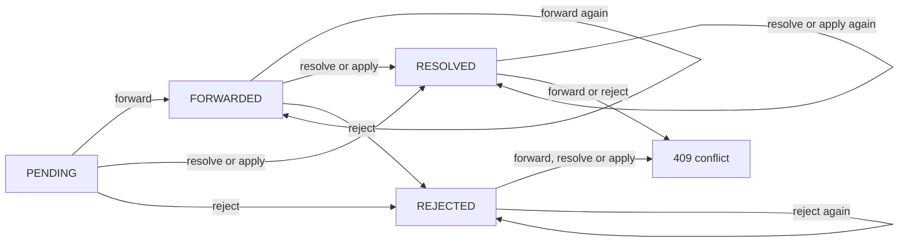

# Admin — Guest Correction Review API

> **Audience:** Staff (ADMIN) · **Base path:** `/api/admin/corrections` · **Source:** `src/main/java/ak/dev/khi_archive_platform/platform/api/correction/AdminGuestCorrectionAPI.java`

Signed-in visitors can suggest a fix for any field on an audio, video, image or text record
through the public "Help Us" form. Every suggestion lands in `guest_corrections` with status
`PENDING`. This API is the back-office review queue for that table: search and read the queue,
forward a suggestion to the employee who created the record (as an in-app `UserWarning`), apply
the suggested value straight to the record, mark it resolved, reject it, or soft-delete it.
Every mutation writes a row to `guest_correction_audit_logs`.

The submission side is documented in
[`../../external/08-corrections.md`](../../external/08-corrections.md).

## Access

| Requirement | Value |
|---|---|
| Authentication | Required — JWT via `Authorization: Bearer <jwt>` (read first) or the `khi_auth_token` HttpOnly cookie (fallback) |
| Class-level authority | `@PreAuthorize("hasRole('ADMIN')")` declared on `AdminGuestCorrectionAPI` — effective on the methods that carry no `@PreAuthorize` of their own |
| Method-level authorities | `correction:read`, `correction:update`, `correction:remove` (`Permission.CORRECTION_READ` / `CORRECTION_UPDATE` / `CORRECTION_REMOVE`) |
| Roles that hold them by default | ADMIN only — `Role.ADMIN` is `EnumSet.allOf(Permission.class)`. None of the `correction:*` permissions appear in `EMPLOYEE_DEFAULT_PERMISSIONS` or `TEACHER_DEFAULT_PERMISSIONS` |

Notes on the authority model:

- The class carries `hasRole('ADMIN')`, and eight of the ten handler methods additionally carry
  their own `@PreAuthorize`. Spring Security resolves the nearest annotation: a method-level
  `@PreAuthorize` replaces the class-level expression rather than being AND-ed with it, and the
  class-level expression is used only for methods that have none. The two `/catalog/*` endpoints
  are the methods without their own annotation, so they are gated on `hasRole('ADMIN')`.
- For an ADMIN account the distinction is invisible — the role carries every permission. It only
  matters if an admin grants `correction:read` / `correction:update` / `correction:remove` to a
  non-admin through the per-user grants endpoint; such an account would pass the eight
  method-level checks but be rejected by the two catalog endpoints.
- The exact authority is repeated in every endpoint section below.

## Endpoints

| Method | Path | Authority | Purpose |
|---|---|---|---|
| `GET` | `/api/admin/corrections` | `correction:read` | Paged search of the review queue |
| `GET` | `/api/admin/corrections/{id}` | `correction:read` | One correction by id, removed rows included |
| `POST` | `/api/admin/corrections/{id}/forward` | `correction:update` | Notify the record's creator, set `FORWARDED` |
| `POST` | `/api/admin/corrections/{id}/resolve` | `correction:update` | Mark `RESOLVED` without touching the record |
| `POST` | `/api/admin/corrections/{id}/apply` | `correction:update` | Write the suggested value to the record, then mark `RESOLVED` |
| `POST` | `/api/admin/corrections/{id}/reject` | `correction:update` | Mark `REJECTED` |
| `DELETE` | `/api/admin/corrections/{id}` | `correction:remove` | Soft-delete (audit trail preserved) |
| `GET` | `/api/admin/corrections/stats` | `correction:read` | All-time counts by status and media type |
| `GET` | `/api/admin/corrections/catalog/statuses` | `ROLE_ADMIN` (class-level) | Status values for filter dropdowns |
| `GET` | `/api/admin/corrections/catalog/media-types` | `ROLE_ADMIN` (class-level) | Media-type values for filter dropdowns |

## Data model

`GuestCorrectionResponseDTO` — the element shape returned by every endpoint in this file except
`/stats` and the two catalogs. Null fields are omitted from the response
(`spring.jackson.default-property-inclusion=non_null`), so a `PENDING` correction carries no
forwarding or resolution fields at all.

| Field | Type | Description |
|---|---|---|
| `id` | long | Database identity, and the `{id}` path variable of every other endpoint |
| `mediaType` | enum | `AUDIO`, `VIDEO`, `IMAGE` or `TEXT` — which archive table the record lives in |
| `mediaCode` | string | The record's public code (`audioCode` / `videoCode` / `imageCode` / `textCode`) |
| `mediaTitle` | string | Title snapshot taken at submission time (`originTitle` for audio, `originalTitle` for the rest) |
| `targetField` | string | The DTO field name the guest wants corrected, max 100 chars |
| `currentValue` | string | Value the guest saw when submitting; may be absent |
| `suggestedValue` | string | The value the guest believes is correct — required at submission |
| `note` | string | Optional free-text explanation from the guest |
| `guestUserId` | long | User id of the submitter |
| `guestUsername` | string | Username of the submitter |
| `guestDisplayName` | string | Display name of the submitter |
| `status` | enum | `PENDING`, `FORWARDED`, `RESOLVED` or `REJECTED` |
| `recordCreatedBy` | string | Username of the employee who created the media record — the default forward target |
| `forwardedBy` | string | Username of the admin who forwarded it |
| `forwardedAt` | timestamp | When it was forwarded |
| `forwardNote` | string | Admin note attached to the forward |
| `resolvedBy` | string | Username of the admin who resolved, applied or rejected it |
| `resolvedAt` | timestamp | When that happened |
| `resolveNote` | string | Admin note attached to the resolve / apply / reject |
| `createdAt` | timestamp | Submission time |
| `updatedAt` | timestamp | Refreshed by every mutation in this API |
| `removedAt` | timestamp | Soft-delete marker; present only on removed rows |

Two entity columns are never exposed by the DTO: `removedBy` and the `@Version` optimistic-lock
counter. Both live on `guest_corrections`; concurrent edits surface as a `409 STALE_VERSION`
instead.

All free-text written through this API (`forwardNote`, `resolveNote`) and everything the guest
submitted (`targetField`, `currentValue`, `suggestedValue`, `note`) is trimmed and HTML-escaped
with `HtmlUtils.htmlEscape` before being stored, so a value containing `&` or `<` comes back
escaped (`&amp;`, `&lt;`).

## Media types

`CorrectionMediaType` has exactly four values, and both the search filter and the submission form
accept only these:

| Value | Archive table | Code field | Title used for `mediaTitle` |
|---|---|---|---|
| `AUDIO` | `audios` | `audioCode` | `originTitle` |
| `VIDEO` | `videos` | `videoCode` | `originalTitle` |
| `IMAGE` | `images` | `imageCode` | `originalTitle` |
| `TEXT` | `texts` | `textCode` | `originalTitle` |

The live list is served by `GET /api/admin/corrections/catalog/media-types`.

## Status lifecycle



The guards live in `GuestCorrectionService`, not in the enum:

| Action | Allowed from | Blocked from | Behavior when blocked |
|---|---|---|---|
| `POST /{id}/forward` | `PENDING`, `FORWARDED` | `RESOLVED`, `REJECTED` | `409 CORRECTION_ALREADY_PROCESSED` |
| `POST /{id}/resolve` | `PENDING`, `FORWARDED`, `RESOLVED` | `REJECTED` | `409 CORRECTION_ALREADY_PROCESSED` |
| `POST /{id}/apply` | `PENDING`, `FORWARDED`, `RESOLVED` | `REJECTED` | `409 CORRECTION_ALREADY_PROCESSED` |
| `POST /{id}/reject` | `PENDING`, `FORWARDED` | `RESOLVED` | `409 CORRECTION_ALREADY_PROCESSED` |
| `DELETE /{id}` | any status | — | — |

Two asymmetries are worth knowing before wiring buttons in the UI:

- Re-rejecting an already-`REJECTED` correction is **not** a conflict. The service returns the
  unchanged record with `200 OK`, writes nothing, and logs no audit row.
- `RESOLVED` is not terminal for `resolve` / `apply`: calling either again overwrites
  `resolvedBy`, `resolvedAt`, `resolveNote` and `updatedAt`, and `apply` re-writes the media field.
  Only `forward` and `reject` treat `RESOLVED` as final.

Fields each mutation writes:

| Endpoint | Fields written on `guest_corrections` |
|---|---|
| `forward` | `status=FORWARDED`, `forwardedBy`, `forwardedAt`, `forwardNote`, `updatedAt` |
| `resolve` | `status=RESOLVED`, `resolvedBy`, `resolvedAt`, `resolveNote`, `updatedAt` |
| `apply` | the target field on the media record, then `status=RESOLVED`, `resolvedBy`, `resolvedAt`, `resolveNote`, `updatedAt` |
| `reject` | `status=REJECTED`, `resolvedBy`, `resolvedAt`, `resolveNote`, `updatedAt` |
| `DELETE` | `removedAt`, `removedBy`, `updatedAt` |

`resolvedBy` / `forwardedBy` are the acting admin's `username`, falling back to
`Authentication.getName()` and then to the literal `"admin"` when the principal is not a `User`.

## Audit trail — `guest_correction_audit_logs`

`GuestCorrectionAuditService.record(...)` runs in a `REQUIRES_NEW` transaction, so an audit row
survives a rollback of the operation that triggered it. The full `GuestCorrectionAuditAction`
catalog:

| Action | Written by | `details` string |
|---|---|---|
| `SUBMIT` | `POST /api/corrections` (guest side) | `Submitted correction for {mediaType}={mediaCode} field='{targetField}'` |
| `VIEW` | `GET /api/admin/corrections/{id}`, and `GET /api/corrections/me/{id}` on the guest side | none |
| `LIST` | `GET /api/admin/corrections` | `Admin searched corrections page={page}` |
| `FORWARD` | `POST /api/admin/corrections/{id}/forward` | `Forwarded to employee '{username}'` plus ` note included` when a `forwardNote` was sent |
| `RESOLVE` | `POST /{id}/resolve` and `POST /{id}/apply` | `Resolved by {username}`, or `Applied field='{field}' on {mediaType}[{mediaCode}] by {username}` for apply |
| `REJECT` | `POST /api/admin/corrections/{id}/reject` | `Rejected by {username}` |
| `REMOVE` | `DELETE /api/admin/corrections/{id}` | `Removed by {username}` |

There is no separate `APPLY` action — `/apply` logs `RESOLVE` with an `Applied field=...` detail
string, which is how the two are told apart after the fact.

Each row also snapshots: `correctionId`, `mediaType`, `mediaCode`, `mediaTitle`, `targetField`,
the actor (`actorUserId`, `actorUsername`, `actorDisplayName`, the comma-joined
`actorAuthorities` and the same list minus `ROLE_*` as `actorPermissions`), the session resolved
from the JWT (`sessionId`, `sessionLoginTimestamp`, `sessionExpiresAt`, `sessionActive`),
`deviceInfo` and `ipAddress`, `requestMethod`, `requestPath`, the HTML-escaped `details` and
`occurredAt`. `LIST` rows are recorded with a `null` correction, so their `correctionId`,
`mediaType`, `mediaCode`, `mediaTitle` and `targetField` columns are empty.

Two fallbacks are worth knowing when reading the table: `actorUsername` / `actorDisplayName` fall
back to `Authentication.getName()` and then to the literal `"anonymous"` when the principal is not
a `User`, and `deviceInfo` / `ipAddress` come from the matched `sessions` row — or, when the token
resolves to no session, from the request's own `User-Agent` header and remote address.

`/stats` and the two `/catalog/*` endpoints write no audit row.

## Errors common to every endpoint

Handled outside the controller, so they are not repeated in the per-endpoint tables below:

| Status | `error` code | When |
|---|---|---|
| `401` | `TOKEN_MISSING` | No `khi_auth_token` cookie and no `Authorization` header (`JwtAuthenticationEntryPoint`) |
| `401` | `TOKEN_EXPIRED` | Cookie present but past `jwt.expiration-ms` (`JWTAuthenticationFilter`) |
| `401` | `TOKEN_REVOKED` | Token blacklisted or its session is no longer active |
| `401` | `TOKEN_MALFORMED` / `TOKEN_INVALID` / `TOKEN_INVALID_SIGNATURE` | Unparseable or tampered token |
| `405` | `METHOD_NOT_ALLOWED` | Wrong HTTP verb on an existing path; `details.supportedMethods` lists the valid ones |
| `500` | `DATABASE_ERROR` | `DataAccessException` while reading or writing |
| `504` | `TIMEOUT` | `QueryTimeoutException` on a slow query |

Error bodies use the shared `ApiErrorResponse` envelope (`timestamp`, `status`, `error`,
`category`, `message`, `hint`, `path`, `traceId`, `details`) — see
[`../01-conventions.md`](../01-conventions.md).

---

### `GET /api/admin/corrections`

Paged search across the whole correction queue. Every filter is optional; with none supplied it
returns all non-removed corrections, newest first.

**Authority:** `correction:read`

**Query parameters**

| Name | Type | Default | Description |
|---|---|---|---|
| `mediaType` | string | — | One of `AUDIO`, `VIDEO`, `IMAGE`, `TEXT`. Trimmed and upper-cased before parsing, so `audio` works. Unknown value → `400` |
| `status` | string | — | One of `PENDING`, `FORWARDED`, `RESOLVED`, `REJECTED`. Same trim/upper-case handling. Unknown value → `400` |
| `mediaCode` | string | — | Exact (trimmed) match on `media_code`. Not a prefix or fuzzy match |
| `recordCreatedBy` | string | — | Exact (trimmed) match on the username of the employee who created the record |
| `guestUserId` | long | — | Exact match on the submitter's user id |
| `includeRemoved` | boolean | `false` | When `false` the specification adds `removed_at IS NULL`. Pass `true` to see soft-deleted rows |
| `from` | date-time | — | Lower bound, inclusive, on `createdAt`. Bound as `ISO.DATE_TIME`, e.g. `2026-01-01T00:00:00Z` |
| `to` | date-time | — | Upper bound, inclusive, on `createdAt`. Same format |
| `page` | int | `0` | Zero-based. `null` or negative is clamped to `0` |
| `size` | int | `25` | `null` or `<= 0` becomes `25`; anything above `200` is capped at `200` |

`from` / `to` are annotated `@DateTimeFormat(iso = ISO.DATE_TIME)`, which overrides the global
`spring.mvc.format.date-time` pattern for these two parameters — send ISO-8601, not
`yyyy-MM-dd HH:mm:ss`.

There is no `sort` parameter. The order is fixed at `createdAt DESC, id DESC`.

**Response** `200 OK` — standard Spring `Page` envelope; `content[]` elements are
`GuestCorrectionResponseDTO`.

```json
{
  "content": [
    {
      "id": 412,
      "mediaType": "AUDIO",
      "mediaCode": "AUD_1993_HAWLER_017",
      "mediaTitle": "Govend le Hewlêr",
      "targetField": "poet",
      "currentValue": "Unknown",
      "suggestedValue": "Dilshad Merani",
      "note": "The sleeve of the original cassette credits him.",
      "guestUserId": 88,
      "guestUsername": "rezan",
      "guestDisplayName": "Rezan Ali",
      "status": "PENDING",
      "recordCreatedBy": "hemin",
      "createdAt": "2026-08-21T09:14:02.551Z",
      "updatedAt": "2026-08-21T09:14:02.551Z"
    }
  ],
  "pageable": { "pageNumber": 0, "pageSize": 25 },
  "totalElements": 1,
  "totalPages": 1,
  "number": 0,
  "size": 25,
  "first": true,
  "last": true,
  "numberOfElements": 1,
  "empty": false
}
```

**Errors**

| Status | `error` code | When |
|---|---|---|
| `400` | `BAD_REQUEST` | `mediaType` or `status` is not a known enum value — the message lists the allowed values |
| `400` | `TYPE_MISMATCH` | `guestUserId`, `page` or `size` is not a number, `includeRemoved` is not a boolean, or `from` / `to` is not ISO-8601 |
| `403` | `ACCESS_DENIED` | Caller lacks `correction:read`; `details.requiredAuthority` echoes it |

**Example**

```bash
curl -s "{{BASE_URL}}/api/admin/corrections?status=PENDING&mediaType=AUDIO&size=50" \
  -H "Cookie: khi_auth_token=$TOKEN"
```

```bash
# Everything a single employee's records attracted last month, removed rows included
curl -s "{{BASE_URL}}/api/admin/corrections?recordCreatedBy=hemin&includeRemoved=true\
&from=2026-07-01T00:00:00Z&to=2026-07-31T23:59:59Z" \
  -H "Cookie: khi_auth_token=$TOKEN"
```

**Notes** — writes a `LIST` audit row on every call, including empty result pages. Results are
read live from PostgreSQL through a JPA `Specification`; no Caffeine cache is involved.

---

### `GET /api/admin/corrections/{id}`

One correction by id. Unlike the mutating endpoints this uses `findById`, so soft-removed rows
are returned rather than 404-ing — the review UI can still show what was deleted.

**Authority:** `correction:read`

**Path parameters**

| Name | Type | Description |
|---|---|---|
| `id` | long | `guest_corrections.id` |

**Response** `200 OK`

```json
{
  "id": 412,
  "mediaType": "AUDIO",
  "mediaCode": "AUD_1993_HAWLER_017",
  "mediaTitle": "Govend le Hewlêr",
  "targetField": "poet",
  "currentValue": "Unknown",
  "suggestedValue": "Dilshad Merani",
  "note": "The sleeve of the original cassette credits him.",
  "guestUserId": 88,
  "guestUsername": "rezan",
  "guestDisplayName": "Rezan Ali",
  "status": "FORWARDED",
  "recordCreatedBy": "hemin",
  "forwardedBy": "akar",
  "forwardedAt": "2026-08-22T11:02:47.118Z",
  "forwardNote": "Please check the cassette sleeve and update the field.",
  "createdAt": "2026-08-21T09:14:02.551Z",
  "updatedAt": "2026-08-22T11:02:47.118Z"
}
```

**Errors**

| Status | `error` code | When |
|---|---|---|
| `404` | `CORRECTION_NOT_FOUND` | No row with that id |
| `400` | `TYPE_MISMATCH` | `{id}` is not a number |
| `403` | `ACCESS_DENIED` | Caller lacks `correction:read` |

**Example**

```bash
curl -s "{{BASE_URL}}/api/admin/corrections/412" \
  -H "Cookie: khi_auth_token=$TOKEN"
```

**Notes** — writes a `VIEW` audit row with no `details`.

---

### `POST /api/admin/corrections/{id}/forward`

Hands the suggestion to a human. The service resolves a target employee, sends them an
`INFO`-severity `UserWarning` containing the full correction, and moves the correction to
`FORWARDED`.

**Authority:** `correction:update`

**Path parameters**

| Name | Type | Description |
|---|---|---|
| `id` | long | `guest_corrections.id`; must not be soft-removed |

**Request body** — `AdminCorrectionForwardRequestDTO`, optional (`@RequestBody(required = false)`).
Send no body at all to forward to the record's creator with no note.

| Field | Type | Required | Constraint |
|---|---|---|---|
| `targetEmployeeId` | long | No | Overrides the default target. Must be an existing `users_tbl.user_id` |
| `forwardNote` | string | No | Max 2000 chars; trimmed and HTML-escaped; appended to the warning as `Admin note:` |

```json
{
  "targetEmployeeId": 17,
  "forwardNote": "Please check the cassette sleeve and update the field."
}
```

How the target is resolved:

1. `targetEmployeeId` present → `userRepository.findById`; a miss is an error (see below).
2. Otherwise → `userRepository.findByUsername(correction.recordCreatedBy)`.
3. If that lookup misses, or `recordCreatedBy` is null/blank, **no warning is sent** — but the
   correction still moves to `FORWARDED` and the audit `details` names the unresolved
   `recordCreatedBy` value.

The generated warning uses `WarningSeverity.INFO`, a title of
`Correction Suggestion: {mediaType} [{mediaCode}] — field: {targetField}` truncated to 197 chars
plus `...` when longer than 200, and a body listing media, field, current value, suggested value,
guest note, submitter, and the admin note. The whole body is HTML-escaped. Sending the warning
also writes a `WARNING_SENT` row to `user_audit_logs`.

**Response** `200 OK` — the updated `GuestCorrectionResponseDTO` (see `GET /{id}` above, which
shows a forwarded record).

**Errors**

| Status | `error` code | When |
|---|---|---|
| `404` | `CORRECTION_NOT_FOUND` | No such id, or the correction is soft-removed |
| `409` | `CORRECTION_ALREADY_PROCESSED` | Current status is `RESOLVED` or `REJECTED` |
| `409` | `STALE_VERSION` | Another admin saved the same correction concurrently (`@Version`) |
| `400` | `VALIDATION_ERROR` | `forwardNote` exceeds 2000 chars; `details.forwardNote` carries the message |
| `400` | `JSON_PARSE_ERROR` | Body present but not valid JSON, or `targetEmployeeId` is not a number |
| `403` | `ACCESS_DENIED` | Caller lacks `correction:update` |
| `500` | `INTERNAL_SERVER_ERROR` | `targetEmployeeId` does not exist, or the resolved target is the acting admin. The service raises `IllegalAdminOperationException("EMPLOYEE_NOT_FOUND", ...)` and `UserWarningService` raises `IllegalAdminOperationException("SELF_WARNING", ...)`, but `ApiExceptionHandler` — the advice bound to the `platform` package — declares no handler for `IllegalAdminOperationException`, so its `Exception` catch-all answers `500`. The specific codes never reach the client |

**Example**

```bash
# Forward to the record's creator, no note
curl -s -X POST "{{BASE_URL}}/api/admin/corrections/412/forward" \
  -H "Cookie: khi_auth_token=$TOKEN"
```

```bash
# Forward to a specific employee with a note
curl -s -X POST "{{BASE_URL}}/api/admin/corrections/412/forward" \
  -H "Content-Type: application/json" \
  -H "Cookie: khi_auth_token=$TOKEN" \
  -d '{"targetEmployeeId":17,"forwardNote":"Please check the cassette sleeve."}'
```

**Notes** — re-forwarding a correction that is already `FORWARDED` is allowed and sends a second
warning; `forwardedBy` / `forwardedAt` / `forwardNote` are overwritten each time. Writes a
`FORWARD` audit row.

---

### `POST /api/admin/corrections/{id}/resolve`

Marks the correction `RESOLVED` without touching the media record — the bookkeeping half of
"the employee already fixed this".

**Authority:** `correction:update`

**Path parameters**

| Name | Type | Description |
|---|---|---|
| `id` | long | `guest_corrections.id`; must not be soft-removed |

**Request body** — `AdminCorrectionResolveRequestDTO`, optional.

| Field | Type | Required | Constraint |
|---|---|---|---|
| `resolveNote` | string | No | Max 2000 chars; trimmed and HTML-escaped |

```json
{ "resolveNote": "Hemin corrected the poet field on 2026-08-23." }
```

**Response** `200 OK`

```json
{
  "id": 412,
  "mediaType": "AUDIO",
  "mediaCode": "AUD_1993_HAWLER_017",
  "mediaTitle": "Govend le Hewlêr",
  "targetField": "poet",
  "currentValue": "Unknown",
  "suggestedValue": "Dilshad Merani",
  "note": "The sleeve of the original cassette credits him.",
  "guestUserId": 88,
  "guestUsername": "rezan",
  "guestDisplayName": "Rezan Ali",
  "status": "RESOLVED",
  "recordCreatedBy": "hemin",
  "forwardedBy": "akar",
  "forwardedAt": "2026-08-22T11:02:47.118Z",
  "forwardNote": "Please check the cassette sleeve and update the field.",
  "resolvedBy": "akar",
  "resolvedAt": "2026-08-23T08:41:19.902Z",
  "resolveNote": "Hemin corrected the poet field on 2026-08-23.",
  "createdAt": "2026-08-21T09:14:02.551Z",
  "updatedAt": "2026-08-23T08:41:19.902Z"
}
```

Omitting the body leaves `resolveNote` null, and the field is then absent from the response.

**Errors**

| Status | `error` code | When |
|---|---|---|
| `404` | `CORRECTION_NOT_FOUND` | No such id, or the correction is soft-removed |
| `409` | `CORRECTION_ALREADY_PROCESSED` | Current status is `REJECTED` |
| `409` | `STALE_VERSION` | Concurrent save on the same correction |
| `400` | `VALIDATION_ERROR` | `resolveNote` exceeds 2000 chars |
| `400` | `JSON_PARSE_ERROR` | Body present but not valid JSON |
| `403` | `ACCESS_DENIED` | Caller lacks `correction:update` |

**Example**

```bash
curl -s -X POST "{{BASE_URL}}/api/admin/corrections/412/resolve" \
  -H "Content-Type: application/json" \
  -H "Cookie: khi_auth_token=$TOKEN" \
  -d '{"resolveNote":"Hemin corrected the poet field."}'
```

**Notes** — writes a `RESOLVE` audit row with `details` = `Resolved by {username}`.

---

### `POST /api/admin/corrections/{id}/apply`

Writes `suggestedValue` into `targetField` on the referenced media record, then marks the
correction `RESOLVED`. This is the only endpoint in this file that mutates archive content.

**Authority:** `correction:update`

**Path parameters**

| Name | Type | Description |
|---|---|---|
| `id` | long | `guest_corrections.id`; must not be soft-removed |

**Request body** — `AdminCorrectionApplyRequestDTO`, optional.

| Field | Type | Required | Constraint |
|---|---|---|---|
| `resolveNote` | string | No | Max 2000 chars; trimmed and HTML-escaped |

```json
{ "resolveNote": "Verified against the cassette sleeve scan." }
```

When **no body at all** is sent, `resolveNote` defaults to
`Admin applied correction directly to the record.`. Sending `{}` (or a body whose `resolveNote`
is null) stores `null` instead — the default only fires when the DTO itself is absent.

**Correctable fields.** `targetField` must match one of the simple string columns below for the
correction's `mediaType`; anything else is rejected with `400`. List-valued fields (tags,
keywords, genres, contributors on audio/video/image) are not applicable here and must be edited
through the media update endpoints.

| Media type | Accepted `targetField` values |
|---|---|
| `AUDIO` | `originTitle`, `alterTitle`, `form`, `abstractText`, `description`, `speaker`, `producer`, `composer`, `poet`, `language`, `dialect`, `typeOfComposition`, `typeOfPerformance`, `lyrics`, `recordingVenue`, `city`, `region`, `audience`, `copyright`, `rightOwner`, `licenseType`, `availability`, `owner`, `publisher` |
| `VIDEO` | `originalTitle`, `alternativeTitle`, `description`, `language`, `dialect`, `event`, `location`, `creatorArtistDirector`, `producer`, `contributor`, `personShownInVideo`, `subtitle`, `audience`, `provenance`, `publisher`, `copyright`, `licenseType` |
| `IMAGE` | `originalTitle`, `alternativeTitle`, `description`, `event`, `location`, `creatorArtistPhotographer`, `contributor`, `personShownInImage`, `audience`, `provenance`, `photostory`, `imageStatus`, `copyright`, `licenseType` |
| `TEXT` | `originalTitle`, `alternativeTitle`, `description`, `language`, `dialect`, `documentType`, `author`, `contributors`, `script`, `series`, `edition`, `volume`, `printingHouse`, `audience`, `provenance`, `publisher`, `copyright`, `licenseType` |

`recordingVenue` on audio writes the entity's `recording_venue` column (setter
`setRecording_venue`); every other name maps one-to-one.

The media record is looked up by `mediaCode` with `removedAt IS NULL`, so a trashed record cannot
be patched this way. The record's own `updatedAt` is refreshed; `updatedBy` is not touched.

**Response** `200 OK` — the correction, now `RESOLVED`, in the same shape as `/resolve`.

**Errors**

| Status | `error` code | When |
|---|---|---|
| `400` | `BAD_REQUEST` | `targetField` is not in the accepted list for that media type — the message names the field and the media type |
| `404` | `CORRECTION_NOT_FOUND` | No such correction id, the correction is soft-removed, **or** the media record named by `mediaCode` no longer exists / is trashed (the service throws `GuestCorrectionNotFoundException` for both cases, with a message like `Audio record not found: code=...`) |
| `409` | `CORRECTION_ALREADY_PROCESSED` | Current status is `REJECTED` |
| `409` | `STALE_VERSION` | Concurrent save on the same correction. Only `guest_corrections` carries `@Version` — `audios`, `videos`, `images` and `texts` have no optimistic-lock column, so the media write itself never raises this |
| `409` | `CONFLICT` | The write violates a database constraint on the media table — most often a value too long for a plain `varchar(255)` column, since `suggestedValue` may be up to 5000 chars |
| `400` | `VALIDATION_ERROR` | `resolveNote` exceeds 2000 chars |
| `400` | `JSON_PARSE_ERROR` | Body present but not valid JSON |
| `403` | `ACCESS_DENIED` | Caller lacks `correction:update` |

**Example**

```bash
curl -s -X POST "{{BASE_URL}}/api/admin/corrections/412/apply" \
  -H "Content-Type: application/json" \
  -H "Cookie: khi_auth_token=$TOKEN" \
  -d '{"resolveNote":"Verified against the cassette sleeve scan."}'
```

**Notes**

- Writes a `RESOLVE` audit row whose `details` is
  `Applied field='{field}' on {mediaType}[{mediaCode}] by {username}`. No row is written to that
  media type's own audit-log table — the change is recorded only in
  `guest_correction_audit_logs`.
- `GuestCorrectionService` saves through the media repositories directly and declares no
  `@CacheEvict`, so the Caffeine list caches `audios:all`, `videos:all`, `images:all` and
  `texts:all` keep the pre-apply value until their 10-minute TTL expires. Endpoints that read
  through those caches can lag behind a freshly applied correction by up to that long.
- The value written is the stored `suggestedValue`, which was already trimmed and HTML-escaped at
  submission time. Review it before applying.

---

### `POST /api/admin/corrections/{id}/reject`

Declines the suggestion. The record is untouched; the correction becomes `REJECTED`.

**Authority:** `correction:update`

**Path parameters**

| Name | Type | Description |
|---|---|---|
| `id` | long | `guest_corrections.id`; must not be soft-removed |

**Request body** — `AdminCorrectionRejectRequestDTO`, optional.

| Field | Type | Required | Constraint |
|---|---|---|---|
| `resolveNote` | string | No | Max 2000 chars; trimmed and HTML-escaped. Stored in `resolveNote` — there is no separate reject-note column |

```json
{ "resolveNote": "The sleeve credit refers to a different recording." }
```

**Response** `200 OK`

```json
{
  "id": 412,
  "mediaType": "AUDIO",
  "mediaCode": "AUD_1993_HAWLER_017",
  "mediaTitle": "Govend le Hewlêr",
  "targetField": "poet",
  "currentValue": "Unknown",
  "suggestedValue": "Dilshad Merani",
  "note": "The sleeve of the original cassette credits him.",
  "guestUserId": 88,
  "guestUsername": "rezan",
  "guestDisplayName": "Rezan Ali",
  "status": "REJECTED",
  "recordCreatedBy": "hemin",
  "resolvedBy": "akar",
  "resolvedAt": "2026-08-23T09:05:00.410Z",
  "resolveNote": "The sleeve credit refers to a different recording.",
  "createdAt": "2026-08-21T09:14:02.551Z",
  "updatedAt": "2026-08-23T09:05:00.410Z"
}
```

Rejecting an already-`REJECTED` correction returns `200 OK` with the row exactly as it stands —
no fields are overwritten, no audit row is written, and the `resolveNote` in the request is
discarded.

**Errors**

| Status | `error` code | When |
|---|---|---|
| `404` | `CORRECTION_NOT_FOUND` | No such id, or the correction is soft-removed |
| `409` | `CORRECTION_ALREADY_PROCESSED` | Current status is `RESOLVED` |
| `409` | `STALE_VERSION` | Concurrent save on the same correction |
| `400` | `VALIDATION_ERROR` | `resolveNote` exceeds 2000 chars |
| `400` | `JSON_PARSE_ERROR` | Body present but not valid JSON |
| `403` | `ACCESS_DENIED` | Caller lacks `correction:update` |

**Example**

```bash
curl -s -X POST "{{BASE_URL}}/api/admin/corrections/412/reject" \
  -H "Content-Type: application/json" \
  -H "Cookie: khi_auth_token=$TOKEN" \
  -d '{"resolveNote":"The sleeve credit refers to a different recording."}'
```

**Notes** — the guest is not notified. Nothing in this flow writes a `UserWarning`; only
`/forward` does.

---

### `DELETE /api/admin/corrections/{id}`

Soft-deletes the correction: stamps `removedAt` / `removedBy` and leaves the row and its audit
history in place. There is no purge endpoint and no restore endpoint for corrections.

**Authority:** `correction:remove`

**Path parameters**

| Name | Type | Description |
|---|---|---|
| `id` | long | `guest_corrections.id`; any status, removed or not |

**Response** `204 No Content` — empty body.

Removed corrections disappear from the default search (`includeRemoved=false`), from the guest's
own `/api/corrections/me` list, and from the `/stats` counts, but remain readable through
`GET /api/admin/corrections/{id}` and through `includeRemoved=true`. They can no longer be
forwarded, resolved, applied or rejected — those four endpoints look the row up with
`removedAt IS NULL` and return `404`.

**Errors**

| Status | `error` code | When |
|---|---|---|
| `404` | `CORRECTION_NOT_FOUND` | No row with that id |
| `400` | `TYPE_MISMATCH` | `{id}` is not a number |
| `403` | `ACCESS_DENIED` | Caller lacks `correction:remove` |

**Example**

```bash
curl -s -X DELETE "{{BASE_URL}}/api/admin/corrections/412" \
  -H "Cookie: khi_auth_token=$TOKEN" -o /dev/null -w '%{http_code}\n'
```

**Notes** — calling it twice is safe: an already-removed row returns `204` immediately, writes
nothing, and logs no second `REMOVE` audit row.

---

### `GET /api/admin/corrections/stats`

All-time correction counts for the review dashboard. Not windowed and not filterable — the point
is to show the full backlog.

**Authority:** `correction:read`

**Query parameters** — none.

**Response** `200 OK` — `CorrectionStatsDTO`

```json
{
  "total": 128,
  "pending": 31,
  "forwarded": 12,
  "resolved": 74,
  "rejected": 11,
  "byMediaType": {
    "AUDIO": 64,
    "VIDEO": 22,
    "IMAGE": 30,
    "TEXT": 12
  }
}
```

| Field | Type | Description |
|---|---|---|
| `total` | long | Sum of the four status counts below |
| `pending` | long | `countByStatusAndRemovedAtIsNull(PENDING)` |
| `forwarded` | long | `countByStatusAndRemovedAtIsNull(FORWARDED)` |
| `resolved` | long | `countByStatusAndRemovedAtIsNull(RESOLVED)` |
| `rejected` | long | `countByStatusAndRemovedAtIsNull(REJECTED)` |
| `byMediaType` | object | One key per `CorrectionMediaType`, in enum order `AUDIO`, `VIDEO`, `IMAGE`, `TEXT`; all four keys are always present, `0` included |

Every count excludes soft-removed corrections.

**Errors**

| Status | `error` code | When |
|---|---|---|
| `403` | `ACCESS_DENIED` | Caller lacks `correction:read` |

**Example**

```bash
curl -s "{{BASE_URL}}/api/admin/corrections/stats" \
  -H "Cookie: khi_auth_token=$TOKEN"
```

**Notes** — served by `AnalyticsService.getCorrectionStats()`, which is deliberately uncached
(no `@Cacheable`, and `CacheConfig` defines no correction cache), so the numbers are live on every
call. The same block is embedded in the analytics overview payload as its `corrections` field.
No audit row is written.

---

### `GET /api/admin/corrections/catalog/statuses`

The `CorrectionStatus` value list, for populating a filter dropdown without hard-coding it in the
client.

**Authority:** `ROLE_ADMIN` — this method has no `@PreAuthorize` of its own, so the class-level
`hasRole('ADMIN')` applies.

**Query parameters** — none.

**Response** `200 OK` — a JSON array of strings, in enum declaration order.

```json
["PENDING", "FORWARDED", "RESOLVED", "REJECTED"]
```

**Errors**

| Status | `error` code | When |
|---|---|---|
| `403` | `ACCESS_DENIED` | Caller is not ADMIN; `details.requiredAuthority` is `ADMIN` |

**Example**

```bash
curl -s "{{BASE_URL}}/api/admin/corrections/catalog/statuses" \
  -H "Cookie: khi_auth_token=$TOKEN"
```

---

### `GET /api/admin/corrections/catalog/media-types`

The `CorrectionMediaType` value list. Identical content to the guest-side
`GET /api/corrections/catalog/media-types`, behind the admin check.

**Authority:** `ROLE_ADMIN` — class-level `@PreAuthorize`, no method-level annotation.

**Query parameters** — none.

**Response** `200 OK`

```json
["AUDIO", "VIDEO", "IMAGE", "TEXT"]
```

**Errors**

| Status | `error` code | When |
|---|---|---|
| `403` | `ACCESS_DENIED` | Caller is not ADMIN |

**Example**

```bash
curl -s "{{BASE_URL}}/api/admin/corrections/catalog/media-types" \
  -H "Cookie: khi_auth_token=$TOKEN"
```

---

## Where corrections come from

The queue is filled by `GuestCorrectionAPI` (`/api/corrections`, class-level
`@PreAuthorize("isAuthenticated()")`) — any signed-in account, GUEST included, can submit and can
read back its own submissions. Submission resolves `mediaTitle` and `recordCreatedBy` from the
live media record and rejects codes that do not exist, which is why every row in this queue points
at a real record and names an employee. That surface is documented externally:

- `POST /api/corrections` — submit a suggestion
- `GET /api/corrections/me` — the caller's own submissions, paged
- `GET /api/corrections/me/{id}` — one of the caller's own submissions
- `GET /api/corrections/catalog/media-types` — the same four values as the admin catalog

## Related

- [Internal API index](../README.md)
- [Conventions — page envelope, timestamps, error shape](../01-conventions.md)
- [Guest corrections (external)](../../external/08-corrections.md) — the submission side of this
  queue: `POST /api/corrections` and the caller's own submission list
- [External overview](../../external/00-overview.md) — where the "Help Us" form sits in the public
  surface
- [Admin — User Warnings API](./warnings.md) — the `UserWarning` records that
  `POST /api/admin/corrections/{id}/forward` creates, and how the recipient acknowledges them
- [Audio API](../content/audio.md), [Video API](../content/video.md),
  [Image API](../content/image.md), [Text API](../content/text.md) — the media update endpoints to
  use for list-valued fields that `/apply` cannot write
