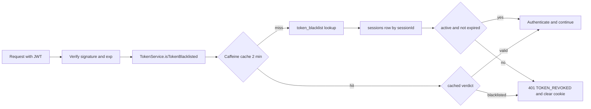

# Admin — Sessions and User Audit Logs API

> **Audience:** Staff (back-office) · **Base path:** `/api/auth/sessions` and `/api/admin/users/audit-logs` · **Source:** `src/main/java/ak/dev/khi_archive_platform/user/api/SessionAPI.java`, `src/main/java/ak/dev/khi_archive_platform/user/api/UserAuditLogAPI.java`

Two read/revoke surfaces that sit behind the back-office "security" screens. `SessionAPI` lets a
signed-in user see the devices their account is logged in from and kill any of them — one of the
two mechanisms (alongside token blacklisting on logout) that make a still-unexpired, stateless JWT
stop working. `UserAuditLogAPI` is the read side of the `user_audit_logs` table: who did what to
which user account, from which session, at which second.

## Access

| Requirement | Value |
|---|---|
| Authentication | Required for every endpoint on this page — JWT in the `khi_auth_token` HttpOnly cookie, or `Authorization: Bearer <jwt>` |
| `SessionAPI` class-level `@PreAuthorize` | **None.** `SessionAPI` carries no `@PreAuthorize` at all, on the class or on any method. The only gate is `SecurityConfig`'s `.requestMatchers("/api/**").authenticated()`; ownership is enforced inside the controller by comparing `session.getUser().getUserId()` to the principal's `userId` |
| `UserAuditLogAPI` class-level `@PreAuthorize` | **Yes** — `@PreAuthorize("hasRole('ADMIN')")` is declared on the class `UserAuditLogAPI`. Every one of its four methods *also* declares `@PreAuthorize("hasAuthority('user:read')")`; both strings are repeated per endpoint below |
| Authority — sessions | Any authenticated principal. No permission string is checked |
| Authority — audit logs | `ROLE_ADMIN` (class) + `user:read` (method) |
| Roles that hold `user:read` by default | **ADMIN** only — `Role.ADMIN` is `EnumSet.allOf(Permission.class)`, which includes `USER_READ("user:read")`. It is absent from both `EMPLOYEE_DEFAULT_PERMISSIONS` and `TEACHER_DEFAULT_PERMISSIONS` |
| Roles that do **not** | GUEST, EMPLOYEE, TEACHER — unless an admin grants `user:read` individually through `POST /api/admin/users/{userId}/permissions` (the `Permission.USER_READ` javadoc calls this out as a supported delegation: "user-listing without full ADMIN power") |

Caution on the two stacked annotations: Spring Security resolves the *most specific*
`@PreAuthorize` for a handler, so on `UserAuditLogAPI` the method-level
`hasAuthority('user:read')` is the expression actually evaluated — the class-level
`hasRole('ADMIN')` is not additionally AND-ed in. The class javadoc states the intent as
"gated on `ROLE_ADMIN` + `user:read`"; in practice `user:read` is the effective gate, which
matters only for a non-ADMIN who has been granted `user:read` explicitly.

## Endpoints

| Method | Path | Authority | Purpose |
|---|---|---|---|
| `GET` | `/api/auth/sessions/getAllSessions` | authenticated (no `@PreAuthorize`) | List the caller's own active sessions |
| `DELETE` | `/api/auth/sessions/{sessionId}` | authenticated (no `@PreAuthorize`) | Revoke one session, owned by the caller |
| `DELETE` | `/api/auth/sessions/revokeAll` | authenticated (no `@PreAuthorize`) | Revoke every active session of the caller |
| `GET` | `/api/admin/users/audit-logs` | `hasRole('ADMIN')` (class) + `hasAuthority('user:read')` | Paged, filtered user-audit-log search |
| `GET` | `/api/admin/users/audit-logs/{id}` | `hasRole('ADMIN')` (class) + `hasAuthority('user:read')` | One audit row by primary key |
| `GET` | `/api/admin/users/audit-logs/actions` | `hasRole('ADMIN')` (class) + `hasAuthority('user:read')` | Catalog of `UserAuditAction` names |
| `GET` | `/api/admin/users/audit-logs/actors` | `hasRole('ADMIN')` (class) + `hasAuthority('user:read')` | Distinct admin usernames seen as actors |

---

## Sessions — `/api/auth/sessions`

### How a stateless JWT is actually revoked

The token itself is never mutated — it is signed, self-contained, and remains
cryptographically valid until its `exp` claim passes (`jwt.expiration-ms`, default
`259200000` ms = 3 days). Revocation works because **every** token carries a `sessionId`
claim, and the authentication filter re-checks that session on each request.

`JwtTokenProvider.generateToken` writes a `sessions` row (`sessionId` = random UUID,
`deviceInfo` = `User-Agent` header, `ipAddress` = `request.getRemoteAddr()`, `loginTimestamp`,
`expiresAt`, `isActive = true`) and stamps the same UUID into the JWT as the `sessionId` claim.

On every subsequent request `JWTAuthenticationFilter` verifies the signature, then calls
`TokenService.isTokenBlacklisted(token)`. `TokenService.checkBlacklistedInDb` returns `true` —
meaning "reject" — in **any** of these cases:

| Condition | Source |
|---|---|
| A `token_blacklist` row exists for this exact token string | `TokenBlacklistRepository.findByToken` |
| The token has no `sessionId` claim (or it is blank) | `JwtTokenProvider.getSessionIdFromToken` |
| No `sessions` row matches that `sessionId` (row deleted) | `SessionRepository.findBySessionId` |
| The `sessions` row has `is_active = false` | `Session.getIsActive()` |
| The `sessions` row has `expires_at` null or already in the past | `Session.getExpiresAt()` |

So the two tables play different roles: `token_blacklist` kills **one specific token string**
(that is what `POST /api/auth/logout` does), while flipping `sessions.is_active` to `false` kills
**every token minted for that session** without needing to know the token string. The endpoints on
this page use the second mechanism only — `SessionAPI` never writes to `token_blacklist`.



### What the client sees after revocation

1. The revoke call itself returns `200 OK` with a plain-text body. It does **not** clear the
   browser cookie — `SessionAPI` never calls `JwtCookieService.clearAuthCookie`.
2. On the **next** request that presents a token belonging to a revoked session, the filter
   short-circuits before the controller and responds:
   - `401 Unauthorized`
   - `Set-Cookie: khi_auth_token=; Max-Age=0` (the cookie is cleared then, not before)
   - body = the standard error envelope with `"error": "TOKEN_REVOKED"`,
     `"category": "AUTHENTICATION"`, `"message": "Your session has been invalidated."`,
     `"hint": "Sign in again to continue."`, `"details": { "reason": "revoked" }`
3. **Propagation delay:** `TokenService` keeps a Caffeine cache keyed by the raw token string
   (`maximumSize 10 000`, `expireAfterWrite 2 minutes`). A token seen as valid within the last
   two minutes is served from that cache without touching the DB, so a session revoked through
   `SessionAPI` can keep working for up to two minutes. `POST /api/auth/logout` and
   `POST /api/auth/logout-all` do not have this lag — `TokenService.blacklistToken` writes
   `true` into the cache immediately for the token it is given. Note that `logout-all` only
   pre-poisons the cache for the *caller's current* token; other devices' tokens still ride out
   the two-minute window.
4. Revoking is not reversible from the API: nothing in the codebase sets `sessions.is_active`
   back to `true`. A revoked device must sign in again, which mints a fresh `sessions` row.

Related revocation paths outside this controller, for orientation:
`POST /api/auth/logout` (blacklist current token + deactivate its session),
`POST /api/auth/logout-all` (deactivate every session of the caller + blacklist current token),
and `POST /api/admin/users/{userId}/force-logout` (an admin deactivates every session of
another user; `AdminUserService.forceLogoutAll` refuses to act on the admin's own account).

---

### `GET /api/auth/sessions/getAllSessions`

Lists the calling user's currently-active sessions — one row per device/login.

**Authority:** none declared. `SessionAPI` has no `@PreAuthorize`; authentication alone is
required, via `SecurityConfig`'s `.requestMatchers("/api/**").authenticated()`.

**Query parameters** — none. The result is not paged and not sorted by the query
(`SessionRepository.findByUserAndIsActive(user, true)` returns whatever order the DB yields).

**Response** `200 OK` — a bare JSON array of `SessionDTO`, **not** a `Page` envelope.

```json
[
  {
    "sessionId": "0a1a3f6e-9d2b-4c77-b8ad-1f0c2d5b7e41",
    "deviceInfo": "Mozilla/5.0 (Macintosh; Intel Mac OS X 10_15_7) AppleWebKit/537.36",
    "ipAddress": "10.0.4.71",
    "loginTimestamp": "2026-08-24T06:11:02.417Z",
    "expiresAt": "2026-08-27T06:11:02.417Z",
    "isActive": true
  },
  {
    "sessionId": "7b6f0c11-4e5a-42d0-9c3e-88b2a0e6d914",
    "deviceInfo": "KHI-Archive-Android/2.4.1",
    "ipAddress": "37.238.11.204",
    "loginTimestamp": "2026-08-26T05:02:55.883Z",
    "expiresAt": "2026-08-29T05:02:55.883Z",
    "isActive": true
  }
]
```

`SessionDTO` fields, all copied 1:1 from the `Session` entity by
`SessionAPI.convertToDTO`: `sessionId`, `deviceInfo`, `ipAddress`, `loginTimestamp`,
`expiresAt`, `isActive`, `logoutTimestamp`. Because
`spring.jackson.default-property-inclusion=non_null` is set, `logoutTimestamp` is omitted for
rows that were never logged out — which is every row this endpoint returns, since it filters on
`isActive = true`. `deviceInfo` and `ipAddress` are also omitted when the login request carried
no `User-Agent` / no resolvable remote address.

**Errors**

| Status | `error` code | When |
|---|---|---|
| `401` | `TOKEN_MISSING` | No cookie and no `Authorization` header — produced by `JwtAuthenticationEntryPoint` |
| `401` | `TOKEN_EXPIRED` | JWT past its `exp`; filter clears the auth cookie |
| `401` | `TOKEN_REVOKED` | This session (or the token) was revoked/blacklisted; `details.reason = "revoked"` |
| `401` | `TOKEN_MALFORMED` | Cookie/header content is not a decodable JWT |
| `401` | `TOKEN_INVALID_SIGNATURE` | Wrong signing key or unexpected algorithm |
| `401` | `TOKEN_INVALID` | Any other auth0 verification failure (bad claim, issuer/audience mismatch) |
| `401` | — (plain text `Not authenticated`) | Controller's own `user == null` branch. Unreachable in the shipped `SecurityConfig`, which rejects unauthenticated `/api/**` at the filter chain first |
| `500` | `DATABASE_ERROR` | `DataAccessException` while reading `sessions` — `GlobalExceptionHandler` |
| `500` | `INTERNAL_SERVER_ERROR` | Catch-all `Exception` handler |

**Example**

```bash
curl -s "{{BASE_URL}}/api/auth/sessions/getAllSessions" \
  -H "Cookie: khi_auth_token=$TOKEN"
```

**Notes** — not cached (`CacheConfig` declares no cache for sessions), not audited (no
`UserAuditService.record` call anywhere in `SessionAPI`).

---

### `DELETE /api/auth/sessions/{sessionId}`

Revokes one session belonging to the caller: sets `is_active = false` and stamps
`logout_timestamp = now()`.

**Authority:** none declared (authentication only) — plus an in-controller ownership check.

**Path parameters**

| Name | Type | Description |
|---|---|---|
| `sessionId` | string | The session's UUID — the `sessionId` field returned by `getAllSessions`, and the `sessionId` claim inside the JWT. **Not** the numeric `sessions.id` primary key |

**Request body** — none.

**Response** `200 OK` — a bare string body, not JSON. The handler returns
`ResponseEntity.ok("…")` from a `ResponseEntity<?>` method with no `produces` attribute, so the
response media type is not pinned in source — it falls out of content negotiation:

```text
Session revoked successfully
```

**Errors**

| Status | `error` code | When |
|---|---|---|
| `401` | `TOKEN_MISSING` / `TOKEN_EXPIRED` / `TOKEN_REVOKED` / `TOKEN_MALFORMED` / `TOKEN_INVALID_SIGNATURE` / `TOKEN_INVALID` | Same filter/entry-point set as the list endpoint |
| `403` | — (plain text `You can only revoke your own sessions`) | The session exists but `session.getUser().getUserId()` differs from the caller's `userId`. Returned directly by the controller, so there is **no** error envelope and no `ACCESS_DENIED` code. Admins do not get an exemption here — use `POST /api/admin/users/{userId}/force-logout` instead |
| `404` | — (plain text `Session not found`) | No `sessions` row with that `sessionId`. Also plain text, no envelope |
| `401` | — (plain text `Not authenticated`) | Controller's `user == null` branch; see the note on the list endpoint |
| `500` | `DATABASE_ERROR` | `DataAccessException` on the read or the save |
| `500` | `INTERNAL_SERVER_ERROR` | Catch-all `Exception` handler |

**Example**

```bash
curl -s -X DELETE \
  "{{BASE_URL}}/api/auth/sessions/0a1a3f6e-9d2b-4c77-b8ad-1f0c2d5b7e41" \
  -H "Cookie: khi_auth_token=$TOKEN"
```

**Notes**

- Already-inactive sessions are accepted and re-saved — the controller does not check
  `isActive` first, so `logoutTimestamp` is overwritten with the new time on a repeat call.
- Nothing stops you revoking the session you are currently using; the next request from this
  browser gets `401 TOKEN_REVOKED` (subject to the two-minute cache window described above).
- No audit row is written.

---

### `DELETE /api/auth/sessions/revokeAll`

Revokes every currently-active session of the caller in one call — same field writes as the
single-session endpoint, applied to `findByUserAndIsActive(user, true)`.

**Authority:** none declared (authentication only).

**Query parameters** — none. **Request body** — none.

**Response** `200 OK` — a bare string body, same negotiated-media-type caveat as the
single-session endpoint:

```text
All sessions revoked successfully
```

**Errors**

| Status | `error` code | When |
|---|---|---|
| `401` | `TOKEN_MISSING` / `TOKEN_EXPIRED` / `TOKEN_REVOKED` / `TOKEN_MALFORMED` / `TOKEN_INVALID_SIGNATURE` / `TOKEN_INVALID` | Same filter/entry-point set as the other session endpoints |
| `401` | — (plain text `Not authenticated`) | Controller's `user == null` branch |
| `500` | `DATABASE_ERROR` | `DataAccessException` during `saveAll` |
| `500` | `INTERNAL_SERVER_ERROR` | Catch-all `Exception` handler |

**Example**

```bash
curl -s -X DELETE "{{BASE_URL}}/api/auth/sessions/revokeAll" \
  -H "Cookie: khi_auth_token=$TOKEN"
```

**Notes**

- Path-mapping order: `/revokeAll` is a literal segment and wins over the `{sessionId}` template,
  so a session whose UUID were literally `revokeAll` could not be targeted by the single-session
  endpoint. UUIDs make that hypothetical.
- Returns `200` with the same message when the caller has no active sessions — `saveAll` on an
  empty list is a no-op.
- Differs from `POST /api/auth/logout-all` (in `UserAPI`) in three ways: `logout-all` also
  blacklists the caller's current token, clears the auth cookie on the response, and selects
  `findByUser` (all rows) rather than `findByUserAndIsActive`. `revokeAll` does none of those —
  it only flips `is_active`.
- No audit row is written.

---

## User audit logs — `/api/admin/users/audit-logs`

One `user_audit_logs` row is written per admin user-management action by
`UserAuditService.record(...)`, which runs with `Propagation.REQUIRES_NEW` so the audit row
commits even when the surrounding business transaction rolls back. Reads on this page are
deliberately **not** audited — the controller javadoc states that auditing them would generate a
row on every page refresh and drown out the real CREATE/UPDATE/DELETE signal.

### The `UserAuditLog` field list

Every field below is mapped 1:1 into `UserAuditLogDTO` by `UserAuditLogService.toDto`, so this
list is also the response shape. Null fields are omitted from JSON
(`spring.jackson.default-property-inclusion=non_null`).

| JSON field | Type | Column | Meaning |
|---|---|---|---|
| `id` | number | `id` | Primary key, `GenerationType.IDENTITY` |
| `logId` | number | — | JSON-only alias for `id`, emitted by the `@JsonProperty("logId")` getter on the DTO. Always present alongside `id` |
| `action` | string enum | `action` (`VARCHAR(32)`, not null) | One of the `UserAuditAction` values in the table below |
| `targetUserId` | number | `target_user_id` | The user acted upon. Null when the target could not be resolved (e.g. a warning whose recipient was since deleted) |
| `targetUsername` | string | `target_username` | Username at the time of the action |
| `targetDisplayName` | string | `target_display_name` | `User.name` at the time of the action |
| `targetEmail` | string | `target_email` | Email at the time of the action |
| `previousRole` | string | `previous_role` (`VARCHAR(30)`) | Role before the change. Set by `ROLE_CHANGE`, by `UPDATE` when the update changed the role, and by `DELETE` (role at deletion) |
| `newRole` | string | `new_role` (`VARCHAR(30)`) | Role after the change. Also set by `CREATE` to the role the account was created with |
| `permissionsChanged` | string | `permissions_changed` (`TEXT`) | Comma-joined permission strings affected — the granted set, the revoked set, the seeded set on `CREATE`, or the full `extraPermissions` on `DELETE`. Null when the collection was null or empty |
| `actorUserId` | number | `actor_user_id` | The acting admin's id, when the principal resolved to a `User` |
| `actorUsername` | string | `actor_username` | Actor username; falls back to `Authentication.getName()`, then to the literal `anonymous` |
| `actorDisplayName` | string | `actor_display_name` | Actor `User.name`, with the same fallbacks |
| `actorAuthorities` | string | `actor_authorities` (`TEXT`) | Comma-joined authorities held by the actor at the moment of the action, **including** `ROLE_*` entries |
| `actorPermissions` | string | `actor_permissions` (`TEXT`) | Same list with every `ROLE_`-prefixed entry dropped |
| `deviceInfo` | string | `device_info` | From the resolved `sessions` row; falls back to the request's `User-Agent` header |
| `ipAddress` | string | `ip_address` | From the resolved `sessions` row; falls back to `request.getRemoteAddr()` |
| `sessionId` | string | `session_id` | UUID of the actor's session, resolved from the `sessionId` claim of the presented token. Null when no token could be resolved |
| `sessionLoginTimestamp` | ISO-8601 | `session_login_timestamp` | `sessions.login_timestamp` of the actor's session |
| `sessionExpiresAt` | ISO-8601 | `session_expires_at` | `sessions.expires_at` of the actor's session |
| `sessionActive` | boolean | `session_is_active` | `sessions.is_active` **as it was when the row was written** — a later revocation does not rewrite history |
| `requestMethod` | string | `request_method` | `request.getMethod()` |
| `requestPath` | string | `request_path` | `request.getRequestURI()` |
| `details` | string | `details` (`TEXT`) | Human-readable summary composed by the calling service, passed through `HtmlUtils.htmlEscape` — expect `&#39;` where the service wrote `'` |
| `occurredAt` | ISO-8601 | `occurred_at` (not null) | `Instant.now()` at record time. Primary sort key |

The password column was never recorded; the DTO javadoc states everything here is safe to expose
to an authenticated admin client.

### `UserAuditAction` values and what triggers each

Copied from `user/enums/UserAuditAction.java`; the trigger column is traced from every
`auditService.record(...)` call site in the codebase.

| Action | Written by | Trigger |
|---|---|---|
| `CREATE` | `AdminUserService.createUserAsAdmin` | `POST /api/admin/users`. `newRole` = the created role, `permissionsChanged` = the seeded default set (when non-empty); `details` carries username, id, name, email, role, activated flag and `seededPermissions` |
| `UPDATE` | `AdminUserService.updateUserAsAdmin` | `PUT /api/admin/users/{userId}` — arbitrary field edit. `details` is a `field=old -> new` diff; `previousRole`/`newRole` are filled only when the role actually changed. Skipped entirely when the diff is empty |
| `UPDATE` | `AdminUserService.lock` | `POST /api/admin/users/{userId}/lock`. `details` records `isLocked: false -> true` and the `lockTime` |
| `UPDATE` | `AdminUserService.unlock` | `POST /api/admin/users/{userId}/unlock`. Records the previous lock state and that the failed-attempt counter was cleared |
| `UPDATE` | `AdminUserService.resetFailedAttempts` | `POST /api/admin/users/{userId}/reset-failed-attempts`. `details` = `Reset failed-login counter (was=N)`. No-op (no row) when the counter is already 0 |
| `UPDATE` | `AdminUserService.forceLogoutAll` | `POST /api/admin/users/{userId}/force-logout`. `details` = `Force-logout: revoked N active session(s)` |
| `UPDATE` | `UserWarningService.update` | `PUT /api/admin/warnings/{warningId}` — admin edits a live warning. `details` is a per-field diff; the message body itself is recorded only as `message=(updated)` |
| `DELETE` | `AdminUserService.deleteUser` | `DELETE /api/admin/users/{userId}` — hard delete. Row is written **before** the delete and carries `previousRole` plus the user's full `extraPermissions`. Blocked for self-delete and for the last remaining ADMIN |
| `ROLE_CHANGE` | `AdminUserService.changeRole` | `PUT /api/admin/users/{userId}/role`. `previousRole` and `newRole` both set; no row when the role is unchanged, and self-demotion is refused before the write |
| `ROLE_CHANGE` | `AdminUserService.grantPermissions` | Second row emitted when granting a permission auto-promotes a GUEST to EMPLOYEE — `details` = `Auto-promoted from GUEST to EMPLOYEE on permission grant` |
| `GRANT_PERMISSIONS` | `AdminUserService.grantPermissions` | `POST /api/admin/users/{userId}/permissions`. `permissionsChanged` = the newly added set only |
| `REVOKE_PERMISSIONS` | `AdminUserService.revokePermissions` | `DELETE /api/admin/users/{userId}/permissions`. `permissionsChanged` = the removed set |
| `ACTIVATE` | `AdminUserService.setActivated(…, true)` | `POST /api/admin/users/{userId}/activate`. No row when the account was already activated |
| `DEACTIVATE` | `AdminUserService.setActivated(…, false)` | `POST /api/admin/users/{userId}/deactivate`. Self-deactivation is refused before the write |
| `READ` | `AdminUserService.getById` | `GET /api/admin/users/{userId}` — opening one user's record. `details` = `Read user record`. This is the one read that *is* audited |
| `LIST` | — | **Never written.** The value exists in the enum (and therefore in the `/actions` catalog and the `user_audit_logs_action_check` constraint), but no call site records it: `AdminUserService.listAll` carries an explicit comment that listing is intentionally not audited because it fires on every page load |
| `WARNING_SENT` | `UserWarningService.send` | `POST /api/admin/warnings`. `details` = warning id, severity and title |
| `WARNING_REVOKED` | `UserWarningService.revoke` | `DELETE /api/admin/warnings/{warningId}` — soft-delete. Idempotent: re-revoking an already-revoked warning writes nothing |
| `WARNING_ACKNOWLEDGED` | `UserWarningService.acknowledge` | `POST /api/warnings/{warningId}/acknowledge` — written by the **recipient**, not an admin. Here `target` is the acknowledging user themselves, so `targetUserId` and `actorUserId` are the same person |

The enum is kept in sync with the PostgreSQL CHECK constraint at boot by
`UserAuditActionConstraintInitializer`, which drops and re-adds
`user_audit_logs_action_check` from `UserAuditAction.values()` on `ApplicationReadyEvent` —
necessary because `ddl-auto=update` never refreshes a Hibernate-generated CHECK.

---

### `GET /api/admin/users/audit-logs`

Paged search over `user_audit_logs`. All supplied filters are AND-ed together.

**Authority:** `hasRole('ADMIN')` (declared on the class `UserAuditLogAPI`) +
`hasAuthority('user:read')` (declared on the method).

**Query parameters**

There is no `@ModelAttribute` filter-params class on this endpoint — each parameter is bound as
an individual `@RequestParam(required = false)` and then copied into the service-level record
`UserAuditLogService.Filter(targetUserId, targetUsername, actor, action, from, to, q)`. The
table below is the complete set of ten parameters the method declares.

| Name | Type | Default | Description |
|---|---|---|---|
| `targetUserId` | long | — | Exact match on `target_user_id` |
| `targetUsername` | string | — | Exact match on `target_username`, case-insensitive (both sides lower-cased, input trimmed). Blank is treated as absent. Not a substring match — use `q` for that |
| `actor` | string | — | Exact match on `actor_username`, case-insensitive, trimmed. Blank is treated as absent |
| `action` | string | — | One `UserAuditAction` name. Trimmed and upper-cased before `valueOf`, so `warning_sent` works. An unrecognized value is a `400`, not an empty page |
| `from` | ISO-8601 date-time | — | Inclusive lower bound on `occurred_at` (`>=`). Bound with `@DateTimeFormat(iso = ISO.DATE_TIME)` into an `Instant`, e.g. `2026-08-01T00:00:00Z` |
| `to` | ISO-8601 date-time | — | Inclusive upper bound on `occurred_at` (`<=`), same binding |
| `q` | string | — | Free-text, case-insensitive `%substring%` OR-ed across five columns: `details`, `target_username`, `actor_username`, `target_email`, `permissions_changed`. Trimmed; blank is treated as absent. Rows with NULL in a column simply don't match on that column |
| `page` | int | `0` | Zero-based page index. `null` or negative is coerced to `0` |
| `size` | int | `50` | Page size. `null` or `<= 0` falls back to `50`; anything above `200` is clamped to `200` (`MAX_PAGE_SIZE`) |
| `sort` | string | `desc` | Direction only — the sort *field* is fixed. Trimmed and lower-cased, then: ends with `asc` → ascending, ends with `desc` → descending, anything else → `400`. Because the check is a suffix test, `occurredAt,desc` is accepted and means the same as `desc` |

Ordering is always `occurred_at` then `id`, both in the chosen direction — the tie-break on `id`
keeps rows written in the same millisecond stable across pages.

**Response** `200 OK` — the standard Spring `Page` envelope; see
[`../01-conventions.md`](../01-conventions.md) for the envelope fields. Each `content[]` element
is a `UserAuditLogDTO` with the fields documented above.

```json
{
  "content": [
    {
      "id": 4821,
      "action": "GRANT_PERMISSIONS",
      "targetUserId": 37,
      "targetUsername": "dara.k",
      "targetDisplayName": "Dara Kamaran",
      "targetEmail": "dara.k@example.org",
      "permissionsChanged": "physical_media:import,physical_media:update",
      "actorUserId": 1,
      "actorUsername": "akar",
      "actorDisplayName": "Akar Arkan",
      "actorAuthorities": "ROLE_ADMIN,user:read,user:update",
      "actorPermissions": "user:read,user:update",
      "deviceInfo": "Mozilla/5.0 (Macintosh; Intel Mac OS X 10_15_7) AppleWebKit/537.36",
      "ipAddress": "10.0.4.71",
      "sessionId": "0a1a3f6e-9d2b-4c77-b8ad-1f0c2d5b7e41",
      "sessionLoginTimestamp": "2026-08-24T06:11:02.417Z",
      "sessionExpiresAt": "2026-08-27T06:11:02.417Z",
      "sessionActive": true,
      "requestMethod": "POST",
      "requestPath": "/api/admin/users/37/permissions",
      "details": "Granted permissions: [physical_media:import, physical_media:update]",
      "occurredAt": "2026-08-25T11:47:03.902Z",
      "logId": 4821
    }
  ],
  "pageable": { "pageNumber": 0, "pageSize": 50 },
  "totalElements": 1,
  "totalPages": 1,
  "number": 0,
  "size": 50,
  "first": true,
  "last": true,
  "numberOfElements": 1,
  "empty": false
}
```

`previousRole` and `newRole` are absent from this example because the row is a permission grant,
not a role change — non-null omission, not an error.

**Errors**

| Status | `error` code | When |
|---|---|---|
| `400` | `BAD_REQUEST` | `action` is not a `UserAuditAction` name — message names the value and points at `/audit-logs/actions`. Also raised when `sort` is neither `…asc` nor `…desc`. Both surface as `IllegalArgumentException` |
| `400` | `TYPE_MISMATCH` | `targetUserId`, `page` or `size` is not a number, or `from`/`to` is not an ISO-8601 date-time |
| `401` | `TOKEN_MISSING` / `TOKEN_EXPIRED` / `TOKEN_REVOKED` / `TOKEN_MALFORMED` / `TOKEN_INVALID_SIGNATURE` / `TOKEN_INVALID` | Filter and entry-point token failures, as on the session endpoints |
| `403` | `ACCESS_DENIED` | Caller lacks `user:read`. `details.requiredAuthority` is extracted from the `@PreAuthorize` expression, alongside `actor` and `actorAuthorities` |
| `405` | `METHOD_NOT_ALLOWED` | `POST` or `PATCH` on this path — no handler accepts them. `PUT` and `DELETE` do **not** land here: they match `/api/admin/users/{userId}` in `AdminUserAPI` with `userId = "audit-logs"` and fail with `TYPE_MISMATCH` instead |
| `500` | `DATABASE_ERROR` | `DataAccessException` executing the specification query |
| `500` | `INTERNAL_SERVER_ERROR` | Catch-all `Exception` handler |

**Example**

```bash
curl -s -G "{{BASE_URL}}/api/admin/users/audit-logs" \
  --data-urlencode "action=ROLE_CHANGE" \
  --data-urlencode "actor=akar" \
  --data-urlencode "from=2026-08-01T00:00:00Z" \
  --data-urlencode "to=2026-08-31T23:59:59Z" \
  --data-urlencode "size=100" \
  --data-urlencode "sort=desc" \
  -H "Cookie: khi_auth_token=$TOKEN"
```

**Notes**

- Not cached — `CacheConfig` declares no cache name for audit logs, so every call hits Postgres.
- Indexed by `AuditLogIndexInitializer`, which ensures three indexes on `user_audit_logs` at
  boot: `(actor_username, occurred_at DESC)`, `(occurred_at DESC)` and
  `(action, occurred_at DESC)`. Filtering by `actor` or `action` with a date window is the fast
  path; `q` is a `LIKE '%…%'` over five columns and cannot use them.
- `AdminUserAPI` exposes a per-user convenience variant at
  `GET /api/admin/users/{userId}/audit-logs` with the same filter shape minus `targetUserId`
  (taken from the path) and minus `targetUsername`. It is documented with the rest of the
  admin user API in [`./users-and-permissions.md`](./users-and-permissions.md).

---

### `GET /api/admin/users/audit-logs/{id}`

Fetches a single audit row by primary key.

**Authority:** `hasRole('ADMIN')` (class) + `hasAuthority('user:read')` (method).

**Path parameters**

| Name | Type | Description |
|---|---|---|
| `id` | long | `user_audit_logs.id`. The DTO's `logId` alias carries the same value |

**Response** `200 OK` — one `UserAuditLogDTO`, identical in shape to a `content[]` element above.

```json
{
  "id": 4822,
  "action": "ROLE_CHANGE",
  "targetUserId": 37,
  "targetUsername": "dara.k",
  "targetDisplayName": "Dara Kamaran",
  "targetEmail": "dara.k@example.org",
  "previousRole": "EMPLOYEE",
  "newRole": "TEACHER",
  "actorUserId": 1,
  "actorUsername": "akar",
  "actorDisplayName": "Akar Arkan",
  "actorAuthorities": "ROLE_ADMIN,user:read,user:update",
  "actorPermissions": "user:read,user:update",
  "deviceInfo": "Mozilla/5.0 (Macintosh; Intel Mac OS X 10_15_7) AppleWebKit/537.36",
  "ipAddress": "10.0.4.71",
  "sessionId": "0a1a3f6e-9d2b-4c77-b8ad-1f0c2d5b7e41",
  "sessionLoginTimestamp": "2026-08-24T06:11:02.417Z",
  "sessionExpiresAt": "2026-08-27T06:11:02.417Z",
  "sessionActive": true,
  "requestMethod": "PUT",
  "requestPath": "/api/admin/users/37/role",
  "details": "Role changed from EMPLOYEE to TEACHER",
  "occurredAt": "2026-08-25T12:03:19.118Z",
  "logId": 4822
}
```

**Errors**

| Status | `error` code | When |
|---|---|---|
| `400` | `TYPE_MISMATCH` | `{id}` is not a number |
| `401` | `TOKEN_MISSING` / `TOKEN_EXPIRED` / `TOKEN_REVOKED` / `TOKEN_MALFORMED` / `TOKEN_INVALID_SIGNATURE` / `TOKEN_INVALID` | Token failures |
| `403` | `ACCESS_DENIED` | Caller lacks `user:read` |
| `404` | `USER_NOT_FOUND` | No row with that id. `UserAuditLogService.getById` throws `UserNotFoundException("Audit log not found: id=…")`, and `GlobalExceptionHandler` maps that exception type to `USER_NOT_FOUND` — so the `error` code says *user* while the `message` says *audit log*. Switch on `message`/`path`, not on the code, if you need to distinguish |
| `500` | `DATABASE_ERROR` | `DataAccessException` |
| `500` | `INTERNAL_SERVER_ERROR` | Catch-all `Exception` handler |

**Example**

```bash
curl -s "{{BASE_URL}}/api/admin/users/audit-logs/4822" \
  -H "Cookie: khi_auth_token=$TOKEN"
```

---

### `GET /api/admin/users/audit-logs/actions`

Catalog of recognized action names — drives the action-filter dropdown in the UI.

**Authority:** `hasRole('ADMIN')` (class) + `hasAuthority('user:read')` (method).

**Query parameters** — none.

**Response** `200 OK` — a JSON array of strings, in `UserAuditAction` declaration order (not
alphabetical). Sourced from `UserAuditAction.values()`, so it includes `LIST`, which no code path
ever writes.

```json
[
  "CREATE",
  "UPDATE",
  "DELETE",
  "ROLE_CHANGE",
  "GRANT_PERMISSIONS",
  "REVOKE_PERMISSIONS",
  "ACTIVATE",
  "DEACTIVATE",
  "READ",
  "LIST",
  "WARNING_SENT",
  "WARNING_REVOKED",
  "WARNING_ACKNOWLEDGED"
]
```

**Errors**

| Status | `error` code | When |
|---|---|---|
| `401` | `TOKEN_MISSING` / `TOKEN_EXPIRED` / `TOKEN_REVOKED` / `TOKEN_MALFORMED` / `TOKEN_INVALID_SIGNATURE` / `TOKEN_INVALID` | Token failures |
| `403` | `ACCESS_DENIED` | Caller lacks `user:read` |
| `500` | `INTERNAL_SERVER_ERROR` | Catch-all `Exception` handler |

**Example**

```bash
curl -s "{{BASE_URL}}/api/admin/users/audit-logs/actions" \
  -H "Cookie: khi_auth_token=$TOKEN"
```

**Notes** — no database access; the list is computed from the enum on every call.

---

### `GET /api/admin/users/audit-logs/actors`

Distinct admin usernames that have ever appeared as an actor — drives the actor-filter dropdown.

**Authority:** `hasRole('ADMIN')` (class) + `hasAuthority('user:read')` (method).

**Query parameters** — none.

**Response** `200 OK` — a JSON array of strings, sorted ascending by the query
(`ORDER BY u.actorUsername`). NULL and empty usernames are excluded by the JPQL `WHERE` clause;
the literal `anonymous` fallback value can legitimately appear if an action was ever recorded
without a resolvable principal.

```json
["akar", "hevi.admin", "sara.admin"]
```

**Errors**

| Status | `error` code | When |
|---|---|---|
| `401` | `TOKEN_MISSING` / `TOKEN_EXPIRED` / `TOKEN_REVOKED` / `TOKEN_MALFORMED` / `TOKEN_INVALID_SIGNATURE` / `TOKEN_INVALID` | Token failures |
| `403` | `ACCESS_DENIED` | Caller lacks `user:read` |
| `500` | `DATABASE_ERROR` | `DataAccessException` running `findDistinctActorUsernames` |
| `500` | `INTERNAL_SERVER_ERROR` | Catch-all `Exception` handler |

**Example**

```bash
curl -s "{{BASE_URL}}/api/admin/users/audit-logs/actors" \
  -H "Cookie: khi_auth_token=$TOKEN"
```

**Notes** — uncached `SELECT DISTINCT` over the whole table; it grows with the number of admins,
not with the number of rows, but it is not index-backed. Call it on screen load, not per keystroke.

## Related

- [Internal API index](../README.md)
- [Conventions — page envelope, error envelope, timestamps](../01-conventions.md)
- [Admin user management API](./users-and-permissions.md) — every endpoint that writes the
  `CREATE`, `UPDATE`, `DELETE`, `ROLE_CHANGE`, `GRANT_PERMISSIONS`, `REVOKE_PERMISSIONS`,
  `ACTIVATE`, `DEACTIVATE` and `READ` rows read back here, plus
  `POST /api/admin/users/{userId}/force-logout` and the per-user
  `GET /api/admin/users/{userId}/audit-logs` variant
- [User warnings API](./warnings.md) — the source of the `WARNING_SENT`, `WARNING_REVOKED` and
  `WARNING_ACKNOWLEDGED` rows
