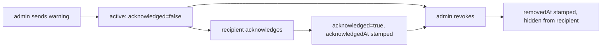

# Admin — User Warnings API

> **Audience:** Staff (back-office) · **Base path:** `/api/admin/warnings` and `/api/warnings` · **Source:** `src/main/java/ak/dev/khi_archive_platform/user/api/AdminUserWarningAPI.java`, `src/main/java/ak/dev/khi_archive_platform/user/api/UserWarningAPI.java`

A warning is a persistent in-app message an admin sends to one staff account. It is stored as a
row in `user_warnings` and stays in the recipient's list until they acknowledge it. The surface is
split in two: `/api/admin/warnings` issues, searches, edits and revokes warnings and is gated on
`warning:*` authorities, while `/api/warnings` is the recipient's own inbox — list, unread count,
acknowledge — and is gated on authentication alone, with no `warning:*` permission required.

Revoking is a soft delete: `removedAt` is stamped, the recipient stops seeing the row, and the
record survives for the audit trail. Every mutation on either side writes one row to
`user_audit_logs`.

## Access

| Requirement | Value |
|---|---|
| Authentication | Required on both controllers — JWT via `Authorization: Bearer <jwt>` (read first) or the `khi_auth_token` HttpOnly cookie (fallback) |
| Class-level `@PreAuthorize` — `AdminUserWarningAPI` | `hasRole('ADMIN')` |
| Class-level `@PreAuthorize` — `UserWarningAPI` | `isAuthenticated()` |
| Admin authorities | `warning:read`, `warning:create`, `warning:update`, `warning:delete` — declared per method |
| Recipient authorities | None. No `warning:*` authority is checked anywhere under `/api/warnings` |
| Roles that hold `warning:*` by default | ADMIN only — every `Permission` is attached to the ADMIN role itself |
| Roles that do **not** | GUEST, EMPLOYEE, TEACHER. Neither `EMPLOYEE_DEFAULT_PERMISSIONS` nor `TEACHER_DEFAULT_PERMISSIONS` contains any `warning:*` entry; an admin can still grant one individually through the per-user grants endpoint |

**How the two annotation levels combine.** `AdminUserWarningAPI` carries the class-level
`hasRole('ADMIN')`, and five of its six methods carry their own method-level `@PreAuthorize`.
Spring Security resolves `@PreAuthorize` most-specific-first: the method annotation is used when
one is present, and the class annotation applies only to methods that have none. In this class
that means `GET /api/admin/warnings/catalog/severities` is the single endpoint actually gated on
`hasRole('ADMIN')`; the other five are evaluated against their `warning:*` authority alone, which
is what makes granular delegation to a non-ADMIN account possible. The class javadoc describes the
two levels as additive — the runtime behavior is the precedence rule above.

`UserWarningAPI` has no method-level annotations at all, so its class-level `isAuthenticated()`
governs all three of its endpoints.

`Permission.WARNING_REMOVE` (`warning:remove`) exists in the permission catalog but is not
referenced by any endpoint in either controller.

## Severity levels

`WarningSeverity` (`user/enums/WarningSeverity.java`) is a closed set of three values. Severity is
stored as a string in `user_warnings.severity`, defaults to `WARNING` when a create request omits
it, and can be changed later through the update endpoint.

| Value | Meaning per source | Effect on the API |
|---|---|---|
| `INFO` | A heads-up. No action required from the user | None — sorting and filtering treat all three identically |
| `WARNING` | Work-quality concern. User is expected to read, acknowledge and improve | Default when `severity` is absent or null on create |
| `CRITICAL` | Repeated or severe issue. Logged and may be followed by an admin lock or deactivation | None at the API level; no automatic lock is performed by `UserWarningService` |

Severity drives UI styling and the order warnings are surfaced in, per the enum javadoc. The
server itself applies no severity-dependent behavior beyond the `WARNING` default: the recipient
list is ordered by acknowledgement state and age, not by severity.

## Acknowledgement lifecycle

A warning has two independent state bits: `acknowledged` (set by the recipient, never cleared) and
`removedAt` (set by an admin revoke, never cleared). A warning can be revoked before or after it
has been acknowledged.



- Only the warning's own target can acknowledge it; anyone else gets `409 WARNING_NOT_FOR_YOU`.
- Acknowledging is idempotent — a second call returns the current row and writes no audit entry.
- Revoking is idempotent — revoking an already-revoked warning returns `204` and writes no audit
  entry.
- An edit never resets `acknowledged` or clears `acknowledgedAt`. `UserWarningUpdateRequestDTO`'s
  javadoc mentions an "edited" badge, but no such field exists on the entity or on
  `UserWarningResponseDTO` — the API exposes no marker distinguishing an edited warning.
- A revoked warning cannot be acknowledged or edited: both look the row up with
  `findByIdAndRemovedAtIsNull` and raise `404 WARNING_NOT_FOUND`.

## Response shape

Every endpoint that returns a warning — admin search, admin get, create, update, and the
recipient's own list and acknowledge — returns the same `UserWarningResponseDTO`.

| Field | Type | Notes |
|---|---|---|
| `id` | long | Primary key of the `user_warnings` row |
| `targetUserId` | long | Recipient's `users_tbl.user_id`. Stored without a FK constraint |
| `targetUsername` | string | Snapshot of the recipient's username at send time, max 80 chars |
| `actorUserId` | long | Sending admin's user id. Null — and therefore omitted — when the authenticated principal is not a `User` instance |
| `actorUsername` | string | Sending admin's username; falls back to `Authentication.getName()` when the principal is not a `User` |
| `actorDisplayName` | string | Sending admin's display name; same fallback as `actorUsername` |
| `severity` | `INFO` / `WARNING` / `CRITICAL` | See "Severity levels" |
| `title` | string | Trimmed and HTML-escaped on write, max 200 chars |
| `message` | string | Trimmed and HTML-escaped on write, `TEXT` column, max 4000 chars enforced at the request DTO |
| `acknowledged` | boolean | Java primitive, so always present even when `false` |
| `acknowledgedAt` | instant | Set when the recipient acknowledges. Omitted while unacknowledged |
| `createdAt` | instant | Set at send time |
| `removedAt` | instant | Set on revoke. Omitted on active rows, and never present on `/api/warnings` responses, which filter revoked rows out |

`spring.jackson.default-property-inclusion=non_null` applies, so every null field above is omitted
from the JSON rather than serialized as `null`. `title` and `message` pass through
`HtmlUtils.htmlEscape`, so characters such as `<`, `>` and `&` come back as HTML entities.

`target_user_id` and `actor_user_id` are plain columns with no foreign key — the entity comment
states this is deliberate, "to keep deletes flexible". What happens to a warning whose target or
actor account is later deleted is _not documented in source_: no cleanup or cascade exists in
`UserWarningService`, and the username/display-name snapshots on the row are what the API keeps
returning.

## Endpoints

| Method | Path | Authority | Purpose |
|---|---|---|---|
| `GET` | `/api/admin/warnings` | `warning:read` | Paged search across every warning |
| `GET` | `/api/admin/warnings/{warningId}` | `warning:read` | One warning by id, revoked rows included |
| `POST` | `/api/admin/warnings` | `warning:create` | Issue a new warning |
| `PUT` | `/api/admin/warnings/{warningId}` | `warning:update` | Edit severity / title / message |
| `DELETE` | `/api/admin/warnings/{warningId}` | `warning:delete` | Revoke — soft delete |
| `GET` | `/api/admin/warnings/catalog/severities` | `hasRole('ADMIN')` (class-level; no method annotation) | Severity choices for the send form |
| `GET` | `/api/warnings/me` | `isAuthenticated()` | The caller's own active warnings, paged |
| `GET` | `/api/warnings/me/count` | `isAuthenticated()` | The caller's unacknowledged count |
| `POST` | `/api/warnings/{warningId}/acknowledge` | `isAuthenticated()` | Mark one of the caller's warnings as read |

Paging is identical on both sides and is clamped in `UserWarningService`: a null or negative `page`
becomes `0`, a null or non-positive `size` becomes `25`, and any `size` above `200` is capped at
`200`. No warning endpoint is cached — `CacheConfig` declares no warning cache, so every call hits
PostgreSQL.

---

## Admin endpoints — `/api/admin/warnings`

Class-level `@PreAuthorize("hasRole('ADMIN')")`; each endpoint below repeats the authority actually
evaluated for it.

### `GET /api/admin/warnings`

Paged search across all warnings, newest first.

**Authority:** `warning:read`

**Query parameters**

Every parameter is optional and is bound as an individual `@RequestParam` — there is no
`@ModelAttribute` filter class on this controller. Supplied filters are ANDed together into a JPA
`Specification`; a filter that is not supplied contributes no predicate at all.

| Name | Type | Default | Description |
|---|---|---|---|
| `targetUserId` | long | — | Exact match on the recipient's user id |
| `actorUserId` | long | — | Exact match on the sending admin's user id |
| `severity` | string | — | `INFO`, `WARNING` or `CRITICAL`. Trimmed and upper-cased before parsing, so `info` works. Blank is treated as absent. An unknown value is a `400` |
| `acknowledged` | boolean | — | `true` returns only acknowledged rows, `false` only unacknowledged. Absent returns both |
| `includeRevoked` | boolean | `false` | When `false`, `removedAt IS NULL` is added to the query. Pass `true` to see revoked rows as well |
| `from` | instant, ISO date-time | — | Inclusive lower bound on `createdAt`, e.g. `2026-08-01T00:00:00Z`. Bound with `@DateTimeFormat(iso = ISO.DATE_TIME)` |
| `to` | instant, ISO date-time | — | Inclusive upper bound on `createdAt` |
| `page` | integer | `0` | Zero-based page index. Negative values are clamped to `0` |
| `size` | integer | `25` | Page size. Values `<= 0` become `25`; values above `200` are capped at `200` |

**Response** `200 OK` — standard Spring `Page` envelope (see `../01-conventions.md`) whose
`content[]` elements are `UserWarningResponseDTO` objects as described in "Response shape". Sorted
by `createdAt` descending, then `id` descending.

```json
{
  "content": [
    {
      "id": 148,
      "targetUserId": 27,
      "targetUsername": "sara.k",
      "actorUserId": 1,
      "actorUsername": "akar",
      "actorDisplayName": "Akar Arkan",
      "severity": "WARNING",
      "title": "Missing project code on four audio records",
      "message": "AUD_0012 through AUD_0015 were saved without a project code.",
      "acknowledged": false,
      "createdAt": "2026-08-24T09:12:33.512Z"
    },
    {
      "id": 141,
      "targetUserId": 27,
      "targetUsername": "sara.k",
      "actorUserId": 1,
      "actorUsername": "akar",
      "actorDisplayName": "Akar Arkan",
      "severity": "INFO",
      "title": "Correction Suggestion: AUDIO [AUD_0009] — field: originalTitle",
      "message": "A guest suggested a correction on this record.",
      "acknowledged": true,
      "acknowledgedAt": "2026-08-20T07:41:19.004Z",
      "createdAt": "2026-08-19T13:05:00.220Z"
    }
  ],
  "pageable": { "pageNumber": 0, "pageSize": 25 },
  "totalElements": 2,
  "totalPages": 1,
  "number": 0,
  "size": 25,
  "first": true,
  "last": true,
  "numberOfElements": 2,
  "empty": false
}
```

**Errors**

| Status | `error` code | When |
|---|---|---|
| `400` | `BAD_REQUEST` | `severity` is not one of `INFO`, `WARNING`, `CRITICAL` — the message names the allowed values |
| `400` | `TYPE_MISMATCH` | `targetUserId` / `actorUserId` / `page` / `size` is not an integer, `acknowledged` / `includeRevoked` is not a boolean, or `from` / `to` is not an ISO date-time |
| `401` | `TOKEN_MISSING`, `TOKEN_EXPIRED`, `TOKEN_REVOKED`, `TOKEN_INVALID`, `TOKEN_MALFORMED`, `TOKEN_INVALID_SIGNATURE` | No token on the request — neither an `Authorization: Bearer` header nor the cookie — or the JWT is expired / revoked / unparseable |
| `403` | `ACCESS_DENIED` | Caller lacks `warning:read`; `details.requiredAuthority` is `warning:read` |
| `500` | `DATABASE_ERROR` | The search query failed |

**Example**

```bash
curl -s "{{BASE_URL}}/api/admin/warnings?targetUserId=27&acknowledged=false&size=25" \
  -H "Cookie: khi_auth_token=$TOKEN"
```

**Notes** — Read-only: no audit row is written for a search.

---

### `GET /api/admin/warnings/{warningId}`

One warning by id, for the audit trail.

**Authority:** `warning:read`

**Path parameters**

| Name | Type | Description |
|---|---|---|
| `warningId` | long | Primary key of the warning |

**Response** `200 OK` — a single `UserWarningResponseDTO`. Unlike the recipient endpoints, this
lookup uses a plain `findById`, so revoked rows are returned with their `removedAt` populated.

```json
{
  "id": 132,
  "targetUserId": 27,
  "targetUsername": "sara.k",
  "actorUserId": 1,
  "actorUsername": "akar",
  "actorDisplayName": "Akar Arkan",
  "severity": "CRITICAL",
  "title": "Third repeat of the same metadata error",
  "message": "Please review the metadata checklist before your next batch.",
  "acknowledged": true,
  "acknowledgedAt": "2026-08-11T10:22:48.310Z",
  "createdAt": "2026-08-10T08:00:12.001Z",
  "removedAt": "2026-08-14T06:30:00.900Z"
}
```

**Errors**

| Status | `error` code | When |
|---|---|---|
| `400` | `TYPE_MISMATCH` | `warningId` is not a number |
| `401` | `TOKEN_MISSING`, `TOKEN_EXPIRED`, `TOKEN_REVOKED`, `TOKEN_INVALID` | No token on the request — neither an `Authorization: Bearer` header nor the cookie — or the JWT is expired / revoked / unparseable |
| `403` | `ACCESS_DENIED` | Caller lacks `warning:read` |
| `404` | `WARNING_NOT_FOUND` | No row with that id |
| `500` | `DATABASE_ERROR` | Lookup failed |

**Example**

```bash
curl -s "{{BASE_URL}}/api/admin/warnings/132" \
  -H "Cookie: khi_auth_token=$TOKEN"
```

---

### `POST /api/admin/warnings`

Issue a new warning to one staff account.

**Authority:** `warning:create`

**Request body** — `UserWarningCreateRequestDTO`, `application/json`

| Field | Type | Required | Constraints |
|---|---|---|---|
| `targetUserId` | long | Yes | `@NotNull` — "targetUserId is required" |
| `severity` | `INFO` / `WARNING` / `CRITICAL` | No | Defaults to `WARNING` when null or absent |
| `title` | string | Yes | `@NotBlank`, `@Size(max = 200)` |
| `message` | string | Yes | `@NotBlank`, `@Size(max = 4000)` |

```json
{
  "targetUserId": 27,
  "severity": "WARNING",
  "title": "Missing project code on four audio records",
  "message": "AUD_0012 through AUD_0015 were saved without a project code."
}
```

**Response** `200 OK` — the saved `UserWarningResponseDTO`. Note `200`, not `201`; no `Location`
header is set.

```json
{
  "id": 148,
  "targetUserId": 27,
  "targetUsername": "sara.k",
  "actorUserId": 1,
  "actorUsername": "akar",
  "actorDisplayName": "Akar Arkan",
  "severity": "WARNING",
  "title": "Missing project code on four audio records",
  "message": "AUD_0012 through AUD_0015 were saved without a project code.",
  "acknowledged": false,
  "createdAt": "2026-08-24T09:12:33.512Z"
}
```

**Errors**

| Status | `error` code | When |
|---|---|---|
| `400` | `VALIDATION_ERROR` | `targetUserId` null, `title` or `message` blank, or either over its length cap — per-field reasons in `details` |
| `400` | `JSON_PARSE_ERROR` | Body is not valid JSON, or `severity` is not one of the three enum names |
| `401` | `TOKEN_MISSING`, `TOKEN_EXPIRED`, `TOKEN_REVOKED`, `TOKEN_INVALID` | No token on the request — neither an `Authorization: Bearer` header nor the cookie — or the JWT is expired / revoked / unparseable |
| `403` | `ACCESS_DENIED` | Caller lacks `warning:create` |
| `404` | `USER_NOT_FOUND` | No `users_tbl` row with `targetUserId` |
| `409` | `SELF_WARNING` | The resolved actor is the same account as the target — "You cannot send a warning to yourself." |
| `409` | `CONFLICT` | A database constraint blocked the insert |
| `415` | `UNSUPPORTED_MEDIA_TYPE` | Body sent with a content type other than `application/json` |
| `500` | `DATABASE_ERROR` | The insert failed |

`SELF_WARNING` is a literal code carried on `IllegalAdminOperationException`, not a constant in
`common/exceptions/ErrorCode.java`; it still arrives in the standard envelope's `error` field with
`category` `CONFLICT`.

**Example**

```bash
curl -s -X POST "{{BASE_URL}}/api/admin/warnings" \
  -H "Cookie: khi_auth_token=$TOKEN" \
  -H "Content-Type: application/json" \
  -d '{
        "targetUserId": 27,
        "severity": "WARNING",
        "title": "Missing project code on four audio records",
        "message": "AUD_0012 through AUD_0015 were saved without a project code."
      }'
```

**Notes**

- Target resolution checks only that the user id exists. The endpoint does not require the target
  to be an EMPLOYEE — any existing account except the caller's own is accepted.
- The actor snapshot (`actorUserId`, `actorUsername`, `actorDisplayName`) is copied from the
  authenticated principal. When the principal is not a `User`, `actorUserId` stays null and both
  name fields fall back to `Authentication.getName()`.
- `title` and `message` are trimmed and HTML-escaped before the row is saved.
- Audit: one `WARNING_SENT` row in `user_audit_logs` targeting the recipient, with `details` in the
  form `Sent warning id=<id> severity=<severity> title='<title>'`.
- `GuestCorrectionService.adminForward` reuses this same service method to send an `INFO` warning
  when an admin forwards a guest correction to the employee who created the record — those rows are
  indistinguishable from hand-written warnings apart from their title prefix.

---

### `PUT /api/admin/warnings/{warningId}`

Edit an existing, non-revoked warning.

**Authority:** `warning:update`

**Path parameters**

| Name | Type | Description |
|---|---|---|
| `warningId` | long | Primary key of the warning |

**Request body** — `UserWarningUpdateRequestDTO`, `application/json`. Every field is optional;
omitted fields keep their current value.

| Field | Type | Required | Constraints |
|---|---|---|---|
| `severity` | `INFO` / `WARNING` / `CRITICAL` | No | Applied only when non-null and different from the stored value |
| `title` | string | No | `@Size(max = 200)`. Applied only when non-null, non-blank and different from the stored value |
| `message` | string | No | `@Size(max = 4000)`. Same non-null / non-blank / changed rule |

```json
{
  "severity": "CRITICAL",
  "title": "Missing project code — third occurrence"
}
```

**Response** `200 OK` — the updated `UserWarningResponseDTO`.

```json
{
  "id": 148,
  "targetUserId": 27,
  "targetUsername": "sara.k",
  "actorUserId": 1,
  "actorUsername": "akar",
  "actorDisplayName": "Akar Arkan",
  "severity": "CRITICAL",
  "title": "Missing project code — third occurrence",
  "message": "AUD_0012 through AUD_0015 were saved without a project code.",
  "acknowledged": false,
  "createdAt": "2026-08-24T09:12:33.512Z"
}
```

**Errors**

| Status | `error` code | When |
|---|---|---|
| `400` | `VALIDATION_ERROR` | `title` over 200 chars or `message` over 4000 chars |
| `400` | `JSON_PARSE_ERROR` | Body is not valid JSON, or `severity` is not one of the three enum names |
| `400` | `TYPE_MISMATCH` | `warningId` is not a number |
| `401` | `TOKEN_MISSING`, `TOKEN_EXPIRED`, `TOKEN_REVOKED`, `TOKEN_INVALID` | No token on the request — neither an `Authorization: Bearer` header nor the cookie — or the JWT is expired / revoked / unparseable |
| `403` | `ACCESS_DENIED` | Caller lacks `warning:update` |
| `404` | `WARNING_NOT_FOUND` | No row with that id, **or** the row has already been revoked |
| `409` | `CONFLICT` | A database constraint blocked the update |
| `415` | `UNSUPPORTED_MEDIA_TYPE` | Body sent with a content type other than `application/json` |
| `500` | `DATABASE_ERROR` | The update failed |

**Example**

```bash
curl -s -X PUT "{{BASE_URL}}/api/admin/warnings/148" \
  -H "Cookie: khi_auth_token=$TOKEN" \
  -H "Content-Type: application/json" \
  -d '{"severity":"CRITICAL","title":"Missing project code — third occurrence"}'
```

**Notes**

- If no field resolves to an actual change, the endpoint is a complete no-op: the current DTO is
  returned with **no** save and **no** audit row.
- Change detection compares the raw submitted string against the stored value, which was trimmed
  and HTML-escaped on write. Resubmitting a value that differs only by surrounding whitespace or by
  HTML escaping therefore counts as a change and produces an audit row, even though the persisted
  text ends up identical.
- Acknowledgement state is untouched: an edit never clears `acknowledged` or `acknowledgedAt`.
- Audit: a generic `UPDATE` row in `user_audit_logs` targeting the recipient, with `details` in the
  form `Edited warning id=<id>: severity=<old> -> <new>; title='<old>' -> '<new>'; message=(updated)`
  — only the changed keys appear, and the message diff is recorded as the literal `(updated)`
  rather than the old and new text.

---

### `DELETE /api/admin/warnings/{warningId}`

Revoke a warning. Soft delete — the row is kept, the recipient stops seeing it.

**Authority:** `warning:delete`

**Path parameters**

| Name | Type | Description |
|---|---|---|
| `warningId` | long | Primary key of the warning |

**Response** `204 No Content` — empty body.

**Errors**

| Status | `error` code | When |
|---|---|---|
| `400` | `TYPE_MISMATCH` | `warningId` is not a number |
| `401` | `TOKEN_MISSING`, `TOKEN_EXPIRED`, `TOKEN_REVOKED`, `TOKEN_INVALID` | No token on the request — neither an `Authorization: Bearer` header nor the cookie — or the JWT is expired / revoked / unparseable |
| `403` | `ACCESS_DENIED` | Caller lacks `warning:delete` |
| `404` | `WARNING_NOT_FOUND` | No row with that id. An already-revoked row is **not** a 404 here — the lookup is an unfiltered `findById` |
| `500` | `DATABASE_ERROR` | The update failed |

**Example**

```bash
curl -s -i -X DELETE "{{BASE_URL}}/api/admin/warnings/148" \
  -H "Cookie: khi_auth_token=$TOKEN"
```

**Notes**

- Idempotent. If `removedAt` is already set the service returns immediately: no second timestamp,
  no save, no audit row — still `204`.
- On a real revoke, `removedAt` is stamped with the current instant and the row disappears from
  `GET /api/warnings/me` and from the unacknowledged count. It remains visible to
  `GET /api/admin/warnings/{warningId}` and to `GET /api/admin/warnings?includeRevoked=true`.
- There is no un-revoke endpoint and no hard-delete endpoint for warnings.
- Audit: one `WARNING_REVOKED` row in `user_audit_logs` targeting the recipient, with `details` in
  the form `Revoked warning id=<id> severity=<severity> title='<title>'`.

---

### `GET /api/admin/warnings/catalog/severities`

The severity choices for the "send warning" form.

**Authority:** `hasRole('ADMIN')` — inherited from the class-level `@PreAuthorize`. This is the one
method in `AdminUserWarningAPI` with no method-level annotation, so no `warning:*` authority is
consulted.

**Response** `200 OK` — a bare JSON array of the `WarningSeverity` enum names, in declaration
order.

```json
[
  "INFO",
  "WARNING",
  "CRITICAL"
]
```

**Errors**

| Status | `error` code | When |
|---|---|---|
| `401` | `TOKEN_MISSING`, `TOKEN_EXPIRED`, `TOKEN_REVOKED`, `TOKEN_INVALID` | No token on the request — neither an `Authorization: Bearer` header nor the cookie — or the JWT is expired / revoked / unparseable |
| `403` | `ACCESS_DENIED` | Caller does not hold `ROLE_ADMIN`; `details.requiredAuthority` is `ADMIN` |

**Example**

```bash
curl -s "{{BASE_URL}}/api/admin/warnings/catalog/severities" \
  -H "Cookie: khi_auth_token=$TOKEN"
```

**Notes** — Computed from the enum on every call; no database access, no cache, no audit row.

---

## Recipient endpoints — `/api/warnings`

Class-level `@PreAuthorize("isAuthenticated()")` and nothing else — no method-level annotations,
and no `warning:*` authority is checked. Any signed-in account of any role can reach all three
endpoints; scoping to the caller's own rows happens in `UserWarningService`, which resolves the
recipient from the authenticated principal rather than from a request parameter. There is no way
to read another user's warnings through this controller.

### `GET /api/warnings/me`

The caller's own active warnings, unacknowledged first.

**Authority:** `isAuthenticated()`

**Query parameters**

| Name | Type | Default | Description |
|---|---|---|---|
| `page` | integer | `0` | Zero-based page index. Negative values are clamped to `0` |
| `size` | integer | `25` | Page size. Values `<= 0` become `25`; values above `200` are capped at `200` |

**Response** `200 OK` — standard Spring `Page` envelope (see `../01-conventions.md`) whose
`content[]` elements are `UserWarningResponseDTO` objects. Revoked rows are excluded, so
`removedAt` is never present here.

Ordering comes from the repository query — `acknowledged ASC, createdAt DESC`, i.e. unacknowledged
first and newest first within each group. The `Pageable` passed to the query carries no `Sort`, so
the envelope's `pageable.sort` reports unsorted even though the rows are ordered.

```json
{
  "content": [
    {
      "id": 148,
      "targetUserId": 27,
      "targetUsername": "sara.k",
      "actorUserId": 1,
      "actorUsername": "akar",
      "actorDisplayName": "Akar Arkan",
      "severity": "WARNING",
      "title": "Missing project code on four audio records",
      "message": "AUD_0012 through AUD_0015 were saved without a project code.",
      "acknowledged": false,
      "createdAt": "2026-08-24T09:12:33.512Z"
    },
    {
      "id": 141,
      "targetUserId": 27,
      "targetUsername": "sara.k",
      "actorUserId": 1,
      "actorUsername": "akar",
      "actorDisplayName": "Akar Arkan",
      "severity": "INFO",
      "title": "Correction Suggestion: AUDIO [AUD_0009] — field: originalTitle",
      "message": "A guest suggested a correction on this record.",
      "acknowledged": true,
      "acknowledgedAt": "2026-08-20T07:41:19.004Z",
      "createdAt": "2026-08-19T13:05:00.220Z"
    }
  ],
  "pageable": { "pageNumber": 0, "pageSize": 25 },
  "totalElements": 2,
  "totalPages": 1,
  "number": 0,
  "size": 25,
  "first": true,
  "last": true,
  "numberOfElements": 2,
  "empty": false
}
```

**Errors**

| Status | `error` code | When |
|---|---|---|
| `400` | `TYPE_MISMATCH` | `page` or `size` is not an integer |
| `401` | `TOKEN_MISSING`, `TOKEN_EXPIRED`, `TOKEN_REVOKED`, `TOKEN_INVALID` | No token on the request — neither an `Authorization: Bearer` header nor the cookie — or the JWT is expired / revoked / unparseable |
| `409` | `UNAUTHENTICATED` | The request passed the filter chain but the principal is not a resolvable `User` — "You must be signed in to manage your warnings." |
| `500` | `DATABASE_ERROR` | The query failed |

`UNAUTHENTICATED` is a literal code carried on `IllegalAdminOperationException`, not a constant in
`common/exceptions/ErrorCode.java`. It is mapped to `409` with `category` `CONFLICT` like every
other `IllegalAdminOperationException`, despite describing an authentication problem.

**Example**

```bash
curl -s "{{BASE_URL}}/api/warnings/me?page=0&size=25" \
  -H "Cookie: khi_auth_token=$TOKEN"
```

**Notes** — Read-only: no audit row is written when a recipient lists their warnings.

---

### `GET /api/warnings/me/count`

The caller's unacknowledged-warning count. Drives the top-bar badge.

**Authority:** `isAuthenticated()`

**Response** `200 OK` — `UnacknowledgedWarningCountDTO`.

| Field | Type | Notes |
|---|---|---|
| `unacknowledged` | long | Count of the caller's warnings with `acknowledged = false` and `removedAt IS NULL`. Java primitive, so always present, including as `0` |

```json
{
  "unacknowledged": 3
}
```

**Errors**

| Status | `error` code | When |
|---|---|---|
| `401` | `TOKEN_MISSING`, `TOKEN_EXPIRED`, `TOKEN_REVOKED`, `TOKEN_INVALID` | No token on the request — neither an `Authorization: Bearer` header nor the cookie — or the JWT is expired / revoked / unparseable |
| `409` | `UNAUTHENTICATED` | The principal is not a resolvable `User` |
| `500` | `DATABASE_ERROR` | The count query failed |

**Example**

```bash
curl -s "{{BASE_URL}}/api/warnings/me/count" \
  -H "Cookie: khi_auth_token=$TOKEN"
```

**Notes** — Backed by a `COUNT` query against the composite index
`idx_user_warnings_acknowledged` on `(target_user_id, acknowledged, removed_at)`. Not cached; safe
to poll, but every call is a database round trip.

---

### `POST /api/warnings/{warningId}/acknowledge`

Mark one of the caller's own warnings as read.

**Authority:** `isAuthenticated()`

**Path parameters**

| Name | Type | Description |
|---|---|---|
| `warningId` | long | Primary key of the warning. Must belong to the caller |

**Request body** — none. Send the request without a body.

**Response** `200 OK` — the updated `UserWarningResponseDTO`, now carrying `acknowledged: true` and
an `acknowledgedAt` timestamp.

```json
{
  "id": 148,
  "targetUserId": 27,
  "targetUsername": "sara.k",
  "actorUserId": 1,
  "actorUsername": "akar",
  "actorDisplayName": "Akar Arkan",
  "severity": "WARNING",
  "title": "Missing project code on four audio records",
  "message": "AUD_0012 through AUD_0015 were saved without a project code.",
  "acknowledged": true,
  "acknowledgedAt": "2026-08-26T06:44:10.117Z",
  "createdAt": "2026-08-24T09:12:33.512Z"
}
```

**Errors**

| Status | `error` code | When |
|---|---|---|
| `400` | `TYPE_MISMATCH` | `warningId` is not a number |
| `401` | `TOKEN_MISSING`, `TOKEN_EXPIRED`, `TOKEN_REVOKED`, `TOKEN_INVALID` | No token on the request — neither an `Authorization: Bearer` header nor the cookie — or the JWT is expired / revoked / unparseable |
| `404` | `WARNING_NOT_FOUND` | No row with that id, **or** the row has been revoked |
| `409` | `WARNING_NOT_FOR_YOU` | The warning exists but targets someone else — "You can only acknowledge warnings addressed to your own account." |
| `409` | `UNAUTHENTICATED` | The principal is not a resolvable `User` |
| `500` | `DATABASE_ERROR` | The update failed |

`WARNING_NOT_FOR_YOU` is a literal code carried on `IllegalAdminOperationException`, not a constant
in `common/exceptions/ErrorCode.java`; it arrives in the standard envelope with `category`
`CONFLICT`. Note that this is a `409`, not a `403` — an admin holding every `warning:*` authority
still cannot acknowledge someone else's warning through this endpoint.

**Example**

```bash
curl -s -X POST "{{BASE_URL}}/api/warnings/148/acknowledge" \
  -H "Cookie: khi_auth_token=$TOKEN"
```

**Notes**

- Idempotent. If the warning is already acknowledged the current DTO is returned with **no** save,
  **no** new `acknowledgedAt` and **no** audit row.
- On a real acknowledgement, `acknowledged` is set to `true` and `acknowledgedAt` to the current
  instant. Neither can be undone through the API.
- Audit: one `WARNING_ACKNOWLEDGED` row in `user_audit_logs` whose target is the acknowledging user
  themselves, with `details` in the form
  `Acknowledged warning id=<id> severity=<severity> title='<title>'`.

---

## Related

- [Internal API index](../README.md)
- [Conventions — page envelope, timestamps, error shape](../01-conventions.md)
- [Admin — Users and Permissions](./users-and-permissions.md) — where `warning:*` authorities are
  granted per user, and where one user's `user_audit_logs` history is read back
- [Admin — Sessions and User Audit Logs](./sessions-and-audit-logs.md) — the global
  `user_audit_logs` search, where the `WARNING_SENT` / `WARNING_REVOKED` / `WARNING_ACKNOWLEDGED`
  and `UPDATE` rows written by the mutations documented here are queried
- [Admin — Guest Correction Review](./corrections.md) — forwarding a correction to an employee
  issues an `INFO` warning through the same `UserWarningService.send`
  (`platform/service/correction/GuestCorrectionService.java`)
