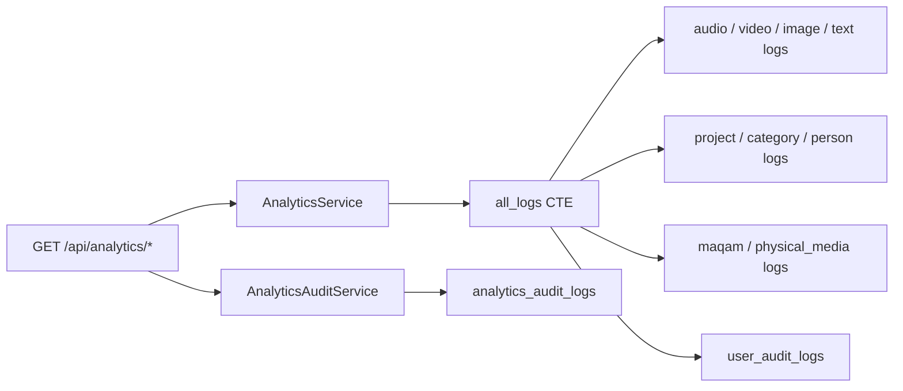

# Analytics — Team Activity API

> **Audience:** Admins (back-office analytics console) · **Base path:** `/api/analytics` · **Source:** `src/main/java/ak/dev/khi_archive_platform/platform/api/analytics/AnalyticsAPI.java`

Twelve read-only endpoints that report *who did what, when* across the archive. Almost every number
comes from one `UNION ALL` over the ten `*_audit_logs` tables (nine content domains plus
`user_audit_logs`), narrowed by a universal filter (date window, entity, action, actor, entity code,
free text); the exception is the `corrections` block of `/overview`, which is counted straight off
`guest_corrections`. Four of the twelve endpoints are cached in Caffeine — across three cache
regions, because `/me` and `/users/{username}` share one — and the rest run live against the indexed
union. Every call also writes one row to `analytics_audit_logs`, so opening the console is itself
audited.

## Access

| Requirement | Value |
|---|---|
| Authentication | Required. JWT in the HttpOnly `khi_auth_token` cookie; `JWTAuthenticationFilter` also accepts `Authorization: Bearer …` |
| Authority | `hasRole('ADMIN')` — the `ROLE_ADMIN` authority. The `@PreAuthorize` sits **on the class** `AnalyticsAPI`, so it applies to all twelve handlers; no method declares its own |
| Roles that hold it by default | **ADMIN** only |
| Roles that do **not** | EMPLOYEE, TEACHER, GUEST. `user/enums/Permission.java` defines no `analytics:*` permission, so analytics access cannot be delegated through a per-user permission grant — only the ADMIN role opens it |

Because the annotation is on the class, `ApiExceptionHandler.extractRequiredAuthority` falls back to
the class annotation when it builds a 403 body, and reports the role name:

```json
{
  "timestamp": "2026-08-26T09:15:42Z",
  "status": 403,
  "error": "ACCESS_DENIED",
  "category": "AUTHORIZATION",
  "message": "You don't have permission to perform this action. Required authority: 'ADMIN'.",
  "hint": "Ask an administrator to grant 'ADMIN' or to assign a role that includes it.",
  "path": "/api/analytics/overview",
  "details": {
    "requiredAuthority": "ADMIN",
    "actor": "sara",
    "actorAuthorities": ["ROLE_EMPLOYEE", "audio:create", "audio:read", "audio:update"],
    "requestMethod": "GET"
  }
}
```

Responses are serialized with `spring.jackson.default-property-inclusion=non_null`: **null fields are
omitted**. Primitive counters (`long`, `int`, `boolean`) are never null, so they always appear — even
as `0` / `false`. Instants serialize as ISO-8601 with `spring.jackson.time-zone=Asia/Baghdad`;
`LocalDate` bucket keys serialize as `yyyy-MM-dd`.

None of these handlers use `@ModelAttribute` — every filter value is an individual `@RequestParam`
and is folded into an `AnalyticsFilter` by the controller's private `build(...)` helper. Query
parameters that are not listed for an endpoint are silently ignored rather than rejected.

## Endpoints

| Method | Path | Authority | Purpose |
|---|---|---|---|
| `GET` | `/api/analytics/me` | `hasRole('ADMIN')` | Calling admin's own activity picture + paged feed |
| `GET` | `/api/analytics/users/{username}` | `hasRole('ADMIN')` | Any user's activity picture + paged feed |
| `GET` | `/api/analytics/users` | `hasRole('ADMIN')` | Per-user totals across the team (leaderboard) |
| `GET` | `/api/analytics/overview` | `hasRole('ADMIN')` | Team totals, per-entity, top-N users, all time-series, correction backlog |
| `GET` | `/api/analytics/feed` | `hasRole('ADMIN')` | Paged cross-entity activity feed |
| `GET` | `/api/analytics/actions` | `hasRole('ADMIN')` | Per-action breakdown (CREATE/UPDATE/DELETE/…) |
| `GET` | `/api/analytics/daily` | `hasRole('ADMIN')` | Per-calendar-day buckets |
| `GET` | `/api/analytics/monthly` | `hasRole('ADMIN')` | Per-calendar-month buckets (defaults to a 365-day window) |
| `GET` | `/api/analytics/weekly` | `hasRole('ADMIN')` | Per-ISO-week buckets (defaults to an 84-day window) |
| `GET` | `/api/analytics/yearly` | `hasRole('ADMIN')` | Per-calendar-year buckets (defaults to 5 calendar years) |
| `GET` | `/api/analytics/actions/catalog` | `hasRole('ADMIN')` | The five action names the UI offers as filter checkboxes |
| `GET` | `/api/analytics/entities` | `hasRole('ADMIN')` | Per-entity stats as a standalone map |

`GET /api/analytics/actions/catalog` is declared after `GET /api/analytics/actions`; the paths do not
collide because `actions` has no path variable — `/actions` and `/actions/catalog` are two distinct
literal mappings.

Two sibling controllers also live under `/api/analytics` and are **not** covered by this file:
`InventoryAnalyticsAPI` (`GET /api/analytics/inventory`, `GET /api/analytics/visibility`) and
`MaqamAnalyticsAPI` (`GET /api/analytics/maqam/overview`, `/maqam/teachers`,
`/maqam/teachers/{username}`). They read the operational tables, not the audit union, and carry their
own class-level `@PreAuthorize("hasRole('ADMIN')")`.

---

### `GET /api/analytics/me`

The calling admin's own activity over a window, with a paginated slice of their audit rows.

**Authority:** `hasRole('ADMIN')` (declared on the class; applies to this handler)

**Query parameters**

| Name | Type | Default | Description |
|---|---|---|---|
| `days` | int | `30` | Window length in days, ending at `to`/now. Clamped to `1…365`. Ignored when `from` is supplied |
| `from` | ISO-8601 date-time | derived from `days` | Inclusive lower bound (`occurred_at >= from`). Bound with `@DateTimeFormat(iso = DATE_TIME)`, so it must carry an offset — `2026-08-01T00:00:00Z` or `2026-08-01T00:00:00+03:00` |
| `to` | ISO-8601 date-time | now | Inclusive upper bound (`occurred_at <= to`) |
| `entities` | CSV | all ten | Entity keys to include — see [Filter semantics](#filter-semantics). Unknown values are dropped |
| `actions` | CSV | all except `LIST` | Action names to include. Upper-cased by the controller, then whitelisted. Unknown values are dropped |
| `actorPattern` | string | — | Case-insensitive substring on `actor_username` / `actor_display_name`. The actor is already pinned to the caller, so this can only narrow the report to nothing |
| `entityCode` | string | — | Exact match on the union's `entity_code` |
| `q` | string | — | Case-insensitive substring across `details`, `entity_code`, `actor_username`, `actor_display_name` |
| `page` | int | `0` | Zero-based page index of the `recent` slice. Negative or absent → `0` |
| `size` | int | `50` | Page size of `recent`. Absent or `<= 0` → `50`; capped at `500` |
| `sort` | string | `desc` | Order of `recent.items` by `occurred_at`. Accepts `asc`, `desc`, or Spring-style `occurredAt,asc` / `occurredAt,desc` |

There is no `actor` parameter: `AnalyticsService.getUserActivity` forces `actor = auth.getName()`.

**Response** `200 OK` — `UserActivityDTO`

`byEntity` below is abridged; the real payload carries one key per entity in scope, in alphabetical
order, zero-filled for entities with no rows.

```json
{
  "actorUserId": 3,
  "username": "akar",
  "displayName": "Akar Arkan",
  "authorities": "ROLE_ADMIN",
  "permissions": "",
  "from": "2026-07-27T09:15:42Z",
  "to": "2026-08-26T09:15:42Z",
  "firstSeen": "2026-07-28T06:02:11Z",
  "lastSeen": "2026-08-26T08:59:04Z",
  "totalActions": 412,
  "byEntity": {
    "audio": {
      "created": 12, "updated": 30, "deleted": 2, "restored": 0, "purged": 0,
      "viewed": 140, "searched": 18, "total": 202, "distinctEntities": 61
    },
    "user": {
      "created": 0, "updated": 4, "deleted": 0, "restored": 0, "purged": 0,
      "viewed": 9, "searched": 0, "total": 13, "distinctEntities": 5
    }
  },
  "daily": [
    { "date": "2026-08-26", "total": 18, "created": 2, "updated": 6, "deleted": 0, "restored": 0, "purged": 0 }
  ],
  "weekly": [
    { "week": "2026-08-24", "label": "2026-W35", "total": 51, "created": 6, "updated": 14,
      "deleted": 1, "restored": 0, "purged": 0, "viewed": 25, "searched": 5, "activeUsers": 1 }
  ],
  "monthly": [
    { "month": "2026-08-01", "label": "2026-08", "total": 233, "created": 21, "updated": 60,
      "deleted": 3, "restored": 1, "purged": 0, "viewed": 120, "searched": 28, "activeUsers": 1 }
  ],
  "yearly": [
    { "year": "2026-01-01", "label": "2026", "total": 412, "created": 34, "updated": 96,
      "deleted": 5, "restored": 1, "purged": 0, "viewed": 221, "searched": 55, "activeUsers": 1 }
  ],
  "recent": {
    "items": [
      {
        "entity": "audio",
        "entityId": 412,
        "entityCode": "HASAZIRA_AUD_RAW_V1_Copy(1)_000001",
        "action": "UPDATE",
        "occurredAt": "2026-08-26T08:59:04Z",
        "actorUserId": 3,
        "actorUsername": "akar",
        "actorDisplayName": "Akar Arkan",
        "actorAuthorities": "ROLE_ADMIN",
        "requestMethod": "PATCH",
        "requestPath": "/api/audio/HASAZIRA_AUD_RAW_V1_Copy(1)_000001",
        "ipAddress": "10.0.0.14",
        "deviceInfo": "Mozilla/5.0",
        "sessionId": "5f0b1c2d-8a41-4d3e-9b77-2f4c9a1e6d30",
        "details": "Updated audio metadata"
      }
    ],
    "page": 0,
    "size": 50,
    "totalElements": 412,
    "totalPages": 9,
    "hasNext": true,
    "hasPrevious": false
  }
}
```

`UserActivityDTO` fields:

| Field | Type | Description |
|---|---|---|
| `actorUserId` | long | `actor_user_id` from the newest matching row. Omitted when nothing matched |
| `username` | string | Echoed from the request — the authenticated name here, the path variable on `/users/{username}` |
| `displayName` | string | `actor_display_name` from the newest matching row |
| `authorities` | string | Comma-separated authorities (roles + permissions) snapshotted on the newest row |
| `permissions` | string | Same list minus `ROLE_*` entries |
| `from` | instant | Resolved window start |
| `to` | instant | Resolved window end |
| `firstSeen` | instant | `MIN(occurred_at)` inside the window |
| `lastSeen` | instant | `MAX(occurred_at)` inside the window |
| `totalActions` | long | Sum of `byEntity[*].total` |
| `byEntity` | object | Entity key → `EntityStatsDTO` (see [`/entities`](#get-apianalyticsentities)) |
| `daily` | array | `DailyBucketDTO[]`, newest first, empty days omitted (see [`/daily`](#get-apianalyticsdaily)) |
| `weekly` | array | `WeeklyBucketDTO[]` (see [`/weekly`](#get-apianalyticsweekly)) |
| `monthly` | array | `MonthlyBucketDTO[]` (see [`/monthly`](#get-apianalyticsmonthly)) |
| `yearly` | array | `YearlyBucketDTO[]` (see [`/yearly`](#get-apianalyticsyearly)) |
| `recent` | object | `FeedPageDTO` — the paged slice controlled by `page`/`size`/`sort` (see [`/feed`](#get-apianalyticsfeed)) |

All four series ship on every call, so a Daily / Weekly / Monthly / Yearly toggle on the per-user
chart is a client-side switch between arrays already in hand — one request, and no chance of the
series disagreeing because they were fetched moments apart. The same holds for
[`/users/{username}`](#get-apianalyticsusersusername) and [`/overview`](#get-apianalyticsoverview).
The dedicated [`/daily`](#get-apianalyticsdaily), [`/weekly`](#get-apianalyticsweekly),
[`/monthly`](#get-apianalyticsmonthly) and [`/yearly`](#get-apianalyticsyearly) endpoints are for a
chart that needs its **own** filter — a different window or entity set from the rest of the page.

The four arrays all share this call's window, so `days=30` yields at most two `yearly` buckets and
one or two `monthly` ones. That is the window, not a truncated series.

**Errors**

| Status | `error` code | When |
|---|---|---|
| `400` | `TYPE_MISMATCH` | `days`, `page` or `size` is not an integer, or `from`/`to` cannot be converted to an `Instant` |
| `400` | `BAD_REQUEST` | `sort` is neither `asc` nor `desc` (`"Invalid sort value: '…'. Allowed: asc \| desc"`), or the resolved `from` is after `to` |
| `401` | `TOKEN_MISSING` | No cookie and no `Authorization` header |
| `401` | `TOKEN_EXPIRED` / `TOKEN_REVOKED` / `TOKEN_INVALID` / `TOKEN_INVALID_SIGNATURE` | Token rejected by `JWTAuthenticationFilter` |
| `403` | `ACCESS_DENIED` | Caller is not ADMIN; `details.requiredAuthority` is `ADMIN` |
| `500` | `DATABASE_ERROR` | The union query or the audit-row insert failed |
| `504` | `TIMEOUT` | The union query exceeded the database timeout |

**Example**

```bash
curl -s "{{BASE_URL}}/api/analytics/me?days=30&page=0&size=25&sort=desc" \
  -H "Cookie: khi_auth_token=$TOKEN"
```

**Notes** — Cached in `analytics:user.v2` (Caffeine, 200 entries, 5-minute TTL) **only** when the
filter is default, i.e. nothing but `days` is set. Writes one `analytics_audit_logs` row with
`action = VIEW_USER` and `filter_summary = "d=30|e=|a=|u=|up=|ec=|q=:page=0:size=25:sort=DESC"`.

---

### `GET /api/analytics/users/{username}`

Any user's activity picture over a window, with a paginated slice of their audit rows.

**Authority:** `hasRole('ADMIN')` (declared on the class; applies to this handler)

**Path parameters**

| Name | Type | Description |
|---|---|---|
| `username` | string | Matched exactly (after trimming) against `actor_username` in the union. Case-sensitive |

**Query parameters**

| Name | Type | Default | Description |
|---|---|---|---|
| `days` | int | `30` | Window length in days. Clamped to `1…365`. Ignored when `from` is supplied |
| `from` | ISO-8601 date-time | derived from `days` | Inclusive lower bound |
| `to` | ISO-8601 date-time | now | Inclusive upper bound |
| `entities` | CSV | all ten | Entity keys to include |
| `actions` | CSV | all except `LIST` | Action names to include |
| `entityCode` | string | — | Exact match on `entity_code` |
| `q` | string | — | Case-insensitive substring across `details`, `entity_code`, `actor_username`, `actor_display_name` |
| `page` | int | `0` | Zero-based page index of `recent` |
| `size` | int | `50` | Page size of `recent`; `<= 0` → `50`, capped at `500` |
| `sort` | string | `desc` | `asc` / `desc` / `occurredAt,asc` / `occurredAt,desc` |

Neither `actor` nor `actorPattern` is accepted here — the path variable already pins the actor.

**Response** `200 OK` — `UserActivityDTO`, identical in shape to
[`GET /api/analytics/me`](#get-apianalyticsme).

An unknown username is **not** an error. The service never looks the account up; it simply finds no
audit rows, so the response is a zero report: `username` echoes the path variable, every counter is
`0`, `byEntity` is zero-filled, the time-series arrays are empty, and `actorUserId`, `displayName`,
`authorities`, `permissions`, `firstSeen`, `lastSeen` are omitted (null).

```json
{
  "username": "ghost",
  "from": "2026-07-27T09:15:42Z",
  "to": "2026-08-26T09:15:42Z",
  "totalActions": 0,
  "byEntity": {
    "audio": { "created": 0, "updated": 0, "deleted": 0, "restored": 0, "purged": 0,
               "viewed": 0, "searched": 0, "total": 0, "distinctEntities": 0 }
  },
  "daily": [],
  "weekly": [],
  "monthly": [],
  "yearly": [],
  "recent": {
    "items": [], "page": 0, "size": 50, "totalElements": 0, "totalPages": 1,
    "hasNext": false, "hasPrevious": false
  }
}
```

**Errors**

| Status | `error` code | When |
|---|---|---|
| `400` | `TYPE_MISMATCH` | `days`, `page` or `size` is not an integer, or `from`/`to` is not a bindable ISO-8601 date-time |
| `400` | `BAD_REQUEST` | Invalid `sort` value, or resolved `from` after `to` |
| `401` | `TOKEN_MISSING` | Not authenticated |
| `401` | `TOKEN_EXPIRED` / `TOKEN_REVOKED` / `TOKEN_INVALID` / `TOKEN_INVALID_SIGNATURE` | Token rejected by `JWTAuthenticationFilter` |
| `403` | `ACCESS_DENIED` | Caller is not ADMIN |
| `500` | `DATABASE_ERROR` | The union query or the audit-row insert failed |
| `504` | `TIMEOUT` | The union query exceeded the database timeout |

There is no `USER_NOT_FOUND` on this endpoint.

**Example**

```bash
curl -s "{{BASE_URL}}/api/analytics/users/sara?days=90&entities=audio,video&actions=CREATE,UPDATE" \
  -H "Cookie: khi_auth_token=$TOKEN"
```

**Notes** — Shares the `analytics:user.v2` cache with `/me` (key starts with the username), and is
cached only for default filters. Audited as `VIEW_USER` with
`filter_summary = "<filter key>:target=sara:page=0:size=50:sort=DESC"`.

---

### `GET /api/analytics/users`

Per-user totals across the whole team, sorted by `totalActions` descending.

**Authority:** `hasRole('ADMIN')` (declared on the class; applies to this handler)

**Query parameters**

| Name | Type | Default | Description |
|---|---|---|---|
| `days` | int | `30` | Window length in days. Clamped to `1…365`. Ignored when `from` is supplied |
| `from` | ISO-8601 date-time | derived from `days` | Inclusive lower bound |
| `to` | ISO-8601 date-time | now | Inclusive upper bound |
| `entities` | CSV | all ten | Entity keys to include |
| `actions` | CSV | all except `LIST` | Action names to include |
| `actorPattern` | string | — | Case-insensitive substring on `actor_username` / `actor_display_name` |
| `q` | string | — | Case-insensitive substring across `details`, `entity_code`, `actor_username`, `actor_display_name` |

No `actor`, no `entityCode`, no paging — the full leaderboard is returned as one array.

**Response** `200 OK` — `UserSummaryDTO[]` (a bare JSON array, not a `Page`)

```json
[
  {
    "actorUserId": 3,
    "username": "akar",
    "displayName": "Akar Arkan",
    "authorities": "ROLE_ADMIN",
    "permissions": "",
    "totalActions": 412,
    "createCount": 34,
    "updateCount": 96,
    "deleteCount": 5,
    "restoreCount": 1,
    "purgeCount": 0,
    "readCount": 221,
    "searchCount": 55,
    "firstSeen": "2026-07-28T06:02:11Z",
    "lastSeen": "2026-08-26T08:59:04Z"
  }
]
```

| Field | Type | Description |
|---|---|---|
| `actorUserId` | long | From the newest row for that user (`DISTINCT ON (actor_username) … ORDER BY occurred_at DESC`) |
| `username` | string | `actor_username` — the grouping key; rows with a null actor are excluded |
| `displayName` | string | `MAX(actor_display_name)` inside the window |
| `authorities` | string | Authorities snapshotted on the newest row |
| `permissions` | string | Authorities minus `ROLE_*` |
| `totalActions` | long | All non-`LIST` rows in scope for this user |
| `createCount` | long | `action = 'CREATE'` |
| `updateCount` | long | `action = 'UPDATE'` |
| `deleteCount` | long | `action IN ('DELETE','REMOVE')` — the legacy `REMOVE` rows are folded in |
| `restoreCount` | long | `action = 'RESTORE'` |
| `purgeCount` | long | `action = 'PURGE'` |
| `readCount` | long | `action = 'READ'` |
| `searchCount` | long | `action = 'SEARCH'` |
| `firstSeen` | instant | `MIN(occurred_at)` for this user in the window |
| `lastSeen` | instant | `MAX(occurred_at)` for this user in the window |

The seven per-action counters do not have to add up to `totalActions`: domain-specific actions
(`VOTE_CAST`, `IMPORT`, `ROLE_CHANGE`, `WARNING_SENT`, `STREAM`, …) are counted in `totalActions`
but have no dedicated column.

**Errors**

| Status | `error` code | When |
|---|---|---|
| `400` | `TYPE_MISMATCH` | `days` is not an integer, or `from`/`to` is not a bindable ISO-8601 date-time |
| `400` | `BAD_REQUEST` | Resolved `from` is after `to` |
| `401` | `TOKEN_MISSING` | Not authenticated |
| `401` | `TOKEN_EXPIRED` / `TOKEN_REVOKED` / `TOKEN_INVALID` / `TOKEN_INVALID_SIGNATURE` | Token rejected by `JWTAuthenticationFilter` |
| `403` | `ACCESS_DENIED` | Caller is not ADMIN |
| `500` | `DATABASE_ERROR` | The union query or the audit-row insert failed |
| `504` | `TIMEOUT` | The union query exceeded the database timeout |

**Example**

```bash
curl -s "{{BASE_URL}}/api/analytics/users?days=30" \
  -H "Cookie: khi_auth_token=$TOKEN"
```

**Notes** — Cached in `analytics:users.v2` (50 entries, 5-minute TTL) when the filter is default.
Audited as `VIEW_USERS`, with `details = "User leaderboard (returned=<n>)"`.

---

### `GET /api/analytics/overview`

One team-wide payload: totals, per-entity split, top-N users, all four time-series and the guest
correction backlog.

**Authority:** `hasRole('ADMIN')` (declared on the class; applies to this handler)

**Query parameters**

| Name | Type | Default | Description |
|---|---|---|---|
| `days` | int | `30` | Window length in days. Clamped to `1…365`. Ignored when `from` is supplied |
| `from` | ISO-8601 date-time | derived from `days` | Inclusive lower bound |
| `to` | ISO-8601 date-time | now | Inclusive upper bound |
| `entities` | CSV | all ten | Entity keys to include |
| `actions` | CSV | all except `LIST` | Action names to include |
| `actorPattern` | string | — | Case-insensitive substring on `actor_username` / `actor_display_name` |
| `q` | string | — | Case-insensitive substring across `details`, `entity_code`, `actor_username`, `actor_display_name` |
| `topUsers` | int | `10` | Size of the `topUsers` leaderboard. Absent or `<= 0` → `10`; capped at `100` |

No `actor` and no `entityCode` on this endpoint.

**Response** `200 OK` — `TeamOverviewDTO` (`byEntity` and the series are abridged below)

```json
{
  "from": "2026-07-27T09:15:42Z",
  "to": "2026-08-26T09:15:42Z",
  "totalActions": 1884,
  "activeUsers": 7,
  "byEntity": {
    "audio": { "created": 40, "updated": 91, "deleted": 6, "restored": 1, "purged": 0,
               "viewed": 502, "searched": 77, "total": 717, "distinctEntities": 240 }
  },
  "topUsers": [
    { "actorUserId": 3, "username": "akar", "displayName": "Akar Arkan",
      "authorities": "ROLE_ADMIN", "permissions": "", "totalActions": 412,
      "createCount": 34, "updateCount": 96, "deleteCount": 5, "restoreCount": 1,
      "purgeCount": 0, "readCount": 221, "searchCount": 55,
      "firstSeen": "2026-07-28T06:02:11Z", "lastSeen": "2026-08-26T08:59:04Z" }
  ],
  "daily": [
    { "date": "2026-08-26", "total": 63, "created": 7, "updated": 21, "deleted": 1, "restored": 0, "purged": 0 }
  ],
  "weekly": [
    { "week": "2026-08-24", "label": "2026-W35", "total": 190, "created": 22, "updated": 51,
      "deleted": 2, "restored": 0, "purged": 0, "viewed": 96, "searched": 19, "activeUsers": 5 }
  ],
  "monthly": [
    { "month": "2026-08-01", "label": "2026-08", "total": 1120, "created": 130, "updated": 300,
      "deleted": 11, "restored": 2, "purged": 0, "viewed": 560, "searched": 117, "activeUsers": 7 }
  ],
  "yearly": [
    { "year": "2026-01-01", "label": "2026", "total": 1884, "created": 214, "updated": 505,
      "deleted": 18, "restored": 3, "purged": 1, "viewed": 940, "searched": 203, "activeUsers": 7 }
  ],
  "corrections": {
    "total": 41,
    "pending": 12,
    "forwarded": 5,
    "resolved": 21,
    "rejected": 3,
    "byMediaType": { "AUDIO": 22, "VIDEO": 9, "IMAGE": 6, "TEXT": 4 }
  }
}
```

| Field | Type | Description |
|---|---|---|
| `from` | instant | Resolved window start |
| `to` | instant | Resolved window end |
| `totalActions` | long | Sum of `byEntity[*].total` |
| `activeUsers` | long | Number of distinct `actor_username` values in the window (the full leaderboard size, not `topUsers`) |
| `byEntity` | object | Entity key → `EntityStatsDTO` (see [`/entities`](#get-apianalyticsentities)) |
| `topUsers` | array | `UserSummaryDTO[]` sorted by `totalActions` descending, truncated to `topUsers` (see [`/users`](#get-apianalyticsusers)) |
| `daily` | array | `DailyBucketDTO[]`, newest first, empty days omitted |
| `weekly` | array | `WeeklyBucketDTO[]`, newest first, empty weeks omitted |
| `monthly` | array | `MonthlyBucketDTO[]`, newest first, empty months omitted |
| `yearly` | array | `YearlyBucketDTO[]`, newest first, empty years omitted |
| `corrections` | object | `CorrectionStatsDTO` — always populated by `getOverview`, so it is never omitted here |

`CorrectionStatsDTO`:

| Field | Type | Description |
|---|---|---|
| `total` | long | `pending + forwarded + resolved + rejected` |
| `pending` | long | `guest_corrections` rows with status `PENDING` and `removed_at IS NULL` |
| `forwarded` | long | Status `FORWARDED`, not soft-removed |
| `resolved` | long | Status `RESOLVED`, not soft-removed |
| `rejected` | long | Status `REJECTED`, not soft-removed |
| `byMediaType` | object | One key per `CorrectionMediaType` value — `AUDIO`, `VIDEO`, `IMAGE`, `TEXT` — counting non-removed corrections of that type |

The correction block is **all-time and unfiltered**: it ignores `days` / `from` / `to` / `entities` /
`actions` entirely, so admins always see the whole backlog.

**Errors**

| Status | `error` code | When |
|---|---|---|
| `400` | `TYPE_MISMATCH` | `days` or `topUsers` is not an integer, or `from`/`to` is not a bindable ISO-8601 date-time |
| `400` | `BAD_REQUEST` | Resolved `from` is after `to` |
| `401` | `TOKEN_MISSING` | Not authenticated |
| `401` | `TOKEN_EXPIRED` / `TOKEN_REVOKED` / `TOKEN_INVALID` / `TOKEN_INVALID_SIGNATURE` | Token rejected by `JWTAuthenticationFilter` |
| `403` | `ACCESS_DENIED` | Caller is not ADMIN |
| `500` | `DATABASE_ERROR` | A union query, the correction counts, or the audit-row insert failed |
| `504` | `TIMEOUT` | A query exceeded the database timeout |

**Example**

```bash
curl -s "{{BASE_URL}}/api/analytics/overview?days=30&topUsers=5" \
  -H "Cookie: khi_auth_token=$TOKEN"
```

**Notes** — Cached in `analytics:overview.v2` (50 entries, 5-minute TTL) when the filter is default;
the cache key includes `topUsers`. Audited as `VIEW_OVERVIEW` with
`filter_summary = "<filter key>:top=5"`. This is the heaviest endpoint: six aggregate queries over
the union (entity stats, daily, weekly, monthly, yearly, user summaries) plus eight repository counts
on `guest_corrections` — one per `CorrectionStatus` and one per `CorrectionMediaType`.

---

### `GET /api/analytics/feed`

Paged, cross-entity activity feed in `occurred_at` order — the raw audit rows behind every other
report.

**Authority:** `hasRole('ADMIN')` (declared on the class; applies to this handler)

**Query parameters**

| Name | Type | Default | Description |
|---|---|---|---|
| `days` | int | `30` | Window length in days. Clamped to `1…365`. Ignored when `from` is supplied |
| `from` | ISO-8601 date-time | derived from `days` | Inclusive lower bound |
| `to` | ISO-8601 date-time | now | Inclusive upper bound |
| `entities` | CSV | all ten | Entity keys to include |
| `actions` | CSV | all except `LIST` | Action names to include |
| `actor` | string | — | Exact match on `actor_username` (trimmed) |
| `actorPattern` | string | — | Case-insensitive substring on `actor_username` / `actor_display_name` |
| `entityCode` | string | — | Exact match on `entity_code`. For `user` rows this is the **target** username |
| `q` | string | — | Case-insensitive substring across `details`, `entity_code`, `actor_username`, `actor_display_name` |
| `page` | int | `0` | Zero-based page index. Negative or absent → `0` |
| `size` | int | `50` | Rows per page. Absent or `<= 0` → `50`; capped at `500` |
| `sort` | string | `desc` | `asc` / `desc` / `occurredAt,asc` / `occurredAt,desc` |

**Response** `200 OK` — `FeedPageDTO`

```json
{
  "items": [
    {
      "entity": "user",
      "entityId": 11,
      "entityCode": "sara",
      "action": "GRANT_PERMISSIONS",
      "occurredAt": "2026-08-26T08:41:00Z",
      "actorUserId": 3,
      "actorUsername": "akar",
      "actorDisplayName": "Akar Arkan",
      "actorAuthorities": "ROLE_ADMIN",
      "requestMethod": "POST",
      "requestPath": "/api/admin/users/11/permissions",
      "ipAddress": "10.0.0.14",
      "deviceInfo": "Mozilla/5.0",
      "sessionId": "5f0b1c2d-8a41-4d3e-9b77-2f4c9a1e6d30",
      "details": "Granted audio:update"
    }
  ],
  "page": 0,
  "size": 50,
  "totalElements": 1884,
  "totalPages": 38,
  "hasNext": true,
  "hasPrevious": false
}
```

`FeedPageDTO` is a plain value object, **not** the Spring `Page` envelope — there is no `pageable`,
`number`, `first`, `last`, `numberOfElements` or `empty`:

| Field | Type | Description |
|---|---|---|
| `items` | array | `RecentActivityItemDTO[]` for this page |
| `page` | int | Echo of the resolved (clamped) page index |
| `size` | int | Echo of the resolved (clamped) page size |
| `totalElements` | long | `COUNT(*)` over the same filter — a second query on the same union |
| `totalPages` | int | `max(1, ceil(totalElements / size))` — always at least `1`, even for an empty result |
| `hasNext` | boolean | `(page + 1) * size < totalElements` |
| `hasPrevious` | boolean | `page > 0` |

`RecentActivityItemDTO`:

| Field | Type | Description |
|---|---|---|
| `entity` | string | Lower-case entity key of the source table: `audio`, `video`, `image`, `text`, `project`, `category`, `person`, `maqam`, `physical_media`, `user` |
| `entityId` | long | The source table's id column; `target_user_id` for `user` rows |
| `entityCode` | string | The source table's code column; `target_username` for `user` rows |
| `action` | string | Audit action, cast to text from the per-table enum |
| `occurredAt` | instant | When the audited operation happened |
| `actorUserId` | long | Acting user's id |
| `actorUsername` | string | Acting user's username |
| `actorDisplayName` | string | Acting user's display name at audit time |
| `actorAuthorities` | string | Comma-separated authorities (roles + permissions) at audit time |
| `actorPermissions` | string | Same list minus `ROLE_*`. Omitted when null — e.g. an ADMIN whose only authority is `ROLE_ADMIN` may have an empty or absent value |
| `requestMethod` | string | HTTP method of the audited request |
| `requestPath` | string | Request URI of the audited request |
| `ipAddress` | string | Client IP recorded on the session or request |
| `deviceInfo` | string | User-Agent / device string recorded on the session |
| `sessionId` | string | Session id the request was made under |
| `details` | string | Free-text summary written by the entity's audit service |

Rows are attributed to the **actor**. A `user` row therefore appears in the acting admin's report;
to see what happened *to* a given account, filter the feed with `entityCode=<username>`.

A row with `entity: "user"` also needs its own rendering. It does not describe content — it describes
an account being administered, and its columns mean something different from every other row:
`entityCode` is the **target** username rather than a media code, `entityId` is that user's id,
`requestPath` points at the user-management surface (`/api/admin/users/…`, `/api/admin/warnings/…`,
`/api/warnings/{warningId}/acknowledge`), and `action` is one of the user-management names
(`ROLE_CHANGE`, `GRANT_PERMISSIONS`, `REVOKE_PERMISSIONS`, `ACTIVATE`, `DEACTIVATE`, `WARNING_SENT`,
`WARNING_REVOKED`, `WARNING_ACKNOWLEDGED`) that no content entity emits. Give the key its own label
and icon in an entity legend, and link its `entityCode` to the user-admin screen, not to a media
detail page. `WARNING_ACKNOWLEDGED` is the exception to "an admin acting on someone else": the
recipient writes it about themself, so actor and `entityCode` are the same account.

The same care applies to entity filter chips. `AnalyticsService.ENTITY_KEYS` is a closed set of ten;
a client carrying a hardcoded older list silently drops `user`, `maqam` and `physical_media` from its
filter UI while the API keeps counting them.

**Errors**

| Status | `error` code | When |
|---|---|---|
| `400` | `TYPE_MISMATCH` | `days`, `page` or `size` is not an integer, or `from`/`to` is not a bindable ISO-8601 date-time |
| `400` | `BAD_REQUEST` | Invalid `sort` value, or resolved `from` after `to` |
| `401` | `TOKEN_MISSING` | Not authenticated |
| `401` | `TOKEN_EXPIRED` / `TOKEN_REVOKED` / `TOKEN_INVALID` / `TOKEN_INVALID_SIGNATURE` | Token rejected by `JWTAuthenticationFilter` |
| `403` | `ACCESS_DENIED` | Caller is not ADMIN |
| `500` | `DATABASE_ERROR` | The page query, the count query, or the audit-row insert failed |
| `504` | `TIMEOUT` | A query exceeded the database timeout |

**Example**

```bash
curl -s "{{BASE_URL}}/api/analytics/feed?days=7&entities=audio,video&actions=CREATE,UPDATE,DELETE&page=0&size=100&sort=desc" \
  -H "Cookie: khi_auth_token=$TOKEN"
```

```bash
# Everything that happened to one account, regardless of who did it
curl -s "{{BASE_URL}}/api/analytics/feed?days=365&entities=user&entityCode=sara" \
  -H "Cookie: khi_auth_token=$TOKEN"
```

**Notes** — **Never cached**: the page/size/sort combinatorial space would dilute the hit rate to
nothing. Audited as `VIEW_FEED`, with `details` carrying the page, size, sort and `totalElements`.

---

### `GET /api/analytics/actions`

How many rows each action accounts for — the data behind a CREATE/UPDATE/DELETE pie or a
"top actions" bar chart.

**Authority:** `hasRole('ADMIN')` (declared on the class; applies to this handler)

**Query parameters**

| Name | Type | Default | Description |
|---|---|---|---|
| `days` | int | `30` | Window length in days. Clamped to `1…365`. Ignored when `from` is supplied |
| `from` | ISO-8601 date-time | derived from `days` | Inclusive lower bound |
| `to` | ISO-8601 date-time | now | Inclusive upper bound |
| `entities` | CSV | all ten | Entity keys to include |
| `actor` | string | — | Exact match on `actor_username` |
| `actorPattern` | string | — | Case-insensitive substring on `actor_username` / `actor_display_name` |
| `entityCode` | string | — | Exact match on `entity_code` |
| `q` | string | — | Case-insensitive substring across `details`, `entity_code`, `actor_username`, `actor_display_name` |

There is **no `actions` parameter** on this endpoint: the controller passes `null` for actions, so
the breakdown always covers every action (except `LIST`) that matches the rest of the filter.

**Response** `200 OK` — `ActionStatsDTO[]`, ordered by `total` descending

```json
[
  { "action": "READ",   "total": 940, "distinctActors": 7, "distinctEntities": 612 },
  { "action": "UPDATE", "total": 505, "distinctActors": 6, "distinctEntities": 288 },
  { "action": "CREATE", "total": 214, "distinctActors": 5, "distinctEntities": 214 },
  { "action": "SEARCH", "total": 203, "distinctActors": 7, "distinctEntities": 0 }
]
```

| Field | Type | Description |
|---|---|---|
| `action` | string | Action name as stored in the source table |
| `total` | long | Rows with this action inside the filter |
| `distinctActors` | long | `COUNT(DISTINCT actor_username)` for this action (nulls excluded) |
| `distinctEntities` | long | `COUNT(DISTINCT entity_id)` for this action (nulls excluded) — `0` for actions that carry no entity id, such as `SEARCH` |

Note that `distinctEntities` is counted across the whole result of the filter, so ids from different
source tables share one counting space; scope the call with `entities=` when that matters.

**Errors**

| Status | `error` code | When |
|---|---|---|
| `400` | `TYPE_MISMATCH` | `days` is not an integer, or `from`/`to` is not a bindable ISO-8601 date-time |
| `400` | `BAD_REQUEST` | Resolved `from` is after `to` |
| `401` | `TOKEN_MISSING` | Not authenticated |
| `401` | `TOKEN_EXPIRED` / `TOKEN_REVOKED` / `TOKEN_INVALID` / `TOKEN_INVALID_SIGNATURE` | Token rejected by `JWTAuthenticationFilter` |
| `403` | `ACCESS_DENIED` | Caller is not ADMIN |
| `500` | `DATABASE_ERROR` | The union query or the audit-row insert failed |
| `504` | `TIMEOUT` | The union query exceeded the database timeout |

**Example**

```bash
curl -s "{{BASE_URL}}/api/analytics/actions?days=30&entities=audio" \
  -H "Cookie: khi_auth_token=$TOKEN"
```

**Notes** — **Not cached** (`AnalyticsService.getActionStats` has no `@Cacheable`). Audited as
`VIEW_ACTIONS`.

---

### `GET /api/analytics/daily`

Per-calendar-day buckets (`DATE_TRUNC('day', occurred_at)`), newest first.

**Authority:** `hasRole('ADMIN')` (declared on the class; applies to this handler)

**Query parameters**

| Name | Type | Default | Description |
|---|---|---|---|
| `days` | int | `30` | Window length in days. Clamped to `1…365`. Ignored when `from` is supplied |
| `from` | ISO-8601 date-time | derived from `days` | Inclusive lower bound |
| `to` | ISO-8601 date-time | now | Inclusive upper bound |
| `entities` | CSV | all ten | Entity keys to include |
| `actions` | CSV | all except `LIST` | Action names to include |
| `actor` | string | — | Exact match on `actor_username` |
| `actorPattern` | string | — | Case-insensitive substring on `actor_username` / `actor_display_name` |
| `entityCode` | string | — | Exact match on `entity_code` |
| `q` | string | — | Case-insensitive substring across `details`, `entity_code`, `actor_username`, `actor_display_name` |

**Response** `200 OK` — `DailyBucketDTO[]`

```json
[
  { "date": "2026-08-26", "total": 63, "created": 7, "updated": 21, "deleted": 1, "restored": 0, "purged": 0 },
  { "date": "2026-08-25", "total": 44, "created": 3, "updated": 18, "deleted": 0, "restored": 1, "purged": 0 }
]
```

| Field | Type | Description |
|---|---|---|
| `date` | date (`yyyy-MM-dd`) | The day bucket |
| `total` | long | All non-`LIST` rows that day |
| `created` | long | `action = 'CREATE'` |
| `updated` | long | `action = 'UPDATE'` |
| `deleted` | long | `action IN ('DELETE','REMOVE')` |
| `restored` | long | `action = 'RESTORE'` |
| `purged` | long | `action = 'PURGE'` |

Unlike the weekly / monthly / yearly buckets, `DailyBucketDTO` has **no** `label`, `viewed`,
`searched` or `activeUsers` fields. Days with no matching rows are omitted entirely (no zero-fill).

**Errors**

| Status | `error` code | When |
|---|---|---|
| `400` | `TYPE_MISMATCH` | `days` is not an integer, or `from`/`to` is not a bindable ISO-8601 date-time |
| `400` | `BAD_REQUEST` | Resolved `from` is after `to` |
| `401` | `TOKEN_MISSING` | Not authenticated |
| `401` | `TOKEN_EXPIRED` / `TOKEN_REVOKED` / `TOKEN_INVALID` / `TOKEN_INVALID_SIGNATURE` | Token rejected by `JWTAuthenticationFilter` |
| `403` | `ACCESS_DENIED` | Caller is not ADMIN |
| `500` | `DATABASE_ERROR` | The union query or the audit-row insert failed |
| `504` | `TIMEOUT` | The union query exceeded the database timeout |

**Example**

```bash
curl -s "{{BASE_URL}}/api/analytics/daily?days=14&actor=sara" \
  -H "Cookie: khi_auth_token=$TOKEN"
```

**Notes** — **Not cached**. Audited as `VIEW_DAILY` with `details = "Daily breakdown (rows=<n>)"`.

---

### `GET /api/analytics/monthly`

Per-calendar-month buckets (`DATE_TRUNC('month', occurred_at)`), newest first.

**Authority:** `hasRole('ADMIN')` (declared on the class; applies to this handler)

**Query parameters**

| Name | Type | Default | Description |
|---|---|---|---|
| `days` | int | `365` here, otherwise `30` | The controller substitutes `365` **only** when `days`, `from` and `to` are all absent, so the chart shows ~12 buckets out of the box. Any supplied value is clamped to `1…365` |
| `from` | ISO-8601 date-time | derived from `days` | Inclusive lower bound. Use `from`/`to` to reach further back than 365 days |
| `to` | ISO-8601 date-time | now | Inclusive upper bound |
| `entities` | CSV | all ten | Entity keys to include |
| `actions` | CSV | all except `LIST` | Action names to include |
| `actor` | string | — | Exact match on `actor_username` |
| `actorPattern` | string | — | Case-insensitive substring on `actor_username` / `actor_display_name` |
| `entityCode` | string | — | Exact match on `entity_code` |
| `q` | string | — | Case-insensitive substring across `details`, `entity_code`, `actor_username`, `actor_display_name` |

**Response** `200 OK` — `MonthlyBucketDTO[]`

```json
[
  { "month": "2026-08-01", "label": "2026-08", "total": 1120, "created": 130, "updated": 300,
    "deleted": 11, "restored": 2, "purged": 0, "viewed": 560, "searched": 117, "activeUsers": 7 },
  { "month": "2026-07-01", "label": "2026-07", "total": 764, "created": 84, "updated": 205,
    "deleted": 7, "restored": 1, "purged": 1, "viewed": 380, "searched": 86, "activeUsers": 6 }
]
```

| Field | Type | Description |
|---|---|---|
| `month` | date (`yyyy-MM-dd`) | First day of the month bucket |
| `label` | string | Pre-formatted `YYYY-MM` |
| `total` | long | All non-`LIST` rows that month |
| `created` | long | `action = 'CREATE'` |
| `updated` | long | `action = 'UPDATE'` |
| `deleted` | long | `action IN ('DELETE','REMOVE')` |
| `restored` | long | `action = 'RESTORE'` |
| `purged` | long | `action = 'PURGE'` |
| `viewed` | long | `action = 'READ'` |
| `searched` | long | `action = 'SEARCH'` |
| `activeUsers` | long | `COUNT(DISTINCT actor_username)` in that month — `1` (or `0`) when the filter already pins a single actor |

Months with no matching rows are omitted.

**Errors**

| Status | `error` code | When |
|---|---|---|
| `400` | `TYPE_MISMATCH` | `days` is not an integer, or `from`/`to` is not a bindable ISO-8601 date-time |
| `400` | `BAD_REQUEST` | Resolved `from` is after `to` |
| `401` | `TOKEN_MISSING` | Not authenticated |
| `401` | `TOKEN_EXPIRED` / `TOKEN_REVOKED` / `TOKEN_INVALID` / `TOKEN_INVALID_SIGNATURE` | Token rejected by `JWTAuthenticationFilter` |
| `403` | `ACCESS_DENIED` | Caller is not ADMIN |
| `500` | `DATABASE_ERROR` | The union query or the audit-row insert failed |
| `504` | `TIMEOUT` | The union query exceeded the database timeout |

**Example**

```bash
curl -s "{{BASE_URL}}/api/analytics/monthly" \
  -H "Cookie: khi_auth_token=$TOKEN"

# Two full years — the 365-day cap applies to `days`, not to an explicit range
curl -s "{{BASE_URL}}/api/analytics/monthly?from=2024-01-01T00:00:00Z&to=2026-01-01T00:00:00Z" \
  -H "Cookie: khi_auth_token=$TOKEN"
```

**Notes** — **Not cached**. Audited as `VIEW_MONTHLY`.

---

### `GET /api/analytics/weekly`

Per-ISO-week buckets (`DATE_TRUNC('week', occurred_at)`, Monday-anchored), newest first.

**Authority:** `hasRole('ADMIN')` (declared on the class; applies to this handler)

**Query parameters**

| Name | Type | Default | Description |
|---|---|---|---|
| `days` | int | `84` here, otherwise `30` | The controller substitutes `84` (~12 weeks) **only** when `days`, `from` and `to` are all absent. Any supplied value is clamped to `1…365` |
| `from` | ISO-8601 date-time | derived from `days` | Inclusive lower bound |
| `to` | ISO-8601 date-time | now | Inclusive upper bound |
| `entities` | CSV | all ten | Entity keys to include |
| `actions` | CSV | all except `LIST` | Action names to include |
| `actor` | string | — | Exact match on `actor_username` |
| `actorPattern` | string | — | Case-insensitive substring on `actor_username` / `actor_display_name` |
| `entityCode` | string | — | Exact match on `entity_code` |
| `q` | string | — | Case-insensitive substring across `details`, `entity_code`, `actor_username`, `actor_display_name` |

**Response** `200 OK` — `WeeklyBucketDTO[]`

```json
[
  { "week": "2026-08-24", "label": "2026-W35", "total": 190, "created": 22, "updated": 51,
    "deleted": 2, "restored": 0, "purged": 0, "viewed": 96, "searched": 19, "activeUsers": 5 }
]
```

| Field | Type | Description |
|---|---|---|
| `week` | date (`yyyy-MM-dd`) | Monday that starts the ISO week |
| `label` | string | Pre-formatted `YYYY-Www` (e.g. `2026-W35`), from `IsoFields.WEEK_BASED_YEAR` / `WEEK_OF_WEEK_BASED_YEAR` |
| `total` | long | All non-`LIST` rows that week |
| `created` | long | `action = 'CREATE'` |
| `updated` | long | `action = 'UPDATE'` |
| `deleted` | long | `action IN ('DELETE','REMOVE')` |
| `restored` | long | `action = 'RESTORE'` |
| `purged` | long | `action = 'PURGE'` |
| `viewed` | long | `action = 'READ'` |
| `searched` | long | `action = 'SEARCH'` |
| `activeUsers` | long | `COUNT(DISTINCT actor_username)` in that week |

Weeks with no matching rows are omitted.

**Errors**

| Status | `error` code | When |
|---|---|---|
| `400` | `TYPE_MISMATCH` | `days` is not an integer, or `from`/`to` is not a bindable ISO-8601 date-time |
| `400` | `BAD_REQUEST` | Resolved `from` is after `to` |
| `401` | `TOKEN_MISSING` | Not authenticated |
| `401` | `TOKEN_EXPIRED` / `TOKEN_REVOKED` / `TOKEN_INVALID` / `TOKEN_INVALID_SIGNATURE` | Token rejected by `JWTAuthenticationFilter` |
| `403` | `ACCESS_DENIED` | Caller is not ADMIN |
| `500` | `DATABASE_ERROR` | The union query or the audit-row insert failed |
| `504` | `TIMEOUT` | The union query exceeded the database timeout |

**Example**

```bash
curl -s "{{BASE_URL}}/api/analytics/weekly?entities=maqam&actions=VOTE_CAST" \
  -H "Cookie: khi_auth_token=$TOKEN"
```

**Notes** — **Not cached**. Audited as `VIEW_WEEKLY`.

---

### `GET /api/analytics/yearly`

Per-calendar-year buckets (`DATE_TRUNC('year', occurred_at)`), newest first.

**Authority:** `hasRole('ADMIN')` (declared on the class; applies to this handler)

**Query parameters**

| Name | Type | Default | Description |
|---|---|---|---|
| `days` | int | `30` | Clamped to `1…365`. Only consulted when at least one of `days` / `from` / `to` is supplied — see the default below |
| `from` | ISO-8601 date-time | Jan 1 of `currentYear − 4`, UTC | When `days`, `from` and `to` are all absent, the controller sets `to = now` and `from = LocalDate.of(currentYear - 4, 1, 1)` at UTC midnight, giving exactly five whole calendar-year buckets. This bypasses the 365-day cap, which applies to `days` only |
| `to` | ISO-8601 date-time | now | Inclusive upper bound |
| `entities` | CSV | all ten | Entity keys to include |
| `actions` | CSV | all except `LIST` | Action names to include |
| `actor` | string | — | Exact match on `actor_username` |
| `actorPattern` | string | — | Case-insensitive substring on `actor_username` / `actor_display_name` |
| `entityCode` | string | — | Exact match on `entity_code` |
| `q` | string | — | Case-insensitive substring across `details`, `entity_code`, `actor_username`, `actor_display_name` |

Passing `days` alone puts you back on the 365-day-capped path; to cover more than a year explicitly,
pass `from` (and optionally `to`).

**Response** `200 OK` — `YearlyBucketDTO[]`

```json
[
  { "year": "2026-01-01", "label": "2026", "total": 1884, "created": 214, "updated": 505,
    "deleted": 18, "restored": 3, "purged": 1, "viewed": 940, "searched": 203, "activeUsers": 7 },
  { "year": "2025-01-01", "label": "2025", "total": 5120, "created": 902, "updated": 1440,
    "deleted": 61, "restored": 12, "purged": 4, "viewed": 2200, "searched": 501, "activeUsers": 9 }
]
```

| Field | Type | Description |
|---|---|---|
| `year` | date (`yyyy-MM-dd`) | First day of the year bucket |
| `label` | string | Pre-formatted `YYYY` |
| `total` | long | All non-`LIST` rows that year |
| `created` | long | `action = 'CREATE'` |
| `updated` | long | `action = 'UPDATE'` |
| `deleted` | long | `action IN ('DELETE','REMOVE')` |
| `restored` | long | `action = 'RESTORE'` |
| `purged` | long | `action = 'PURGE'` |
| `viewed` | long | `action = 'READ'` |
| `searched` | long | `action = 'SEARCH'` |
| `activeUsers` | long | `COUNT(DISTINCT actor_username)` in that year |

Years with no matching rows are omitted.

**Errors**

| Status | `error` code | When |
|---|---|---|
| `400` | `TYPE_MISMATCH` | `days` is not an integer, or `from`/`to` is not a bindable ISO-8601 date-time |
| `400` | `BAD_REQUEST` | Resolved `from` is after `to` |
| `401` | `TOKEN_MISSING` | Not authenticated |
| `401` | `TOKEN_EXPIRED` / `TOKEN_REVOKED` / `TOKEN_INVALID` / `TOKEN_INVALID_SIGNATURE` | Token rejected by `JWTAuthenticationFilter` |
| `403` | `ACCESS_DENIED` | Caller is not ADMIN |
| `500` | `DATABASE_ERROR` | The union query or the audit-row insert failed |
| `504` | `TIMEOUT` | The union query exceeded the database timeout |

**Example**

```bash
curl -s "{{BASE_URL}}/api/analytics/yearly" \
  -H "Cookie: khi_auth_token=$TOKEN"
```

**Notes** — **Not cached**. Audited as `VIEW_YEARLY`.

---

### `GET /api/analytics/actions/catalog`

The action names the admin UI offers as filter checkboxes.

**Authority:** `hasRole('ADMIN')` (declared on the class; applies to this handler)

**Query parameters** — none. The handler takes no filter at all.

**Response** `200 OK` — `String[]`, the constant `AnalyticsService.SELECTABLE_ACTIONS`

```json
["CREATE", "READ", "UPDATE", "DELETE", "SEARCH"]
```

The order is fixed (the CRUD progression) and the values can be sent straight back as the `actions=`
CSV. This is deliberately a short list, not the full whitelist: `RESTORE`, `PURGE`, `REMOVE` and the
domain-specific actions are still accepted by `actions=` but are not offered here, and `LIST` is
never offered nor counted. See [Filter semantics](#filter-semantics) for the complete whitelist.

It is a **filter menu, not a label set**. `/actions`, `/feed` and the `recent` slice keep returning
`RESTORE`, `PURGE`, `REMOVE`, `VOTE_CAST`, `STREAM`, `IMPORT`, `ROLE_CHANGE`, `WARNING_SENT` and the
rest of the whitelist, so a client that builds its action dictionary from this endpoint renders raw
enum names for everything outside the five. Key the display labels off the full whitelist and use the
catalog only to decide which checkboxes to draw.

**Errors**

| Status | `error` code | When |
|---|---|---|
| `401` | `TOKEN_MISSING` | Not authenticated |
| `401` | `TOKEN_EXPIRED` / `TOKEN_REVOKED` / `TOKEN_INVALID` / `TOKEN_INVALID_SIGNATURE` | Token rejected by `JWTAuthenticationFilter` |
| `403` | `ACCESS_DENIED` | Caller is not ADMIN |
| `500` | `DATABASE_ERROR` | The audit-row insert failed |

**Example**

```bash
curl -s "{{BASE_URL}}/api/analytics/actions/catalog" \
  -H "Cookie: khi_auth_token=$TOKEN"
```

**Notes** — No analytics query runs; the list is an in-memory constant. The only database work is the
audit row (plus the session lookup `AnalyticsAuditService` performs to enrich it). Audited as
`VIEW_ACTION_CATALOG` with `filter_summary = "catalog"`.

---

### `GET /api/analytics/entities`

Per-entity activity counts — the same map as `overview.byEntity`, on its own.

**Authority:** `hasRole('ADMIN')` (declared on the class; applies to this handler)

**Query parameters**

| Name | Type | Default | Description |
|---|---|---|---|
| `days` | int | `30` | Window length in days. Clamped to `1…365`. Ignored when `from` is supplied |
| `from` | ISO-8601 date-time | derived from `days` | Inclusive lower bound |
| `to` | ISO-8601 date-time | now | Inclusive upper bound |
| `entities` | CSV | all ten | Entity keys to include — also decides which keys appear in the response |
| `actions` | CSV | all except `LIST` | Action names to include |
| `actor` | string | — | Exact match on `actor_username` |
| `actorPattern` | string | — | Case-insensitive substring on `actor_username` / `actor_display_name` |
| `entityCode` | string | — | Exact match on `entity_code` |
| `q` | string | — | Case-insensitive substring across `details`, `entity_code`, `actor_username`, `actor_display_name` |

**Response** `200 OK` — `Map<String, EntityStatsDTO>`, one key per entity in scope

Keys come from the sanitized entity set (a `TreeSet`, so alphabetical) and every key is present even
when it has no rows — the map is zero-filled before the query result is merged in.

```json
{
  "audio":          { "created": 40, "updated": 91, "deleted": 6, "restored": 1, "purged": 0, "viewed": 502, "searched": 77, "total": 717, "distinctEntities": 240 },
  "category":       { "created": 2,  "updated": 3,  "deleted": 0, "restored": 0, "purged": 0, "viewed": 30,  "searched": 4,  "total": 39,  "distinctEntities": 12 },
  "image":          { "created": 18, "updated": 22, "deleted": 1, "restored": 0, "purged": 0, "viewed": 120, "searched": 9,  "total": 170, "distinctEntities": 88 },
  "maqam":          { "created": 6,  "updated": 11, "deleted": 0, "restored": 0, "purged": 0, "viewed": 64,  "searched": 3,  "total": 210, "distinctEntities": 40 },
  "person":         { "created": 4,  "updated": 7,  "deleted": 0, "restored": 0, "purged": 0, "viewed": 41,  "searched": 6,  "total": 58,  "distinctEntities": 21 },
  "physical_media": { "created": 90, "updated": 12, "deleted": 0, "restored": 0, "purged": 0, "viewed": 33,  "searched": 8,  "total": 144, "distinctEntities": 90 },
  "project":        { "created": 3,  "updated": 9,  "deleted": 1, "restored": 1, "purged": 0, "viewed": 55,  "searched": 0,  "total": 69,  "distinctEntities": 14 },
  "text":           { "created": 11, "updated": 15, "deleted": 0, "restored": 0, "purged": 0, "viewed": 70,  "searched": 12, "total": 108, "distinctEntities": 47 },
  "user":           { "created": 1,  "updated": 4,  "deleted": 0, "restored": 0, "purged": 0, "viewed": 9,   "searched": 0,  "total": 17,  "distinctEntities": 5 },
  "video":          { "created": 39, "updated": 60, "deleted": 3, "restored": 0, "purged": 1, "viewed": 215, "searched": 34, "total": 352, "distinctEntities": 131 }
}
```

`EntityStatsDTO`:

| Field | Type | Description |
|---|---|---|
| `created` | long | `action = 'CREATE'` |
| `updated` | long | `action = 'UPDATE'` |
| `deleted` | long | `action IN ('DELETE','REMOVE')` — the legacy `REMOVE` rows are folded in |
| `restored` | long | `action = 'RESTORE'` |
| `purged` | long | `action = 'PURGE'` |
| `viewed` | long | `action = 'READ'` |
| `searched` | long | `action = 'SEARCH'` |
| `total` | long | Every non-`LIST` row in scope for this entity, including actions with no dedicated column (`VOTE_CAST`, `IMPORT`, `ROLE_CHANGE`, `WARNING_SENT`, `STREAM`, …). That is why `maqam`, `physical_media` and `user` above exceed the sum of their named counters. `audio`, `video`, `image`, `text`, `project`, `category` and `person` reconcile exactly — their audit enums define nothing outside `CREATE/READ/SEARCH/UPDATE/DELETE/REMOVE/RESTORE/PURGE` (plus `LIST`, which is never counted) |
| `distinctEntities` | long | `COUNT(DISTINCT entity_id)` where `entity_id IS NOT NULL` — how many individual records were touched |

**Errors**

| Status | `error` code | When |
|---|---|---|
| `400` | `TYPE_MISMATCH` | `days` is not an integer, or `from`/`to` is not a bindable ISO-8601 date-time |
| `400` | `BAD_REQUEST` | Resolved `from` is after `to` |
| `401` | `TOKEN_MISSING` | Not authenticated |
| `401` | `TOKEN_EXPIRED` / `TOKEN_REVOKED` / `TOKEN_INVALID` / `TOKEN_INVALID_SIGNATURE` | Token rejected by `JWTAuthenticationFilter` |
| `403` | `ACCESS_DENIED` | Caller is not ADMIN |
| `500` | `DATABASE_ERROR` | The union query or the audit-row insert failed |
| `504` | `TIMEOUT` | The union query exceeded the database timeout |

**Example**

```bash
# All ten keys — the payload shown above
curl -s "{{BASE_URL}}/api/analytics/entities?days=30" \
  -H "Cookie: khi_auth_token=$TOKEN"

# Narrowed: the response then carries only these four keys
curl -s "{{BASE_URL}}/api/analytics/entities?days=30&entities=audio,video,image,text" \
  -H "Cookie: khi_auth_token=$TOKEN"
```

**Notes** — **Not cached**. Audited as `VIEW_ENTITY_STATS` with
`details = "Entity stats (entities=<n>)"`.

---

## Filter semantics

All twelve endpoints (except `/actions/catalog`, which takes nothing) draw their parameters from the
same set, folded into `AnalyticsFilter` by the controller and validated by `AnalyticsService`.

**Time window** (`AnalyticsService.window`), inclusive on both ends:

1. `to` = the supplied `to`, else `now`.
2. `from` = the supplied `from`; if absent, `to − days × 86 400s`, where `days` defaults to `30` and
   is clamped to `1…365`.
3. If the resolved `from` is after `to`, the request fails with `400 BAD_REQUEST`
   (`"Invalid date range: 'from' (…) is after 'to' (…)"`).

Supplying `from` alone is legal (`to` becomes `now`); supplying `to` alone is legal as well
(`from` is derived from `days` behind that `to`). The `days` cap of 365 applies only to `days` — an
explicit `from`/`to` range may span any length, which is how `/yearly` reaches five years.

**Entities** (`entities=`) — whitelisted against `AnalyticsService.ENTITY_KEYS`, case-insensitive,
trimmed:

`audio`, `video`, `image`, `text`, `project`, `category`, `person`, `maqam`, `physical_media`, `user`

Unknown values are dropped silently; if nothing survives, the filter degrades to *all* entities. When
every key is selected the SQL predicate is skipped entirely.

**Actions** (`actions=`) — the controller upper-cases the whole CSV, then the service whitelists it
against `ACTION_KEYS`:

| Group | Values |
|---|---|
| Core | `CREATE`, `READ`, `SEARCH`, `UPDATE`, `DELETE`, `REMOVE`, `RESTORE`, `PURGE` |
| Maqam | `TEACHER_ASSIGNED`, `TEACHER_REMOVED`, `VOTE_CAST`, `VOTE_UPDATED`, `VOTE_DELETED`, `STREAM`, `LISTEN_STARTED`, `LISTEN_PROGRESS`, `LISTEN_ENDED` |
| Physical media | `IMPORT`, `TYPE_CREATE`, `TYPE_UPDATE`, `TYPE_DELETE` |
| User management | `ROLE_CHANGE`, `GRANT_PERMISSIONS`, `REVOKE_PERMISSIONS`, `ACTIVATE`, `DEACTIVATE`, `WARNING_SENT`, `WARNING_REVOKED`, `WARNING_ACKNOWLEDGED` |

Unknown values are dropped; if nothing survives, no action predicate is applied (the filter degrades
to "all"). A domain action applied to the wrong entity simply matches nothing — the per-table enums
do not define it.

`LIST` is **never** counted: `AnalyticsService` appends `AND action <> 'LIST'` to every query,
aggregate and feed alike, so `total` always reconciles with the per-action columns. Page-load noise
is not treated as work.

**Text and actor predicates**

| Parameter | SQL |
|---|---|
| `actor` | `actor_username = :actor` (value trimmed) |
| `actorPattern` | `LOWER(actor_username) LIKE %p%` **OR** `LOWER(actor_display_name) LIKE %p%` |
| `entityCode` | `entity_code = :entityCode` (value trimmed) |
| `q` | `LIKE %q%` over `LOWER(COALESCE(details,''))`, `entity_code`, `actor_username`, `actor_display_name` |

`actorPattern` and `q` are lower-cased before binding, so both are case-insensitive substring
matches; `actor` and `entityCode` are exact and case-sensitive. Neither pattern escapes SQL `LIKE`
wildcards — a `%` or `_` inside `q` or `actorPattern` is passed through and behaves as a wildcard.
Blank values are ignored: a parameter that is null or whitespace-only adds no predicate, and a blank
`entities=` / `actions=` CSV is treated by `parseCsv` as absent, degrading to "all".

**Paging and sort** (`/me`, `/users/{username}`, `/feed` only)

| Input | Rule |
|---|---|
| `page` | `null` or `< 0` → `0` |
| `size` | `null` or `<= 0` → `50`; otherwise `min(size, 500)`. `getFeed` clamps again to `1…500` |
| `sort` | `null` → `DESC`. Trimmed, lower-cased; any value ending in `asc` → `ASC`, ending in `desc` → `DESC` (so `occurredAt,asc` works). Anything else throws `IllegalArgumentException` → `400 BAD_REQUEST` |
| `topUsers` | `/overview` only: `null` or `<= 0` → `10`; otherwise `min(topUsers, 100)` |

## Data source — the audit-log UNION ALL

`AnalyticsService.ALL_LOGS_CTE` is a single `WITH all_logs AS (…)` common table expression with ten
`UNION ALL` branches, one per audit table. Every branch projects the same column shape, so the
surrounding query can group and filter uniformly and each report costs one round trip instead of ten.

| `entity` value | Table | `entity_id` ← | `entity_code` ← |
|---|---|---|---|
| `audio` | `audio_audit_logs` | `audio_id` | `audio_code` |
| `video` | `video_audit_logs` | `video_id` | `video_code` |
| `image` | `image_audit_logs` | `image_id` | `image_code` |
| `text` | `text_audit_logs` | `text_id` | `text_code` |
| `project` | `project_audit_logs` | `project_id` | `project_code` |
| `category` | `category_audit_logs` | `category_id` | `category_code` |
| `person` | `person_audit_logs` | `person_id` | `person_code` |
| `maqam` | `maqam_audit_logs` | `maqam_id` | `maqam_code` |
| `physical_media` | `physical_media_audit_logs` | `physical_media_id` | `physical_media_code` |
| `user` | `user_audit_logs` | `target_user_id` | `target_username` |

Shared columns on every branch: `action::text`, `actor_user_id`, `actor_username`,
`actor_display_name`, `actor_authorities`, `actor_permissions`, `device_info`, `ip_address`,
`session_id`, `request_method`, `request_path`, `occurred_at`, `details`.

Two consequences worth remembering:

- The per-table `action` enum is cast to `text`, which is why the `actions=` whitelist exists — an
  unguarded string would go straight into the comparison.
- `user_audit_logs` has no entity code of its own, so the **target** user is aliased into
  `entity_code`. Rows are attributed to the acting admin, so "what did admin X do" is an actor query
  while "what happened to account Y" is `entities=user&entityCode=Y`.

`analytics_audit_logs` is deliberately **not** part of the union: opening the analytics console never
inflates the figures the console reports.

**Logins and logouts are not in the union either.** Authentication events are recorded only in the
`sessions` table (`user/model/Session.java`, surfaced by `SessionAPI` under `/api/auth/sessions`).
`UserAuditAction` defines `CREATE`, `UPDATE`, `DELETE`, `ROLE_CHANGE`, `GRANT_PERMISSIONS`,
`REVOKE_PERMISSIONS`, `ACTIVATE`, `DEACTIVATE`, `READ`, `LIST` and the three `WARNING_*` values —
there is no `LOGIN` and no `LOGOUT`, so no sign-in ever reaches `user_audit_logs` and no report on
this page counts one.

The consequence: `activeUsers`, on the bucket endpoints and on `/overview`, means *users who did
auditable work* in that window, not users who signed in. An account that authenticated but performed
no audited action appears in none of these reports. A login/session report would need `sessions`
joined in as an eleventh source, and that is not built.

Per report, the queries built on top of the CTE are: entity stats (`GROUP BY entity`), daily / weekly
/ monthly / yearly buckets (`GROUP BY DATE_TRUNC(…)`), action stats (`GROUP BY action`), user
summaries (an `agg` CTE plus a `DISTINCT ON (actor_username)` `latest` CTE), the feed page plus its
`COUNT(*)`, and a first/last-seen probe.



## Indexes created at startup

`platform/config/AuditLogIndexInitializer` listens for `ApplicationReadyEvent` and issues
`CREATE INDEX IF NOT EXISTS` through `JdbcTemplate` for **eleven** tables — the ten union branches
plus `analytics_audit_logs`. Three indexes per table, 33 statements in total:

| Index name | Definition | Serves |
|---|---|---|
| `idx_<table>_actor_occurred` | `(actor_username, occurred_at DESC)` | Per-user windowed scans — `/me`, `/users/{username}`, and any `actor=` filter |
| `idx_<table>_occurred` | `(occurred_at DESC)` | Team-wide windowed scans — `/overview`, `/users`, `/feed`, the bucket endpoints |
| `idx_<table>_action_occurred` | `(action, occurred_at DESC)` | The `FILTER (WHERE action = …)` aggregations and `actions=` filters |

The run is idempotent (`IF NOT EXISTS`) and failure-tolerant: if a table does not exist yet — first
boot, before Hibernate's `ddl-auto=update` has created it — the statement is caught and logged as
`Skipped index <name>: <message>`, and the next boot creates it. There is no Flyway/Liquibase step
behind this; the initializer *is* the migration.

## Caching

The cache manager is **Caffeine**, configured in `platform/config/CacheConfig` — not Redis, despite
what the `AnalyticsService` and `AnalyticsFilter` javadoc still says.

| Endpoint | Cached? | Cache name | Key | Capacity / TTL |
|---|---|---|---|---|
| `/me` | Yes, conditionally | `analytics:user.v2` | `username + ':' + filter.toCacheKey() + ':' + page + ':' + size + ':' + sort` | 200 entries / 5 min |
| `/users/{username}` | Yes, conditionally | `analytics:user.v2` | same as `/me` (shared cache) | 200 entries / 5 min |
| `/users` | Yes, conditionally | `analytics:users.v2` | `filter.toCacheKey()` | 50 entries / 5 min |
| `/overview` | Yes, conditionally | `analytics:overview.v2` | `filter.toCacheKey() + ':' + topN` | 50 entries / 5 min |
| `/feed` | **No** | — | — | — |
| `/actions` | **No** | — | — | — |
| `/daily` | **No** | — | — | — |
| `/monthly` | **No** | — | — | — |
| `/weekly` | **No** | — | — | — |
| `/yearly` | **No** | — | — | — |
| `/actions/catalog` | **No** (in-memory constant, no query) | — | — | — |
| `/entities` | **No** | — | — | — |

"Conditionally" means `condition = "#filter.isCacheable()"`: the entry is stored only when the filter
is *default* — `from`, `to`, `entities`, `actions`, `actor`, `actorPattern`, `entityCode` and `q` all
absent, leaving at most `days`. Any narrowed request bypasses the cache and runs the indexed union
directly.

`AnalyticsFilter.toCacheKey()` deliberately excludes `from`/`to` (it keys on `days` instead), which
is safe precisely because cacheable filters never set them. Staleness is bounded by the 5-minute TTL
only: `AnalyticsService.evictAll()` is an intentional no-op, so content writes do **not** invalidate
analytics entries. A cached `/overview` can therefore report a `from`/`to` window up to five minutes
behind the clock.

## Audit trail

`AnalyticsAuditService.record(...)` runs in a `REQUIRES_NEW` transaction, so the audit row commits
even if the surrounding read-only transaction rolls back. Each row in `analytics_audit_logs` carries
`action`, `filter_summary` (the filter's stable cache-key form plus any endpoint-specific suffix),
the actor (`actor_user_id`, `actor_username`, `actor_display_name`, `actor_authorities`,
`actor_permissions`), the session (`session_id`, `session_login_timestamp`, `session_expires_at`,
`session_is_active`), the request (`request_method`, `request_path`, `ip_address`, `device_info`),
an HTML-escaped `details` string and `occurred_at`.

| Endpoint | `action` | `filter_summary` |
|---|---|---|
| `/me` | `VIEW_USER` | `<filter key>:page=<p>:size=<s>:sort=<dir>` |
| `/users/{username}` | `VIEW_USER` | `<filter key>:target=<username>:page=<p>:size=<s>:sort=<dir>` |
| `/users` | `VIEW_USERS` | `<filter key>` |
| `/overview` | `VIEW_OVERVIEW` | `<filter key>:top=<n>` |
| `/feed` | `VIEW_FEED` | `<filter key>:page=<p>:size=<s>:sort=<dir>` |
| `/actions` | `VIEW_ACTIONS` | `<filter key>` |
| `/daily` | `VIEW_DAILY` | `<filter key>` |
| `/monthly` | `VIEW_MONTHLY` | `<filter key>` |
| `/weekly` | `VIEW_WEEKLY` | `<filter key>` |
| `/yearly` | `VIEW_YEARLY` | `<filter key>` |
| `/actions/catalog` | `VIEW_ACTION_CATALOG` | `catalog` |
| `/entities` | `VIEW_ENTITY_STATS` | `<filter key>` |

`<filter key>` is `AnalyticsFilter.toCacheKey()`: `d=<days>|e=<entities>|a=<actions>|u=<actor>|up=<actorPattern>|ec=<entityCode>|q=<q>`,
with the sets sorted and the string values trimmed and lower-cased — for example
`d=30|e=audio,video|a=CREATE|u=|up=|ec=|q=`.

The table is write-only as far as the HTTP API is concerned: `AnalyticsAuditLogRepository` is a bare
`JpaRepository` with no query methods, no endpoint reads these rows back, and no scheduled job
prunes them. Retention and archiving policy for `analytics_audit_logs`: _Not documented in source._

`AnalyticsAuditAction` also defines `VIEW_INVENTORY`, `VIEW_VISIBILITY`, `VIEW_MAQAM_OVERVIEW`,
`VIEW_MAQAM_TEACHERS` and `VIEW_MAQAM_TEACHER`, which belong to the sibling controllers listed under
[Endpoints](#endpoints). Adding a value to that enum needs no DDL:
`AnalyticsAuditActionConstraintInitializer` drops and re-creates the
`analytics_audit_logs_action_check` CHECK constraint from the enum on every boot.

## Composing the admin dashboard

These endpoints were shaped around a six-panel console, and the split across the two analytics docs
matters: the snapshot endpoints answer *what the archive contains right now*, while everything on
this page answers *what the team has been doing*. Mixing the two in one panel produces numbers that
look contradictory — an inventory count never moves with the date window, but every figure documented
here does.

| Panel | Endpoint(s) | Shape |
|---|---|---|
| 1. KPI row | `/inventory`, `/visibility` | Four tiles: `grandTotal`, `totalActive`, `totalTrashed`, `projectsHidden` |
| 2. Inventory by type | `/inventory` | Bar chart over `byType`, active vs trashed |
| 3. Visibility | `/visibility` | Grouped bar over `mediaByType`, plus the `itemsInHiddenProjects` callout |
| 4. Activity over time | `/daily`, `/weekly`, `/monthly`, `/yearly` | One chart with a granularity toggle |
| 5. Maqam progress | `/maqam/overview`, `/maqam/teachers` | Classification progress plus the teacher leaderboard |
| 6. User drill-down | `/users/{username}` | Per-user chart with the same toggle, above the `recent` feed |

Panels 1–3 and 5 come from the sibling controllers documented in
[Inventory, Visibility and Maqam](./inventory-and-maqam.md); panels 4 and 6 come from this file. Only
panels 4 and 6 respond to a date-range control, so attach that control to them visually rather than
parking it at the top of the page, where it appears to govern everything.

Two shortcuts are worth taking. Panel 4 can be served from
[`/overview`](#get-apianalyticsoverview) alone when it carries no filter of its own — that single
call already returns all four series plus `byEntity` and `topUsers`, and it is one of the four
[cached](#caching) endpoints. Panel 6 is likewise one call, not four.

## Related

- [Internal API index](../README.md)
- [Audio API](../content/audio.md) — an example of the write side: its `audio_audit_logs` rows are
  branch one of the union documented above
- [Unified Items API](../content/items.md) — the back-office grid whose reads and visibility toggles
  show up in these reports
- [Guest corrections](../../external/08-corrections.md) — the submission surface behind the
  `corrections` block of `GET /api/analytics/overview`
