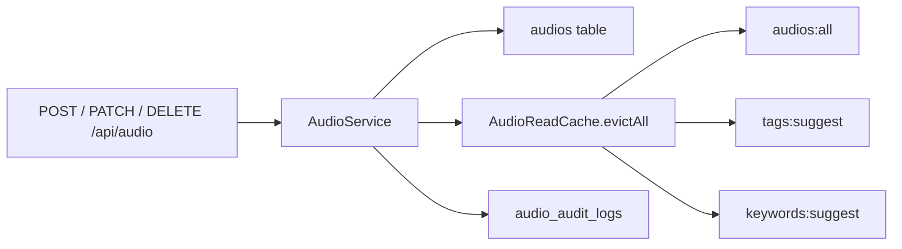

# Audio API

> **Audience:** Staff (ADMIN / EMPLOYEE) · **Base path:** `/api/audio` · **Source:** `platform/api/audio/AudioAPI.java`, `platform/api/audio/AudioStreamAPI.java`

The staff-facing lifecycle for audio records: paged listing with filters and sort, fuzzy search,
single multipart create, JSON bulk create, multipart update, visibility toggle, trash / restore /
purge, and the authenticated byte-range stream proxy. Audio bytes live in S3 but the S3 URL is
never returned — `audioFileUrl` in every response is rewritten to the in-API stream path.

## Access

| Requirement | Value |
|---|---|
| Authentication | Required. JWT in the HttpOnly `khi_auth_token` cookie (or `Authorization: Bearer …`). `SecurityConfig` maps `/api/**` to `.authenticated()`. |
| Authority | Per handler method — `audio:read`, `audio:create`, `audio:update`, `audio:delete`. `@PreAuthorize` is **on each method**, not on the class. `AudioStreamAPI` carries **no** `@PreAuthorize` at all: `GET /api/audio/{audioCode}/stream` is gated by the filter chain (authenticated) only. |
| Roles that hold it by default | **ADMIN** — all four, through the role itself (`Role.ADMIN` = every `Permission`). **EMPLOYEE** — `audio:read`, `audio:create`, `audio:update` from `EMPLOYEE_DEFAULT_PERMISSIONS`; **not** `audio:delete`. **TEACHER** / **GUEST** — none. |

`audio:remove` exists in `Permission` but no audio endpoint uses it — soft delete is guarded by
`audio:delete`. `restore`, `getTrash` and `purge` additionally re-check `audio:delete` inside
`AudioService.requireAdminRole(...)`, so the authority is enforced twice on those three.

The response DTO is serialized with `spring.jackson.default-property-inclusion=non_null`: **any
field that is null is omitted from the JSON**, so responses are ragged and clients must treat a
missing key as null. Instants serialize in `Asia/Baghdad`.

## Endpoints

| Method | Path | Authority | Purpose |
|---|---|---|---|
| `GET` | `/api/audio` | `audio:read` | Paged list of active records with filters + sort |
| `GET` | `/api/audio/search` | `audio:read` | Multi-token fuzzy search (trigram), flat array |
| `GET` | `/api/audio/trash` | `audio:delete` | Paged list of trashed records |
| `GET` | `/api/audio/{audioCode}` | `audio:read` | Single active record by business code |
| `POST` | `/api/audio` | `audio:create` | Create one record from multipart (`data` + `file`) |
| `POST` | `/api/audio/bulk` | `audio:create` | Bulk create from a JSON array of pre-uploaded URLs |
| `PATCH` | `/api/audio/{audioCode}` | `audio:update` | Update metadata, optionally replace the file |
| `PATCH` | `/api/audio/{audioCode}/visibility` | `audio:update` | Toggle `isPublic` |
| `DELETE` | `/api/audio/{audioCode}` | `audio:delete` | Soft delete — send to trash |
| `POST` | `/api/audio/{audioCode}/restore` | `audio:delete` | Restore from trash |
| `DELETE` | `/api/audio/{audioCode}/purge` | `audio:delete` | Permanent delete (row + S3 object) |
| `GET` | `/api/audio/{audioCode}/stream` | none (authenticated) | Range-capable byte stream, includes trashed records |
| `GET` | `/api/guest/audio/{audioCode}/stream` | none (public) | Same stream, active records only — public surface |

`GET /api/audio/trash` is declared after `GET /api/audio/{audioCode}` in the controller, but Spring
prefers the literal path over the template, so `/api/audio/trash` always routes to the trash
listing and can never be read as an audio code.

---

### `GET /api/audio`

Paged list of every active (`removed_at IS NULL`) audio record, filtered and sorted in memory.

**Authority:** `audio:read`

**Query parameters**

Paging (`@PageableDefault(size = 100)`):

| Name | Type | Default | Description |
|---|---|---|---|
| `page` | int | `0` | Zero-based page index |
| `size` | int | `100` | Page size |
| `sort` | string | — | Bound by Spring but **ignored**: `PaginationSupport.sliceList` only slices by offset/size. Order comes from `sortBy`/`sortDirection`. |

Sort (`AudioFilterParams`):

| Name | Type | Default | Description |
|---|---|---|---|
| `sortBy` | string | — | Sort key, case-insensitive. Unrecognized values leave the cached order untouched. Accepted keys and their synonyms are listed below. |
| `sortDirection` | string | ascending | `desc` (any case) reverses the comparator; anything else, including omission, keeps ascending order. |

`sortBy` values, exactly as matched by `AudioFilterSupport.comparatorFor`:

| Sorts by | Accepted values |
|---|---|
| `audioCode` | `audioCode`, `code` |
| `originTitle` | `originTitle`, `title`, `name`, `alpha`, `alphabet`, `alphabetical` |
| `createdAt` (audit) | `createdAt`, `created`, `added`, `dateAdded`, `date_added` |
| `updatedAt` (audit) | `updatedAt`, `updated`, `modified`, `dateModified`, `date_modified` |
| `dateCreated` (metadata) | `dateCreated`, `date_created` |
| `datePublished` (metadata) | `datePublished`, `date_published`, `published` |
| `dateModified` (metadata) | `dateModifiedField`, `dateMod` |
| `dateCopyrighted` (metadata) | `dateCopyrighted`, `copyrighted` |
| `audioQualityOutOf10` | `audioQuality`, `audioQualityOutOf10`, `quality` |
| `versionNumber` | `versionNumber`, `version` |
| `copyNumber` | `copyNumber`, `copy` |

Note the collision: `sortBy=dateModified` sorts by the **audit** `updatedAt` column, not the
metadata `dateModified` field. Use `sortBy=dateModifiedField` (or `dateMod`) for the metadata
field. Nulls always sort last in ascending order (`Comparator.nullsLast`), so `sortDirection=desc`
puts them first.

Categorical filters — case-insensitive **exact** match after `KurdishText.normalize` (NFC, Kurdish
Yeh/Keheh folding, joiner + tashkeel removal, whitespace collapse, lowercase) on both sides. A row
whose value is null never matches:

| Name | Type | Default | Description |
|---|---|---|---|
| `form` | string | — | Equals `form` |
| `typeOfBasta` | string | — | Equals `typeOfBasta` |
| `typeOfMaqam` | string | — | Equals `typeOfMaqam` |
| `language` | string | — | Equals `language` |
| `dialect` | string | — | Equals `dialect` |
| `typeOfComposition` | string | — | Equals `typeOfComposition` |
| `typeOfPerformance` | string | — | Equals `typeOfPerformance` |
| `city` | string | — | Equals `city` |
| `region` | string | — | Equals `region` |
| `audience` | string | — | Equals `audience` |
| `audioChannel` | string | — | Equals `audioChannel` |
| `fileExtension` | string | — | Equals `fileExtension` |
| `duration` | string | — | Equals `duration` (stored as free text, not a number) |
| `bitRate` | string | — | Equals `bitRate` |
| `bitDepth` | string | — | Equals `bitDepth` |
| `sampleRate` | string | — | Equals `sampleRate` |
| `lccClassification` | string | — | Equals `lccClassification` |
| `accrualMethod` | string | — | Equals `accrualMethod` |
| `availability` | string | — | Equals `availability` |
| `licenseType` | string | — | Equals `licenseType` |

Long-text filters — case-insensitive **substring** match, same normalization:

| Name | Type | Default | Description |
|---|---|---|---|
| `speaker` | string | — | Contains, in `speaker` |
| `producer` | string | — | Contains, in `producer` |
| `composer` | string | — | Contains, in `composer` |
| `poet` | string | — | Contains, in `poet` |
| `lyrics` | string | — | Contains, in `lyrics` |
| `recordingVenue` | string | — | Contains, in `recordingVenue` |
| `locationArchive` | string | — | Contains, in `locationArchive` |
| `degitizedBy` | string | — | Contains, in `degitizedBy` |
| `degitizationEquipment` | string | — | Contains, in `degitizationEquipment` |
| `provenance` | string | — | Contains, in `provenance` |
| `copyright` | string | — | Contains, in `copyright` |
| `rightOwner` | string | — | Contains, in `rightOwner` |
| `usageRights` | string | — | Contains, in `usageRights` |
| `owner` | string | — | Contains, in `owner` |
| `publisher` | string | — | Contains, in `publisher` |

Collection filters — repeat the parameter or pass a comma-separated list; each value is matched
with `trim().toLowerCase(Locale.ROOT)` (plain lowercase, **not** `KurdishText.normalize`). A row
with an empty or null collection never matches:

| Name | Type | Default | Description |
|---|---|---|---|
| `genre` | string[] | — | Match against `genre` |
| `genreMatch` | string | `any` | `all` (any case) requires every value; anything else means any |
| `contributors` | string[] | — | Match against `contributors` |
| `contributorMatch` | string | `any` | `all` requires every value |
| `tags` | string[] | — | Match against `tags` |
| `tagMatch` | string | `any` | `all` requires every value |
| `keywords` | string[] | — | Match against `keywords` |
| `keywordMatch` | string | `any` | `all` requires every value |

Boolean and numeric ranges — inclusive; a row whose value is null is excluded as soon as either
bound is present:

| Name | Type | Default | Description |
|---|---|---|---|
| `physicalAvailability` | boolean | — | Exact match on `physicalAvailability` |
| `audioQualityMin` | int | — | `audioQualityOutOf10 >= min` |
| `audioQualityMax` | int | — | `audioQualityOutOf10 <= max` |
| `versionNumberMin` | int | — | `versionNumber >= min` |
| `versionNumberMax` | int | — | `versionNumber <= max` |
| `copyNumberMin` | int | — | `copyNumber >= min` |
| `copyNumberMax` | int | — | `copyNumber <= max` |

Date ranges — bound as `LocalDate` with `@DateTimeFormat(iso = ISO.DATE)`, so the wire format is
`yyyy-MM-dd` (a full ISO instant fails binding and comes back as `400 VALIDATION_ERROR`). Each day
is resolved to its bounds in `Asia/Baghdad` by `ArchiveTime`, and both ends are inclusive. A row
whose value is null is excluded as soon as either bound is present:

| Name | Type | Default | Description |
|---|---|---|---|
| `dateCreatedFrom` | date | — | `dateCreated >= 00:00:00 of that day` |
| `dateCreatedTo` | date | — | `dateCreated <= 23:59:59.999999999 of that day` |
| `datePublishedFrom` | date | — | Lower bound on `datePublished` |
| `datePublishedTo` | date | — | Upper bound on `datePublished` |
| `dateModifiedFrom` | date | — | Lower bound on `dateModified` |
| `dateModifiedTo` | date | — | Upper bound on `dateModified` |
| `dateCopyrightedFrom` | date | — | Lower bound on `dateCopyrighted` |
| `dateCopyrightedTo` | date | — | Upper bound on `dateCopyrighted` |
| `createdFrom` | date | — | Lower bound on the audit `createdAt` |
| `createdTo` | date | — | Upper bound on the audit `createdAt` |
| `updatedFrom` | date | — | Lower bound on the audit `updatedAt` |
| `updatedTo` | date | — | Upper bound on the audit `updatedAt` |

**Response** `200 OK`

Standard Spring `Page` envelope (see [../01-conventions.md](../01-conventions.md)) whose
`content[]` elements are `AudioResponseDTO` — full field list under
[`GET /api/audio/{audioCode}`](#get-apiaudioaudiocode).

```json
{
  "content": [
    {
      "id": 412,
      "audioCode": "HASAZIRA_AUD_RAW_V1_Copy(1)_000001",
      "projectId": 18,
      "projectCode": "HASAZIRA_PRJ_000001",
      "projectName": "Hasan Zirak field recordings",
      "personId": 7,
      "personCode": "HASAZIRA",
      "personName": "Hasan Zirak",
      "categoryCodes": ["MUS"],
      "audioFileUrl": "/api/audio/HASAZIRA_AUD_RAW_V1_Copy(1)_000001/stream",
      "fileName": "hasan-zirak-track-01.mp3",
      "originTitle": "Ey Dilber",
      "form": "song",
      "genre": ["folk"],
      "language": "Kurdish",
      "dialect": "Sorani",
      "city": "Sulaimani",
      "tags": ["folk", "ballad"],
      "keywords": ["hasan zirak"],
      "physicalAvailability": true,
      "duration": "00:04:12",
      "audioQualityOutOf10": 8,
      "audioVersion": "RAW",
      "versionNumber": 1,
      "copyNumber": 1,
      "isPublic": true,
      "projectVisibleToPublic": true,
      "createdAt": "2026-07-29 12:34:56",
      "updatedAt": "2026-07-29 12:34:56",
      "createdBy": "aram"
    }
  ],
  "totalElements": 1,
  "totalPages": 1,
  "number": 0,
  "size": 100,
  "first": true,
  "last": true,
  "numberOfElements": 1,
  "empty": false
}
```

**Errors**

| Status | `error` code | When |
|---|---|---|
| `400` | `VALIDATION_ERROR` | A filter parameter could not be bound — a date that is not `yyyy-MM-dd`, a non-integer numeric range, a non-boolean `physicalAvailability`. `AudioFilterParams` is an `@ModelAttribute`, so a conversion failure becomes a field error and Spring raises `MethodArgumentNotValidException`; `details` maps each rejected field name to its message. It is **not** `TYPE_MISMATCH` — that code only comes from a standalone `@RequestParam` |
| `401` | `TOKEN_MISSING` | No cookie and no `Authorization` header |
| `401` | `TOKEN_EXPIRED` / `TOKEN_REVOKED` / `TOKEN_INVALID` / `TOKEN_INVALID_SIGNATURE` | Token rejected by `JWTAuthenticationFilter` |
| `403` | `ACCESS_DENIED` | Caller lacks `audio:read`; `details.requiredAuthority` echoes it back |
| `500` | `DATABASE_ERROR` | Cache miss reload failed |

**Example**

```bash
curl -s "{{BASE_URL}}/api/audio?page=0&size=20&language=Kurdish&dialect=Sorani&sortBy=originTitle&sortDirection=asc" \
  -H "Cookie: khi_auth_token=$TOKEN"

curl -s "{{BASE_URL}}/api/audio?tags=folk&tags=ballad&tagMatch=all&audioQualityMin=7&dateCreatedFrom=1980-01-01&dateCreatedTo=2000-12-31" \
  -H "Cookie: khi_auth_token=$TOKEN"
```

**Notes**

- Served from the Caffeine cache `audios:all` (`maximumSize=1`, `expireAfterWrite=10m`) via
  `AudioReadCache.getAllActive()`. Filtering and sorting run in memory over that one cached list —
  no SQL per request. With no filter parameters at all (`AudioFilterParams.isEmpty()`), the cached
  list is passed through untouched.
- Writes an `AudioAuditAction.LIST` row to `audio_audit_logs` with `audioId`/`audioCode` null and
  a detail string carrying page, size, returned, total, and `filtered=true` when any parameter was
  supplied.

---

### `GET /api/audio/search`

Multi-token fuzzy search across the audio columns and the `audio_genres`, `audio_contributors`,
`audio_tags` and `audio_keywords` child tables.

**Authority:** `audio:read`

**Query parameters**

| Name | Type | Default | Description |
|---|---|---|---|
| `q` | string | — | **Required.** Free text. Whitespace-tokenized; tokens without a letter or digit are dropped; duplicates removed. Blank `q` or an all-punctuation `q` returns `[]`. |
| `limit` | int | `20` | Max rows returned. Null or `<= 0` falls back to 20; values above 100 are clamped to 100. |

**Response** `200 OK`

A flat JSON array of `AudioResponseDTO` — **not** a `Page` envelope.

```json
[
  {
    "id": 412,
    "audioCode": "HASAZIRA_AUD_RAW_V1_Copy(1)_000001",
    "originTitle": "Ey Dilber",
    "poet": "Hejar",
    "audioFileUrl": "/api/audio/HASAZIRA_AUD_RAW_V1_Copy(1)_000001/stream",
    "isPublic": true,
    "createdAt": "2026-07-29 12:34:56"
  }
]
```

**Errors**

| Status | `error` code | When |
|---|---|---|
| `400` | `MISSING_PARAMETER` | `q` omitted entirely (`details.parameter = "q"`) |
| `400` | `TYPE_MISMATCH` | `limit` is not an integer |
| `401` | `TOKEN_MISSING` | Not authenticated |
| `403` | `ACCESS_DENIED` | Caller lacks `audio:read` |
| `500` | `DATABASE_ERROR` | The native trigram query failed |
| `504` | `TIMEOUT` | The native query exceeded the database timeout |

**Example**

```bash
curl -s "{{BASE_URL}}/api/audio/search?q=hejar%20track%209&limit=25" \
  -H "Cookie: khi_auth_token=$TOKEN"
```

**Notes**

- Bypasses the read cache and hits PostgreSQL directly with a generated native query
  (`MediaSearchSqlBuilder`). Each token gets a candidate-ID CTE combining prefix-LIKE,
  substring-LIKE and `pg_trgm` similarity probes, bounded at 2000 rows per token; the CTEs are
  inner-joined, so a row survives only if **every** token matched somewhere.
- Ranking is a three-tier sum: prefix hits on the primary columns (`origin_title`, `alter_title`,
  `central_kurdish_title`, `romanized_title`, `audio_code`, `file_name`, `speaker`, `composer`,
  `poet`, `producer`, `city`, `region`, `type_of_basta`, `type_of_maqam`), then substring hits on
  those, then the per-token best similarity (`GREATEST(...)`) taken over those same primary
  columns plus the four child tables, summed across tokens. The wider `allTextCols` set drives
  matching only — it is never scored.
- Only active records are searchable: the entity leg of every per-token candidate CTE carries
  `WHERE e.removed_at IS NULL`, and the final select repeats it. The child-table legs of a CTE
  carry no `removed_at` predicate of their own; trashed rows they contribute are dropped by the
  final select.
- Writes an `AudioAuditAction.SEARCH` row with the query, token list, effective limit and hit count.

---

### `GET /api/audio/trash`

Paged list of soft-deleted audio records.

**Authority:** `audio:delete` (checked by `@PreAuthorize` and again by
`AudioService.requireAdminRole`)

**Query parameters**

| Name | Type | Default | Description |
|---|---|---|---|
| `page` | int | `0` | Zero-based page index |
| `size` | int | `100` | Page size |
| `sort` | string | — | Bound but ignored — the list is sliced, never sorted |

No `AudioFilterParams` binding here: the trash listing takes paging only.

**Response** `200 OK`

`Page<AudioResponseDTO>`. Trashed rows always carry `removedAt` and `removedBy`.

```json
{
  "content": [
    {
      "id": 412,
      "audioCode": "HASAZIRA_AUD_RAW_V1_Copy(1)_000001",
      "originTitle": "Ey Dilber",
      "audioFileUrl": "/api/audio/HASAZIRA_AUD_RAW_V1_Copy(1)_000001/stream",
      "isPublic": true,
      "createdAt": "2026-07-29 12:34:56",
      "updatedAt": "2026-08-01 09:10:11",
      "removedAt": "2026-08-01 09:10:11",
      "createdBy": "aram",
      "removedBy": "admin"
    }
  ],
  "totalElements": 1,
  "totalPages": 1,
  "number": 0,
  "size": 100,
  "first": true,
  "last": true,
  "numberOfElements": 1,
  "empty": false
}
```

**Errors**

| Status | `error` code | When |
|---|---|---|
| `401` | `TOKEN_MISSING` | Not authenticated |
| `403` | `ACCESS_DENIED` | Caller lacks `audio:delete` |
| `500` | `DATABASE_ERROR` | `findAllByRemovedAtIsNotNull()` failed |

**Example**

```bash
curl -s "{{BASE_URL}}/api/audio/trash?page=0&size=50" \
  -H "Cookie: khi_auth_token=$TOKEN"
```

**Notes**

- Reads straight from the database (`findAllByRemovedAtIsNotNull`) — the `audios:all` cache holds
  active records only and is never consulted here.
- Writes an `AudioAuditAction.LIST` row with `audioId`/`audioCode` null and a
  `"Listed audio trash (...)"` detail string.

---

### `GET /api/audio/{audioCode}`

Fetch one active audio record by its business code.

**Authority:** `audio:read`

**Path parameters**

| Name | Type | Description |
|---|---|---|
| `audioCode` | string | Business key, e.g. `HASAZIRA_AUD_RAW_V1_Copy(1)_000001`. Trimmed before lookup; blank is rejected. Trashed records are **not** returned. |

**Response** `200 OK` — the full `AudioResponseDTO`:

| Field | Type | Notes |
|---|---|---|
| `id` | number | Database primary key |
| `audioCode` | string | Business key, unique |
| `projectId` | number | From the parent project |
| `projectCode` | string | From the parent project |
| `projectName` | string | From the parent project |
| `personId` | number | From `project.person`, when the project has one |
| `personCode` | string | From `project.person` |
| `personName` | string | `project.person.fullName` |
| `categoryCodes` | string[] | `categoryCode` of every category on the parent project |
| `audioFileUrl` | string | Always rewritten to `/api/audio/{audioCode}/stream` — the S3 URL is never exposed |
| `fileName` | string | |
| `volumeName` | string | |
| `directoryName` | string | |
| `pathInExternal` | string | Entity column `path_in_external` |
| `autoPath` | string | Entity column `auto_path` |
| `originTitle` | string | |
| `alterTitle` | string | |
| `centralKurdishTitle` | string | Entity column `central_kurdish_title` |
| `romanizedTitle` | string | Entity column `romanized_title` |
| `form` | string | |
| `typeOfBasta` | string | |
| `typeOfMaqam` | string | |
| `genre` | string[] | From `audio_genres` |
| `abstractText` | string | |
| `description` | string | |
| `speaker` | string | |
| `producer` | string | |
| `composer` | string | |
| `contributors` | string[] | From `audio_contributors` |
| `language` | string | |
| `dialect` | string | |
| `typeOfComposition` | string | |
| `typeOfPerformance` | string | |
| `lyrics` | string | |
| `poet` | string | |
| `recordingVenue` | string | Entity column `recording_venue` |
| `city` | string | |
| `region` | string | |
| `dateCreated` | instant | Entity column `date_created` |
| `datePublished` | instant | Entity column `date_published` |
| `dateModified` | instant | Entity column `date_modified` |
| `audience` | string | |
| `tags` | string[] | Canonicalized on write, from `audio_tags` |
| `keywords` | string[] | Canonicalized on write, from `audio_keywords` |
| `physicalAvailability` | boolean | Non-null on the entity, so always present |
| `physicalLabel` | string | |
| `locationArchive` | string | |
| `degitizedBy` | string | |
| `degitizationEquipment` | string | |
| `audioFileNote` | string | |
| `audioChannel` | string | |
| `fileExtension` | string | |
| `fileSize` | string | Free text, not a number |
| `duration` | string | Free text, not a number |
| `bitRate` | string | |
| `bitDepth` | string | |
| `sampleRate` | string | |
| `audioQualityOutOf10` | number | |
| `audioVersion` | string | `RAW` or `MASTER`, stored uppercase |
| `versionNumber` | number | |
| `copyNumber` | number | |
| `lccClassification` | string | Entity column `lcc_classification` |
| `accrualMethod` | string | |
| `provenance` | string | |
| `copyright` | string | |
| `rightOwner` | string | |
| `dateCopyrighted` | instant | Entity column `date_copyrighted` |
| `availability` | string | |
| `licenseType` | string | |
| `usageRights` | string | |
| `owner` | string | |
| `publisher` | string | |
| `archiveLocalNote` | string | |
| `isPublic` | boolean | Visibility of this record. Non-null on the entity (defaults `true`), so always present |
| `projectVisibleToPublic` | boolean | The parent project's `isVisibleToPublic`, mirrored for the items list and the "project is hidden" badge |
| `createdAt` | instant | Audit |
| `updatedAt` | instant | Audit |
| `removedAt` | instant | Set only for trashed records |
| `createdBy` | string | Username, or `anonymous` |
| `updatedBy` | string | Username |
| `removedBy` | string | Username, set only for trashed records |

The entity also has `subject` (`audio_subjects`) and `singer` columns; neither is on any request or
response DTO, so neither can be read or written through this API.

```json
{
  "id": 412,
  "audioCode": "HASAZIRA_AUD_RAW_V1_Copy(1)_000001",
  "projectId": 18,
  "projectCode": "HASAZIRA_PRJ_000001",
  "projectName": "Hasan Zirak field recordings",
  "personId": 7,
  "personCode": "HASAZIRA",
  "personName": "Hasan Zirak",
  "categoryCodes": ["MUS"],
  "audioFileUrl": "/api/audio/HASAZIRA_AUD_RAW_V1_Copy(1)_000001/stream",
  "fileName": "hasan-zirak-track-01.mp3",
  "originTitle": "Ey Dilber",
  "alterTitle": "Ey Dilbar",
  "form": "song",
  "genre": ["folk"],
  "description": "Field recording, reel 12, side A.",
  "speaker": "Hasan Zirak",
  "contributors": ["Ali", "Aza"],
  "language": "Kurdish",
  "dialect": "Sorani",
  "poet": "Hejar",
  "recordingVenue": "Radio Baghdad",
  "city": "Sulaimani",
  "region": "Kurdistan",
  "dateCreated": "1972-05-01 00:00:00",
  "tags": ["folk", "ballad"],
  "keywords": ["hasan zirak", "reel 12"],
  "physicalAvailability": true,
  "physicalLabel": "REEL-012-A",
  "audioChannel": "mono",
  "fileExtension": "mp3",
  "fileSize": "38.4 MB",
  "duration": "00:04:12",
  "bitRate": "320 kbps",
  "sampleRate": "44100 Hz",
  "audioQualityOutOf10": 8,
  "audioVersion": "RAW",
  "versionNumber": 1,
  "copyNumber": 1,
  "availability": "in-archive",
  "licenseType": "CC-BY-NC",
  "owner": "KHI",
  "isPublic": true,
  "projectVisibleToPublic": true,
  "createdAt": "2026-07-29 12:34:56",
  "updatedAt": "2026-07-29 12:34:56",
  "createdBy": "aram",
  "updatedBy": "aram"
}
```

**Errors**

| Status | `error` code | When |
|---|---|---|
| `400` | `AUDIO_VALIDATION_ERROR` | The code is blank after trimming (`"Audio code is required"`) |
| `401` | `TOKEN_MISSING` | Not authenticated |
| `403` | `ACCESS_DENIED` | Caller lacks `audio:read` |
| `404` | `AUDIO_NOT_FOUND` | No record with that code, or the record is in the trash |
| `500` | `DATABASE_ERROR` | Lookup failed |

**Example**

```bash
curl -s "{{BASE_URL}}/api/audio/HASAZIRA_AUD_RAW_V1_Copy(1)_000001" \
  -H "Cookie: khi_auth_token=$TOKEN"
```

**Notes**

- Reads from the database, not from `audios:all`.
- Writes an `AudioAuditAction.READ` row with details `"Read audio record"`.

---

### `POST /api/audio`

Create one audio record and upload its file to S3 in a single multipart request.

**Authority:** `audio:create`

**Consumes:** `multipart/form-data` · **Produces:** `application/json`

**Request parts**

| Part | Required | Type | Description |
|---|---|---|---|
| `data` | yes | JSON string | `AudioCreateRequestDTO`, parsed and bean-validated by the controller |
| `file` | yes | file | The audio file. Uploaded to the S3 folder `audios/{audioCode}` |

**Request body** — the `data` part is an `AudioCreateRequestDTO`. Unknown properties are ignored
(`@JsonIgnoreProperties(ignoreUnknown = true)`). Every field below is optional unless flagged:

| Field | Type | Required | Notes |
|---|---|---|---|
| `projectCode` | string | **yes** | Must resolve to an active project. The audio inherits its person and categories. |
| `audioVersion` | string | **yes** | `RAW` or `MASTER`, case-insensitive; stored uppercase |
| `versionNumber` | number | **yes** | Integer `>= 1` |
| `copyNumber` | number | **yes** | Integer `>= 1` |
| `fileName` | string | | Defaults to the uploaded file's original filename when omitted or blank |
| `volumeName` | string | | |
| `directoryName` | string | | |
| `pathInExternal` | string | | |
| `autoPath` | string | | |
| `originTitle` | string | | |
| `alterTitle` | string | | |
| `centralKurdishTitle` | string | | |
| `romanizedTitle` | string | | |
| `form` | string | | |
| `typeOfBasta` | string | | |
| `typeOfMaqam` | string | | |
| `genre` | string[] | | |
| `abstractText` | string | | |
| `description` | string | | |
| `speaker` | string | | |
| `producer` | string | | |
| `composer` | string | | |
| `contributors` | string[] | | |
| `language` | string | | |
| `dialect` | string | | |
| `typeOfComposition` | string | | |
| `typeOfPerformance` | string | | |
| `lyrics` | string | | |
| `poet` | string | | |
| `recordingVenue` | string | | |
| `city` | string | | |
| `region` | string | | |
| `dateCreated` | instant | | ISO-8601 instant, e.g. `1972-05-01T00:00:00Z` |
| `datePublished` | instant | | ISO-8601 instant |
| `dateModified` | instant | | ISO-8601 instant |
| `audience` | string | | |
| `tags` | string[] | | Canonicalized and deduplicated by `Tags.canonical` before saving |
| `keywords` | string[] | | Canonicalized and deduplicated by `Keywords.canonical` before saving |
| `physicalAvailability` | boolean | | |
| `physicalLabel` | string | | |
| `locationArchive` | string | | |
| `degitizedBy` | string | | |
| `degitizationEquipment` | string | | |
| `audioFileNote` | string | | |
| `audioChannel` | string | | |
| `fileExtension` | string | | |
| `fileSize` | string | | Free text |
| `duration` | string | | Free text. When omitted or blank, `MediaDurationExtractor` tries to read it from the uploaded file; unsupported formats leave it unset |
| `bitRate` | string | | |
| `bitDepth` | string | | |
| `sampleRate` | string | | |
| `audioQualityOutOf10` | number | | |
| `lccClassification` | string | | |
| `accrualMethod` | string | | |
| `provenance` | string | | |
| `copyright` | string | | |
| `rightOwner` | string | | |
| `dateCopyrighted` | instant | | Accepted by the DTO but **not persisted** — `applyDto` has no mapping to the entity's `dateCopyRighted` property, and the names differ so `BeanUtils.copyProperties` skips it |
| `availability` | string | | |
| `licenseType` | string | | |
| `usageRights` | string | | |
| `owner` | string | | |
| `publisher` | string | | |
| `archiveLocalNote` | string | | |

```json
{
  "projectCode": "HASAZIRA_PRJ_000001",
  "audioVersion": "RAW",
  "versionNumber": 1,
  "copyNumber": 1,
  "originTitle": "Ey Dilber",
  "form": "song",
  "genre": ["folk"],
  "language": "Kurdish",
  "dialect": "Sorani",
  "city": "Sulaimani",
  "dateCreated": "1972-05-01T00:00:00Z",
  "tags": ["folk", "ballad"],
  "keywords": ["hasan zirak"],
  "physicalAvailability": true,
  "audioQualityOutOf10": 8
}
```

**Response** `200 OK` — the created `AudioResponseDTO` (not `201`; no `Location` header).

**Errors**

| Status | `error` code | When |
|---|---|---|
| `400` | `AUDIO_VALIDATION_ERROR` | `data` part present but blank or unparseable; bean validation failed (`details` keys are `projectCodePresent`, `audioVersionValid`, `versionNumberValid`, `copyNumberValid`); or the service re-check rejected `audioVersion` / `versionNumber` / `copyNumber` / a blank `projectCode`; or `file` was empty |
| `400` | `MISSING_REQUEST_PART` | The `data` or `file` part is absent from the multipart body |
| `400` | `BAD_REQUEST` | The multipart body itself could not be parsed |
| `401` | `TOKEN_MISSING` | Not authenticated |
| `403` | `ACCESS_DENIED` | Caller lacks `audio:create` |
| `404` | `PROJECT_NOT_FOUND` | `projectCode` does not match an active project |
| `409` | `AUDIO_ALREADY_EXISTS` | The generated code already exists |
| `409` | `CONFLICT` | A database constraint rejected the insert |
| `413` | `UPLOAD_TOO_LARGE` | Above the configured multipart cap (`max-file-size: 5GB`, `max-request-size: 6GB`) |
| `415` | `UNSUPPORTED_MEDIA_TYPE` | Request was not sent as `multipart/form-data` |
| `500` | `INTERNAL_SERVER_ERROR` | The S3 upload failed (`UserStorageException` reaches the catch-all handler) |
| `500` | `DATABASE_ERROR` | The insert failed |

**Example**

```bash
curl -s -X POST "{{BASE_URL}}/api/audio" \
  -H "Cookie: khi_auth_token=$TOKEN" \
  -F 'data={"projectCode":"HASAZIRA_PRJ_000001","audioVersion":"RAW","versionNumber":1,"copyNumber":1,"originTitle":"Ey Dilber","language":"Kurdish"};type=application/json' \
  -F "file=@/path/to/hasan-zirak-track-01.mp3"
```

**Notes**

- The audio code is generated, never supplied:
  `{PARENT}_AUD_{VERSION}_V{versionNumber}_Copy({copyNumber})_{sequence}` where `PARENT` is the
  uppercased `personCode` of the project's person, or `ProjectCodeSupport.untitledMediaPrefix`
  when the project has no person, and `sequence` is `countByProject(project) + 1` zero-padded to
  six digits. Concurrent creates for the same project serialize on
  `codeGenLock.lock("audio-code:" + projectId)`.
- `isPublic` defaults to `true` on the entity — a new record is publicly visible unless the
  project hides it or you call the visibility endpoint.
- Audit: one `AudioAuditAction.CREATE` row with the code, project code and stored S3 URL.
- Cache: `AudioReadCache.evictAll()` clears `audios:all`, `tags:suggest` and `keywords:suggest`.

---

### `POST /api/audio/bulk`

Create many audio records in one transaction from a JSON array. No file upload — each entry
carries a pre-uploaded `audioFileUrl`.

**Authority:** `audio:create`

**Consumes:** `application/json` · **Produces:** `application/json`

**Request body** — an array of `AudioBulkCreateRequestDTO`: every field of
`AudioCreateRequestDTO` above, plus:

| Field | Type | Required | Notes |
|---|---|---|---|
| `audioFileUrl` | string | no | Pre-uploaded S3 or external URL, stored verbatim. May be null or blank |

The handler binds the list **without** `@Valid`, so the `@AssertTrue` constraints are not enforced
here. Instead the service checks each row itself and silently skips it when: the array entry is
`null`, `projectCode` is null or blank, `audioVersion` is null or not `RAW`/`MASTER`
(case-insensitive), `versionNumber` is null or `< 1`, `copyNumber` is null or `< 1`, the project
cannot be resolved, or the generated audio code already exists. A null or empty array returns `{"requested":0,"inserted":0,"skipped":0,"elapsedMs":0}`
without touching the database.

```json
[
  {
    "projectCode": "HASAZIRA_PRJ_000001",
    "audioVersion": "RAW",
    "versionNumber": 1,
    "copyNumber": 1,
    "originTitle": "Ey Dilber",
    "audioFileUrl": "https://s3.example/audios/legacy/track-01.mp3",
    "tags": ["folk"]
  },
  {
    "projectCode": "HASAZIRA_PRJ_000001",
    "audioVersion": "MASTER",
    "versionNumber": 2,
    "copyNumber": 1,
    "originTitle": "Ey Dilber (remaster)",
    "audioFileUrl": "https://s3.example/audios/legacy/track-01-master.mp3"
  }
]
```

**Response** `200 OK` — `AudioService.BulkCreateResult`:

| Field | Type | Notes |
|---|---|---|
| `requested` | number | Size of the submitted array |
| `inserted` | number | Rows actually saved |
| `skipped` | number | Rows rejected by the per-row checks above |
| `elapsedMs` | number | Wall-clock duration of the bulk operation |

```json
{ "requested": 2, "inserted": 2, "skipped": 0, "elapsedMs": 143 }
```

**Errors**

| Status | `error` code | When |
|---|---|---|
| `400` | `JSON_PARSE_ERROR` | Body is not a JSON array, or a field has the wrong JSON type |
| `401` | `TOKEN_MISSING` | Not authenticated |
| `403` | `ACCESS_DENIED` | Caller lacks `audio:create` |
| `409` | `CONFLICT` | A database constraint rejected the batch insert |
| `415` | `UNSUPPORTED_MEDIA_TYPE` | Body not sent as `application/json` |
| `500` | `DATABASE_ERROR` | `saveAll` failed |

Invalid rows never produce an error response — they raise the `skipped` counter.

**Example**

```bash
curl -s -X POST "{{BASE_URL}}/api/audio/bulk" \
  -H "Cookie: khi_auth_token=$TOKEN" \
  -H "Content-Type: application/json" \
  --data-binary @bulk-audios.json
```

**Notes**

- Codes are generated the same way as the single create, but the sequence is held in an in-memory
  per-project counter seeded once from `countByProject(project) + 1`, so a batch numbers itself
  consecutively; `codeGenLock.lock("audio-code:" + projectId)` is taken the first time a project
  appears in the batch.
- No duration extraction and no S3 upload happen here — `audioFileUrl` is stored as given. Reads
  still return the proxy path `/api/audio/{audioCode}/stream`, so the stored URL is only used
  server-side.
- Audit: exactly one `AudioAuditAction.CREATE` row with `audioId`/`audioCode` null and details
  `"Bulk created audios: requested=… inserted=… skipped=… elapsedMs=…"`.
- Cache: `AudioReadCache.evictAll()` clears `audios:all`, `tags:suggest` and `keywords:suggest`.

---

### `PATCH /api/audio/{audioCode}`

Update an active audio record's metadata and, optionally, replace its file.

**Authority:** `audio:update`

**Consumes:** `multipart/form-data` · **Produces:** `application/json`

**Path parameters**

| Name | Type | Description |
|---|---|---|
| `audioCode` | string | Business key. Trashed records are not updatable |

**Request parts**

| Part | Required | Type | Description |
|---|---|---|---|
| `data` | yes | JSON string | `AudioUpdateRequestDTO` — the same field set as `AudioCreateRequestDTO` with **no** `@AssertTrue` constraints, so nothing is mandatory |
| `file` | no | file | Replacement audio. When present, the new object is uploaded to `audios/{audioCode}` and the previous object is deleted from S3 if it was ours |

**Request body**

```json
{
  "originTitle": "Ey Dilber",
  "alterTitle": "Ey Dilbar",
  "audioQualityOutOf10": 9,
  "tags": ["folk", "ballad"],
  "description": "Re-catalogued from reel 12."
}
```

**PATCH semantics — read this before sending a partial object.** `applyDto` runs
`BeanUtils.copyProperties`, which copies nulls. Only these fields are applied conditionally and
therefore survive being omitted: `fileName`, `pathInExternal`, `autoPath`, `centralKurdishTitle`,
`romanizedTitle`, `recordingVenue`, `dateCreated`, `datePublished`, `dateModified`,
`lccClassification`, `physicalAvailability`, `tags`, `keywords`. Every other field — including
`originTitle`, `genre`, `contributors`, `audioVersion`, `versionNumber`, `copyNumber` and all the
rights fields — is **overwritten with null when omitted**. Send the complete object you want
stored. `projectCode` is validation-only, and `dateCopyrighted` is still not persisted.

**Response** `200 OK` — the updated `AudioResponseDTO`.

**Errors**

| Status | `error` code | When |
|---|---|---|
| `400` | `AUDIO_VALIDATION_ERROR` | `data` blank or unparseable; the code is blank; or `projectCode` is present and differs from the record's current project (`"Audio project cannot be changed after creation. Create a new audio record instead."`) |
| `400` | `MISSING_REQUEST_PART` | The `data` part is absent |
| `400` | `BAD_REQUEST` | The multipart body could not be parsed |
| `401` | `TOKEN_MISSING` | Not authenticated |
| `403` | `ACCESS_DENIED` | Caller lacks `audio:update` |
| `404` | `AUDIO_NOT_FOUND` | No active record with that code |
| `409` | `STALE_VERSION` | Another writer bumped the record's `@Version` first; `details.entity = "Audio"` |
| `409` | `CONFLICT` | A database constraint rejected the update |
| `413` | `UPLOAD_TOO_LARGE` | Replacement file above the multipart cap |
| `415` | `UNSUPPORTED_MEDIA_TYPE` | Request was not sent as `multipart/form-data` |
| `500` | `INTERNAL_SERVER_ERROR` | The S3 upload or delete failed |
| `500` | `DATABASE_ERROR` | The update failed |

**Example**

```bash
# metadata only
curl -s -X PATCH "{{BASE_URL}}/api/audio/HASAZIRA_AUD_RAW_V1_Copy(1)_000001" \
  -H "Cookie: khi_auth_token=$TOKEN" \
  -F 'data={"originTitle":"Ey Dilber","audioQualityOutOf10":9,"tags":["folk","ballad"]};type=application/json'

# metadata plus a replacement file
curl -s -X PATCH "{{BASE_URL}}/api/audio/HASAZIRA_AUD_RAW_V1_Copy(1)_000001" \
  -H "Cookie: khi_auth_token=$TOKEN" \
  -F 'data={"originTitle":"Ey Dilber"};type=application/json' \
  -F "file=@/path/to/remaster.mp3"
```

**Notes**

- When a file is sent and `fileName` is omitted or blank, `fileName` is set to the uploaded file's
  original name; when `duration` is empty, `MediaDurationExtractor` fills it best-effort.
- Audit: one `AudioAuditAction.UPDATE` row whose details enumerate every changed field as
  `field: before -> after` joined by ` | `, or `"Updated audio record (no field changes detected)"`.
- Cache: `AudioReadCache.evictAll()` clears `audios:all`, `tags:suggest` and `keywords:suggest`.

---

### `PATCH /api/audio/{audioCode}/visibility`

Flip the record's public-visibility flag without sending the whole object.

**Authority:** `audio:update` — the same authority as a full edit, so anyone who may edit the
record may hide or publish it.

**Consumes:** `application/json` · **Produces:** `application/json`

**Path parameters**

| Name | Type | Description |
|---|---|---|
| `audioCode` | string | Business key. Trashed records are not resurrected here — they 404 |

**Request body** — `VisibilityUpdateRequest`:

| Field | Type | Required | Notes |
|---|---|---|---|
| `isPublic` | boolean | **yes** | Boxed `Boolean` with `@NotNull`, so omitting it is a validation error rather than a silent `false` |

```json
{ "isPublic": false }
```

**Response** `200 OK` — the record as `AudioResponseDTO`. When the flag already had the requested
value the current record is returned unchanged: no save, no version bump, no audit row, no cache
eviction.

**Errors**

| Status | `error` code | When |
|---|---|---|
| `400` | `VALIDATION_ERROR` | `isPublic` missing or null (`details.isPublic = "isPublic is required"`) |
| `400` | `JSON_PARSE_ERROR` | Body is not valid JSON, or `isPublic` is not a boolean |
| `400` | `AUDIO_VALIDATION_ERROR` | The code is blank after trimming |
| `401` | `TOKEN_MISSING` | Not authenticated |
| `403` | `ACCESS_DENIED` | Caller lacks `audio:update` |
| `404` | `AUDIO_NOT_FOUND` | No active record with that code |
| `409` | `STALE_VERSION` | Concurrent edit detected via `@Version` |
| `415` | `UNSUPPORTED_MEDIA_TYPE` | Body not sent as `application/json` |
| `500` | `DATABASE_ERROR` | The update failed |

**Example**

```bash
curl -s -X PATCH "{{BASE_URL}}/api/audio/HASAZIRA_AUD_RAW_V1_Copy(1)_000001/visibility" \
  -H "Cookie: khi_auth_token=$TOKEN" \
  -H "Content-Type: application/json" \
  -d '{"isPublic": false}'
```

**Notes**

- `isPublic` is this record's own flag. `projectVisibleToPublic` in the response is the parent
  project's flag and is not changed here.
- Audit (only when the value actually changed): one `AudioAuditAction.UPDATE` row with details
  `"Updated audio record: isPublic: false -> true"`.
- Cache (only when the value actually changed): `AudioReadCache.evictAll()` clears `audios:all`,
  `tags:suggest` and `keywords:suggest`.

---

### `DELETE /api/audio/{audioCode}`

Soft delete — move the record to the trash. The S3 object is kept so the record can be restored.

**Authority:** `audio:delete`

**Path parameters**

| Name | Type | Description |
|---|---|---|
| `audioCode` | string | Business key. Must currently be active |

**Response** `204 No Content` — empty body.

**Errors**

| Status | `error` code | When |
|---|---|---|
| `400` | `AUDIO_VALIDATION_ERROR` | The code is blank after trimming |
| `401` | `TOKEN_MISSING` | Not authenticated |
| `403` | `ACCESS_DENIED` | Caller lacks `audio:delete` |
| `404` | `AUDIO_NOT_FOUND` | No active record with that code (already trashed counts as not found) |
| `409` | `STALE_VERSION` | Concurrent edit detected via `@Version` |
| `500` | `DATABASE_ERROR` | The update failed |

**Example**

```bash
curl -s -X DELETE "{{BASE_URL}}/api/audio/HASAZIRA_AUD_RAW_V1_Copy(1)_000001" \
  -H "Cookie: khi_auth_token=$TOKEN" -i
```

**Notes**

- Sets `removedAt = now()` and `removedBy = <username>` (or `anonymous` when there is no
  authentication). The row and the S3 object both survive.
- Audit: one `AudioAuditAction.DELETE` row with details `"Sent audio record to trash"`.
  `AudioAuditAction.REMOVE` exists in the enum but no audio endpoint writes it.
- Cache: `AudioReadCache.evictAll()` clears `audios:all`, `tags:suggest` and `keywords:suggest`.

---

### `POST /api/audio/{audioCode}/restore`

Bring a trashed record back into the active set.

**Authority:** `audio:delete` (checked by `@PreAuthorize` and again by `requireAdminRole`)

**Path parameters**

| Name | Type | Description |
|---|---|---|
| `audioCode` | string | Business key. Looked up **including** trashed records |

**Response** `200 OK` — the restored `AudioResponseDTO`, with `removedAt` and `removedBy` cleared
(and therefore omitted from the JSON).

**Errors**

| Status | `error` code | When |
|---|---|---|
| `400` | `AUDIO_VALIDATION_ERROR` | The code is blank; the record is not in the trash (`"Audio is not in trash: …"`); or the parent project is itself trashed (`"Cannot restore audio while its project is in trash. Restore the project first."`) |
| `401` | `TOKEN_MISSING` | Not authenticated |
| `403` | `ACCESS_DENIED` | Caller lacks `audio:delete`, or `requireAdminRole` rejected the call |
| `404` | `AUDIO_NOT_FOUND` | No record with that code at all |
| `409` | `STALE_VERSION` | Concurrent edit detected via `@Version` |
| `500` | `DATABASE_ERROR` | The update failed |

**Example**

```bash
curl -s -X POST "{{BASE_URL}}/api/audio/HASAZIRA_AUD_RAW_V1_Copy(1)_000001/restore" \
  -H "Cookie: khi_auth_token=$TOKEN"
```

**Notes**

- Clears `removedAt`/`removedBy` and stamps `updatedAt`/`updatedBy` with the restoring user.
- Audit: one `AudioAuditAction.RESTORE` row with details `"Restored audio record from trash"`.
- Cache: `AudioReadCache.evictAll()` clears `audios:all`, `tags:suggest` and `keywords:suggest`.

---

### `DELETE /api/audio/{audioCode}/purge`

Permanently delete a trashed record: the database row **and** the S3 object. Not reversible.

**Authority:** `audio:delete` (checked by `@PreAuthorize` and again by `requireAdminRole`)

**Path parameters**

| Name | Type | Description |
|---|---|---|
| `audioCode` | string | Business key. Looked up including trashed records; the record must already be in the trash |

**Response** `204 No Content` — empty body.

**Errors**

| Status | `error` code | When |
|---|---|---|
| `400` | `AUDIO_VALIDATION_ERROR` | The code is blank, or the record is still active (`"Audio must be in trash before permanent deletion. Trash it first."`) |
| `401` | `TOKEN_MISSING` | Not authenticated |
| `403` | `ACCESS_DENIED` | Caller lacks `audio:delete`, or `requireAdminRole` rejected the call |
| `404` | `AUDIO_NOT_FOUND` | No record with that code at all |
| `409` | `CONFLICT` | A foreign key still references the row |
| `500` | `INTERNAL_SERVER_ERROR` | The S3 delete failed |
| `500` | `DATABASE_ERROR` | The delete failed |

**Example**

```bash
curl -s -X DELETE "{{BASE_URL}}/api/audio/HASAZIRA_AUD_RAW_V1_Copy(1)_000001/purge" \
  -H "Cookie: khi_auth_token=$TOKEN" -i
```

**Notes**

- Order of operations: the audit row is written **first** (while the entity is still loaded), then
  the database row is deleted, then the cache is evicted, then the S3 object is removed — and only
  when `S3Service.isOurS3Url(...)` recognizes the stored URL, so bulk-imported external URLs are
  left alone.
- Audit: one `AudioAuditAction.PURGE` row with details
  `"Permanently deleted audio record from trash"`.
- Cache: `AudioReadCache.evictAll()` clears `audios:all`, `tags:suggest` and `keywords:suggest`.

---

### `GET /api/audio/{audioCode}/stream`

Stream the audio bytes through the API, with HTTP Range support. Declared in `AudioStreamAPI`.

**Authority:** none declared. `AudioStreamAPI` has no `@PreAuthorize` on the class or the method —
the only gate is `SecurityConfig`'s `.requestMatchers("/api/**").authenticated()`, so **any**
signed-in account can stream, including one with no `audio:read` grant.

**Path parameters**

| Name | Type | Description |
|---|---|---|
| `audioCode` | string | Business key. Resolved with `findByAudioCode`, so **trashed records also stream** — that is deliberate, to let admins preview before restoring |

**Request headers**

| Name | Required | Description |
|---|---|---|
| `Range` | no | `bytes=start-end`. Either end may be omitted (`bytes=1024-`, `bytes=-` are both accepted). Out-of-range values are clamped to the object size. A malformed or non-`bytes=` value is ignored **for the byte window only** — `parseRange` falls back to the whole object, but the response is still `206` with a full-length `Content-Range`, because the status depends solely on the header being present and non-blank |

**Response** `206 Partial Content` when a non-blank `Range` header was sent, `200 OK` otherwise.
The body is raw audio bytes — only the requested window is fetched from S3.

| Header | Value |
|---|---|
| `Content-Type` | Inferred from the stored URL's extension: `.mp3` → `audio/mpeg`, `.ogg` → `audio/ogg`, `.wav` → `audio/wav`, `.flac` → `audio/flac`, `.aac` → `audio/aac`, `.m4a` → `audio/mp4`, anything else → `application/octet-stream` |
| `Accept-Ranges` | `bytes` |
| `Content-Length` | Length of the returned window, not the whole object |
| `Content-Range` | `bytes {start}-{end}/{total}` — only on a range request |
| `Content-Disposition` | `inline; filename="<ascii>"; filename*=UTF-8''<percent-encoded>` built from `fileName`, falling back to `audio-{audioCode}.{ext}` |
| `Cache-Control` | `no-store, private` — the authenticated variant is never cached, because it can serve trashed records |
| `X-Content-Type-Options` | `nosniff` |

**Errors**

| Status | `error` code | When |
|---|---|---|
| `401` | `TOKEN_MISSING` | Not authenticated |
| `404` | `NOT_FOUND` | No record with that code; `audioFileUrl` null or blank; or S3 reports the object missing (404 from `S3Exception`) |
| `500` | `INTERNAL_SERVER_ERROR` | The S3 key could not be extracted from the stored URL, or any other S3 / I/O failure |

Stream failures are thrown as `ResponseStatusException` and mapped by
`ApiExceptionHandler.handleResponseStatus`, so the body is the usual error envelope
(`{ "timestamp", "status", "error", "category", "message", "hint", "path", "traceId" }`), not raw
bytes.

**Example**

```bash
# whole file
curl -s "{{BASE_URL}}/api/audio/HASAZIRA_AUD_RAW_V1_Copy(1)_000001/stream" \
  -H "Cookie: khi_auth_token=$TOKEN" -o track.mp3

# first megabyte only — expect 206 plus Content-Range
curl -s -D - -o /dev/null "{{BASE_URL}}/api/audio/HASAZIRA_AUD_RAW_V1_Copy(1)_000001/stream" \
  -H "Cookie: khi_auth_token=$TOKEN" \
  -H "Range: bytes=0-1048575"
```

**Notes**

- The S3 URL is never returned to the browser. Every `audioFileUrl` in every response points at
  this endpoint.
- Writes **no** audit row — `AudioStreamAPI` does not use `AudioAuditService` — and touches no
  cache.
- Object size comes from an S3 `HEAD` (`getObjectSize`) before **every** request, ranged or not —
  `buildStreamResponse` needs the total to clamp the window and to fill `Content-Range` — so each
  stream call costs two S3 round trips, not just the ranged ones.

---

### `GET /api/guest/audio/{audioCode}/stream`

The public twin of the endpoint above, declared in the same `AudioStreamAPI` class. Listed here for
completeness — it belongs to the external/guest surface, not the staff back office.

**Authority:** none. `SecurityConfig` permits all of `/api/guest/**`.

Differences from the authenticated variant:

| Aspect | `/api/audio/{audioCode}/stream` | `/api/guest/audio/{audioCode}/stream` |
|---|---|---|
| Authentication | Required | None |
| Lookup | `findByAudioCode` — includes trashed | `findByAudioCodeAndRemovedAtIsNull` — active only |
| `Cache-Control` | `no-store, private` | `public, max-age=300` |

Range handling, content-type inference, `Content-Disposition`, `Accept-Ranges`, `nosniff` and the
404/500 mapping are identical. Note that this endpoint does not check `isPublic` — visibility
filtering happens in the guest catalog endpoints that hand out the codes.

**Example**

```bash
curl -s -D - -o /dev/null "{{BASE_URL}}/api/guest/audio/HASAZIRA_AUD_RAW_V1_Copy(1)_000001/stream" \
  -H "Range: bytes=0-1023"
```

---

## Audit and cache summary

Every mutating call writes one row to `audio_audit_logs` through `AudioAuditService.record(...)`,
which runs in a `REQUIRES_NEW` transaction and captures actor, authorities, permissions, session,
device, IP, request method and path alongside the action.

| Endpoint | `AudioAuditAction` | Caffeine caches evicted |
|---|---|---|
| `GET /api/audio` | `LIST` | none |
| `GET /api/audio/search` | `SEARCH` | none |
| `GET /api/audio/trash` | `LIST` | none |
| `GET /api/audio/{audioCode}` | `READ` | none |
| `POST /api/audio` | `CREATE` | `audios:all`, `tags:suggest`, `keywords:suggest` |
| `POST /api/audio/bulk` | `CREATE` (one summary row) | `audios:all`, `tags:suggest`, `keywords:suggest` |
| `PATCH /api/audio/{audioCode}` | `UPDATE` | `audios:all`, `tags:suggest`, `keywords:suggest` |
| `PATCH /api/audio/{audioCode}/visibility` | `UPDATE` (only when the flag changed) | `audios:all`, `tags:suggest`, `keywords:suggest` (only when the flag changed) |
| `DELETE /api/audio/{audioCode}` | `DELETE` | `audios:all`, `tags:suggest`, `keywords:suggest` |
| `POST /api/audio/{audioCode}/restore` | `RESTORE` | `audios:all`, `tags:suggest`, `keywords:suggest` |
| `DELETE /api/audio/{audioCode}/purge` | `PURGE` | `audios:all`, `tags:suggest`, `keywords:suggest` |
| `GET /api/audio/{audioCode}/stream` | none | none |
| `GET /api/guest/audio/{audioCode}/stream` | none | none |

`AudioReadCache.evictAll()` is annotated with all three `@CacheEvict`s at once, so an audio write
always invalidates the cross-entity tag and keyword autocompletes as well as the audio list.



## Related

- [Internal API index](../README.md)
- [Shared conventions — page envelope, error envelope, date formats](../01-conventions.md)
- [Video API](./video.md) — same lifecycle shape, same Range-stream proxy
- [Image API](./image.md) — same lifecycle shape
- [Text API](./text.md) — same lifecycle shape
