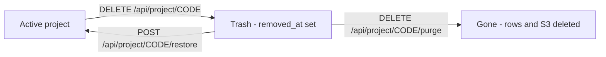

# Project API

> **Audience:** Staff (back-office) · **Base path:** `/api/project` · **Source:** `src/main/java/ak/dev/khi_archive_platform/platform/api/project/ProjectAPI.java`

A project (called a *collection* in the UI) groups media records — audio, video, image, text —
under one code, optionally attached to a person and always attached to at least one category.
This API is the staff-side CRUD surface for projects: create (single or bulk), update, control
public visibility with an optional cascade to the child media, and run the trash lifecycle
(soft-trash → restore → purge).

## Access

| Requirement | Value |
|---|---|
| Authentication | required (JWT in the `Authorization: Bearer` header, read first, or the `khi_auth_token` HttpOnly cookie) |
| Authority | per method — `project:read`, `project:create`, `project:update`, `project:delete` |
| Roles that hold `project:read` / `:create` / `:update` by default | ADMIN (via role), EMPLOYEE (seeded grants) |
| Roles that hold `project:delete` by default | ADMIN only |

There is **no class-level `@PreAuthorize`** on `ProjectAPI` — every method carries its own
`@PreAuthorize`, and the exact authority is repeated in each endpoint section below.

`project:delete` is the trash-lifecycle authority. It gates `DELETE`, `POST .../restore`,
`GET /api/project/trash` and `DELETE .../purge`. `restore`, `getTrash` and `purge` additionally
re-check the same `project:delete` authority inside `ProjectService.requireAdminRole(...)`, which
throws `AccessDeniedException` → `403 ACCESS_DENIED`. In practice these four endpoints are
admin-only, because `project:delete` is not part of `EMPLOYEE_DEFAULT_PERMISSIONS`
(`user/enums/Role.java`) — the check is on the authority, not on `ROLE_ADMIN`, so a non-admin who
has been granted `project:delete` through the per-user grants endpoint passes both gates.

`project:remove` exists in `user/enums/Permission.java` but no project endpoint uses it.

**Authentication errors** are produced before the controller by the JWT filter and entry point,
so they are the same on every endpoint below and are not repeated in the per-endpoint tables:

| Status | `error` code | When |
|---|---|---|
| `401` | `TOKEN_MISSING` | No `khi_auth_token` cookie and no `Authorization: Bearer` header |
| `401` | `TOKEN_EXPIRED` | Token past its expiry |
| `401` | `TOKEN_REVOKED` | Token blacklisted or its session was ended |
| `401` | `TOKEN_MALFORMED` / `TOKEN_INVALID_SIGNATURE` / `TOKEN_INVALID` | Token unparsable, resigned, or otherwise rejected |
| `401` | `AUTHENTICATION_FAILED` | Authentication present but rejected |

## Endpoints

| Method | Path | Authority | Purpose |
|---|---|---|---|
| `GET` | `/api/project` | `project:read` | Paged list of active projects (cache-backed) |
| `GET` | `/api/project/trash` | `project:delete` | Paged list of trashed projects |
| `GET` | `/api/project/{projectCode}` | `project:read` | One active project by code |
| `POST` | `/api/project` | `project:create` | Create one project |
| `POST` | `/api/project/bulk` | `project:create` | Bulk-create projects, skipping bad rows |
| `PATCH` | `/api/project/{projectCode}` | `project:update` | Partial update, incl. visibility + cascade |
| `PATCH` | `/api/project/{projectCode}/visibility` | `project:update` | Visibility-only toggle, incl. cascade |
| `DELETE` | `/api/project/{projectCode}` | `project:delete` | Soft-trash the project and its media |
| `POST` | `/api/project/{projectCode}/restore` | `project:delete` | Restore from trash, cascading to its media |
| `DELETE` | `/api/project/{projectCode}/purge` | `project:delete` | Permanently delete a trashed project + media + S3 files |

`GET /api/project/trash` is a literal path and takes precedence over the
`GET /api/project/{projectCode}` template, so the code `trash` is not addressable through the
detail endpoint.

---

### `GET /api/project`

Paged list of every **active** (not trashed) project.

**Authority:** `project:read`

**Query parameters**

| Name | Type | Default | Description |
|---|---|---|---|
| `page` | int | `0` | Zero-based page index |
| `size` | int | `100` | Page size, from `@PageableDefault(size = 100)` |
| `sort` | string | none | Bound into `Pageable` by Spring, but **has no effect** — `PaginationSupport.sliceList` uses only offset and page size. Rows always come back in `project.id` ascending order (`ProjectRepository.findAllActive`) |

No filter-params class exists for projects. Unlike the media and person endpoints, this list has
**no** `@ModelAttribute` filter object — a `ProjectFilterParams` type is not present in the source
tree, so there are no search, tag, category, visibility or date filters here.

**Response** `200 OK`

Standard Spring `Page` envelope (see [`../01-conventions.md`](../01-conventions.md)); `content[]`
elements are `ProjectResponseDTO`:

```json
{
  "content": [
    {
      "id": 42,
      "projectCode": "PER-000012-PROJ-000003",
      "projectName": "Erbil Radio Reels 1978",
      "personId": 12,
      "personCode": "PER-000012",
      "personName": "Kamaran Ahmed",
      "categories": [
        { "id": 3, "categoryCode": "CAT-MUSIC", "categoryName": "Music" }
      ],
      "description": "Reel-to-reel transfers from the Erbil radio archive.",
      "tags": ["radio", "reel"],
      "keywords": ["erbil", "1978"],
      "isVisibleToPublic": true,
      "createdAt": "2026-06-14T08:12:44.512Z",
      "updatedAt": "2026-08-02T11:41:07.883Z",
      "createdBy": "amina",
      "updatedBy": "amina"
    }
  ],
  "totalElements": 1,
  "totalPages": 1,
  "number": 0,
  "size": 100,
  "first": true,
  "last": true,
  "numberOfElements": 1,
  "empty": false
}
```

`personId`, `personCode`, `personName` are absent for projects with no person link, and
`removedAt` / `removedBy` are absent for active projects — `spring.jackson.default-property-inclusion=non_null`
drops every null field.

**Errors**

| Status | `error` code | When |
|---|---|---|
| `403` | `ACCESS_DENIED` | Caller lacks `project:read`; `details.requiredAuthority` echoes it |
| `500` | `DATABASE_ERROR` | Read failed at the database layer |

**Example**

```bash
curl -s "{{BASE_URL}}/api/project?page=0&size=20" \
  -H "Cookie: khi_auth_token=$TOKEN"
```

**Notes**

- Served from the Caffeine cache `projects:all` (`platform/config/CacheConfig.java`: one entry,
  10-minute TTL) via `ProjectReadCache.getAllActive()`. The cache holds the full active list as
  DTOs; the page is sliced in memory.
- Audit: one `LIST` row in `project_audit_logs` per call — the cache fronts the read, never the
  audit write. The row has no `projectId` / `projectCode`; `details` records page, size, returned
  and total counts.

---

### `GET /api/project/trash`

Paged list of trashed projects (`removed_at IS NOT NULL`).

**Authority:** `project:delete`

**Query parameters**

| Name | Type | Default | Description |
|---|---|---|---|
| `page` | int | `0` | Zero-based page index |
| `size` | int | `100` | Page size, from `@PageableDefault(size = 100)` |
| `sort` | string | none | Bound but ignored — same in-memory slice as `GET /api/project`. `findAllByRemovedAtIsNotNull()` carries no `ORDER BY`, so row order is whatever the database returns |

**Response** `200 OK`

Same `Page` envelope and `ProjectResponseDTO` shape as `GET /api/project`, except that trashed
rows carry the removal fields:

```json
{
  "content": [
    {
      "id": 51,
      "projectCode": "SLEMANI_TAPES-PROJ-000001",
      "projectName": "Slemani Tapes",
      "categories": [
        { "id": 7, "categoryCode": "CAT-AUDIO-ARCHIVE", "categoryName": "Audio Archive" }
      ],
      "tags": ["tapes"],
      "keywords": ["slemani"],
      "isVisibleToPublic": false,
      "createdAt": "2026-03-01T09:00:00.000Z",
      "updatedAt": "2026-08-20T14:05:31.204Z",
      "removedAt": "2026-08-20T14:05:31.204Z",
      "createdBy": "amina",
      "updatedBy": "amina",
      "removedBy": "admin"
    }
  ],
  "totalElements": 1,
  "totalPages": 1,
  "number": 0,
  "size": 100,
  "first": true,
  "last": true,
  "numberOfElements": 1,
  "empty": false
}
```

**Errors**

| Status | `error` code | When |
|---|---|---|
| `403` | `ACCESS_DENIED` | Caller lacks `project:delete` — from `@PreAuthorize`, or from the service's own `requireAdminRole(...)` re-check |
| `500` | `DATABASE_ERROR` | Read failed at the database layer |

**Example**

```bash
curl -s "{{BASE_URL}}/api/project/trash?page=0&size=50" \
  -H "Cookie: khi_auth_token=$TOKEN"
```

**Notes**

- **Not** cached — reads `ProjectRepository.findAllByRemovedAtIsNotNull()` on every call.
- Audit: one `LIST` row in `project_audit_logs`, `details` = `"Listed projects in trash (...)"`.

---

### `GET /api/project/{projectCode}`

Fetch one active project by its code.

**Authority:** `project:read`

**Path parameters**

| Name | Type | Description |
|---|---|---|
| `projectCode` | string | Project code; trimmed before lookup. Trashed projects are **not** returned |

**Response** `200 OK` — a single `ProjectResponseDTO`:

```json
{
  "id": 42,
  "projectCode": "PER-000012-PROJ-000003",
  "projectName": "Erbil Radio Reels 1978",
  "personId": 12,
  "personCode": "PER-000012",
  "personName": "Kamaran Ahmed",
  "categories": [
    { "id": 3, "categoryCode": "CAT-MUSIC", "categoryName": "Music" }
  ],
  "description": "Reel-to-reel transfers from the Erbil radio archive.",
  "tags": ["radio", "reel"],
  "keywords": ["erbil", "1978"],
  "isVisibleToPublic": true,
  "createdAt": "2026-06-14T08:12:44.512Z",
  "updatedAt": "2026-08-02T11:41:07.883Z",
  "createdBy": "amina",
  "updatedBy": "amina"
}
```

**Errors**

| Status | `error` code | When |
|---|---|---|
| `400` | `PROJECT_VALIDATION_ERROR` | Code is blank after trimming (e.g. `/api/project/%20`) |
| `403` | `ACCESS_DENIED` | Caller lacks `project:read` |
| `404` | `PROJECT_NOT_FOUND` | No active project with that code (a trashed project also yields 404 here) |
| `500` | `DATABASE_ERROR` | Read failed at the database layer |

**Example**

```bash
curl -s "{{BASE_URL}}/api/project/PER-000012-PROJ-000003" \
  -H "Cookie: khi_auth_token=$TOKEN"
```

**Notes**

- Bypasses `projects:all`; loads the row directly with an entity graph over `categories` and
  `person`.
- Audit: one `READ` row in `project_audit_logs` with `details` = `"Read project record"`.

---

### `POST /api/project`

Create one project.

**Authority:** `project:create`

**Request body** — `ProjectCreateRequestDTO` (`@Valid`, unknown properties ignored)

| Field | Type | Required | Description |
|---|---|---|---|
| `projectName` | string | yes | `@NotBlank` — "Project name is required" |
| `projectCode` | string | no | Client-supplied code, trimmed and used as-is (no pattern check). Blank/absent falls back to the generator below |
| `personCode` | string | no | Links the project to a person. Blank/absent ⇒ non-person project. Must match `^[A-Za-z0-9_-]+$` |
| `categoryCodes` | string[] | yes | `@NotEmpty` — at least one existing category code |
| `description` | string | no | Free text |
| `tags` | string[] | no | Canonicalized on save (`Tags.canonical`) |
| `keywords` | string[] | no | Canonicalized on save (`Keywords.canonical`) |
| `isVisibleToPublic` | boolean | no | Defaults to `true` when omitted. `false` hides the project from every guest API |

```json
{
  "projectName": "Erbil Radio Reels 1978",
  "personCode": "PER-000012",
  "categoryCodes": ["CAT-MUSIC"],
  "description": "Reel-to-reel transfers from the Erbil radio archive.",
  "tags": ["radio", "reel"],
  "keywords": ["erbil", "1978"],
  "isVisibleToPublic": true
}
```

**Response** `200 OK` — the created `ProjectResponseDTO` (the controller returns
`ResponseEntity.ok(...)`, **not** `201 Created`). Same shape as `GET /api/project/{projectCode}`.

**Errors**

| Status | `error` code | When |
|---|---|---|
| `400` | `VALIDATION_ERROR` | Bean validation failed — blank `projectName` or empty `categoryCodes`; per-field reasons in `details` |
| `400` | `PROJECT_VALIDATION_ERROR` | Missing payload, `categoryCodes` empty at the service layer, or `personCode` does not match `^[A-Za-z0-9_-]+$` |
| `400` | `BAD_REQUEST` | A category code contains characters outside letters, digits, `_`, `-` |
| `400` | `JSON_PARSE_ERROR` | Body is not valid JSON or a field has the wrong type |
| `403` | `ACCESS_DENIED` | Caller lacks `project:create` |
| `404` | `CATEGORY_NOT_FOUND` | A listed category code does not exist (or is trashed) |
| `404` | `PERSON_NOT_FOUND` | `personCode` does not match an active person |
| `409` | `PROJECT_ALREADY_EXISTS` | An active project already uses the resolved project code |
| `409` | `CONFLICT` | A database constraint blocked the insert (unique `project_code`, FK, NOT NULL) |
| `500` | `DATABASE_ERROR` | Insert failed at the database layer |

**Example**

```bash
curl -s -X POST "{{BASE_URL}}/api/project" \
  -H "Cookie: khi_auth_token=$TOKEN" \
  -H "Content-Type: application/json" \
  -d '{
        "projectName": "Erbil Radio Reels 1978",
        "personCode": "PER-000012",
        "categoryCodes": ["CAT-MUSIC"],
        "tags": ["radio"],
        "isVisibleToPublic": true
      }'
```

**Notes**

- **Code generation** (only when `projectCode` is blank/absent): prefix + `-PROJ-` + a six-digit
  sequence. The prefix is the person code upper-cased when `personCode` is given, otherwise the
  project name upper-cased with every non-`[A-Z0-9]` run collapsed to `_`. The sequence is
  `count(projects for that person, or with no person) + 1`, taken under a `CodeGenLock` keyed
  `project-code:<prefix>` — e.g. `PER-000012-PROJ-000003`, `SLEMANI_TAPES-PROJ-000001`.
- Audit: one `CREATE` row in `project_audit_logs`, `details` = `"Created project with code=… person=… categories=[…]"`.
  For a project with no person link the service puts the project code itself in the `person=`
  slot, so `person=` never appears empty.
- Cache: `ProjectReadCache.evictAll()` clears `projects:all` and, because project tags/keywords
  feed the cross-entity autocompletes, also `tags:suggest` and `keywords:suggest`.

---

### `POST /api/project/bulk`

Bulk-create projects in one transaction, skipping rows that cannot be inserted.

**Authority:** `project:create`

**Request body** — a JSON **array** of `ProjectCreateRequestDTO` (fields exactly as in
`POST /api/project`). The controller declares the parameter
`@Valid @RequestBody List<ProjectCreateRequestDTO>`; per-row admissibility is decided inside
`ProjectService.createAll(...)` by the skip rules below.

```json
[
  {
    "projectName": "Slemani Tapes",
    "categoryCodes": ["CAT-AUDIO-ARCHIVE"],
    "tags": ["tapes"]
  },
  {
    "projectName": "Erbil Radio Reels 1979",
    "personCode": "PER-000012",
    "categoryCodes": ["CAT-MUSIC"],
    "isVisibleToPublic": false
  }
]
```

A row is **skipped** (counted in `skipped`, never failing the request) when it is `null`, when
`projectName` is null/blank, when `categoryCodes` is null/empty, when its categories or person
cannot be resolved, or when its resolved project code already belongs to an active project.

**Response** `200 OK` — `ProjectService.BulkCreateResult`

| Field | Type | Description |
|---|---|---|
| `requested` | int | Number of elements in the submitted array |
| `inserted` | int | Rows actually saved |
| `skipped` | int | Rows rejected by the rules above |
| `elapsedMs` | long | Wall-clock duration of the batch |

```json
{
  "requested": 2,
  "inserted": 2,
  "skipped": 0,
  "elapsedMs": 41
}
```

An empty array short-circuits to `{"requested":0,"inserted":0,"skipped":0,"elapsedMs":0}` without
touching the database or writing an audit row.

**Errors**

| Status | `error` code | When |
|---|---|---|
| `400` | `JSON_PARSE_ERROR` | Body is not a valid JSON array or an element has the wrong field types |
| `403` | `ACCESS_DENIED` | Caller lacks `project:create` |
| `409` | `CONFLICT` | A database constraint blocked the batch (the whole transaction rolls back) |
| `500` | `DATABASE_ERROR` | Insert failed at the database layer |

**Example**

```bash
curl -s -X POST "{{BASE_URL}}/api/project/bulk" \
  -H "Cookie: khi_auth_token=$TOKEN" \
  -H "Content-Type: application/json" \
  -d '[{"projectName":"Slemani Tapes","categoryCodes":["CAT-AUDIO-ARCHIVE"]}]'
```

**Notes**

- Codes are generated with an in-memory per-prefix counter (one `count()` and one `CodeGenLock`
  per prefix, not per row), so a batch of 500 projects under one person issues one count query.
- `createdAt` / `updatedAt` / `createdBy` / `updatedBy` are stamped on every inserted row from a
  single batch timestamp and the caller's username.
- Audit: exactly **one** summary `CREATE` row in `project_audit_logs` with no `projectId` /
  `projectCode`; `details` = `"Bulk created projects: requested=… inserted=… skipped=… elapsedMs=…"`.
  Per-project audit rows are not written for bulk inserts.
- Cache: `projects:all`, `tags:suggest`, `keywords:suggest` evicted once at the end.

---

### `PATCH /api/project/{projectCode}`

Partial update of an active project, including the public-visibility flag and its optional
cascade to child media.

**Authority:** `project:update`

**Path parameters**

| Name | Type | Description |
|---|---|---|
| `projectCode` | string | Code of an active project; trimmed before lookup |

**Request body** — `ProjectUpdateRequestDTO` (no `@Valid`; unknown properties ignored). Every
field is optional and `null` means "no change".

| Field | Type | Description |
|---|---|---|
| `projectName` | string | New name; applied only when different from the current value |
| `description` | string | New description; applied only when different |
| `categoryCodes` | string[] | **Replaces** the whole category list when present |
| `tags` | string[] | Replaces the whole tag list; canonicalized (`Tags.canonical`) |
| `keywords` | string[] | Replaces the whole keyword list; canonicalized (`Keywords.canonical`) |
| `isVisibleToPublic` | boolean | Project-level public flag. `null` = no change |
| `visibilityCascade` | string | `CASCADE` or `NONE` (case-insensitive; anything else behaves as `NONE`). Ignored unless `isVisibleToPublic` is also sent **and** actually changes the stored value |

```json
{
  "projectName": "Erbil Radio Reels 1978 (restored)",
  "categoryCodes": ["CAT-MUSIC", "CAT-RADIO"],
  "tags": ["radio", "reel", "erbil"],
  "isVisibleToPublic": false,
  "visibilityCascade": "CASCADE"
}
```

**Response** `200 OK` — the updated `ProjectResponseDTO` (same shape as
`GET /api/project/{projectCode}`). The response body reflects the **project** row; the cascade
counts are not returned here — they are recorded in the audit `details`.

**Errors**

| Status | `error` code | When |
|---|---|---|
| `400` | `PROJECT_VALIDATION_ERROR` | `projectCode` blank after trimming |
| `400` | `BAD_REQUEST` | A supplied category code contains illegal characters |
| `400` | `JSON_PARSE_ERROR` | Body is not valid JSON or a field has the wrong type |
| `403` | `ACCESS_DENIED` | Caller lacks `project:update` |
| `404` | `PROJECT_NOT_FOUND` | No active project with that code |
| `404` | `CATEGORY_NOT_FOUND` | A code in `categoryCodes` does not resolve to an active category |
| `409` | `STALE_VERSION` | Someone else saved the project (or a cascaded media row) first — `@Version` conflict; `details.entity` names the entity |
| `409` | `CONFLICT` | A database constraint blocked the update |
| `500` | `DATABASE_ERROR` | Update failed at the database layer |

**Example**

```bash
# Hide the project and every one of its active media records from guests
curl -s -X PATCH "{{BASE_URL}}/api/project/PER-000012-PROJ-000003" \
  -H "Cookie: khi_auth_token=$TOKEN" \
  -H "Content-Type: application/json" \
  -d '{"isVisibleToPublic": false, "visibilityCascade": "CASCADE"}'
```

**Notes**

- The cascade fires only when **all three** hold: `isVisibleToPublic` is present, the value
  differs from what is stored, and `visibilityCascade` equals `CASCADE` ignoring case. Re-sending
  the value the project already has performs no cascade even with `CASCADE` — see
  [Visibility model](#visibility-model).
- Cascade order is audio → video → image → text; each is a single bulk `UPDATE` limited to active
  rows (`removed_at IS NULL`) whose `isPublic` differs from the new value **or is `NULL`**, and it
  bumps each touched row's `version` and stamps `updatedAt` / `updatedBy`.
- Audit: one `UPDATE` row in `project_audit_logs`. `details` is `"Updated project: "` followed by a
  `field: old -> new | …` diff (trailing ` | ` trimmed) and, when a cascade ran, ends with
  `visibilityCascade: ALL_MEDIA -> isPublic=<value> (audios=… videos=… images=… texts=…)`.
  With no effective changes, `details` = `"Updated project (no field changes detected)"` — without
  the `"Updated project: "` prefix.
- Cache: `projects:all` + `tags:suggest` + `keywords:suggest` always evicted; `audios:all`,
  `videos:all`, `images:all`, `texts:all` evicted only for the media types the cascade actually
  touched.

---

### `PATCH /api/project/{projectCode}/visibility`

Visibility-only toggle. A thin wrapper that builds a `ProjectUpdateRequestDTO` carrying just the
two visibility fields and runs the same service path as `PATCH /api/project/{projectCode}`, so
cascade, audit and cache eviction behave identically.

**Authority:** `project:update`

**Path parameters**

| Name | Type | Description |
|---|---|---|
| `projectCode` | string | Code of an active project |

**Request body** — `ProjectVisibilityUpdateRequest` (`@Valid`)

| Field | Type | Required | Description |
|---|---|---|---|
| `isVisibleToPublic` | boolean | yes | `@NotNull` — "isVisibleToPublic is required" |
| `visibilityCascade` | string | no | `CASCADE` or `NONE`; defaults to `NONE` when omitted |

```json
{
  "isVisibleToPublic": true,
  "visibilityCascade": "CASCADE"
}
```

**Response** `200 OK` — the updated `ProjectResponseDTO`.

**Errors**

| Status | `error` code | When |
|---|---|---|
| `400` | `VALIDATION_ERROR` | `isVisibleToPublic` missing or `null`; `details.isVisibleToPublic` carries the message |
| `400` | `PROJECT_VALIDATION_ERROR` | `projectCode` blank after trimming |
| `400` | `JSON_PARSE_ERROR` | Body is not valid JSON or `isVisibleToPublic` is not a boolean |
| `403` | `ACCESS_DENIED` | Caller lacks `project:update` |
| `404` | `PROJECT_NOT_FOUND` | No active project with that code |
| `409` | `STALE_VERSION` | Concurrent edit on the project or a cascaded media row |
| `500` | `DATABASE_ERROR` | Update failed at the database layer |

**Example**

```bash
# Publish the collection but leave per-media isPublic overrides alone
curl -s -X PATCH "{{BASE_URL}}/api/project/PER-000012-PROJ-000003/visibility" \
  -H "Cookie: khi_auth_token=$TOKEN" \
  -H "Content-Type: application/json" \
  -d '{"isVisibleToPublic": true}'
```

**Notes**

- Because it delegates to the full update path, the audit row is a `ProjectAuditAction.UPDATE`,
  not a separate visibility action. `requestPath` stores the full request URI
  (`request.getRequestURI()`), so rows from this endpoint read
  `/api/project/<code>/visibility` — the `/visibility` suffix is how the two entry points are
  told apart in `project_audit_logs`.

---

### `DELETE /api/project/{projectCode}`

Soft delete — sends the project **and its media** to the trash. Nothing is removed from the
database and no S3 file is touched.

**Authority:** `project:delete`

**Path parameters**

| Name | Type | Description |
|---|---|---|
| `projectCode` | string | Code of an active project |

**Response** `204 No Content` — empty body.

**Errors**

| Status | `error` code | When |
|---|---|---|
| `400` | `PROJECT_VALIDATION_ERROR` | `projectCode` blank after trimming |
| `403` | `ACCESS_DENIED` | Caller lacks `project:delete` |
| `404` | `PROJECT_NOT_FOUND` | No active project with that code (already trashed ⇒ 404) |
| `409` | `STALE_VERSION` | Concurrent edit on the project or one of its media rows |
| `409` | `CONFLICT` | A database constraint blocked the update |
| `500` | `DATABASE_ERROR` | Update failed at the database layer |

`409 PROJECT_IN_USE` is reachable through `ApiExceptionHandler.handleProjectInUse(...)`
(hint: "Move or trash the linked media before deleting this project."), but **no code path in the
source tree throws `ProjectInUseException`** — the project trash flow cascades to media instead of
refusing. Treat `PROJECT_IN_USE` as a reserved code the frontend should handle defensively; it is
not produced by any endpoint in this file today.

**Example**

```bash
curl -s -i -X DELETE "{{BASE_URL}}/api/project/PER-000012-PROJ-000003" \
  -H "Cookie: khi_auth_token=$TOKEN"
```

**Notes**

- Sets `removed_at` / `removed_by` on the project, then bulk soft-trashes every **active**
  audio, video, image and text whose `project` is this project (each bulk `UPDATE` bumps the
  media `version`).
- The linked person and the categories are deliberately untouched — they are shared resources.
- Audit: one `DELETE` row in `project_audit_logs` with
  `details` = `"Sent project to trash (audios=… videos=… images=… texts=…)"`, **plus** one
  `DELETE` row per cascaded media in that media type's own audit table
  (`audio_audit_logs`, `video_audit_logs`, `image_audit_logs`, `text_audit_logs`) with
  `details` = `"Trashed via project cascade (project=<code>)"`.
- Cache: `ProjectReadCache.evictAll()` always runs, clearing `projects:all`, `tags:suggest` and
  `keywords:suggest`; `audios:all` / `videos:all` / `images:all` / `texts:all` are evicted only for
  the media types that actually had rows trashed.

---

### `POST /api/project/{projectCode}/restore`

Bring a trashed project back, cascading to every media record that is currently in the trash for
that project.

**Authority:** `project:delete`

**Path parameters**

| Name | Type | Description |
|---|---|---|
| `projectCode` | string | Code of a project currently in the trash |

**Request body** — none.

**Response** `200 OK` — `ProjectService.RestoreResult`

| Field | Type | Description |
|---|---|---|
| `project` | object | The restored `ProjectResponseDTO` |
| `restoredAudios` | int | Audio rows brought back |
| `restoredVideos` | int | Video rows brought back |
| `restoredImages` | int | Image rows brought back |
| `restoredTexts` | int | Text rows brought back |

```json
{
  "project": {
    "id": 51,
    "projectCode": "SLEMANI_TAPES-PROJ-000001",
    "projectName": "Slemani Tapes",
    "categories": [
      { "id": 7, "categoryCode": "CAT-AUDIO-ARCHIVE", "categoryName": "Audio Archive" }
    ],
    "tags": ["tapes"],
    "keywords": ["slemani"],
    "isVisibleToPublic": false,
    "createdAt": "2026-03-01T09:00:00.000Z",
    "updatedAt": "2026-08-26T10:22:19.640Z",
    "createdBy": "amina",
    "updatedBy": "admin"
  },
  "restoredAudios": 12,
  "restoredVideos": 0,
  "restoredImages": 3,
  "restoredTexts": 0
}
```

`removedAt` / `removedBy` are cleared by the restore, so they are absent from the returned
project.

**Errors**

| Status | `error` code | When |
|---|---|---|
| `400` | `PROJECT_VALIDATION_ERROR` | `projectCode` blank, or the project is not in trash ("Project is not in trash: …") |
| `403` | `ACCESS_DENIED` | Caller lacks `project:delete` (from `@PreAuthorize` or the service re-check) |
| `404` | `PROJECT_NOT_FOUND` | No project with that code, trashed or active |
| `409` | `PROJECT_ALREADY_EXISTS` | An **active** project already occupies this code, so restoring would duplicate it |
| `409` | `STALE_VERSION` | Concurrent edit on the project or one of its media rows |
| `500` | `DATABASE_ERROR` | Update failed at the database layer |

**Example**

```bash
curl -s -X POST "{{BASE_URL}}/api/project/SLEMANI_TAPES-PROJ-000001/restore" \
  -H "Cookie: khi_auth_token=$TOKEN"
```

**Notes**

- Only media rows that are **currently trashed** are restored; media trashed independently before
  the project went to trash come back too, since the cascade query keys on
  `project = :project AND removedAt IS NOT NULL`.
- `isVisibleToPublic` and the per-media `isPublic` flags are **not** changed by a restore — a
  project that was hidden when trashed comes back hidden.
- Audit: one `RESTORE` row in `project_audit_logs` with
  `details` = `"Restored project from trash (audios=… videos=… images=… texts=…)"`, plus one
  `RESTORE` row per media in that type's audit table with
  `details` = `"Restored via project cascade (project=<code>)"`.
- Cache: `ProjectReadCache.evictAll()` always runs, clearing `projects:all`, `tags:suggest` and
  `keywords:suggest`; media list caches are evicted per type that had restored rows.

---

### `DELETE /api/project/{projectCode}/purge`

Permanently delete a trashed project, all of its media rows (trashed **or** active), and their S3
objects. Irreversible.

**Authority:** `project:delete`

**Path parameters**

| Name | Type | Description |
|---|---|---|
| `projectCode` | string | Code of a project already in the trash |

**Response** `204 No Content` — empty body.

**Errors**

| Status | `error` code | When |
|---|---|---|
| `400` | `PROJECT_VALIDATION_ERROR` | `projectCode` blank, or the project is not in trash ("Project must be in trash before permanent deletion. Trash it first.") |
| `403` | `ACCESS_DENIED` | Caller lacks `project:delete` (from `@PreAuthorize` or the service re-check) |
| `404` | `PROJECT_NOT_FOUND` | No project with that code |
| `409` | `CONFLICT` | A foreign key still references the project or one of its media rows |
| `500` | `DATABASE_ERROR` | Delete failed at the database layer |
| `500` | `INTERNAL_SERVER_ERROR` | Any other unexpected server-side failure |

A failed S3 deletion is **not** one of these: `S3Service.deleteByKey(...)` catches `S3Exception`,
logs it and returns `false`, so the database purge continues and the endpoint still answers
`204`. An object that could not be removed is left orphaned in the bucket.

**Example**

```bash
curl -s -i -X DELETE "{{BASE_URL}}/api/project/SLEMANI_TAPES-PROJ-000001/purge" \
  -H "Cookie: khi_auth_token=$TOKEN"
```

**Notes**

- Deletes S3 objects first — `audioFileUrl`, `videoFileUrl`, `imageFileUrl`, and for texts both
  `textFileUrl` and `coverImageUrl` — and only for URLs that `S3Service.isOurS3Url(...)` accepts
  (the URL contains the configured bucket name and `.s3.`). Deletion is best-effort: an S3 failure
  is logged and swallowed, never propagated.
- The media purge covers **every** row linked to the project (`findAllByProject`), not just the
  trashed ones.
- The linked person and the categories survive the purge.
- Audit: one `PURGE` row per media in that media type's audit table
  (`details` = `"Purged via project cascade (project=<code>)"`) written **before** the rows are
  deleted, then one `PURGE` row in `project_audit_logs` with
  `details` = `"Permanently deleted project (audios=… videos=… images=… texts=…)"`, written before
  the project row itself is removed.
- Cache: `ProjectReadCache.evictAll()` always runs, clearing `projects:all`, `tags:suggest` and
  `keywords:suggest`; media list caches are evicted per type that had rows.

---

## Visibility model

Two independent flags decide whether an item reaches the public site:

| Flag | Where | Default |
|---|---|---|
| `Project.isVisibleToPublic` | `projects.is_visible_to_public`, `BOOLEAN NOT NULL DEFAULT TRUE` | `true` |
| `isPublic` | one per media entity (Audio / Video / Image / Text) | see the media docs |

A guest sees a media record only when **both** flags are true. Staff (`project:read`) always see
every project regardless of the flag.

Cascade contract, exactly as implemented in `ProjectService.update(...)`:

| `isVisibleToPublic` | `visibilityCascade` | Effect |
|---|---|---|
| omitted / `null` | anything | Nothing changes; cascade is ignored |
| sent, same as stored value | `CASCADE` | **No cascade** — the guard requires the flag to actually change |
| sent, new value | omitted / `NONE` / anything else | Project flag only; per-media `isPublic` preserved |
| `true` | `CASCADE` | Project flag → `true`, and every active media under it gets `isPublic = true` |
| `false` | `CASCADE` | Project flag → `false`, and every active media under it gets `isPublic = false` |

Cascade details: only active rows (`removed_at IS NULL`) are touched, and only those matching
`is_public IS NULL OR is_public <> :isPublic`, so the `version` bump and the
`updatedAt` / `updatedBy` stamp land only on rows that changed. The counts per type are recorded in
the project audit `details`, and the bulk `UPDATE` runs **after** the project row is saved so a
rollback keeps project and media consistent.

## Trash model



- `DELETE` never removes data — it is a soft-trash, and it cascades to the project's media.
- Trashed projects disappear from `GET /api/project` and from `GET /api/project/{projectCode}`
  (both filter on `removed_at IS NULL`); they are listed only by `GET /api/project/trash`.
- `restore` and `purge` both require the project to already be in trash, and both refuse otherwise
  with `400 PROJECT_VALIDATION_ERROR`.
- Categories and the linked person are never trashed, restored or purged by these endpoints.

## Audit actions written to `project_audit_logs`

| Endpoint | `action` | Row identifies the project? |
|---|---|---|
| `GET /api/project` | `LIST` | no — page/size/total in `details` |
| `GET /api/project/trash` | `LIST` | no — page/size/total in `details` |
| `GET /api/project/{projectCode}` | `READ` | yes |
| `POST /api/project` | `CREATE` | yes |
| `POST /api/project/bulk` | `CREATE` | no — one summary row for the whole batch |
| `PATCH /api/project/{projectCode}` | `UPDATE` | yes |
| `PATCH /api/project/{projectCode}/visibility` | `UPDATE` | yes |
| `DELETE /api/project/{projectCode}` | `DELETE` | yes |
| `POST /api/project/{projectCode}/restore` | `RESTORE` | yes |
| `DELETE /api/project/{projectCode}/purge` | `PURGE` | yes |

`ProjectAuditAction` also declares `REMOVE`, but no project code path writes it.

Every row is written in a `REQUIRES_NEW` transaction — the audit survives even if the surrounding
business transaction later rolls back — and captures the project snapshot (`projectId`,
`projectCode`, `projectName`, `personId`, `personCode`, `personName`, comma-joined
`categoryCodes`), the actor (`actorUserId`, `actorUsername`, `actorDisplayName`,
`actorAuthorities`, `actorPermissions`), the session (`sessionId`, `deviceInfo`, `ipAddress`,
`sessionLoginTimestamp`, `sessionExpiresAt`, `sessionActive`), the request (`requestMethod`,
`requestPath`), HTML-escaped `details`, and `occurredAt`.

## Related

- [Internal docs index](../README.md)
- [Conventions — page envelope, timestamps, error envelope](../01-conventions.md)
- [Person API](./person.md) — the optional owner of a project; person delete cascades to projects
- [Category API](./category.md) — the codes accepted in `categoryCodes`
- [Audio API](./audio.md), [Video API](./video.md), [Image API](./image.md),
  [Text API](./text.md) — the media that carry the per-record `isPublic` flag this API cascades to
