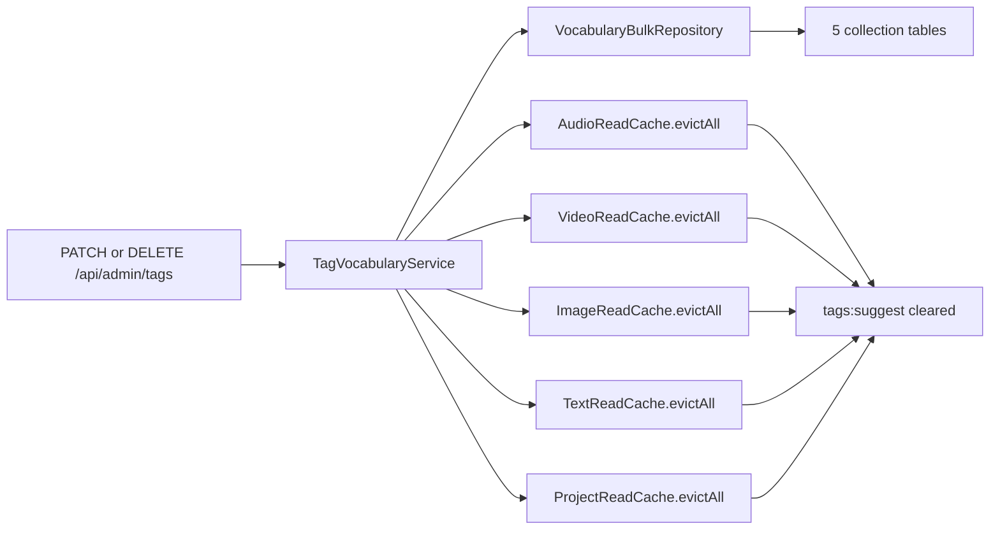

# Tags and Keywords API

> **Audience:** Staff (EMPLOYEE/TEACHER for autocomplete, ADMIN for vocabulary management) ·
> **Base path:** `/api/tags`, `/api/keywords`, `/api/admin/tags`, `/api/admin/keywords` ·
> **Source:** `platform/api/tag/TagAPI.java`, `platform/api/tag/AdminTagAPI.java`,
> `platform/api/keyword/KeywordAPI.java`, `platform/api/keyword/AdminKeywordAPI.java`

Tags and keywords are free-text vocabularies stored as JPA `@ElementCollection` tables hanging off
the content entities. This document covers the two autocomplete endpoints the pickers call while
staff type, and the two ADMIN-only vocabulary surfaces that list, globally rename/merge, and
globally delete a value across every table that holds it.

## Why the vocabulary has no table of its own

There is no `tags` table and no `keywords` table. Each vocabulary is a **derived** view over those
collection tables — five for tags, six for keywords — and one value such as `sulaimaniyah` can sit on
an audio, a video and a project at the same time. Every endpoint in this document treats those
occurrences as one cross-entity set (`TagSuggestRepository` javadoc).

Two consequences worth designing around:

| Consequence | What it means for a caller |
|---|---|
| The canonical string **is** the identity | There is no tag id to store or reference. A client that wants to pin a value stores the canonical string, and "renaming" is a global rewrite of that string across every table — not an update of one row that everything else points at |
| A value has **no lifecycle of its own** | It exists exactly as long as some record carries it. Saving a record that uses a value is the only thing that creates it; removing it from the last record that carries it — or `DELETE /api/admin/tags` — is the only thing that removes it |

There is therefore no create endpoint in this document, and its absence is the design, not an
omission.

## Access

| Requirement | Value |
|---|---|
| Authentication | required (all eight endpoints — `/api/**` is `.authenticated()` in `SecurityConfig`) |
| Authority — `/api/tags/suggest`, `/api/keywords/suggest` | none beyond authentication; neither controller carries `@PreAuthorize` |
| Authority — `/api/admin/tags`, `/api/admin/keywords` | `hasRole('ADMIN')` — declared **on the class** (`AdminTagAPI`, `AdminKeywordAPI`), so it applies to every method in both controllers |
| Roles that hold it by default | Autocomplete: ADMIN, EMPLOYEE, TEACHER, GUEST (any signed-in account). Admin vocabulary: ADMIN only |

There is no `tag:*` or `keyword:*` entry in `user/enums/Permission.java` — the vocabulary is gated
by the ADMIN role itself, not by a grantable per-user permission.

## Endpoints

| Method | Path | Authority | Purpose |
|---|---|---|---|
| `GET` | `/api/tags/suggest` | authenticated (no `@PreAuthorize`) | Ranked tag autocomplete across 5 tables |
| `GET` | `/api/keywords/suggest` | authenticated (no `@PreAuthorize`) | Ranked keyword autocomplete across 6 tables |
| `GET` | `/api/admin/tags` | `hasRole('ADMIN')` (class-level) | Distinct tags with live usage counts |
| `PATCH` | `/api/admin/tags` | `hasRole('ADMIN')` (class-level) | Rename/merge a tag everywhere |
| `DELETE` | `/api/admin/tags` | `hasRole('ADMIN')` (class-level) | Remove a tag everywhere |
| `GET` | `/api/admin/keywords` | `hasRole('ADMIN')` (class-level) | Distinct keywords with live usage counts |
| `PATCH` | `/api/admin/keywords` | `hasRole('ADMIN')` (class-level) | Rename/merge a keyword everywhere |
| `DELETE` | `/api/admin/keywords` | `hasRole('ADMIN')` (class-level) | Remove a keyword everywhere |

---

## Canonicalization

Both vocabularies share one algorithm, implemented in
`platform/service/common/Tags.java` (inner `TextListCanonicalizer`) and re-exposed for keywords by
`platform/service/common/Keywords.java`. Only the length cap differs.

| Step | Behavior |
|---|---|
| 1. Unicode normalize | `Normalizer.Form.NFKC` — half-width forms, ligatures and compatibility characters collapse |
| 2. Zero-width joiners | U+200C and U+200D are replaced with a space |
| 3. Trim + collapse | `trim()` then `\s+` → a single space |
| 4. Reject empty / over-length | Empty after trimming, or longer than the cap → the value is **rejected**, not truncated (`canonicalOne` returns `null`) |
| 5. Lower-case | `toLowerCase(Locale.ROOT)` |
| 6. Dedupe (collections only) | `LinkedHashSet`, first occurrence wins; blanks dropped |

| Vocabulary | Constant | Cap |
|---|---|---|
| Tags | `Tags.MAX_TAG_LENGTH` | **64** characters |
| Keywords | `Keywords.MAX_KEYWORD_LENGTH` | **200** characters |

Every entity that owns a `List<String> tags` (Audio, Video, Image, Text, Project) runs the list
through `Tags.canonical(...)` before persisting; every entity that owns keywords (the same five
plus Category) runs it through `Keywords.canonical(...)`. The suggest and admin endpoints apply
`canonicalOne(...)` to their inputs, so callers never need to pre-process — `"  SULA  "`,
`"Sula"` and `"sula"` all resolve to the same value and the same cache key.

Order-of-operations note: the length check runs **before** lower-casing, and rejection is silent
at save time (an over-length tag is simply dropped from the persisted list). Across the endpoints
in this document rejection surfaces two different ways: the four read surfaces
(`GET /api/tags/suggest`, `GET /api/keywords/suggest`, `GET /api/admin/tags`,
`GET /api/admin/keywords`) return `[]` without touching the DB, while the mutating admin surfaces
(`PATCH` and `DELETE`) return `400`.

`Person` stores both of its discovery fields — `tag` and `keywords` — as single delimited `TEXT`
columns rather than collection tables (`platform/model/person/Person.java`), so they sit outside
this system entirely: they are not canonicalized by `Tags`/`Keywords`, never appear in either
autocomplete, and are deliberately **not** touched by any endpoint in this document
(`TagVocabularyService` javadoc).

Matching is case-insensitive in SQL, not only on input. Every admin statement compares
`LOWER(<value column>) = :canonical` rather than `<value column> = :canonical`, and both suggest
queries select `LOWER(...)`. The columns are plain `TEXT` with no constraint, so rows can exist that
the canonicalizer never saw — written before it was introduced, or inserted directly with SQL. The
`LOWER(...)` is the deliberate hedge that lets a rename or delete still reach them
(`TagSuggestRepository`, inline comment on the union).

It rescues case only. A legacy row that differs by *whitespace* or Unicode form — say a literal
`folk  music` with two spaces — appears in `GET /api/admin/tags` as its own distinct value, because
the listing lower-cases but does not collapse whitespace. Yet it cannot be targeted: `PATCH` and
`DELETE` canonicalize the caller's input first, so `folk  music` becomes `folk music` and the
statement matches the *clean* rows instead. A `PATCH` from `folk  music` to `folk music`
canonicalizes both sides to the same string and returns the `renamed: 0, merged: 0` no-op. Such rows
have to be fixed by re-saving the owning record through its normal update endpoint, which re-runs
`Tags.canonical(...)` over the whole list.

---

## Tag autocomplete — `TagAPI`

Class-level `@RequestMapping("/api/tags")`. No `@PreAuthorize` on the class or the method.

### `GET /api/tags/suggest`

Ranked tag autocomplete over the union of the five tag collection tables.

**Authority:** authenticated only (no `@PreAuthorize`)

**Query parameters**

| Name | Type | Default | Description |
|---|---|---|---|
| `q` | string | — (**required**) | Raw user input. Canonicalized server-side before matching. If it canonicalizes to `null` (blank, or > 64 chars) the endpoint returns `[]` without touching the DB. Minimum canonical length is `TagSuggestService.MIN_QUERY_LEN` = `1` |
| `limit` | int | `10` (`TagSuggestService.DEFAULT_LIMIT`) | Max rows. `null` or `<= 0` → default; otherwise clamped down to `TagSuggestService.MAX_LIMIT` = `25` |

**Tables scanned** (`TagSuggestRepository.suggest`) — each joined to its parent and filtered on
`removed_at IS NULL`, so trashed records do not pollute the autocomplete:

`audio_tags` → `audios` · `video_tags` → `videos` · `image_tags` → `images` ·
`text_tags` → `texts` · `project_tags` → `projects`

**Ranking** — `match_rank` ascending, then `usage_count` descending, then `value` ascending:

| `matchRank` | Meaning |
|---|---|
| `0` | Exact match — `value = q` |
| `1` | Prefix match — `value LIKE q || '%'` |
| `2` | Substring match — `value LIKE '%' || q || '%'` |

Rank `3` (no match) is filtered out by the query, so it never appears in a response.

**Response** `200 OK` — a plain JSON array of `TagSuggestionDTO`, not a `Page` envelope.
Example payload for `q=sula` — both values that start with `sula` rank `1` and are ordered by
usage, the value that merely contains it ranks `2`:

```json
[
  { "value": "sulaimaniyah", "usageCount": 42, "matchRank": 1 },
  { "value": "sulaimaniyah bazaar", "usageCount": 7, "matchRank": 1 },
  { "value": "bazaar sulaimaniyah", "usageCount": 3, "matchRank": 2 }
]
```

| Field | Type | Description |
|---|---|---|
| `value` | string | Canonical tag — already lower-cased and deduped, safe to insert verbatim |
| `usageCount` | long | Occurrences across audio + video + image + text + project on non-trashed parents |
| `matchRank` | int | `0` exact / `1` prefix / `2` substring — lower is more relevant |

An empty result is `[]`.

**Errors**

| Status | `error` code | When |
|---|---|---|
| `400` | `MISSING_PARAMETER` | `q` not supplied |
| `400` | `TYPE_MISMATCH` | `limit` is not parseable as an integer |
| `401` | `TOKEN_MISSING` | No `khi_auth_token` cookie on the request |
| `401` | `AUTHENTICATION_FAILED` | Token present but expired, revoked, malformed or otherwise rejected |
| `500` | `DATABASE_ERROR` | The union query failed (`DataAccessException`) |
| `504` | `TIMEOUT` | The union query timed out (`QueryTimeoutException`) |

**Example**

```bash
# Tag picker: the user typed "sula"
curl -s "{{BASE_URL}}/api/tags/suggest?q=sula&limit=10" \
  -H "Cookie: khi_auth_token=$TOKEN"
```

**Notes** — cached in Caffeine region `tags:suggest`, keyed on
`Objects.hash(canonicalQ, effectiveLimit)`; 1 000 entries, 10-minute TTL (`CacheConfig`).
`TagSuggestService.suggest` canonicalizes first and then calls `lookup` through a self-injected
Spring proxy so `@Cacheable` actually fires.

---

## Keyword autocomplete — `KeywordAPI`

Class-level `@RequestMapping("/api/keywords")`. No `@PreAuthorize` on the class or the method.

### `GET /api/keywords/suggest`

Ranked keyword autocomplete over the union of the six keyword collection tables.

**Authority:** authenticated only (no `@PreAuthorize`)

**Query parameters**

| Name | Type | Default | Description |
|---|---|---|---|
| `q` | string | — (**required**) | Raw user input. Canonicalized server-side. Canonicalizes to `null` (blank, or > 200 chars) → `[]` with no DB hit. Minimum canonical length is `KeywordSuggestService.MIN_QUERY_LEN` = `1` |
| `limit` | int | `10` (`KeywordSuggestService.DEFAULT_LIMIT`) | Max rows. `null` or `<= 0` → default; otherwise clamped to `KeywordSuggestService.MAX_LIMIT` = `25` |

**Tables scanned** (`KeywordSuggestRepository.suggest`) — same trash-aware join on each parent's
`removed_at IS NULL`:

`audio_keywords` → `audios` · `video_keywords` → `videos` · `image_keywords` → `images` ·
`text_keywords` → `texts` · `project_keywords` → `projects` ·
`category_keywords` → `categories`

The sixth table is the only structural difference from tags: Category has keywords but no tags.

**Response** `200 OK` — plain JSON array of `KeywordSuggestionDTO`, identical shape to
`TagSuggestionDTO` so the frontend can reuse one dropdown component. Example payload for
`q=folk` — the prefix match ranks `1`, the phrase that only contains `folk` ranks `2`:

```json
[
  { "value": "folk music", "usageCount": 18, "matchRank": 1 },
  { "value": "traditional kurdish folk music", "usageCount": 5, "matchRank": 2 }
]
```

| Field | Type | Description |
|---|---|---|
| `value` | string | Canonical keyword — NFKC-normalized, whitespace-collapsed, lower-cased |
| `usageCount` | long | Occurrences across audio + video + image + text + project + category on non-trashed parents |
| `matchRank` | int | `0` exact / `1` prefix / `2` substring |

**Errors**

| Status | `error` code | When |
|---|---|---|
| `400` | `MISSING_PARAMETER` | `q` not supplied |
| `400` | `TYPE_MISMATCH` | `limit` is not parseable as an integer |
| `401` | `TOKEN_MISSING` | No `khi_auth_token` cookie on the request |
| `401` | `AUTHENTICATION_FAILED` | Token present but expired, revoked, malformed or otherwise rejected |
| `500` | `DATABASE_ERROR` | The union query failed (`DataAccessException`) |
| `504` | `TIMEOUT` | The union query timed out (`QueryTimeoutException`) |

**Example**

```bash
# Keyword picker: the user typed "folk"
curl -s "{{BASE_URL}}/api/keywords/suggest?q=folk&limit=10" \
  -H "Cookie: khi_auth_token=$TOKEN"
```

**Notes** — cached in Caffeine region `keywords:suggest`, same key strategy and same
1 000-entry / 10-minute tuning as `tags:suggest`.

---

## How the bulk operations execute

All three admin operations are native SQL run straight through the `EntityManager` by
`platform/repo/vocabulary/VocabularyBulkRepository.java`. No entity is loaded and no Hibernate
collection is rewritten, so the cost is **O(tables), not O(rows)**: renaming a tag carried by 40 000
records is the same handful of statements as renaming one carried by three
(`VocabularyBulkRepository` javadoc). That is why a global rename is offered as an ordinary
synchronous request instead of a background job.

| Operation | Statements |
|---|---|
| `list` | one query — `WITH v AS (… UNION ALL …)` over every table, then `GROUP BY value` |
| `rename` | two per table — the `UPDATE`, then the `ctid` de-duplication `DELETE` |
| `delete` | one per table |

The table names, value columns and FK columns are concatenated into those statements as SQL
identifiers. That is safe **only** because they come from the hardcoded `CollectionTableRef` catalog
in `TagVocabularyService` / `KeywordVocabularyService` and never from a request; the tag or keyword
*value* is always a bound parameter (`CollectionTableRef` javadoc). Preserve that split if you extend
the catalog — identifiers from the constant list, values through `setParameter`.

---

## Tag vocabulary administration — `AdminTagAPI`

Class-level `@RequestMapping("/api/admin/tags")` **and** class-level
`@PreAuthorize("hasRole('ADMIN')")` — every endpoint below requires `ROLE_ADMIN`.

Backed by `TagVocabularyService` over five `CollectionTableRef` entries. The request/response
records are shared with the keyword surface and live in `platform/dto/vocabulary/`
(`VocabularyItemDTO`, `VocabularyRenameRequest`, `VocabularyRenameResult`,
`VocabularyDeleteResult`):

| Collection table | Value column | FK column | Parent table |
|---|---|---|---|
| `audio_tags` | `tag` | `audio_id` | `audios` |
| `video_tags` | `tag` | `video_id` | `videos` |
| `image_tags` | `tag` | `image_id` | `images` |
| `text_tags` | `tag` | `text_id` | `texts` |
| `project_tags` | `tag` | `project_id` | `projects` |

### `GET /api/admin/tags`

Distinct tags with live usage counts, most-used first.

**Authority:** `hasRole('ADMIN')` (declared on the class)

**Query parameters**

| Name | Type | Default | Description |
|---|---|---|---|
| `q` | string | none (all values) | Optional substring filter. Canonicalized with `Tags.canonicalOne`; if it canonicalizes to `null` (i.e. longer than 64 chars) the endpoint short-circuits and returns `[]`. Blank/absent → no filter. Matched as `value LIKE '%' || :q || '%' ESCAPE '\'` |
| `limit` | int | `100` | Clamped: `null` or `<= 0` → `100`; otherwise `min(limit, 2000)` |
| `offset` | int | `0` | `null` or `< 0` → `0` |

Counting rule: only occurrences on **non-trashed** parents (`p.removed_at IS NULL`) are counted, so
this listing matches the `/api/tags/suggest` vocabulary exactly. Ordered by `usage_count DESC`,
then `value ASC`.

**Response** `200 OK` — plain JSON array of `VocabularyItemDTO`.

```json
[
  { "value": "sulaimaniyah", "usageCount": 42 },
  { "value": "1970s", "usageCount": 11 }
]
```

**Errors**

| Status | `error` code | When |
|---|---|---|
| `400` | `TYPE_MISMATCH` | `limit` or `offset` is not parseable as an integer |
| `401` | `TOKEN_MISSING` | No `khi_auth_token` cookie on the request |
| `401` | `AUTHENTICATION_FAILED` | Token present but expired, revoked, malformed or otherwise rejected |
| `403` | `ACCESS_DENIED` | Caller is not ADMIN. `details.requiredAuthority` is `ADMIN`, extracted from the class-level `@PreAuthorize` |
| `500` | `DATABASE_ERROR` | The union query failed (`DataAccessException`) |
| `504` | `TIMEOUT` | The union query timed out (`QueryTimeoutException`) |

**Example**

```bash
# First page of the vocabulary, most-used first (matches the payload above)
curl -s "{{BASE_URL}}/api/admin/tags?limit=100&offset=0" \
  -H "Cookie: khi_auth_token=$TOKEN"

# Filtered: the 50 most-used tags containing "sula"
curl -s "{{BASE_URL}}/api/admin/tags?q=sula&limit=50&offset=0" \
  -H "Cookie: khi_auth_token=$TOKEN"
```

**Notes** — read-only; not cached (no `@Cacheable` on `TagVocabularyService.list`), so counts are
always live.

### `PATCH /api/admin/tags`

Rename a tag everywhere it appears, merging into the target if the target already exists.

**Authority:** `hasRole('ADMIN')` (declared on the class)

**Consumes:** `application/json` (`consumes = MediaType.APPLICATION_JSON_VALUE`)

**Request body** — `VocabularyRenameRequest`

| Field | Type | Required | Description |
|---|---|---|---|
| `from` | string | `@NotBlank` | Source tag. Canonicalized before matching |
| `to` | string | `@NotBlank` | Target tag. Canonicalized before writing |

```json
{ "from": "Sulaimaniyah", "to": "sulaymaniyah" }
```

**Behavior**

- Both values go through `Tags.canonicalOne`.
- `from` canonicalizing to `null` → `400` ("Source tag is blank.").
- `to` canonicalizing to `null` → `400`
  ("Target tag is blank or exceeds 64 characters.").
- `from == to` after canonicalization → `200` no-op with `renamed: 0, merged: 0`.
- Otherwise two set-based native statements run per table (`VocabularyBulkRepository.rename`):
  an `UPDATE … SET tag = :to WHERE LOWER(tag) = :from`, then a `ctid` self-join `DELETE` that
  collapses any parent now holding the target twice back to a single row.
- Rename touches **active and trashed** rows, so the old value is gone for good.

**Why the second statement exists.** The collection tables are Hibernate *bags* — a `List` with no
`@OrderColumn`, no surrogate key and no unique constraint — so nothing in the database stops one
parent from holding the same value twice. Uniqueness is enforced only in Java by
`Tags.canonical(...)`, which a bulk `UPDATE` never passes through. Renaming into a target that a
parent already carries would therefore leave that parent with two identical rows, and the `ctid`
self-join (`WHERE a.ctid < b.ctid AND a.<fk> = b.<fk> AND a.<value> = b.<value> AND a.<value> = :to`)
collapses them back to exactly one row per `(parent, value)`, keeping the row with the highest
`ctid`. That statement is what turns "rename" into "rename **or** merge", and its row count is what
`merged` reports. `ctid` is a PostgreSQL physical row identifier, so this is deliberately a
Postgres-only statement — the price of letting the collection stay a constraint-free bag.

**Response** `200 OK` — `VocabularyRenameResult`

```json
{
  "from": "sulaimaniyah",
  "to": "sulaymaniyah",
  "renamed": 42,
  "merged": 3
}
```

| Field | Type | Description |
|---|---|---|
| `from` | string | Canonical source value actually used |
| `to` | string | Canonical target value actually written |
| `renamed` | long | Collection rows whose value was rewritten, summed over all five tables |
| `merged` | long | Duplicate rows collapsed because the parent already carried the target value |

Net new distinct occurrences of `to` = `renamed - merged` (`VocabularyRenameResult` javadoc).

**Errors**

| Status | `error` code | When |
|---|---|---|
| `400` | `VALIDATION_ERROR` | `from` or `to` null, empty or whitespace-only — `@NotBlank` on the record; per-field reasons in `details` |
| `400` | `JSON_PARSE_ERROR` | Body is not valid JSON, or a field has the wrong JSON type |
| `400` | `BAD_REQUEST` | A value passes `@NotBlank` but still canonicalizes to `null` — over 64 characters, or only zero-width characters (service throws `ResponseStatusException(BAD_REQUEST, …)`; the reason string is returned as `message`) |
| `401` | `TOKEN_MISSING` | No `khi_auth_token` cookie on the request |
| `401` | `AUTHENTICATION_FAILED` | Token present but expired, revoked, malformed or otherwise rejected |
| `403` | `ACCESS_DENIED` | Caller is not ADMIN |
| `405` | `METHOD_NOT_ALLOWED` | Method other than `GET`/`PATCH`/`DELETE` on this path |
| `409` | `CONFLICT` | A DB constraint blocked the write (`DataIntegrityViolationException`) |
| `415` | `UNSUPPORTED_MEDIA_TYPE` | `Content-Type` is not `application/json` |
| `500` | `DATABASE_ERROR` | The bulk statements failed (`DataAccessException`) |

`@NotBlank` is checked before the service runs, so a plainly blank `from`/`to` is a
`VALIDATION_ERROR`, not the service's `BAD_REQUEST`.

**Example**

```bash
# Rename / merge
curl -s -X PATCH "{{BASE_URL}}/api/admin/tags" \
  -H "Content-Type: application/json" \
  -H "Cookie: khi_auth_token=$TOKEN" \
  -d '{"from":"Sulaimaniyah","to":"sulaymaniyah"}'
```

**Notes** — once the bulk statements have run, the service calls its private `evictAll()`, which
clears the five read-caches; see [Cache eviction wiring](#cache-eviction-wiring). The `from == to`
short-circuit returns before any statement or eviction. Because the statements bypass Hibernate, no
entity is loaded and no `@Version` is bumped.

### `DELETE /api/admin/tags`

Remove a tag from every record that carries it.

**Authority:** `hasRole('ADMIN')` (declared on the class)

**Query parameters**

| Name | Type | Default | Description |
|---|---|---|---|
| `value` | string | — (**required**) | Tag to remove. Canonicalized with `Tags.canonicalOne`; canonicalizing to `null` (blank, or > 64 chars) → `400` |

Deletes from **active and trashed** rows across all five tables
(`DELETE FROM <table> WHERE LOWER(tag) = :value`). This is a hard delete of the collection rows —
there is no trash/restore for a vocabulary value.

**Why `value` is a query parameter and not a path segment.** Tags and keywords are free text: they
routinely contain spaces, and nothing forbids a `/`. Exposed as `/api/admin/tags/{value}` those
values would either fail to route or be split across path segments, so the value travels as
`?value=` and the caller must URL-encode it — `%20` for a space, `%2F` for a slash. The same applies
to `q` on the `GET`, and to `PATCH`, which carries both values in a JSON body for the same reason.

**Response** `200 OK` — `VocabularyDeleteResult`

```json
{ "value": "obsolete-tag", "deleted": 17 }
```

| Field | Type | Description |
|---|---|---|
| `value` | string | Canonical value actually removed |
| `deleted` | long | Collection rows deleted across all tables, active + trashed |

**Errors**

| Status | `error` code | When |
|---|---|---|
| `400` | `MISSING_PARAMETER` | `value` not supplied |
| `400` | `BAD_REQUEST` | `value` canonicalizes to `null` — blank, or longer than 64 characters; the message is always "Tag is blank." |
| `401` | `TOKEN_MISSING` | No `khi_auth_token` cookie on the request |
| `401` | `AUTHENTICATION_FAILED` | Token present but expired, revoked, malformed or otherwise rejected |
| `403` | `ACCESS_DENIED` | Caller is not ADMIN |
| `409` | `CONFLICT` | A DB constraint blocked the delete (`DataIntegrityViolationException`) |
| `500` | `DATABASE_ERROR` | The bulk statements failed (`DataAccessException`) |

**Example**

```bash
# Delete everywhere (URL-encode the value)
curl -s -X DELETE "{{BASE_URL}}/api/admin/tags?value=obsolete-tag" \
  -H "Cookie: khi_auth_token=$TOKEN"
```

**Notes** — always evicts the five read-caches afterwards, even when `deleted` is `0`.

---

## Keyword vocabulary administration — `AdminKeywordAPI`

Class-level `@RequestMapping("/api/admin/keywords")` **and** class-level
`@PreAuthorize("hasRole('ADMIN')")` — every endpoint below requires `ROLE_ADMIN`.

Backed by `KeywordVocabularyService`, the exact sibling of `TagVocabularyService`. Three
differences, all of them consequences of keywords being phrases and Category owning keywords:

1. Six tables instead of five (`category_keywords` is added).
2. The 200-character `Keywords.MAX_KEYWORD_LENGTH` cap instead of 64.
3. `CategoryReadCache` joins the eviction set.

| Collection table | Value column | FK column | Parent table |
|---|---|---|---|
| `audio_keywords` | `keyword` | `audio_id` | `audios` |
| `video_keywords` | `keyword` | `video_id` | `videos` |
| `image_keywords` | `keyword` | `image_id` | `images` |
| `text_keywords` | `keyword` | `text_id` | `texts` |
| `project_keywords` | `keyword` | `project_id` | `projects` |
| `category_keywords` | `keyword` | `category_id` | `categories` |

### `GET /api/admin/keywords`

Distinct keywords with live usage counts, most-used first.

**Authority:** `hasRole('ADMIN')` (declared on the class)

**Query parameters**

| Name | Type | Default | Description |
|---|---|---|---|
| `q` | string | none (all values) | Optional substring filter, canonicalized with `Keywords.canonicalOne`; canonicalizing to `null` (longer than 200 chars) → `[]`. Blank/absent → no filter |
| `limit` | int | `100` | `null` or `<= 0` → `100`; otherwise `min(limit, 2000)` |
| `offset` | int | `0` | `null` or `< 0` → `0` |

**Response** `200 OK` — plain JSON array of `VocabularyItemDTO`.

```json
[
  { "value": "traditional kurdish folk music", "usageCount": 18 },
  { "value": "oral history", "usageCount": 9 }
]
```

**Errors**

| Status | `error` code | When |
|---|---|---|
| `400` | `TYPE_MISMATCH` | `limit` or `offset` is not parseable as an integer |
| `401` | `TOKEN_MISSING` | No `khi_auth_token` cookie on the request |
| `401` | `AUTHENTICATION_FAILED` | Token present but expired, revoked, malformed or otherwise rejected |
| `403` | `ACCESS_DENIED` | Caller is not ADMIN |
| `500` | `DATABASE_ERROR` | The union query failed (`DataAccessException`) |
| `504` | `TIMEOUT` | The union query timed out (`QueryTimeoutException`) |

**Example**

```bash
# List the 100 most-used keywords
curl -s "{{BASE_URL}}/api/admin/keywords?limit=100&offset=0" \
  -H "Cookie: khi_auth_token=$TOKEN"
```

**Notes** — read-only; not cached (no `@Cacheable` on `KeywordVocabularyService.list`), so counts
are always live.

### `PATCH /api/admin/keywords`

Rename a keyword everywhere it appears, merging into the target if it already exists.

**Authority:** `hasRole('ADMIN')` (declared on the class)

**Consumes:** `application/json`

**Request body** — `VocabularyRenameRequest` (same record as the tag endpoint)

| Field | Type | Required | Description |
|---|---|---|---|
| `from` | string | `@NotBlank` | Source keyword, canonicalized before matching |
| `to` | string | `@NotBlank` | Target keyword, canonicalized before writing |

```json
{ "from": "Folk Music", "to": "traditional kurdish folk music" }
```

**Behavior** — identical to `PATCH /api/admin/tags`, with the 200-character cap:
`from` blank → `400` ("Source keyword is blank."); `to` blank or over the cap → `400`
("Target keyword is blank or exceeds 200 characters."); `from == to` after canonicalization →
`200` no-op with zero counts and no eviction.

**Response** `200 OK` — `VocabularyRenameResult`

```json
{
  "from": "folk music",
  "to": "traditional kurdish folk music",
  "renamed": 18,
  "merged": 2
}
```

**Errors**

| Status | `error` code | When |
|---|---|---|
| `400` | `VALIDATION_ERROR` | `from` or `to` null, empty or whitespace-only (`@NotBlank`); per-field reasons in `details` |
| `400` | `JSON_PARSE_ERROR` | Body is not valid JSON, or a field has the wrong JSON type |
| `400` | `BAD_REQUEST` | A value passes `@NotBlank` but still canonicalizes to `null` — over 200 characters, or only zero-width characters |
| `401` | `TOKEN_MISSING` | No `khi_auth_token` cookie on the request |
| `401` | `AUTHENTICATION_FAILED` | Token present but expired, revoked, malformed or otherwise rejected |
| `403` | `ACCESS_DENIED` | Caller is not ADMIN |
| `405` | `METHOD_NOT_ALLOWED` | Method other than `GET`/`PATCH`/`DELETE` on this path |
| `409` | `CONFLICT` | A DB constraint blocked the write (`DataIntegrityViolationException`) |
| `415` | `UNSUPPORTED_MEDIA_TYPE` | `Content-Type` is not `application/json` |
| `500` | `DATABASE_ERROR` | The bulk statements failed (`DataAccessException`) |

**Example**

```bash
# Rename / merge
curl -s -X PATCH "{{BASE_URL}}/api/admin/keywords" \
  -H "Content-Type: application/json" \
  -H "Cookie: khi_auth_token=$TOKEN" \
  -d '{"from":"Folk Music","to":"traditional kurdish folk music"}'
```

**Notes** — same eviction path as the tag rename, plus `CategoryReadCache`; see
[Cache eviction wiring](#cache-eviction-wiring).

### `DELETE /api/admin/keywords`

Remove a keyword from every record that carries it.

**Authority:** `hasRole('ADMIN')` (declared on the class)

**Query parameters**

| Name | Type | Default | Description |
|---|---|---|---|
| `value` | string | — (**required**) | Keyword to remove. Canonicalized; canonicalizing to `null` (blank, or > 200 chars) → `400` ("Keyword is blank.") |

**Response** `200 OK` — `VocabularyDeleteResult`

```json
{ "value": "obsolete keyword", "deleted": 24 }
```

**Errors**

| Status | `error` code | When |
|---|---|---|
| `400` | `MISSING_PARAMETER` | `value` not supplied |
| `400` | `BAD_REQUEST` | `value` canonicalizes to `null` — blank, or longer than 200 characters; the message is always "Keyword is blank." |
| `401` | `TOKEN_MISSING` | No `khi_auth_token` cookie on the request |
| `401` | `AUTHENTICATION_FAILED` | Token present but expired, revoked, malformed or otherwise rejected |
| `403` | `ACCESS_DENIED` | Caller is not ADMIN |
| `409` | `CONFLICT` | A DB constraint blocked the delete (`DataIntegrityViolationException`) |
| `500` | `DATABASE_ERROR` | The bulk statements failed (`DataAccessException`) |

**Example**

```bash
# Delete everywhere (URL-encode spaces)
curl -s -X DELETE "{{BASE_URL}}/api/admin/keywords?value=obsolete%20keyword" \
  -H "Cookie: khi_auth_token=$TOKEN"
```

**Notes** — always evicts the six read-caches afterwards, even when `deleted` is `0`.

---

## Cleaning up a vocabulary

The three admin endpoints are designed to be used as one loop: the listing is what makes duplicates
visible, because near-identical values sort next to each other once you filter, and the low-usage
long tail beside a popular value is almost always typos and spacing variants of it.

```bash
# 1. Find the cluster.
curl -s "{{BASE_URL}}/api/admin/tags?q=folk&limit=200" \
  -H "Cookie: khi_auth_token=$TOKEN"
# [{"value":"folk music","usageCount":31},
#  {"value":"folk musik","usageCount":4},
#  {"value":"kurdish folk","usageCount":9}]

# 2. Merge each variant into the survivor, one PATCH per variant.
#    The target already existing is the normal case, not an error.
curl -s -X PATCH "{{BASE_URL}}/api/admin/tags" \
  -H "Content-Type: application/json" \
  -H "Cookie: khi_auth_token=$TOKEN" \
  -d '{"from":"folk musik","to":"folk music"}'
# {"from":"folk musik","to":"folk music","renamed":4,"merged":1}

# 3. Re-list to confirm the variant is gone and the survivor absorbed it.
curl -s "{{BASE_URL}}/api/admin/tags?q=folk&limit=200" \
  -H "Cookie: khi_auth_token=$TOKEN"
# [{"value":"folk music","usageCount":34}, {"value":"kurdish folk","usageCount":9}]
```

Read `renamed: 4, merged: 1` as: four rows were rewritten, one of which belonged to a record that
already carried `folk music`, so the survivor's count rises by three rather than four — 31 → 34.
That is the `renamed - merged` identity in practice, and it is the quickest check that a merge did
what you expected before moving on to the next variant.

## Active vs trashed scope

The read and the write side deliberately disagree about trashed records:

| Surface | Rows it sees |
|---|---|
| `GET /api/tags/suggest`, `GET /api/keywords/suggest` | occurrences on non-trashed parents only |
| `GET /api/admin/tags`, `GET /api/admin/keywords` | occurrences on non-trashed parents only |
| `PATCH` and `DELETE` on either admin path | **every** row — active and trashed alike |

The listing is active-scoped so that it shows exactly the vocabulary an editor meets in the picker.
The writes are unscoped so that a removed value is really gone and cannot be resurrected months
later by restoring a trashed record.

The gap between the two is what surprises people: a value whose only carriers are trashed does not
appear in `GET /api/admin/tags` at all, yet `DELETE /api/admin/tags?value=…` still finds those rows,
removes them, and counts them in `deleted`. A non-zero `deleted` for a value the listing never showed
is correct behavior. The same holds for `renamed` on a `PATCH`.

## Cache eviction wiring

The two suggest caches are **not** evicted directly by the vocabulary services. Instead each
entity's `ReadCache` bean declares a `@Caching(evict = { … })` block that clears its own list
cache *and* the shared suggest region(s) in one shot, so any tag/keyword mutation — save,
delete, restore, or an admin rename/delete — invalidates autocomplete without waiting for TTL.

| Bean | `@Caching(evict = …)` on `evictAll()` |
|---|---|
| `AudioReadCache` | `audios:all`, `tags:suggest`, `keywords:suggest` |
| `VideoReadCache` | `videos:all`, `tags:suggest`, `keywords:suggest` |
| `ImageReadCache` | `images:all`, `tags:suggest`, `keywords:suggest` |
| `TextReadCache` | `texts:all`, `tags:suggest`, `keywords:suggest` |
| `ProjectReadCache` | `projects:all`, `tags:suggest`, `keywords:suggest` |
| `CategoryReadCache` | `categories:all`, `keywords:suggest` (Category has keywords but no tags) |

`TagVocabularyService.evictAll()` calls the five tag-owning caches; `KeywordVocabularyService`
calls those five plus `CategoryReadCache`. Both run **after** the bulk statements, inside the same
`@Transactional` method.



`TagSuggestService.evictAll()` / `KeywordSuggestService.evictAll()` exist as standalone
`@CacheEvict(allEntries = true)` hooks for callers that only need the suggest region cleared.

Cache tuning (`platform/config/CacheConfig.java`, Caffeine — not Redis):

| Region | Max entries | TTL |
|---|---|---|
| `tags:suggest` | 1 000 | 10 minutes |
| `keywords:suggest` | 1 000 | 10 minutes |

Any new `@Cacheable` region added around these endpoints must also be registered in `CacheConfig`,
or the lookup will fail at runtime.

## Adding a tag- or keyword-bearing entity

A new entity with a `List<String> tags` / `List<String> keywords` does **not** join these endpoints
automatically. The table set is hardcoded in three independent places, and missing one produces a
silently partial result rather than an error:

1. **The suggest union.** Add a `UNION ALL` leg to the query in `TagSuggestRepository.suggest` /
   `KeywordSuggestRepository.suggest`, joined to the new parent table with the same
   `WHERE <parent>.removed_at IS NULL AND <col> IS NOT NULL AND <col> <> ''` filter. Miss this and
   the entity's values never appear in autocomplete.
2. **The vocabulary catalog.** Add a `CollectionTableRef(<table>, <valueColumn>, <fkColumn>,
   <parentTable>)` to the `TABLES` constant in `TagVocabularyService` and/or
   `KeywordVocabularyService`. Miss this and the admin listing under-counts, and a global rename or
   delete quietly skips the new table — leaving the old value alive on that entity alone, which is
   worse than not supporting it at all.
3. **The eviction set.** Give the entity a `ReadCache` whose `evictAll()` carries the
   `@Caching(evict = …)` block for `tags:suggest` / `keywords:suggest`, and add that cache to the
   private `evictAll()` in the vocabulary service(s). See
   [Caching — eviction wiring](../operations/caching.md#eviction-wiring).

Also run the entity's incoming values through `Tags.canonical(...)` / `Keywords.canonical(...)` on
save. Without it the rows are stored uncanonicalized and will not match anything else in this
document.

## Error envelope

Every error above is the standard `ApiErrorResponse`
(`common/exceptions/ApiErrorResponse.java`), produced by `ApiExceptionHandler`
(`@RestControllerAdvice(basePackages = "ak.dev.khi_archive_platform.platform")`). Null fields are
omitted — `spring.jackson.default-property-inclusion=non_null`.

```json
{
  "timestamp": "2026-08-26T09:12:44.118Z",
  "status": 403,
  "error": "ACCESS_DENIED",
  "category": "AUTHORIZATION",
  "message": "You don't have permission to perform this action. Required authority: 'ADMIN'.",
  "hint": "Ask an administrator to grant 'ADMIN' or to assign a role that includes it.",
  "path": "/api/admin/tags",
  "details": {
    "requiredAuthority": "ADMIN",
    "actor": "employee@example.com",
    "actorAuthorities": ["ROLE_EMPLOYEE", "audio:read"],
    "requestMethod": "PATCH"
  }
}
```

`traceId` is included when an MDC correlation id is present.

## Audit logging

None. Neither `TagVocabularyService` nor `KeywordVocabularyService` writes to an audit-log table,
and the bulk statements bypass Hibernate entirely, so a global rename or delete leaves no
per-record audit trail — the only evidence is the changed vocabulary itself.

This is an accepted gap, not an oversight: there is no tag/keyword audit entity to write to, and
closing it means adding the entity, the table and the write — not flipping a flag. Until then, treat
a global rename or delete as **irreversible and unattributed**. There is no trash or restore for a
vocabulary value, no undo, and nothing records which admin ran it.

Two habits that cost nothing and are worth building into any cleanup pass:

- Snapshot the vocabulary first — `GET /api/admin/tags?limit=2000` — so the previous distribution is
  at least recoverable on paper.
- Record the `from`/`to` pair outside the application.

A mistaken rename can only be corrected by renaming back, and that is a merge: if `to` already
existed, the two populations are now one and no subsequent call can separate them again.

## Related

- [Internal API index](../README.md)
- [Conventions — page envelope, error envelope, timestamps](../01-conventions.md)
- [Audio API](./audio.md) — owns `audio_tags` / `audio_keywords`; `AudioReadCache.evictAll()`
  clears both suggest regions
- [Video API](./video.md) — owns `video_tags` / `video_keywords`
- [Image API](./image.md) — owns `image_tags` / `image_keywords`
- [Text API](./text.md) — owns `text_tags` / `text_keywords`
- [Project API](./project.md) — owns `project_tags` / `project_keywords`
- [Category API](./category.md) — owns `category_keywords`, the sixth keyword table (no tags)
