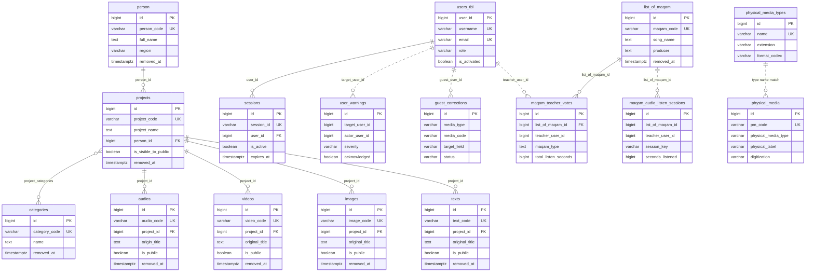
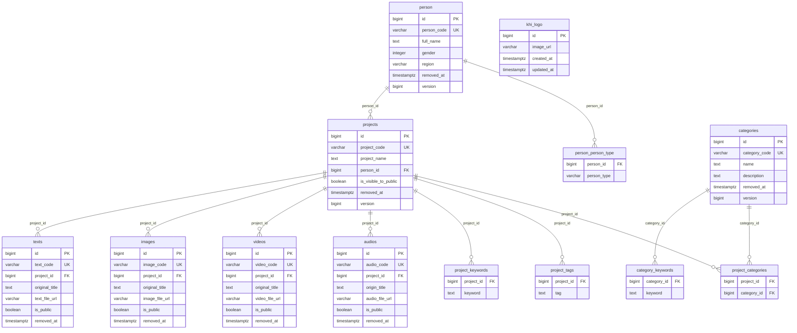
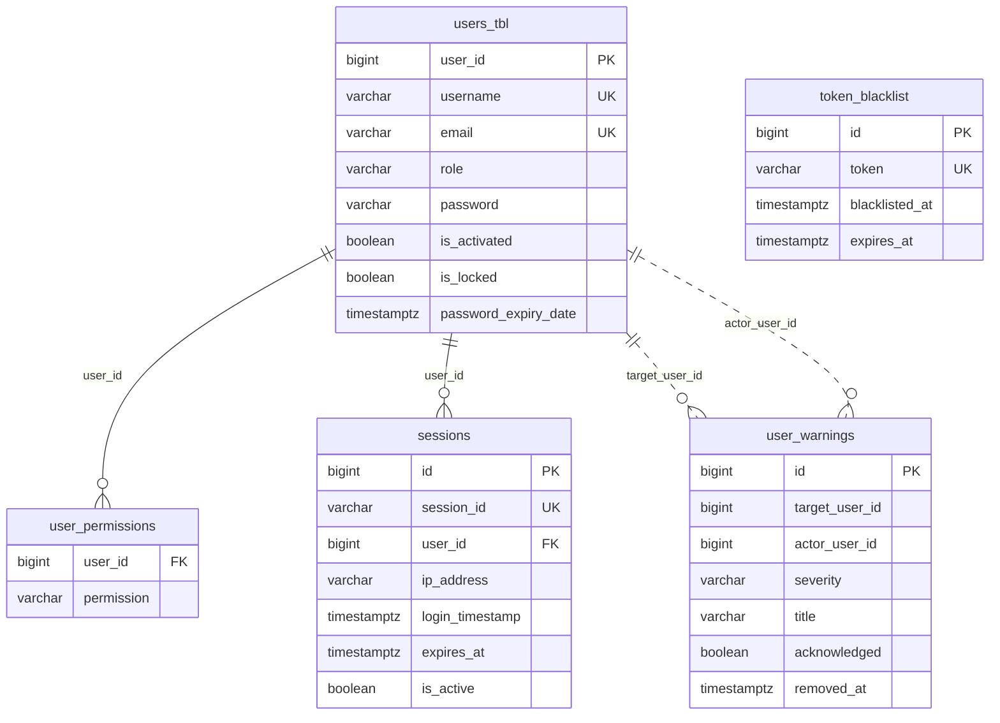
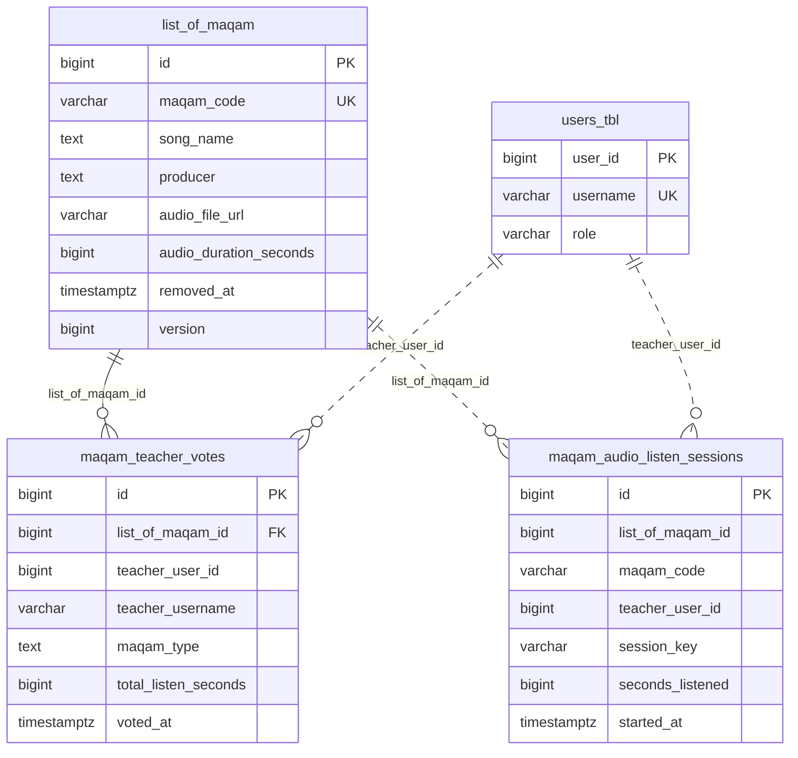
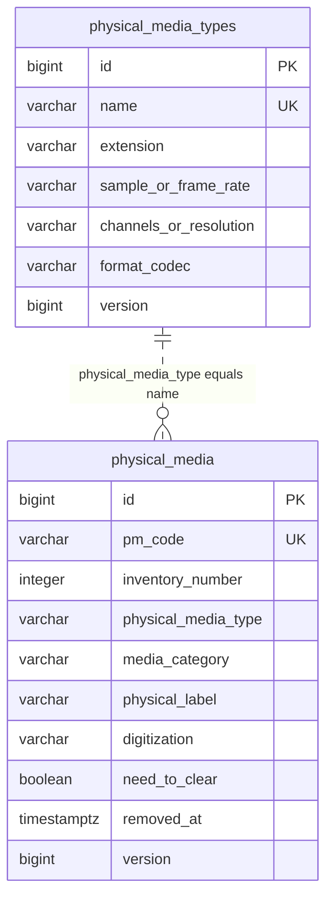
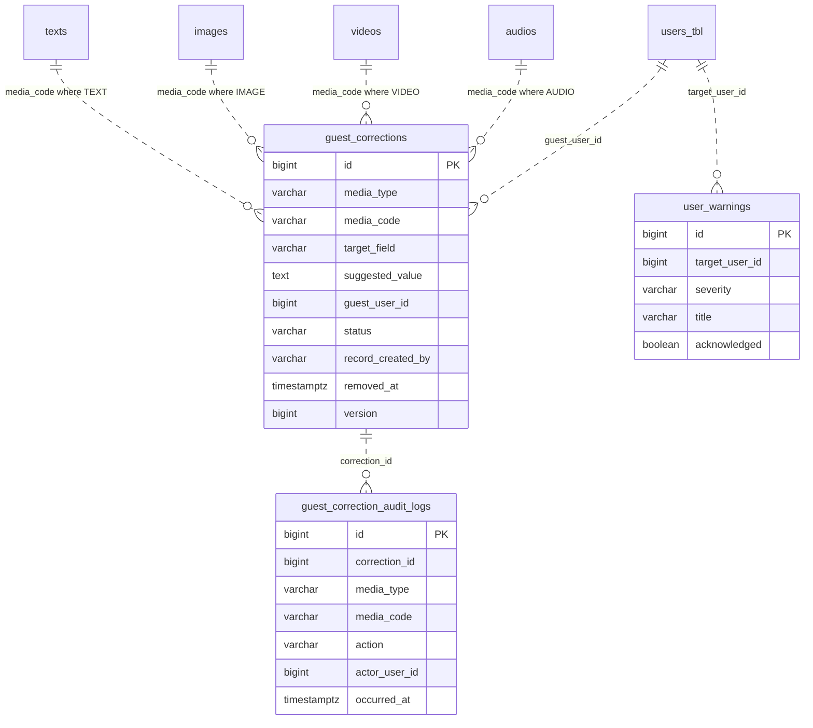

# Entity Relationship Diagram

> **Audience:** Backend / DBA · **Source:** every `@Entity`, `@CollectionTable` and `@JoinTable`
> under `src/main/java/ak/dev/khi_archive_platform/`

The KHI Archive Platform runs on a single **PostgreSQL** database of **59 tables**. Thirty-two of
them are mapped `@Entity` classes; of the remaining twenty-seven, twenty-six are
`@ElementCollection` collection tables and one is a `@JoinTable` — all owned by a parent entity
and none of them addressable on their own. There is no Flyway or Liquibase —
the DDL is produced by Hibernate `ddl-auto=update` plus the `JdbcTemplate` initializer beans in
`platform/config/` and `user/configs/`. Every table, column and index shown here is documented in
full in the `schema-*.md` files listed under [Table index](#table-index).

## How to read these diagrams

- `A ||--o{ B` — one `A` to zero-or-more `B`, enforced by a **real database foreign key**.
- `A ||..o{ B` — one `A` to zero-or-more `B`, **logical only**: a plain id or code column with
  no FK constraint behind it.
- `A }o--o{ B` — many-to-many through a join table.
- Crow's-foot ends: `||` exactly one, `o|` zero or one, `}o` zero or more, `}|` one or more.
- Key markers inside a box: `PK` primary key, `FK` foreign key, `UK` unique key.
- A box drawn with no columns is defined in another section of this document.

A **dashed** line is the important one: it means the child row carries a denormalized `*_id` or
`*_code` snapshot and nothing in the database stops the parent from disappearing. Every audit-log
table, every warning, every correction and the maqam listen log are wired this way on purpose —
the trail has to survive a purge of the row it describes.

Column types are abbreviated for legibility (`timestamptz` stands for
`timestamp(6) with time zone`, `varchar` omits its length). Only key columns and a handful of
defining columns appear in each box; the `schema-*.md` documents carry the complete column lists.

---

## 1. High-level map

The major entities and the paths between them. Audit-log tables, collection tables and the
`khi_logo` singleton are omitted here and appear in the focused sections below.

Three things this map is telling you:

- **`projects` is the only hub.** All four media tables hang off it with a non-null
  `project_id`; `person` and `categories` are reachable only through a project.
- **Only two real foreign keys point at `users_tbl`** — `sessions.user_id` and the
  `user_permissions.user_id` collection-table join column (omitted from this map, see
  [Users and security](#4-users-and-security)). Every other reference to a user (warnings,
  corrections, teacher votes, all audit logs) is a plain `bigint` plus a username snapshot.
- **`physical_media`, `guest_corrections` and the maqam listen log declare no JPA association at
  all.** They are joined at the application layer or not at all.

---

## 2. Content core

`projects`, `categories`, `person` and the four media tables, plus the join and collection tables
owned directly by `person`, `projects` and `categories` — the twenty-one per-media collection
tables get their own section below. Every line drawn here is backed by a real database foreign key.

Notes:

- `projects.person_id` is **nullable** — an untitled project derives its `project_code` from the
  project name instead of a person code. Every `<media>.project_id` is `NOT NULL`.
- `project_categories` is a plain `@JoinTable` with no surrogate key and no extra columns. The
  association is **unidirectional**: `Category` has no `projects` field.
- `khi_logo` participates in no relationship. It is a one-row branding table.
- `person.gender` is an **ordinal** enum: the field has no `@Enumerated`, so JPA's default
  `EnumType.ORDINAL` applies and the column is numeric (`MALE` = 0, `FEMALE` = 1), not text. The
  exact integer width Hibernate picks is version-dependent. The two `DatePrecision` columns do
  carry `@Enumerated(EnumType.STRING)` and are text.
- Trashing a project soft-trashes its media, but that cascade is **service code**
  (`ProjectService.delete` → `softTrashByProject` bulk updates), not a JPA cascade. Nothing
  in the mapping deletes a media row.

---

## 3. Media detail

The twenty-one per-media element-collection tables. Each is a **bag** — no primary key, no order
column, duplicates permitted — holding one `text` value per row plus the owner FK. Hibernate
deletes the whole bag and re-inserts it on every update of the owning entity.

```mermaid
erDiagram
    audios ||--o{ audio_genres : "audio_id"
    audios ||--o{ audio_subjects : "audio_id"
    audios ||--o{ audio_contributors : "audio_id"
    audios ||--o{ audio_tags : "audio_id"
    audios ||--o{ audio_keywords : "audio_id"
    videos ||--o{ video_subjects : "video_id"
    videos ||--o{ video_genres : "video_id"
    videos ||--o{ video_colors : "video_id"
    videos ||--o{ video_usages : "video_id"
    videos ||--o{ video_tags : "video_id"
    videos ||--o{ video_keywords : "video_id"
    images ||--o{ image_subjects : "image_id"
    images ||--o{ image_genres : "image_id"
    images ||--o{ image_colors : "image_id"
    images ||--o{ image_usages : "image_id"
    images ||--o{ image_tags : "image_id"
    images ||--o{ image_keywords : "image_id"
    texts ||--o{ text_subjects : "text_id"
    texts ||--o{ text_genres : "text_id"
    texts ||--o{ text_tags : "text_id"
    texts ||--o{ text_keywords : "text_id"

    audios {
        bigint id PK
        varchar audio_code UK
    }
    audio_genres {
        bigint audio_id FK
        text genre
    }
    audio_subjects {
        bigint audio_id FK
        text subject
    }
    audio_contributors {
        bigint audio_id FK
        text contributor
    }
    audio_tags {
        bigint audio_id FK
        text tag
    }
    audio_keywords {
        bigint audio_id FK
        text keyword
    }
    videos {
        bigint id PK
        varchar video_code UK
    }
    video_subjects {
        bigint video_id FK
        text subject
    }
    video_genres {
        bigint video_id FK
        text genre
    }
    video_colors {
        bigint video_id FK
        text color
    }
    video_usages {
        bigint video_id FK
        text usage_context
    }
    video_tags {
        bigint video_id FK
        text tag
    }
    video_keywords {
        bigint video_id FK
        text keyword
    }
    images {
        bigint id PK
        varchar image_code UK
    }
    image_subjects {
        bigint image_id FK
        text subject
    }
    image_genres {
        bigint image_id FK
        text genre
    }
    image_colors {
        bigint image_id FK
        text color
    }
    image_usages {
        bigint image_id FK
        text usage_context
    }
    image_tags {
        bigint image_id FK
        text tag
    }
    image_keywords {
        bigint image_id FK
        text keyword
    }
    texts {
        bigint id PK
        varchar text_code UK
    }
    text_subjects {
        bigint text_id FK
        text subject
    }
    text_genres {
        bigint text_id FK
        text genre
    }
    text_tags {
        bigint text_id FK
        text tag
    }
    text_keywords {
        bigint text_id FK
        text keyword
    }
```

Asymmetries worth remembering:

- Only `audios` has `audio_contributors`. `videos`, `images` and `texts` keep contributors in a
  single free-text column (`contributor` / `contributors`).
- Only `videos` and `images` have `*_colors` and `*_usages`.
- `texts` has no colors and no usages table — four collections instead of six.
- `person` keeps its tags and keywords as **single `text` columns** (`person.tag`,
  `person.keywords`), not as collection tables. Only `person_person_type` is a collection.
- Every `*_tags` and `*_keywords` value is canonicalized on save; the tag/keyword autocomplete
  endpoints read these tables directly.

---

## 4. Users and security

Five tables. `sessions.user_id` and `user_permissions.user_id` are the only real foreign keys in
this area — warnings deliberately reference users by plain id so an account can be removed without
breaking the warning history.

Notes:

- `user_permissions` carries a composite unique constraint
  `uk_user_permissions_user_perm (user_id, permission)` — neither column is unique on its own —
  and is fetched **EAGER**, because it is on the hot path of every authenticated request.
- `token_blacklist` has **no relationship to anything**. It is keyed by the raw JWT string, not by
  user or session. Revocation is decided by joining nothing: the filter checks
  `token_blacklist.token` and `sessions.is_active` independently.
- `user_warnings` stores `target_username` / `actor_username` snapshots alongside the ids so the
  feed renders without a join.

---

## 5. Maqam

One real foreign key (`maqam_teacher_votes.list_of_maqam_id`) and three deliberately unconstrained
references. There are **no** `@ElementCollection`, `@CollectionTable` or `@JoinTable` declarations
anywhere in `platform/model/maqam/` — this module owns no collection or join tables.

Notes:

- `maqam_teacher_votes` carries the composite `uk_maqam_teacher_one_vote_per_song
  (list_of_maqam_id, teacher_user_id)` — one vote per teacher per song; neither column is unique
  on its own. The 1–3 teacher panel cap is **not** a database constraint; `MaqamService` enforces
  it.
- `ListOfMaqam.teacherVotes` is `cascade = ALL, orphanRemoval = true`, so purging a maqam record
  deletes its votes. `maqam_audio_listen_sessions` is **not** in that cascade — its
  `list_of_maqam_id` is a plain `bigint` field, so listen rows survive a purge as orphans.
- `total_listen_seconds` on the vote row is a rolling aggregate of
  `maqam_audio_listen_sessions.seconds_listened`, maintained by the service, not by a trigger or
  a view.

---

## 6. Physical media

Two tables, **zero JPA associations**. `PhysicalMedia` declares no `@ManyToOne`, `@OneToMany`,
`@ManyToMany` or `@ElementCollection` of any kind; neither does `PhysicalMediaType`.

Notes:

- The link is a **name-string match**: `physical_media.physical_media_type` holds the literal
  `varchar(200)` value of `physical_media_types.name`. Nothing at the database level enforces it;
  the service validates on create and the `.xlsx` importer auto-creates a catalog row when it
  meets an unknown type.
- The nine technical columns on the catalog are **defaults copied into the form**, not
  constraints. Editing a catalog default never rewrites existing inventory rows.
- The intended natural key `(physical_media_type, physical_label)` is used for import dedupe but
  is **not** a unique constraint — only `pm_code` is unique.

---

## 7. Corrections

`guest_corrections` points at its target media record and at its people entirely through
denormalized snapshot columns. Nothing cascades and no foreign key exists to break when a media
row is trashed.

The forward step deserves a line of its own: **there is no `warning_id` column on
`guest_corrections` and no foreign key between `guest_corrections` and `user_warnings`.**
`GuestCorrectionService.adminForward` calls `UserWarningService.send(...)`, which inserts a
`user_warnings` row whose `title` embeds the media type, media code and target field. That title
is the only join path, and it is lossy once truncated to `varchar(200)`. The reliable link is the
`FORWARD` row in `guest_correction_audit_logs`, which carries `correction_id` plus the target
employee in `details`. `status = 'FORWARDED'` does **not** guarantee a `user_warnings` row exists.

---

## 8. Audit and activity logs

Twelve `*_audit_logs` tables plus two guest activity tables. All fourteen are append-only and
**none of them declares a foreign key** — that is what lets an audit row outlive the record it
describes. The twelve `*_audit_logs` tables additionally denormalize the actor, session and
request envelope into every row; the two guest activity tables are anonymous and carry no
actor, session or request columns at all.

```mermaid
erDiagram
    audios ||..o{ audio_audit_logs : "audio_id"
    videos ||..o{ video_audit_logs : "video_id"
    images ||..o{ image_audit_logs : "image_id"
    texts ||..o{ text_audit_logs : "text_id"
    categories ||..o{ category_audit_logs : "category_id"
    person ||..o{ person_audit_logs : "person_id"
    projects ||..o{ project_audit_logs : "project_id"
    list_of_maqam ||..o{ maqam_audit_logs : "maqam_id"
    physical_media ||..o{ physical_media_audit_logs : "physical_media_id"
    guest_corrections ||..o{ guest_correction_audit_logs : "correction_id"
    users_tbl ||..o{ user_audit_logs : "target_user_id"
    users_tbl ||..o{ analytics_audit_logs : "actor_user_id"

    audio_audit_logs {
        bigint id PK
        bigint audio_id
        varchar audio_code
        varchar action
        timestamptz occurred_at
    }
    video_audit_logs {
        bigint id PK
        bigint video_id
        varchar video_code
        varchar action
        timestamptz occurred_at
    }
    image_audit_logs {
        bigint id PK
        bigint image_id
        varchar image_code
        varchar action
        timestamptz occurred_at
    }
    text_audit_logs {
        bigint id PK
        bigint text_id
        varchar text_code
        varchar action
        timestamptz occurred_at
    }
    category_audit_logs {
        bigint id PK
        bigint category_id
        varchar category_code
        varchar action
        timestamptz occurred_at
    }
    person_audit_logs {
        bigint id PK
        bigint person_id
        varchar person_code
        varchar action
        timestamptz occurred_at
    }
    project_audit_logs {
        bigint id PK
        bigint project_id
        varchar project_code
        varchar action
        timestamptz occurred_at
    }
    maqam_audit_logs {
        bigint id PK
        bigint maqam_id
        varchar maqam_code
        bigint teacher_user_id
        varchar action
        timestamptz occurred_at
    }
    physical_media_audit_logs {
        bigint id PK
        bigint physical_media_id
        varchar physical_media_code
        varchar action
        timestamptz occurred_at
    }
    guest_correction_audit_logs {
        bigint id PK
        bigint correction_id
        varchar media_code
        varchar action
        timestamptz occurred_at
    }
    analytics_audit_logs {
        bigint id PK
        varchar action
        text filter_summary
        bigint actor_user_id
        timestamptz occurred_at
    }
    user_audit_logs {
        bigint id PK
        bigint target_user_id
        varchar action
        varchar new_role
        timestamptz occurred_at
    }
    guest_search_logs {
        bigint id PK
        varchar query
        timestamptz searched_at
    }
    guest_interaction_logs {
        bigint id PK
        varchar entity_type
        varchar entity_code
        timestamptz interacted_at
    }
```

Notes:

- **Every** `*_audit_logs` table also carries `actor_user_id`, `actor_username`,
  `actor_display_name`, `actor_authorities`, `actor_permissions`, `device_info`, `ip_address`,
  `session_id`, `session_login_timestamp`, `session_expires_at`, `session_is_active`,
  `request_method`, `request_path` and `details`. Those columns are omitted from the boxes above;
  see `schema-audit.md` for the full shape.
- `session_id` on every audit row is the `sessions.session_id` string, again with no FK.
- The four media audit tables and `project_audit_logs` additionally denormalize `project_id`,
  `project_code`, `person_id`, `person_code` and category codes so a feed row renders without a
  single join.
- `guest_search_logs` and `guest_interaction_logs` reference nothing at all.
  `guest_interaction_logs.entity_code` holds a business code (`audio_code`, `video_code`,
  `project_code`, …) selected by `entity_type`. Both tables are purged on a 30-day rolling window.
- Ten of the twelve `*_audit_logs` tables are read together by the analytics module through one
  `UNION ALL` CTE.

---

## Relationship inventory

Every relationship in the schema, mapped or not. "JPA mapping" is the exact annotation on the
owning field; rows marked **none** have no mapped association and are joined in service code or
not at all.

### Mapped associations — real foreign keys

| From table | To table | Cardinality | FK column | JPA mapping | Cascade / orphanRemoval |
|---|---|---|---|---|---|
| `projects` | `person` | many-to-one, optional | `projects.person_id` | `@ManyToOne(fetch = FetchType.LAZY)` + `@JoinColumn(name = "person_id")` | none |
| `projects` | `categories` | many-to-many | `project_categories.project_id` / `project_categories.category_id` | `@ManyToMany(fetch = FetchType.LAZY)` + `@JoinTable(name = "project_categories")` | none — unidirectional, `Category` has no inverse side |
| `audios` | `projects` | many-to-one, required | `audios.project_id` (NOT NULL) | `@ManyToOne(fetch = FetchType.LAZY)` + `@JoinColumn(name = "project_id", nullable = false)` | none |
| `videos` | `projects` | many-to-one, required | `videos.project_id` (NOT NULL) | `@ManyToOne(fetch = FetchType.LAZY)` + `@JoinColumn(name = "project_id", nullable = false)` | none |
| `images` | `projects` | many-to-one, required | `images.project_id` (NOT NULL) | `@ManyToOne(fetch = FetchType.LAZY)` + `@JoinColumn(name = "project_id", nullable = false)` | none |
| `texts` | `projects` | many-to-one, required | `texts.project_id` (NOT NULL) | `@ManyToOne(fetch = FetchType.LAZY)` + `@JoinColumn(name = "project_id", nullable = false)` | none |
| `list_of_maqam` | `maqam_teacher_votes` | one-to-many | `maqam_teacher_votes.list_of_maqam_id` | `@OneToMany(mappedBy = "listOfMaqam", cascade = CascadeType.ALL, orphanRemoval = true, fetch = FetchType.LAZY)` | `CascadeType.ALL`, `orphanRemoval = true` |
| `maqam_teacher_votes` | `list_of_maqam` | many-to-one, required | `maqam_teacher_votes.list_of_maqam_id` (NOT NULL) | `@ManyToOne(fetch = FetchType.LAZY, optional = false)` + `@JoinColumn(name = "list_of_maqam_id", nullable = false)` | none — inverse of the row above |
| `sessions` | `users_tbl` | many-to-one, required | `sessions.user_id` (NOT NULL) | `@ManyToOne(fetch = FetchType.LAZY)` + `@JoinColumn(name = "user_id", nullable = false)` | none |

### Element collections — owned tables with a parent FK

Every row below is an `@ElementCollection` + `@CollectionTable`. Lifecycle is implicit: Hibernate
deletes the whole bag and re-inserts it whenever the owner is saved, and deletes it when the owner
row is deleted. There is no configurable cascade attribute on these.

| From table | To table | Cardinality | FK column | JPA mapping | Cascade / orphanRemoval |
|---|---|---|---|---|---|
| `audios` | `audio_genres` | one-to-many | `audio_id` | `@ElementCollection(fetch = FetchType.LAZY)` + `@CollectionTable(name = "audio_genres")` | implicit — owned by parent |
| `audios` | `audio_subjects` | one-to-many | `audio_id` | `@ElementCollection(fetch = FetchType.LAZY)` + `@CollectionTable(name = "audio_subjects")` | implicit — owned by parent |
| `audios` | `audio_contributors` | one-to-many | `audio_id` | `@ElementCollection(fetch = FetchType.LAZY)` + `@CollectionTable(name = "audio_contributors")` | implicit — owned by parent |
| `audios` | `audio_tags` | one-to-many | `audio_id` | `@ElementCollection(fetch = FetchType.LAZY)` + `@CollectionTable(name = "audio_tags")` | implicit — owned by parent |
| `audios` | `audio_keywords` | one-to-many | `audio_id` | `@ElementCollection(fetch = FetchType.LAZY)` + `@CollectionTable(name = "audio_keywords")` | implicit — owned by parent |
| `videos` | `video_subjects` | one-to-many | `video_id` | `@ElementCollection(fetch = FetchType.LAZY)` + `@CollectionTable(name = "video_subjects")` | implicit — owned by parent |
| `videos` | `video_genres` | one-to-many | `video_id` | `@ElementCollection(fetch = FetchType.LAZY)` + `@CollectionTable(name = "video_genres")` | implicit — owned by parent |
| `videos` | `video_colors` | one-to-many | `video_id` | `@ElementCollection(fetch = FetchType.LAZY)` + `@CollectionTable(name = "video_colors")` | implicit — owned by parent |
| `videos` | `video_usages` | one-to-many | `video_id` | `@ElementCollection(fetch = FetchType.LAZY)` + `@CollectionTable(name = "video_usages")` | implicit — owned by parent |
| `videos` | `video_tags` | one-to-many | `video_id` | `@ElementCollection(fetch = FetchType.LAZY)` + `@CollectionTable(name = "video_tags")` | implicit — owned by parent |
| `videos` | `video_keywords` | one-to-many | `video_id` | `@ElementCollection(fetch = FetchType.LAZY)` + `@CollectionTable(name = "video_keywords")` | implicit — owned by parent |
| `images` | `image_subjects` | one-to-many | `image_id` | `@ElementCollection(fetch = FetchType.LAZY)` + `@CollectionTable(name = "image_subjects")` | implicit — owned by parent |
| `images` | `image_genres` | one-to-many | `image_id` | `@ElementCollection(fetch = FetchType.LAZY)` + `@CollectionTable(name = "image_genres")` | implicit — owned by parent |
| `images` | `image_colors` | one-to-many | `image_id` | `@ElementCollection(fetch = FetchType.LAZY)` + `@CollectionTable(name = "image_colors")` | implicit — owned by parent |
| `images` | `image_usages` | one-to-many | `image_id` | `@ElementCollection(fetch = FetchType.LAZY)` + `@CollectionTable(name = "image_usages")` | implicit — owned by parent |
| `images` | `image_tags` | one-to-many | `image_id` | `@ElementCollection(fetch = FetchType.LAZY)` + `@CollectionTable(name = "image_tags")` | implicit — owned by parent |
| `images` | `image_keywords` | one-to-many | `image_id` | `@ElementCollection(fetch = FetchType.LAZY)` + `@CollectionTable(name = "image_keywords")` | implicit — owned by parent |
| `texts` | `text_subjects` | one-to-many | `text_id` | `@ElementCollection(fetch = FetchType.LAZY)` + `@CollectionTable(name = "text_subjects")` | implicit — owned by parent |
| `texts` | `text_genres` | one-to-many | `text_id` | `@ElementCollection(fetch = FetchType.LAZY)` + `@CollectionTable(name = "text_genres")` | implicit — owned by parent |
| `texts` | `text_tags` | one-to-many | `text_id` | `@ElementCollection(fetch = FetchType.LAZY)` + `@CollectionTable(name = "text_tags")` | implicit — owned by parent |
| `texts` | `text_keywords` | one-to-many | `text_id` | `@ElementCollection(fetch = FetchType.LAZY)` + `@CollectionTable(name = "text_keywords")` | implicit — owned by parent |
| `categories` | `category_keywords` | one-to-many | `category_id` | `@ElementCollection(fetch = FetchType.LAZY)` + `@CollectionTable(name = "category_keywords")` | implicit — owned by parent |
| `person` | `person_person_type` | one-to-many | `person_id` | `@ElementCollection(fetch = FetchType.EAGER)` + `@CollectionTable(name = "person_person_type")` | implicit — owned by parent |
| `projects` | `project_tags` | one-to-many | `project_id` | `@ElementCollection(fetch = FetchType.LAZY)` + `@CollectionTable(name = "project_tags")` | implicit — owned by parent |
| `projects` | `project_keywords` | one-to-many | `project_id` | `@ElementCollection(fetch = FetchType.LAZY)` + `@CollectionTable(name = "project_keywords")` | implicit — owned by parent |
| `users_tbl` | `user_permissions` | one-to-many | `user_id` | `@ElementCollection(fetch = FetchType.EAGER)` + `@CollectionTable(name = "user_permissions", uniqueConstraints = uk_user_permissions_user_perm)` | implicit — owned by parent |

### Logical links — no mapped association, no foreign key

| From table | To table | Cardinality | FK column | JPA mapping | Cascade / orphanRemoval |
|---|---|---|---|---|---|
| `maqam_audio_listen_sessions` | `list_of_maqam` | many-to-one | `list_of_maqam_id` (plain `bigint`) | none — mapped as `@Column`, resolved in `MaqamService` | none — rows orphan on purge |
| `maqam_audio_listen_sessions` | `list_of_maqam` | many-to-one | `maqam_code` (snapshot) | none — denormalized `@Column` | none |
| `maqam_teacher_votes` | `users_tbl` | many-to-one | `teacher_user_id` (plain `bigint`) | none — `@Column`, plus `teacher_username` / `teacher_display_name` snapshots | none |
| `maqam_audio_listen_sessions` | `users_tbl` | many-to-one | `teacher_user_id` (plain `bigint`) | none — `@Column` plus `teacher_username` snapshot | none |
| `user_warnings` | `users_tbl` | many-to-one | `target_user_id` (plain `bigint`) | none — `@Column`, deliberate per the entity comment | none |
| `user_warnings` | `users_tbl` | many-to-one | `actor_user_id` (plain `bigint`) | none — `@Column` plus `actor_username` snapshot | none |
| `token_blacklist` | — | none | — | none — keyed by the raw JWT string only | none |
| `guest_corrections` | `audios` / `videos` / `images` / `texts` | many-to-one | `media_type` + `media_code` | none — `CorrectionMediaType` enum selects the target table, `media_code` matches that table's business key | none |
| `guest_corrections` | `users_tbl` | many-to-one | `guest_user_id` (plain `bigint`) | none — `@Column` plus `guest_username` / `guest_display_name` snapshots | none |
| `guest_corrections` | `users_tbl` | many-to-one | `record_created_by` matches `users_tbl.username` | none — username string, used to resolve the forward target | none |
| `guest_corrections` | `user_warnings` | one-to-many | **no column exists** | none — created only by `GuestCorrectionService.adminForward` calling `UserWarningService.send(...)`; the sole join path is the warning `title` text | none |
| `guest_correction_audit_logs` | `guest_corrections` | many-to-one | `correction_id` (plain `bigint`) | none — `@Column` | none |
| `physical_media` | `physical_media_types` | many-to-one | `physical_media_type` matches `physical_media_types.name` | none — `varchar(200)` value match, validated in `PhysicalMediaService` | none |
| `physical_media_audit_logs` | `physical_media` | many-to-one | `physical_media_id` (plain `bigint`) plus `physical_media_code` snapshot | none — `@Column` | none |
| `audio_audit_logs` | `audios` | many-to-one | `audio_id` plus `audio_code` snapshot | none — `@Column` | none |
| `video_audit_logs` | `videos` | many-to-one | `video_id` plus `video_code` snapshot | none — `@Column` | none |
| `image_audit_logs` | `images` | many-to-one | `image_id` plus `image_code` snapshot | none — `@Column` | none |
| `text_audit_logs` | `texts` | many-to-one | `text_id` plus `text_code` snapshot | none — `@Column` | none |
| `category_audit_logs` | `categories` | many-to-one | `category_id` plus `category_code` snapshot | none — `@Column` | none |
| `person_audit_logs` | `person` | many-to-one | `person_id` plus `person_code` snapshot | none — `@Column` | none |
| `project_audit_logs` | `projects` | many-to-one | `project_id` plus `project_code` snapshot | none — `@Column` | none |
| `maqam_audit_logs` | `list_of_maqam` | many-to-one | `maqam_id` plus `maqam_code` snapshot | none — `@Column` | none |
| `maqam_audit_logs` | `users_tbl` | many-to-one | `teacher_user_id` plus `teacher_username` snapshot | none — `@Column`, set only on vote / listen / assign actions | none |
| `user_audit_logs` | `users_tbl` | many-to-one | `target_user_id` plus `target_username` / `target_email` snapshots | none — `@Column` | none |
| `audio_audit_logs`, `video_audit_logs`, `image_audit_logs`, `text_audit_logs`, `project_audit_logs` | `projects` | many-to-one | `project_id` plus `project_code` / `project_name` snapshots | none — denormalized `@Column`s | none |
| `audio_audit_logs`, `video_audit_logs`, `image_audit_logs`, `text_audit_logs`, `project_audit_logs` | `person` | many-to-one | `person_id` plus `person_code` / `person_name` snapshots | none — denormalized `@Column`s | none |
| `audio_audit_logs` | `categories` | many-to-one | `category_code`; the other three media audit tables and `project_audit_logs` use `category_codes` (comma-separated) | none — denormalized `@Column` | none |
| All twelve `*_audit_logs` tables | `users_tbl` | many-to-one | `actor_user_id` plus `actor_username`, `actor_display_name`, `actor_authorities`, `actor_permissions` snapshots | none — `@Column` | none |
| All twelve `*_audit_logs` tables | `sessions` | many-to-one | `session_id` matches `sessions.session_id`, plus `session_login_timestamp`, `session_expires_at`, `session_is_active` snapshots | none — `@Column` | none |
| `guest_interaction_logs` | `audios` / `videos` / `images` / `texts` / `projects` / `person` / `categories` | many-to-one | `entity_type` + `entity_code` | none — `entity_type` selects the table, `entity_code` matches that table's business key | none |
| `guest_search_logs` | — | none | — | none — records a raw query string only | none |
| `khi_logo` | — | none | — | none — single-row branding table | none |
| `projects` | `audios` / `videos` / `images` / `texts` (trash cascade) | one-to-many | `<media>.project_id` | none on the `Project` side — `Project` declares no `@OneToMany` to media; the cascade is `ProjectService.delete` issuing `softTrashByProject` bulk updates | service-level soft-trash only; no JPA cascade, no delete |

---

## Table index

All 59 tables, alphabetically.

| Table | Java entity | Documented in |
|---|---|---|
| `analytics_audit_logs` | `platform.model.analytics.AnalyticsAuditLog` | `schema-audit.md` |
| `audio_audit_logs` | `platform.model.audio.AudioAuditLog` | `schema-audit.md` |
| `audio_contributors` | element collection of `Audio.contributors` | `schema-content.md` |
| `audio_genres` | element collection of `Audio.genre` | `schema-content.md` |
| `audio_keywords` | element collection of `Audio.keywords` | `schema-content.md` |
| `audio_subjects` | element collection of `Audio.subject` | `schema-content.md` |
| `audio_tags` | element collection of `Audio.tags` | `schema-content.md` |
| `audios` | `platform.model.audio.Audio` | `schema-content.md` |
| `categories` | `platform.model.category.Category` | `schema-content.md` |
| `category_audit_logs` | `platform.model.category.CategoryAuditLog` | `schema-audit.md` |
| `category_keywords` | element collection of `Category.keywords` | `schema-content.md` |
| `guest_correction_audit_logs` | `platform.model.correction.GuestCorrectionAuditLog` | `schema-corrections.md`, `schema-audit.md` |
| `guest_corrections` | `platform.model.correction.GuestCorrection` | `schema-corrections.md` |
| `guest_interaction_logs` | `platform.model.trending.GuestInteractionLog` | `schema-audit.md` |
| `guest_search_logs` | `platform.model.trending.GuestSearchLog` | `schema-audit.md` |
| `image_audit_logs` | `platform.model.image.ImageAuditLog` | `schema-audit.md` |
| `image_colors` | element collection of `Image.colorOfImage` | `schema-content.md` |
| `image_genres` | element collection of `Image.genre` | `schema-content.md` |
| `image_keywords` | element collection of `Image.keywords` | `schema-content.md` |
| `image_subjects` | element collection of `Image.subject` | `schema-content.md` |
| `image_tags` | element collection of `Image.tags` | `schema-content.md` |
| `image_usages` | element collection of `Image.whereThisImageUsed` | `schema-content.md` |
| `images` | `platform.model.image.Image` | `schema-content.md` |
| `khi_logo` | `platform.model.khilogo.KhiLogo` | `schema-content.md` |
| `list_of_maqam` | `platform.model.maqam.ListOfMaqam` | `schema-maqam.md` |
| `maqam_audio_listen_sessions` | `platform.model.maqam.MaqamAudioListenSession` | `schema-maqam.md` |
| `maqam_audit_logs` | `platform.model.maqam.MaqamAuditLog` | `schema-audit.md` |
| `maqam_teacher_votes` | `platform.model.maqam.MaqamTeacherVote` | `schema-maqam.md` |
| `person` | `platform.model.person.Person` | `schema-content.md` |
| `person_audit_logs` | `platform.model.person.PersonAuditLog` | `schema-audit.md` |
| `person_person_type` | element collection of `Person.personType` | `schema-content.md` |
| `physical_media` | `platform.model.physicalmedia.PhysicalMedia` | `schema-physical-media.md` |
| `physical_media_audit_logs` | `platform.model.physicalmedia.PhysicalMediaAuditLog` | `schema-audit.md` |
| `physical_media_types` | `platform.model.physicalmedia.PhysicalMediaType` | `schema-physical-media.md` |
| `project_audit_logs` | `platform.model.project.ProjectAuditLog` | `schema-audit.md` |
| `project_categories` | join table of `Project.categories` | `schema-content.md` |
| `project_keywords` | element collection of `Project.keywords` | `schema-content.md` |
| `project_tags` | element collection of `Project.tags` | `schema-content.md` |
| `projects` | `platform.model.project.Project` | `schema-content.md` |
| `sessions` | `user.model.Session` | `schema-users-security.md` |
| `text_audit_logs` | `platform.model.text.TextAuditLog` | `schema-audit.md` |
| `text_genres` | element collection of `Text.genre` | `schema-content.md` |
| `text_keywords` | element collection of `Text.keywords` | `schema-content.md` |
| `text_subjects` | element collection of `Text.subject` | `schema-content.md` |
| `text_tags` | element collection of `Text.tags` | `schema-content.md` |
| `texts` | `platform.model.text.Text` | `schema-content.md` |
| `token_blacklist` | `user.model.TokenBlacklist` | `schema-users-security.md` |
| `user_audit_logs` | `user.model.UserAuditLog` | `schema-audit.md` |
| `user_permissions` | element collection of `User.extraPermissions` | `schema-users-security.md` |
| `user_warnings` | `user.model.UserWarning` | `schema-users-security.md` |
| `users_tbl` | `user.model.User` | `schema-users-security.md` |
| `video_audit_logs` | `platform.model.video.VideoAuditLog` | `schema-audit.md` |
| `video_colors` | element collection of `Video.colorOfVideo` | `schema-content.md` |
| `video_genres` | element collection of `Video.genre` | `schema-content.md` |
| `video_keywords` | element collection of `Video.keywords` | `schema-content.md` |
| `video_subjects` | element collection of `Video.subject` | `schema-content.md` |
| `video_tags` | element collection of `Video.tags` | `schema-content.md` |
| `video_usages` | element collection of `Video.whereThisVideoUsed` | `schema-content.md` |
| `videos` | `platform.model.video.Video` | `schema-content.md` |

All Java entity names are relative to `ak.dev.khi_archive_platform.`.

Counts by area: content 34, audit and activity 14, users and security 5, maqam 3, physical media 2,
corrections 1 (its audit table is counted under audit). Total 59.

---

## Related

- [Database documentation index](./README.md)
- [Schema — Content Tables](./schema-content.md)
- [Important fields](./important-fields.md)
- [Migrations and initializers](./migrations.md)
- [Schema — Users, Sessions and Security](./schema-users-security.md)
- [Schema — Audit and Activity Logs](./schema-audit.md)
- [Schema — Maqam](./schema-maqam.md)
- [Schema — Physical Media Inventory](./schema-physical-media.md)
- [Schema — Guest Corrections](./schema-corrections.md)
- [Indexes and performance](./indexes-and-performance.md)
