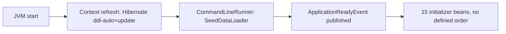

# Schema Migrations

> **Audience:** Backend engineers and whoever runs the deploy ·
> **Source:** `src/main/resources/application.yaml`, `pom.xml`,
> `src/main/java/ak/dev/khi_archive_platform/platform/config/`,
> `src/main/java/ak/dev/khi_archive_platform/user/configs/`

This is the migration handbook for the KHI Archive Platform database. Read the first two
sections before you change any entity — the mechanism is not what you expect from a Spring Boot
project of this size, and the failure modes are silent.

---

## 1. How schema change actually works today

### There is no migration tool

**There is no Flyway and no Liquibase in this project.** A reader arriving from almost any other
Spring Boot codebase will assume otherwise, so this is stated first and verified three ways:

| Check | Result |
|---|---|
| `pom.xml` dependency list | No `flyway-core`, no `liquibase-core`. Full list read; the only DB-adjacent artifacts are `spring-boot-starter-data-jpa`, `org.postgresql:postgresql` (runtime), `spring-boot-starter-data-jpa-test` (test) and `com.h2database:h2` (test). |
| `application.yaml` | No `spring.flyway.*` and no `spring.liquibase.*` keys. |
| `src/main/resources/` | Contains only `application.yaml`, `static/` and `templates/`. There is no `db/migration/` directory and no changelog file. |

There are no `.sql` files in the source tree and no versioned scripts anywhere. Nothing records
which schema changes have been applied. If you need to know what the database looks like, you
query the database.

### The two mechanisms that do exist

Schema evolves through exactly two things:

1. **Hibernate `ddl-auto: update`** — reconciles the mapped entities against the live schema on
   every boot and issues the additive DDL it thinks is missing.
2. **Hand-written startup initializer beans** — 15 Spring beans under `platform/config/` and
   `user/configs/` that fire on `ApplicationReadyEvent` and do everything `update` refuses to do:
   indexes, `CHECK`-constraint re-sync, data backfills, one-shot column migrations and catalog
   seeding. Fourteen of them run raw SQL through `JdbcTemplate`; the fifteenth,
   `PhysicalMediaTypeSeeder`, goes through a JPA repository instead.

### Boot order



Spring Boot calls `CommandLineRunner`/`ApplicationRunner` beans **before** it publishes
`ApplicationReadyEvent`. `SeedDataLoader` (`platform/seed/SeedDataLoader.java`) is a
`CommandLineRunner`, so **the seed loader runs before every CHECK-constraint initializer**. If a
seed row carries an enum value that the stale Hibernate-generated `CHECK` does not know about, the
seed insert fails on that boot and only succeeds on the next one, after the constraint has been
re-synced. That is a real ordering hazard, not a theoretical one.

### The config keys that govern all of this

| Key | Value in `application.yaml` | Effect |
|---|---|---|
| `spring.jpa.hibernate.ddl-auto` | `update` | The whole schema-evolution story. Never set this to `create`, `create-drop` or `none` on a live database — see the warning below. |
| `spring.jpa.open-in-view` | `false` | Unrelated to DDL; listed so you do not "fix" it while migrating. |
| `spring.jpa.show-sql` | `true` | Prints the DDL Hibernate emits at boot. This is your only migration log. |
| `logging.level.org.hibernate.SQL` | `DEBUG` | Same — the `alter table ... add column ...` statements appear here. |
| `logging.level.org.springframework.jdbc` | `DEBUG` | Covers the initializers' `JdbcTemplate` calls. |
| `spring.datasource.url` | `jdbc:postgresql://${PGHOST}:${PGPORT}/${PGDATABASE}` | Which database gets migrated. |

The `ddl-auto` key carries this comment in `application.yaml`, and it is the reason nobody may
change it casually:

```yaml
    hibernate:
      # Authentication revocation is backed by the sessions table. A
      # create/create-drop schema mode deletes every active login on restart.
      ddl-auto: update
```

**Verified defect, worth acting on:** in `application.yaml` the Hibernate passthrough block is
nested as `spring.jpa.hibernate.properties.hibernate.*` (`format_sql`, `use_sql_comments`,
`dialect`, `default_batch_fetch_size`) and the JDBC batching block as `spring.jpa.jdbc.*`
(`time_zone`, `batch_size`, `order_inserts`, `order_updates`). Neither path exists — Spring Boot
binds Hibernate passthrough properties from `spring.jpa.properties.hibernate.*`, and unknown keys
are dropped silently. All eight are **inert**: Hibernate never receives them.

Nothing about *migrations* depends on them — `ddl-auto`, `show-sql` and `open-in-view` are on real
paths, and the PostgreSQL dialect is auto-detected from the connection. But the DDL log you read
during a migration is unformatted and carries no HQL comments, because `format_sql` and
`use_sql_comments` are among the inert eight. The runtime cost (no batch fetching, no JDBC
batching, timestamps binding in the JVM default zone) and the corrected YAML are in
[Indexes and performance](./indexes-and-performance.md#eight-hibernate-keys-are-inert-verified).

---

## 2. What `ddl-auto: update` does and does not do

`update` is **additive only**. It compares the mapped entities to the live schema and issues
`create table` / `alter table ... add column` / `create index` / `alter table ... add constraint`
for things it finds missing. It never issues a destructive or narrowing statement, and it never
re-examines something it already created.

| Limitation | What actually happens here |
|---|---|
| **Never drops a column** | Delete a field from an entity and the column stays in Postgres forever, holding its data. `physical_media.sub_type` is the live example: the field was retired and the column is still there. `PhysicalMediaSizeColumnMigrationInitializer` documents the manual cleanup — `ALTER TABLE physical_media DROP COLUMN sub_type;` — and explicitly leaves it undone. |
| **Never drops a table** | Deleting an `@Entity` orphans the table. Nothing warns you. |
| **Never renames a column** | Change `@Column(name = ...)` and Hibernate adds a *new* empty column beside the old one. Every existing row silently reads as `null` on the new name. This is exactly what happened to `physical_media.size` → `physical_media.physical_size`, and why a data-copy initializer had to be written. |
| **Never changes an existing column's type or length** | Widening `length = 20` to `length = 40` on an existing `varchar(20)` is a no-op. Insert a longer value and Postgres rejects it with `value too long for type character varying(20)`. This bites hardest on the `action` columns of the audit tables, which are `length = 20` on the media (`audio`/`video`/`image`/`text`), `category`, `person`, `project` and `physical_media` logs, `length = 30` on the maqam and guest-correction logs, and `length = 32` on the analytics and user logs. |
| **Never narrows nullability on a populated table** | A field newly marked `nullable = false` does not retroactively make existing rows valid. Depending on the emitted DDL you either get an `ALTER` failure at boot or a column that is nominally `NOT NULL` with pre-existing nulls; either way you must backfill first. |
| **Never refreshes a Hibernate-generated `CHECK (col IN (...))`** | The single biggest trap in this codebase. Hibernate emits the enum `CHECK` **once**, when it first creates the column, and never touches it again. Add a value to an `@Enumerated(STRING)` enum and every insert using it dies with `violates check constraint "<table>_<col>_check"` — even though Java accepts it happily. **Seven of the fifteen initializers exist purely to work around this**, and three more carry `DROP CONSTRAINT` statements for it as a side job. |
| **Never removes a stale constraint or index** | Drop a `@UniqueConstraint` or `@Index` from `@Table` and it stays enforced in Postgres. |
| **Does not backfill data** | New columns arrive `NULL` on every existing row. `MediaSearchIndexInitializer.backfillNullVersions()` exists because `@Version` columns added this way arrive null, and a null version makes optimistic locking treat an update as a fresh insert. |
| **Silent on failure of ambiguous cases** | A failed `alter` is logged, not fatal in every case. `show-sql: true` plus `org.hibernate.SQL: DEBUG` is the only place you will see it. |

**Practical consequence:** treat `ddl-auto: update` as "creates new tables and new columns for
you". Anything else — renames, drops, type changes, defaults, backfills, enum constraints — is
your job, and in this project the place you do it is an initializer bean.

---

## 3. The initializer pattern

### Every initializer bean, enumerated

All 15 live under the two config folders and all use
`@EventListener(ApplicationReadyEvent.class)`. Order column reads "n/a" where the statements are
independent and self-guarding.

#### `platform/config/`

| Class | What it does | Idempotent? | Order |
|---|---|---|---|
| `AnalyticsAuditActionConstraintInitializer` | Queries `pg_constraint` for every `CHECK` on `analytics_audit_logs.action`, drops each, then re-adds `analytics_audit_logs_action_check` built from `AnalyticsAuditAction.values()`. | Yes — drop-and-recreate every boot. | n/a |
| `AuditLogIndexInitializer` | `CREATE INDEX IF NOT EXISTS` ×3 on each of 11 audit tables (`audio_`, `video_`, `image_`, `text_`, `project_`, `category_`, `person_`, `maqam_`, `physical_media_`, `analytics_`, `user_audit_logs`): `(actor_username, occurred_at DESC)`, `(occurred_at DESC)`, `(action, occurred_at DESC)`. 33 indexes total. Its javadoc still says "seven" tables — the `TABLES` list is the truth, and it has 11. | Yes — `IF NOT EXISTS`, and per-index failures are caught and warned. | n/a (tolerates tables not existing yet on first boot) |
| `CategorySearchIndexInitializer` | `CREATE EXTENSION IF NOT EXISTS pg_trgm`; three GIN trigram indexes on `categories(LOWER(name))`, `categories(LOWER(description))`, `category_keywords(LOWER(keyword))`; then **drops** `category_audit_logs_action_check` without recreating it. | Yes. | n/a |
| `GuestCorrectionAuditActionConstraintInitializer` | Same drop-and-recreate cycle for `guest_correction_audit_logs.action`, from `GuestCorrectionAuditAction.values()`. | Yes. | n/a |
| `MaqamAuditActionConstraintInitializer` | Same cycle for `maqam_audit_logs.action`, from `MaqamAuditAction.values()`. | Yes. | n/a |
| `MediaSearchIndexInitializer` | The big one, 381 lines. `CREATE EXTENSION IF NOT EXISTS pg_trgm`, then **191** `CREATE INDEX IF NOT EXISTS` statements across `images` (48), `texts` (42), `videos` (48), `audios` (53) and their child collection tables — 114 GIN `gin_trgm_ops`, 57 btree `text_pattern_ops`, 20 plain btree on FK columns. Then **drops** `image_`/`text_`/`video_`/`audio_`/`project_audit_logs_action_check` without recreating, and backfills `version = 0 WHERE version IS NULL` on `audios`, `videos`, `images`, `texts`, `projects`, `person`, `categories`. | Yes — `IF NOT EXISTS` everywhere; the backfill only touches null rows. | n/a |
| `PersonSearchIndexInitializer` | `CREATE EXTENSION IF NOT EXISTS pg_trgm`; 10 GIN trigram indexes on `person` (`full_name`, `nickname`, `romanized_name`, `description`, `tag`, `keywords`, `region`, `place_of_birth`, `place_of_death`) and `person_person_type(person_type)`; then **drops** `person_audit_logs_action_check` without recreating. | Yes. | n/a |
| `PhysicalMediaAuditActionConstraintInitializer` | Drop-and-recreate for `physical_media_audit_logs.action` from `PhysicalMediaAuditAction.values()`. | Yes. | n/a |
| `PhysicalMediaDigitizationConstraintInitializer` | Drop-and-recreate for `physical_media.digitization` from `DigitizationStatus.values()`. Note the predicate keeps nulls legal: `CHECK (digitization IS NULL OR digitization IN (...))`. | Yes. | n/a |
| `PhysicalMediaSizeColumnMigrationInitializer` | One-shot data migration for the `size` → `physical_size` rename: `UPDATE physical_media SET physical_size = size WHERE physical_size IS NULL AND size IS NOT NULL`. Guarded by two `information_schema.columns` existence checks and returns early if either column is absent. | Yes — the `WHERE` clause makes reruns a no-op, and it self-disables once legacy `size` is dropped. | **Must run after** Hibernate has added `physical_size`. `ApplicationReadyEvent` guarantees that. |
| `PhysicalMediaTypeSeeder` | Seeds six rows into `physical_media_types` (Audio Cassette, Reel, Vinyl Record, VHS Cassette, MiniDV, CD/DVD) with their capture defaults, via `PhysicalMediaTypeRepository`. Sets `createdBy`/`updatedBy` to `system-seed`. `@Transactional`. | Yes and non-destructive — skips any name that already exists via `existsByName`; admin edits are never overwritten. | n/a |

#### `user/configs/`

| Class | What it does | Idempotent? | Order |
|---|---|---|---|
| `EmployeeMaqamTeacherManageBackfillInitializer` | `INSERT INTO user_permissions (user_id, permission) SELECT u.user_id, ? FROM users_tbl u WHERE u.role = ? ON CONFLICT ON CONSTRAINT uk_user_permissions_user_perm DO NOTHING`, bound with `Permission.MAQAM_TEACHER_MANAGE.getPermission()` (`maqam:teacher_manage`) and `Role.EMPLOYEE.name()`. | Yes — `ON CONFLICT DO NOTHING`; reruns insert zero rows. | n/a |
| `EmployeePhysicalMediaPermissionBackfillInitializer` | Same parameterised statement, looped over four `Permission` constants: `PHYSICAL_MEDIA_READ`, `PHYSICAL_MEDIA_CREATE`, `PHYSICAL_MEDIA_UPDATE`, `PHYSICAL_MEDIA_IMPORT` — stored as `physical_media:read`, `:create`, `:update`, `:import`. | Yes — same `ON CONFLICT` guard. | n/a |
| `UserAuditActionConstraintInitializer` | Drop-and-recreate for `user_audit_logs.action` from `UserAuditAction.values()`. | Yes. | n/a |
| `UserRoleConstraintInitializer` | Drop-and-recreate for `users_tbl.role` from `Role.values()` — the reason an admin can set `GUEST`/`TEACHER` on an existing database at all. | Yes. | n/a |

#### Classes in those folders that are *not* migrations

Listed so nobody hunts for schema logic inside them: `AsyncConfig`, `CacheConfig`,
`JacksonConfig`, `MultipartJsonConfig`, `WebConfig` (platform), `AppConfig`,
`AppCorsProperties`, `JwtCookieProperties`, `SecurityConfig` (user). `WebConfig` is the only
class in either folder carrying an `@Order` annotation, and it orders a `CorsFilter`, not a
migration.

### Which enum columns are covered, and which are not

| Coverage | Columns |
|---|---|
| **Re-synced every boot** (drop + recreate from the live enum) | `analytics_audit_logs.action`, `guest_correction_audit_logs.action`, `maqam_audit_logs.action`, `physical_media_audit_logs.action`, `physical_media.digitization`, `user_audit_logs.action`, `users_tbl.role` |
| **Dropped permanently** (constraint deleted, Java enum is the only enforcement) | `audio_audit_logs.action`, `video_audit_logs.action`, `image_audit_logs.action`, `text_audit_logs.action`, `project_audit_logs.action`, `category_audit_logs.action`, `person_audit_logs.action` |
| **No initializer at all** — a stale Hibernate `CHECK` is still live on these | `guest_corrections.media_type`, `guest_corrections.status`, `guest_correction_audit_logs.media_type`, `person.date_of_birth_precision`, `person.date_of_death_precision`, `user_warnings.severity` |

That third row is the list to check before you add a constant to `CorrectionMediaType`,
`CorrectionStatus`, `DatePrecision` or `WarningSeverity`. Adding to any of those today will fail
at insert time with nothing in the codebase to rescue you. Recipe 3 covers what to do.

### Canonical skeleton

Copy this when you write a new one. It reproduces the shape every existing initializer uses:
`@Slf4j` + `@Component` + `@RequiredArgsConstructor`, a `JdbcTemplate` field, the
`ApplicationReadyEvent` listener, `IF NOT EXISTS` for additive work, drop-and-recreate for
constraints, a `try`/`catch` that logs a warning instead of killing the boot, and an `INFO` line
so you can prove it ran.

```java
package ak.dev.khi_archive_platform.platform.config;

import lombok.RequiredArgsConstructor;
import lombok.extern.slf4j.Slf4j;
import org.springframework.boot.context.event.ApplicationReadyEvent;
import org.springframework.context.event.EventListener;
import org.springframework.core.annotation.Order;
import org.springframework.jdbc.core.JdbcTemplate;
import org.springframework.stereotype.Component;

import java.util.List;

/**
 * <One paragraph: what schema/data problem this fixes and why ddl-auto=update
 * cannot fix it. Every existing initializer carries this — keep the habit.>
 */
@Slf4j
@Component
@RequiredArgsConstructor
public class ExampleThingInitializer {

    private final JdbcTemplate jdbcTemplate;

    // @Order is supported on @EventListener methods but NO current initializer
    // uses it — every one is independent and self-guarding. Add it only if your
    // statement genuinely depends on another initializer having finished first,
    // and say so in the javadoc.
    @Order(100)
    @EventListener(ApplicationReadyEvent.class)
    public void run() {
        // ── Additive work: always IF NOT EXISTS, always inside its own try ──
        try {
            jdbcTemplate.execute(
                    "CREATE INDEX IF NOT EXISTS idx_example_thing " +
                    "ON example_table (LOWER(some_column) text_pattern_ops)");
            log.info("idx_example_thing ensured");
        } catch (Exception e) {
            // Table may not exist yet on the very first boot, before Hibernate
            // creates it. Warn and continue — the next boot succeeds.
            log.warn("Skipped idx_example_thing: {}", e.getMessage());
        }

        // ── Constraint work: drop by discovered name, then recreate ─────────
        try {
            List<String> existing = jdbcTemplate.queryForList(
                    "SELECT con.conname " +
                    "FROM pg_constraint con " +
                    "JOIN pg_class c ON c.oid = con.conrelid " +
                    "JOIN pg_attribute a " +
                    "  ON a.attrelid = c.oid AND a.attnum = ANY(con.conkey) " +
                    "WHERE c.relname = 'example_table' " +
                    "  AND con.contype = 'c' " +
                    "  AND a.attname = 'some_column'",
                    String.class);

            for (String name : existing) {
                jdbcTemplate.execute(
                        "ALTER TABLE example_table DROP CONSTRAINT IF EXISTS \"" + name + "\"");
            }

            jdbcTemplate.execute(
                    "ALTER TABLE example_table ADD CONSTRAINT example_table_some_column_check " +
                    "CHECK (some_column IN ('A','B','C'))");
            log.info("example_table_some_column_check re-synced");
        } catch (Exception e) {
            log.warn("Could not re-sync example_table_some_column_check: {}", e.getMessage());
        }

        // ── Data backfill: make the WHERE clause the idempotency guard ──────
        try {
            int updated = jdbcTemplate.update(
                    "UPDATE example_table SET some_column = 'A' WHERE some_column IS NULL");
            if (updated > 0) {
                log.info("Backfilled some_column on {} row(s)", updated);
            }
        } catch (Exception e) {
            log.warn("Could not backfill example_table.some_column: {}", e.getMessage());
        }
    }
}
```

Rules the existing code follows and you should too:

1. **Discover the constraint name, do not hardcode it.** Hibernate's generated names are not
   guaranteed. Every re-syncing initializer queries `pg_constraint`/`pg_class`/`pg_attribute`
   first and drops whatever it finds, then adds one under a name it controls.
2. **One `try` per logical unit.** A failure in the index block must not skip the constraint
   block. `CategorySearchIndexInitializer` and `PersonSearchIndexInitializer` both split for
   exactly this reason.
3. **Never let a migration kill the boot.** Every one of the fourteen `JdbcTemplate`
   initializers catches `Exception` and calls `log.warn`. That is deliberate: a half-created
   database on a fresh environment should still start so the next boot can finish the job.
   `PhysicalMediaTypeSeeder` is the lone exception — it has no `try`/`catch`, so a repository
   failure there propagates out of the listener and fails the boot. Do not copy that shape.
4. **Log at `INFO` on success.** `logging.level.root` is `INFO`, so `log.info` lines appear in
   the console and are your migration audit trail. A `log.debug` line will **not** appear —
   `logging.level` in `application.yaml` sets `DEBUG` on `ak.dev.khi_backend`, which is not this
   application's package (`ak.dev.khi_archive_platform`).
5. **Make idempotency structural**, not conditional: `IF NOT EXISTS`, `ON CONFLICT DO NOTHING`,
   `WHERE col IS NULL`, `existsByName(...)`.

---

## 4. Recipes

### Recipe 1 — Add a nullable column

The easy case. `ddl-auto: update` handles it end to end.

1. Add the field to the entity with an explicit name and type:
   `@Column(name = "archive_dep_note", columnDefinition = "TEXT") private String archiveDepNote;`
2. Pick the SQL type deliberately. `columnDefinition = "TEXT"` for unbounded free text;
   `length = N` for a bounded `varchar(N)`. Remember from §2 that you cannot change this later
   without a manual `ALTER`, so overshoot rather than undershoot.
3. Boot the app against a scratch database. Confirm the `alter table ... add column ...` in the
   console (`show-sql: true`).
4. Verify with the `information_schema.columns` query in §5.
5. Deploy. Existing rows get `NULL`; nothing else changes.
6. If the column should be searchable, add a trigram/pattern index — see Recipe 5.

**Do not** add a `NOT NULL` field this way. That is Recipe 2.

### Recipe 2 — Add a `NOT NULL` column to a populated table

Three phases, three deploys if you want zero risk. The `version` column is the worked example
already in the codebase.

1. **Deploy A — add it nullable.** Field with no `nullable = false`. Let `update` create it.
2. **Backfill.** Either run the `UPDATE` by hand against the database, or add an initializer
   whose `WHERE` clause is its own idempotency guard. The in-repo precedent is
   `MediaSearchIndexInitializer.backfillNullVersions()`:

   ```java
   int updated = jdbcTemplate.update(
           "UPDATE " + table + " SET version = 0 WHERE version IS NULL");
   ```

   For a hand-run backfill on a large table, batch it so you do not hold one enormous
   transaction:

   ```sql
   UPDATE physical_media SET some_column = 'DEFAULT'
   WHERE id IN (SELECT id FROM physical_media WHERE some_column IS NULL LIMIT 5000);
   -- repeat until 0 rows updated
   ```
3. **Confirm zero nulls remain** before going further:

   ```sql
   SELECT count(*) FROM physical_media WHERE some_column IS NULL;
   ```
4. **Deploy B — tighten.** Add `nullable = false` to the field, and a database default so future
   inserts that bypass JPA still work. The codebase pairs both annotations:

   ```java
   @jakarta.persistence.Version
   @org.hibernate.annotations.ColumnDefault("0")
   @Column(name = "version", nullable = false)
   private Long version;
   ```
5. **Do not rely on `update` to apply the `NOT NULL`.** Verify it landed
   (`is_nullable` in `information_schema.columns`), and if it did not, apply it yourself:

   ```sql
   ALTER TABLE physical_media ALTER COLUMN some_column SET DEFAULT 'DEFAULT';
   ALTER TABLE physical_media ALTER COLUMN some_column SET NOT NULL;
   ```
6. Belt and braces: set the field in `@PrePersist` too, the way the media entities do
   (`if (version == null) version = 0L;`).

### Recipe 3 — Add a value to an enum that has a `CHECK` constraint

Work out which of the three coverage buckets in §3 your column is in first.

1. **Add the constant to the Java enum.**
2. **Check the column length.** If the new constant's name is longer than the column's `length`,
   Hibernate will not widen the column and the insert fails with
   `value too long for type character varying(N)`. The media, `category`, `person`, `project`
   and `physical_media` audit `action` columns are all `length = 20`. Fix it by hand:

   ```sql
   ALTER TABLE audio_audit_logs ALTER COLUMN action TYPE varchar(40);
   ```

   and update `length` in the entity to match so the mapping does not lie.
3. **If the column is in the "re-synced every boot" bucket** — nothing more to do. Restart and
   the initializer drops the stale `CHECK` and rebuilds it from `values()`. Confirm with the log
   line, e.g. `users_tbl_role_check re-synced with Role enum: 'GUEST','EMPLOYEE','TEACHER','ADMIN'`.
4. **If the column is in the "dropped permanently" bucket** — nothing to do at all. There is no
   constraint. The Java enum is the only validation.
5. **If the column has no initializer** (`guest_corrections.media_type`,
   `guest_corrections.status`, `guest_correction_audit_logs.media_type`,
   `person.date_of_birth_precision`, `person.date_of_death_precision`,
   `user_warnings.severity`) — you must act. Either write a re-syncing initializer from the
   §3 skeleton, or drop the constraint by hand:

   ```sql
   -- Find whatever Hibernate named it
   SELECT con.conname, pg_get_constraintdef(con.oid)
   FROM pg_constraint con
   JOIN pg_class c ON c.oid = con.conrelid
   JOIN pg_attribute a ON a.attrelid = c.oid AND a.attnum = ANY(con.conkey)
   WHERE c.relname = 'user_warnings' AND con.contype = 'c' AND a.attname = 'severity';

   -- Then, with the real name:
   ALTER TABLE user_warnings DROP CONSTRAINT IF EXISTS "user_warnings_severity_check";
   ```

   Writing the initializer is strongly preferred — the hand-drop has to be repeated on every
   environment and is forgotten exactly once.
6. **Watch the seeding order.** `SeedDataLoader` runs before the initializers (§1). If seed data
   uses the new constant, its first boot after the change may log a constraint violation. The
   second boot succeeds.
7. **Removing** an enum value is worse than adding one: the re-sync will rebuild the `CHECK`
   without it and any existing row holding the old value makes `ALTER TABLE ... ADD CONSTRAINT`
   fail. The initializer catches that and logs
   `Could not re-sync <name>: ...`, leaving the table with **no** constraint at all. Migrate the
   rows first.

### Recipe 4 — Rename a column (expand/contract)

`update` never renames; it adds a second, empty column. Two phases.

**Expand:**

1. Add the new field alongside the old one in the entity. Keep both mapped.
2. Boot; `update` creates the new column, empty.
3. Write a copy initializer guarded by `information_schema`, so it self-disables once the old
   column is gone. This is exactly `PhysicalMediaSizeColumnMigrationInitializer`:

   ```java
   if (!columnExists("size") || !columnExists("physical_size")) {
       return; // fresh DB, or the legacy column has already been cleaned up
   }
   int updated = jdbcTemplate.update(
           "UPDATE physical_media SET physical_size = size " +
           "WHERE physical_size IS NULL AND size IS NOT NULL");
   ```

   with

   ```java
   private boolean columnExists(String column) {
       Integer count = jdbcTemplate.queryForObject(
               "SELECT COUNT(*) FROM information_schema.columns " +
               "WHERE table_name = 'physical_media' AND column_name = ?",
               Integer.class, column);
       return count != null && count > 0;
   }
   ```
4. Deploy. Application writes go to the new column; the copy fills in history. Reads should
   prefer the new column and fall back to the old one only if you need a true zero-downtime
   window.

**Contract** (a separate, later deploy, once you are satisfied):

5. Remove the old field from the entity. The column survives — `update` does not drop it.
6. Verify the new column has no unexpected nulls:
   `SELECT count(*) FROM physical_media WHERE physical_size IS NULL AND size IS NOT NULL;`
7. Take a backup (§5), then drop it by hand:
   `ALTER TABLE physical_media DROP COLUMN size;`
8. The copy initializer now short-circuits on `columnExists("size")` and can be deleted at your
   leisure.

The `sub_type` → `size_gb` case in the same class shows the variant where you deliberately do
**not** carry data across: the new column starts empty and the orphaned one is left in place
until someone runs `ALTER TABLE physical_media DROP COLUMN sub_type;`.

### Recipe 5 — Add an index

Two routes. Use the initializer route for anything expression-based.

**Route A — declarative, via `@Table(indexes = ...)`.** Works for plain column indexes on a table
Hibernate is about to create. `PhysicalMedia` uses this:

```java
@Table(name = "physical_media",
        uniqueConstraints = {
                @UniqueConstraint(name = "uk_pm_code", columnNames = "pm_code")
        },
        indexes = {
                @Index(name = "idx_pm_code", columnList = "pm_code"),
                // ... five more @Index entries elided ...
                @Index(name = "idx_pm_removed_at", columnList = "removed_at")
        })
```

Caveat: on an already-created table, `update` may or may not add a newly declared `@Index`.
Verify with `pg_indexes` (§5) and fall back to Route B if it did not appear.

**Route B — an initializer, the way every search index in this project is built.** Required for
`LOWER(col)`, `gin_trgm_ops`, `text_pattern_ops`, partial indexes and multi-column ordered
indexes.

1. Pick the right shape — the three helpers in `MediaSearchIndexInitializer` are the vocabulary:

   ```java
   // substring / fuzzy match (needs q.length() >= 3)
   "CREATE INDEX IF NOT EXISTS " + indexName
           + " ON " + table + " USING GIN (LOWER(" + column + ") gin_trgm_ops)"

   // prefix LIKE 'q%' at any query length, including 1-2 characters
   "CREATE INDEX IF NOT EXISTS " + indexName
           + " ON " + table + " (LOWER(" + column + ") text_pattern_ops)"

   // plain btree, e.g. FK columns for phase-2 subqueries
   "CREATE INDEX IF NOT EXISTS " + indexName + " ON " + table + " (" + column + ")"
   ```
2. If it is a trigram index, make sure the extension is ensured first in the same method:
   `jdbcTemplate.execute("CREATE EXTENSION IF NOT EXISTS pg_trgm");` — this is idempotent and
   three initializers already call it independently.
3. Name it consistently with what exists: `idx_<table>_<column>_trgm`,
   `idx_<table>_<column>_pat`, `idx_<table>_<column>` for plain btree,
   `idx_<table>_actor_occurred` style for composites.
4. Wrap in `try`/`catch` with a `log.warn` — the table may not exist on the very first boot.
5. Deploy, then confirm with `pg_indexes`.

**On a large production table**, do not let a boot-time `CREATE INDEX` take an `ACCESS EXCLUSIVE`
lock for minutes. Build it manually first, outside the app:

```sql
CREATE INDEX CONCURRENTLY IF NOT EXISTS idx_audios_speaker_trgm
  ON audios USING GIN (LOWER(speaker) gin_trgm_ops);
```

Then add the same statement to the initializer; its `IF NOT EXISTS` makes the boot a no-op.
`CREATE INDEX CONCURRENTLY` cannot run inside a transaction block and leaves an invalid index
behind if it fails — check for that with the invalid-index query in §5 and `DROP INDEX` before
retrying.

### Recipe 6 — Drop a column safely

Nothing in the application will ever do this for you. It is always a manual `ALTER`.

1. **Remove every reference in Java first** — entity field, DTO fields, mappers, JPQL/native
   queries, `@Index`/`@UniqueConstraint` entries in `@Table`, and any initializer that mentions
   the column. Grep for the snake_case name too, since the initializers use raw SQL.
2. **Deploy that code and let it run.** The column is now orphaned but still populated.
3. **Wait.** One release cycle at minimum, so a rollback does not need the column back.
4. **Back it up.** A column-scoped safety copy is cheap:

   ```sql
   CREATE TABLE physical_media_subtype_backup AS
     SELECT id, sub_type FROM physical_media WHERE sub_type IS NOT NULL;
   ```

   Plus a full `pg_dump` (§5) for anything non-trivial.
5. **Drop dependent objects**, then the column. Check `pg_indexes` (§5) for what actually
   references it first — no `@Index` was ever declared on `sub_type`, so in this particular case
   only the column itself has to go:

   ```sql
   -- DROP INDEX IF EXISTS <any index pg_indexes reports on the column>;
   ALTER TABLE physical_media DROP COLUMN sub_type;
   ```
6. **Restart the app and read the boot log.** If any initializer still references the column it
   will now log `Could not ...` / `Skipped ...`; that warning is your signal that step 1 was
   incomplete.
7. Drop the backup table once you are certain.

### Recipe 7 — Add a new entity

1. Create the `@Entity` class with an **explicit** `@Table(name = "...")`. Follow local
   convention: plural snake_case for content tables (`audios`, `images`, `projects`,
   `categories`), `<entity>_audit_logs` for audit tables, `<parent>_<attribute>` for
   `@CollectionTable`s (`audio_tags`, `image_keywords`, `person_person_type`).
2. Give every field an explicit `@Column(name = ...)` with a deliberate `length` or
   `columnDefinition`. Relying on the default naming strategy works, but explicit names survive
   refactors of the Java field name — which, per §2, `update` would otherwise turn into a
   silent duplicate column.
3. Name your `@UniqueConstraint`s and `@Index`es (`uk_pm_code`, `idx_pm_code`). Unnamed ones get
   a Hibernate-generated name you will have to discover later before you can drop them.
4. Add the standard columns this codebase expects on content tables: `created_at`, `updated_at`,
   `created_by`, `updated_by`, `removed_at`, `removed_by` for the soft-delete/trash model, and a
   `@jakarta.persistence.Version` `version` column if the entity is editable by more than one
   person.
5. **If it has an `@Enumerated(EnumType.STRING)` column, write the re-syncing initializer at the
   same time.** Do not wait for the first production failure. See §3 skeleton.
6. **If it has an audit-log table**, add the table name to `AuditLogIndexInitializer.TABLES` so
   it gets the three analytics indexes. The list is a plain `List.of(...)` at the top of the
   class.
7. **If it is searchable**, add its trigram/pattern indexes following Recipe 5.
8. Boot against a scratch database, confirm the `create table` in the console, and verify with
   the queries in §5.
9. Remember the cache: new `@Cacheable` names must be registered in
   `platform/config/CacheConfig.java` or the call fails at runtime — Caffeine caches are declared
   explicitly in a `SimpleCacheManager`, not created on demand.

---

## 5. Environment and safety

### Which database am I about to change

From `application.yaml`:

```yaml
  datasource:
    url: jdbc:postgresql://${PGHOST}:${PGPORT}/${PGDATABASE}
    username: ${PGUSER}
    password: ${PGPASSWORD}
    driver-class-name: org.postgresql.Driver
```

| Variable | Used for | Default in source |
|---|---|---|
| `PGHOST` | Host in the JDBC URL | None — required |
| `PGPORT` | Port in the JDBC URL | None — required |
| `PGDATABASE` | Database name in the JDBC URL | None — required |
| `PGUSER` | Connection user | None — required |
| `PGPASSWORD` | Connection password | None — required |

All five are unset by default, so a misconfigured environment fails to start rather than
connecting somewhere unexpected. They are also the standard `libpq` variable names, which means
`psql` and `pg_dump` pick them up with no extra flags — export them once and every tool in this
section points at the same database.

The `me.paulschwarz:spring-dotenv` dependency (`pom.xml`) lets a `.env` file in the working
directory supply these; no `.env` or `.env.example` is committed to the repository.

**Two other variables that matter at boot:**

| Variable | Default | Why it matters here |
|---|---|---|
| `APP_SEED_LOAD` | **`true`** (`app.seed.load: ${APP_SEED_LOAD:true}`) | Gates `SeedDataLoader` via `@ConditionalOnProperty(name = "app.seed.load", havingValue = "true")`. The class javadoc claims it is "Off by default so it never runs in production" — **that is not what the YAML says.** As configured, the seed loader is ON unless you explicitly set `APP_SEED_LOAD=false`. Set it to `false` in every non-development environment. |
| `APP_SEED_DIR` | `./seed-data` | Where the loader reads `*.json` from. |

### Pre-deploy checklist

Run through this before any deploy that touches an entity, an enum, or an initializer.

- [ ] `echo "$PGHOST/$PGDATABASE"` — confirm you are pointed at the intended database.
- [ ] `spring.jpa.hibernate.ddl-auto` is still `update`. Not `create`, not `create-drop`
      (both destroy the `sessions` table and log every user out — or worse), not `validate`
      (boot fails against the current schema, which was never fully described by the entities).
- [ ] `APP_SEED_LOAD=false` outside development.
- [ ] Diff review: does the change rename a column, narrow a type, drop a field, add a
      `NOT NULL`, or add an enum constant? Each has a recipe above; none is handled by `update`.
- [ ] For enum changes: is the column in the "no initializer at all" bucket (§3)?
- [ ] `pg_dump` taken and its restore verified (below) if the answer to any of the two previous
      items was yes.
- [ ] Rehearsed the boot on a copy of production data, not on an empty schema. Half of the
      failure modes in §2 only appear when rows already exist.
- [ ] You know how you will roll back. There is no `migrate down` — rollback means restoring the
      dump or writing a compensating `ALTER` by hand.
- [ ] After deploy: read the boot log for `Could not ...` / `Skipped ...` / `Failed to ...`
      warnings from the initializers. They do not fail the boot, so nothing else will tell you.

### Take a backup before a risky change

Full logical backup, custom format so you can restore selectively:

```bash
pg_dump \
  --host="$PGHOST" --port="$PGPORT" --username="$PGUSER" \
  --format=custom --compress=9 --verbose \
  --file="khi-$(date -u +%Y%m%dT%H%M%SZ).dump" \
  "$PGDATABASE"
```

Schema only — fast, and the right thing to keep next to a schema change so you can diff before
and after:

```bash
pg_dump --schema-only \
  --host="$PGHOST" --port="$PGPORT" --username="$PGUSER" \
  --file="khi-schema-$(date -u +%Y%m%dT%H%M%SZ).sql" \
  "$PGDATABASE"
```

A single table, when you are about to do something destructive to it:

```bash
pg_dump --format=custom --table=physical_media \
  --host="$PGHOST" --port="$PGPORT" --username="$PGUSER" \
  --file=physical_media-before.dump \
  "$PGDATABASE"
```

Restore into a scratch database and rehearse there:

```bash
createdb --host="$PGHOST" --port="$PGPORT" --username="$PGUSER" khi_rehearsal
pg_restore --host="$PGHOST" --port="$PGPORT" --username="$PGUSER" \
  --dbname=khi_rehearsal --no-owner --jobs=4 khi-20260101T000000Z.dump
```

A dump you have never restored is not a backup. Restore it once, point the app at
`PGDATABASE=khi_rehearsal`, and boot.

### Verify a migration actually ran

**Did the column land, with the right type and nullability?**

```sql
SELECT column_name, data_type, character_maximum_length, is_nullable, column_default
FROM information_schema.columns
WHERE table_schema = 'public' AND table_name = 'physical_media'
ORDER BY ordinal_position;
```

Single column, when you just want a yes/no:

```sql
SELECT count(*) FROM information_schema.columns
WHERE table_name = 'physical_media' AND column_name = 'physical_size';
```

This is the same check `PhysicalMediaSizeColumnMigrationInitializer` runs to decide whether to
do anything.

**Did the index land?**

```sql
SELECT indexname, indexdef
FROM pg_indexes
WHERE schemaname = 'public' AND tablename = 'audios'
ORDER BY indexname;
```

One-liner for a specific index (`NULL` means it does not exist):

```sql
SELECT to_regclass('public.idx_audios_speaker_trgm');
```

Any index left invalid by a failed `CREATE INDEX CONCURRENTLY`:

```sql
SELECT c.relname AS invalid_index
FROM pg_index i
JOIN pg_class c ON c.oid = i.indexrelid
WHERE NOT i.indisvalid;
```

**Is the `CHECK` constraint what the enum says it should be?** This is the query the
initializers themselves use, plus `pg_get_constraintdef` so you can read the value list:

```sql
SELECT con.conname, pg_get_constraintdef(con.oid)
FROM pg_constraint con
JOIN pg_class c ON c.oid = con.conrelid
JOIN pg_attribute a ON a.attrelid = c.oid AND a.attnum = ANY(con.conkey)
WHERE c.relname = 'users_tbl'
  AND con.contype = 'c'
  AND a.attname = 'role';
```

Every `CHECK` on a table, when you are auditing after a release:

```sql
SELECT c.relname AS table_name, con.conname, pg_get_constraintdef(con.oid)
FROM pg_constraint con
JOIN pg_class c ON c.oid = con.conrelid
JOIN pg_namespace n ON n.oid = c.relnamespace
WHERE n.nspname = 'public' AND con.contype = 'c'
ORDER BY c.relname, con.conname;
```

**Is `pg_trgm` installed?** Three initializers assume it; every trigram index fails without it.

```sql
SELECT extname, extversion FROM pg_extension WHERE extname = 'pg_trgm';
```

**Did a backfill finish?**

```sql
SELECT count(*) FROM audios WHERE version IS NULL;                 -- expect 0
SELECT count(*) FROM physical_media
WHERE physical_size IS NULL AND size IS NOT NULL;                  -- expect 0
```

**Did the permission backfills apply?**

```sql
SELECT up.permission, count(*)
FROM user_permissions up
JOIN users_tbl u ON u.user_id = up.user_id
WHERE u.role = 'EMPLOYEE'
GROUP BY up.permission
ORDER BY up.permission;
```

**The boot log.** Every successful initializer writes one `INFO` line. Grep for these after a
deploy:

```text
Audit-log analytics indexes ensured on 11 tables
Audio search indexes ensured (GIN trgm + btree text_pattern_ops on every searchable column + child tables)
users_tbl_role_check re-synced with Role enum: 'GUEST','EMPLOYEE','TEACHER','ADMIN'
Backfilled physical_media.physical_size from legacy 'size' column for N row(s)
Seeded N physical-media type catalog row(s)
```

Their absence is as informative as their presence.

---

## 6. Proposal — adopting Flyway later

> **This section is a proposal. None of it is implemented.** Today's answer to "how do I run a
> migration" is §3 and §4, not this. Nothing below is currently in `pom.xml` or
> `application.yaml`.

Moving off `ddl-auto: update` is worth doing, and it is achievable without a rewrite. The path:

**Step 1 — Freeze and capture the truth.** The current schema is the product of years of
incremental `update` runs plus 15 initializers; the entity classes alone do not describe it.
Capture it from a real database, not from the model:

```bash
pg_dump --schema-only --no-owner --no-privileges \
  --host="$PGHOST" --port="$PGPORT" --username="$PGUSER" \
  --file=src/main/resources/db/migration/V1__baseline.sql \
  "$PGDATABASE"
```

Hand-edit that file: strip `SET`/`SELECT pg_catalog.set_config` preamble noise, and add
`CREATE EXTENSION IF NOT EXISTS pg_trgm;` at the top so a fresh database can replay it.

**Step 2 — Add Flyway and baseline.** Add `org.flywaydb:flyway-core` and
`org.flywaydb:flyway-database-postgresql` to `pom.xml`, then:

```yaml
spring:
  flyway:
    enabled: true
    baseline-on-migrate: true
    baseline-version: 1
    locations: classpath:db/migration
```

`baseline-on-migrate` tells Flyway that existing databases are already at V1 and that it must not
try to replay the baseline against them. Fresh databases run V1 in full.

**Step 3 — Switch Hibernate to `validate`.** This is the step with teeth:

```yaml
spring:
  jpa:
    hibernate:
      ddl-auto: validate
```

Expect the first boot to fail. `validate` compares entities to schema in both directions and this
database contains orphans (`physical_media.sub_type`, at minimum) plus columns whose declared
`length` no longer matches the live `varchar`. Budget a cleanup pass: reconcile each mismatch by
either fixing the entity or writing a `V2__cleanup.sql`. Do this on a restored copy of production
before you do it anywhere real.

**Step 4 — Move each initializer's SQL into a versioned script.** The mapping is mostly
mechanical. Suggested split:

| Initializer | Becomes |
|---|---|
| `AuditLogIndexInitializer` | `V2__audit_log_indexes.sql` — the 33 `CREATE INDEX IF NOT EXISTS` statements, verbatim. |
| `MediaSearchIndexInitializer` (index half) | `V3__media_search_indexes.sql` — the 191 statements. Consider `CREATE INDEX CONCURRENTLY` in a **repeatable-safe, non-transactional** script; Flyway needs the script marked so it does not wrap it in a transaction. |
| `CategorySearchIndexInitializer`, `PersonSearchIndexInitializer` (index halves) | Fold into `V3` or give each its own version. |
| The 7 drop-and-recreate CHECK initializers | Keep them as beans, or convert to a **repeatable** migration (`R__enum_checks.sql`) that Flyway re-runs whenever its checksum changes. A repeatable script matches their semantics best — they are meant to run every boot. Note the trade-off: a static `R__` script duplicates the enum values in SQL, so the Java enum and the script can drift. Keeping these as beans is the honest option. |
| The 7 permanent `DROP CONSTRAINT` statements | `V4__drop_stale_audit_checks.sql`, run once. |
| `MediaSearchIndexInitializer.backfillNullVersions()` | `V5__backfill_versions.sql`, then delete the code. |
| `PhysicalMediaSizeColumnMigrationInitializer` | `V6__physical_media_size_backfill.sql` plus, finally, `ALTER TABLE physical_media DROP COLUMN sub_type; ALTER TABLE physical_media DROP COLUMN size;`. |
| `PhysicalMediaTypeSeeder`, `EmployeeMaqamTeacherManageBackfillInitializer`, `EmployeePhysicalMediaPermissionBackfillInitializer` | Data, not schema. Either `V7__seed_*.sql` scripts or leave them as beans. They already reference `Permission`/`Role` enum constants from Java, so leaving them as beans avoids duplicating those strings. |

**Ordering pitfalls to plan for:**

1. **Flyway runs before Hibernate.** Under `validate`, the schema must already be correct when
   the `EntityManagerFactory` is built. That is the point — but it inverts today's model, where
   initializers run *after* everything, on `ApplicationReadyEvent`. Any logic that assumed
   Hibernate had already added a column must be re-ordered.
2. **`CREATE INDEX CONCURRENTLY` cannot run inside a transaction.** Flyway wraps each migration
   in one by default. Either drop `CONCURRENTLY` and accept the lock, or configure the script as
   non-transactional.
3. **`CREATE EXTENSION` needs elevated privileges.** `PGUSER` may not have them in a managed
   Postgres. Put `CREATE EXTENSION IF NOT EXISTS pg_trgm;` in the baseline and make sure it is
   run once by a superuser, or the whole V3 index script fails.
4. **Repeatable migrations run after all versioned ones**, in filename order, every time their
   checksum changes. If an enum-check `R__` script must run after a `V__` that creates the table,
   that ordering is already guaranteed — but two `R__` scripts with an interdependency are not.
5. **Never edit an applied versioned script.** Flyway checksums them. A "small fix" to `V3`
   after it has run in production means a checksum mismatch on every environment and a manual
   `flyway repair`.
6. **`SeedDataLoader` still runs as a `CommandLineRunner`**, after Flyway and after Hibernate.
   That ordering actually improves under Flyway: constraints are correct before seeding, which
   removes the hazard described in §1.

**What you get:** a recorded, ordered, checksummed history in `flyway_schema_history`; the
ability to answer "what changed and when"; and `validate` catching entity/schema drift at boot
instead of at insert time. **What it costs:** the Step 3 cleanup pass, and the discipline that
every schema change now requires a script.

---

## Notes

- **Table names** in this document come from `@Table(name = ...)`, `@CollectionTable(name = ...)`
  and `@JoinTable(name = ...)` in the entity classes, or verbatim from the SQL string literals
  inside the initializer classes. Nothing was inferred from a Java class name. There is exactly
  one `@JoinTable` in the source tree — `project_categories`, the `Project` ↔ `Category`
  many-to-many join table declared in `Project.java` — and no initializer touches it.
- **Column names** likewise come from `@Column(name = ...)` or from the quoted initializer SQL.
- **Where the default naming strategy had to be applied:** `users_tbl.user_id` — the `User`
  entity declares `private Long userId;` with `@Id @GeneratedValue` and no `@Column(name = ...)`,
  so the name is produced by Spring Boot's default
  `CamelCaseToUnderscoresNamingStrategy` (lower-case, `_` inserted before each interior capital).
  `application.yaml` sets no `spring.jpa.hibernate.naming.*` keys and there is no custom
  `PhysicalNamingStrategy` or `ImplicitNamingStrategy` bean in the source tree, so the Spring Boot
  default is in force. The inference is independently confirmed by the raw SQL in
  `EmployeeMaqamTeacherManageBackfillInitializer`, which selects `u.user_id` from `users_tbl`.
- **`person` is singular** because `@Table(name = "person")` says so, not because of a naming rule.
  The same goes for `users_tbl`, `token_blacklist`, `khi_logo` and `list_of_maqam`.
- **SQL types** quoted here match the Java type plus the mapping annotation:
  `@Column(columnDefinition = "TEXT")` → `text`; `@Column(length = N)` on a `String` →
  `varchar(N)`; `@Enumerated(EnumType.STRING)` → `varchar(length)` with a Hibernate-generated
  `CHECK`; `Long version` with `@ColumnDefault("0")` → `bigint default 0`.
- **Statement counts** (33 audit-log indexes, 191 media search indexes, 6 seeded physical-media
  types, 15 initializers) were counted from the source files, not estimated.
- **Downgrade/rollback tooling:** _Not documented in source._ There is no rollback script,
  no `migrate down`, and no recorded migration history table.
- **Migration testing strategy:** _Not documented in source._ `com.h2database:h2` is a `test`-scope
  dependency, but H2 will not reproduce `pg_trgm`, `gin_trgm_ops` or `text_pattern_ops` behavior —
  rehearse migrations against a restored PostgreSQL dump instead.

---

## Related

- [Database documentation index](./README.md)
- [ERD — every table and relationship](./erd.md)
- [Schema — Content Tables](./schema-content.md)
- [Schema — Audit and Activity Logs](./schema-audit.md)
- [Schema — Users, Sessions and Security](./schema-users-security.md)
- [Schema — Physical Media Inventory](./schema-physical-media.md)
- [Schema — Guest Corrections](./schema-corrections.md)
- [Schema — Maqam](./schema-maqam.md)
- [Indexes and performance](./indexes-and-performance.md)
- [Internal docs overview](../00-overview.md)
- [Configuration reference — every environment variable and config key](../operations/configuration.md)
- [Caching — Caffeine cache names that must be registered in `CacheConfig`](../operations/caching.md)
- [Seeding — `SeedDataLoader` and the `app.seed.*` properties](../operations/seeding.md)
