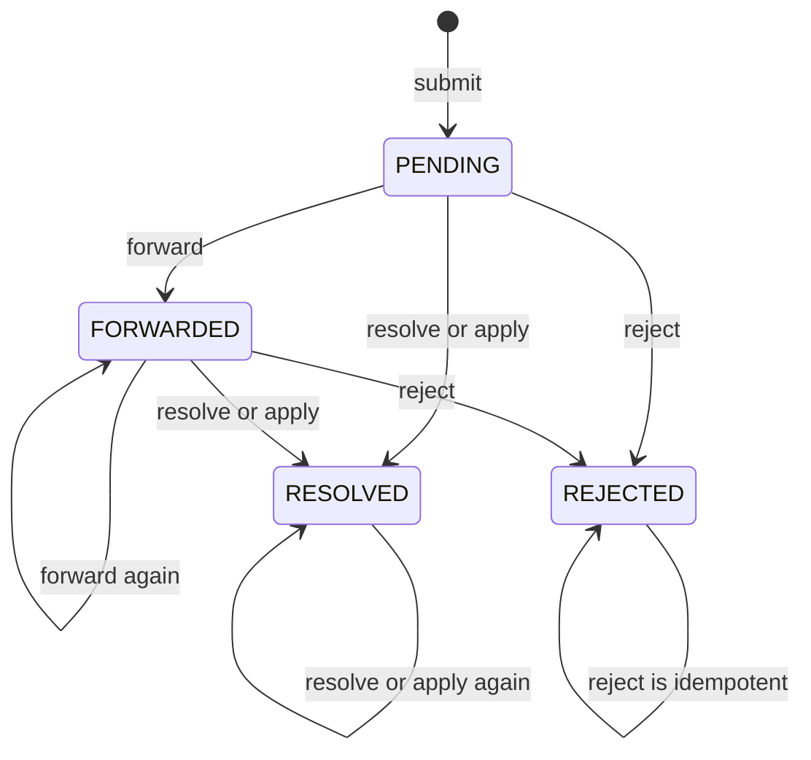

# Schema — Guest Correction Tables

> **Audience:** Backend / DBA · **Source:** `platform/model/correction/`, `platform/enums/CorrectionStatus.java`, `platform/enums/CorrectionMediaType.java`, `platform/enums/GuestCorrectionAuditAction.java`, `platform/repo/correction/`, `platform/config/GuestCorrectionAuditActionConstraintInitializer.java`

The correction module lets any signed-in user suggest a fix to one field of one **live** media
record — `GuestCorrectionService.resolveMediaInfo` checks only that the target row is not
soft-deleted, never that it is public. A suggestion lives in `guest_corrections`; single-record
views, the admin search and every state change are written to `guest_correction_audit_logs` (the
guest's own `/api/corrections/me` list, `/stats` and the catalog endpoints write nothing).
Neither table declares a JPA association — a correction points at its
target record and at its people through denormalized snapshot columns (media type + business code,
usernames), so nothing cascades and no foreign key exists to break when a media row is trashed.

## Tables at a glance

| Table | Java entity | Purpose | Rows grow with |
|---|---|---|---|
| `guest_corrections` | `ak.dev.khi_archive_platform.platform.model.correction.GuestCorrection` | One suggested field correction, its workflow status, and the admin decision | Every correction a signed-in visitor submits |
| `guest_correction_audit_logs` | `ak.dev.khi_archive_platform.platform.model.correction.GuestCorrectionAuditLog` | Immutable trail of every submit / view / list / forward / resolve / reject / remove | Every audited call — submit, single-record view, admin search and every mutation; read-only views and searches included |

There are no `@ElementCollection`, `@CollectionTable` or `@JoinTable` mappings in this module, so
these two tables are the complete set.

---

## `guest_corrections`

**Entity:** `ak.dev.khi_archive_platform.platform.model.correction.GuestCorrection`

| Column | Type | Null | Default | Description |
|---|---|---|---|---|
| `id` | `bigint` identity | NOT NULL | identity | **PK.** `@GeneratedValue(strategy = IDENTITY)` |
| `media_type` | `varchar(10)` | NOT NULL | — | `@Enumerated(STRING)` `CorrectionMediaType`: `AUDIO`, `VIDEO`, `IMAGE`, `TEXT`. Half of the target pointer |
| `media_code` | `varchar(255)` | NOT NULL | — | Business code of the target record (`audios.audio_code`, `videos.video_code`, `images.image_code`, `texts.text_code`). Logical reference only — **no FK** |
| `media_title` | `varchar(255)` | NULL | — | Title snapshot taken at submission time. No `length` given, so Hibernate's `varchar(255)` default applies |
| `target_field` | `varchar(100)` | NOT NULL | — | Java property name of the field being corrected (e.g. `originTitle`). Column comment: "The public field name the guest wants to correct" |
| `current_value` | `text` | NULL | — | `columnDefinition = "TEXT"`. Snapshot of the field value at submission time |
| `suggested_value` | `text` | NOT NULL | — | `columnDefinition = "TEXT"`. The value the guest believes is correct |
| `note` | `text` | NULL | — | `columnDefinition = "TEXT"`. Optional explanation from the guest |
| `guest_user_id` | `bigint` | NULL | — | Submitter. Logical reference to `users_tbl.user_id`; **no FK constraint** |
| `guest_username` | `varchar(80)` | NULL | — | Username snapshot of the submitter |
| `guest_display_name` | `varchar(120)` | NULL | — | Display-name snapshot of the submitter |
| `status` | `varchar(20)` | NOT NULL | no DB default | `@Enumerated(STRING)` `CorrectionStatus`. `@Builder.Default` sets `PENDING` in Java, not in DDL |
| `record_created_by` | `varchar(120)` | NULL | — | Username of the employee who created the target media record (copied from that row's `created_by`). Drives forwarding |
| `forwarded_by` | `varchar(80)` | NULL | — | Username of the admin who forwarded the correction |
| `forwarded_at` | `timestamp(6) with time zone` | NULL | — | When the forward happened |
| `forward_note` | `text` | NULL | — | `columnDefinition = "TEXT"`. Admin's note attached to the forward |
| `resolved_by` | `varchar(80)` | NULL | — | Username of the admin who resolved **or rejected** the correction |
| `resolved_at` | `timestamp(6) with time zone` | NULL | — | Set on resolve, apply and reject alike |
| `resolve_note` | `text` | NULL | — | `columnDefinition = "TEXT"`. Note recorded with the resolve/reject/apply decision |
| `created_at` | `timestamp(6) with time zone` | NOT NULL | — | Submission time. Set by the service, not by a DB default |
| `updated_at` | `timestamp(6) with time zone` | NULL | — | Touched by every admin action, including soft delete |
| `removed_at` | `timestamp(6) with time zone` | NULL | — | Soft-delete marker. `NULL` means live |
| `removed_by` | `varchar(80)` | NULL | — | Username of the admin who soft-deleted the row |
| `version` | `bigint` | NULL | — | `@Version` optimistic-lock counter. No `@Column`, so the name is the snake_case default of `version` |

**Keys and constraints**

| Kind | Definition | Source |
|---|---|---|
| Primary key | `id` | `@Id` + `@GeneratedValue(IDENTITY)` |
| Unique | _None._ No `@Column(unique = true)` and no `uniqueConstraints` on `@Table` | — |
| Foreign keys | _None._ `guest_user_id` and `media_code` are unconstrained snapshot columns | — |
| CHECK (enum) | Hibernate emits a `CHECK (media_type IN ('AUDIO','VIDEO','IMAGE','TEXT'))` and a `CHECK (status IN ('PENDING','FORWARDED','RESOLVED','REJECTED'))` when it first creates those columns | Hibernate DDL for `@Enumerated(STRING)` |
| Optimistic lock | `version` — concurrent admin actions on the same correction fail with `OptimisticLockingFailureException` | `@Version` |

The two CHECK constraint names are Hibernate-generated and are not referenced anywhere in source, so
they are not documented here — see the Notes for how to look them up and why they matter.

**Indexes** — all four are declared on the entity's `@Table(indexes = …)` and are therefore created
by Hibernate under `ddl-auto=update`. **No `JdbcTemplate` initializer creates any index on this
table.**

| Index | Columns | Serves |
|---|---|---|
| `idx_gc_media` | `media_type, media_code, removed_at` | "All live corrections for this record", and `countByMediaTypeAndMediaCodeAndRemovedAtIsNull` (declared on the repository; no caller in source yet). Leading column is `media_type`, so a `media_code`-only predicate does not use it well |
| `idx_gc_status` | `status, removed_at` | Status filter in the admin search, and the four `countByStatusAndRemovedAtIsNull` calls behind the analytics correction stats |
| `idx_gc_guest` | `guest_user_id` | `findAllByGuestUserIdAndRemovedAtIsNull` — a user's own submissions |
| `idx_gc_created_at` | `created_at` | Default `ORDER BY created_at DESC` and the `from`/`to` range filter |

**Relationships** — none mapped. The entity has no `@OneToMany`, `@ManyToOne`, `@ManyToMany` or
`@ElementCollection`. Links to other tables are all logical:

| Field | Points at | How it is resolved |
|---|---|---|
| `media_type` + `media_code` | `audios` / `videos` / `images` / `texts` | `GuestCorrectionService.resolveMediaInfo` switches on `media_type` and calls `findBy<X>CodeAndRemovedAtIsNull(mediaCode)` |
| `guest_user_id` | `users_tbl.user_id` | Taken from the authenticated principal at submit time |
| `record_created_by` | `users_tbl.username` | Copied from the target media row's `created_by`; re-looked-up at forward time |

**Notes**

- **Soft delete is the only delete.** `adminRemove` stamps `removed_at`/`removed_by` and saves; there
  is no hard delete path, and a second `DELETE` on an already-removed row returns early as a no-op.
  Three lookups deliberately see removed rows: `adminGetById` and `adminRemove` both use plain
  `findById`, and `adminSearch` drops the `removed_at IS NULL` predicate when its `includeRemoved`
  flag is true. Everything else filters on `removed_at IS NULL`. Write `AND removed_at IS NULL` in any
  ad-hoc query unless you deliberately want the archive.
- **Values are HTML-escaped on write.** `target_field`, `current_value`, `suggested_value`, `note`,
  `forward_note` and `resolve_note` all pass through `HtmlUtils.htmlEscape`, so stored text can
  contain `&amp;`, `&lt;` and friends. Exact-match searching on these columns needs the same escaping.
- **`media_title` is narrower than its source.** `guest_corrections.media_title` is `varchar(255)`
  (no `length` on the `@Column`), while `audios.origin_title` and the three `original_title` columns
  are `columnDefinition = "TEXT"`. A submission against a record whose title exceeds 255 characters
  fails at insert with `value too long for type character varying(255)`.
- **Column comments exist.** `target_field`, `current_value`, `suggested_value`, `note` and
  `record_created_by` carry `@Comment`, which Hibernate emits as `COMMENT ON COLUMN`. They show up in
  `\d+ guest_corrections`.
- **Enum CHECK constraints do not refresh.** `ddl-auto=update` never rewrites a CHECK once the column
  exists. Adding a value to `CorrectionStatus` or `CorrectionMediaType` will make inserts fail with
  `violates check constraint` on an existing database. `guest_correction_audit_logs.action` has a
  dedicated re-sync initializer; **`guest_corrections.media_type` and `guest_corrections.status` do
  not.** Adding an enum value there requires writing an equivalent initializer or dropping the
  constraint by hand. Find the current names with the same query the existing initializer uses,
  substituting the table and column.
- **`status` has no database default.** `PENDING` comes from `@Builder.Default` in Java. Rows inserted
  by hand must set it explicitly.
- Analytics reads this table directly through the repository (`countByStatusAndRemovedAtIsNull`,
  `countByMediaTypeAndRemovedAtIsNull`), not through the audit-log UNION.

### `CorrectionMediaType` — how a correction points at its target

A correction never stores the target's primary key. It stores the pair
(`media_type`, `media_code`), and the service resolves that pair to a row at submit time and again at
apply time.

| `media_type` | Target table | Matched column | Repository method | `media_title` snapshot source |
|---|---|---|---|---|
| `AUDIO` | `audios` | `audio_code` | `findByAudioCodeAndRemovedAtIsNull` | `origin_title` |
| `VIDEO` | `videos` | `video_code` | `findByVideoCodeAndRemovedAtIsNull` | `original_title` |
| `IMAGE` | `images` | `image_code` | `findByImageCodeAndRemovedAtIsNull` | `original_title` |
| `TEXT` | `texts` | `text_code` | `findByTextCodeAndRemovedAtIsNull` | `original_title` |

Each `*_code` column is `varchar(255)`, `unique = true`, `NOT NULL` on its own table, which is why
`media_code` is a usable business key. Consequences for queries:

- Joining a correction to its record requires branching on `media_type`; a plain join is impossible.
  A UNION ALL of four `media_type = '…' AND c.media_code = m.<x>_code` legs is the shape to write.
- The lookup at submit time uses `…AndRemovedAtIsNull`, so a correction can only be created against a
  live record — but the record can be trashed afterwards, leaving the correction pointing at a
  soft-deleted row. `media_title` and `record_created_by` keep the submission readable in that case.
- `adminApply` re-resolves the same pair and throws `CORRECTION_NOT_FOUND` (`404`) if the record has
  since been trashed.
- `target_field` is validated only at apply time, against a hard-coded per-type allowlist in
  `GuestCorrectionService` (`applyToAudio` / `applyToVideo` / `applyToImage` / `applyToText`); an
  unlisted name raises `IllegalArgumentException`. A row can therefore hold a `target_field` that no
  `apply` will ever accept — the `@ElementCollection` fields (`tags`, `keywords`, `genre`, `subject`,
  and `contributors` on `AUDIO`) are excluded from every allowlist because they live in side tables.
  `contributor` on `VIDEO` and `contributors` on `TEXT` are *not* collections — they are plain
  `TEXT` columns on `videos` / `texts` and they **are** in their allowlists.

### `CorrectionStatus` — legal transitions



| Status | Meaning | Set by |
|---|---|---|
| `PENDING` | Submitted by guest, awaiting admin review | `POST /api/corrections` |
| `FORWARDED` | Admin forwarded to the employee who created the record | `POST /api/admin/corrections/{id}/forward` |
| `RESOLVED` | Admin marked as resolved, or applied the value directly | `.../resolve`, `.../apply` |
| `REJECTED` | Admin rejected the suggestion | `.../reject` |

What each action does per current status:

| From \ Action | `forward` | `resolve` | `apply` | `reject` | `DELETE` |
|---|---|---|---|---|---|
| `PENDING` | → `FORWARDED` | → `RESOLVED` | writes field, → `RESOLVED` | → `REJECTED` | soft delete, status unchanged |
| `FORWARDED` | → `FORWARDED`, sends another warning | → `RESOLVED` | writes field, → `RESOLVED` | → `REJECTED` | soft delete, status unchanged |
| `RESOLVED` | `409 CORRECTION_ALREADY_PROCESSED` | → `RESOLVED`, re-stamps `resolved_*` | re-writes field, re-stamps | `409 CORRECTION_ALREADY_PROCESSED` | soft delete, status unchanged |
| `REJECTED` | `409 CORRECTION_ALREADY_PROCESSED` | `409 CORRECTION_ALREADY_PROCESSED` | `409 CORRECTION_ALREADY_PROCESSED` | no-op, returns the row unchanged | soft delete, status unchanged |

Query-relevant details behind that table:

- `RESOLVED` and `REJECTED` are not terminal at the DB level. `resolve` and `apply` accept an already
  `RESOLVED` row and overwrite `resolved_by`, `resolved_at` and `resolve_note`, so those columns hold
  the **latest** decision, not the first one. `guest_correction_audit_logs` is the only record of the
  earlier ones.
- `reject` also writes `resolved_by` / `resolved_at` / `resolve_note` — those three columns do not
  imply `status = 'RESOLVED'`. Filter on `status` explicitly.
- Forward, resolve, apply and reject all load the row with `findByIdAndRemovedAtIsNull`, so a
  soft-deleted correction returns `404 CORRECTION_NOT_FOUND` rather than a conflict.
- `removed_at` is orthogonal to `status`: a removed row keeps whatever status it had.

### Forwarding — the link to `user_warnings`

`GuestCorrectionService.adminForward` calls `UserWarningService.send(...)` before it flips the status,
so a forward inserts one row into `user_warnings` and one row into `user_audit_logs` (action
`WARNING_SENT`) in addition to updating `guest_corrections`.

| Warning column | Value written for a forwarded correction |
|---|---|
| `target_user_id` | `AdminCorrectionForwardRequestDTO.targetEmployeeId` when supplied; otherwise the `users_tbl` row whose `username` equals `guest_corrections.record_created_by` |
| `severity` | `INFO` (hard-coded — a correction is never `WARNING` or `CRITICAL`) |
| `title` | `"Correction Suggestion: <media_type> [<media_code>] — field: <target_field>"`, truncated to 197 chars plus `...` when the **raw** string exceeds 200. `UserWarningService.send` HTML-escapes it afterwards (the `—` alone becomes `&mdash;`), so the stored title can still overflow the `varchar(200)` column |
| `message` | Multi-line summary built by `buildForwardMessage` — media, title, field, current value, suggested value, guest note, submitter, admin note. `buildForwardMessage` HTML-escapes it and `UserWarningService.send` escapes it a second time, so entities land double-escaped (`&` → `&amp;amp;`) |
| `actor_user_id` / `actor_username` | The forwarding admin |

**There is no correction ↔ warning foreign key, and no `warning_id` column on `guest_corrections`.**
The only join path between the two tables is text matching on the warning `title` (which embeds
`media_type`, `media_code` and `target_field`) — and that path is lossy once the title is truncated.
If a report needs a reliable link, the audit trail is the better source: the `FORWARD` row in
`guest_correction_audit_logs` carries `correction_id`, the actor, and a `details` string naming the
target employee.

Failure modes worth knowing before trusting `status = 'FORWARDED'`:

- **No target resolved** — if `record_created_by` is `NULL`/blank or no `users_tbl` row matches it, no
  warning is created at all, yet the status still becomes `FORWARDED` and `forwarded_by` /
  `forwarded_at` are still stamped. `FORWARDED` therefore does not guarantee a `user_warnings` row.
- **Admin forwards their own record** — `UserWarningService.send` refuses a self-warning
  (`SELF_WARNING`), which aborts the whole transactional method, so nothing is written.
- **Explicit `targetEmployeeId` that does not exist** — `EMPLOYEE_NOT_FOUND`, nothing is written.
- **Re-forwarding a `FORWARDED` correction** is allowed and sends a second warning; `forwarded_by`,
  `forwarded_at` and `forward_note` are overwritten by the newer forward.

---

## `guest_correction_audit_logs`

**Entity:** `ak.dev.khi_archive_platform.platform.model.correction.GuestCorrectionAuditLog`

Written by `GuestCorrectionAuditService.record(...)`, which runs in
`@Transactional(propagation = REQUIRES_NEW)` — the audit row survives even when the surrounding
business transaction rolls back.

| Column | Type | Null | Default | Description |
|---|---|---|---|---|
| `id` | `bigint` identity | NOT NULL | identity | **PK.** `@GeneratedValue(strategy = IDENTITY)` |
| `correction_id` | `bigint` | NULL | — | Logical reference to `guest_corrections.id`; **no FK**. `NULL` for `LIST`, which is not tied to one row |
| `media_type` | `varchar(10)` | NULL | — | `@Enumerated(STRING)` `CorrectionMediaType`, copied from the correction |
| `media_code` | `varchar(255)` | NULL | — | Copied from the correction |
| `media_title` | `varchar(255)` | NULL | — | Copied from the correction. No `length`, so the `varchar(255)` default |
| `target_field` | `varchar(100)` | NULL | — | Copied from the correction |
| `action` | `varchar(30)` | NOT NULL | — | `@Enumerated(STRING)` `GuestCorrectionAuditAction`. See the value table below |
| `actor_user_id` | `bigint` | NULL | — | Logical reference to `users_tbl.user_id`; **no FK** |
| `actor_username` | `varchar(255)` | NULL | — | Falls back to `authentication.getName()`, then the literal `anonymous`. No `length`, so `varchar(255)` |
| `actor_display_name` | `varchar(255)` | NULL | — | Same fallback chain as `actor_username` |
| `actor_authorities` | `text` | NULL | — | `columnDefinition = "TEXT"`. Comma-joined granted authorities, `ROLE_*` included |
| `actor_permissions` | `text` | NULL | — | `columnDefinition = "TEXT"`. Same list with `ROLE_*` filtered out |
| `device_info` | `varchar(255)` | NULL | — | From the matching `sessions` row, else the `User-Agent` header |
| `ip_address` | `varchar(255)` | NULL | — | From the matching `sessions` row, else `request.getRemoteAddr()` |
| `session_id` | `varchar(255)` | NULL | — | The JWT's session id; logical reference to `sessions.session_id`, **no FK** |
| `session_login_timestamp` | `timestamp(6) with time zone` | NULL | — | Snapshot from the `sessions` row |
| `session_expires_at` | `timestamp(6) with time zone` | NULL | — | Snapshot from the `sessions` row |
| `session_is_active` | `boolean` | NULL | — | Snapshot from the `sessions` row. Java field is `sessionActive`; the column name is set explicitly |
| `request_method` | `varchar(255)` | NULL | — | `request.getMethod()` |
| `request_path` | `varchar(255)` | NULL | — | `request.getRequestURI()` |
| `details` | `text` | NULL | — | `columnDefinition = "TEXT"`. Free-text summary, HTML-escaped |
| `occurred_at` | `timestamp(6) with time zone` | NOT NULL | — | `Instant.now()` at write time |

**Keys and constraints**

| Kind | Definition | Source |
|---|---|---|
| Primary key | `id` | `@Id` + `@GeneratedValue(IDENTITY)` |
| Unique | _None._ | — |
| Foreign keys | _None._ `correction_id`, `actor_user_id` and `session_id` are unconstrained | — |
| CHECK | `guest_correction_audit_logs_action_check` on `action` | Created by Hibernate, then dropped and rebuilt every boot by `GuestCorrectionAuditActionConstraintInitializer` |
| Optimistic lock | _None._ No `@Version` — rows are append-only | — |

The initializer runs on `ApplicationReadyEvent`. It first finds every existing CHECK on the `action`
column:

```sql
SELECT con.conname
FROM pg_constraint con
JOIN pg_class c ON c.oid = con.conrelid
JOIN pg_attribute a
  ON a.attrelid = c.oid AND a.attnum = ANY(con.conkey)
WHERE c.relname = 'guest_correction_audit_logs'
  AND con.contype = 'c'
  AND a.attname = 'action'
```

drops each one:

```sql
ALTER TABLE guest_correction_audit_logs DROP CONSTRAINT IF EXISTS "<conname>"
```

and re-adds a single constraint built from the current enum values:

```sql
ALTER TABLE guest_correction_audit_logs
ADD CONSTRAINT guest_correction_audit_logs_action_check
CHECK (action IN ('SUBMIT','VIEW','LIST','FORWARD','RESOLVE','REJECT','REMOVE'))
```

The whole method is wrapped in a `try`/`catch` that only logs a warning, so a failure here is silent
apart from the log line `Could not re-sync guest_correction_audit_logs_action_check`.

**Indexes** — all four come from the entity's `@Table(indexes = …)`, created by Hibernate under
`ddl-auto=update`. **No initializer adds indexes to this table** — see the Notes.

| Index | Columns | Serves |
|---|---|---|
| `idx_gcal_correction` | `correction_id` | Full history of one correction |
| `idx_gcal_action` | `action` | "All forwards", "all rejects" |
| `idx_gcal_actor` | `actor_username` | Per-admin activity |
| `idx_gcal_occurred_at` | `occurred_at` | Time-window scans |

**Relationships** — none mapped. `GuestCorrectionAuditLogRepository` is a bare
`JpaRepository<GuestCorrectionAuditLog, Long>` with no derived queries; the entity has no JPA
associations, and all references (`correction_id`, `actor_user_id`, `session_id`) are plain columns.

**Notes**

- **Reads are audited too.** `VIEW` and `LIST` write rows, so this table grows on every admin page
  view of the corrections screen, not only on mutations. `LIST` rows have `correction_id`,
  `media_type`, `media_code`, `media_title` and `target_field` all `NULL`. The exception is the
  guest's own paged list (`GET /api/corrections/me`, `getMyCorrections`), which writes no audit row
  at all — only the single-record `GET /api/corrections/me/{id}` does.
- **`REQUIRES_NEW` means audit rows can outlive their subject.** A `SUBMIT` audit row is committed
  independently; if the outer transaction later fails, the audit row remains with a `correction_id`
  that may not exist. Left-join, never inner-join, from this table to `guest_corrections`.
- **Two actions map to `RESOLVE`.** Both `adminResolve` and `adminApply` record
  `GuestCorrectionAuditAction.RESOLVE`; the direct-apply case is distinguishable only by the `details`
  text, which starts with `Applied field='`.
- **This table is excluded from the analytics UNION and its index initializer.**
  `AuditLogIndexInitializer` lists exactly `audio_audit_logs`, `video_audit_logs`, `image_audit_logs`,
  `text_audit_logs`, `project_audit_logs`, `category_audit_logs`, `person_audit_logs`,
  `maqam_audit_logs`, `physical_media_audit_logs`, `analytics_audit_logs` and `user_audit_logs` — not
  `guest_correction_audit_logs`. It therefore has none of the
  `(actor_username, occurred_at DESC)` / `(occurred_at DESC)` / `(action, occurred_at DESC)`
  composite indexes the other audit tables get, and it does not appear in `AnalyticsService`'s
  UNION ALL. Correction figures reach analytics through repository counts on `guest_corrections`
  instead. A per-user, per-day report over this table will seq-scan; add the composite index (or the
  table to that initializer's `TABLES` list) before writing one.
- **No retention or purge job exists in source.** Rows accumulate indefinitely.

**`GuestCorrectionAuditAction` values**

| Value | Written when | `correction_id` |
|---|---|---|
| `SUBMIT` | Guest submitted a new correction suggestion | set |
| `VIEW` | Admin or guest viewed a single correction | set |
| `LIST` | Admin listed / searched corrections | `NULL` |
| `FORWARD` | Admin forwarded to the employee who created the record | set |
| `RESOLVE` | Admin marked resolved, **or** applied the value directly | set |
| `REJECT` | Admin rejected the correction | set |
| `REMOVE` | Admin soft-deleted the correction | set |

---

## Naming rules applied

Every table and column name in this file is explicit in source except one, which follows Hibernate's
default `CamelCase` → `snake_case` physical naming strategy. Column lengths are likewise taken from
source except where the `@Column` gives none:

| Name | Inferred from | Rule |
|---|---|---|
| `guest_corrections.version` | `@Version private Long version` — no `@Column` | Property name lowercased; single word, so unchanged |
| Lengths shown as `varchar(255)` | `@Column` without `length` on a `String` | Hibernate's default column length of 255 |

`session_is_active` is **not** inferred — the Java field is `sessionActive` but
`@Column(name = "session_is_active")` names it explicitly.

Column SQL types follow Hibernate 6's PostgreSQL mapping: `Long` → `bigint`, `Boolean` → `boolean`,
`String` → `varchar(n)` unless `columnDefinition = "TEXT"` forces `text`, and `java.time.Instant` →
`timestamp(6) with time zone`. `application.yaml` carries no naming-strategy or column-type override;
the only schema-relevant key it sets is `spring.jpa.hibernate.ddl-auto: update`. The `dialect` /
`format_sql` / `time_zone` keys sit under `spring.jpa.hibernate.properties.hibernate.*` and
`spring.jpa.jdbc.*` rather than Boot's `spring.jpa.properties.hibernate.*`, which are not real
property paths — those keys are inert and never reach Hibernate. Column types are unaffected
(Hibernate auto-detects `PostgreSQLDialect` from the connection), but the inert
`spring.jpa.jdbc.time_zone: UTC` means `Instant` values bind in the JVM default zone. See
[Indexes and performance](./indexes-and-performance.md#eight-hibernate-keys-are-inert-verified).
The schema is created by Hibernate alone:
there is no Flyway or Liquibase dependency in `pom.xml`.

## Related

- [Database documentation index](./README.md)
- [Schema — Content Tables](./schema-content.md) — the `audios` / `videos` / `images` / `texts`
  tables a correction points at through `media_type` + `media_code`
- [Schema — Users, Sessions and Security](./schema-users-security.md) — `users_tbl`, `user_warnings`
  (the row a forward creates) and `sessions`
- [Schema — Audit and Activity-Log Tables](./schema-audit.md) — the other `*_audit_logs` tables and
  the analytics UNION that this one is not part of
- [Migrations and initializers](./migrations.md) — how `ddl-auto=update` plus the boot-time
  `JdbcTemplate` initializers stand in for a migration tool (there is no Flyway or Liquibase on the
  classpath)
