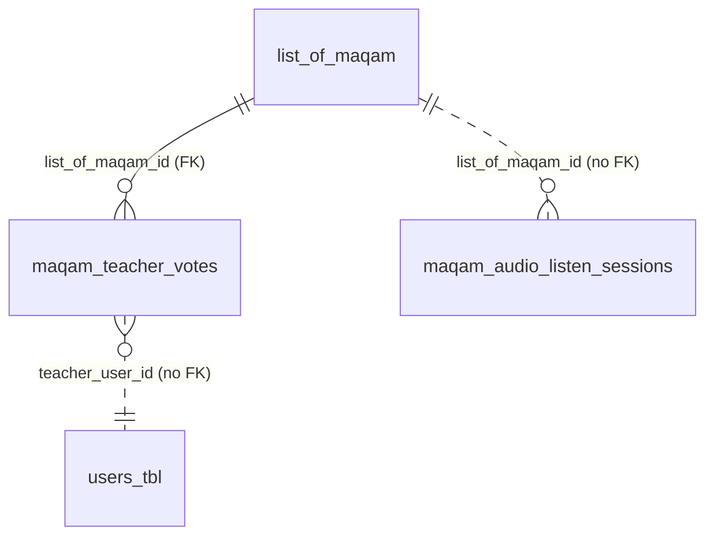

# Schema — Maqam Tables

> **Audience:** Backend / DBA · **Source:** `platform/model/maqam/`, `platform/repo/maqam/`,
> `platform/service/maqam/MaqamService.java`, `platform/config/MaqamAuditActionConstraintInitializer.java`

The maqam module stores a curated song record (`list_of_maqam`), the small panel of 1–3 teachers
attached to it (`maqam_teacher_votes`, one row per teacher, carrying that teacher's classification
vote), and a granular per-play listen log (`maqam_audio_listen_sessions`). Audio bytes live on S3;
the URL column is internal-only and playback happens through the range-streaming endpoint so every
listened second is accounted for in the session table.

## Tables at a glance

| Table | Java entity | Purpose | Rows grow with |
|---|---|---|---|
| `list_of_maqam` | `ListOfMaqam` | Song record: name, producer/singer, S3 audio metadata, archive note, soft-trash + optimistic-lock columns | One row per curated song record |
| `maqam_teacher_votes` | `MaqamTeacherVote` | Teacher panel membership **and** that teacher's vote/note, plus their rolled-up listen aggregates | 1–3 rows per `list_of_maqam` row (see the panel-cap note) |
| `maqam_audio_listen_sessions` | `MaqamAudioListenSession` | One row per play session; accumulates seconds listened from progress pings | Every play session by every assigned teacher — the fastest-growing maqam table |

There are **no** `@ElementCollection`, `@CollectionTable` or `@JoinTable` declarations anywhere in
`platform/model/maqam/`, so the maqam module owns no collection or join tables. The
`ListOfMaqam` → `MaqamTeacherVote` relationship is a plain `mappedBy` one-to-many over the FK column
`maqam_teacher_votes.list_of_maqam_id`, not a join table.

`maqam_audit_logs` (entity `MaqamAuditLog`) is also part of this module but is documented with the
other `*_audit_logs` tables — see [Related](#related).

**Type conventions used below.** Dialect is `org.hibernate.dialect.PostgreSQLDialect` with
`ddl-auto=update` (`application.yaml`). `Long` → `bigint`; a `@GeneratedValue(strategy = IDENTITY)`
`Long` PK → `bigint GENERATED BY DEFAULT AS IDENTITY`; `String` with `length = n` → `varchar(n)`;
`String` with `columnDefinition = "TEXT"` → `text`; `java.time.Instant` → `timestamp(6) with time zone`.



---

## `list_of_maqam`

**Entity:** `ak.dev.khi_archive_platform.platform.model.maqam.ListOfMaqam`

| Column | Type | Null | Default | Description |
|---|---|---|---|---|
| `id` | `bigint` identity | no | identity | **PK**. No `@Column`, so the field name `id` maps unchanged |
| `maqam_code` | `varchar(100)` | no | — | Business key used in every URL and audit row. Format `MAQAM_000001`. `@Column(unique = true)` |
| `song_name` | `text` | no | — | `columnDefinition = "TEXT"` |
| `producer` | `text` | no | — | Producer = singer of the recording. `columnDefinition = "TEXT"` |
| `audio_file_url` | `varchar(1000)` | no | — | Internal S3 URL. Never returned by the API; reads go through the streaming endpoint |
| `audio_file_name` | `varchar(500)` | yes | — | Original upload filename, surfaced in DTOs without exposing the URL |
| `audio_content_type` | `varchar(120)` | yes | — | MIME type recorded at upload; sets `Content-Type` on every range response |
| `audio_file_size_bytes` | `bigint` | yes | — | Size reported by the multipart upload |
| `audio_duration_seconds` | `bigint` | yes | — | Best-effort duration. **No application code writes this column** — `MaqamService` only ever reads it — so in practice it is `NULL` unless populated out-of-band. When null the listen tracker still records absolute seconds but cannot clamp or compute "% heard" |
| `archive_note` | `text` | yes | — | Editorial note by the archive team. Teachers may not edit it |
| `created_at` | `timestamp(6) with time zone` | yes | — | Set in `@PrePersist` if null |
| `updated_at` | `timestamp(6) with time zone` | yes | — | Set in `@PrePersist`, refreshed in `@PreUpdate` |
| `removed_at` | `timestamp(6) with time zone` | yes | — | Soft-trash marker. `NULL` = active |
| `created_by` | `varchar(120)` | yes | — | Actor username snapshot |
| `updated_by` | `varchar(120)` | yes | — | Actor username snapshot |
| `removed_by` | `varchar(120)` | yes | — | Actor username snapshot |
| `version` | `bigint` | no | `0` | **Optimistic lock** (`@Version`) with `@ColumnDefault("0")`; also defaulted to `0L` in `@PrePersist` |

**Keys and constraints**

- PK — `id`.
- Unique — `maqam_code`, from `@Column(name = "maqam_code", unique = true, ...)`. The constraint is
  unnamed in source, so Hibernate generates the name; the generated name is
  _Not documented in source._
- FKs — none outgoing. `created_by` / `updated_by` / `removed_by` are username **snapshots**
  (`varchar`), not references to `users_tbl`.
- CHECK — none. There is no enum-typed column on this table, so no Hibernate-generated
  `CHECK (col IN (...))` and no re-sync initializer applies to it.
- No DB-level constraint caps the teacher panel — see **Notes**.

**Indexes**

All three come from `@Table(indexes = ...)` on the entity, so Hibernate creates them under
`ddl-auto=update`. No `JdbcTemplate` initializer in `platform/config` touches this table.

| Index | Columns | Created by |
|---|---|---|
| `idx_maqam_code` | `maqam_code` | Hibernate, from `@Index` on `ListOfMaqam` |
| `idx_maqam_removed_at` | `removed_at` | Hibernate, from `@Index` on `ListOfMaqam` |
| `idx_maqam_created_at` | `created_at` | Hibernate, from `@Index` on `ListOfMaqam` |

**Relationships**

| Field | Kind | Fetch | Cascade | Orphan removal | Target table / column |
|---|---|---|---|---|---|
| `teacherVotes` | `@OneToMany(mappedBy = "listOfMaqam")` | `LAZY` | `CascadeType.ALL` | `true` | `maqam_teacher_votes.list_of_maqam_id` |

The owning side is `MaqamTeacherVote.listOfMaqam`; there is no join table. `@Builder.Default`
initializes the list to an empty `ArrayList`, so a builder-constructed record never has a null
collection.

> The Javadoc on `teacherVotes` says "Eager-load is intentional", but the annotation on the field is
> `fetch = FetchType.LAZY`. The annotation is what Hibernate applies; the comment is stale.

**Notes**

- **Soft trash.** `DELETE` sets `removed_at` / `removed_by`; the row stays. Every read path filters
  on `removed_at IS NULL` (`findByMaqamCodeAndRemovedAtIsNull`, `findAllByRemovedAtIsNull`,
  `countByRemovedAtIsNull`), and the admin trash listing uses the `IsNotNull` variants. Any new query
  must filter this column explicitly or it will return trashed records.
- **Purge is a real delete.** `MaqamService.purge` requires `removed_at IS NOT NULL`, then calls
  `maqamRepository.delete(record)`. Cascade + orphan removal deletes the record's
  `maqam_teacher_votes` rows, and the S3 object is deleted afterwards. It does **not** delete
  `maqam_audio_listen_sessions` rows — see that table's Notes.
- **`maqam_code` generation is count-based.** `MaqamService.create` takes
  `codeGenLock.lock("maqam-code-gen")`, then builds the code as
  `String.format(Locale.ROOT, "%s_%06d", MAQAM_CODE_PREFIX, maqamRepository.count() + 1)` with
  `MAQAM_CODE_PREFIX = "MAQAM"`. The lock only serialises concurrent creates; because `count()`
  includes trashed rows but not purged ones, a purge can still make the next generated code collide
  with an existing one, and the unique constraint is what catches it.
- **`version` is a real optimistic lock.** Concurrent updates to the same record raise
  `OptimisticLockException`. `MaqamTeacherVoteRepository.bumpListen` increments its own row's
  `version` manually inside a bulk `UPDATE` (see that table).

---

## `maqam_teacher_votes`

**Entity:** `ak.dev.khi_archive_platform.platform.model.maqam.MaqamTeacherVote`

One row is created per teacher **at assignment time**, before any vote is cast. A row therefore means
"this teacher is on the panel"; `voted_at IS NOT NULL` means "and has actually voted".

| Column | Type | Null | Default | Description |
|---|---|---|---|---|
| `id` | `bigint` identity | no | identity | **PK**. Field name `id`, no `@Column` |
| `list_of_maqam_id` | `bigint` | no | — | **FK** → `list_of_maqam.id`, from `@JoinColumn(name = "list_of_maqam_id", nullable = false)` on a `@ManyToOne(optional = false)` |
| `teacher_user_id` | `bigint` | no | — | User id of the teacher. Plain scalar column — **not** a mapped association, so no FK constraint is generated (logical reference to `users_tbl.user_id`) |
| `teacher_username` | `varchar(80)` | no | — | Username snapshot, so audit surfaces still read correctly after a rename |
| `teacher_display_name` | `varchar(120)` | yes | — | Display-name snapshot |
| `maqam_type` | `text` | yes | — | Free-form maqam type the teacher identifies (e.g. "Rast", "Bayati"). Deliberately **not** an enum — no closed taxonomy |
| `teacher_note` | `text` | yes | — | The teacher's reasoning / supporting note. Optional |
| `voted_at` | `timestamp(6) with time zone` | yes | — | First time this teacher saved a vote. Frozen after the first `VOTE_CAST`; later edits bump `updated_at` only. `NULL` = assigned but not yet voted — **or** the admin cleared the vote (see Notes) |
| `updated_at` | `timestamp(6) with time zone` | yes | — | Last update to the vote or note. Set explicitly in the service — this entity has **no** `@PreUpdate` hook |
| `total_listen_seconds` | `bigint` | no | — (entity default `0`) | Rolling aggregate of `SUM(seconds_listened)` across this teacher's sessions on this record |
| `max_position_seconds` | `bigint` | no | — (entity default `0`) | Furthest playback offset reached, for "resume where I left off" |
| `last_listen_at` | `timestamp(6) with time zone` | yes | — | Timestamp of the last progress ping |
| `assigned_at` | `timestamp(6) with time zone` | yes | — | When the teacher was put on the panel |
| `assigned_by` | `varchar(120)` | yes | — | Actor username snapshot |
| `version` | `bigint` | no | `0` | **Optimistic lock** (`@Version`) with `@ColumnDefault("0")` |

`total_listen_seconds` and `max_position_seconds` are `nullable = false` with `@Builder.Default = 0L`
in Java, but carry **no** `@ColumnDefault`, so the DB column has no `DEFAULT` clause — a raw
`INSERT` that omits them fails. Only `version` has a declared column default.

**Keys and constraints**

- PK — `id`.
- Unique — `uk_maqam_teacher_one_vote_per_song` on `(list_of_maqam_id, teacher_user_id)`. This is the
  constraint that guarantees one vote row per teacher per song.
- FK — `list_of_maqam_id` → `list_of_maqam(id)`. No `ON DELETE` behavior is declared; deletion of the
  parent is handled in JPA by `CascadeType.ALL` + `orphanRemoval = true` on `ListOfMaqam.teacherVotes`,
  not by the database.
- `teacher_user_id` has **no** FK to `users_tbl`. Deleting a user leaves the vote row behind with its
  snapshotted username.
- CHECK — none. `maqam_type` is a free-form `text` column, not an enum, so no Hibernate
  `CHECK (col IN (...))` is generated and no constraint-re-sync initializer applies.

**Indexes**

All from `@Table(indexes = ...)` on the entity, created by Hibernate under `ddl-auto=update`. No
`JdbcTemplate` initializer in `platform/config` touches this table.

| Index | Columns | Created by |
|---|---|---|
| `idx_mtv_maqam` | `list_of_maqam_id` | Hibernate, from `@Index` on `MaqamTeacherVote` |
| `idx_mtv_teacher` | `teacher_user_id` | Hibernate, from `@Index` on `MaqamTeacherVote` |
| `idx_mtv_voted_at` | `voted_at` | Hibernate, from `@Index` on `MaqamTeacherVote` |

Plus the unique index Postgres creates to back `uk_maqam_teacher_one_vote_per_song`, which also serves
as the leading-column index on `list_of_maqam_id`.

**Relationships**

| Field | Kind | Fetch | Cascade | Orphan removal | Join column |
|---|---|---|---|---|---|
| `listOfMaqam` | `@ManyToOne(optional = false)` | `LAZY` | none declared | n/a | `list_of_maqam_id` (owning side of `ListOfMaqam.teacherVotes`) |

**Notes**

### The 1–3 teacher panel — where it is enforced

The cap lives in **three** places, none of which is a database constraint:

1. **Entity constants** — `ListOfMaqam.MIN_TEACHERS = 1`, `ListOfMaqam.MAX_TEACHERS = 3`.
2. **Bean validation on the assignment DTO** — `MaqamTeacherAssignmentDTO.teacherUserIds` carries
   `@NotNull`, `@NotEmpty(message = "teacherUserIds must contain at least one user id")` and
   `@Size(min = 1, max = 3, message = "between 1 and 3 teachers may be assigned to a maqam record")`.
   `MaqamCreateRequestDTO.teacherUserIds` carries **no** validation annotations; its Javadoc defers to
   the service.
3. **Service layer** — `MaqamService.applyTeacherRoster` de-duplicates the requested ids and throws
   `MaqamValidationException` when the distinct count falls outside the range:

   ```java
   List<Long> distinct = requestedTeacherIds.stream().distinct().toList();
   if (distinct.size() < ListOfMaqam.MIN_TEACHERS || distinct.size() > ListOfMaqam.MAX_TEACHERS) {
       throw new MaqamValidationException(
               "Teacher panel must contain " + ListOfMaqam.MIN_TEACHERS + "–"
                       + ListOfMaqam.MAX_TEACHERS + " distinct teachers (got " + distinct.size() + ")");
   }
   ```

   The same method also rejects unknown user ids, users whose `role != Role.TEACHER`, and deactivated
   accounts, then reconciles the roster (removing rows for dropped teachers, inserting rows for new
   ones) so an update is idempotent.

**Consequences for the DB.** JPA cannot express a row-count limit on a collection, and no CHECK,
trigger or exclusion constraint is created for it. Therefore:

- A direct `INSERT` bypassing the service can put four or more rows on one record. Queries must not
  assume "at most three rows per `list_of_maqam_id`" as an invariant guaranteed by the database.
- **Zero** rows is a legal state. `MaqamService.create` only calls `applyTeacherRoster` when
  `dto.getTeacherUserIds() != null && !dto.getTeacherUserIds().isEmpty()`, so `MIN_TEACHERS` is not
  enforced at creation time — a record can be created with an empty panel and assigned later. This is
  exactly the "unclassified" bucket that `ListOfMaqamRepository.perRecordVoteStats()` reports, which is
  why that query uses a `LEFT JOIN` so zero-assignment records still return a row.
- The only invariant the database itself guarantees is *one row per (record, teacher)*, via
  `uk_maqam_teacher_one_vote_per_song`.

### Other notes

- `total_listen_seconds` is a **denormalized mirror** of `SUM(maqam_audio_listen_sessions.seconds_listened)`
  for the same `(record, teacher)` pair. It is maintained by a bulk `UPDATE`
  (`MaqamTeacherVoteRepository.bumpListen`, `@Modifying(clearAutomatically = true, flushAutomatically = true)`):

  ```sql
  UPDATE MaqamTeacherVote v
     SET v.totalListenSeconds = COALESCE(v.totalListenSeconds, 0) + :delta,
         v.maxPositionSeconds = GREATEST(COALESCE(v.maxPositionSeconds, 0), :position),
         v.lastListenAt       = :now,
         v.version            = COALESCE(v.version, 0) + 1
   WHERE v.id = :voteId
  ```

  Because it is a bulk update it bypasses the persistence context and increments `version` by hand.
  Treat it as advisory: reconcile against the session table when the number has to be exact.
- **Admin "delete vote" does not delete the row.** `MaqamService.deleteVote` sets `maqam_type`,
  `teacher_note` and `voted_at` back to `NULL` and bumps `updated_at`, leaving the teacher on the
  panel. So `voted_at IS NULL` means "assigned but not currently holding a vote", which is not the
  same as "never voted" — only `maqam_audit_logs` (`VOTE_CAST` / `VOTE_DELETED`) preserves that
  history.
- Vote counts must be phrased as `SUM(CASE WHEN voted_at IS NOT NULL THEN 1 ELSE 0 END)`, not
  `COUNT(*)` — `COUNT(*)` counts assignments, including teachers who have not voted. Both
  `perRecordVoteStats()` and `teacherVoteStats()` follow that pattern.
- Analytics rollups (`teacherVoteStats()`) join back to `ListOfMaqam` and filter
  `m.removedAt IS NULL`, so leaderboards cover active records only.

---

## `maqam_audio_listen_sessions`

**Entity:** `ak.dev.khi_archive_platform.platform.model.maqam.MaqamAudioListenSession`

| Column | Type | Null | Default | Description |
|---|---|---|---|---|
| `id` | `bigint` identity | no | identity | **PK**. Field name `id`, no `@Column` |
| `list_of_maqam_id` | `bigint` | no | — | Logical reference to `list_of_maqam.id`. Plain scalar column, **not** a `@ManyToOne` — no FK constraint is generated |
| `maqam_code` | `varchar(100)` | yes | — | Snapshot of the record's business key at session start |
| `teacher_user_id` | `bigint` | no | — | Logical reference to `users_tbl.user_id`. No FK constraint |
| `teacher_username` | `varchar(80)` | no | — | Username snapshot |
| `session_key` | `varchar(100)` | no | — | Client-supplied opaque id (typically a UUID v4) that merges every ping of one play session into a single row |
| `started_at` | `timestamp(6) with time zone` | no | — | Set in `@PrePersist` if null |
| `ended_at` | `timestamp(6) with time zone` | yes | — | Set only when the `end` call arrives. `NULL` = session never reported an end (tab closed, crash) |
| `seconds_listened` | `bigint` | no | — (entity default `0`) | Cumulative seconds the audio element actually advanced during this session — **not** wall-clock since `started_at` |
| `last_position_seconds` | `bigint` | no | — (entity default `0`) | Audio cursor at the last progress ping. `recordProgress` only ever raises it (`Math.max`); a `start` call carrying `startPositionSeconds` overwrites it outright and can therefore lower it |
| `ip_address` | `varchar(64)` | yes | — | `request.getRemoteAddr()` at session start |
| `user_agent` | `varchar(500)` | yes | — | `User-Agent` header at session start |
| `http_session_id` | `varchar(120)` | yes | — | Servlet session id when one exists, else null |
| `created_at` | `timestamp(6) with time zone` | no | — | Set in `@PrePersist` if null |
| `updated_at` | `timestamp(6) with time zone` | yes | — | Set in `@PrePersist`, refreshed in `@PreUpdate` |

None of the `nullable = false` numeric columns declare `@ColumnDefault`, so there are no DB-level
`DEFAULT` clauses — the `0L` starting values come from `@Builder.Default` in Java.

**Keys and constraints**

- PK — `id`.
- Unique — **none**. `session_key` is *not* unique: uniqueness is only assumed per teacher, and it is
  enforced by lookup (`findBySessionKeyAndTeacherUserId`), not by a constraint. Two teachers can submit
  the same key, and a client that reuses a key after a purge can create a second row.
- FKs — **none**. `list_of_maqam_id` and `teacher_user_id` are unmapped scalar columns. Nothing in the
  database ties a session to its record or its user.
- CHECK — none. There are no enum-typed columns on this table.

**Indexes**

All from `@Table(indexes = ...)` on the entity, created by Hibernate under `ddl-auto=update`. No
`JdbcTemplate` initializer in `platform/config` touches this table.

| Index | Columns | Created by |
|---|---|---|
| `idx_mals_maqam` | `list_of_maqam_id` | Hibernate, from `@Index` on `MaqamAudioListenSession` |
| `idx_mals_teacher` | `teacher_user_id` | Hibernate, from `@Index` on `MaqamAudioListenSession` |
| `idx_mals_started_at` | `started_at` | Hibernate, from `@Index` on `MaqamAudioListenSession` |
| `idx_mals_session_key` | `session_key` | Hibernate, from `@Index` on `MaqamAudioListenSession` |

There is no composite `(session_key, teacher_user_id)` index even though that is the pair every
progress ping looks up; `idx_mals_session_key` is the leading-column index the planner uses.

**Relationships**

None. This entity declares no `@OneToMany`, `@ManyToOne`, `@ManyToMany` or `@ElementCollection` — it
is deliberately association-free so writing a session never touches the record's persistence context.
`MaqamAudioListenSessionRepository.listenStatsByTeacher()` therefore joins the parent explicitly in
the `FROM` clause:

```sql
SELECT s.teacherUserId, COUNT(s.id), COALESCE(SUM(s.secondsListened), 0), COUNT(DISTINCT s.listOfMaqamId)
  FROM MaqamAudioListenSession s, ListOfMaqam m
 WHERE m.id = s.listOfMaqamId
   AND m.removedAt IS NULL
 GROUP BY s.teacherUserId
```

**Notes**

### How listen seconds accumulate

The front-end drives three calls and the row is written incrementally:

1. **start** — `MaqamService.startListenSession` looks up
   `findBySessionKeyAndTeacherUserId(sessionKey, teacherUserId)`. If nothing matches it builds a new
   row with `seconds_listened = 0` and `last_position_seconds = 0`; if a row already exists it is
   **reused**, so a repeated start does not create a duplicate. An optional `startPositionSeconds`
   overwrites `last_position_seconds`. Audit action `LISTEN_STARTED`.
2. **progress** (roughly every 10s and on pause) and **end** — both go through
   `MaqamService.recordProgress`, which differs only by the `isEnd` flag. The row **must** already
   exist; otherwise `MaqamValidationException("No open listen session with key '…'")`.
3. Each ping adds a clamped delta:

   ```java
   long clampedAdd = Math.max(0L, Math.min(addSeconds, PROGRESS_PING_MAX_SECONDS)); // 60L
   if (record.getAudioDurationSeconds() != null && record.getAudioDurationSeconds() > 0) {
       long room = record.getAudioDurationSeconds() - session.getSecondsListened();
       clampedAdd = Math.max(0L, Math.min(clampedAdd, room));
   }
   session.setSecondsListened(session.getSecondsListened() + clampedAdd);
   session.setLastPositionSeconds(Math.max(positionSeconds, session.getLastPositionSeconds()));
   ```

   So a single ping can contribute at most 60 seconds, and a session's `seconds_listened` can never
   exceed `list_of_maqam.audio_duration_seconds` when that column is populated. When the duration is
   null there is no upper bound beyond the per-ping cap.
4. On **every** `recordProgress` call — progress *and* end alike, not just the end call — the same
   delta is pushed into the teacher's `maqam_teacher_votes` row via `bumpListen`, but only when
   `clampedAdd > 0` **and** a vote row exists. Listening by a teacher whose assignment was removed
   mid-session therefore still lands in the session table and silently misses the aggregate.
   `bumpListen` receives the raw ping `positionSeconds`; the `GREATEST(...)` in its JPQL is what
   keeps `max_position_seconds` non-decreasing.
5. `isEnd` additionally sets `ended_at`, and the audit action becomes `LISTEN_ENDED` instead of
   `LISTEN_PROGRESS`. Nothing else about the write path changes.

Consequences: a session row is a **running total**, not an event. Never `SUM` across pings — the pings
overwrite the same row. `seconds_listened` is monotonically non-decreasing per row, and
`ended_at IS NULL` is common (a browser that closes without firing `ended`), so do not treat it as
"session still running".

### Querying total seconds listened per record

Sum the session rows, grouping by the record:

```sql
SELECT s.list_of_maqam_id,
       COALESCE(SUM(s.seconds_listened), 0) AS total_seconds,
       COUNT(*)                             AS session_count,
       COUNT(DISTINCT s.teacher_user_id)    AS teachers_listened
  FROM maqam_audio_listen_sessions s
 GROUP BY s.list_of_maqam_id;
```

Joined to the record and restricted to active (non-trashed) rows, which is what every analytics path
does — note this must be a `LEFT JOIN` from `list_of_maqam` if records with zero sessions should
appear as `0`:

```sql
SELECT m.maqam_code,
       m.song_name,
       COALESCE(SUM(s.seconds_listened), 0) AS total_seconds
  FROM list_of_maqam m
  LEFT JOIN maqam_audio_listen_sessions s
         ON s.list_of_maqam_id = m.id
 WHERE m.removed_at IS NULL
 GROUP BY m.id, m.maqam_code, m.song_name
 ORDER BY total_seconds DESC;
```

Per record **and** teacher — this is the shape the application uses; the JPQL in
`MaqamAudioListenSessionRepository.sumSecondsListened` is the single-pair version of it:

```sql
SELECT s.list_of_maqam_id,
       s.teacher_user_id,
       COALESCE(SUM(s.seconds_listened), 0) AS total_seconds
  FROM maqam_audio_listen_sessions s
 GROUP BY s.list_of_maqam_id, s.teacher_user_id;
```

```java
@Query("SELECT COALESCE(SUM(s.secondsListened), 0) FROM MaqamAudioListenSession s " +
        "WHERE s.listOfMaqamId = :maqamId AND s.teacherUserId = :teacherUserId")
long sumSecondsListened(@Param("maqamId") Long maqamId, @Param("teacherUserId") Long teacherUserId);
```

Reconciling that last result against `maqam_teacher_votes.total_listen_seconds` for the same pair is
the correct integrity check on the denormalized aggregate; a mismatch means a `bumpListen` was skipped
(no vote row at ping time) or the session pre-dates the teacher's assignment.

### Orphan rows after purge

`MaqamService.purge` deletes the `list_of_maqam` row (cascading to `maqam_teacher_votes`) and the S3
object, but **never** deletes from `maqam_audio_listen_sessions` — nothing in `MaqamService` calls
`sessionRepository.delete*`, and there is no FK to cascade. Session rows for a purged record survive
indefinitely with a dangling `list_of_maqam_id`. Any query that reports "total seconds listened" across
the archive must join to `list_of_maqam` (an inner join, or an explicit
`WHERE EXISTS (SELECT 1 FROM list_of_maqam m WHERE m.id = s.list_of_maqam_id)`) rather than aggregating
the session table on its own, or it will count listening on records that no longer exist. The retained
`maqam_code` column is the only human-readable trace left on those rows.

---

## Related

- [Database documentation index](./README.md)
- [Schema — audit log tables](./schema-audit.md) — covers `maqam_audit_logs`, whose
  `action` CHECK constraint is dropped and rebuilt on every boot by
  `platform/config/MaqamAuditActionConstraintInitializer.java` (Hibernate writes that CHECK once on
  column create and never refreshes it under `ddl-auto=update`):

  ```java
  jdbcTemplate.execute(
          "ALTER TABLE maqam_audit_logs DROP CONSTRAINT IF EXISTS \"" + name + "\"");
  ...
  jdbcTemplate.execute(
          "ALTER TABLE maqam_audit_logs ADD CONSTRAINT maqam_audit_logs_action_check " +
          "CHECK (action IN (" + values + "))");
  ```

  where `values` is every `MaqamAuditAction` constant, single-quoted and comma-joined. None of the
  three tables documented above has an enum column, so this initializer does not touch them.

  The same table's analytics indexes are created by `platform/config/AuditLogIndexInitializer.java`,
  which loops over eleven `*_audit_logs` tables and executes
  `"CREATE INDEX IF NOT EXISTS " + name + " " + tail` — expanded for `maqam_audit_logs`:

  ```sql
  CREATE INDEX IF NOT EXISTS idx_maqam_audit_logs_actor_occurred ON maqam_audit_logs (actor_username, occurred_at DESC)
  CREATE INDEX IF NOT EXISTS idx_maqam_audit_logs_occurred ON maqam_audit_logs (occurred_at DESC)
  CREATE INDEX IF NOT EXISTS idx_maqam_audit_logs_action_occurred ON maqam_audit_logs (action, occurred_at DESC)
  ```

- [Schema — user and permission tables](./schema-users-security.md) — `users_tbl.user_id`, the target of the
  unconstrained `teacher_user_id` columns on both maqam child tables.
- [Maqam API](../specialised/maqam.md) — the endpoints that write these tables.
