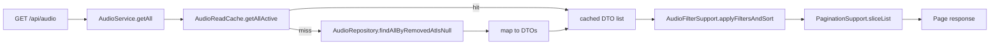

# Caching

> **Audience:** Backend developers and operators ·
> **Source:** `platform/config/CacheConfig.java`,
> `platform/service/{audio,video,image,text,project,person,category}/*ReadCache.java`,
> `platform/service/tag/TagSuggestService.java`,
> `platform/service/keyword/KeywordSuggestService.java`,
> `platform/service/tag/TagVocabularyService.java`,
> `platform/service/keyword/KeywordVocabularyService.java`,
> `platform/service/analytics/AnalyticsService.java`,
> `platform/service/guest/GuestTrendingService.java`,
> `platform/service/items/ItemsService.java`,
> `platform/service/maqam/MaqamService.java`,
> `platform/service/physicalmedia/PhysicalMediaService.java`,
> `user/service/UserService.java`, `user/service/AdminUserService.java`,
> `src/main/resources/application.yaml`, `pom.xml`

The application caches **in process, with Caffeine, on the JVM heap**. There is no Redis, no
Memcached, and no external cache server anywhere in the codebase or the deployment. Every cache
entry lives inside the running JVM and dies with it.

Several javadoc comments still say "Redis" — `AudioService.getAll` ("served from Redis on hit"),
`ProjectService.getAll` ("served from Redis on cache hit"), `AnalyticsService.getUserActivity`
("served from Redis on cache hit"), `ProjectRepository.findAllActive` ("populate Redis once per
10 minutes") and `TagSuggestService` ("Cache TTL is governed by the Redis cache manager's
defaults"). Those sentences are historical. The only `CacheManager` bean in the application is the
`SimpleCacheManager` of `CaffeineCache` instances built in `platform/config/CacheConfig.java`, and
the class javadoc there states it plainly: *"In-process Caffeine cache replacing Redis."*

---

## What the cache actually is

| Property | Value | Where it comes from |
|---|---|---|
| Library | `com.github.ben-manes.caffeine:caffeine`, version managed by `spring-boot-starter-parent` 4.0.5 | `pom.xml` |
| Spring integration | `spring-boot-starter-cache`, `@EnableCaching` on `CacheConfig` | `pom.xml`, `CacheConfig.java` |
| Cache manager | `SimpleCacheManager` holding a fixed `List.of(...)` of `CaffeineCache` beans | `CacheConfig.cacheManager()` |
| Eviction policy | W-TinyLFU (Caffeine default) | `CacheConfig` class javadoc |
| Expiry | `expireAfterWrite(<n>, TimeUnit.MINUTES)` per cache | `CacheConfig.build(...)` |
| Storage | JVM heap of the single process | in-process by construction |
| Survives restart | **No** | in-process by construction |
| Shared between instances | **No** | in-process by construction |
| Config keys | `spring.cache.type: caffeine` — the only `spring.cache.*` key present | `application.yaml` |

Every size and TTL is hard-coded in Java. There is no `spring.cache.cache-names`, no
`spring.cache.caffeine.spec` and no per-cache property in `application.yaml`; the single helper
below is the whole tuning surface:

```java
private static CaffeineCache build(String name, long maxSize, long ttlMinutes) {
    return new CaffeineCache(name,
            Caffeine.newBuilder()
                    .maximumSize(maxSize)
                    .expireAfterWrite(ttlMinutes, TimeUnit.MINUTES)
                    .build());
}
```

Because `CacheConfig` declares a `CacheManager` bean explicitly, Spring Boot's cache
auto-configuration backs off entirely — changing `spring.cache.type` to something else would not
change which manager is used. Note also `expireAfterWrite`, not `expireAfterAccess`: a constantly
read entry still expires at its TTL, and there is no refresh-ahead, so the unlucky request that
arrives just after expiry pays the full reload cost.

### What "in-process" means operationally

- **Restart wipes everything.** The first request to each list endpoint after a deploy runs the
  full `SELECT` and rebuilds the DTO list. Nothing warms the caches at startup — there is no
  cache-warming `ApplicationRunner` in `platform/config/`.
- **Heap, not disk.** `audios:all`, `videos:all`, `images:all`, `texts:all`, `projects:all`,
  `persons:all` and `categories:all` each hold **one entry that is the entire active list of that
  entity as DTOs**. Heap usage grows linearly with the archive; it is not bounded by
  `maximumSize=1`, which bounds the *number of entries*, not their size.
- **Nothing is shared between replicas — and this is the important one.** Run two instances behind
  a load balancer and `readCache.evictAll()` on instance A does nothing to instance B's copy.
  An editor whose `PATCH` lands on A and whose next `GET` lands on B sees the pre-edit list, for up
  to the cache's TTL:

  | Cache group | Worst-case staleness on another instance |
  |---|---|
  | `*:all` entity lists | 10 minutes |
  | `tags:suggest`, `keywords:suggest` | 10 minutes |
  | `analytics:*.v2` | 5 minutes |
  | `trending:results`, `trending:snapshot` | 5 minutes |
  | `users:details` | 1 minute |

  `users:details` is the sharpest edge: a role change or permission revoke made on instance A is
  enforced immediately on A (every admin mutation evicts the whole region) but can lag up to
  60 seconds on B. There is no cross-instance invalidation channel in the source.
  A single-instance deployment has none of these problems, and that is what the current
  configuration assumes.

---

## Cache inventory

All fifteen caches, exactly as registered in `CacheConfig.cacheManager()`. `maximumSize` and TTL
are the two `build(...)` arguments.

| Cache name | Holds | `maximumSize` | TTL | Populated by | Evicted by |
|---|---|---|---|---|---|
| `categories:all` | `List<CategoryResponseDTO>` — every category with `removed_at IS NULL` | 1 | 10 min | `CategoryReadCache.getAllActive()` → `CategoryRepository.findAllActiveWithKeywords()` | `CategoryReadCache.evictAll()` — from `CategoryService` `create` / `createAll` / `update` / `delete` / `restore` / `purge`, and `KeywordVocabularyService` `rename` / `delete` |
| `audios:all` | `List<AudioResponseDTO>` — active audios | 1 | 10 min | `AudioReadCache.getAllActive()` → `AudioRepository.findAllByRemovedAtIsNull()` | `AudioReadCache.evictAll()` — from `AudioService` `create` / `createAll` / `update` / `setVisibility` / `delete` / `restore` / `purge`; `ProjectService` `update` / `delete` / `restore` / `purge` when the cascade touched audios; `TagVocabularyService` and `KeywordVocabularyService` `rename` / `delete` |
| `images:all` | `List<ImageResponseDTO>` — active images | 1 | 10 min | `ImageReadCache.getAllActive()` → `ImageRepository.findAllByRemovedAtIsNull()` | `ImageReadCache.evictAll()` — same seven `ImageService` methods, same `ProjectService` cascades, both vocabulary services |
| `videos:all` | `List<VideoResponseDTO>` — active videos | 1 | 10 min | `VideoReadCache.getAllActive()` → `VideoRepository.findAllByRemovedAtIsNull()` | `VideoReadCache.evictAll()` — same seven `VideoService` methods, same `ProjectService` cascades, both vocabulary services |
| `texts:all` | `List<TextResponseDTO>` — active texts | 1 | 10 min | `TextReadCache.getAllActive()` → `TextRepository.findAllByRemovedAtIsNull()` | `TextReadCache.evictAll()` — same seven `TextService` methods, same `ProjectService` cascades, both vocabulary services |
| `projects:all` | `List<ProjectResponseDTO>` — active projects | 1 | 10 min | `ProjectReadCache.getAllActive()` → `ProjectRepository.findAllActive()` | `ProjectReadCache.evictAll()` — from `ProjectService` `create` / `createAll` / `update` / `delete` / `restore` / `purge`, and both vocabulary services |
| `persons:all` | `List<PersonResponseDTO>` — active persons | 1 | 10 min | `PersonReadCache.getAllActive()` → `PersonRepository.findAllActiveWithPersonType()` | `PersonReadCache.evictAll()` — from `PersonService` `createPerson` / `updatePerson` / `deletePerson` / `restorePerson` / `purgePerson` **only** |
| `tags:suggest` | `List<TagSuggestionDTO>` per `(canonical query, limit)` | 1 000 | 10 min | `TagSuggestService.lookup(...)` → `TagSuggestRepository.suggest(...)` | `allEntries = true` from `AudioReadCache`, `VideoReadCache`, `ImageReadCache`, `TextReadCache`, `ProjectReadCache` `evictAll()` |
| `keywords:suggest` | `List<KeywordSuggestionDTO>` per `(canonical query, limit)` | 1 000 | 10 min | `KeywordSuggestService.lookup(...)` → `KeywordSuggestRepository.suggest(...)` | `allEntries = true` from the five caches above **plus** `CategoryReadCache.evictAll()` |
| `analytics:user.v2` | `UserActivityDTO` per `username + filter + page + size + sort` | 200 | 5 min | `AnalyticsService.getUserActivity(...)` | TTL only — `AnalyticsService.evictAll()` is an empty method: *"No-op: TTL-driven. Hook is here so callers don't depend on cache impl."* |
| `analytics:overview.v2` | `TeamOverviewDTO` per `filter + topN` | 50 | 5 min | `AnalyticsService.getOverview(...)` | TTL only |
| `analytics:users.v2` | `List<UserSummaryDTO>` per `filter` | 50 | 5 min | `AnalyticsService.getUsers(...)` | TTL only |
| `users:details` | `UserDetails` per username, used by the JWT filter on every authenticated request | 500 | 1 min | `UserService.loadUserByUsername(String)` | `allEntries = true` from `UserService` `updateProfileImage` / `removeProfileImage` / `updateUser` / `deleteUser`, and `AdminUserService` `changeRole` / `grantPermissions` / `revokePermissions` / `setActivated` / `lock` / `unlock` / `resetFailedAttempts` / `createUserAsAdmin` / `updateUserAsAdmin` / `deleteUser` |
| `trending:results` | `GuestTrendingDTO` — ranked trending items + top searches | 1 | 5 min | `GuestTrendingService.getTrending()` | `allEntries = true` from `GuestTrendingService.purgeOldLogs()`, the `@Scheduled(cron = "0 0 3 * * *")` nightly cleanup |
| `trending:snapshot` | `Map<String, TrendingMark>` keyed `"type:code"`, stamped onto guest listing rows | 1 | 5 min | `GuestTrendingService.getSnapshot()` | same nightly `purgeOldLogs()` |

The comment blocks in `CacheConfig` explain the sizing choices:

> - `"all-items"` caches (categories, audios, …) hold ONE entry (the full active list) so
>   `maximumSize=1` is correct — eviction never fires in practice; TTL keeps data fresh after
>   mutations.
> - Autocomplete (tags, keywords) hold one entry per (query, limit) pair; capped at 1 000 entries,
>   10-minute TTL.
> - Analytics caches hold per-(user/filter) results; shorter TTL so the dashboard stays accurate
>   without a manual refresh.
> - UserDetails: cached 1 min so permission grants take effect quickly.

---

## The ReadCache-per-entity pattern

Seven entities have a dedicated `*ReadCache` `@Component` that owns exactly one cache region and
exposes exactly two public methods (`ProjectReadCache` additionally carries a package-private
`static toResponse(Project)` mapper).

```java
@Component
public class AudioReadCache {

    static final String ACTIVE_CACHE = "audios:all";

    @Cacheable(ACTIVE_CACHE)
    @Transactional(readOnly = true)
    public List<AudioResponseDTO> getAllActive() { ... }

    @Caching(evict = { ... })
    public void evictAll() { }
}
```

Key properties, all uniform across the seven:

- **The cache holds DTOs, not entities.** `CategoryReadCache`: *"Cached as DTOs (not entities) so
  Hibernate session state is irrelevant on cache hit."* A cache hit therefore needs no open
  `EntityManager`, which matters because `spring.jpa.open-in-view` is `false`.
- **One entry per region.** `getAllActive()` takes no arguments, so Spring's default key generator
  produces `SimpleKey.EMPTY` — a single key, which is why `maximumSize=1` is correct.
- **The miss path is N+1 today.** The design intent was one main query plus a handful of batched
  secondary queries: `ProjectRepository.findAllActive()` uses nothing but the main query, and
  `ProjectReadCache` claims *"for 1000 projects there are at most ~5 small secondary
  queries — no N+1."* That claim depends on `default_batch_fetch_size: 1000`, which is **inert** —
  it is written at `spring.jpa.hibernate.properties.hibernate.default_batch_fetch_size`, a property
  path Spring Boot does not bind, so Hibernate never receives it (verified; see
  [Configuration](./configuration.md#the-other-eight-keys-are-inert--verified)). Until the YAML
  nesting is corrected, every cache miss on a large active list issues one secondary `SELECT` per
  parent row per lazy association. Caching hides this from the second call onward, which is why it
  has gone unnoticed; the cold call pays the full cost.

  ```sql
  SELECT p FROM Project p WHERE p.removedAt IS NULL ORDER BY p.id ASC
  ```

  `CategoryRepository` and `PersonRepository` add an explicit `LEFT JOIN FETCH` on top:

  ```sql
  SELECT DISTINCT c FROM Category c
  LEFT JOIN FETCH c.keywords
  WHERE c.removedAt IS NULL
  ORDER BY c.name ASC
  ```

  ```sql
  SELECT DISTINCT p FROM Person p
  LEFT JOIN FETCH p.personType
  WHERE p.removedAt IS NULL
  ORDER BY p.fullName ASC
  ```

  (All three quoted from their `@Query` annotations; they are JPQL, not native SQL — `removedAt`
  and `fullName` are entity fields, mapping to the `removed_at` and `full_name` columns.)
- **Only active rows are cached.** Every loader filters on `removed_at IS NULL`
  (`findAllByRemovedAtIsNull`, `findAllActive`, `findAllActiveWithKeywords`,
  `findAllActiveWithPersonType`). Trash never enters a cache.
- **`AudioReadCache`, `VideoReadCache`, `ImageReadCache` and `TextReadCache` inject their service
  through an `ObjectProvider`** — *"to break the cache↔service↔cache cycle at construction time"* —
  because the DTO mapper lives on the service (`audioService::toResponse`).
  `Category` and `Person` map through static mappers (`CategoryMapper::toResponse`,
  `PersonMapper::toResponse`) and `Project` maps through a static method on the read-cache itself
  (`ProjectReadCache::toResponse`), so none of the three needs that indirection.

### How a list request is served



**The filters do not fall through to the database.** This is the single most misunderstood part of
the design, so state it precisely: for the seven cached entities, *every* list request — filtered or
not — is served from the cached DTO list. The "empty-filter fast path" is a short-circuit inside the
in-memory filter engine, not a different data source:

```java
static List<AudioResponseDTO> applyFiltersAndSort(
        List<AudioResponseDTO> source,
        AudioFilterParams params) {

    if (source == null || source.isEmpty()) {
        return List.of();
    }
    if (params == null || params.isEmpty()) {
        return source;
    }
    ...
```

With no parameters the cached list is returned by reference and paged directly — zero copying, zero
allocation. With parameters present the same cached list is scanned once in memory
(`AudioFilterSupport`: *"single linear pass with cheap-first short-circuiting … For N≈thousands this
is microseconds per query and far cheaper than round-tripping the DB"*), then paged. The DB is not
consulted on either branch.

| Entity | List endpoint | Filter params object | Filter/sort applied over |
|---|---|---|---|
| Audio | `GET /api/audio` | `AudioFilterParams` | cached `audios:all` list, in memory |
| Video | `GET /api/video` | `VideoFilterParams` | cached `videos:all` list, in memory |
| Image | `GET /api/image` | `ImageFilterParams` | cached `images:all` list, in memory |
| Text | `GET /api/text` | `TextFilterParams` | cached `texts:all` list, in memory |
| Person | `GET /api/person` | `PersonFilterParams` | cached `persons:all` list, in memory |
| Category | `GET /api/category` | `CategoryFilterParams` | cached `categories:all` list, in memory |
| Project | `GET /api/project` | _none_ — `ProjectService.getAll` takes no filter-params argument, only `Pageable` plus `Authentication` / `HttpServletRequest` | cached `projects:all` list, paged as-is |
| Items | `GET /api/items` | `ItemFilterParams` | the four media caches merged, in memory |

`ItemsService` is the clearest illustration of what the cache buys: it iterates
`audioReadCache.getAllActive()`, `videoReadCache.getAllActive()`, `imageReadCache.getAllActive()`
and `textReadCache.getAllActive()`, applies per-type keep-predicates, merges, sorts once and slices
— a four-entity cross-media page with **no** database round-trip at all on a warm cache.

### The two entities that *do* fall through to the database

`ListOfMaqam` and `PhysicalMedia` have **no** read-cache. Their list endpoints implement the
DB-paged/in-memory split that the cached entities do not need, and the source states why:

- `MaqamService.listActive` — *"No read-cache is used here — the per-request stream URL and the
  high write-rate of votes/listen tracking make a shared DTO cache a poor fit, so the full-set load
  runs only on the filtered path."* Unfiltered (and DB-sortable) requests use the fast paged query;
  `params.hasActiveFilters()`, a derived-key sort, or a sorting teacher forces the full visible set
  to be loaded and filtered in memory.
- `PhysicalMediaService.listActive` / `listTrash` — *"This entity is DB-paged (no read-cache), so
  the full-set load happens only here; the inventory is a few thousand rows, microseconds to scan."*
  Sort-only requests still push the ordering into the database via `effectivePageable(...)`.

---

## Eviction wiring

### `@Caching` on each `ReadCache.evictAll()`

Five of the seven read-caches evict three regions at once — their own, plus both cross-entity
autocomplete regions:

```java
@Caching(evict = {
        @CacheEvict(value = ACTIVE_CACHE, allEntries = true),
        // Audio tag/keyword changes invalidate the cross-entity suggest caches.
        @CacheEvict(value = TagSuggestService.CACHE, allEntries = true),
        @CacheEvict(value = KeywordSuggestService.CACHE, allEntries = true)
})
public void evictAll() {
    // Evicts every entry; called after any audio mutation.
}
```

| `evictAll()` on | Evicts `<entity>:all` | Evicts `tags:suggest` | Evicts `keywords:suggest` |
|---|---|---|---|
| `AudioReadCache` | yes | yes | yes |
| `VideoReadCache` | yes | yes | yes |
| `ImageReadCache` | yes | yes | yes |
| `TextReadCache` | yes | yes | yes |
| `ProjectReadCache` | yes | yes | yes |
| `CategoryReadCache` | yes | **no** | yes |
| `PersonReadCache` | yes | **no** | **no** |

The asymmetries are deliberate and match the data:

- **Category has keywords but no tags.** `Category` declares
  `@CollectionTable(name = "category_keywords", joinColumns = @JoinColumn(name = "category_id"))`
  and no tag field at all, so there is no `category_tags` table and `CategoryReadCache` only needs
  the keyword region. `KeywordVocabularyService` says the same thing from the other side: *"one
  extra table (Category has keywords but no tags) … and the sixth read-cache (`CategoryReadCache`)
  in the eviction set."*
- **Person is outside the collection-table system entirely.** `Person` holds
  `@Column(name = "tag", columnDefinition = "TEXT") private String tag;` — one delimited string, not
  a collection table. `TagVocabularyService`: *"Person's `tag` column is a separate delimited string
  outside this collection-table system and is intentionally not touched here."* Neither suggest
  repository reads any person table, so `PersonReadCache` uses a bare `@CacheEvict` with no
  `@Caching` wrapper.

The five tag tables are `audio_tags`, `video_tags`, `image_tags`, `text_tags`, `project_tags`; the
six keyword tables add `category_keywords` to `audio_keywords`, `video_keywords`, `image_keywords`,
`text_keywords`, `project_keywords`. Both suggest queries join each collection table back to its
parent and skip trashed rows, e.g.:

```sql
SELECT LOWER(t.tag) AS value
  FROM audio_tags t
  JOIN audios a ON a.id = t.audio_id
 WHERE a.removed_at IS NULL
   AND t.tag IS NOT NULL AND t.tag <> ''
```

That join is exactly why a trash or restore has to evict the suggest regions and not only the
entity list: trashing one audio can remove a tag from the autocomplete universe.

### The suggest services never evict themselves

`TagSuggestService.evictAll()` and `KeywordSuggestService.evictAll()` exist and carry
`@CacheEvict(value = CACHE, allEntries = true)`, but **no class in the codebase calls either one**.
The only inbound references to `TagSuggestService` / `KeywordSuggestService` outside their own files
are `TagAPI` / `KeywordAPI` (which call `suggest(...)`) and the `@CacheEvict(value = …CACHE)`
annotations on the read-caches. All autocomplete invalidation therefore flows through
`SomeReadCache.evictAll()`. If you add a new tag- or keyword-bearing entity, wiring its
`ReadCache.evictAll()` the same way is what keeps autocomplete honest — calling
`tagSuggestService.evictAll()` directly would work too, but would break the established pattern.

### Vocabulary admin: one call, a fan-out of evictions

`TagVocabularyService.rename/delete` and `KeywordVocabularyService.rename/delete` change tag or
keyword values across every collection table with set-based SQL, then fan out over the read-caches.
`KeywordVocabularyService` covers all six keyword-bearing entities:

```java
/** Each evictAll() also clears the shared {@code keywords:suggest} region. */
private void evictAll() {
    audioReadCache.evictAll();
    videoReadCache.evictAll();
    imageReadCache.evictAll();
    textReadCache.evictAll();
    projectReadCache.evictAll();
    categoryReadCache.evictAll();
}
```

`TagVocabularyService.evictAll()` is the same method minus the `categoryReadCache.evictAll()` line,
because tags do not live on Category. Either way, one admin rename clears every entity region it
touched plus `tags:suggest` and `keywords:suggest` (repeatedly and harmlessly, since each read-cache
re-evicts the shared suggest regions) — the whole read side is rebuilt on the next request.

That fan-out is hand-written because nothing else would fire. The rename and delete statements run
through `EntityManager.createNativeQuery(...)` in `VocabularyBulkRepository`, so Hibernate never sees
the change: no entity is loaded, no persistence-context entry is touched, no `@Version` is bumped,
and no cache annotation triggers on its own. The repository javadoc states the resulting obligation
directly: *"Because these bypass Hibernate (no L1/L2, no `@Version` bump), the calling service must
evict the affected read-caches afterwards."*

The `evictAll()` calls above are therefore load-bearing rather than defensive. Drop one and that
entity's list endpoint keeps serving the pre-rename value for up to the full 10-minute TTL, with
nothing in the logs to indicate it — the rename itself succeeded and returned a correct
`renamed` / `merged` count. Any future write path that reaches the database as native SQL instead of
through the entity mapper inherits the same obligation.

### Self-invocation: why the suggest services inject themselves

Spring's cache interception is proxy-based, so an internal `this.lookup(...)` call would never touch
the cache. Both suggest services route through an `ObjectProvider` of themselves:

```java
// Go through the Spring proxy so @Cacheable triggers.
return selfProvider.getObject().lookup(canonical, effective);
```

The public `suggest(q, limit)` method is deliberately **not** cached: it canonicalizes the query
first (`Tags.canonicalOne` / `Keywords.canonicalOne`) and clamps `limit` to `MAX_LIMIT = 25`, so
`"Sula"`, `"  SULA  "` and `"sula"` all collapse onto one cache key before `lookup` is reached.

### Eviction happens before commit

The mutating services (`AudioService`, `VideoService`, `ImageService`, `TextService`,
`ProjectService`, `PersonService`, `CategoryService`) are annotated `@Transactional` at class level,
and they call `readCache.evictAll()` inside the transactional method. `@CacheEvict` defaults to
`beforeInvocation = false`, which means the eviction fires when `evictAll()` returns — still inside
the open transaction, before commit. Nothing in the source registers a transaction synchronization
to re-evict after commit. Consequence: a concurrent request that repopulates the cache in the narrow
window between the eviction and the commit will cache the pre-commit view and keep serving it until
the TTL expires. It is a small window and a read-committed database, but it is the one race worth
knowing about when a stale list survives an edit on a single instance.

---

## Adding a new `@Cacheable`

**The rule: the cache name must exist in `CacheConfig.cacheManager()` before any annotation
references it.** `SimpleCacheManager` serves a fixed list; unlike a dynamically-creating manager it
returns `null` for an unknown name and creates nothing on the fly.

If you forget, the application **starts normally** — the failure is deferred to the first invocation
of the annotated method, and it is an unchecked exception thrown from Spring's
`AbstractCacheResolver`, surfacing as a `500` on whatever endpoint called it:

```text
java.lang.IllegalArgumentException: Cannot find cache named 'items:all' for <cache operation>
```

`<cache operation>` is Spring's rendering of the annotation you just wrote, and it ends with the
telltale `caches=[items:all] | key='' | keyGenerator='' | cacheManager='' | cacheResolver='' |
condition='' | ...` — so the name in the quotes and the name in `caches=[...]` are your typo.
The stack trace passes through `CacheAspectSupport` / `CacheInterceptor`, and because it is thrown
before the method body runs, the endpoint fails 100 % of the time rather than intermittently.

Checklist for a new cached read:

1. Add the region to the `List.of(...)` in `CacheConfig.cacheManager()` with a deliberate
   `maximumSize` and TTL. Follow the existing naming convention: `<plural-entity>:all` for a
   whole-list cache, `<thing>:suggest` for an autocomplete, `<area>:<view>` otherwise.
2. If the payload shape changes in a way old entries cannot satisfy, bump a version suffix rather
   than reusing the name — `analytics:user.v2`, `analytics:overview.v2` and `analytics:users.v2`
   already do this.
3. Cache **DTOs, not entities**, so a hit does not depend on a live Hibernate session
   (`open-in-view` is `false`).
4. Put the `@Cacheable` on a method reached through the proxy — a different bean, or a
   self-injected `ObjectProvider` as the suggest services do.
5. Wire the eviction at every mutation point, and add the new region to any `@Caching(evict = …)`
   set it belongs in.
6. If the value is expensive but the input space is unbounded (pagination, free-text), consider a
   `condition` guard instead of a large `maximumSize` — `AnalyticsService` caches only the default
   filter via `condition = "#filter.isCacheable()"`.

---

## Endpoints that deliberately bypass the cache

| Endpoint(s) | Why it bypasses |
|---|---|
| `GET /api/audio/trash`, `/api/video/trash`, `/api/image/trash`, `/api/text/trash`, `/api/project/trash`, `/api/person/trash`, `/api/category/trash` | The read-caches hold only `removed_at IS NULL` rows. Trash listings call `findAllByRemovedAtIsNotNull()` directly. Admin-only and low-traffic, so the DB hit is irrelevant. |
| `GET /api/audio/{audioCode}`, `/api/video/{videoCode}`, `/api/image/{imageCode}`, `/api/text/{textCode}`, `/api/project/{projectCode}`, `/api/person/{personCode}`, `/api/category/{categoryCode}` | Single-record reads go straight to `findBy…AndRemovedAtIsNull(...)`. Scanning a cached list to answer a point lookup would be slower and would risk serving a record that a concurrent edit already changed. |
| `GET /api/audio/search`, `/api/video/search`, `/api/image/search`, `/api/text/search` | Multi-token search builds a native query with `MediaSearchSqlBuilder` and runs it through `EntityManager.createNativeQuery(...)`, prefiltering to `SEARCH_PREFILTER_LIMIT = 2000` candidates before ranking. Ranking is done by the database; there is nothing to reuse across queries. |
| `GET /api/person/search`, `GET /api/category/search` | Typo-tolerant search delegated to the repository's own native `pg_trgm` query (`PersonRepository` / `CategoryRepository` javadoc: substring `LIKE`/`ILIKE` matches unioned with trigram-similarity matches, then ranked). |
| `GET /api/maqam` (and `GET /api/admin/maqam/trash`) | No read-cache by design: the per-request `streamUrl` embedded in each DTO is not shareable, and votes plus per-second listen tracking make the write rate too high for a shared DTO cache. |
| `GET /api/physical-media` (and `GET /api/admin/physical-media/trash`) | DB-paged inventory; no read-cache. Unfiltered and DB-sortable requests load exactly one page. |
| `GET /api/guest/**` except `/api/guest/trending` | `GuestSearchService` reads the repositories directly. Only the trending overlay is cached, via `GuestTrendingService.getSnapshot()` (`trending:snapshot`), which stamps rank/score onto rows the query already produced. |
| `GET /api/analytics/feed` | Explicitly uncached: *"no cache, since pagination combinatorial space and TTL would dilute hit-rate to nothing useful."* |
| `GET /api/analytics/actions`, `/daily`, `/weekly`, `/monthly`, `/yearly`, `/entities` | Marked *"Always live"* in `AnalyticsService`; each runs the indexed CTE against the audit-log union on every call. Correction statistics are *"always live, all-time totals"* as well. |
| `GET /api/analytics/me`, `/users/{username}`, `/users`, `/overview` **when any filter is supplied** | These three regions carry `condition = "#filter.isCacheable()"`. `AnalyticsFilter.isCacheable()` returns `true` only when `from`, `to`, `entities`, `actions`, `actor`, `actorPattern`, `entityCode` and `q` are all absent. Any of them present and the call runs live. A bare `days` value is still cacheable — it is part of `toCacheKey()` (`d=<days>`), not of the cacheability test. |
| Audit logging on every list endpoint | The cache fronts the read, never the audit row: *"Audit is always recorded (cache only fronts the read, not the audit)."* A cached `GET /api/audio` still writes its `LIST` row. |

---

## Troubleshooting stale data

Work down this list. Steps 1–3 identify the cache; 4 onward are the specific traps.

**1. Confirm it is really the cache.** `spring.jpa.show-sql: true` is set in `application.yaml` and
does take effect, so a cache **miss** prints the entity `SELECT` in the console and a **hit** does
not. (`format_sql: true` sits beside it in the file but is inert — expect unformatted single-line
statements.) Call the endpoint twice and compare. Do not look for "any SQL": every list call also
writes its audit row through the `REQUIRES_NEW` audit service, so an `INSERT INTO ..._audit_logs`
appears on hits too — the signal is the `SELECT` against `audios` / `videos` / `images` / `texts` /
`projects` / `person` / `categories` and its follow-ups. If that `SELECT` runs on every call, the
cache is not involved and the problem is elsewhere.

**2. Wait out the TTL.** Every region expires on its own: 10 minutes for the `*:all` and
`*:suggest` regions, 5 for analytics and trending, 1 for `users:details`. If the data corrects
itself on schedule, you have an eviction gap, not a data bug.

**3. Restart the instance.** In-process caches do not survive a restart. If a restart fixes it
permanently, the cached value was stale; if it comes back, the database really holds that value.

**4. Multi-instance: is the request landing on the instance that did the write?** Pin your client
to one instance (direct port, or a sticky session at the load balancer) and repeat. If the pinned
instance is correct and the others are not, that is the cross-instance gap described above — nothing
in the source propagates evictions between JVMs.

**5. Edited a record and the list endpoint still shows the old row.** Verify the mutation path calls
`readCache.evictAll()`. The seven methods that do it for media are `create`, `createAll`, `update`,
`setVisibility`, `delete`, `restore`, `purge`; Person uses `createPerson` / `updatePerson` /
`deletePerson` / `restorePerson` / `purgePerson`. A new write path added without that call is the
most common cause of this symptom. Also check the pre-commit race in
[Eviction happens before commit](#eviction-happens-before-commit).

**6. A project-level change did not appear on its media.** `ProjectService` evicts the child caches
conditionally, and the same shape repeats for videos, images and texts: `update` uses
`if (cascadedAudios > 0) audioReadCache.evictAll();`, `delete` uses `if (trashedAudios > 0) …`,
`restore` uses `if (restoredAudios > 0) …` and `purge` uses `if (!audios.isEmpty()) …`. If the
cascade touched no rows, the child cache is intentionally left alone.

**7. Autocomplete is missing a brand-new tag or keyword.** `tags:suggest` / `keywords:suggest` are
cleared only as a side effect of an entity `ReadCache.evictAll()` (and by the 10-minute TTL). Check
that the entity you edited is one of the five tag-bearing or six keyword-bearing ones — Person's
`tag` is a delimited string and is not part of the suggest universe at all, so editing a person will
never change the autocomplete. Remember the suggest query skips trashed parents
(`WHERE a.removed_at IS NULL`), so a tag can vanish from autocomplete because its only carrier was
trashed.

**8. Autocomplete returns the wrong list for a query.** The key is
`T(java.util.Objects).hash(#canonical, #limit)` — an `int`. Two different `(canonical, limit)` pairs
that hash identically would share an entry. Vanishingly unlikely, but if a single query string is
reproducibly wrong while its neighbors are fine, this is the shape of that bug; changing the SpEL to
a string key would eliminate it.

**9. Analytics numbers look frozen.** They are, for up to 5 minutes.
`AnalyticsService.evictAll()` is an empty method — there is **no** way to force-refresh the three
analytics regions short of a restart. Two workarounds that are correct by design: add any filter
parameter (this fails the `isCacheable()` condition and runs live), or use one of the always-live
endpoints (`/feed`, `/daily`, `/weekly`, `/monthly`, `/yearly`, `/actions`, `/entities`).

**10. A permission or role change is not taking effect.** All ten `AdminUserService` mutations and
four `UserService` mutations evict `users:details` with `allEntries = true`, so on the instance that
served the admin call the change is live immediately. Elsewhere — or if the change was made directly
in the database — expect up to 60 seconds. Note the JWT filter comment claims it *"reload[s] the
user fresh from DB on EVERY request"*; that is true only of a cache miss, since
`loadUserByUsername` is `@Cacheable`.

**11. A user locked out by failed logins is still being accepted.** The lockout path
(`UserService.recordFailedLoginAttempt` → `setIsLocked(true)` → `userRepository.save(user)`) does
**not** carry a `@CacheEvict`. The `LockedException` is raised inside `loadUserByUsername`, so it is only evaluated
on a cache miss; an already-cached `UserDetails` keeps authenticating that user for the remainder of
the 1-minute TTL. To cut it short, use the admin lock endpoint (`AdminUserService.lock`), which does
evict.

**12. Trending has not moved.** `trending:results` and `trending:snapshot` refresh on their
5-minute TTL, and the only explicit eviction is the nightly `@Scheduled(cron = "0 0 3 * * *")`
`purgeOldLogs()`. View and search logging is `@Async("trendingLogExecutor")` and swallows failures
(*"Trending log write failed (non-critical)"*), so an empty trending list can also mean the writes
are failing silently — check the DEBUG log of `GuestTrendingService`.

**13. You want to see hit/miss directly.** `application.yaml` sets
`logging.level.org.springframework.cache: DEBUG`. Spring logs its per-call cache decisions at
`TRACE`, so lower it further if you need them. Note also that `spring-boot-starter-actuator` is on
the classpath but `application.yaml` contains **no** `management.*` keys, so the `caches` actuator
endpoint is not web-exposed by default and there is no cache hit-rate metric to read.
`Caffeine.recordStats()` is not enabled in `CacheConfig`, so per-cache statistics are not being
collected at all.

---

## Notes

- **Table names.** Every table named on this page is copied from an explicit annotation or from a
  literal SQL string: `audios`, `videos`, `images`, `texts`, `projects`, `categories`, `person`,
  `list_of_maqam` and `physical_media` from `@Table(name = ...)` on their entities;
  `audio_tags`, `audio_keywords` and `category_keywords` from
  `@CollectionTable(name = ...)` on `Audio` and `Category`; the remaining `*_tags` / `*_keywords`
  names verbatim from the `CollectionTableRef` lists in `TagVocabularyService` /
  `KeywordVocabularyService` and from the native queries in `TagSuggestRepository` /
  `KeywordSuggestRepository`. **No name on this page was inferred** from Hibernate's implicit
  CamelCase-to-snake_case naming strategy, so no inference rule had to be applied.
- **Column names and types.** Only `removed_at`, `id`, `tag`, `keyword`, `full_name`, `name` and the
  join columns `audio_id`, `video_id`, `image_id`, `text_id`, `project_id`, `category_id` appear
  here. Each is
  either the `@Column(name = ...)` / `@JoinColumn(name = ...)` value on the entity or a literal
  identifier in the quoted SQL. Their types follow from the Java declarations:
  `removed_at` is `@Column(name = "removed_at") private Instant removedAt` → `timestamp`;
  `id` is `@Id @GeneratedValue(strategy = GenerationType.IDENTITY) private Long id` → `bigint`
  identity; `tag`, `keyword`, `full_name` (`Person.fullName`) and `name` (`Category.name`) all carry
  `columnDefinition = "TEXT"` → `text`; the join columns
  are `bigint` foreign keys to their parent's `id`.
- **No SQL from the startup initializers is quoted here** because none of the initializer classes in
  `platform/config/` or `user/configs/` touch caching. The SQL blocks above are the JPQL of three
  `@Query` annotations (`ProjectRepository.findAllActive`,
  `CategoryRepository.findAllActiveWithKeywords`, `PersonRepository.findAllActiveWithPersonType`)
  and one leg of the native `TagSuggestRepository.suggest` query, all quoted verbatim. `CacheConfig`
  is the only cache-related class in `platform/config/` and executes no SQL.
- **`default_batch_fetch_size` is inert — verified.** In `application.yaml` the `properties:` block
  is nested **inside** `spring.jpa.hibernate`, so the literal key is
  `spring.jpa.hibernate.properties.hibernate.default_batch_fetch_size` — one level deeper than
  `spring.jpa.properties.hibernate.*`, the path Spring Boot binds Hibernate properties from.
  `spring.jpa.hibernate.properties` does not exist in Boot 4's configuration metadata, so the value
  is silently dropped and Hibernate runs with no batch fetching. The same applies to `format_sql`,
  `use_sql_comments` and `dialect`, and to the whole `spring.jpa.jdbc.*` block (`time_zone`,
  `batch_size`, `order_inserts`, `order_updates`). **This is a live application defect**, not a
  documentation caveat: cache misses on large entity lists produce per-row secondary selects. Full
  write-up and the corrected YAML in
  [Configuration](./configuration.md#the-other-eight-keys-are-inert--verified).
- **Cache hit-rate metrics, cache warm-up at startup, cross-instance invalidation, a manual
  cache-flush endpoint, and per-cache `Caffeine` tuning beyond `maximumSize` + `expireAfterWrite`**
  are _Not documented in source._ — none of them exists.
- **`AnalyticsService.evictAll()` is intentionally empty.** It is a seam, not a bug: *"No-op:
  TTL-driven. Hook is here so callers don't depend on cache impl."*

---

## Related

- [Operations index](./README.md)
- [Internal docs index](../README.md)
- [Conventions — page envelope, timestamps, error shape](../01-conventions.md)
- [Configuration and Environment](./configuration.md) — `spring.cache.type`, logging levels, and the eight inert Hibernate keys (`default_batch_fetch_size` among them)
- [Migrations and startup initializers](../database/migrations.md) — the `ApplicationReadyEvent` SQL that runs before any cache is populated
- [Storage and media](./storage-and-media.md) — the S3 proxy paths, which are never cached
- [Seeding](./seeding.md) — the bulk load that runs before the first cache population
- [Database schema and ERD](../database/README.md) — the tables the read-caches project into DTOs
- [Items endpoint](../content/items.md) — the merged four-cache list
- [Tags and keywords](../content/tags-and-keywords.md) — the autocomplete and vocabulary-admin endpoints whose caches are described above
