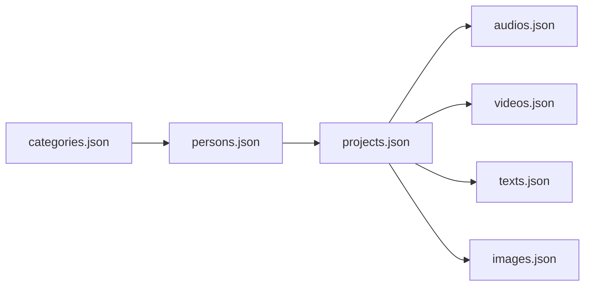

# Seed Data and Test Fixtures

> **Audience:** Backend developers and operators ·
> **Source:** `src/main/java/ak/dev/khi_archive_platform/platform/seed/SeedDataLoader.java`,
> `src/main/resources/application.yaml`, `seed-data/`, `scripts/`,
> `test-*-1000.json` at the repository root

The repository ships two independent ways to fill an empty database with realistic content, plus a
set of large bulk-endpoint fixtures used for load and pagination testing:

1. **`SeedDataLoader`** — an in-process `CommandLineRunner` that reads `seed-data/*.json` and writes
   straight through the JPA repositories at application startup. Gated by `app.seed.load`.
2. **`seed-data/seed_via_rest.py`** — a standalone Python script that POSTs the same JSON through
   the real `/bulk` REST endpoints, so audit logs, cache eviction and server-side code generation
   all run.
3. **`test-*-1000.json`** — six ~1000-row fixtures at the repository root, hand-fed to the `/bulk`
   endpoints when you need a thousand rows per entity rather than five hundred.

None of these is a schema migration. Schema still comes from Hibernate `ddl-auto=update` plus the
startup initializers described in [Migrations and startup initializers](../database/migrations.md).

---

## Configuration

Two keys, both defined in `src/main/resources/application.yaml`:

```yaml
app:
  cors:
    ...
  seed:
    load: ${APP_SEED_LOAD:true}
    dir: ${APP_SEED_DIR:./seed-data}
```

| Key | Environment variable | Default | Read by | Effect |
|---|---|---|---|---|
| `app.seed.load` | `APP_SEED_LOAD` | `true` | `@ConditionalOnProperty(name = "app.seed.load", havingValue = "true")` on `SeedDataLoader` | When it resolves to `true` the bean is created and runs once at startup. Any other value (or an absent property) means the bean is never created |
| `app.seed.dir` | `APP_SEED_DIR` | `./seed-data` | `@Value("${app.seed.dir:./seed-data}")` on `SeedDataLoader.seedDir` | Directory the loader reads the seven JSON files from. Resolved as a plain `new File(seedDir)`, so a relative path is relative to the process working directory |

The `havingValue` comparison is case-insensitive, so `TRUE` and `True` also activate the loader.
`app.seed.dir` has a default baked into the `@Value` as well as into the YAML — they agree.

> **The committed default is `true`.** The class javadoc says the opposite — "Activated by
> `app.seed.load=true`. Off by default so it never runs in production." That intent is not what
> `application.yaml` encodes. An environment that does not set `APP_SEED_LOAD` explicitly **will**
> seed on every boot. See [Turning seeding off](#turning-seeding-off).

---

## When seeding runs

`SeedDataLoader implements CommandLineRunner`. Spring Boot invokes every `CommandLineRunner` after
the application context has fully refreshed — so after `ddl-auto=update` has reconciled the schema —
and after the boot sequence has logged "Started …", but **before** `ApplicationReadyEvent` is
published. It is the **only** `CommandLineRunner`/`ApplicationRunner` in the codebase; every other
startup job in the project is an `@EventListener(ApplicationReadyEvent.class)` bean. There is no
`@PostConstruct` initializer anywhere in `src/main/java`.

That ordering is a property of the lifecycle, not of bean ordering: the seeder always runs before
every `ApplicationReadyEvent` initializer — the index builders, the CHECK-constraint re-syncs, the
permission backfills and `PhysicalMediaTypeSeeder`. There is no `@Order` on the class, but an
`@Order` would only matter if a second runner existed. Nothing here depends on the sequence: the
loader needs none of those initializers, and none of them read seeded rows.

The class writes no raw SQL. Unlike the initializers in `platform/config/` and `user/configs/`,
which run `JdbcTemplate` statements, `SeedDataLoader` goes through `CategoryRepository`,
`PersonRepository`, `ProjectRepository`, `AudioRepository`, `VideoRepository`, `TextRepository` and
`ImageRepository`, so the only SQL involved is the `INSERT` Hibernate generates for each `save()`.
There is therefore no SQL statement in this class to quote.

### Missing directory

A missing seed directory is a warning, not a failure:

```java
File dir = new File(seedDir);
if (!dir.isDirectory()) {
    LOG.warn("Seed dir not found: {} — skipping load.", dir.getAbsolutePath());
    return;
}
```

Individual missing files are also tolerated — every loader begins `if (!f.exists()) return 0;`.

### Log output

```java
LOG.info("=== SEED LOAD START — reading from {} ===", dir.getAbsolutePath());
...
LOG.info("=== SEED LOAD DONE ===");
LOG.info("  categories inserted: {}  (total in DB: {})", cats, categoryRepo.count());
```

Each loader also logs its own line, for example:

```java
LOG.info("loadCategories: read={} inserted={}", rows.size(), inserted);
```

`read` is the row count in the file; `inserted` is the count that survived the skip rules below.
The "total in DB" figures come from `JpaRepository.count()`, which counts **every** row in the
table including soft-trashed ones (`removed_at IS NOT NULL`).

---

## What lives in `seed-data/`

Fifteen entries. Seven are the data the loader consumes; the rest are the generator, its Wikipedia
scaffolding, and the REST-payload dump.

| File | Size | Purpose |
|---|---|---|
| `categories.json` | 186 KB | 500 category records — read by `loadCategories` |
| `persons.json` | 470 KB | 500 person records — read by `loadPersons` |
| `projects.json` | 792 KB | 500 project records — read by `loadProjects` |
| `audios.json` | 1.6 MB | 500 audio records — read by `loadAudios` |
| `videos.json` | 1.4 MB | 500 video records — read by `loadVideos` |
| `texts.json` | 1.4 MB | 500 text records — read by `loadTexts` |
| `images.json` | 1.4 MB | 500 image records — read by `loadImages` |
| `generate.py` | 69 KB | Regenerates all seven files above. Deterministic (`random.seed(42)`) |
| `probe_wiki.py` | 3.4 KB | Probes the Wikipedia REST summary API for 68 Kurdish-figure slugs |
| `probe_wiki2.py` | 3.4 KB | Second probe, 79 more candidate entries with alternative spellings — 76 distinct slugs |
| `probe_results.json` | 19 KB | Raw output of `probe_wiki.py` (68 keys, 35 with a portrait) |
| `probe_results2.json` | 17 KB | Raw output of `probe_wiki2.py` (76 keys, 28 with a portrait) |
| `wiki_cache.json` | 29 KB | The curated 62-entry portrait cache `generate.py` actually reads |
| `rest-payloads/` | 4.9 MB | Six `--dry-run` payload dumps from `seed_via_rest.py` |
| `seed_via_rest.py` | 15 KB | Loads the same data through the REST `/bulk` endpoints |

Everything listed is tracked in git — `.gitignore` excludes none of it.

### The seven data files

Each file is a JSON **array** of 500 objects shaped like the corresponding public `Guest*DTO`
(`generate.py` module docstring). That means they carry read-model extras the loader ignores:
`id`, `projectCount`, `mediaCounts`, `projectName`, `personMediaPortrait`, `wikipediaUrl`, and the
nested `person` / `categories` summaries on media rows.

| File | Business key | Cross-references | Notable content |
|---|---|---|---|
| `categories.json` | `categoryCode` | — | 30 base codes (`MUS`, `POE`, `ORL`, …) then 470 sub-coded variants `MUS_002`, `MUS_003`, … |
| `persons.json` | `personCode` | — | Real Kurdish figures cycled with `_V2`, `_V3` … suffixes; all 500 `mediaPortrait` values point at `upload.wikimedia.org` |
| `projects.json` | `projectCode` | `person.personCode`, `categories[].categoryCode` | Codes shaped `{PERSONCODE}_PROJ_000001`; 42 of 500 rows have no `person` and use `UNTITLED_PROJ_000001` … `UNTITLED_PROJ_000042` instead |
| `audios.json` | `audioCode` | `projectCode` | Codes shaped `{projectCode}_AUD_RAW_V1_000001`; 500 rows spread over 307 distinct projects |
| `videos.json` | `videoCode` | `projectCode` | `…_VID_RAW_V1_…` |
| `texts.json` | `textCode` | `projectCode` | `…_TXT_RAW_V1_…`; no `coverImageUrl` key at all, so `cover_image_url` lands `NULL` |
| `images.json` | `imageCode` | `projectCode` | `…_IMG_RAW_V1_…` |

Media file URLs are **not** uploaded anywhere by seeding — they are strings copied into the
`*_file_url` columns:

- `audios.json`, `videos.json`, `texts.json` — all 500 rows point at
  `https://khi-archive-platform.s3.us-east-1.amazonaws.com/khi-archive-platform-folders/<kind>/<code>.<ext>`.
  Those objects do not exist unless someone uploaded them; the stream proxies will fail on seeded
  rows.
- `images.json` — all 500 rows point at `https://picsum.photos/seed/<code>/1200/800`, which is a
  live public image CDN.

### `generate.py`

Rewrites all seven files in place. Highlights, read from the script:

- `N = 500`, `random.seed(42)` — reruns produce byte-identical output.
- `main()` generates in dependency order: `gen_categories` → `gen_persons` → `gen_projects` →
  `gen_audios` → `gen_videos` → `gen_texts` → `gen_images`, then writes each file with
  `json.dump(..., ensure_ascii=False, indent=2)` and prints a records/bytes table.
- Person portraits come from `wiki_cache.json` via `figure_portrait(slug, cache)`; when a slug is
  missing it falls back to `https://picsum.photos/seed/<slug>/512/512`.
- `media_code(project_code, kind_short, index)` returns
  `f"{project_code}_{kind_short}_RAW_V1_{index:06d}"` — the `_RAW_V1_` segment is hardcoded, so
  every seeded media row is a "RAW, version 1" record.
- Descriptive text (names, titles, regions, license strings) is Central Kurdish; codes are Latin.

Run it from the repository root or from `seed-data/` — it writes to `Path(__file__).parent`, so
the output directory does not depend on the working directory:

```bash
python3 seed-data/generate.py
```

### `probe_wiki.py`, `probe_wiki2.py`, `wiki_cache.json`

`probe_wiki.py` and `probe_wiki2.py` are one-shot research scripts. Each holds a hardcoded
`CANDIDATES` list of Wikipedia slugs, calls
`https://en.wikipedia.org/api/rest_v1/page/summary/<slug>` with a 0.6 s throttle and a 3-attempt
retry on HTTP 429, and writes `{slug: {title, image, extract, wikipedia_url}}` to
`probe_results.json` / `probe_results2.json` respectively. Disambiguation pages and 404s become
`null`.

`wiki_cache.json` is the curated subset (62 entries) that `generate.py` actually loads. It is not
produced automatically by either probe script — the probes write `probe_results*.json`, and the
cache file was assembled from them. Re-running the probes does not update `wiki_cache.json`.

Neither probe script is invoked by the application, by `generate.py`, or by `seed_via_rest.py`.
They exist so the portrait URLs can be refreshed by hand when Wikipedia moves a file.

### `seed-data/rest-payloads/`

Six files, produced by `python3 seed-data/seed_via_rest.py --dry-run`. They are the same 500 rows
per entity **after** transformation into the request DTO shape the `/bulk` endpoints accept. The
media transform (`to_media_dto`) is the one that strips fields: it drops `id`, the media `*Code`,
`projectName`, `person`, `personMediaPortrait`, `categories` and `mediaCounts`, keeps `projectCode`,
and merges in the version/copy defaults. Categories and projects are not stripped but rebuilt —
`to_category_dto` keeps `categoryCode`, and `to_project_dto` flattens the nested `person` and
`categories` into `personCode` and `categoryCodes[]`.

| File | Target endpoint | Shape |
|---|---|---|
| `categories.json` | `POST /api/category/bulk` | `categoryCode`, `name`, `description`, `keywords[]` |
| `projects.json` | `POST /api/project/bulk` | `projectName`, `personCode`, `categoryCodes[]`, `description`, `tags[]`, `keywords[]` |
| `audios.json` | `POST /api/audio/bulk` | media fields (including `projectCode`) plus `audioVersion: "RAW"`, `versionNumber: 1`, `copyNumber` — `1` on every row of the committed dump |
| `videos.json` | `POST /api/video/bulk` | plus `videoVersion`, `versionNumber`, `copyNumber` |
| `texts.json` | `POST /api/text/bulk` | plus `textVersion`, `versionNumber`, `copyNumber` |
| `images.json` | `POST /api/image/bulk` | plus `imageVersion`, `versionNumber`, `copyNumber` |

There is **no** `rest-payloads/persons.json`. Persons are excluded from the dry-run unless
`--include-persons` is passed, because `POST /api/person` is multipart and requires a real
`mediaPortrait` file part.

> **The committed dumps are stale.** Every media row in them carries `copyNumber: 1`, which is what
> an older revision of the script emitted. The current `--dry-run` routes media through
> `media_rows_with_copy_numbers`, which assigns a running number per parent code — on today's
> `audios.json` that yields 234 distinct parents and copy numbers from 1 to 10. Re-run the dry-run
> before using these files if the copy numbers matter.

These files are convenient for importing into Postman or curling by hand:

```bash
curl -s -X POST "{{BASE_URL}}/api/category/bulk" \
  -H "Cookie: khi_auth_token=$TOKEN" \
  -H "Content-Type: application/json" \
  --data-binary @seed-data/rest-payloads/categories.json
```

### `seed_via_rest.py`

Walks the same `seed-data/*.json` and POSTs through the real API "instead of the in-process
`SeedDataLoader`… when you want the full audit-log + cache side effects of a real HTTP call (which
the `SeedDataLoader` bypasses)".

```bash
python3 seed-data/seed_via_rest.py \
    --base http://localhost:8080 \
    --username akar \
    --password 'secret'
```

| Flag | Default | Meaning |
|---|---|---|
| `--base` | `http://localhost:8080` | API base URL |
| `--username` / `--password` | — | Required unless `--dry-run`. Used against `POST /api/auth/login` |
| `--dir` | the script's own directory | Where the seed JSON lives |
| `--only` | all seven kinds | Comma-separated subset of `categories,persons,projects,audios,videos,texts,images` |
| `--include-persons` | off | Attempt the multipart person POSTs (skipped by default, and slow) |
| `--batch` | `200` | Chunk size per `/bulk` POST |
| `--dry-run` | off | Write transformed payloads to `seed-data/rest-payloads/` and exit; needs no credentials and no `requests` install |
| `--insecure` | off | Disable TLS verification |

Behavior worth knowing:

- **Auth.** It logs in, then pins the JWT as an `Authorization: Bearer` header rather than relying
  on the cookie, because the cookie is issued with `Secure=true` by default and `requests` will not
  replay a `Secure` cookie over plain `http://localhost`.
- **Authorities needed.** The account must hold `category:create`, `project:create`,
  `audio:create`, `video:create`, `text:create`, `image:create`, and — with `--include-persons` —
  `person:create`.
- **Order.** Fixed at `categories → persons → projects → audios → videos → texts → images`.
- **Codes are not preserved.** The script's own docstring: it does not "restore the original
  `*Code` values for audios/videos/texts/images. The REST API generates codes server-side; the
  in-process seeder preserves them."
- **Code-collision workaround.** Media codes are generated server-side as
  `PARENT_AUD_RAW_V1_Copy(N)_000001`, where the parent is the project's person code, or — for a
  person-less project — the project code's prefix before `-PROJ-`/`_PROJ_`
  (`ProjectCodeSupport.untitledMediaPrefix`). Because that parent is shared across projects, the
  script assigns a running `copyNumber` per parent code so generated codes stay unique. Its own
  `_parent_code` mirror is approximate: person code if present, otherwise the row's **first category
  code**, falling back to the project code — not the server's project-code prefix.
- **Portraits.** With `--include-persons`, it downloads each `mediaPortrait` URL and falls back to
  a hardcoded 1×1 PNG on any failure.
- **Media bytes.** Never re-uploaded — the URLs are passed through as `*FileUrl` strings.

---

## The seeder class

`platform/seed/` contains exactly one file: `SeedDataLoader.java`. There are no other seeder
classes in that package.

### Load order



The javadoc states the reason: "Order: categories → persons → projects →
audios/videos/texts/images. That respects every FK in the schema."

### What each loader does

| Method | File | Dedupe lookup | Tables written | Skips a row when |
|---|---|---|---|---|
| `loadCategories` | `categories.json` | `categoryRepo.findByCategoryCode(code)` | `categories`, `category_keywords` | `categoryCode` is null, or a row with that code already exists |
| `loadPersons` | `persons.json` | `personRepo.findByPersonCode(code)` | `person`, `person_person_type` | `personCode` is null, or already exists |
| `loadProjects` | `projects.json` | `projectRepo.findByProjectCode(code)` | `projects`, `project_categories`, `project_tags`, `project_keywords` | `projectCode` is null, already exists, or **no** referenced `categoryCode` resolves (`if (cats.isEmpty()) continue;` — "Project requires ≥1 category") |
| `loadAudios` | `audios.json` | `audioRepo.findByAudioCode(code)` | `audios`, `audio_genres`, `audio_contributors`, `audio_tags`, `audio_keywords` | `audioCode` is null, already exists, or `projectCode` does not resolve to a project |
| `loadVideos` | `videos.json` | `videoRepo.findByVideoCode(code)` | `videos`, `video_subjects`, `video_genres`, `video_colors`, `video_usages`, `video_tags`, `video_keywords` | same three conditions |
| `loadTexts` | `texts.json` | `textRepo.findByTextCode(code)` | `texts`, `text_subjects`, `text_genres`, `text_tags`, `text_keywords` | same three conditions |
| `loadImages` | `images.json` | `imageRepo.findByImageCode(code)` | `images`, `image_subjects`, `image_genres`, `image_colors`, `image_usages`, `image_tags`, `image_keywords` | same three conditions |

`Audio` also owns an `audio_subjects` collection table, but neither `audios.json` nor the loader
supplies a `subject` list, so seeding leaves it empty — that is why it is absent from the row above.

`loadProjects`, `loadAudios`, `loadVideos`, `loadTexts` and `loadImages` each build an in-memory
`Map<String, Entity>` first — "Build code → entity lookups once, to avoid 500 individual SELECTs" —
by calling `findAll()` on the parent repository. `findAll()` returns soft-trashed rows too, so a
seeded media row can be attached to a trashed project.

A person reference that does not resolve is **not** a skip: `loadProjects` sets `person = null` and
inserts the project anyway (`projects.person_id` is nullable). A project with no resolvable
category *is* a skip. So loading `projects.json` without first loading `categories.json` inserts
nothing at all.

### Idempotency

Yes — reruns are safe. Every loader looks the business code up before inserting and `continue`s on
a hit, so a second boot with `APP_SEED_LOAD=true` inserts 0 rows and logs `inserted=0` for each
kind. The javadoc says so directly: "Idempotent — records whose business code already exists are
skipped, so reruns are safe."

Two details behind that guarantee:

- The lookups are the **unfiltered** finders — `findByCategoryCode`, `findByPersonCode`,
  `findByProjectCode`, `findByAudioCode`, `findByVideoCode`, `findByTextCode`, `findByImageCode` —
  not the `…AndRemovedAtIsNull` variants the services use. A soft-trashed row therefore still
  counts as "already exists" and blocks re-insertion of that code. Emptying the trash (hard delete)
  is what makes a code seedable again.
- The dedupe is per business code only. Nothing compares field values, so editing a description in
  `seed-data/categories.json` and rebooting does **not** update the existing row.

### Fields the loader sets by hand

- `Audio`, `Video`, `Text`, `Image` — `physicalAvailability(false)`, written to the non-null
  `physical_availability BOOLEAN` column.
- `Person.mediaPortrait` — the `media_portrait` column is `varchar(255)`, and eight of the 500
  Wikipedia URLs in `persons.json` exceed that. Rather than truncate, the loader substitutes a
  deterministic placeholder:

  ```java
  if (portrait != null && portrait.length() > MEDIA_PORTRAIT_MAX) {
      portrait = "https://picsum.photos/seed/" + code + "/512/512";
  }
  ```

  with `MEDIA_PORTRAIT_MAX = 255`.

### Fields the loader leaves alone

| Column | Result after seeding |
|---|---|
| `is_public` (the four media tables) and `is_visible_to_public` (`projects`) | Never set by the loader, so the entity `@Builder.Default` of `TRUE` applies — every seeded row is publicly visible to `/api/guest/**`. Note the project-level column is `is_visible_to_public`; only Audio/Video/Text/Image carry `is_public` |
| `created_at`, `updated_at` | `projects` takes both from the JSON (`createdAt`, `updatedAt`); `categories` takes only `createdAt` — the loader never sets `updatedAt` on a `Category`. Everything the loader does not supply is stamped `Instant.now()` by the `@PrePersist` hook, which is the case for both columns on the four media tables and on `person` (their JSON has `dateCreated`/`dateModified`, which map to different columns) |
| `created_by`, `updated_by`, `removed_by` | `NULL`. Seeding runs with no authenticated principal |
| `removed_at` | `NULL` — nothing is seeded into the trash |
| `version` | `0`, from the same `@PrePersist` hook |
| `cover_image_url` (`texts`) | `NULL`. The loader does read the key (`.coverImageUrl(str(r, "coverImageUrl"))`), but `texts.json` never contains it |

### No audit log, no cache eviction

The loader writes through repositories, not services. Nothing is appended to the `*_audit_logs`
tables and no Caffeine cache is evicted. If the application was already serving requests when the
rows appeared — which cannot happen at startup, but can if you seed a shared database from a second
process — the read caches keep serving the pre-seed view until their normal eviction. Use
`seed_via_rest.py` when you need those side effects.

### Caveat: the `@Transactional` annotations are inert

Each loader is declared `@Transactional protected int loadX(File f)` but is called from `run()`
through `this`. Spring's proxy-based transaction advice is not applied to self-invocations of
non-public methods, so there is no per-file transaction: each `repo.save(...)` commits in its own
transaction. Practical consequence — an exception midway through `loadAudios` leaves the audio rows
inserted so far committed. Because the loader is idempotent, the fix is to fix the data and boot
again; the already-inserted rows are skipped.

---

## The root-level `test-*-1000.json` fixtures

Six files sit at the repository root. They are **bulk-endpoint request bodies**, not seed-loader
input — `SeedDataLoader` never looks at them, and `app.seed.dir` does not point at the repository
root by default.

| File | Rows | Size | Consumed by |
|---|---|---|---|
| `test-categories-1000.json` | 1000 | 242 KB | `POST /api/category/bulk` |
| `test-projects-1000.json` | 1000 | 406 KB | `POST /api/project/bulk` |
| `test-images-1000.json` | 1000 | 2.1 MB | `POST /api/image/bulk` |
| `test-texts-1000.json` | 1000 | 2.0 MB | `POST /api/text/bulk` |
| `test-videos-1000.json` | 1000 | 2.1 MB | `POST /api/video/bulk` |
| `test-audios-1000.json` | 1000 | 2.2 MB | `POST /api/audio/bulk` |

`CategoryAPI.createAll` names the first one in its own javadoc: "Bulk-create categories. Accepts
the JSON array from `test-categories-1000.json`."

### How they are generated

`scripts/generate_test_fixtures.py` writes five of the six:

```bash
python3 scripts/generate_test_fixtures.py
```

It reads `test-categories-1000.json` as **input** (`assert len(cats) >= N`, with `N = 1000`) and writes
`test-projects-1000.json`, `test-images-1000.json`, `test-texts-1000.json`,
`test-videos-1000.json`, `test-audios-1000.json` back to the repository root. Its strategy, quoted
from the module docstring:

> - 1000 untitled projects (no person), each tied to one category from
>   `test-categories-1000.json` (round-robin).
> - Project codes are derived from project names as `PROJECTNAME-PROJ-000001 .. PROJECTNAME-PROJ-001000`.
>   Media fixtures reference these codes.
> - Each project gets exactly one image, text, video, audio record so media fixtures total 4000
>   rows (1000 each).

The committed `test-projects-1000.json` matches what `projects()` produces today, but the four
committed media files do **not** match `project_code()` — they still carry the older
`UNTITLED_PROJ_%06d` references. See [the mismatch below](#load-order-and-the-project-code-mismatch).

There is **no generator for `test-categories-1000.json` in the repository**. It is a committed
input file; regenerate the other five from it, or replace it wholesale.

### Load order and the project-code mismatch

Load them in this order, or the media rows will be rejected for an unresolvable `projectCode`:

1. `test-categories-1000.json` → `POST /api/category/bulk`
2. `test-projects-1000.json` → `POST /api/project/bulk`
3. the four media files, in any order

Even in that order, **the committed media fixtures will not resolve their projects.** All four of
them reference `UNTITLED_PROJ_000001` … `UNTITLED_PROJ_001000` — the underscore code shape an older
revision of the generator emitted — and nothing in the repository creates projects under those
codes:

- `test-projects-1000.json` carries no `projectCode` key at all. Its rows are `projectName`,
  `personCode: null`, `categoryCodes[]`, `description`, `tags[]`, `keywords[]`, so the server
  generates the code.
- `ProjectService.createAll` builds it as `prefix + "-PROJ-" + %06d`, where `prefix` comes from
  `ProjectCodeSupport.projectPrefix(null, projectName)` — the name uppercased, `[^A-Z0-9]+`
  collapsed to `_`, leading and trailing `_` trimmed. For the first fixture row that is
  `COLLECTION_OF_TRIBAL_ECONOMICS_THEORY_VOL_1-PROJ-000001`.
- The sequence is memoised in a `Map<String, Long> nextSeq` keyed by prefix and seeded from
  `projectRepository.countByPersonIsNull() + 1`. Every fixture project name is distinct, so every
  row gets its own prefix, and nothing is flushed until the `saveAll` after the loop — so a single
  bulk POST into an empty database assigns sequence `000001` to **all 1000** rows, not `000001` …
  `001000`.
- Re-running `scripts/generate_test_fixtures.py` does not reconcile them either: it would rewrite
  the media files with `{UPPER_SNAKE_PROJECT_NAME}-PROJ-{i:06d}` codes, which the server still would
  not produce for the reason above.

To load the media fixtures against real projects, either supply the codes yourself — the bulk
project DTO's `projectCode` is optional and used verbatim when present (`normalizeOptionalProjectCode`
only trims it), so posting projects with explicit `UNTITLED_PROJ_00000N` codes makes the committed
media files line up — or rewrite each media fixture's `projectCode` to whatever the server actually
assigned.

> Watch the overlap with the in-process seeder: `seed-data/projects.json` uses the *same*
> `UNTITLED_PROJ_000001` … `UNTITLED_PROJ_000042` codes for its 42 person-less projects. On a
> database that has been seeded, the first 42 media fixture rows resolve — onto seeded projects.

### Content warnings

- Every row sets `"physicalAvailability": true` with an invented `physicalLabel` — images
  `BOX-002/SHELF-02`, texts `SHELF-02`, videos `TAPE-00001`, audios `REEL-00001` for the first row
  of each file. Images, texts and videos also get a matching `locationInArchiveRoom`
  (`Room A, Box 002` / `Room B, Shelf 02` / `Vault C, Slot 002`); the audio fixture sets no
  `locationInArchiveRoom` at all.
- Every `*FileUrl` points at `https://fixture.khi.local/...`, a host that does not resolve. Any
  streaming or download path exercised against these rows will fail at the fetch.
- Titles mix Central Kurdish and romanized Latin deliberately, "to exercise the search".
- The marker string `"fixture-generated"` is on every media row — in `note` for images, texts and
  videos, and in `archiveLocalNote` for audios (which has no `note`). It is a convenient filter for
  finding and deleting them later.
- Every media row asks for version `MASTER` with `versionNumber: 1` and `copyNumber: 1`, unlike the
  `seed-data/` rows, which are `RAW` version 1.

### Size warning

> These six files total roughly **9 MB** of pretty-printed JSON and are committed to git. Treat
> them accordingly:
>
> - Do not open them in an editor that parses the whole buffer, and do not `cat` them into a
>   terminal. Use `python3 -c "import json;print(len(json.load(open(f))))"` or `jq` to inspect.
> - Re-running `scripts/generate_test_fixtures.py` rewrites ~9 MB, producing an enormous diff even
>   for a one-line change to the generator. Review with `git diff --stat`, not `git diff`.
> - A single `POST /api/*/bulk` with one of these bodies is a ~2 MB request handled in **one**
>   transaction with **one** cache eviction. Send them one file at a time and expect the request to
>   take seconds, not milliseconds.
> - A full load adds 1000 projects and 4000 media rows to whatever database you point it at. There
>   is no bulk-undo endpoint; cleaning up means trashing 5000 rows by hand.

---

## Choosing between the two loaders

| | `SeedDataLoader` (`APP_SEED_LOAD=true`) | `seed_via_rest.py` |
|---|---|---|
| Runs | In-process, at startup | Standalone, against a running server |
| Needs credentials | No | Yes (`--username` / `--password`) |
| Business codes | Preserved exactly as in the JSON | Regenerated server-side |
| Audit logs | Not written | Written by the services |
| Cache eviction | None | Normal service-level eviction |
| Validation | Only the skip rules in the loader | Full DTO validation on every row |
| Persons | Loaded, portrait URL copied as a string | Skipped unless `--include-persons`; portrait is downloaded and re-uploaded |
| Idempotent | Yes, by business code | The `/bulk` endpoints skip rows whose generated code already exists, but the generated codes differ per run |

---

## Turning seeding off

Set the environment variable before the process starts:

```bash
APP_SEED_LOAD=false
```

With any value other than `true`, `@ConditionalOnProperty(name = "app.seed.load", havingValue =
"true")` fails and the `SeedDataLoader` bean is never created — no file is opened, no query is run,
nothing is logged.

Equivalent alternatives:

```bash
# One-off, as a Spring Boot command-line argument
./mvnw spring-boot:run -Dspring-boot.run.arguments="--app.seed.load=false"

# On a packaged jar
java -jar target/*.jar --app.seed.load=false
```

Pointing `APP_SEED_DIR` at a nonexistent directory is **not** the same thing. The bean is still
created and still runs; it just logs `Seed dir not found: … — skipping load.` and returns. Prefer
`APP_SEED_LOAD=false` so the intent is explicit.

To confirm it is off, check the startup log for the absence of:

```
=== SEED LOAD START — reading from /path/to/seed-data ===
```

---

## Never seed a production database

> **Warning.** `APP_SEED_LOAD` defaults to `true`. A production deployment that forgets to set it
> to `false` will insert 500 categories, 500 persons, 500 projects and 2000 media records into the
> live archive on **every restart where those business codes are absent** — and every one of them
> is visible by default (`is_public = TRUE` on the media rows, `is_visible_to_public = TRUE` on the
> projects), so they appear immediately in the public `/api/guest/**` catalog, search, facets and
> feed alongside real holdings.

What makes this expensive to undo:

- **No bulk delete.** The DELETE endpoints soft-trash one record at a time. Removing 3500 seeded
  rows means 3500 calls, or hand-written SQL against `categories`, `person`, `projects`, `audios`,
  `videos`, `texts`, `images` and their collection tables.
- **Business codes are burned.** Because the dedupe lookups ignore `removed_at`, trashing a seeded
  row does not free its code — a real record can never be created under a code a seeded row holds
  unless that row is hard-deleted.
- **Names are real people.** `persons.json` is built from real Kurdish historical figures with real
  Wikipedia portrait URLs, and the biographies are machine-generated Kurdish prose. Published
  publicly they read as archive holdings, not as fixtures.
- **No media URL points at real archive bytes.** Seeded `audio_file_url` / `video_file_url` /
  `text_file_url` values point at S3 keys that were never uploaded, so each row is a permanently
  broken stream. `image_file_url` does resolve, but to `picsum.photos` — a third-party placeholder
  CDN, not the archive — which is arguably worse in a public catalog.
- **Recovery is not clean.** With `ddl-auto=update` and no Flyway/Liquibase in `pom.xml` there is no
  down migration and no schema-version marker to roll back to. See
  [Migrations and startup initializers](../database/migrations.md).

Operational rule: set `APP_SEED_LOAD=false` in every environment that is not a developer's local
machine or a throwaway CI database, and set it explicitly rather than relying on the default.
The same applies to `seed_via_rest.py` and the `test-*-1000.json` fixtures — both need a real
account with `*:create` authorities, and neither has an undo.

---

## Verifying a load

The loader already prints the counts. To check from the database side, using the table names from
the entity `@Table` annotations:

```sql
SELECT 'categories' AS tbl, count(*) FROM categories
UNION ALL SELECT 'person',   count(*) FROM person
UNION ALL SELECT 'projects', count(*) FROM projects
UNION ALL SELECT 'audios',   count(*) FROM audios
UNION ALL SELECT 'videos',   count(*) FROM videos
UNION ALL SELECT 'texts',    count(*) FROM texts
UNION ALL SELECT 'images',   count(*) FROM images;
```

A full seed of an empty database yields 500 rows in each of the seven tables, plus their element
collections. To separate seeded rows from real ones after the fact, the seeded business codes are
recognizable — `_PROJ_`, `_AUD_RAW_V1_`, `_VID_RAW_V1_`, `_TXT_RAW_V1_`, `_IMG_RAW_V1_` (underscore
form, generated offline) versus the server's `-PROJ-` and `_AUD_RAW_V1_Copy(1)_` (hyphen and
`Copy(n)` form).

---

## `scripts/`

The directory holds exactly one file:

| File | Purpose |
|---|---|
| `scripts/generate_test_fixtures.py` | Regenerates five of the six root-level `test-*-1000.json` fixtures from `test-categories-1000.json`. Documented in the fixtures section above |

There is no shell script, no database bootstrap script and no deployment script in `scripts/`.

---

## Other seeding in the codebase

`app.seed.load` governs `SeedDataLoader` and nothing else. Two other kinds of startup write live in
`platform/config/` and `user/configs/` and run unconditionally:

- `PhysicalMediaTypeSeeder` — an `@EventListener(ApplicationReadyEvent.class)` that pre-populates
  the `physical_media_types` catalog. Its javadoc: "Seeder is **idempotent and non-destructive** …
  Missing types are inserted with their defaults. Existing types are *left alone*."
- The permission backfills (`EmployeeMaqamTeacherManageBackfillInitializer`,
  `EmployeePhysicalMediaPermissionBackfillInitializer`) and the CHECK-constraint re-sync
  initializers, which write through `JdbcTemplate`.

Both groups belong to [Migrations and startup initializers](../database/migrations.md), not to this
page.
Setting `APP_SEED_LOAD=false` does **not** disable them, and it is not meant to — they maintain
schema and reference data rather than archive content.

---

## Notes

- **Table names.** Every table named on this page comes from an explicit annotation. Base tables
  from `@Table(name = ...)`: `categories` (`Category.java`), `person` (`Person.java`) — singular,
  not `persons` — `projects` (`Project.java`), `audios` (`Audio.java`), `videos` (`Video.java`),
  `texts` (`Text.java`), `images` (`Image.java`). Element-collection tables from
  `@CollectionTable(name = ...)`: `category_keywords`, `person_person_type`, `project_tags`,
  `project_keywords`, `audio_genres`, `audio_contributors`, `audio_tags`, `audio_keywords`,
  `video_subjects`, `video_genres`, `video_colors`, `video_usages`, `video_tags`, `video_keywords`,
  `text_subjects`, `text_genres`, `text_tags`, `text_keywords`, `image_subjects`, `image_genres`,
  `image_colors`, `image_usages`, `image_tags`, `image_keywords`. The many-to-many table
  `project_categories` comes from `@JoinTable(name = "project_categories", ...)` on
  `Project.categories`. **No table name on this page was inferred** from Hibernate's implicit
  CamelCase-to-snake_case naming strategy.
- **Column names.** Also all explicit. `media_portrait varchar(255)`
  (`@Column(name = "media_portrait", length = 255)`), `physical_availability`
  (`@Column(name = "physical_availability", nullable = false)` on a Java `boolean`, so
  `BOOLEAN NOT NULL`), `is_public` on Audio/Video/Text/Image
  (`@Column(name = "is_public", nullable = false, columnDefinition = "BOOLEAN NOT NULL DEFAULT TRUE")`),
  its project-level counterpart `is_visible_to_public`
  (`@Column(name = "is_visible_to_public", nullable = false, columnDefinition = "BOOLEAN NOT NULL DEFAULT TRUE")`
  on `Project.isVisibleToPublic` — `projects` has no `is_public` column),
  `cover_image_url` (`@Column(name = "cover_image_url", length = 1000)`), `created_at`,
  `updated_at`, `removed_at` (`Instant` → `timestamp`), `created_by`, `updated_by`, `removed_by`
  (`length = 120` → `varchar(120)`), `version`
  (`@Version @ColumnDefault("0") @Column(name = "version", nullable = false)` on a `Long` →
  `bigint NOT NULL`), and `person_id` / `project_id` from the `@JoinColumn(name = ...)`
  declarations. No column name here was inferred.
- **Constraint names.** The uniqueness of `category_code`, `person_code`, `project_code`,
  `audio_code`, `video_code`, `text_code` and `image_code` is declared as `@Column(unique = true)`,
  which leaves the constraint unnamed in source; Hibernate generates the name.
  _Not documented in source._
- **SQL in the seeder.** `SeedDataLoader` issues no `JdbcTemplate` or native SQL — every write goes
  through a Spring Data repository — so no SQL statement from that class is quoted above. The
  Java, the javadoc and the log format strings are quoted verbatim instead.
- **Row counts and file sizes** in the tables above were measured against the committed files at
  the time of writing. Re-running `generate.py` or `generate_test_fixtures.py` changes the sizes.
- **A seed-specific test profile, a `spring.sql.init` script, an `import.sql`, and any automated
  teardown of seeded data** are _Not documented in source._ — none exists in the repository.

---

## Related

- [Operations index](./README.md)
- [Configuration and environment](./configuration.md) — `app.seed.*` alongside every other key,
  and the full environment-variable reference
- [Migrations and startup initializers](../database/migrations.md) — the `ddl-auto=update` model and
  the `JdbcTemplate` initializers that do write raw SQL
- [Caching](./caching.md) — why the in-process seeder produces no cache eviction
- [Storage and media](./storage-and-media.md) — why seeded `*_file_url` values do not resolve to
  bytes
- [Database schema and ERD](../database/erd.md) — the tables listed above in full
- [Internal docs overview](../00-overview.md) · [Conventions](../01-conventions.md)
- Bulk endpoints used by `seed_via_rest.py` and the fixtures:
  [Categories](../content/category.md) · [Projects](../content/project.md) ·
  [Audio](../content/audio.md) · [Video](../content/video.md) · [Text](../content/text.md) ·
  [Image](../content/image.md) · [Persons](../content/person.md)
