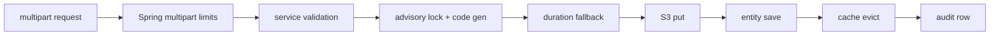

# Object Storage and Media Handling

> **Audience:** Backend developers and operators ·
> **Source:** `S3Config.java`, `S3Service.java` (both in the root package
> `ak.dev.khi_archive_platform`),
> `platform/api/audio/AudioStreamAPI.java`, `platform/api/video/VideoStreamAPI.java`,
> `platform/api/image/ImageStreamAPI.java`, `platform/api/text/TextStreamAPI.java`,
> `platform/api/maqam/MaqamStreamAPI.java`,
> `platform/service/audio/AudioService.java`, `platform/service/video/VideoService.java`,
> `platform/service/image/ImageService.java`, `platform/service/text/TextService.java`,
> `platform/service/person/PersonService.java`, `platform/service/project/ProjectService.java`,
> `platform/service/maqam/MaqamService.java`, `platform/service/khilogo/KhiLogoService.java`,
> `platform/service/common/MediaDurationExtractor.java`,
> `user/service/UserProfileService.java`, `user/service/UserService.java`,
> `platform/exceptions/ApiExceptionHandler.java`, `src/main/resources/application.yaml`, `pom.xml`

Every byte of archive content lives in one AWS S3 bucket. The database stores only a URL string
per record; the bucket stores the object. This document traces a file end to end: which bucket and
key it lands under, what the upload path does before and after the `PutObject`, why the browser
never receives an S3 URL for archive media, how Range requests are served, what metadata the
backend extracts on its own, and exactly where an object is deleted versus preserved.

There is one `S3Client` bean, built once in `S3Config`, and one `S3Service` that every caller goes
through. No presigned URLs are generated anywhere in the codebase.

---

## At a glance

| Question | Answer |
|---|---|
| SDK | `software.amazon.awssdk:s3:2.20.30` (`pom.xml`) |
| Client bean | `S3Config.s3Client(...)` — `StaticCredentialsProvider` over `AwsBasicCredentials` |
| Bucket | `aws.s3.bucket`, default `khi-archive-platform` |
| Key prefix | `aws.s3.base-folder`, default `khi-archive-platform-folders` |
| Upload cutover | ≤ 16 MB single `PutObject`; > 16 MB multipart in 16 MB parts |
| Max upload | `spring.servlet.multipart.max-file-size: 5GB` / `max-request-size: 6GB` |
| Download to browser | Always proxied through the API for audio, video, image, text and maqam |
| Presigned URLs | None — not generated anywhere in source |
| Range support | Audio, video, text file, maqam. Not image, not text cover |
| Trash | Soft delete keeps the S3 object |
| Purge | Deletes the S3 object, best-effort — after the audit row for the four archive media types and maqam, *before* it for person |

---

## S3 configuration

### Keys read from `application.yaml`

```yaml
aws:
  credentials:
    access-key: ${AWS_ACCESS_KEY_ID}
    secret-key: ${AWS_SECRET_ACCESS_KEY}
  s3:
    region: ${AWS_REGION:us-east-1}
    bucket: ${AWS_S3_BUCKET:khi-archive-platform}
    base-folder: ${AWS_S3_BASE_FOLDER:khi-archive-platform-folders}
    person-folder: ${AWS_S3_PERSON_FOLDER:persons}
```

| Config key | Env var | Effective default | Read by |
|---|---|---|---|
| `aws.credentials.access-key` | `AWS_ACCESS_KEY_ID` | — (mandatory) | `S3Config.s3Client` |
| `aws.credentials.secret-key` | `AWS_SECRET_ACCESS_KEY` | — (mandatory) | `S3Config.s3Client` |
| `aws.s3.region` | `AWS_REGION` | `us-east-1` | `S3Config.s3Client`, `S3Service.region` |
| `aws.s3.bucket` | `AWS_S3_BUCKET` | `khi-archive-platform` | `S3Service.bucket` |
| `aws.s3.base-folder` | `AWS_S3_BASE_FOLDER` | `khi-archive-platform-folders` | `S3Service.baseFolder` |
| `aws.s3.person-folder` | `AWS_S3_PERSON_FOLDER` | `persons` | `S3Service.personFolder` |

`S3Service` declares its own `@Value` fallbacks for two of these
(`${aws.s3.base-folder:khi-archive-platform-folders}` and `${aws.s3.person-folder:persons}`), but
the YAML always supplies a value, so those Java defaults never take effect. `bucket` and `region`
have **no** Java-side default — an unresolvable placeholder fails context startup.

### Client construction

```java
return S3Client.builder()
        .region(Region.of(region))
        .credentialsProvider(
                StaticCredentialsProvider.create(
                        AwsBasicCredentials.create(accessKey, secretKey)))
        .build();
```

Static long-lived credentials — no instance profile, no STS, no role assumption in source. There is
no endpoint override, so the SDK resolves the regional AWS endpoint. Bucket creation, bucket
policy, CORS configuration on the bucket, server-side encryption settings, versioning and lifecycle
rules: _Not documented in source._ Nothing in the repository creates or configures the bucket; it is
expected to exist already.

### Compile-time constants (not configurable)

| Constant | Value | Where |
|---|---|---|
| `DEFAULT_FOLDER` | `files` | `S3Service` — used when a caller passes a null/blank folder |
| `PROFILE_FOLDER` | `user_profile_images` | `S3Service.uploadProfileImage` |
| `MULTIPART_PART_SIZE` | `16 * 1024 * 1024` (16 MB) | `S3Service` — threshold and part size |
| `AUDIO_FOLDER` | `audios` | `AudioService` |
| `VIDEO_FOLDER` | `videos` | `VideoService` |
| `IMAGE_FOLDER` | `images` | `ImageService` |
| `TEXT_FOLDER` | `texts` | `TextService` |
| `TEXT_COVER_FOLDER` | `texts/covers` | `TextService` |
| `MAQAM_FOLDER` | `maqam-audio` | `MaqamService` |
| `KHI_LOGO_FOLDER` | `khi_logo` | `KhiLogoService` |
| `S3_PROFILE_FOLDER` | `user_profile_images` | `UserProfileService` |

---

## Object key layout

Every key is built by one private method, so the shape is identical for all content types:

```java
private String buildKey(String folder, String originalFilename) {
    String safeName = sanitizeFilename(originalFilename);
    return baseFolder + "/" + folder + "/" + UUID.randomUUID() + "-" + safeName;
}

private String sanitizeFilename(String filename) {
    if (filename == null || filename.isBlank()) {
        return "file";
    }
    return filename.replaceAll("[^a-zA-Z0-9._-]", "_");
}

private String normalizeFolder(String folder) {
    if (folder == null || folder.isBlank()) {
        return DEFAULT_FOLDER;
    }
    return folder.replaceAll("^/+", "").replaceAll("/+$", "");
}
```

So the general pattern is:

```text
{base-folder}/{folder}/{random-uuid}-{sanitized-original-filename}
```

The UUID prefix means **an upload never overwrites a previous object**, even when the same file is
re-uploaded to the same record. Replacement is always "put new object, then delete old object".

`sanitizeFilename` applies to the filename segment only. The folder segment is passed through
`normalizeFolder`, which strips leading and trailing slashes and nothing else — so business codes
that contain parentheses (media codes carry a literal `Copy(1)` segment) appear verbatim inside the
key path.

### Per content type

| Content | Folder argument | Resulting key | Built in |
|---|---|---|---|
| Audio | `audios/{audioCode}` | `khi-archive-platform-folders/audios/{audioCode}/{uuid}-{name}` | `AudioService.uploadAudioFile` |
| Video | `videos/{videoCode}` | `khi-archive-platform-folders/videos/{videoCode}/{uuid}-{name}` | `VideoService.uploadVideoFile` |
| Image | `images/{imageCode}` | `khi-archive-platform-folders/images/{imageCode}/{uuid}-{name}` | `ImageService.uploadImageFile` |
| Text file | `texts/{textCode}` | `khi-archive-platform-folders/texts/{textCode}/{uuid}-{name}` | `TextService.uploadTextFile` |
| Text cover | `texts/covers/{textCode}` | `khi-archive-platform-folders/texts/covers/{textCode}/{uuid}-{name}` | `TextService.uploadCoverImage` |
| Maqam audio | `maqam-audio` | `khi-archive-platform-folders/maqam-audio/{uuid}-{name}` | `MaqamService.create` / `update` |
| KHI logo | `khi_logo` | `khi-archive-platform-folders/khi_logo/{uuid}-{name}` | `KhiLogoService` |
| Person portrait | `persons/{personCode}` | `khi-archive-platform-folders/persons/{personCode}/{uuid}-{name}` | `S3Service.uploadPersonPortrait` |
| User profile image | `user_profile_images` | `khi-archive-platform-folders/user_profile_images/{uuid}-{name}` | `UserProfileService` |
| Anything with a blank folder | `files` | `khi-archive-platform-folders/files/{uuid}-{name}` | `S3Service.normalizeFolder` |

The four archive media types, text covers and person portraits get a **per-record prefix** (the
business code), so every object belonging to one record is enumerable with a single `ListObjectsV2`
prefix query. Maqam audio, the KHI logo and user profile images are **flat** — objects there can
only be traced back to a record through the stored URL.

### The URL that gets persisted

`upload(...)` returns `getPublicUrl(key)`, and that string — not the key — is what lands in the
database column:

```java
public String getPublicUrl(String key) {
    return "https://" + bucket + ".s3." + region + ".amazonaws.com/" + key;
}
```

Virtual-hosted style, region-qualified. Changing `AWS_S3_BUCKET` or `AWS_REGION` after objects
exist does **not** rewrite already-stored URLs; every old row keeps pointing at the old host.

### Columns that hold a storage URL

| Table | Column | SQL type | Entity |
|---|---|---|---|
| `audios` | `audio_file_url` | `varchar(1000)` | `platform/model/audio/Audio.java` |
| `videos` | `video_file_url` | `varchar(1000)` | `platform/model/video/Video.java` |
| `images` | `image_file_url` | `varchar(1000)` | `platform/model/image/Image.java` |
| `texts` | `text_file_url` | `varchar(1000)` | `platform/model/text/Text.java` |
| `texts` | `cover_image_url` | `varchar(1000)` | `platform/model/text/Text.java` |
| `list_of_maqam` | `audio_file_url` | `varchar(1000) not null` | `platform/model/maqam/ListOfMaqam.java` |
| `person` | `media_portrait` | `varchar(255)` | `platform/model/person/Person.java` |
| `khi_logo` | `image_url` | `varchar(500) not null` | `platform/model/khilogo/KhiLogo.java` |
| `users_tbl` | `profile_image` | `varchar(500)` | `user/model/User.java` |

That is the complete set. One near-miss to keep straight: `users_tbl.image_url` (`varchar(500)`,
`User.imageUrl`) is *not* one of them — it holds a profile picture URL supplied by an external
account provider, has no setter call anywhere in source, and is never touched by `S3Service`.

> **`media_portrait` is only 255 characters.** A person key is
> `khi-archive-platform-folders/persons/{personCode}/{36-char uuid}-{filename}` plus the
> `https://{bucket}.s3.{region}.amazonaws.com/` prefix, so a long original filename can push the
> generated URL past the column length. Nothing in source truncates it before the insert.

### Turning a URL back into a key

Reads need the key, not the URL, so `S3Service.extractKeyFromUrl` reverses the transformation:

```java
URI uri = new URI(fileUrl);
String path = uri.getPath();
if (path == null || path.isBlank())  return null;
if (path.startsWith("/"))            path = path.substring(1);
if (path.startsWith(bucket + "/"))   path = path.substring(bucket.length() + 1);
return path;
```

It strips the leading slash, and also strips a leading `{bucket}/` so path-style URLs
(`https://s3.{region}.amazonaws.com/{bucket}/{key}`) resolve to the same key. If anything inside the
`try` throws (the catch is on `Exception`, not just `URISyntaxException`), `extractKeyFallback`
takes over: it looks for the `base-folder` substring and takes everything from there (dropping any
`?query`), and if that also fails it assumes `{base-folder}/files/{last path segment}`, and returns
`null` if even that is impossible. One case skips the fallback entirely: when `uri.getPath()` is
null or blank the method returns `null` directly — that is the input that produces gate 4's `500`.

`isOurS3Url(url)` — `url != null && url.contains(bucket) && url.contains(".s3.")` — is the guard
used before every delete **except the two in `MaqamService`** (see
[Where the S3 delete actually happens](#where-the-s3-delete-actually-happens)). Where it is applied,
a URL that does not name the bucket is never deleted.

---

## The upload path



### 1. The request

All media creates and updates are `multipart/form-data` with a JSON part named `data` and a file
part named `file`. Two shapes deviate: `person` names its file part `mediaPortrait`, and
`khi-logo` has **no `data` part at all** — the file is the entire request.

| Endpoint | Authority | File parts |
|---|---|---|
| `POST /api/audio` | `audio:create` | `file` (required) |
| `PATCH /api/audio/{audioCode}` | `audio:update` | `file` (optional) |
| `POST /api/video` | `video:create` | `file` (required) |
| `PATCH /api/video/{videoCode}` | `video:update` | `file` (optional) |
| `POST /api/image` | `image:create` | `file` (required) |
| `PATCH /api/image/{imageCode}` | `image:update` | `file` (optional) |
| `POST /api/text` | `text:create` | `file` (required), `coverImage` (optional) |
| `PATCH /api/text/{textCode}` | `text:update` | `file` (optional), `coverImage` (optional) |
| `POST /api/maqam` | `maqam:create` | `file` (required) |
| `PATCH /api/maqam/{maqamCode}` | `maqam:update` | `file` (optional) |
| `POST /api/person` | `person:create` | `mediaPortrait` (required) |
| `PATCH /api/person/{personCode}` | `person:update` | `mediaPortrait` (optional) |
| `POST /api/khi-logo` | `khi_logo:create` | `file` (required) |
| `PATCH /api/khi-logo/{id}` | `khi_logo:update` | `file` (required) |

The `/bulk` endpoints (`POST /api/audio/bulk` and siblings) are `application/json` only. They carry
a caller-supplied `audioFileUrl` / `videoFileUrl` / `imageFileUrl` / `textFileUrl` and perform **no
upload at all** — the string is stored verbatim.

### 2. Multipart limits, and what happens when they are exceeded

```yaml
  servlet:
    multipart:
      enabled: true
      max-file-size: 5GB
      max-request-size: 6GB
      file-size-threshold: 2MB
```

| Limit | Value | Effect when exceeded |
|---|---|---|
| `max-file-size` | `5GB` | `MaxUploadSizeExceededException` before the controller method runs |
| `max-request-size` | `6GB` | Same exception — the whole request (file + JSON part + boundaries) |
| `file-size-threshold` | `2MB` | Not a limit: parts above 2 MB spool to a temp file instead of heap |

The Tomcat connector caps are deliberately disabled (`server.tomcat.max-swallow-size: -1`,
`server.tomcat.max-http-form-post-size: -1`), so the Spring multipart layer is the only enforcement
point.

The two `@RestControllerAdvice` classes are package-scoped, so which one answers depends on where
the endpoint lives:

| Exception | Endpoint package | Status | `error` code | Handler |
|---|---|---|---|---|
| `MaxUploadSizeExceededException` | `platform` (all media) | `413` | `UPLOAD_TOO_LARGE` | `ApiExceptionHandler.handleUploadTooLarge` |
| `MultipartException` (other) | `platform` | `400` | `BAD_REQUEST` | `ApiExceptionHandler.handleMultipart` |
| Either of the two | `user` (register, profile image) | `413` | `UPLOAD_TOO_LARGE` | `GlobalExceptionHandler.handleUploadTooLarge` |

The 413 body carries the cap so a client can report it:

```json
{
  "status": 413,
  "error": "UPLOAD_TOO_LARGE",
  "category": "MEDIA",
  "message": "Upload exceeds the configured size limit.",
  "hint": "Compress or split the file and retry — see 'details.maxBytes' for the cap.",
  "details": { "maxBytes": 5368709120 }
}
```

There is **no per-type size or MIME validation** on the four archive media services. The only
content checks in source are:

| Check | Where | Behavior |
|---|---|---|
| `audio/*` MIME prefix | `MaqamService.validateAudio` | `MaqamValidationException` otherwise |
| `.xlsx` extension | `PhysicalMediaExcelImportService.importExcel` | `PhysicalMediaValidationException` otherwise (no S3 involved) |
| 5 MB + JPEG/PNG/GIF/WebP | `UserProfileService.uploadProfileImage` | `IllegalArgumentException` otherwise |
| 5 MB + JPEG/PNG/GIF/WebP | `UserService.storeProfileImage` | `IllegalArgumentException` otherwise |

An empty file is rejected earlier: `AudioValidationException("Audio file is required")` and its
per-type equivalents, and `S3Service.upload` itself throws
`UserStorageException("File is empty.")`.

### 3. The put

`S3Service.upload(MultipartFile file, String folder)` picks one of two paths on
`file.getSize()`:

| Size | Path | Calls |
|---|---|---|
| ≤ 16 MB | Buffered | `file.getBytes()` then one `PutObject` with `contentType` |
| > 16 MB | Streamed multipart | `CreateMultipartUpload` → N × `UploadPart` (16 MB each) → `CompleteMultipartUpload` |

The multipart branch reads through `file.getInputStream()` with a single reused 16 MB buffer, so a
5 GB upload does not materialize in heap. On any failure it calls `abortMultipartUpload(key,
uploadId)` before rethrowing; if the abort itself fails, that is logged at `WARN` and swallowed:

```java
} catch (IOException | RuntimeException e) {
    abortMultipartUpload(key, uploadId);
    log.error("S3 multipart upload failed for key={}: {}", key, e.getMessage(), e);
    throw new UserStorageException("Failed to upload file to S3.", e);
}
```

An `S3Exception` on the single-put path becomes `UserStorageException("Failed to upload file to
S3.", e)`; an `IOException` while reading the `MultipartFile` becomes
`UserStorageException("Failed to read uploaded file.", e)`.
Inside the `platform` package there is no dedicated handler for that type, so it falls
through to `ApiExceptionHandler.handleUnexpected` and the client sees a generic
`500 / INTERNAL_SERVER_ERROR` with `"An unexpected error occurred."`. Inside the `user` package it
maps to `500 / STORAGE_ERROR` (`GlobalExceptionHandler.handleUserStorage`). Either way the real
cause is in the log with the traceId.

### 4. What gets persisted

`AudioService.create` is the reference shape; video, image and text differ only in field names:

```java
Audio audio = new Audio();
audio.setAudioCode(audioCode);
audio.setProject(project);
applyDto(audio, dto);
applyUploadedFileName(audio, audioFile, dto.getFileName());
applyFallbackDuration(audio, audioFile);
audio.setAudioFileUrl(uploadAudioFile(audioFile, audioCode));
touchCreateAudit(audio, authentication);

Audio saved = audioRepository.save(audio);
readCache.evictAll();
audioAuditService.record(saved, AudioAuditAction.CREATE, authentication, request, buildCreateDetails(saved));
```

| Column | Filled from |
|---|---|
| `audio_file_url` | `S3Service.upload(...)` return value (the public URL) |
| `file_name` | `file.getOriginalFilename()`, only when the `data` part did not supply `fileName` |
| `duration` | Client-supplied value, else the server-side fallback (see below) |
| `file_size`, `file_extension`, `bit_rate`, `bit_depth`, `sample_rate` | Client `data` part only — never computed from the upload |
| `created_at`, `updated_at`, `created_by`, `updated_by` | `touchCreateAudit`, `authentication.getName()` (`anonymous` when null) |

Note the ordering: **the S3 put happens before the row is saved and before the transaction
commits.** See [Operational concerns](#operational-concerns).

### 5. The audit row

`{Entity}AuditService.record(...)` runs in `Propagation.REQUIRES_NEW`, so the audit row commits
independently of the business transaction. It writes one row per operation into
`audio_audit_logs` / `video_audit_logs` / `image_audit_logs` / `text_audit_logs` /
`maqam_audit_logs`, with:

| Column | Value |
|---|---|
| `action` | `@Enumerated(EnumType.STRING)`. For audio/video/image/text: `varchar(20)` — `CREATE`, `READ`, `LIST`, `SEARCH`, `UPDATE`, `REMOVE`, `DELETE`, `RESTORE`, `PURGE` (`platform/enums/AudioAuditAction.java` and its per-type twins). `maqam_audit_logs.action` is `varchar(30)` and adds `TEACHER_ASSIGNED`, `TEACHER_REMOVED`, `VOTE_CAST`, `VOTE_UPDATED`, `VOTE_DELETED`, `STREAM`, `LISTEN_STARTED`, `LISTEN_PROGRESS`, `LISTEN_ENDED` (`platform/enums/MaqamAuditAction.java`) |
| `details` | `TEXT`, HTML-escaped. For a create: `"Created audio record with code=… project=… audioFileUrl=…"` |
| `request_method`, `request_path` | Straight off the `HttpServletRequest` |
| `actor_username`, `actor_authorities`, `actor_permissions` | From the `Authentication` / session lookup |
| `occurred_at` | `Instant.now()`, `not null` |

The create audit detail string embeds the **raw S3 URL**. Anyone with audit-log read access can see
bucket and key even though the API responses never expose them.

### 6. What the client gets back

The response DTO never carries the S3 URL for archive media — the mapper overwrites the field with
the proxy path:

| DTO field | Value written by the mapper |
|---|---|
| `AudioResponseDTO.audioFileUrl` | `/api/audio/{audioCode}/stream` |
| `VideoResponseDTO.videoFileUrl` | `/api/video/{videoCode}/stream` |
| `ImageResponseDTO.imageFileUrl` | `/api/image/{imageCode}/view` |
| `TextResponseDTO.textFileUrl` | `/api/text/{textCode}/read` |
| `TextResponseDTO.coverImageUrl` | `/api/text/{textCode}/cover`, or `null` when no cover is stored |
| `MaqamResponseDTO.streamUrl` | `{scheme}://{host}/api/maqam/{maqamCode}/stream`, built from `X-Forwarded-Proto`/`X-Forwarded-Host` falling back to the request's own scheme and `Host`; degrades to the bare path `/api/maqam/{maqamCode}/stream` when there is no request or no host header |
| Guest DTOs | The same five paths under `/api/guest/...` (`GuestMapper`) |

Three storage columns are the exception and **do** reach the client as the raw S3 URL:
`person.media_portrait` (via `PersonResponseDTO.mediaPortrait`, `GuestPersonDTO.mediaPortrait` and
`GuestPersonSummaryDTO.mediaPortrait`), `khi_logo.image_url` (via `KhiLogoResponseDTO.imageUrl`),
and `users_tbl.profile_image` (via the user DTOs' `profileImage`). Those objects are
fetched by the browser directly from S3, which means the bucket must permit anonymous `GetObject`
at least for those prefixes. The bucket policy that allows it: _Not documented in source._

**Example — create an audio record with its file:**

```bash
curl -s -X POST "{{BASE_URL}}/api/audio" \
  -H "Cookie: khi_auth_token=$TOKEN" \
  -F 'data={"projectCode":"HASAZIRA-PROJ-000001","audioVersion":"RAW","versionNumber":1,"copyNumber":1};type=application/json' \
  -F "file=@/path/to/recording.mp3"
```

---

## Metadata extraction

Two pure-Java media-metadata libraries are on the classpath. Both are used by exactly one class,
`platform/service/common/MediaDurationExtractor.java`, and both are used for **duration only**.

| Dependency | Version | What it is actually used for |
|---|---|---|
| `com.drewnoakes:metadata-extractor` | `2.19.0` | Container duration from MP4 (`Mp4Directory.TAG_DURATION_SECONDS`), QuickTime (`QuickTimeDirectory.TAG_DURATION_SECONDS`) and WAV (`WavDirectory.TAG_DURATION`) |
| `com.mpatric:mp3agic` | `0.9.1` | MP3 frame-header duration via `Mp3File.getLengthInSeconds()` |

No EXIF, IPTC, XMP, dimension, DPI, codec, bitrate or camera field is read from any upload.
`images.manufacturer`, `images.model`, `images.lens`, `images.dpi`, `images.dimension`,
`videos.resolution`, `videos.video_codec`, `audios.sample_rate` and every other technical column are
populated from the client's `data` JSON part only.

### Fallback order for audio and video duration

1. **Client value.** The browser probe (the frontend's `media-metadata.js`, per the javadoc) sends
   `duration` in the `data` part. `applyDto` copies it onto the entity.
2. **Server fallback**, only when step 1 left the field null or blank:
   `applyFallbackDuration(entity, file)` → `MediaDurationExtractor.extractDuration(file)`.
3. Inside the extractor, `extractDurationSeconds` tries container metadata first, then MP3:

   ```java
   private static Optional<Double> extractDurationSeconds(byte[] bytes) {
       Optional<Double> viaContainer = tryContainerMetadata(bytes);
       if (viaContainer.isPresent()) {
           return viaContainer;
       }
       return tryMp3(bytes);
   }
   ```

   `tryContainerMetadata` reads MP4 → QuickTime → WAV directories in that order, taking the first
   positive value. `tryMp3` writes the bytes to a temp file (`File.createTempFile("khi-duration-",
   ".mp3")`) because mp3agic 0.9.1 has no `InputStream` constructor, then deletes it in a `finally`.
4. **Nothing.** Formats neither library understands (the javadoc names ogg, flac, wma, avi) return
   `Optional.empty()` and the duration column is left untouched. An unreadable file never fails the
   upload — every failure path in the extractor logs at `DEBUG`/`WARN` and returns empty.

The stored value is a formatted string, not a number:

```java
return hours > 0
        ? String.format(Locale.ROOT, "%d:%02d:%02d", hours, minutes, seconds)
        : String.format(Locale.ROOT, "%d:%02d", minutes, seconds);
```

That lands in `audios.duration` / `videos.duration`, both `varchar(100)`.

Two callers only — `AudioService.applyFallbackDuration` and `VideoService.applyFallbackDuration`.
Maqam does not use the extractor: `list_of_maqam.audio_duration_seconds` (`bigint`) has **no writer
anywhere in source**, so listen-coverage ratios that divide by it are always null. `MaqamService`
does record `audio_file_name`, `audio_content_type` and `audio_file_size_bytes` straight off the
`MultipartFile`.

The Excel import (`PhysicalMediaExcelImportService`, Apache POI 5.3.0) parses the workbook
in-process from `file.getInputStream()` and never stores it in S3.

---

## The download and serve path

### Why every byte is proxied

The five stream controllers state the reason in their class javadoc, and it is threefold:

1. **The S3 URL is never sent to the browser.** Every one of the five opens with that sentence, and
   `TextStreamAPI` records the concrete bug it solved: the frontend was attaching the JWT
   `Authorization` header to a direct S3 request, and S3 rejects that with `400 Bad Request`.
2. **Access is re-checked on every request.** `MaqamStreamAPI`'s javadoc puts it directly —
   "Permission to play is re-checked on every request." A presigned URL, once issued, is valid until
   it expires regardless of what happens to the record; proxying means the trash and panel checks
   run on the byte fetch itself.
3. **Downloads can be discouraged and audited.** `MaqamStreamAPI`'s javadoc is explicit —
   `Content-Disposition: inline` plus the frontend's `controlsList="nodownload"` implements the "no
   downloads" requirement for maqam, and every range request writes a `STREAM` audit row.
   "Switching to pre-signed GETs with short TTLs would be faster but would also leak a downloadable
   link — explicitly rejected."

No code in the repository calls any presigner API.

### The endpoints

| Endpoint | Auth | Record lookup | Range | Success status |
|---|---|---|---|---|
| `GET /api/guest/audio/{audioCode}/stream` | none | `findByAudioCodeAndRemovedAtIsNull` | yes | `200`, or `206` with `Range` |
| `GET /api/audio/{audioCode}/stream` | valid JWT | `findByAudioCode` | yes | `200`, or `206` with `Range` |
| `GET /api/guest/video/{videoCode}/stream` | none | `findByVideoCodeAndRemovedAtIsNull` | yes | always `206` |
| `GET /api/video/{videoCode}/stream` | valid JWT | `findByVideoCode` | yes | always `206` |
| `GET /api/guest/image/{imageCode}/view` | none | `findByImageCodeAndRemovedAtIsNull` | no | `200`, or `304` |
| `GET /api/image/{imageCode}/view` | valid JWT | `findByImageCode` | no | `200`, or `304` |
| `GET /api/guest/text/{textCode}/read` | none | `findByTextCodeAndRemovedAtIsNull` | yes | `200`, or `206` with `Range` |
| `GET /api/text/{textCode}/read` | valid JWT | `findByTextCode` | yes | `200`, or `206` with `Range` |
| `GET /api/guest/text/{textCode}/cover` | none | `findByTextCodeAndRemovedAtIsNull` | no | `200`, or `304` |
| `GET /api/text/{textCode}/cover` | valid JWT | `findByTextCode` | no | `200`, or `304` |
| `GET /api/maqam/{maqamCode}/stream` | `maqam:read` + panel check | `findByMaqamCodeAndRemovedAtIsNull` | yes | `200`, or `206` with `Range` |

### The gate applied before the first byte

This is the complete set of checks, in order, for the four archive media proxies:

| # | Check | Failure |
|---|---|---|
| 1 | Servlet security — `/api/guest/**` is `permitAll()`, everything else under `/api/**` is `authenticated()` | `401` |
| 2 | Record exists. Guest variants add `AND removed_at IS NULL` | `404` `"Audio not found"` |
| 3 | The URL column is non-blank | `404` `"Audio file not available"` |
| 4 | A key can be extracted from that URL | `500` `"Audio file not available"` |
| 5 | `HeadObject` succeeds (audio, video, text file only) | `404` or `500`, see below |

On the two image-shaped endpoints the `If-None-Match` comparison sits **between steps 3 and 4**: a
matching ETag returns `304` before the key is ever extracted and before any S3 call.

Two consequences worth being precise about:

- **Trash is the only record-level gate on the public byte stream.** The guest repository methods
  filter on `removed_at IS NULL` and nothing else. `audios.is_public` and
  `projects.is_visible_to_public` are **not** consulted by any stream controller — they are applied
  by `GuestSearchService.isPubliclyVisible(...)`, which gates the catalog, search, feed and facets.
  A caller who already knows a code can therefore fetch bytes for a non-public but non-trashed
  record through `/api/guest/...`.
- **The authenticated variants deliberately serve trashed records** so an admin can preview before
  restoring, and they carry no `@PreAuthorize` — any authenticated principal, including a signed-in
  `GUEST`, passes. There is no `audio:read` check on the byte path.

`MaqamStreamAPI` is the exception that does gate properly:
`@PreAuthorize("hasAuthority('maqam:read')")` on the method, plus
`MaqamService.loadForStreaming` → `ensureCallerMaySeeRecord`, which throws
`MaqamAccessDeniedException` when a `TEACHER` is not on that record's vote panel, plus a `STREAM`
audit row carrying the `Range` header value (truncated to 500 characters).

### Range handling

The three range-capable archive proxies — audio, video and the text **file** endpoint — each carry
their own copy of the same `parseRange(header, total)` method, with the same clamping rules. Image
and the text cover have no `parseRange` at all. `MaqamStreamAPI` has a fourth near-identical copy
that drops the `header == null` branch, because the controller only calls it once a `Range` header
is present.

| Input | Result |
|---|---|
| No `Range` header | Audio/text: `0 .. total-1`. Video: `0 .. min(2 MB - 1, total-1)`. Maqam: whole object, `200` |
| `bytes=start-end` | As given |
| `bytes=start-` | `start .. total-1` |
| `bytes=-500` | Parsed as `0 .. 500` — **not** the RFC 7233 suffix range |
| Header not starting with `bytes=` | Same window as no header (maqam: whole object, but still `206`, because the controller already committed to the range branch) |
| Multi-range (`bytes=0-50,100-150`) | `NumberFormatException` → same as the row above |
| `end >= total` | Clamped to `total-1` |
| `end < start` | Forced to `end = start` |

No controller ever returns `416 Range Not Satisfiable`. On audio, video and text an unsatisfiable
start is passed through to S3 in the `Range` header of `openStreamRange`, and whatever S3 answers is
mapped by `mapStorageError`. Maqam slices in memory instead, so a start past the end of the object
raises `ArrayIndexOutOfBoundsException` inside `Arrays.copyOfRange` and surfaces as a generic
`500 / INTERNAL_SERVER_ERROR` from `ApiExceptionHandler.handleUnexpected`.

Response headers:

| Header | Audio | Video | Text file | Image / text cover |
|---|---|---|---|---|
| `Accept-Ranges: bytes` | always | always | always | not set |
| `Content-Range: bytes s-e/total` | only when `Range` was sent | always | only when `Range` was sent | not set |
| Status | `206` when `Range` was sent, else `200` | always `206` | `206` when `Range` was sent, else `200` | `200` or `304` |
| `Content-Length` | `end - start + 1` | `end - start + 1` | `end - start + 1` | `bytes.length` |
| `Cache-Control` | guest `public, max-age=300`; authenticated `no-store, private` | same as audio | guest `public, max-age=3600`; authenticated `no-store, private` | guest `public, max-age=3600`; authenticated `no-store, private` |
| `ETag` | not set | not set | not set | `"{sha1Short}"` |
| `X-Content-Type-Options` | `nosniff` | `nosniff` | `nosniff` | `nosniff` |
| `Content-Disposition` | `inline` + RFC 5987 `filename*` | same | same | image: same; cover: bare `inline` |

`Content-Type` is inferred from the **file extension present in the stored URL**, not from any
stored MIME column: `.mp3` → `audio/mpeg`, `.m4a` → `audio/mp4`, `.mp4` → `video/mp4`, `.mkv` →
`video/x-matroska`, `.pdf` → `application/pdf`, `.epub` → `application/epub+zip`, and so on, falling
back to `application/octet-stream`. The match is a `contains` scan over the lowercased URL, first
rule wins — not a true suffix test, so the substring can sit anywhere in the key, folder segment
included. The text **cover** is the one proxy whose fallback is not
octet-stream: `resolveCoverContentType` knows only `.jpg`/`.jpeg`, `.png` and `.webp` and defaults
everything else to `image/jpeg`. `MaqamStreamAPI` is the other exception — it uses the stored
`list_of_maqam.audio_content_type`, falling back to `application/octet-stream` when that column is
blank or unparseable.

The `Content-Disposition` builder preserves non-ASCII names (Kurdish and Arabic titles are common
here) while keeping an ASCII fallback:

```java
String asciiFallback = rawFilename.replaceAll("[^a-zA-Z0-9._\\-() ]", "_");
if (asciiFallback.replaceAll("[_\\s]", "").isEmpty()) {
    asciiFallback = asciiFallbackName;
}
String encoded = URLEncoder.encode(rawFilename, StandardCharsets.UTF_8).replace("+", "%20");
return "inline; filename=\"" + asciiFallback + "\"; filename*=UTF-8''" + encoded;
```

### How much is buffered

The four archive proxies return `ResponseEntity<byte[]>` and `MaqamStreamAPI` returns
`ResponseEntity<ByteArrayResource>` — either way the requested window is fully materialized in heap
before the response is written.

| Endpoint | S3 calls per request | Bytes held in heap |
|---|---|---|
| Audio stream | `HeadObject` + ranged `GetObject` | The requested window; **the whole file** when no `Range` was sent |
| Video stream | `HeadObject` + ranged `GetObject` | 2 MB by default; the whole file if a client sends `Range: bytes=0-` |
| Text read | `HeadObject` + ranged `GetObject` | Same as audio |
| Image view / text cover | One full `GetObject` | The whole object |
| Maqam stream | One full `GetObject` (`downloadByUrl`) | The whole object, on every request, even for a small range |

The three `S3Service` methods the controllers call were added so that this buffering would not be
necessary, and the javadoc still records the contract:

| Method | Intent as written |
|---|---|
| `openStream(key)` | "Unlike `downloadByUrl`, this does NOT buffer the full object — the caller MUST close the returned stream after reading. Suitable for large files (video, audio) where loading all bytes into memory would be wasteful." |
| `openStreamRange(key, start, end)` | The same contract, with `Range: bytes={start}-{end}` pushed down onto the `GetObjectRequest`, so only the requested window crosses the wire out of the bucket |
| `getObjectSize(key)` | "Returns the size in bytes of an object without downloading it." A `HeadObject`: the total is needed both to clamp the window and to fill the third number in `Content-Range`, and `HeadObject` supplies it without transferring a byte |

Half of that intent is realized. `openStreamRange` genuinely limits the S3 side — a seek into the
middle of a 500 MB video pulls 2 MB out of the bucket, not 500 MB — and the `HeadObject` really is
free of data transfer. What is unfinished is the last hop: all four archive proxies end with
`stream.readAllBytes()` and return `ResponseEntity<byte[]>`, so the window is materialized in heap
before Spring writes it to the socket. Copying the `ResponseInputStream` straight into the response
body instead (a `StreamingResponseBody`, or `ResponseEntity<InputStreamResource>`) would make the
handlers constant-memory and would close the one genuinely dangerous shape — a non-`Range` request
for a multi-gigabyte audio or book file. The try-with-resources block that closes the stream is
already in place; only the `readAllBytes()` call stands between the current code and that.

### Error mapping on the serve path

`mapStorageError` distinguishes a missing object from an infrastructure failure:

```java
if (e.getCause() instanceof S3Exception s3Exception && s3Exception.statusCode() == 404) {
    log.warn("S3 object missing: {}", e.getMessage());
    return new ResponseStatusException(HttpStatus.NOT_FOUND, notFoundMessage);
}
log.error("S3 storage failure serving audio", e);
return new ResponseStatusException(HttpStatus.INTERNAL_SERVER_ERROR, "Failed to stream audio");
```

`ApiExceptionHandler.handleResponseStatus` then renders it into the standard envelope: `404` →
`error: "NOT_FOUND"`, `category: "NOT_FOUND"`; any other 4xx → `BAD_REQUEST`; 5xx →
`INTERNAL_SERVER_ERROR` with the message logged server-side.

Because the status alone cannot tell you *which* of the five gates failed, use the message string:

| Status | `message` | Meaning |
|---|---|---|
| `404` | `Audio not found` | No row with that code (guest variant: or the row is trashed) |
| `404` | `Audio file not available` | Row exists, `audio_file_url` is null or blank |
| `500` | `Audio file not available` | URL present but no key could be extracted from it |
| `404` | `Audio not available for {audioCode}` | S3 returned 404 — the row points at a missing object |
| `500` | `Failed to stream audio` | Any other S3 failure, or an `IOException` reading the body |

The same five, with the type's wording, apply elsewhere: `Video not found` / `Video file not
available` / `Video not available for {videoCode}` / `Failed to stream video`; `Image not found` /
`Image file not available` / `Image not available for {imageCode}` / `Failed to serve image`; `Text
not found` / `Book file not available` / `Book file not available for {textCode}` / `Failed to
stream book file`; and for the cover, `Text not found` / `Cover image not available` / `Cover image
not available for {textCode}` / `Failed to serve cover image`. Note the text shapes: the S3-404 and
the missing-URL cases share the same base string, differing only by the trailing ` for {textCode}`.

### Conditional requests

Only the two image-shaped endpoints implement them. The ETag is derived from the business code, not
the object:

```java
String etag = "\"" + sha1Short(image.getImageCode()) + "\"";
if (etag.equals(ifNoneMatch)) {
    return ResponseEntity.status(HttpStatus.NOT_MODIFIED).eTag(etag).build();
}
```

`sha1Short` is the first 6 bytes of the SHA-1 of the input, hex-encoded (12 characters). The text
cover uses `sha1Short(textCode + "-cover")`. Because the code never changes, **the ETag never
changes** — replacing an image file on an existing record leaves every client that already cached
it serving the old bytes until `max-age=3600` expires. The javadoc states the assumption plainly:
"stable since image content does not change after upload."

### Authenticating a byte request from a staff page

The `Auth` column of [the endpoints table](#the-endpoints) says "valid JWT" for the five
authenticated twins. How a back-office page supplies one matters, because a media element issues
its own request and cannot be given headers. `JWTAuthenticationFilter.resolveToken` accepts the
token from either of two places — `Authorization: Bearer …` first, falling back to the
`khi_auth_token` cookie — and which of the two the page holds decides the shape.

**With the cookie, plain elements work.** `POST /api/auth/login` sets the cookie through
`JwtCookieService.addAuthCookie`, and the shipped `application.yaml` values are `HttpOnly`,
`Secure`, `Path=/` and `SameSite=None`. `SameSite=None` is what lets the cookie ride a cross-site
subresource request, so a signed-in staff browser attaches it to ``, `<audio src>` and
`<video src>` with no code at all:

```html

```

This is the shape to prefer — it seeks, it streams, and it costs nothing beyond the request itself.
Note that the Java-side defaults in `JwtCookieProperties` are `cookieSameSite = "Strict"` and
`cookieSecure = false`, but the YAML always supplies a value for both, so — as with the
`S3Service` `@Value` fallbacks — those Java defaults never take effect. A deployment that sets
`JWT_COOKIE_SAME_SITE=Strict` or `Lax` while the frontend lives on another site loses this row.

**Without it, fetch the bytes and hand over an object URL.** A client that keeps the token in
JavaScript rather than the cookie, a deployment that has narrowed `SameSite`, or a browser blocking
third-party cookies all have to issue the request themselves. CORS permits it: `WebConfig` registers
a `CorsFilter` at `HIGHEST_PRECEDENCE` with `setAllowCredentials(true)` over the configured origin
list (`app.cors.*`).

```js
const res = await fetch(`${API_BASE}${apiPath}`, {
  headers: { Authorization: `Bearer ${token}` },   // or: credentials: 'include'
});
if (!res.ok) throw new Error(String(res.status));
const objectUrl = URL.createObjectURL(await res.blob());
// assign to the element; URL.revokeObjectURL(objectUrl) when it unmounts
```

Three limits come with that fallback:

| Limit | Detail |
|---|---|
| Never use it against `/api/video/{videoCode}/stream` | `fetch` sends no `Range`, so `parseRange` returns the 2 MB default window and the blob is a truncated video — a well-formed `206` that plays for a few seconds and stops, with no way to seek further, because seeking requires the element to issue its own `Range` requests against a real URL |
| The whole window downloads before anything renders | Tolerable for an image or a short audio preview, not for a large book file — and audio and text sent without a `Range` header pull the entire object into heap server-side too, per [How much is buffered](#how-much-is-buffered) |
| Nothing is cached | The authenticated variants send `Cache-Control: no-store, private`, so every preview is a fresh round trip. The `ETag` on `/api/image/{imageCode}/view` and `/api/text/{textCode}/cover` is still sent and still honored on `If-None-Match`, but nothing is stored to revalidate against |

---

## Deletion semantics

The trash model is uniform: `DELETE` soft-trashes, and purging needs the `{resource}:delete`
authority. Soft-trash never touches S3.

| Operation | Endpoint | DB effect | S3 effect |
|---|---|---|---|
| Trash | `DELETE /api/audio/{audioCode}` | `removed_at = now()`, `removed_by = actor` | **none** — object preserved |
| Restore | `POST /api/audio/{audioCode}/restore` | `removed_at = NULL`, `removed_by = NULL` | none |
| Purge | `DELETE /api/audio/{audioCode}/purge` | Row deleted | `DeleteObject` |
| Replace file | `PATCH /api/audio/{audioCode}` with a `file` part | URL column updated | New object put, **old object deleted** |

Video, image, text, person and project follow the same three paths under their own prefix, and
their services additionally call `requireAdminRole(authentication)` inside `purge`. Maqam is the
outlier on both counts: its restore and purge live on the admin controller
(`POST /api/admin/maqam/{maqamCode}/restore`, `DELETE /api/admin/maqam/{maqamCode}/purge`), and
`MaqamService.purge` relies on the endpoint's `@PreAuthorize("hasAuthority('maqam:delete')")` alone
— there is no second role check in the service. The KHI logo has no trash at all:
`DELETE /api/khi-logo/{id}` deletes the row outright.

### Where the S3 delete actually happens

The four archive media purges follow the same four-step order — read the URL, write the audit row,
delete the row, then delete the object (person and KHI logo order it differently; see the table):

```java
String fileUrl = audio.getAudioFileUrl();
audioAuditService.record(audio, AudioAuditAction.PURGE, authentication, request,
        "Permanently deleted audio record from trash");
audioRepository.delete(audio);
readCache.evictAll();
deleteStoredFile(fileUrl);
```

| Caller | Method | Objects deleted |
|---|---|---|
| `AudioService.purge` | `deleteStoredFile(audio.getAudioFileUrl())` | 1 |
| `VideoService.purge` | `deleteStoredFile(video.getVideoFileUrl())` | 1 |
| `ImageService.purge` | `deleteStoredFile(image.getImageFileUrl())` | 1 |
| `TextService.purge` | `deleteStoredFile(...)` twice | file + cover |
| `MaqamService.purge` | `s3Service.deleteByUrl(record.getAudioFileUrl())` — **no `isOurS3Url` guard**, only a blank check | 1 |
| `PersonService.purgePerson` | `deletePortrait(person.getMediaPortrait())` | 1 (before the audit row and the row delete) |
| `ProjectService.purge` | `deleteStoredFile(...)` for every child audio, video, image, text file and text cover | N |
| `KhiLogoService.delete` | `s3Service.deleteFile(logo.getImageUrl())` | 1 (after the row delete) |
| `UserProfileService.deleteAccount` / `removeProfileImage` | `deleteS3Image(...)` | 1 |
| Update-with-new-file | `deleteStoredFile(oldUrl)` in audio/video/image/text (`Objects.equals` change check); `deletePortrait(oldPortrait)` in `PersonService.uploadPortrait`; `s3Service.deleteFile(oldImageUrl)` in `KhiLogoService.update`; `s3Service.deleteByUrl(oldUrl)` in `MaqamService.update` (**unguarded**) | 1 |

`ProjectService.purge` is the only cascade. It deletes every child object **before** it emits the
per-row `PURGE` audits and before `deleteAll`:

```java
for (Audio a : audios) deleteStoredFile(a.getAudioFileUrl());
for (Video v : videos) deleteStoredFile(v.getVideoFileUrl());
for (Image i : images) deleteStoredFile(i.getImageFileUrl());
for (Text  t : texts) {
    deleteStoredFile(t.getTextFileUrl());
    deleteStoredFile(t.getCoverImageUrl());
}
```

Trashing a person cascades to their projects (`PersonService.deletePerson` calls
`ProjectService.delete` per project), but purging a person does not cascade — it refuses while any
project still references them: `"Person is still referenced by projects (active or trashed). Purge
those projects first."`

Every delete **except the two in `MaqamService`** is guarded by `isOurS3Url`, so a bulk-created
record whose `audioFileUrl` points somewhere else is skipped silently. `MaqamService.update` and
`MaqamService.purge` check only that the old URL is non-blank and call `s3Service.deleteByUrl`
regardless — harmless in practice because maqam has no bulk-import path, so every
`list_of_maqam.audio_file_url` was written by `S3Service.upload`.

### What happens when the S3 delete fails

It is swallowed. `deleteByKey` catches `S3Exception`, logs at `ERROR` and returns `false`:

```java
} catch (S3Exception e) {
    log.error("S3 delete failed for key={}: {}", key, e.getMessage(), e);
    return false;
}
```

`deleteByUrl` returns that boolean; `deleteFile(String)` discards it; every service either calls
`deleteFile` or ignores what `deleteByUrl` returned. So:

- The purge **succeeds** from the client's point of view — `204 No Content`, audit row written, DB
  row gone — while the object survives in the bucket as an orphan.
- The only evidence is the log line `S3 delete failed for key=…`. There is no retry, no dead-letter
  queue, no reconciliation job in source.
- The same applies to the three "skipped" branches, which log at `WARN`:
  `S3 delete skipped: URL is blank`, `S3 delete skipped: could not extract key from URL=…`
  (both in `deleteByUrl`) and `S3 delete skipped: key is blank` (in `deleteByKey`).

`deleteFiles(List<String>)` exists and loops `deleteByUrl` one call at a time; it has **no caller
anywhere in source**. The S3 `DeleteObjects` batch API is not used at all — `ProjectService.purge`
issues one `DeleteObject` per child file.

---

## Operational concerns

### Orphaned objects

An orphan is an object in the bucket that no row points at. Source has five paths that create one,
and none of them is reconciled anywhere:

| # | Path | Why |
|---|---|---|
| 1 | Create fails after the put | `s3Service.upload(...)` runs **before** `repository.save(...)` and before commit. A validation error, a unique-code collision, an optimistic-lock failure or any rollback after the put leaves the object behind |
| 2 | Update fails after the put | Same ordering in every `update(...)`: new object put, URL set, old object deleted, *then* save. A rollback after that point leaves the new object orphaned **and** the row pointing at an old object that has already been deleted |
| 3 | Purge commit fails after the object delete | The `deleteStoredFile` call happens inside the transaction, before commit. If the commit fails the row survives and its object does not — the inverse problem, a dangling row |
| 4 | Multipart abort fails | `abortMultipartUpload` failure is logged at `WARN` only. Incomplete multipart uploads keep consuming storage until an S3 lifecycle rule removes them, and no such rule is configured in source |
| 5 | `media_portrait` truncation | A generated portrait URL longer than `varchar(255)` cannot round-trip; the object exists, the pointer does not |

Consequences to plan for: storage cost drifts upward over time, and the drift is invisible from the
application. There is no `S3Service` method that lists or reconciles objects — no `ListObjectsV2`
call exists in the codebase.

A reconciliation, if you build one, has the key layout on its side for archive media: keys are
prefixed by business code, so `khi-archive-platform-folders/audios/{audioCode}/` should contain
exactly one object and it should be the one named by `audios.audio_file_url`. The same holds for
`videos/`, `images/`, `texts/`, `texts/covers/` and `persons/`. `maqam-audio/`, `khi_logo/` and
`user_profile_images/` are flat and can only be reconciled by comparing the full URL set.

### Bandwidth cost of proxying

Every archive byte is paid for twice: once as S3 → application egress, once as application → client
egress. On top of that:

| Amplifier | Detail |
|---|---|
| `HeadObject` per request | Audio, video and text add one `HeadObject` round trip before the ranged `GetObject`, on **every** request including every seek |
| Video seeking | The browser issues one request per segment; each one is a `HeadObject` + `GetObject` pair |
| Maqam | `downloadByUrl` pulls the **entire object** per request and slices in memory — a 10-second seek in a 40 MB clip transfers 40 MB from S3 |
| Image and text cover | Always full-object `GetObject`; there is no thumbnail or derivative pipeline in source |
| Audio without `Range` | Any client that omits `Range` gets the whole file buffered into heap |
| `HEAD` requests | Spring MVC answers `HEAD` from the same `@GetMapping` handler, so a `curl -I` against a stream endpoint still does the same S3 work server-side even though the body is discarded |
| Authenticated previews | `Cache-Control: no-store, private` — staff traffic is never cached anywhere |

What limits the damage: guest responses carry `public, max-age=300` (audio, video) and
`public, max-age=3600` (image, text, cover), and image/cover support `If-None-Match` → `304` with
**no** S3 round trip at all. Anything that terminates in front of the app and honors those headers
removes repeat traffic; nothing in source assumes or requires a CDN.

Heap pressure scales with concurrency, not with catalog size: worst case is roughly
(concurrent stream requests) × (window size), where the window is 2 MB for video with a
well-behaved player but the whole object for images, maqam clips, and any audio or text request
sent without a `Range` header.

### Bucket public-access posture

Proxying the bytes is only half of the protection. The other half is the bucket's own access
policy, which lives outside this repository — and the two have to agree, or the proxy buys much
less than it appears to.

Nothing in source sets an object ACL. `S3Service.upload` builds a `PutObjectRequest` carrying only
`bucket`, `key` and `contentType`, with no `ObjectCannedACL`, and the multipart branch adds none
either, so an uploaded object is anonymously readable only if a **bucket policy** says so.
`getPublicUrl` is named for the URL shape — virtual-hosted, region-qualified — not for a guarantee
that the object is reachable without credentials.

Two things to establish before assuming the archive is closed:

- **A stored URL that has already leaked still resolves**, as long as the object is anonymously
  readable, and an S3 object URL never expires. Every create audit row embeds the raw URL in its
  `details` string (see [The audit row](#5-the-audit-row)), and any earlier API response,
  screenshot, proxy log or client cache that ever carried one holds the same string. The proxy
  stops new leaks; it cannot revoke old ones. Removing anonymous read on those prefixes is the only
  thing that does.
- **Anonymous read cannot simply be switched off bucket-wide.** Three columns are still handed to
  the browser as raw S3 URLs and fetched by the browser directly — `person.media_portrait`,
  `khi_logo.image_url` and `users_tbl.profile_image` (see
  [What the client gets back](#6-what-the-client-gets-back)). Enabling all four S3 Block Public
  Access settings, or dropping the public-read statement outright, breaks portraits, the site logo
  and profile images while leaving every proxied media type working — a failure that shows up in
  the UI, not in the logs.

The posture the code implies is therefore selective, not uniform:

| Prefix | Anonymous `GetObject` | Why |
|---|---|---|
| `{base-folder}/persons/*` | required | `PersonResponseDTO.mediaPortrait` and the guest person DTOs carry the raw URL |
| `{base-folder}/khi_logo/*` | required | `KhiLogoResponseDTO.imageUrl` carries the raw URL |
| `{base-folder}/user_profile_images/*` | required | The user DTOs' `profileImage` carries the raw URL |
| `{base-folder}/audios/*`, `videos/*`, `images/*`, `texts/*`, `maqam-audio/*` | none | Reachable only through the proxy, on the application's own IAM credentials |

Source cannot tell you which policy is actually deployed. Verify the live one against that list.

### Verifying that an object exists for a record

**1. Get the stored URL from the database.**

```sql
SELECT audio_code, audio_file_url, removed_at
FROM audios
WHERE audio_code = 'HASAZIRA_AUD_RAW_V1_Copy(1)_000001';
```

Substitute per type: `videos(video_code, video_file_url)`, `images(image_code, image_file_url)`,
`texts(text_code, text_file_url, cover_image_url)`,
`list_of_maqam(maqam_code, audio_file_url)`, `person(person_code, media_portrait)`,
`khi_logo(image_url)`, `users_tbl(username, profile_image)`.

**2. Find every row with no pointer at all** — these fail with `"… file not available"` before S3 is
ever contacted:

```sql
SELECT audio_code FROM audios WHERE removed_at IS NULL AND (audio_file_url IS NULL OR audio_file_url = '');
SELECT video_code FROM videos WHERE removed_at IS NULL AND (video_file_url IS NULL OR video_file_url = '');
SELECT image_code FROM images WHERE removed_at IS NULL AND (image_file_url IS NULL OR image_file_url = '');
SELECT text_code  FROM texts  WHERE removed_at IS NULL AND (text_file_url  IS NULL OR text_file_url  = '');
```

**3. Find rows whose URL is not ours** — these will never be deleted on purge, and their keys are
extracted by the fallback path:

```sql
SELECT audio_code, audio_file_url
FROM audios
WHERE audio_file_url IS NOT NULL
  AND audio_file_url <> ''
  AND (audio_file_url NOT LIKE '%khi-archive-platform%' OR audio_file_url NOT LIKE '%.s3.%');
```

Both `LIKE` patterns mirror `isOurS3Url`, which tests `url.contains(bucket)` and
`url.contains(".s3.")`. Adjust the bucket literal if `AWS_S3_BUCKET` is overridden.

**4. Derive the key exactly the way the app does** — everything after the host, with the leading
slash removed:

```text
https://khi-archive-platform.s3.us-east-1.amazonaws.com/khi-archive-platform-folders/audios/CODE/uuid-name.mp3
                                                       └──────────────────────── key ────────────────────────┘
```

**5. Ask S3 directly.** `HeadObject` is what `S3Service.getObjectSize` calls, so this reproduces
gate 5 of the serve path without moving any bytes:

```bash
aws s3api head-object \
  --bucket "$AWS_S3_BUCKET" \
  --key 'khi-archive-platform-folders/audios/HASAZIRA_AUD_RAW_V1_Copy(1)_000001/…' \
  --region "$AWS_REGION"
```

List everything filed under one record — the per-record prefix makes this exact for the four
archive types:

```bash
aws s3 ls "s3://$AWS_S3_BUCKET/khi-archive-platform-folders/audios/HASAZIRA_AUD_RAW_V1_Copy(1)_000001/"
```

More than one object under that prefix means an earlier replacement's delete failed or was skipped.

**6. Or check through the API**, which exercises the whole gate including trash state. Read the
status *and* the message, per the table in
[Error mapping on the serve path](#error-mapping-on-the-serve-path):

```bash
curl -s -o /dev/null -w '%{http_code} %{size_download}\n' \
  -H "Cookie: khi_auth_token=$TOKEN" \
  -H "Range: bytes=0-0" \
  "{{BASE_URL}}/api/audio/HASAZIRA_AUD_RAW_V1_Copy(1)_000001/stream"
```

`Range: bytes=0-0` keeps the transfer to a single byte while still forcing the `HeadObject` and the
ranged `GetObject`; a `206` proves the object is readable. For images use
`/api/image/{imageCode}/view` — note that has no Range support, so the full object transfers.

**7. Read the log.** The three lines that matter, all from `S3Service` and the stream controllers:

| Level | Line | Meaning |
|---|---|---|
| `INFO` | `S3 upload successful: bucket=…, key=…, url=…` | Key that was written, per upload |
| `WARN` | `S3 object missing: …` | A row points at a key S3 answers 404 for |
| `ERROR` | `S3 delete failed for key=…` | An orphan was just created |

### Other things to know before an incident

- **Rotating `AWS_S3_BUCKET` or `AWS_REGION` breaks existing rows.** Stored URLs embed both. There
  is no migration in source that rewrites them, and `isOurS3Url` will start returning `false` for
  every old row, silently disabling their deletes.
- **Rotating credentials** is safe for stored data — nothing about the key is credential-derived —
  but requires a restart, since `S3Config` builds the client once at startup from `@Value`.
- **The catalog caches do not cache bytes.** `AudioReadCache` and its siblings are Caffeine caches
  of response DTOs, evicted wholesale via `readCache.evictAll()` after every mutation. No S3 content
  is memoized anywhere; every stream request goes to S3.
- **`/api/guest/**` streams are anonymous.** They are `permitAll()` in `SecurityConfig` and cost
  real S3 egress per request. No rate limiter exists in the codebase — `ErrorCode.RATE_LIMITED` is
  declared but never thrown by anything.
- **Registration writes profile images to local disk, not S3.** `UserService.storeProfileImage`
  writes to `app.upload.dir` — a key that appears **nowhere in `application.yaml`**; the only
  value that ever applies is the Java-side `@Value("${app.upload.dir:uploads/profile-images}")`
  default, unless it is supplied as an environment/system property — and stores that relative path in
  `users_tbl.profile_image`, while `UserProfileService.uploadProfileImage` stores an S3 URL in the
  same column. `deleteS3Image` skips anything that does not start with `http`, calling it a "legacy
  local path". On an ephemeral container filesystem the disk-written files do not survive a restart.

---

## Notes

- **Table names.** Every table named here comes from an explicit `@Table(name = ...)`: `audios`,
  `videos`, `images`, `texts` (`platform/model/{audio,video,image,text}/`), `projects`, `person`
  (`platform/model/{project,person}/`), `list_of_maqam` (`platform/model/maqam/ListOfMaqam.java`),
  `khi_logo` (`platform/model/khilogo/KhiLogo.java`), `users_tbl` (`user/model/User.java`), and the
  audit tables `audio_audit_logs`, `video_audit_logs`, `image_audit_logs`, `text_audit_logs`,
  `maqam_audit_logs`. **No table name on this page was inferred** from Hibernate's implicit
  CamelCase-to-snake_case naming strategy.
- **Column names.** Every column named here comes from an explicit `@Column(name = ...)`. None was
  inferred. SQL types are read off the same annotations: `length = 1000` → `varchar(1000)`,
  `length = 500` → `varchar(500)`, `length = 255` → `varchar(255)`, `length = 100` →
  `varchar(100)`, `length = 30` → `varchar(30)`, `length = 20` → `varchar(20)`,
  `columnDefinition = "TEXT"` → `text`, an unannotated `Long` field → `bigint`, and `is_public` is
  declared literally as `columnDefinition = "BOOLEAN NOT NULL DEFAULT TRUE"`. Timestamp columns
  (`created_at`, `occurred_at`, …) are plain `Instant` fields with no `columnDefinition`, so their
  SQL type is whatever Hibernate's dialect picks — this page does not assert one.
- **No initializer SQL touches storage.** The `ApplicationRunner`/`@EventListener` initializers in
  `platform/config/` create `pg_trgm` indexes, re-sync audit `action` CHECK constraints, migrate
  physical-media size columns and backfill `version` — none of them reads or writes any
  `*_file_url`, `media_portrait`, `image_url` or `profile_image` column, so no initializer SQL is
  quoted on this page. See [Migrations and startup initializers](../database/migrations.md).
- **Not documented in source:** bucket creation, bucket policy, public-read grants for the
  directly-exposed portrait/logo/profile URLs, bucket CORS rules, server-side encryption,
  versioning, lifecycle rules (including incomplete-multipart expiry), replication, storage class
  selection, any CDN in front of the API, upload virus/content scanning, thumbnail or transcode
  derivatives, orphan reconciliation, and any per-type MIME or size allowlist for the four archive
  media services.
- **`list_of_maqam.audio_duration_seconds` has no writer** anywhere in source, so maqam listen
  coverage ratios are always null.

---

## Related

- [Operations index](./README.md)
- [Internal docs index](../README.md)
- [Configuration and environment](./configuration.md) — the `aws.s3.*` and
  `spring.servlet.multipart.*` keys in their full YAML context
- [Migrations and startup initializers](../database/migrations.md) — the `ApplicationReadyEvent` SQL set
- [Caching](./caching.md) — the Caffeine caches evicted after every media mutation
- [Audio API](../content/audio.md) — the upload and trash endpoints whose storage side effects are
  described here
- [Video API](../content/video.md) · [Image API](../content/image.md) ·
  [Text API](../content/text.md) — same lifecycle, same proxy shape
- [Project API](../content/project.md) — the cascade that deletes child media objects
- [Person API](../content/person.md) — portrait upload, the one archive URL exposed directly
- [KHI logo API](../content/khi-logo.md)
- [Schema — maqam](../database/schema-maqam.md) — `list_of_maqam` and the audited,
  download-resistant stream
- [Database schema and ERD](../database/README.md)
- [Guest streaming endpoints](../../external/07-streaming.md) — the public half of the proxy
